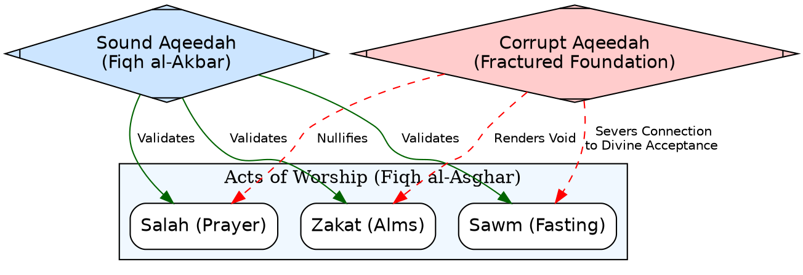
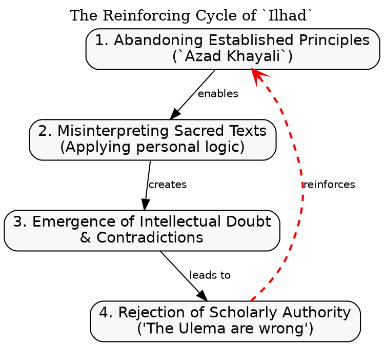
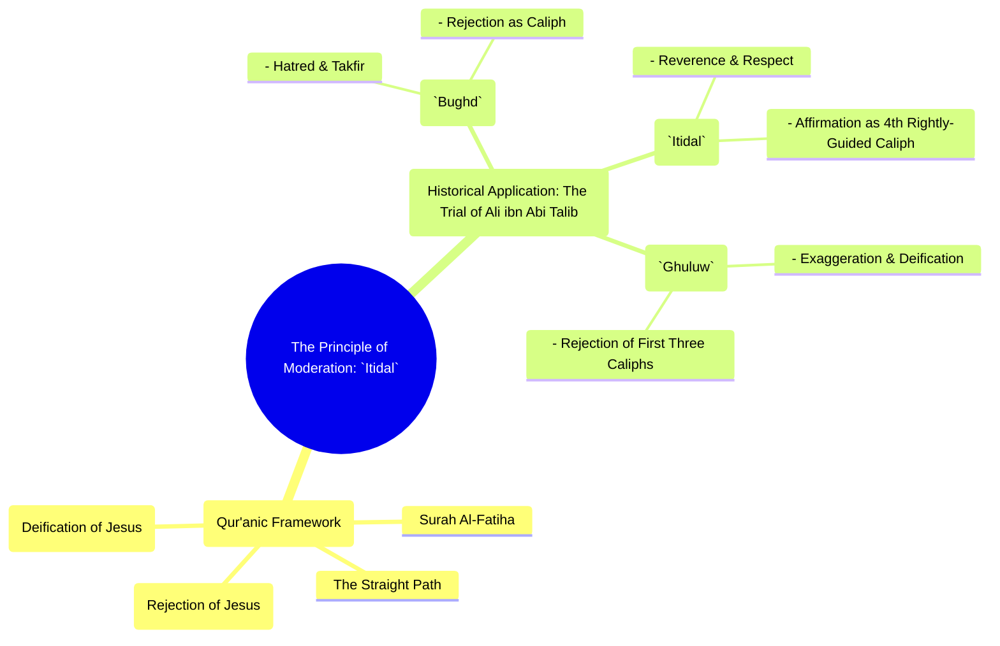
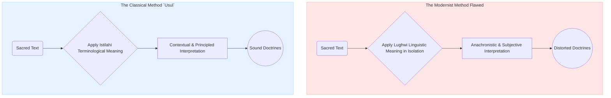
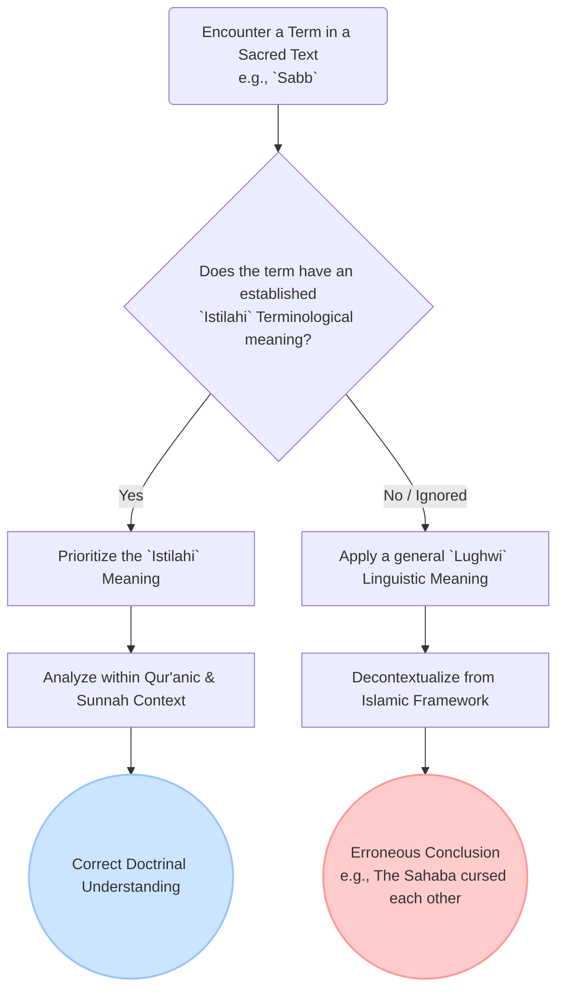
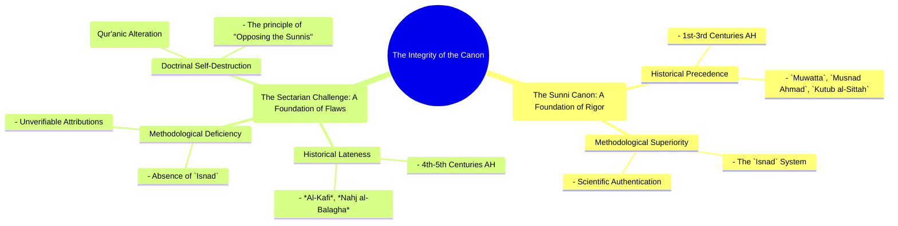
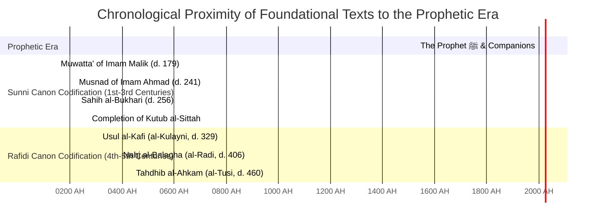
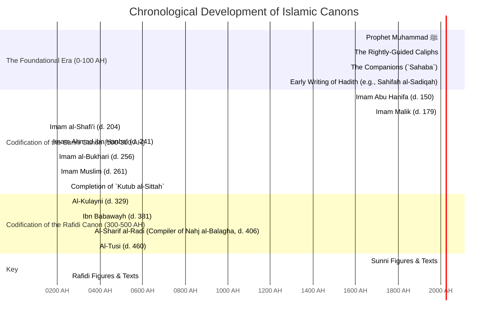

# Aqaid o Nazariyat Course - Ghulam Rasool Qasmi

---

## Chapter 1

### The Primacy of Creed (`Aqeedah`): The Foundation of Faith and Action

#### The Big Idea

In Islam, belief is the root and action is the branch. A tree can have beautiful branches and leaves, but if its roots are rotten, the entire tree is dead and worthless. In the same way, a person's good deeds and acts of worship, no matter how numerous, are only considered valid and worthy of reward by God if they grow from the firm root of correct belief (`Aqeedah`). This chapter explains why this root is the most important part of faith.

***

#### Executive Summary & Key Arguments

*   **Thesis:** The validity and divine acceptance of all human actions are contingent upon the soundness of the underlying creed (`Aqeedah`). A flaw in the foundational beliefs nullifies the value of all subsequent acts of worship and good deeds.

*   **Key Arguments:**
    1.  **The Hierarchy of Knowledge:** Classical Islamic theology establishes a clear hierarchy wherein the science of belief, termed `Al-Fiqh al-Akbar` (The Greater Jurisprudence), holds absolute primacy over the science of actions, `Al-Fiqh al-Asghar` (The Lesser Jurisprudence).
    2.  **The Prophetic Precedent:** The Sunnah provides irrefutable evidence that the Prophet Muhammad ﷺ prioritized creedal integrity over all other considerations, including immediate worldly or strategic utility.
    3.  **The Thematic Core of Revelation:** A structural analysis of the Qur'an reveals that its primary and most recurring theme is the establishment and reinforcement of `Aqeedah`, with all other subjects being secondary to this central purpose.
    4.  **The Methodological Imperative:** The correct methodology for Islamic study and discourse is to begin with the foundational principles of faith (`Tawhid`) before addressing subsidiary matters. A modern "methodological crisis" has inverted this priority, leading to confusion and discord.

*   **Primary Evidence:**
    *   **Conceptual:** The framework of `Fiqh al-Akbar`, attributed to Imam Abu Hanifa.
    *   **Qur'an (47:19):** The command *“Fa’lam annahu la ilaha illallah”* (“So know that there is no deity except Allah”), establishing knowledge of creed as a prerequisite.
    *   **Hadith:** The Prophet’s ﷺ command to a prospective warrior, *“Aslim thumma qātil”* (“First accept Islam, then fight”), demonstrating the non-negotiable status of faith.

***

#### Key Concepts Map

```mermaid
mindmap
  root((Primacy of Aqeedah))
    (Etymology & Meaning)
      ::icon(fa fa-link)
      `Aqd (عقد)`
      The Firm Knot
    (Theological Precedence)
      ::icon(fa fa-balance-scale)
      Fiqh al-Akbar
      (The Greater Jurisprudence)
      Imam Abu Hanifa
      Foundation for All Actions
    (Primacy in Primary Sources)
      ::icon(fa fa-book-open)
      The Qur'an
        Shah Waliullah's Five Themes
        Emphasis on 'Knowing' (fa'lam)
      The Sunnah
        Structure of Sahih al-Bukhari
        Historical Usage of 'Al-Sunnah'
    (Methodology of Study)
      ::icon(fa fa-graduation-cap)
      Classical Approach
        Foundations First (Tawhid)
      Modern Methodological Crisis
    (Contemporary Challenges)
      ::icon(fa fa-shield-alt)
      The Threat of the Internet
      Need for Situational Awareness (`Halaat-e-Hazira`)
```

***

#### Building the Concepts

Before delving into the detailed analysis, it is essential to establish the core terminology. The central concept is **`Aqeedah`**[^1], a term referring to the set of beliefs tied firmly in one's heart, the non-negotiable truths of faith. Classical Islamic scholars gave this science the title **`Al-Fiqh al-Akbar`**[^2], or "The Greater Jurisprudence." They called it this to distinguish it from the rules of daily life and worship, which they termed **`Al-Fiqh al-Asghar`**[^3], or "The Lesser Jurisprudence." The principle is simple: understanding *who* you worship is fundamentally more important than the mechanics of *how* you worship.

> [!QUOTE] The Heart of the Matter`
> "The servant may perform actions as numerous as the mountains, but if they are devoid of the sincerity (`Ikhlas`) that stems from a sound creed, they are but scattered dust in the sight of God. For `Aqeedah` is not merely the mind's assent to truth; it is the heart's orientation toward the True One."

***

#### Detailed Analysis

##### The Ontological Anchor: Defining `Aqeedah`

The intellectual edifice of Islam is anchored in the science of `Aqeedah`. The term itself is derived from the Arabic root `aqd` (عقد), which signifies the act of tying a firm, secure knot. In its theological context, `Aqeedah` thus represents the set of foundational, decisive beliefs that are tied firmly to the heart and mind of a believer, leaving no room for doubt or conjecture. It is the unwavering conviction in the unseen realities (`Iman bil-Ghaib`) that forms the bedrock of a Muslim's entire worldview and dictates the ultimate value of their existence. It is not merely a collection of abstract dogmas but the very lens through which life, purpose, and eternity are understood.

##### The Greater Jurisprudence: `Fiqh al-Akbar`

The early masters of Islamic theology established a critical hierarchy of knowledge, distinguishing between the jurisprudence of belief and the jurisprudence of action. In this framework, the science of `Aqeedah` was designated with the profound title of `Al-Fiqh al-Akbar`.

> [!IMPORTANT] Core Principle`
> **`Al-Fiqh al-Akbar` vs. `Al-Fiqh al-Asghar`:** `Aqeedah` is the "Greater Jurisprudence" because it deals with the foundational principles of faith. All other Islamic sciences, including the rules of prayer, fasting, and transactions—classified as `Al-Fiqh al-Asghar`—are subsequent to and dependent upon it. A flaw in the `Akbar` invalidates the `Asghar`.

The seminal work establishing this principle is the treatise *Al-Fiqh al-Akbar*, attributed to the great Imam Abu Hanifa (d. 150 AH). Its very title is a declaration that the core beliefs about God are of a higher order of importance than the physical acts of worship. This classical understanding posits that if the foundational belief in the One to whom worship is directed is flawed, the acts of worship themselves become a hollow, meaningless ritual.

##### Visual Aid: The Dependency Graph of Faith and Action

This diagram illustrates the core principle of `Fiqh al-Akbar`. All acts of worship (`Fiqh al-Asghar`) are dependent on the sound foundation of `Aqeedah`. If the foundation is compromised (represented by the fractured node), the entire structure of deeds is nullified and rendered void in the sight of God.



##### A Science of Many Names: The Historical Lexicon of Creed

Throughout Islamic history, this essential science has been known by several names, each highlighting a different facet of its nature. Understanding this historical lexicon is crucial to appreciating its scope and countering modern misconceptions. These names include `Ilm al-Aqaid` (The Science of Beliefs), `Imaniyat` (Matters of Faith), `Ilm al-Kalam` (The Science of Discourse), and, most significantly, `Al-Sunnah`. In the early centuries, `Al-Sunnah` was frequently used to mean the correct, normative creed, in opposition to heresy.

> [!TIP] The Scholar's Footnote`
> The classical use of "Al-Sunnah" to denote `Aqeedah` is a vital point of historical hermeneutics. A contemporary polemicist, confined by a purely jurisprudential understanding of the term, might wrongly claim one cannot say "Belief in Allah is Sunnah." This reveals a critical ignorance of classical terminology, where the statement "The affirmation of Abu Bakr and Umar's superiority is Sunnah," as articulated by Sufyan al-Thawri, meant it was a foundational tenet of the correct creed.

##### The Prophetic Paradigm: Inseparability of Belief and Action

The absolute prerequisite of correct belief for the acceptance of any action is not a later theological construct but a principle established by the Prophet Muhammad ﷺ himself. The canonical Hadith literature provides a stark and unambiguous illustration. During a critical moment before a battle, a man of great potential military value approached the Prophet ﷺ. Here, the Prophetic paradigm ruthlessly subordinates all worldly calculus—strategic advantage, military utility, political expediency—to the single, non-negotiable absolute of creedal integrity (`Iman`).

> **Arabic:**
> أسْلِمْ ثُمَّ قَاتِلْ
>
> **Transliteration:**
> *Aslim thumma qātil.*
>
> **English Translation:**
> "First accept Islam, then fight."
>
> *[Reference: A similar narration is found in Sahih al-Bukhari where the Prophet ﷺ states, "We do not seek assistance from a polytheist."]*

> `> [!NOTE] Speaker's Voice`
> *In response to the modern tendency to prioritize utility over creed, the speaker powerfully illustrates the Prophetic absolute:* "The Prophet ﷺ did not form a committee. He did not weigh the pros and cons. He delivered a divine ultimatum: your soul before your sword. This is the foundation."

##### The Thematic Core of the Qur'an

The primacy of `Aqeedah` is further affirmed by a thematic analysis of the Qur'an itself. The celebrated scholar Shah Waliullah Dehlavi (d. 1176 AH), in his masterful work *Al-Fawz al-Kabir fi Usul al-Tafsir*, categorizes the entire subject matter of the Qur'an into five central themes, placing the science of `Aqeedah` at the very head of this list. Indeed, even within the other categories, the narrative consistently circles back to reinforce the core tenets of faith—most notably, the absolute Oneness of God (`Tawhid`).

##### Contemporary Challenges & The Shield of Faith

A critical challenge in the modern era is a dangerous inversion of this classical methodological priority. A troubling trend has emerged where public discourse on `Aqeedah` often bypasses foundational principles in favor of secondary or contentious issues.

> [!WARNING] Point of Deviation`
> The classical methodology, exemplified in seminal texts like *Al-Fiqh al-Akbar*, begins with `Tawhid`. In stark contrast, the modern trend to initiate discussions of `Aqeedah` with topics like the Prophet's knowledge of the unseen (`Ilm al-Ghaib`) is a severe methodological error that neglects the foundation.

This inversion is a departure from the Qur'anic `Manhaj`[^4], which commands knowledge of the foundation first: *“So know that there is no deity except Allah”* (Qur'an 47:19). Protecting the creed today therefore requires a return to this methodology, coupled with a critical awareness of the contemporary intellectual landscape (`Halaat-e-Hazira`), especially the digital realm where statements are instantly decontextualized and weaponized.

***

#### Case Study in Refutation: A Debater's Framework

**The Scenario:** A common secular argument: "A benevolent atheist is better than a hateful religious person. Good deeds are all that matter."

**Applying the Framework:**
1.  **Isolate the Opponent's Flawed Premise:** The argument commits a category error by conflating **societal ethics** with **divine soteriology** (the conditions for salvation). Concede the societal point: "From a worldly perspective, a kind atheist is indeed preferable to a harmful believer. However, the discussion of divine acceptance operates on a different axis entirely."
2.  **Introduce the Decisive Islamic Principle:** State the principle of `Fiqh al-Akbar`. "The Islamic paradigm posits that the ultimate value of an action is determined not by its worldly effect, but by its creedal foundation. An action, to be accepted by God (`maqbul`), must be done *for* God's sake, which presupposes belief *in* God."
3.  **Deploy the Canonical Evidence:** Present the Prophetic precedent as the irrefutable proof-text. "This is a Prophetic absolute. When a man offered his sword in battle, the Prophet's command was not 'Your help is welcome,' but 'First accept Islam, then fight' (`Aslim thumma qātil`). The foundation of creed was non-negotiable."
4.  **Deliver the Conclusive Rebuttal:** Synthesize the argument into a final, clear distinction. "Therefore, while Islam commands Muslims to be paragons of societal ethics, it maintains a clear theological reality. Good deeds without `Iman` may earn a person praise in *this* world (`dunya`), but they do not meet the foundational condition for reward in the hereafter (`akhirah`), which is a sound `Aqeedah`."

***

#### Chapter Summary: The Key Takeaways

*   `Aqeedah` is the firm, foundational knot of belief that gives meaning and validity to all other aspects of Islam.
*   Classical scholars designated it `Fiqh al-Akbar` to emphasize its absolute primacy over the jurisprudence of actions (`Fiqh al-Asghar`).
*   The Qur'an and Sunnah thematically prioritize the establishment of correct belief over all else.
*   The correct methodology for studying `Aqeedah` is to begin with the most foundational principles, such as `Tawhid`, before moving to subsidiary issues.
*   Protecting one's creed today requires deep knowledge of the primary sources and a critical awareness of contemporary ideological challenges.

***

#### Thinking Deeper & Further Reading

1.  The principle of `Fiqh al-Akbar` suggests that a person could perform all the rituals of Islam perfectly but still be considered bankrupt if their `Aqeedah` is flawed. How does this principle challenge the modern, often action-centric, understanding of what it means to be a "good Muslim"?
2.  The speaker warns of a "methodological crisis" where secondary issues are given precedence over foundational ones. Can you identify examples of this phenomenon in online discussions or modern Islamic discourse? What are the potential dangers of this inversion?

**Further Reading:**
*   *Al-Fiqh al-Akbar* - Attributed to Imam Abu Hanifa.
*   *Al-Fawz al-Kabir fi Usul al-Tafsir* - Shah Waliullah Dehlavi.
*   *Sharh al-Aqa'id al-Nasafiyyah* - Imam al-Taftazani.

---
[^1]: **`Aqeedah` (عقيدة):** From the Arabic root meaning "to tie a knot." Theologically, it refers to the foundational, non-negotiable tenets of Islamic belief that are held with firm conviction.
[^2]: **`Al-Fiqh al-Akbar` (الفقه الأكبر):** Literally "The Greater Jurisprudence." The science dealing with the core tenets of faith.
[^3]: **`Al-Fiqh al-Asghar` (الفقه الأصغر):** Literally "The Lesser Jurisprudence." The science dealing with the practical rulings of worship and transactions.
[^4]: **`Manhaj` (منهج):** A clear and established path, way, or methodology.


---
---
---

## Chapter 2

### The Atheist Challenge: Deconstructing the Modus Operandi of Modern `Ilhad`

#### **The Big Idea**

Modern atheism often presents itself as the only logical choice for intelligent people, using the banners of "science" and "progress" to attack religion. This chapter deconstructs that claim, showing that this is a false choice. It argues that the conflict is not between science and religion, but between two different worldviews: one based on observable facts and divine certainty, and another based entirely on guesswork, theory, and doubt. The chapter reveals the step-by-step process through which intellectual deviation occurs and presents the Islamic paradigm of `Yaqeen` (certainty) as the ultimate anchor against the chaos of doubt.

***

#### **Executive Summary & Key Arguments**

*   **Thesis:** Modern atheism (`Ilhad`) is not a genuine intellectual alternative grounded in superior reason, but a system of thought based on categorical errors, the deliberate mischaracterization of both science and religion, and a foundational reliance on conjecture over certainty.

*   **Key Arguments:**
    1.  **The False Dichotomy of Science vs. Religion:** Atheism creates an artificial conflict by failing to recognize that science and religion operate in different domains. Science addresses the *how* of the physical world (`mahsusaat`), while religion addresses the *why* of existence and the metaphysical realm (`ghayb`).
    2.  **The Hijacking of "Progress":** The term "progress" is narrowly redefined in purely materialistic terms, ignoring the spiritual, ethical, and psychological well-being that constitutes true human advancement. True progress is the attainment of inner peace (`sukun-e-qalb`), a state achieved through faith, not wealth.
    3.  **The Foundation of Doubt:** All non-Islamic worldviews, including atheism, are ultimately based on conjecture (`Zann`) and theory (e.g., the Big Bang, Darwinism). In contrast, Islam is founded upon `Yaqeen` (certainty) derived from divine revelation, offering a stable and coherent worldview.
    4.  **The Anatomy of Deviation:** The descent into disbelief is a predictable, multi-stage process: it begins with abandoning established principles (`Azad Khayali`), proceeds to a wholesale rejection of scholarly authority (`Ulema`), and culminates in attacking the foundational transmitters of the faith (`Sahaba`).

*   **Primary Evidence:**
    *   **Rational:** The argument that the Creator of a system is by definition outside of and incomprehensible to the system itself.
    *   **Qur'an (2:257 & 6:1):** The metaphor of `An-Nur` (the singular Light of Islam) versus `Az-Zulumaat` (the manifold darknesses of disbelief), illustrating the unity of truth against the fragmentation of falsehood.

***

#### **Key Concepts Map**

```mermaid
mindmap
  root((The Atheist Challenge (`Ilhad`)))
    (Core Arguments & Rebuttals)
      ::icon(fa fa-atom)
      Science vs. Religion
        - Fallacy: Mutual Exclusivity
        - Rebuttal: Different Domains (Physical vs. Metaphysical)
      ::icon(fa fa-chart-line)
      Progress vs. Religion
        - Fallacy: Materialistic Definition
        - Rebuttal: True Progress is Inner Peace (`Sukun`)
      ::icon(fa fa-question-circle)
      Humanity as Religion
        - Fallacy: False Equivalence
        - Rebuttal: Ignores Revealed Moral Hierarchy
    (The Anatomy of Deviation)
      ::icon(fa fa-shoe-prints)
      Stage 1: `Azad Khayali` (Unfettered Thinking)
      Stage 2: Rejection of Scholarly Authority (`Ulema`)
      Stage 3: Attack on the Companions (`Sahaba`)
    (The Foundational Paradigm)
      ::icon(fa fa-lightbulb)
      Islam: `Yaqeen` (Certainty)
        - `An-Nur` (The One Light)
        - Revelation as a Confirmed Source
      ::icon(fa fa-cloud)
      Disbelief: `Zann` (Conjecture)
        - `Az-Zulumaat` (The Many Darknesses)
        - Theory & Guesswork (Darwinism, Big Bang)
```

***

#### **Building the Concepts**

This chapter analyzes the challenge of **`Ilhad`**[^1], the Arabic term for atheism or heresy, which denotes a deviation from the true path. A central theme is the refutation of **`Maddiyat`**[^2] (Materialism), the belief that only the physical world is real. The intellectual process of this deviation often begins with what is termed **`Azad Khayali`**[^3] (Unfettered Free-Thinking), the rejection of established principles in the name of independent inquiry. This entire system of doubt is contrasted with the Islamic foundation of **`Yaqeen`**[^4] (Certainty), which is derived from revelation, as opposed to **`Zann`**[^5] (Conjecture), which is the basis of all atheistic and polytheistic thought.

> [!QUOTE] The Heart of the Matter`
> "The materialist seeks progress in the accumulation of things, only to find his soul empty. The believer seeks progress in the remembrance of God, only to find his heart overflowing with peace. One path leads to the anxiety of endless acquisition; the other leads to the tranquility of certain faith."

***

#### **Detailed Analysis**

##### **The False Banners of Science and Progress**

The primary intellectual assault of modern `Ilhad` is waged under two banners: "Science" and "Progress." The core claim is that religion is an archaic impediment to both. This argument, however, is built upon a deliberate and fallacious mischaracterization of each term.

The assertion that religion hinders science is a categorical error. Science, by its own definition, is a methodology for investigating the observable, repeatable, and falsifiable phenomena of the physical world (`mahsusaat`). Its domain is the material universe. Religion, while acknowledging the physical world, has as its primary domain the metaphysical (`ghayb`): questions of ultimate purpose, morality, the nature of God, and the reality of the soul.

> [!IMPORTANT] Core Principle`
> **Non-Competing Domains:** Science addresses the *how* of physical processes. Religion addresses the *why* of existence. They are not two competing answers to the same question; they are answers to two fundamentally different categories of questions. An atheist demanding empirical proof for God is making as little sense as a theologian demanding a moral justification from the law of gravity.

Similarly, the term "progress" is hijacked and confined to a purely materialistic definition: economic growth, technological advancement, and the accumulation of wealth. This definition conveniently ignores the manifest spiritual and psychological decay that often accompanies such "progress." True human progress is the attainment of `sukun-e-qalb` (peace of the heart), a state of inner tranquility and moral certitude. By this metric, a society plagued by anxiety, depression, and moral relativism, no matter how technologically advanced, is in a state of profound regression.

##### **Visual Aid: The Causal Loop of Deviation**

This diagram models the "Anatomy of Deviation" as a reinforcing, vicious cycle. Each stage feeds the next, creating a downward spiral that moves a person from intellectual curiosity to a hardened rejection of faith.



##### **The Anatomy of Deviation: A Three-Stage Descent**

The path to `Ilhad` is not a sudden leap but a gradual descent, typically occurring in three distinct stages:

1.  **`Azad Khayali` (Unfettered Free-Thinking):** This is the initial and most critical stage. It begins with a rejection of the established `Usul` (principles) of the Islamic sciences—`Usul al-Tafsir`, `Usul al-Hadith`, `Usul al-Fiqh`. Under the guise of "independent research" and "breaking free from tradition," the individual unmoors themselves from the 1400-year-old intellectual tradition designed to prevent error. This stage is exemplified by modern works like the *Mizan*, which attempt to create an entirely new set of principles to replace the established ones, thereby aiming to shift the entire paradigm of Islamic thought.

2.  **Rejection of Scholarly Authority (`Ulema`):** Once the principles are discarded, the individual inevitably finds their own conclusions at odds with the consensus of the `Ulema` (scholars). To resolve this cognitive dissonance, the second stage is to launch a wholesale attack on the scholarly class itself, dismissing them as "Mullahs," "traditionalists," or "out of touch." This is a necessary step to invalidate the guardians of the tradition that one has just abandoned.

3.  **Attack on the Companions (`Sahaba`):** The final, logical conclusion of this trajectory is to attack the very foundation of the religion's transmission: the `Sahaba` (Companions of the Prophet ﷺ). If the Qur'an and Sunnah, as transmitted through the consensus of the `Ulema` for centuries, still contradict one's conclusions, the only remaining option is to claim that the original transmitters were themselves corrupt, unreliable, or had apostatized. This is the ultimate act of intellectual demolition, as it destroys the very possibility of knowing what the religion truly is.

##### **The Certainty of Light vs. the Conjectures of Darkness**

The final and most powerful refutation of `Ilhad` lies not in debating its secondary claims, but in exposing its flawed epistemological foundation. The Qur'an presents a profound paradigm: truth is a singular `Nur` (Light), while falsehood consists of manifold `Zulumaat` (Darknesses).

> **Arabic:**
> اللَّهُ وَلِيُّ الَّذِينَ آمَنُوا يُخْرِجُهُم مِّنَ الظُّلُمَاتِ إِلَى النُّورِ
>
> **Transliteration:**
> *Allahu waliyyul-ladheena amanu yukhrijuhum minadh-dhulumati ilan-nur.*
>
> **English Translation:**
> "Allah is the ally of those who believe. He brings them out from darknesses into the light."
>
> *[Reference: Surah Al-Baqarah, 2:257]*

> [!NOTE] Speaker's Voice`
> *In a powerful synthesis of this Qur'anic principle, the speaker issues a direct challenge:* "All systems of disbelief—atheism, polytheism, modern 'isms'—share one common ancestor: conjecture (`Zann`). Darwinism? A theory. The Big Bang? A theory. They are all elaborate systems of guesswork. Islam alone is founded on `Yaqeen` (Certainty) derived from `Wahy` (Revelation). They are a multitude of darknesses, united only by their doubt. We are a singular light, united by our certainty."

This is the ultimate distinction. The claims of atheism, when scrutinized, are not statements of fact but are based on unproven, and often unprovable, theories. They are systems of `Zann`. Islam, by contrast, grounds its worldview in a source that it holds to be certain and divinely confirmed. The choice, therefore, is not between an "unscientific" faith and a "scientific" lack of faith, but between a worldview of divine certainty and a worldview of perpetual human conjecture.

***

#### **Case Study in Refutation: A Debater's Framework**

**The Scenario:** The common atheist assertion: "Science has disproven God" or "There is no scientific evidence for God."

**Applying the Framework:**
1.  **Isolate the Opponent's Flawed Premise:** The argument is based on a category error. It wrongly assumes that God is a physical, empirical object within the universe that can be detected by the tools of science.
2.  **Introduce the Decisive Islamic Principle:** State the principle of non-competing domains. "Science is the study of the physical creation. God, by definition, is the non-physical Creator. You are demanding that a tool designed to measure the contents of a painting be used to measure the painter himself. The tool is simply not applicable to the subject."
3.  **Deploy the Rational Evidence:** Use the core logical argument. "The creator of any system is, by definition, external to and greater than the system he created. The laws of physics are part of the created system; therefore, the Creator cannot be subject to or measurable by those laws. The absence of evidence within the system is not evidence of absence of a Creator outside the system."
4.  **Deliver the Conclusive Rebuttal:** Turn the argument back on the opponent's own epistemology. "Your demand for 'scientific evidence' is itself an unscientific premise. You are asking science to operate outside of its own defined limits. The claim that science has disproven God is therefore a philosophical statement of faith in materialism, not a scientific conclusion."

***

#### **Chapter Summary: The Key Takeaways**

*   The atheist argument that religion is incompatible with science and progress is based on a deliberate mischaracterization of both concepts.
*   The descent into disbelief (`Ilhad`) is a predictable three-stage process: abandoning principles, rejecting scholars, and finally, attacking the Companions.
*   The fundamental difference between Islam and all forms of disbelief is epistemological: Islam is based on divine certainty (`Yaqeen`), while disbelief is based on human conjecture (`Zann`).
*   The Qur'an illustrates this through the metaphor of a single, unified Light (`An-Nur`) of truth versus the many, fragmented darknesses (`Az-Zulumaat`) of falsehood.

***

#### **Thinking Deeper & Further Reading**

1.  The speaker argues that all forms of disbelief are united by their reliance on conjecture. How can this principle be applied to analyze other modern ideologies beyond atheism (e.g., political 'isms', secular philosophies)?
2.  The "Causal Loop of Deviation" suggests that the first step away from faith is the rejection of established principles (`Usul`). In a world that celebrates "thinking for yourself," how does one balance healthy critical thinking with the discipline of adhering to foundational principles?

**Further Reading:**
*   *Al-Munqidh min al-Dalal* (Deliverance from Error) - Imam al-Ghazali. (A classic spiritual and intellectual autobiography detailing a journey from profound doubt to certainty).
*   *Kitab al-Tawhid* - Imam al-Maturidi. (A foundational text of Sunni `Kalam` that uses rational arguments to establish the tenets of faith).
*   *The Language of God: A Scientist Presents Evidence for Belief* - Francis S. Collins. (A modern perspective from a leading scientist on the compatibility of faith and science).

---
[^1]: **`Ilhad` (إلحاد):** Atheism, heresy, or deviation. From a root meaning "to incline away from" the straight path.
[^2]: **`Maddiyat` (مادية):** Materialism. The philosophical belief that nothing exists beyond the material world.
[^3]: **`Azad Khayali` (آزاد خيالي):** Literally "free-thinking." In this context, it refers to the rejection of established intellectual and religious principles in favor of unfettered personal reasoning.
[^4]: **`Yaqeen` (يقين):** Certainty. A state of unwavering conviction, free from any doubt, that is considered the hallmark of true faith (`Iman`).
[^5]: **`Zann` (ظن):** Conjecture, assumption, or opinion that is not based on certainty. The Qur'an often criticizes non-believers for "following nothing but conjecture."

---
---
---

## **Chapter 3**

### The Path of Moderation: Navigating the Extremes of Rafidism and Kharijism

#### The Big Idea

The "Straight Path" of Islam is a path of balance, not extremism. Just as a tightrope walker falls if they lean too far to the left or the right, a believer deviates if they fall into extremes of love or hatred. This chapter explores two of the earliest and most significant deviations in Islamic history: the Kharijites, who went to an extreme of hatred, and the Rafidites, who went to an extreme of love. It demonstrates how the mainstream Sunni path (`Ahl al-Sunnah`) is the carefully preserved middle way, the path of moderation that honors all the family and companions of the Prophet ﷺ without exaggeration or denigration.

***

#### Executive Summary & Key Arguments

*   **Thesis:** The Sunni (`Ahl al-Sunnah`) position is theologically and historically the path of moderation (`Itidal` or `Wasatiyyah`), representing the balanced mean between the diametrically opposed heresies of the Khawarij (extremist rejection) and the Rawafid (extremist veneration).

*   **Key Arguments:**
    1.  **The Qur'anic Paradigm of Moderation:** Surah Al-Fatiha establishes the "Straight Path" as a middle way, distinct from the path of the Jews (who rejected and vilified prophets like Jesus) and the Christians (who exaggerated their status to the point of divinity). This provides the foundational paradigm for identifying truth versus deviation.
    2.  **The Prophetic Analogy:** The Prophet Muhammad ﷺ himself prophesied that the community would divide over his cousin and son-in-law, Ali ibn Abi Talib, in a manner analogous to the division over Jesus Christ. Two groups would be destroyed concerning him: one due to excessive, blind love (`Ghuluw`) and the other due to excessive, baseless hatred (`Bughd`).
    3.  **Systematic Doctrinal Opposition:** The core tenets of Kharijism and Rafidism are perfect mirror-image deviations from the Sunni creed. On every key issue—the status of the Caliphs, the definition of the Prophet's family (`Ahl al-Bayt`), the fate of a major sinner—they represent opposite extremes, while the Sunni position consistently occupies the balanced center.
    4.  **Consensus as the Litmus Test:** The path of moderation is validated by its adherence to the `Sawad al-A'dham` (the great majority/main body of the Ummah), a principle that both Kharijism (due to its isolationism) and Rafidism (due to its esoteric nature) fail to meet.

*   **Primary Evidence:**
    *   **Qur'an (1:6-7):** The verses of Surah Al-Fatiha establishing the "Straight Path."
    *   **Hadith (Musnad Ahmad):** The Prophet’s ﷺ statement to Ali: *“In you there is a likeness to Jesus.”*
    *   **Sayings of Ali ibn Abi Talib:** His own statements, recorded in both Sunni sources and the Shia text *Nahj al-Balagha*, confirming that two groups would deviate concerning him.

***

#### Key Concepts Map



***

#### Building the Concepts

This chapter analyzes the historical and theological deviations of the **`Khawarij`**[^1] ("Those who Exited") and the **`Rawafid`**[^2] ("The Rejectors"). The Kharijites were a group that rebelled against the fourth Caliph, Ali ibn Abi Talib, declaring him and other Companions to be disbelievers. The Rafidites are a branch of Shia Islam known for their rejection of the first three Caliphs and their extreme veneration of Ali. Their respective deviations are characterized by **`Bughd`**[^3] (hatred) and **`Ghuluw`**[^4] (extremist love/exaggeration). The correct path, maintained by the `Ahl al-Sunnah`, is one of **`Itidal`**[^5] (equilibrium or moderation), which harmonizes love and respect for all the Companions and the Prophet's family.

> [!QUOTE] The Heart of the Matter`
> "The love for the Family of the Prophet (`Ahl al-Bayt`) and the love for his Companions (`Sahaba`) are not two competing loyalties that must be balanced. They are two streams flowing from a single spring: the love for the Prophet Muhammad ﷺ himself. To love one at the expense of the other is to misunderstand the spring from which they both flow."

***

#### Detailed Analysis

##### **The Qur'anic Paradigm of the Straight Path**

The foundational principle of moderation is embedded in the heart of Muslim prayer, Surah Al-Fatiha. The plea, *“Guide us to the Straight Path”* (`Ihdinas-Sirat al-Mustaqim`), is immediately qualified by defining what it is not: *“The path of those upon whom is Your anger, nor of those who are astray”* (`Ghayril-maghdubi 'alayhim wa lad-dallin`). Classical exegesis, supported by Prophetic Hadith, identifies "those upon whom is Your anger" as the Jews and "those who are astray" as the Christians.

This distinction is not arbitrary. It establishes a theological paradigm centered on the figure of Jesus Christ. The former group rejected and vilified him, while the latter exaggerated his status to the point of divinity. The "Straight Path" of Islam, therefore, was to affirm the truth: that Jesus was a noble Messenger of God, neither a charlatan nor a deity. This act of affirming the balanced truth between two opposite extremes is the very definition of Islamic `Itidal`.

##### **A Prophetic Analogy: The Trial of Ali ibn Abi Talib**

This exact paradigm was prophesied by the Prophet Muhammad ﷺ to recur within his own Ummah, centered on the person of his cousin and son-in-law, Ali ibn Abi Talib. In a profound narration, the Prophet ﷺ told him:

> **Arabic:**
> إِنَّ فِيكَ مَثَلًا مِنْ عِيسَى
>
> **Transliteration:**
> *Inna feeka mathalan min 'Isa.*
>
> **English Translation:**
> "Verily, in you there is a likeness to Jesus."
>
> *[Reference: Musnad Ahmad]*

The likeness was not in their persons, but in their trial. The Prophet ﷺ explained that just as two groups were destroyed over Jesus, two groups would be destroyed over Ali. This was confirmed by Ali ibn Abi Talib himself, who is reported to have said:

> **Arabic:**
> يَهْلِكُ فِيَّ رَجُلَانِ: مُحِبٌّ مُفْرِطٌ وَمُبْغِضٌ مُفْتَرٍ
>
> **Transliteration:**
> *Yahlaku fiyya rajulān: muhibbun mufritun wa mubghidun muftarin.*
>
> **English Translation:**
> "Two types of men will be destroyed concerning me: an exaggerating lover who elevates me beyond my right, and a fabricating hater who despises me."
>
> *[Reference: A similar statement is found in both Sunni sources and the Shia text Nahj al-Balagha, خطبة 127]*

> [!NOTE] Speaker's Voice`
> *In analyzing Ali's statement from Nahj al-Balagha, the speaker highlights a subtle but critical textual variance:* "The Sunni narration condemns any `muhibbun mufrit` (exaggerating lover) and any `mubghid` (hater). The version in *Nahj al-Balagha* condemns a `mubghid mufrit` (an *exaggerating* hater). The omission of this qualifier in the Sunni version is theologically precise: *any* hatred for Ali is deviation, not just an 'exaggerated' form of it. The path of truth allows for no such compromise."

##### **The Doctrines of Deviation: A Comparative Analysis**

The prophetic analogy is borne out by a systematic comparison of Khariji and Rafidi doctrines. They are not merely different from the Sunni position; they are perfect, mirror-image opposites, with the Sunni path consistently occupying the rational and just middle ground.

| Issue | The Khariji Extreme (`Bughd`) | The Rafidi Extreme (`Ghuluw`) | The Sunni Path of Moderation (`Itidal`) |
| :--- | :--- | :--- | :--- |
| **Status of Ali ibn Abi Talib** | Declared him a disbeliever (`kafir`) and an illegitimate ruler. | Elevate him to a divinely appointed, infallible Imam, superior to other prophets. Reject the first three Caliphs. | Revere him as the fourth of the Rightly-Guided Caliphs (`Khulafa al-Rashidun`), affirming the legitimacy of all four in their proper sequence. |
| **Definition of `Ahl al-Bayt`** | Narrowly define it to exclude key figures like Ali, Hasan, and Husayn, viewing them as part of a corrupt political dynasty. | Narrowly define it to exclude the wives of the Prophet ﷺ, despite the Qur'anic context of the Verse of Purification (33:33). | Broadly define it to include both the wives of the Prophet ﷺ (as per the Qur'an) and Ali, Fatima, Hasan, and Husayn (as per the Hadith of the Cloak). |
| **Stance on Major Sins** | A Muslim who commits a major sin becomes a disbeliever (`kafir`) and is condemned to Hell eternally. | Certain sins, like lying to protect the faith (`Taqiyyah`), are elevated to acts of worship. | A Muslim who commits a major sin is a flawed believer (`fasiq`), not a disbeliever. Their fate is in God's hands; they are not eternally condemned. |
| **Stance on the `Sahaba`** | Declared a large number of Companions, including Uthman and Ali, to be disbelievers. | Declare the vast majority of Companions, except a handful, to be apostates who usurped the rights of Ali. | Revere all Companions, refrain from passing judgment on their disputes, and affirm their collective integrity as the transmitters of the faith. |

##### **Visual Aid: The Spectrum of Belief**

This diagram visually represents the theological positions concerning the Companions and the Family of the Prophet. It illustrates how Sunni Islam occupies the balanced center, avoiding the extremes of wholesale rejection and divine elevation.

```mermaid
gantt
    title Spectrum of Belief Regarding the Sahaba & Ahl al-Bayt
    dateFormat  X
    axisFormat %s

    section Positions
    The Khariji Extreme (Bughd) :crit, pos1, 0, 2
    The Sunni Middle Path (Itidal) :active, pos2, 2, 6
    The Rafidi Extreme (Ghuluw) :crit, pos3, 6, 8

    section Key Tenets
    Rejection of Uthman & Ali : milestone, after pos1, 1
    Reverence for ALL Sahaba & Ahl al-Bayt : milestone, after pos2, 1
    Rejection of First Three Caliphs : milestone, after pos3, 1
```



***

#### **Case Study in Refutation: A Debater's Framework**

**The Scenario:** The common Rafidi accusation: "You Sunnis claim to love the `Ahl al-Bayt`, but your love is weak. You dilute it by also loving their enemies (i.e., other Sahaba)."

**Applying the Framework:**
1.  **Isolate the Opponent's Flawed Premise:** The argument is based on a false dichotomy—that love for the `Ahl al-Bayt` and love for the `Sahaba` are mutually exclusive. It frames the history of Islam as a simplistic story of heroes and villains.
2.  **Introduce the Decisive Islamic Principle:** State the foundational principle of Sunni love. "Our love is not partisan. The `Ahl al-Sunnah` do not choose sides between the family and the companions of the Prophet ﷺ. Our love for *both* is a non-negotiable consequence of our love for the Prophet ﷺ himself. We love whom he loved, and we honor whom he honored."
3.  **Deploy the Canonical Evidence:** Present the comprehensive nature of the Sunni position. "The Sunni creed is the only one that affirms the Verse of Purification for the Prophet's wives and the Hadith of the Cloak for Ali, Fatima, Hasan, and Husayn. It is the only creed that affirms the virtues of Abu Bakr, Umar, and Uthman *and* defends the honor of Ali. We embrace the totality of the Prophetic legacy, not a factionalized portion of it."
4.  **Deliver the Conclusive Rebuttal:** Reframe the argument to expose the opponent's weakness. "The question is not why our love is 'diluted,' but why your love is so narrow that it requires you to hate the very men the Prophet ﷺ called his closest companions, his fathers-in-law, and his sons-in-law. The Sunni path is one of comprehensive love; the Rafidi path is one of selective love and extensive hatred. That is not a strength; it is a creedal deficiency."

***

#### **Chapter Summary: The Key Takeaways**

*   The "Straight Path" of Islam is a path of moderation (`Itidal`), avoiding the extremes of both excessive love (`Ghuluw`) and excessive hatred (`Bughd`).
*   The Kharijites and the Rafidites represent these two opposite extremes, respectively, particularly concerning the person of Ali ibn Abi Talib.
*   The Sunni creed is demonstrably the balanced middle way, affirming the honor of all the Prophet's Companions and his entire family without exception.
*   This moderation is not a compromise but a principled stance derived directly from the Qur'an and the Sunnah, which requires embracing the totality of the Prophetic legacy.

***

#### **Thinking Deeper & Further Reading**

1.  The speaker argues that these historical deviations are rooted in extremist emotions (hatred and exaggerated love). In what ways do you see similar emotional extremes driving division and sectarianism among Muslims today, even on issues not related to the `Sahaba`?
2.  The principle of `Itidal` requires holding complex truths in balance (e.g., affirming the virtues of Ali while also affirming the legitimacy of the Caliphs before him). Why is it often more psychologically appealing for people to adopt a simpler, more black-and-white narrative of "heroes and villains"?

**Further Reading:**
*   *Al-Farq bayn al-Firaq* (The Difference Between the Sects) - Abd al-Qahir al-Baghdadi. (A classical work of heresiography detailing the beliefs of various Islamic sects).
*   *Al-'Awasim min al-Qawasim* (Defense Against the Calamities) - Qadi Abu Bakr ibn al-'Arabi. (A historical and theological defense of the Companions against sectarian attacks).
*   *The Heirs of the Prophet: Charisma and Religious Authority in Shi'ite Islam* - Liyakat N. Takim. (A modern academic perspective on the development of Shia thought, useful for understanding the opposing view).

---
[^1]: **`Khawarij` (الخوارج):** Literally "Those who Exited." An early sect that declared rebellion against Ali ibn Abi Talib, holding that a Muslim who commits a major sin is no longer a Muslim.
[^2]: **`Rawafid` (الروافض):** Literally "The Rejectors." A term for branches of Shia Islam that reject the legitimacy of the first three Caliphs and often hold extreme views about the status of their Imams.
[^3]: **`Bughd` (بغض):** Animosity, malice, or intense hatred. The defining characteristic of the Khariji stance towards many Companions.
[^4]: **`Ghuluw` (غلو):** Extremism, exaggeration, or elevation of someone beyond their proper status. The defining characteristic of the Rafidi stance towards their Imams.
[^5]: **`Itidal` (اعتدال):** Moderation, equilibrium, justice, and the balanced middle path. The defining characteristic of the `Ahl al-Sunnah`.


---
---
---

## **Chapter 4**

### **The Crisis of Interpretation: `Usul` vs. the Modernist Method**

#### **The Big Idea**

Words have specific meanings that depend on context. The word "fire" means one thing to a firefighter and another to a boss telling an employee "You're fired!" To understand any text correctly—whether a legal document or a sacred scripture—one must understand the technical, specialized meanings of its words, not just their dictionary definitions. This chapter argues that a major intellectual crisis in modern Islamic thought comes from scholars who ignore the established, classical principles (`Usul`) of interpretation. By applying simplistic, literal, or anachronistic meanings to the technical vocabulary of the Qur'an and Hadith, they distort the faith and arrive at dangerously flawed conclusions.

***

#### **Executive Summary & Key Arguments**

*   **Thesis:** The abandonment of the classical principles (`Usul`) of Islamic hermeneutics in favor of a modernist, pseudo-literalist approach is the primary source of contemporary interpretive error. This flawed methodology inevitably leads to the distortion of core Islamic doctrines.

*   **Key Arguments:**
    1.  **The Fallacy of Linguistic Literalism:** The fundamental error is the failure to distinguish between a word's general linguistic meaning (`Lughwi`) and its precise, technical-terminological meaning within the sacred texts (`Istilahi` or `Shar'i`). Islamic sciences are built upon a rich technical vocabulary that cannot be understood by merely consulting a dictionary.
    2.  **Systematic Misinterpretation of Key Terms:** This flawed methodology is not random but results in the systematic misreading of critical terms, leading to specific doctrinal deviations. Key examples include:
        *   **`Sabb` (سب):** Mistranslated as "vulgar cursing" to create a false narrative of conflict, when its classical usage often meant "sharp critique" or "rebuke."
        *   **`Qabr` (قبر):** Misinterpreted as a purely spiritual realm (`Barzakh`) to deny physical realities of the grave, despite overwhelming textual evidence to the contrary.
        *   **`Ahl al-Bayt` (أهل البيت):** Narrowly defined to exclude the Prophet's wives, in direct contradiction to the Qur'anic context.
        *   **`Imam` (إمام):** A general term for "leader" that is transformed by Rafidi theology into a title for a divinely infallible being with prophetic attributes.
    3.  **The Necessity of a Regulated Framework:** Just as constitutional law requires a specific interpretive framework to prevent chaos, the Qur'an and Hadith require the sciences of `Usul` to protect them from subjective and arbitrary interpretations. The alternative is intellectual anarchy.

*   **Primary Evidence:**
    *   **Lexical Analysis from Hadith:** Demonstrations from *Sahih al-Bukhari* showing the classical usage of terms like `Sabb` in contexts where "vulgar cursing" is an impossible meaning.
    *   **Contextual Analysis from Qur'an:** Examination of the verses on `Ahl al-Bayt` (33:33) and the numerous verses mentioning physical graves (`qubur`) to refute modernist misreadings.

***

#### **Key Concepts Map**



***

#### **Building the Concepts**

This chapter centers on the foundational principles of Islamic interpretation, known as **`Usul`**[^1]. The core argument is the critical distinction between a word's **`Lughwi`**[^2] (linguistic or dictionary) meaning and its **`Istilahi`**[^3] (technical or terminological) meaning as established by the Qur'an and Sunnah. The modernist approach, which often privileges the `Lughwi` meaning, is shown to be a departure from the classical `Manhaj` (methodology) and a primary cause of doctrinal error. This is contrasted with the rigorous, context-sensitive approach of the `Ahl al-Sunnah`, which is grounded in `Usul`.

> [!QUOTE] The Heart of the Matter`
> "The Qur'an is an ocean. The `Usul` are the science of navigation. A man who sets sail upon this ocean without the tools of navigation, armed only with a dictionary, will not discover new lands. He will simply be lost at sea, mistaking every wave for a shore and every mirage for a destination."

***

#### **Detailed Analysis**

##### **The Prerequisite of a Framework: Interpretation is Not a Free-for-All**

No serious text, whether legal, philosophical, or scientific, can be understood without a regulatory framework. The constitution of a nation is not open to the arbitrary interpretation of every citizen; it is interpreted by trained jurists according to established legal principles. To deny this necessity for the Qur'an and Hadith is to afford them less intellectual respect than a man-made legal document.

The classical scholars of Islam developed the sciences of `Usul` for this very reason: to create a robust, consistent, and intellectually defensible methodology for deriving meaning from the sacred texts. This framework protects the texts from two primary dangers: the ignorance of the well-intentioned and the deliberate distortion of the ill-intentioned. The modernist trend of dismissing these principles as "outdated tradition" is, in reality, an attempt to dismantle the intellectual firewall of the faith, leaving it exposed to unchecked subjectivity.

##### **The Core Error: Linguistic vs. Terminological Meaning**

The most fundamental and pervasive error of the modernist interpretive method is its failure to distinguish between the `Lughwi` and `Istilahi` meanings of a term. The Qur'an and Sunnah established a rich and precise technical vocabulary to convey specific theological and legal concepts. To ignore this specialized usage and revert to a general, often anachronistic, dictionary definition is an act of intellectual violence against the text.

> [!IMPORTANT] Core Principle`
> **The Primacy of `Istilahi` Meaning:** When a term has been given a specific, technical meaning by the Lawgiver (Allah and His Messenger ﷺ), that `Istilahi` meaning takes precedence over all other general linguistic (`Lughwi`) meanings. To understand `Salah` as merely "supplication" and not the prescribed ritual prayer, or `Zakat` as merely "purification" and not the obligatory alms, is to fundamentally misunderstand Islam.

##### **Visual Aid: The Decision Tree of Interpretation**

This flowchart models the correct versus incorrect interpretive process. It demonstrates how starting with the wrong premise—isolating a word from its technical context—inevitably leads down a path to erroneous conclusions.



##### **Case Studies in Misinterpretation**

The consequences of this flawed methodology are not merely academic. They have been used to construct damaging and false historical narratives and to distort core tenets of the faith.

*   **Case 1: The Term `Sabb` (سب)**
    The word `Sabb` is often simplistically translated by modernists and polemicists as "to curse" in its most vulgar sense. This translation is then used to claim that the early Muslims, including the Companions, engaged in vile imprecations against one another. This is a gross distortion. A rigorous analysis of its usage in the Hadith reveals a much broader semantic range.
    *   **Evidence from *Sahih al-Bukhari*:** When a man reported that the governor of Medina was committing `Sabb` against Ali ibn Abi Talib by calling him "Abu Turab," the Companion Sahl ibn Sa'd laughed, explaining that this was a beloved nickname given to Ali by the Prophet ﷺ himself. Here, `Sabb` clearly does not mean "curse," but rather "to refer to in a manner the listener perceives as negative."
    *   **Further Evidence:** The term is used in *Sahih al-Bukhari* to describe a sharp verbal dispute between Abbas and Ali, and even to describe the Prophet's ﷺ own rebuke (`Sabb`) of two companions who acted against his instructions. In these contexts, the meaning of "vulgar curse" is logically and theologically impossible. The correct meaning is "to rebuke," "to critique sharply," or "to reprimand."

> [!NOTE] Speaker's Voice`
> *In response to those who misuse the term `Sabb` to slander the early Muslim community, the speaker's refutation is decisive:* "They take a word, strip it of its 1400-year-old context, inject it with a modern, vulgar meaning, and then use this poisoned definition to declare that the generation raised by the Prophet ﷺ was morally bankrupt. This is not scholarship; it is a character assassination built on a deliberate act of linguistic malpractice."

*   **Case 2: The Term `Qabr` (قبر)**
    A specific modernist school of thought, in its attempt to deny the physical realities of the grave, claims that the word `Qabr` in the sacred texts refers not to the physical burial place on Earth, but to a purely spiritual realm in the `Barzakh`.
    *   **The Flawed Premise:** This argument is based on the single observation that some people are not physically buried (e.g., those lost at sea), yet the Qur'an speaks of the grave as a universal reality.
    *   **The Overwhelming Refutation:** This interpretation collapses under the weight of textual evidence. The Qur'an commands the Prophet ﷺ not to stand at the `qabr` of a hypocrite (9:84). The Hadith commands Muslims to visit the `qubur` (plural of `qabr`). The Prophet ﷺ described seeing Moses praying in his `qabr`. In every instance, the context is unequivocally terrestrial. The classical understanding, articulated by scholars like Imam al-Ghazali, is that the grave is where the body's core particles reside, whether in a pit, the belly of a fish, or scattered as ash. The general rule is the physical grave, and this rule is not negated by exceptional circumstances.

*   **Case 3: The Term `Imam` (إمام)**
    The word `Imam` linguistically means "leader." It can refer to a leader in prayer, a leader of a school of thought, or a political ruler. Rafidi theology, however, transforms this general term into a technical one of immense significance.
    *   **The `Istilahi` Transformation:** In their framework, "The Imam" is a divinely appointed, sinless, infallible being who receives a form of divine inspiration and whose authority is absolute. This is an `Istilahi` meaning created *by the sect*, which has no basis in the `Istilahi` meaning established by the Qur'an and Sunnah.
    *   **The Consequence:** This redefinition of a simple word becomes the foundation for an entire theology that elevates human beings to near-prophetic status, a clear departure from the foundational Sunni creed.

***

#### **Case Study in Refutation: A Debater's Framework**

**The Scenario:** A modernist claims: "The Qur'an says the Prophet's wives were `Ahl al-Bayt`, but the Hadith says Ali, Fatima, Hasan, and Husayn were `Ahl al-Bayt`. The sources contradict each other, so we must choose one or reinterpret."

**Applying the Framework:**
1.  **Isolate the Opponent's Flawed Premise:** The argument is based on a false premise of mutual exclusivity. It assumes that the term `Ahl al-Bayt` can only have one application, and that two different applications constitute a contradiction.
2.  **Introduce the Decisive Islamic Principle:** State the principle of comprehensive interpretation from `Usul`. "A core principle of `Usul` is `al-jam' bayn al-adillah` (harmonizing the evidences). When proofs appear to conflict, the first duty is to seek a reading that allows both to be true, rather than assuming contradiction. Contradiction is the last resort, not the first assumption."
3.  **Deploy the Canonical Evidence:** Analyze the sources in their proper context. "The Qur'anic verse (33:33) is addressed directly to the wives of the Prophet ﷺ in the preceding and succeeding verses; therefore, they are unequivocally the primary addressees of the term. The *Hadith al-Kisa* (Hadith of the Cloak), a separate and later event, shows the Prophet ﷺ *extending* this noble circle by explicitly including Ali, Fatima, Hasan, and Husayn in a prayer. One text establishes a primary meaning; the other extends it."
4.  **Deliver the Conclusive Rebuttal:** Synthesize the argument to show the coherence of the Sunni position. "There is no contradiction. The Sunni position is the only one that honors *both* the Qur'an and the Hadith without distortion. The wives are the `Ahl al-Bayt` by Qur'anic declaration. Ali, Fatima, Hasan, and Husayn are the `Ahl al-Bayt` by Prophetic inclusion. To reject either group is to reject a portion of the revelation. The problem is not in the sources, but in a flawed methodology that seeks conflict where there is none."

***

#### **Chapter Summary: The Key Takeaways**

*   Correct interpretation of the sacred texts is impossible without adhering to the classical principles (`Usul`) that govern them.
*   The most common modernist error is to ignore the specific, technical (`Istilahi`) meaning of Qur'anic and Hadithic terms in favor of a general, often anachronistic, linguistic (`Lughwi`) meaning.
*   This flawed methodology has led to the distortion of key concepts like `Sabb`, `Qabr`, and `Ahl al-Bayt`, creating false narratives and deviant doctrines.
*   The Sunni `Manhaj` of harmonizing all textual evidence provides a coherent and intellectually robust framework that avoids the contradictions manufactured by modernist approaches.

***

#### **Thinking Deeper & Further Reading**

1.  The speaker uses the analogy of a legal constitution to argue for the necessity of `Usul`. What other fields (e.g., science, medicine, engineering) rely on a strict set of `Usul` (first principles) for their proper functioning? What happens in those fields when the principles are ignored?
2.  This chapter argues that words are not just labels but contain entire conceptual frameworks. Choose a modern, politically charged word (e.g., "freedom," "justice," "equality"). How do different groups use the same word while meaning vastly different things, similar to the way the term `Imam` is used differently?

**Further Reading:**
*   *Risala fi Usul al-Fiqh* - Imam al-Shafi'i. (The foundational text of the science of Islamic jurisprudence and principles of interpretation).
*   *The Concept of Bid'a in the Islamic Shari'a* - Dr. Gibril Fouad Haddad. (An excellent modern example of a work that relies heavily on the distinction between `Lughwi` and `Istilahi` meaning to resolve a complex issue).
*   *The Great Theft: Wrestling Islam from the Extremists* - Khaled Abou El Fadl. (A modernist perspective on interpretation, useful for understanding the opposing viewpoint and its methodology).

---
[^1]: **`Usul` (أصول):** Literally "roots" or "foundations." The first principles of a science. `Usul al-Fiqh` are the principles of Islamic jurisprudence and hermeneutics.
[^2]: **`Lughwi` (لغوي):** Linguistic. The general, literal, or dictionary definition of a word, independent of its technical usage.
[^3]: **`Istilahi` (اصطلاحي):** Terminological or technical. The specific, specialized meaning a word acquires within a particular science or framework, such as the Islamic Shari'ah.


---
---
---

## **Chapter 5**

### **The Finality of Prophethood: Confronting the Claims of Modern-Day Prophets**

#### **The Big Idea**

Islam teaches that Prophet Muhammad ﷺ is the final and seal of all prophets. After him, God will not send any new prophet with a new law or revelation. This belief is a non-negotiable cornerstone of the faith. However, throughout history, and especially in the modern era, various figures have claimed to be new prophets, messiahs, or divinely guided leaders. This chapter provides a definitive refutation of such claims, focusing on the Qadiani (Ahmadiyya) movement. It demonstrates that the belief in the finality of prophethood is established by overwhelming evidence from the Qur'an, the Sunnah, and the unanimous consensus of the entire Muslim community from the very beginning.

***

#### **Executive Summary & Key Arguments**

*   **Thesis:** The doctrine of the Finality of Prophethood (`Khatm an-Nubuwwah`) is an absolute, unequivocal, and foundational tenet of Islam, established by definitive proofs from the Qur'an, mass-transmitted (`mutawatir`) Hadith, and the historical consensus (`Ijma`) of the Muslim Ummah. All modern claims to prophethood, particularly those of the Qadiani movement, are a direct and demonstrable contradiction of this core doctrine.

*   **Key Arguments:**
    1.  **The Overwhelming Weight of Evidence:** The belief in the finality of prophethood is not based on a few ambiguous texts. It is established by approximately 100 verses of the Qur'an (either directly or indirectly), over 250 Hadith narrations, and the very first `Ijma` (consensus) of the Muslim community, which was enacted by the Caliph Abu Bakr al-Siddiq in the war against the false prophet Musaylimah.
    2.  **The Qadiani Deception of Terminology:** The primary Qadiani polemic is a strategic deception. Publicly, they claim their founder, Mirza Ghulam Ahmad, was only a "reformer," the "Promised Messiah," and the "Mahdi," while denying he claimed prophethood. This is a direct contradiction of Mirza's own explicit writings, such as *Ek Ghalati ka Izala* ("Correction of a Mistake"), where he emphatically affirms his prophethood and rebukes followers who deny it.
    3.  **The Falsification of Eschatology:** Mirza Ghulam Ahmad's claim to be *both* the Messiah and the Mahdi is a fundamental violation of Islamic eschatology. Authentic Hadith clearly describe the Messiah (Jesus, son of Mary) and the Imam Mahdi as two distinct individuals with different names, parentage, physical descriptions, and missions.
    4.  **The Irony of the `Dajjal`:** The prophetic descriptions of the `Dajjal` (the Antichrist) include the detail that he will be one-eyed (`a'war`). It is a historically documented fact that Mirza Ghulam Ahmad was blind in one eye, making his physical description align not with the Messiah or the Mahdi, but with their arch-nemesis.

*   **Primary Evidence:**
    *   **Qur'an (33:40):** The verse identifying Prophet Muhammad ﷺ as the *“Seal of the Prophets”* (`Khatam an-Nabiyyin`).
    *   **Hadith (Sahih al-Bukhari/Muslim):** The Prophet’s ﷺ statement, *“There will be no prophet after me”* (`La nabiyya ba'di`).
    *   **Historical (`Ijma`):** The unanimous consensus of the Companions to wage war on those who followed new prophets after the death of Prophet Muhammad ﷺ.
    *   **Qadiani Sources:** Mirza Ghulam Ahmad's own book, *Ek Ghalati ka Izala*, used as primary evidence to refute the claims of his modern followers.

***

#### **Key Concepts Map**

```mermaid
mindmap
  root((The Finality of Prophethood: `Khatm an-Nubuwwah`))
    (Foundational Proofs)
      ::icon(fa fa-book-quran)
      The Qur'an
        - Surah al-Ahzab (33:40): "Seal of the Prophets"
      ::icon(fa fa-scroll)
      The Sunnah
        - Over 250 Hadiths
        - "No prophet after me"
      ::icon(fa fa-users)
      `Ijma` (Consensus)
        - The Wars of Apostasy
        - First Consensus of the Ummah
    (The Qadiani Challenge)
      ::icon(fa fa-mask)
      The Public Deception
        - Claim: Only a "Reformer" or "Messiah"
        - Reality: Explicit claims of prophethood in his own books
      ::icon(fa fa-user-friends)
      The Messiah vs. Mahdi Fallacy
        - Claim: Mirza is both
        - Reality: Hadith describe two distinct individuals
      ::icon(fa fa-eye-slash)
      The Prophetic Description
        - The Messiah: Specific physical traits
        - The Mahdi: Specific physical traits
        - The Dajjal: One-eyed (`a'war`)
        - Mirza's physical appearance
```

***

#### **Building the Concepts**

This chapter addresses the foundational doctrine of **`Khatm an-Nubuwwah`**[^1] (The Finality of Prophethood). It refutes the claims of modern movements, primarily the Qadianiyyah (also known as the Ahmadiyya movement), which contradict this principle. The analysis will deconstruct the Qadiani claim that their founder, Mirza Ghulam Ahmad, was the **Promised Messiah** and the **Imam Mahdi**[^2], two prophesied figures in Islamic eschatology. It will be shown that Mirza's claims are not only a violation of `Khatm an-Nubuwwah` but also a fundamental distortion of the authentic prophecies concerning these end-times figures, aligning him more closely with the prophesied Antichrist, the **`Dajjal`**[^3].

> [!QUOTE] The Heart of the Matter`
> "To seal a document is to finalize it, to authenticate it, and to declare that nothing can be added or subtracted. The prophethood of Muhammad ﷺ is God's final seal upon His guidance to humanity. To claim that the seal is broken is to claim that God's message was incomplete, His wisdom deficient, and His promise unfulfilled. The finality of prophethood is not merely an article of faith; it is a declaration of the perfection of Islam."

***

#### **Detailed Analysis**

##### **The Irrefutable Foundations of Finality**

The doctrine of `Khatm an-Nubuwwah` is not a matter of scholarly debate or interpretation; it is an axiom of the Islamic faith, established upon the three pillars of legislative proof.

1.  **The Qur'an:** The most explicit textual proof is the declaration that the Prophet Muhammad ﷺ is the "Seal of the Prophets."
    > **Arabic:**
    > مَّا كَانَ مُحَمَّدٌ أَبَا أَحَدٍ مِّن رِّجَالِكُمْ وَلَٰكِن رَّسُولَ اللَّهِ وَخَاتَمَ النَّبِيِّينَ
    >
    > **Transliteration:**
    > *Ma kana Muhammadun aba ahadim-mir rijalikum wa lakir-rasulallahi wa Khataman-Nabiyyin.*
    >
    > **English Translation:**
    > "Muhammad is not the father of any of your men, but he is the Messenger of Allah and the Seal of the Prophets."
    >
    > *[Reference: Surah Al-Ahzab, 33:40]*
    Beyond this verse, approximately 100 other verses affirm the perfection and completion of the religion, leaving no theological room for new prophetic guidance.

2.  **The Sunnah:** The Prophetic traditions on this matter are overwhelming in number and clarity, reaching the status of `mutawatir` (mass-transmitted), which is the highest level of certainty in Hadith studies. The most famous of these is the unambiguous declaration: *“There will be no prophet after me”* (`La nabiyya ba'di`). Over 250 such narrations exist, forming an undeniable body of evidence.

3.  **`Ijma` (Consensus):** The most powerful proof is the historical action of the first generation. Immediately following the death of the Prophet ﷺ, when several figures like Musaylimah al-Kadhdhab claimed prophethood, the entire community of Companions, under the leadership of the first Caliph, Abu Bakr al-Siddiq, reached a unanimous consensus (`Ijma`) that such claimants were apostates against whom war was obligatory. This was the very first `Ijma` of the Muslim Ummah, cementing the finality of prophethood as the bedrock of the faith itself.

##### **The Qadiani Polemic: A Study in Strategic Deception**

The primary challenge to `Khatm an-Nubuwwah` in the modern era comes from the followers of Mirza Ghulam Ahmad of Qadian. Their public-facing argument is a carefully constructed deception designed to mislead both Muslims and non-Muslims.

> [!WARNING] Point of Deviation`
> The modern Qadiani missionary claims: "We believe Prophet Muhammad is the final law-bearing prophet. Mirza Ghulam Ahmad was only a subordinate prophet, or a reformer, the Promised Messiah, and the Mahdi. Your scholars misrepresent us." This is a deliberate and demonstrable falsehood, refuted by their own founder.

Mirza Ghulam Ahmad himself, in his book *Ek Ghalati ka Izala* ("Correction of a Mistake"), confronts this very issue. He recounts an incident where one of his followers denied that Mirza had claimed prophethood. Mirza's response was to declare that this follower was the one who was mistaken. He writes that he has received revelation "like rainfall" affirming his status as a prophet.

> [!NOTE] Speaker's Voice`
> *In confronting the modern Qadiani's denial, the speaker's refutation is to turn their own sources against them:* "They demand that we take our information from their 'primary source.' We agree. Their primary source is not their modern-day missionary; it is Mirza Ghulam Ahmad himself. And Mirza calls them liars. He explicitly states, 'I am a prophet.' The case is closed by their own founder."

##### **The Falsification of Eschatology: Conflating the Messiah and the Mahdi**

Mirza's claim to be *both* the Promised Messiah and the Imam Mahdi is not a minor detail but a fundamental contradiction of the entire corpus of Islamic eschatological Hadith. The authentic narrations paint a clear picture of two distinct individuals.

| Feature | The Promised Messiah (`'Isa ibn Maryam`) | The Imam Mahdi (`Muhammad ibn 'Abdillah`) | Mirza Ghulam Ahmad's Claim |
| :--- | :--- | :--- | :--- |
| **Name & Lineage** | Jesus, son of Mary. No earthly father. | Muhammad, son of Abdullah. From the progeny of the Prophet ﷺ. | Ghulam Ahmad, son of Ghulam Murtaza. Claims to be both. |
| **Physical Description** | Glistening, straight hair; reddish-white complexion. | Broad forehead; high, aquiline nose. | **Contradicts both.** |
| **Place of Appearance** | Will descend from the heavens at the white minaret in Damascus. | Will emerge from the East (Khurasan). | Appeared in Qadian, India. |
| **Primary Mission** | To kill the `Dajjal` (the Antichrist). | To fill the earth with justice and equity. | To "reform" Islam and abolish Jihad. |

The claim to be both figures is a logical and textual impossibility. It is an attempt to collapse two distinct prophetic roles into one, a narrative that has no basis in any Islamic source.

##### **Visual Aid: Eschatological Timeline**

This timeline illustrates the established sequence of major end-times figures as described in the Sunnah. It visually demonstrates how Mirza Ghulam Ahmad's claim is anachronistic and disrupts the prophesied order of events.

```mermaid
gantt
    title The Prophetic Timeline of Major End-Times Figures
    dateFormat  X
    axisFormat %s

    section The Era of Trials
    Appearance of the Mahdi :milestone, m1, 0, 1
    Emergence of the Dajjal :milestone, m2, after m1, 1
    Descent of the Messiah (Jesus) :milestone, m3, after m2, 1
    
    section The Era of Justice
    The Dajjal is Defeated by the Messiah :milestone, m4, after m3, 1
    Reign of Justice under the Messiah & Mahdi :active, m5, after m4, 2

    section Anachronistic Claim
    Mirza Ghulam Ahmad (claimed to be both Mahdi & Messiah) :crit, m_claim, -4, 2
```



***

#### **Case Study in Refutation: A Debater's Framework**

**The Scenario:** A Qadiani missionary argues: "The Hadith says Jesus, son of Mary, will return. This cannot be literal, as the dead do not return. It must be a metaphor for a person *like* Jesus, which was Mirza Ghulam Ahmad."

**Applying the Framework:**
1.  **Isolate the Opponent's Flawed Premise:** The argument is based on an unsubstantiated philosophical premise ("the dead do not return") that they impose upon the clear text of revelation. It also assumes that the Qur'an and Hadith are incapable of speaking literally.
2.  **Introduce the Decisive Islamic Principle:** State the principle of `Tawil` (figurative interpretation) from `Usul`. "The default position in `Usul` is that the literal meaning (`haqiqi`) of a text is to be taken unless there is overwhelming textual evidence (`qarinah`) to necessitate a figurative interpretation (`majazi`). You have provided no such evidence from the Qur'an or Sunnah; you have only provided a philosophical objection."
3.  **Deploy the Canonical Evidence:** Present the overwhelming evidence for the literal return of Jesus. "First, the Qur'an states that Jesus was not killed or crucified, but was raised to God (4:157-158), meaning he never died in the conventional sense. Therefore, your premise that 'the dead do not return' is irrelevant. Second, the Hadith are painstakingly literal. They name him *'Isa ibn Maryam* (Jesus, son of Mary), describe his physical descent in Damascus, and detail his specific actions. To claim all of this is a metaphor is to abandon all principles of textual interpretation."
4.  **Deliver the Conclusive Rebuttal:** Turn the argument back on the opponent's own claims. "If the name 'Jesus, son of Mary' is a metaphor, why is the name 'Mirza Ghulam Ahmad of Qadian' literal? By what principle do you decide which parts of your belief are literal and which are metaphorical? The truth is that you apply a literal reading to your founder and a forced figurative reading to the Prophet Muhammad ﷺ. This is not a consistent methodology; it is a self-serving one."

***

#### **Chapter Summary: The Key Takeaways**

*   The belief in the Finality of Prophethood (`Khatm an-Nubuwwah`) is an absolute and non-negotiable tenet of Islam, proven by the Qur'an, `mutawatir` Hadith, and the `Ijma` of the Companions.
*   The Qadiani movement's denial of this principle is masked by a public-facing deception that is directly contradicted by the explicit claims of their own founder.
*   Mirza Ghulam Ahmad's claim to be both the Messiah and the Mahdi is a falsification of Islamic eschatology, as authentic Hadith prove they are two distinct individuals.
*   The physical description of Mirza Ghulam Ahmad aligns not with the prophecies of the Messiah or Mahdi, but with the prophecy concerning their nemesis, the `Dajjal`.

***

#### **Thinking Deeper & Further Reading**

1.  The speaker emphasizes that the very first consensus (`Ijma`) of the Muslim community was to fight against false prophets. What does this historical event tell us about the perceived importance of the `Khatm an-Nubuwwah` doctrine to the first generation of Muslims?
2.  The Qadiani method involves reinterpreting clear, literal texts as "metaphorical" to fit their narrative. Where else in modern religious or political discourse do you see groups using this tactic of reinterpretation to alter the foundational principles of a system?

**Further Reading:**
*   *Finality of Prophethood* - Syed Abul A'la Maududi. (A classic, comprehensive, and accessible treatise on the subject).
*   *Qadianism: A Critical Study* - Ehsan Elahi Zaheer. (A detailed and heavily referenced polemical refutation of the Qadiani movement).
*   *Al-Masih al-Dajjal* - A collection of Hadith on the Antichrist, compiled in various works, including those by Imam Muslim, Imam Ahmad, and Nu'aym ibn Hammad. (For understanding the authentic prophecies).

---
[^1]: **`Khatm an-Nubuwwah` (ختم النبوة):** The Seal/Finality of Prophethood. The core Islamic doctrine that Prophet Muhammad ﷺ is the last and final prophet, after whom no new prophet will appear.
[^2]: **Imam Mahdi (الإمام المهدي):** "The Guided Leader." A prophesied future leader from the progeny of the Prophet ﷺ who will appear near the end of time to fill the earth with justice.
[^3]: **`Dajjal` (الدجال):** "The Deceiver." The Antichrist figure in Islamic eschatology, a false messiah who will appear near the end of time and be the greatest trial for humanity.

---
---
---

## **Chapter 6**

### **The Integrity of the Canon: Defending the Primary Sources of Islam**

#### **The Big Idea**

A building is only as strong as its foundation. The foundation of Islam rests on two pillars: the Qur'an and the authentic Sunnah of the Prophet Muhammad ﷺ. If these sources can be proven unreliable, the entire religion collapses. This chapter addresses the sophisticated attacks leveled against these primary sources. It refutes the claim that the Qur'an has been altered, deconstructs the arguments against the authority of Hadith, and exposes the historical and methodological fallacies used by both sectarian groups and modern orientalists to undermine the Muslim canon. It concludes by demonstrating the overwhelming historical and textual integrity of the Sunni sources compared to the demonstrably late and unreliable texts of deviant sects.

***

#### **Executive Summary & Key Arguments**

*   **Thesis:** The textual integrity and historical authenticity of the Sunni canon—the Qur'an and the canonical Hadith collections (`Kutub al-Sittah`)—are established by a rigorous and unparalleled system of transmission, making them historically superior to and methodologically sounder than the late, poorly attested, and often unsourced texts of deviant sects like the Rawafid.

*   **Key Arguments:**
    1.  **The Historical Precedence of the Sunni Canon:** The foundational texts of Sunni Islam, including the `Muwatta` of Imam Malik and the works of the students of Imam Abu Hanifa, were compiled and codified within the first two centuries of Islam. The canonical six books of Hadith (`Kutub al-Sittah`) were completed by the 3rd century AH. This stands in stark contrast to the foundational texts of the Rawafid (e.g., *Al-Kafi*, *Nahj al-Balagha*), which were compiled much later, from the 4th and 5th centuries AH onwards.
    2.  **The Methodological Rigor of the `Isnad` System:** The Sunni Hadith tradition is built upon the `Isnad` (chain of transmission), a scientific methodology for authenticating reports that is unique in human history. Every single Hadith is accompanied by a verifiable chain of narrators leading back to the Prophet ﷺ. This is diametrically opposed to sectarian texts like *Nahj al-Balagha*, which contain no `Isnad` whatsoever, making them historically unverifiable collections of unattributed sermons and letters.
    3.  **The Fallacy of Qur'anic Alteration (`Tahrif`):** The Rafidi doctrine of `Tahrif` (the belief that the Qur'an was altered by the Companions) is a self-defeating argument. It not only contradicts God's promise to preserve the Qur'an (15:9) but also destroys the very basis of their own claims, as their proofs for the Imamate are ostensibly derived from the same Qur'an they deem corrupt.
    4.  **The Self-Incriminating Methodology of Deviation:** The foundational texts of the Rawafid explicitly state their own interpretive principle: to take whatever the Sunnis say and believe the opposite. This is not a methodology for seeking truth but a pre-programmed formula for opposition, admitting that their school of thought is reactionary and defined by its opposition to the mainstream, rather than by an independent connection to the original sources.

*   **Primary Evidence:**
    *   **Chronological Analysis:** A comparative timeline of the compilation dates of Sunni vs. Rafidi foundational texts.
    *   **Methodological Analysis:** The presence of the `Isnad` system in Sunni works versus its absence in key sectarian texts.
    *   **Sectarian Sources:** The introduction to the Rafidi book *Usul al-Kafi*, which contains the principle of "opposing the Sunnis" as a path to "guidance."

***

#### **Key Concepts Map**



***

#### **Building the Concepts**

This chapter defends the integrity of the Islamic **Canon**[^1], the body of sacred texts accepted as authoritative. It focuses on the historical and methodological superiority of the Sunni sources, particularly the canonical six books of Hadith, the **`Kutub al-Sittah`**[^2]. This is contrasted with the foundational texts of the **Rawafid**, which are shown to be historically late and methodologically unsound. A key point of analysis is the Sunni reliance on the **`Isnad`**[^3] (chain of transmission) as a scientific tool for authentication, a feature largely absent in key sectarian works. The chapter also refutes the Rafidi doctrine of **`Tahrif`**[^4] (alteration), the claim that the original Qur'an was corrupted.

> [!QUOTE] The Heart of the Matter`
> "The `Isnad` is the fingerprint of truth in the Islamic tradition. It is the unbroken chain connecting the student of today to the Prophet of yesterday. A statement without an `Isnad` is a claim without a proof, a voice without a body, a letter without a signature. The Sunni tradition demands the fingerprint; the sectarian traditions often ask you to trust the anonymous letter."

***

#### **Detailed Analysis**

##### **The Twin Pillars of the Canon: Qur'an and Sunnah**

The foundation of Sunni Islam rests upon two non-negotiable sources: the Qur'an, as the verbatim Word of God, and the authentic Sunnah, as the divinely inspired wisdom and practice of His final Messenger ﷺ. An attack on either pillar is an attack on the entire edifice. While the Qur'an's preservation is divinely guaranteed, the Sunnah's preservation was a human endeavor guided by divine providence, resulting in the most rigorous system of historical verification ever developed: the science of Hadith.

Modern and sectarian critiques follow a predictable pattern. The first line of attack is to question the authenticity of the Hadith corpus. If this fails, the second is to question the integrity of the Qur'an itself. A defense of the canon requires addressing both.

##### **The Historical Precedence of the Sunni Canon: A Matter of Chronology**

A simple, powerful, and objective test for the reliability of a historical tradition is its proximity to the events it describes. On this count, the Sunni canon is demonstrably superior to its sectarian counterparts.

*   **The Sunni Timeline (1st-3rd Centuries AH):**
    *   **Imam Malik (d. 179 AH):** His *Muwatta* is one of the earliest surviving compilations of Hadith.
    *   **Imam Abu Yusuf (d. 182 AH) & Imam Muhammad al-Shaybani (d. 189 AH):** Students of Imam Abu Hanifa, their works contain thousands of narrated traditions.
    *   **Imam al-Shafi'i (d. 204 AH):** His *Musnad* and other works are foundational.
    *   **Imam Ahmad ibn Hanbal (d. 241 AH):** His *Musnad* is a monumental collection of nearly 30,000 Hadith.
    *   **Imam al-Bukhari (d. 256 AH) & Imam Muslim (d. 261 AH):** The authors of the two most revered Hadith collections, the *Sahihayn*.
    *   The remaining authors of the `Kutub al-Sittah` all completed their work by the end of the 3rd century AH.

*   **The Rafidi Timeline (4th-5th Centuries AH and later):**
    *   **Al-Kulayni (d. 329 AH):** Author of *Usul al-Kafi*, their most important Hadith collection. Note that his death is nearly a century after al-Bukhari's.
    *   **Ibn Babawayh (d. 381 AH):** Author of *Man La Yahduruhu al-Faqih*.
    *   **Al-Tusi (d. 460 AH):** Author of *Tahdhib al-Ahkam* and *Al-Istibsar*.
    *   **Al-Sharif al-Radi (d. 406 AH):** The compiler of *Nahj al-Balagha*.

This chronological gap is not a minor academic point; it is a fatal flaw. The Sunni tradition was codified and finalized by scholars who lived much closer to the prophetic era, while the Rafidi canon was compiled centuries later, raising profound questions about the sourcing and reliability of their material.

##### **The Methodological Gulf: The `Isnad` vs. Its Absence**

The most significant distinction between the Sunni and sectarian canons is methodological. The Sunni tradition is built upon the `Isnad`.

> [!IMPORTANT] Core Principle`
> **The `Isnad` as a Scientific Tool:** The `Isnad` is a complete, unbroken chain of named, identifiable, and critically evaluated narrators. The science of `Asma' al-Rijal` (The Names of Men) is a biographical encyclopedia of thousands of narrators, assessing their memory, character, and reliability. A Hadith is only considered authentic (`sahih`) if it has a sound `Isnad` connecting it back to the Prophet ﷺ.

This scientific apparatus is almost entirely absent in key sectarian texts. The most glaring example is *Nahj al-Balagha*, a collection of sermons, letters, and sayings attributed to Ali ibn Abi Talib.

> [!NOTE] Speaker's Voice`
> *In a direct challenge to the authority of Nahj al-Balagha, the speaker exposes its core weakness:* "They present this book and say, 'Ali said.' We ask a simple, scientific question: 'How do you know?' What is the chain of transmission? Who heard it from Ali? Who did they transmit it to? There is no answer. The book has no `Isnad`. It is an anonymous collection compiled 400 years after the fact. To compare this to *Sahih al-Bukhari*, where every single statement is meticulously sourced and verified, is to compare a rumor to a notarized testimony."

##### **The Self-Defeating Doctrine of `Tahrif`**

The most extreme sectarian claim is that of `Tahrif`—the belief that the Qur'an was altered and censored by the Companions, particularly the first three Caliphs, to remove verses that supposedly supported the Imamate of Ali.

This doctrine is not only an attack on the integrity of the Qur'an but is also intellectually self-defeating.
1.  **It Contradicts the Qur'an Itself:** It is a direct denial of God's explicit promise: *“Indeed, it is We who sent down the Qur'an, and indeed, We will be its guardian”* (15:9).
2.  **It Destroys Their Own Proofs:** If the Qur'an is corrupt, then it cannot be used as a source of proof for anything, including the very doctrines of the Imamate that the Rawafid champion. They attempt to prove their case using a document they themselves have declared unreliable.

##### **Visual Aid: The Transmission Gap**

This timeline visually represents the critical chronological gap between the codification of the Sunni and Rafidi canons, highlighting the superior proximity of the Sunni sources to the Prophetic era.



***

#### **Case Study in Refutation: A Debater's Framework**

**The Scenario:** A skeptic or sectarian claims: "The Hadith were only written down 200 years after the Prophet. How can you trust them? They are just hearsay."

**Applying the Framework:**
1.  **Isolate the Opponent's Flawed Premise:** The argument is based on a historically false premise: the conflation of *compilation* with *writing*. It assumes nothing was written down until the great compilations like *Sahih al-Bukhari*.
2.  **Introduce the Decisive Islamic Principle:** State the principle of continuous transmission. "The preservation of Hadith was a continuous process from day one, involving both memorization and writing. The great compilations were not an act of 'writing things down for the first time'; they were an act of collecting, verifying, and codifying material that already existed in written and memorized form among thousands of scholars."
3.  **Deploy the Historical Evidence:** Present the evidence for early writing. "The historical record is clear. Companions like Abdullah ibn Amr ibn al-'As had written collections of Hadith (the *Sahifah al-Sadiqah*). The Caliph Umar ibn Abd al-Aziz initiated the first official, state-sponsored project to compile the Sunnah a century before al-Bukhari. The works of Imam Malik and others predate al-Bukhari by decades. The '200-year gap' is a myth created by ignoring the first 200 years of meticulous scholarly activity."
4.  **Deliver the Conclusive Rebuttal:** Reframe the argument to highlight the strength of the Sunni method. "The question is not 'How can you trust something from 200 years ago?' The correct question is 'What other historical tradition from 1400 years ago can provide you with a complete, unbroken, and critically evaluated chain of named authorities for every single one of its reports?' No other tradition—not the Gospels, not the sectarian texts, not the histories of Rome—can meet this standard. The `Isnad` system is the ultimate proof of its integrity."

***

#### **Chapter Summary: The Key Takeaways**

*   The Sunni Islamic canon is founded on the twin pillars of the Qur'an and the authentic Sunnah, both of which possess an unparalleled degree of textual and historical integrity.
*   The Sunni Hadith collections were codified centuries before the foundational texts of the Rawafid, giving them far greater historical proximity to the Prophet ﷺ.
*   The `Isnad` system is a unique and scientifically rigorous methodology for authentication that underpins the entire Sunni Hadith tradition and is largely absent from key sectarian works.
*   Sectarian doctrines like the alteration of the Qur'an (`Tahrif`) and methodologies based on "opposing the Sunnis" are intellectually self-defeating and prove the reactionary nature of these schools of thought.

***

#### **Thinking Deeper & Further Reading**

1.  The speaker describes the `Isnad` as a "scientific" methodology. In what ways are the principles of Hadith criticism (e.g., evaluating narrator reliability, checking for corroborating reports) similar to the principles of modern historical or journalistic source verification?
2.  The argument is made that the Rafidi doctrine of `Tahrif` is self-defeating. Can you think of other belief systems (religious or secular) that rely on arguments that, if applied consistently, would undermine their own foundations?

**Further Reading:**
*   *Studies in Hadith Methodology and Literature* - Muhammad Mustafa Azami. (A seminal academic work that demolishes the myth of the "200-year gap" and proves the early writing of Hadith).
*   *The Canonization of al-Bukhari and Muslim* - Jonathan A.C. Brown. (An academic study on the process by which the *Sahihayn* came to be accepted as the most authoritative Hadith collections).
*   *An Introduction to the Sciences of the Qur'an* - Ahmad von Denffer. (A comprehensive overview of the history of the Qur'an's compilation and preservation).

---
[^1]: **Canon:** The collection of books or texts that a particular religious group regards as authoritative scripture.
[^2]: **`Kutub al-Sittah` (الكتب الستة):** "The Six Books." The six canonical books of Sunni Hadith: Sahih al-Bukhari, Sahih Muslim, Sunan Abu Dawud, Jami' al-Tirmidhi, Sunan al-Nasa'i, and Sunan Ibn Majah.
[^3]: **`Isnad` (إسناد):** The chain of narrators through which a Hadith has been transmitted. The backbone of the science of Hadith.
[^4]: **`Tahrif` (تحريف):** Alteration or corruption. In this context, the sectarian belief that the text of the Qur'an was deliberately altered by the Companions.

---
---


---
---


---

## **Introduction**

#### **The Unbreakable Knot: Why Your Beliefs Matter**

In an age of relentless information and competing ideologies, the human mind is a battleground. Every philosophy, every worldview, every digital feed vies for our allegiance, seeking to implant its own answers to the fundamental questions of existence: Who are we? Why are we here? Where are we going? For the Muslim, the answers to these questions are not a matter of transient opinion or intellectual fashion. They are a matter of `Aqeedah`—the firm, unbreakable knot of belief that anchors the soul in a sea of confusion.

This knot, however, is not tied passively. It must be understood, fortified, and defended. The modern world presents a unique and formidable array of challenges to this creedal foundation. From the overt assaults of scientific materialism to the subtle whispers of sectarian deviation and the methodological chaos of modernist reinterpretation, the Muslim's `Aqeedah` is under constant pressure. To navigate this landscape without a clear map and a reliable compass is to risk being cast adrift.

This treatise is intended to be that map and compass. It is a systematic transformation of a series of profound lectures by the scholar Ghulam Rasool Qasmi into a permanent, structured, and scholarly resource. The original lectures were delivered with the fire of the spoken word, intended to awaken the intellect and fortify the spirit of a live audience. This work seeks to capture that intellectual fire and forge it into a lasting written form. It is not a mere transcription, but a deliberate restructuring of oral discourse into a formal, academic treatise designed for deep study and critical engagement.

Our purpose is twofold. First, to provide the reader with a clear, coherent, and evidence-based understanding of the core tenets of the Sunni creed (`Ahl al-Sunnah wa al-Jama'ah`). Second, to equip the reader with the intellectual tools and methodological principles necessary to analyze and deconstruct the primary challenges to that creed. We will journey from the foundational principle of why belief precedes action, through the deconstruction of modern atheism, into the complex labyrinth of historical sectarianism, and finally, to the defense of the very sources—the Qur'an and Sunnah—upon which our faith is built.

This is not a book of simple answers, but a guide to a sound methodology. It is built on the timeless principle that the "Straight Path" is a path of moderation (`Itidal`), consistently navigating the treacherous extremes of excess and negligence. It argues that the intellectual chaos of the modern age is a direct result of abandoning the established principles (`Usul`) that have safeguarded the Islamic tradition for over fourteen centuries.

To engage with this work is to embark on an intellectual and spiritual exercise. It is an invitation to move beyond a faith of mere inheritance to a faith of profound conviction—to understand not only *what* you believe, but *why* you believe it, and how to defend that belief with clarity, confidence, and intellectual rigor. It is an invitation to ensure that the knot of faith in your heart is not only tied, but is truly, and demonstrably, unbreakable.

---

## **Conclusion**

#### **The Path Forward: From Knowledge to Certainty**

We began this journey with the principle that `Aqeedah` is the root of all action, the foundation upon which the entire structure of a Muslim's life is built. Over the course of the preceding chapters, we have witnessed the meticulous process by which this foundation is laid and the various forces that seek to erode it. We have seen that the challenges, though diverse in their expression—from the atheist's appeal to "science" to the sectarian's appeal to "love"—are remarkably uniform in their methodology. Every deviation, without exception, is rooted in a departure from the established principles (`Usul`) of the Islamic tradition and a rejection of the balanced, moderate (`Itidal`) path of the mainstream community.

The ultimate purpose of this treatise, therefore, was not merely to catalogue these deviations, but to reveal the unified, coherent, and intellectually unassailable system that refutes them all. The Sunni `Manhaj` (methodology) is not a random collection of beliefs, but a comprehensive worldview built on a hierarchy of knowledge:

1.  **The Primacy of Creed:** It begins with `Fiqh al-Akbar`, establishing the foundation before the structure.
2.  **The Certainty of Revelation:** It stands on the bedrock of `Yaqeen` (Certainty) from the Qur'an and Sunnah, rejecting the `Zann` (Conjecture) of man-made philosophies.
3.  **The Balance of Moderation:** It navigates the extremes of sectarianism by embracing the totality of the Prophetic legacy with comprehensive love and respect.
4.  **The Integrity of Principles:** It interprets the sacred texts through a rigorous and consistent framework of `Usul`, protecting them from subjective distortion.
5.  **The Finality of the Message:** It seals the edifice of faith with the absolute finality of the Prophethood of Muhammad ﷺ, closing the door to all false claimants.

To internalize this system is to acquire an intellectual immune system—a framework that allows the believer to identify and neutralize ideological viruses before they can infect the heart.

**The Modern Muslim's Toolkit: An Actionable Conclusion**

Knowledge, however, remains inert until it is applied. The path forward from here is one of conscious and continuous effort. Based on the principles elucidated in this work, the toolkit for the modern Muslim seeking to protect and strengthen their faith consists of the following:

*   **Prioritize Your Studies:** Begin with the root, not the branches. Dedicate time to the systematic study of `Aqeedah` from authentic, classical sources before diving into more complex or contentious issues. Master the foundations first.
*   **Embrace the `Manhaj`, Not Just the `Masa'il`:** Focus on understanding the *methodology* of the early scholars, not just memorizing their conclusions. Learn *how* they derived truth from the sources. This will equip you to analyze new arguments that they never encountered.
*   **Read with a Critical Eye:** When presented with a novel or emotionally appealing argument, especially online, ask the critical questions: Does this argument uphold or abandon the `Usul`? Does it lead to a balanced conclusion or an extreme one? Does it rely on `Yaqeen` from the sources or `Zann` from speculation?
*   **Connect with the Living Tradition:** The Islamic tradition is not merely a collection of books; it is a living chain of scholarship. Seek out and learn from authentic, qualified teachers who embody the moderate, principle-based `Manhaj`. The digital world offers many voices, but only a few are reliable guides.
*   **Cultivate Spiritual Certainty:** Finally, remember that `Aqeedah` is not just an intellectual exercise but a state of the heart. The ultimate shield against the whispers of doubt is a heart polished by the remembrance of God (`Dhikr`), a soul humbled in prayer (`Salah`), and a life illuminated by the Qur'an. Intellectual clarity and spiritual sincerity are the two wings with which the believer soars to the heights of certainty.

The challenges of our time are significant, but the tools of our tradition are more than sufficient to meet them. The path is clear, the principles are sound, and the promise of God to preserve His light is true. The task for each of us is to take up these tools, to engage in the noble struggle for clarity, and to ensure that the unbreakable knot of faith remains the anchor of our lives, firm and secure until we meet our Lord.

---
---
---
## Appendix
### **Appendix A: Glossary of Terms**

**`Ahl al-Bayt` (أهل البيت):** "The People of the House." A term referring to the family of the Prophet Muhammad ﷺ. In the Sunni tradition, it broadly includes his wives, his daughter Fatima, his cousin and son-in-law Ali, and their two sons, Hasan and Husayn.

**`Ahl al-Sunnah wa al-Jama'ah` (أهل السنة والجماعة):** "The People of the Prophetic Tradition and the Community." The formal name for the mainstream, orthodox body of Muslims, commonly referred to as Sunni Islam.

**`Aqeedah` (عقيدة):** From the Arabic root meaning "to tie a knot." Theologically, it refers to the foundational, non-negotiable tenets of Islamic belief that are held with firm conviction.

**`Azad Khayali` (آزاد خيالي):** Literally "free-thinking." In the context of this treatise, it refers to the rejection of established intellectual and religious principles (`Usul`) in favor of unfettered personal reasoning, which is identified as the first stage of deviation.

**`Bughd` (بغض):** Animosity, malice, or intense hatred. Identified as the defining characteristic of the Khariji stance towards many Companions.

**`Dajjal` (الدجال):** "The Deceiver." The Antichrist figure in Islamic eschatology, a false messiah who will appear near the end of time and be the greatest trial for humanity.

**`Ghuluw` (غلو):** Extremism, exaggeration, or elevation of someone beyond their proper status. Identified as the defining characteristic of the Rafidi stance towards their Imams.

**`Halaat-e-Hazira` (حالات حاضرہ):** "Current Affairs." The contemporary intellectual, social, and political landscape. Awareness of this is presented as a necessary tool for modern scholars.

**`Ijma` (إجماع):** Consensus. One of the four primary sources of Islamic law, referring to the unanimous agreement of qualified scholars on a point of religion.

**`Ilhad` (إلحاد):** Atheism, heresy, or deviation. From a root meaning "to incline away from" the straight path.

**`Imam Mahdi` (الإمام المهدي):** "The Guided Leader." A prophesied future leader from the progeny of the Prophet ﷺ who will appear near the end of time to fill the earth with justice.

**`Isnad` (إسناد):** The chain of narrators through which a Hadith has been transmitted. It serves as the primary tool for authenticating reports in the Sunni tradition.

**`Istilahi` (اصطلاحي):** Terminological or technical. The specific, specialized meaning a word acquires within a particular science or framework, such as the Islamic Shari'ah. This is contrasted with its `Lughwi` meaning.

**`Itidal` (اعتدال):** Moderation, equilibrium, justice, and the balanced middle path. The defining characteristic of the `Ahl al-Sunnah`.

**`Khatm an-Nubuwwah` (ختم النبوة):** The Seal/Finality of Prophethood. The core Islamic doctrine that Prophet Muhammad ﷺ is the last and final prophet, after whom no new prophet will appear.

**`Khawarij` (الخوارج):** Literally "Those who Exited." An early sect that declared rebellion against Ali ibn Abi Talib, holding that a Muslim who commits a major sin is no longer a Muslim.

**`Kutub al-Sittah` (الكتب الستة):** "The Six Books." The six canonical books of Sunni Hadith: Sahih al-Bukhari, Sahih Muslim, Sunan Abu Dawud, Jami' al-Tirmidhi, Sunan al-Nasa'i, and Sunan Ibn Majah.

**`Lughwi` (لغوي):** Linguistic. The general, literal, or dictionary definition of a word, independent of its technical usage.

**`Maddiyat` (مادية):** Materialism. The philosophical belief that nothing exists beyond the material world.

**`Manhaj` (منهج):** A clear and established path, way, or methodology, particularly in the context of interpreting sacred texts.

**`Rawafid` (الروافض):** Literally "The Rejectors." A term for branches of Shia Islam that reject the legitimacy of the first three Caliphs and often hold extreme views about the status of their Imams.

**`Sahaba` (صحابة):** The Companions. The generation of Muslims who saw, heard, and believed in the Prophet Muhammad ﷺ.

**`Tahrif` (تحريف):** Alteration or corruption. In this context, the sectarian belief that the text of the Qur'an was deliberately altered by the Companions.

**`Usul` (أصول):** Literally "roots" or "foundations." The first principles of a science. `Usul al-Fiqh` are the principles of Islamic jurisprudence and hermeneutics.

**`Yaqeen` (يقين):** Certainty. A state of unwavering conviction, free from any doubt, that is considered the hallmark of true faith (`Iman`).

**`Zann` (ظن):** Conjecture, assumption, or opinion that is not based on certainty. The Qur'an often criticizes non-believers for "following nothing but conjecture."

---

### **Appendix B: Bibliography of Quoted Works**

*   Al-Baghdadi, Abd al-Qahir. *Al-Farq bayn al-Firaq* (The Difference Between the Sects).
*   Al-Bukhari, Muhammad ibn Isma'il. *Sahih al-Bukhari*.
*   Al-Ghazali, Abu Hamid. *Al-Munqidh min al-Dalal* (Deliverance from Error).
*   Al-Kulayni, Muhammad ibn Ya'qub. *Usul al-Kafi*.
*   Al-Maturidi, Abu Mansur. *Kitab al-Tawhid*.
*   Al-Radi, Al-Sharif. *Nahj al-Balagha* (The Peak of Eloquence).
*   Dehlavi, Shah Waliullah. *Al-Fawz al-Kabir fi Usul al-Tafsir* (The Great Victory on the Principles of Exegesis).
*   Hanifa, Abu (Attributed). *Al-Fiqh al-Akbar*.
*   Ibn Hanbal, Ahmad. *Musnad Ahmad*.
*   Ibn al-'Arabi, Qadi Abu Bakr. *Al-'Awasim min al-Qawasim* (Defense Against the Calamities).
*   Malik ibn Anas. *Muwatta Imam Malik*.
*   Muslim ibn al-Hajjaj. *Sahih Muslim*.
*   Taftazani, Sa'd al-Din. *Sharh al-Aqa'id al-Nasafiyyah*.
*   Zaheer, Ehsan Elahi. *Qadianism: A Critical Study*.

---

### **Appendix C: Visual Timeline of Key Figures and Texts**

This timeline provides a visual representation of the chronological development of the Sunni and Rafidi canons. It starkly illustrates the significant time gap between the codification of the two traditions, visually reinforcing the argument for the historical precedence and superior proximity of the Sunni sources to the Prophetic era.



---

