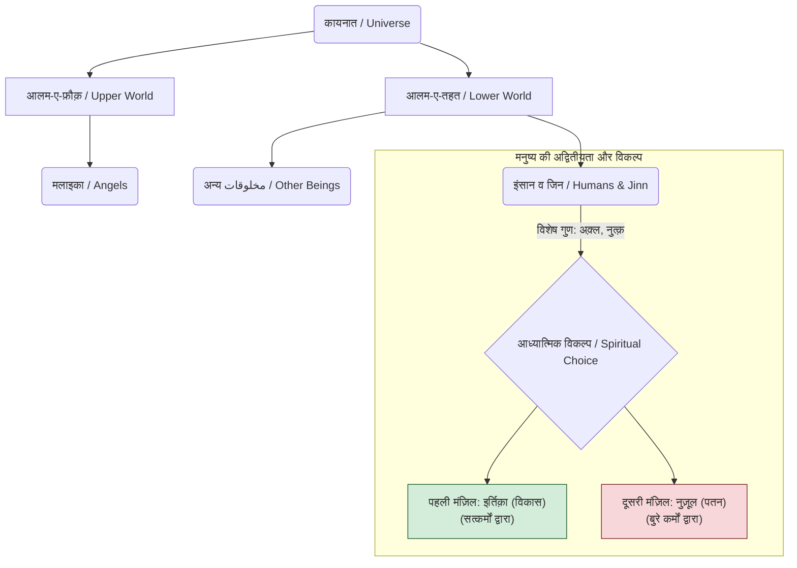
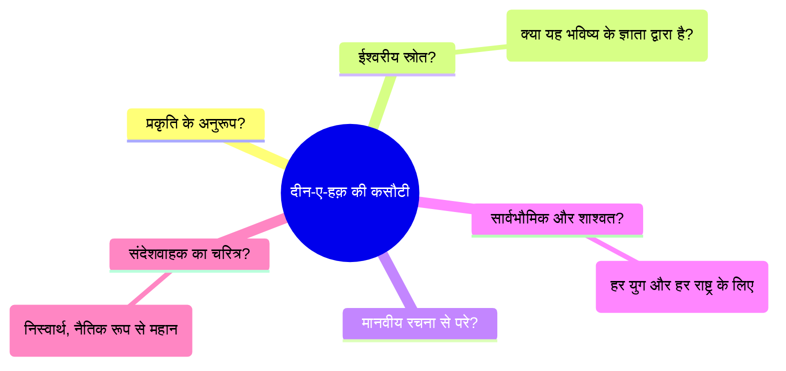
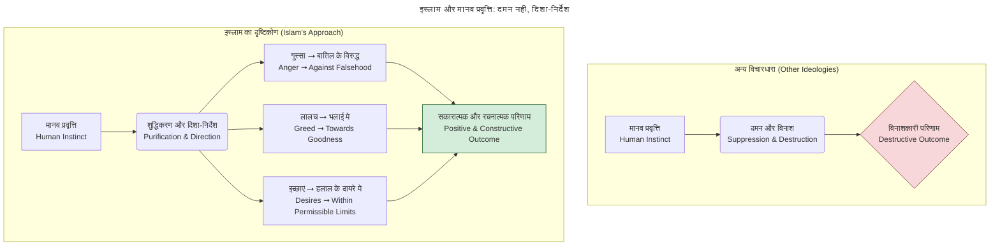
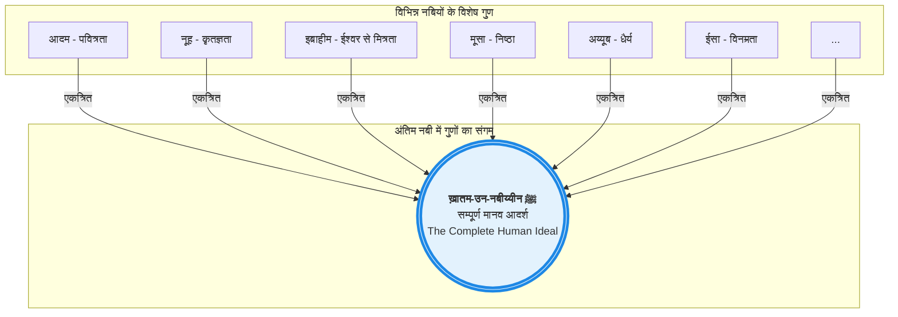

---

## ***"दीन-ए-कामिल" \- संपूर्ण हिंदी लिपिआंतरन***

---

***اِنَّ الدِّيْنَ عِنْدَ اللّٰهِ الْاِسْلَامُ***  
 ***وَمَنْ يَّبْتَغِ غَيْرَ الْاِسْلَامِ دِيْنًا فَلَنْ يُّقْبَلَ مِنْهُ***

# ***दीन-ए-कामिल*** 

### **शेख़-उल-इस्लाम वल\-मुस्लिमीन हज़रत अल्लामा सय्यद मुहम्मद मदनी अशरफ़ी जीलानी**

---

## ***टाइटल वर्सो पेज (TITLE VERSO PAGE)***

**जुम्ला हुक़ूक़ ब-हक़्क़-ए-नाशिर महफ़ूज़** (*समस्त अधिकार प्रकाशक के पक्ष में सुरक्षित*)

**नाम-ए-किताब:** दीन-ए-कामिल 

**मुसन्निफ़** (*लेखक*): शैख़-उल-इस्लाम हज़रत अल्लामा सय्यद मुहम्मद मदनी अशरफ़ी, जीलानी, मद् ज़िल्लुहुल आली 

**नाशिर** (*प्रकाशक*): ईमाम आज़म रिसर्च सेन्टर (IARC), शैख़ उल इस्लाम ट्रस्ट. 

ईशाअत \- चहारूम २०२५ ई. 

**क़ीमत:**

---

## ***पेश-लफ़्ज़ (तब्अ'-ए-जदीद)  (प्रस्तावना)***

**अज़: सय्यद हमज़ा अशरफ़ किछौछवीं**,  
*जा-नशीन, शैख़ उल इस्लाम वल मुस्लिमीन, किछौछा शरीफ़*

**बिस्मिल्लाह-हिर-रहमान-निर-रहीम**  
नहमदुहु व नुसल्ली अला रसूलिहिल करीम

यह मेरे लिए एक अज़ीम सआदत (*महान सौभाग्य*) और रूहानी सआदत है कि मैं अपने जद्द-ए-अमजद, मुर्शिदी-ओ-मख़दूमी (*मेरे आध्यात्मिक मार्गदर्शक और स्वामी*), शैख़-उल-इस्लाम हज़रत अल्लामा सय्यद मुहम्मद मदनी अशरफ़ी जीलानी (मद्दज़िल्लुहुल आली) की माया-नाज़ तसनीफ़ (*गौरवशाली रचना*) ***"दीन-ए-कामिल"*** की नई इशाअत (*प्रकाशन*) के लिए चंद सुतूर (*कुछ पंक्तियाँ*) पेश करने की जसारत (*साहस*) कर रहा हूँ। अल्लाह तआला उनका साया हमारे सरों पर ता-देर क़ायम-ओ-दायम रखे और हमें उनके इल्म-ओ-फ़ैज़ (*ज्ञान और कृपा*) से मुस्तफ़ीद होने (*लाभान्वित होने*) के मवाक़े' (*अवसर*) फ़राहम फ़रमाता रहे (*प्रदान करता रहे*)। आमीन।

उनकी बा-बरकत सोहबत (*पवित्र संगति*) में बैठना इल्म-ओ-अमल के एक ऐसे हसीन इम्तिज़ाज (*सुंदर मिश्रण*) का मुशाहिदा करना है (*देखना है*) जहाँ इल्म तक़वे से और अक़्ल इश्क़-ए-इलाही से मुनव्वर (*प्रकाशित*) नज़र आती है। **मुझे आज भी वो मजलिस याद है जब एक नौजवान ने जदीदियत (*आधुनिकता*) पर एक पेचीदा सवाल किया। दादा जान ने अपनी मख़सूस मुस्कुराहट और गहरी सादगी के साथ, किसी पेचीदा फ़लसफ़े से नहीं बल्कि एक सादा सी हिकायत (*प्रेरक कहानी*) से उसकी उलझन को दूर फ़रमा दिया। उस दिन मैंने सीखा कि हक़ीक़ी इल्म पेचीदगी में नहीं, बल्कि वज़ाहत (*स्पष्टता*) में है। यह किताब उसी वज़ाहत का आईना-दार है (*दर्पण है*)।** आप सिर्फ़ किताबों पर हाकिम एक जदीद आलिम (*महान विद्वान*) ही नहीं, बल्कि एक ऐसे रूहानी तबीब (*आध्यात्मिक चिकित्सक*) भी हैं जो इंसानी रूह के अमराज़ (*रोगों*) को समझते हैं और क़ुरआन-ओ-सुन्नत की रौशनी में उसका इलाज तजवीज़ फ़रमाते हैं (*सुझाते हैं*)।

***"दीन-ए-कामिल"*** महज़ (*केवल*) एक किताब नहीं, बल्कि हमारे दौर के लिए एक इल्हामी दलील (*दैवीय रूप से प्रेरित तर्क*) और रूहानी नुस्ख़ा है। इन सफ़हात (*पृष्ठों*) में शैख़-उल-इस्लाम ने सिर्फ़ मा'लूमात जमा नहीं कीं, बल्कि उस बुनियादी और आफ़ाक़ी हक़ीक़त (*सार्वभौमिक सत्य*) को इंतिहाई मुदल्लल अंदाज़ (*अत्यंत तार्किक शैली*) में बयान किया है जो चौदह सदियों से हमारे ईमान की असास है (*आधार है*): कि इस्लाम ही वो वाहिद दीन है जो इंसान की फ़ितरत-ए-सलीमा (*प्राकृतिक स्वभाव*) से मुकम्मल हम-आहंग है (*पूरी तरह से सामंजस्य में है*)। आप ने वाज़ेह फ़रमाया है कि जो भी निज़ाम (*प्रणाली*) ख़ालिक़-ए-कायनात के बनाए हुए निज़ाम से हट कर होगा, वो ला-महालता (*अनिवार्य रूप से*) इफ़रात-ओ-तफ़रीत (*अति और कमी*) का शिकार हो कर इंसानियत को गुमराही की तरफ़ ले जाएगा।

जब यह किताब पहली बार शाया' हुई (*प्रकाशित हुई*) तो अपने वक़्त में हिदायत का एक मीनार थी। लेकिन मैं पूरे यक़ीन से कहता हूँ कि आज के दौर में इसकी ज़रूरत और अहमियत कई गुना बढ़ चुकी है। हम एक ऐसे दौर में जी रहे हैं जहाँ मा'लूमात के सैलाब के साथ-साथ शुकूक-ओ-शुबहात (*संदेहों*) की भी यल ग़ार है (*आक्रमण है*)। हमारे नौजवानों पर, बिल-ख़ुसूस (*विशेष रूप से*) सोशल मीडिया के ज़रिए, ऐसे सतही ए'तिराज़ात (*ऊपरी आपत्तियों*) और गुमराह-कुन अफ़कार (*भ्रामक विचारों*) की बौछार की जाती है जिनका मक़सद उनके ईमान की बुनियादों को मुतज़लज़ल करना है (*हिलाना है*)। "दीन-ए-कामिल" में पेश करदा दलाइल (*तर्क*) इस ज़हर का तिरयाक़ हैं (*विष का तोड़ हैं*)—यह क़ुरआन-ओ-सुन्नत की हिकमत और मज़बूत अक़्ली इस्तिदलाल (*तार्किक तर्क*) से बनी एक ऐसी ढाल है जो एक मोमिन को ए'तिमाद और यक़ीन के साथ खड़ा होना सिखाती है।

**मेरे अज़ीज़ नौजवान भाइयो और बहनो\! उनके धोके में मत आना\! तुम्हारा दीन माज़ी (*अतीत*) का कोई क़िस्सा नहीं, बल्कि मुस्तक़बिल (*भविष्य*) का मंशूर (*घोषणापत्र*) है। यही तुम्हारी इज़्ज़त है, तुम्हारी ताक़त है, और तुम्हारी शिनाख़्त (*पहचान*) है। इसे मज़बूती से थाम लो\!** यह किताब उस झूटे तसव्वुर (*अवधारणा*) को पाश-पाश कर देती है (*नष्ट कर देती है*) कि दीन को ज़िंदगी के किसी कोने तक महदूद कर दिया जाए। यह इस बात की पुर-ज़ोर याद-दिहानी है (*सशक्त अनुस्मारक है*) कि हमारा दीन कामिल, अकमल और हमारे लिए बा'इस-ए-फ़ख़्र-ओ-इज़्ज़त है (*गौरव और सम्मान का कारण है*)। यह वो फ़िक्री-ओ-रूहानी सहारा है जिसकी हमारी नस्ल को शदीद ज़रूरत है।

बिल-आख़िर (*अंततः*), जदीद दुनिया का सबसे बड़ा मर्ज़ एक गहरा रूहानी ख़ला है (*आध्यात्मिक शून्य*)। बे-मिसाल माद्दी तरक़्क़ी (*भौतिक प्रगति*) के बावजूद, दुनिया बे-चैनी, बे-मक़सदी और म'नी (*अर्थ*) की तलाश में सरगरदाँ है (*भटक रही है*)। "दीन-ए-कामिल" इस ख़ला को पुर करती है और ना-क़ाबिल-ए-तरदीद दलाइल (*अकाट्य तर्कों*) से साबित करती है कि सिर्फ़ ख़ालिक़ का अता करदा निज़ाम ही इंसानी रूह की गहरी प्यास बुझा सकता है। यह किताब बताती है कि हक़ीक़ी सुकून दुनिया की आरज़ी लज़्ज़तों (*अस्थायी सुखों*) में नहीं, बल्कि अपनी पूरी ज़िंदगी को अल्लाह की रज़ा के ताबे' करने में है।

लिहाज़ा, मैं क़ारईन-ए-किराम (*प्रिय पाठकों*) से गुज़ारिश करता हूँ कि आप इस किताब का मुताला' (*अध्ययन*) सिर्फ़ मा'लूमात के हुसूल (*प्राप्ति*) के लिए नहीं, बल्कि एक सच्चे तालिब-ए-हक़ (*सत्य के खोजी*) बन कर करें। इसे खुले दिल से पढ़ें। इसमें पेश करदा दलाइल पर गहराई से ग़ौर-ओ-फ़िक्र करें, क्योंकि यह ग़ौर-ओ-फ़िक्र भी इबादत है। इन दलाइल को अपने ज़ेहन में और इसके रूहानी नूर को अपनी रूह में उतरने दें।

यह महज़ एक इल्मी मश्क़ (*अकादमिक अभ्यास*) नहीं, बल्कि रूहानी तजदीद (*आध्यात्मिक नवीनीकरण*) का अमल है। यह समझना कि हमारा दीन कामिल क्यों है, उस ज़ात के क़रीब होने का एक ज़रिया है जिसने इसे कामिल किया।

मेरी दुआ है कि यह नई इशाअत तमाम पढ़ने वालों के लिए बे-पनाह नफ़ा' का बा'इस बने (*अत्यधिक लाभ का कारण बने*)। अल्लाह करे कि यह आपके ईमान को मज़बूत करे, आपके शुकूक-ओ-शुबहात को दूर करे, और आपको इस दुनिया में इस्लाम का एक पुर-ए'तिमाद और बा-शुऊर नुमाइंदा (*आत्मविश्वासी और जागरूक प्रतिनिधि*) बनने की तौफ़ीक़ अता फ़रमाए, जिसे आज इस नूर की पहले से कहीं ज़्यादा ज़रूरत है। मैं दुआ-गो हूँ कि अल्लाह तआला हमारे मुर्शिद-ओ-मुरब्बी, मुसन्निफ़-ए-किताब (मद्दज़िल्लुहुल आली) को सेहत-ओ-आफ़ियत के साथ उम्र-ए-दराज़ अता फ़रमाए और उम्मत को उनके बहर-ए-इल्म (*ज्ञान के सागर*) से मज़ीद सैराब होने (*और अधिक तृप्त होने*) का मौक़ा फ़राहम करे।

आमीन।

**सय्यद हमज़ा अशरफ़**,  
*जा-नशीन, शैख़ उल इस्लाम वल मुस्लिमीन, किछौछा शरीफ़*

---
title: 'सृष्टि की संरचना और मनुष्य का आध्यात्मिक पथ'
---

---

## ***हामिदन व मुसल्लियन व मुसल्लिमा*** 

(*अल्लाह की प्रशंसा करते हुए और नबी पर दरूद और सलाम भेजते हुए*)

***⇜** 〷 〷 ०१ 〷 〷 **⇝***

कहते हैं कि कायनात एक लफ़्ज़ 'कुन' (*हो जा*) का करिश्मा है। यह लफ़्ज़-ए-कायनात ब-ए'तिबार-ए-कल्मा (*शब्द के लिहाज़ से*) कितना ही मुख़्तसर (*संक्षिप्त*) सही लेकिन बे-शुमार, व ला-ता’दाद  (*अनगिनत*) आलमों में से कोई आलम नहीं जो इसके दाइरा-ए-मफ़हूम (अर्थ के दायरे) से बाहर हो...। आलम-ए-नासूत, आलम-ए-ताग़ूत, आलम-ए-मल्कूत, आलम-ए-जमादात, आलम-ए-नबातात, आलम-ए-हैवानात, आलम-ए-अमल, आलम-ए-जज़ा, वग़ैरह वग़ैरह... ये सारे आलम और इन के सिवा मौजूदात-ए-मा-सिवा-अल्लाह (अल्लाह के अतिरिक्त मौजूद चीज़ें) की जितनी तवील (लंबी) फ़ेहरिस्त बन सके, सब के सब मिल कर भी लफ़्ज़-ए-कायनात ही का मिस्दाक़ (*उदाहरण*) रहते हैं...। इन अक़साम (*प्रकारों*) से थोड़ी देर के लिए क़त'-ए-नज़र फ़रमा लीजिए (*ध्यान हटा लीजिए*) और सारी कायनात को सिर्फ़ दो हिस्सों में तक़सीम (*विभाजित*) कर दीजिए। एक आलम-ए-फ़ौक़ (*ऊपर की दुनिया*), दूसरा आलम-ए-तहत (*नीचे की दुनिया*)। आलम-ए-फ़ौक़ से मुराद वो आलम जहाँ फ़रिश्ते वग़ैरह रहते हैं और आलम-ए-तहत से मुराद वो आलम जिसे इंसान वग़ैरह की बस्ती कहा जाता है...। आलम-ए-फ़ौक़ की मख़लूक़ या'नी मलाइका (*फ़रिश्ते*) नूरी मख़लूक़ हैं, फ़िल-हाल मुझे उन के तअ'ल्लुक़ से कुछ नहीं अर्ज़ करना है...। आलम-ए-तहत में इंसानों के सिवा और भी बहुत सारी मख़लूक़ हैं जिन में इंसान-ओ-जिन ही हैं जिन को नुत्क़ (*बोलने की शक्ति*) के शरफ़ से मुशर्रफ़ करने के साथ-साथ अक़्ल-ओ-शुऊर और इदराक-ओ-तमीज़ (*समझ और विवेक*) से भी नवाज़ा गया...। नीज़ (*इसके अलावा*)... उन के लिए मंज़िलें भी मुतय्यन (*निर्धारित*) कर दी गई हैं। पहली मंज़िल इर्तिक़ा (*विकास*) और दूसरी मंज़िल नुज़ूल (*पतन*)।

पहली मंज़िल में यह मख़लूक़ फ़रिश्तों का मरकज़-ए-निगाह (*ध्यान का केंद्र*) बन जाती है और दूसरी मंज़िल में शैतान से बद-तर नज़र आती है। कुछ ऐसे आ'माल (*कर्म*) हैं जो इर्तिक़ा की तरफ़ ले जाते हैं और कुछ ऐसे किरदार हैं जो नुज़ूल (*पतन*) की तरफ़ खींचते हैं। ऐसी सूरत में कुछ ऐसे काम हुए, मंज़िल-ए-इर्तिक़ा (*विकास के चरण*) पर पहुँचने के लिए जिन्हें करना ज़रूरी है और कुछ किरदार ऐसे हुए, मंज़िल-ए-नुज़ूल से बचने के लिए जिन्हें न करना लाज़मी है। पहले कामों के हुक्म को 'अम्र' कहेंगे और दूसरे कामों से रोकने को 'नही'। अब आ'माल की तक़सीम (*कर्मों का विभाजन*) हो गई, कुछ ऐसे हैं जिन से अम्र मुतअ'ल्लिक़ (*संबंधित*) है और कुछ ऐसे हैं जिन से नही।

अब रह गया यह सवाल कि हमें यह कैसे मा'लूम हो कि वो कौन से आ'माल हैं जिन को अपना कर हम मंज़िल-ए-इर्तिक़ा पर पहुँच सकते हैं और वो कौन से आ'माल हैं जिन से परहेज़ कर के हम ख़ुद को मंज़िल-ए-नुज़ूल से बचा सकते हैं? अगर इस सिलसिले में हम अपनी अक़्ल पर भरोसा करें तो काम नहीं बनता। उक़ला (*बुद्धिजीवियों*) का आपस में शदीद इख़्तिलाफ़ (*गंभीर मतभेद*) इस हक़ीक़त को समझाने के लिए काफ़ी है कि अक़्ल खरा-खोटा समझने के लिए ना-काफ़ी है। फिर अक़्ल-ए-महज़ (*केवल बुद्धि*) के फ़ैसले पर ए'तिमाद-ओ-भरोसे की क्या शक्ल हो सकती है? ऐसी सूरत में ज़रूरत है एक ऐसे शुऊर (*चेतना*) की, जिसको किसी का शुऊर समझ न सके। एक ऐसे इदराक (*समझ*) की जो इंसानी हैता-ए-इदराक (*समझ के दायरे*) से बाहर हो... अल-मुख़्तसर (*संक्षेप में*)... उन नुफ़ूस-ए-क़ुदसिया (*पवित्र आत्माओं*) की जिन्हें इस्मत (*मासूमियत*) की चादर ओढ़ा दी गई हो और हर हाल में ताईद-ए-इलाही (*दैवीय सहायता*) जिनके शरीक-ए-हाल हो, उन्हीं नुफ़ूस-ए-क़ुदसिया के अवामिर-ओ-नवाही (*आदेशों और निषेधों*) पर अमल करना और न करना इर्तिक़ा तक पहुँचाता और नुज़ूल से बचाता है।

---
title: 'सच्चे धर्म (दीन-ए-हक़) की पाँच कसौटियाँ'
---

***⇜** 〷 〷 ०२  〷 〷 **⇝***

क़ुर्बान जाइए क़ुदरत-ए-कामिला (*पूर्ण शक्ति*) की हिकमत-ए-बालिग़ा (*परिपक्व ज्ञान*) और उसकी सुन्नत-ए-क़दीमा (*प्राचीन परंपरा*) पर जिसने आलम-ए-इंसानियत का आग़ाज़ (*आरंभ*) मुअ'ल्लिम (*शिक्षक*) से फ़रमाया। उमूमन (*आम तौर पर*) पहले तुलबा (*विद्यार्थी*) होते हैं फिर मुअ'ल्लिम की ज़रूरत महसूस की जाती है। लेकिन क़ुदरत-ए-कामिला ने पहले मुअ'ल्लिम की तख़लीक़ फ़रमाई (*रचना की*) और फिर तुलबा को लिबास-ए-वजूद (*अस्तित्व का वस्त्र*) पहनाया। ब-ज़ाहिर (*स्पष्ट रूप से*) इंसानी दुनिया के मुअल्लिम-ए-अव्वल का नाम आदम रखा गया, जिन को आलम-ए-वजूद में लाने से पहले ही ए'लान कर दिया गया: اِنِّيْ جَاعِلٌ فِي الْاَرْضِ خَلِيْفَةً *(तो उन्होंने कहा: मैं धरती में एक ख़लीफ़ा (उत्तराधिकारी) बनाने वाला हूँ।)*

फ़रिश्तों ने सोचा कि जिसकी ख़िलाफ़त का ए'लान किया जा रहा है, उसकी तरकीब (*रचना*) अनासिर-ए-अरबा' (*चार तत्वों*) से की गई है। जिनमें का हर एक उन्सुर (*तत्व*) दूसरे उन्सुर से मुतसादिम (*टकराने वाला*) है, तो यक़ीनन फ़साद-ओ-इख़्तिलाफ़ (*झगड़ा और मतभेद*) उसकी सिरिश्त (*प्रकृति*) होगी। और यह ज़मीन पर जा कर फ़साद-ओ-ख़ूँ-रेज़ियाँ (*खून-खराबा*) करेंगे।

... लिहाज़ा... हिकमत दरयाफ़्त (*ज्ञान प्राप्त*) करने के लिए बारगाह-ए-इलाही में अर्ज़ किया कि अगर ख़लीफ़ा बनाने का मक़सद यह है कि वो तेरी तस्बीह-ओ-तहलील (*गुणगान*) करें, तो यह काम तो हम कर ही रहे हैं, और हम लोग इसके लिए काफ़ी भी हैं। रब xx ﷺ ने: اِنِّيْٓ اَعْلَمُ مَا لَا تَعْلَمُوْنَ *(तो उसने कहा: मैं वह जानता हूँ जो तुम नहीं जानते।)*

फ़रमा कर उनको ख़ामोश फ़रमा दिया और अपने ख़लीफ़ा को उलूम-ए-बे-पायाँ (*अथाह ज्ञान*) की दौलत-ए-बे-कराँ (*अपार संपत्ति*) से नवाज़ कर वाज़ेह (*स्पष्ट*) फ़रमा दिया कि इस ख़लीफ़ा का बुनियादी काम ता'लीम-ओ-तरबियत (*शिक्षा और प्रशिक्षण*) है। जब ही तो उसको जो उलूम अता फ़रमाए गए, मलाइका के उलूम भी उनके सामने हैरत-फ़रोश हैं (*आश्चर्यचकित हैं*)। सय्यदना आदम अलैहिस्सलाम के अलावा वक़्तन फ़-वक़्तन (*समय-समय पर*) दूसरे मुअ'ल्लिमीन (*शिक्षक*) भी इंसानों की हिदायत के लिए आते रहे। यहाँ तक कि क़रीब-क़रीब एक लाख चौबीस हज़ार की ता'दाद पूरी हो गई। तमाम मुअ'ल्लिमीन अल्लाह तआला की रज़ा-ओ-ख़ुशनूदी (*प्रसन्नता*) के तरीक़े की ता'लीम देते रहे और दीन-ए-हक़ पर लाने और उस पर साबित-क़दम (*दृढ़*) रखने की कोशिश फ़रमाते रहे।

***⇜** 〷 〷 ०३ 〷 〷 **⇝***

इस वक़्त दुनिया में क़ाबिल-ए-ज़िक्र (*उल्लेखनीय*) दीन, सिर्फ़ तीन हैं। दीन-ए-इस्लाम, दीन-ए-नसारा (*ईसाई धर्म*) और दीन-ए-यहूद (*यहूदी धर्म*)। इनके अलावा जो और अदियान (*अन्य धर्मों*) हैं वो इस क़दर हमह-गीर नहीं (*इतने व्यापक नहीं*) ... लिहाज़ा... इनको नज़र-अंदाज़ फ़रमा कर आईए और सबसे पहले यह समझ लीजिए कि अल्लाह की रज़ा-ओ-ख़ुशनूदी के ज़ाब्ते (*नियम*) का नाम दीन है... जो इसको अपना ले वो मुस्लिम है और जो न माने वो ख़ारिज-अज़-इस्लाम (*इस्लाम से बाहर*) है... यह हक़ीक़त भी अपनी जगह साबित-शुदा है कि सबको मौत का मज़ा चखना है और मरने के बाद एक दिन आदिल-ए-हक़ीक़ी (*सच्चे न्यायकर्ता*) की बारगाह में हाज़िर होना है। जहाँ अपने दार-ए-अमल (*कर्मभूमि*) के एक-एक लम्हे का हिसाब पेश करना है। वहाँ सही रास्ते पर साबित हुए तो जन्नत मिलेगी वरना जहन्नम की राह दिखाई जाएगी... लिहाज़ा... अब हर मरने वाले पर लाज़िम है कि वो मरने से पहले अच्छी तरह समझ ले कि कौन सा रास्ता नजात (*मुक्ति*) की तरफ़ ले जाता है और कौन सा हलाकत (*विनाश*) की तरफ़। और फिर जो रास्ता नजात की तरफ़ ले जाता हो उसको अपना कर अपनी नजात के इस्तिहक़ाक़ (*अधिकार*) की सूरत निकाल ले...। दुश्वारी (*कठिनाई*) यह आ पड़ी है कि हर दीन अपने को हक़ और अपने सिवा को बातिल (*असत्य*) कह रहा है...। अगर बिल-फ़र्ज़ (*मान लीजिए*)... ऐसी सूरत होती कि हर दीन अपने को भी हक़ कहता और दूसरे को भी तो मरने वाले के लिए ज़्यादा तशवीश (*चिंता*) की बात न होती, मगर अब तो लाज़मी हो गया है कि जहन्नम के ख़ौफ़नाक शो'लों से बचने के लिए राह-ए-हक़ को अपना कर ही साँस ली जाए।

***⇜** 〷 〷 ०४ 〷 〷 **⇝***

इस्लाम का भी यही दा'वा है कि इस वक़्त इसी का बताया हुआ रास्ता नजात की तरफ़ ले जाने वाला है। बाक़ी अदियान (*अन्य धर्मों*) में जो हक़ थे, वो मंसूख़ (*रद्द*) कर दिए गए और जो बातिल थे, वो तो बातिल थे ही... अल-हासिल (*निष्कर्ष यह है*)... इस दौर में नजात दीन-ए-इस्लाम के सिवा कहीं नहीं। इस्लाम के इस दा'वे की तस्दीक़ (*पुष्टि*) एक ऐसी किताब से हो रही है, जो दस्त-ए-इंसानी (*मानव हाथ*) की ख़ुर्द-ओ-बुर्द (*छेड़छाड़*) से हमेशा महफ़ूज़ रही है और आज भी महफ़ूज़ है। और इसका दा'वा है कि हमेशा महफ़ूज़ रहेगी। इस मुक़द्दस किताब को हम क़ुरआन कहते हैं... मगर... मुश्किल यह है कि अगर हम क़ुरआन से इस्लाम की हक़्क़ानियत (*सच्चाई*) साबित करें तो कहा जा सकता है कि क़ुरआन ही तो ब-सूरत-ए-दीगर (*दूसरे रूप में*) इस्लाम है तो फिर उसी को इस्लाम की हक़्क़ानियत की दलील में पेश करना, चह मा'नी दारद (*इसका क्या अर्थ है*) ? अगरचे हक़ीक़त-शनास हज़रात (*सत्य को पहचानने वाले लोगों*) के नज़दीक यह क़ौल (*कथन*) ब-नज़र-ए-इस्तिहसान (*सराहना की दृष्टि से*) देखे जाने के लाइक़ नहीं, फिर भी किसी नक़्द-ओ-नज़र (*आलोचना*) के बग़ैर बात को आगे बढ़ाने के लिए आईए और ग़ौर फ़रमाइए कि किसी दीन की हक़्क़ानियत (*सच्चाई*) को अक़्ली तौर पर (*तार्किक रूप से*) समझने की कितनी सूरतें हैं, और फिर यह देखिए कि हर सूरत की मीज़ान (*तराज़ू*) पर इस्लाम का क्या वज़न है?

***⇜** 〷 〷 ०५ 〷 〷 **⇝***

किसी भी दस्तूर-ए-ज़िंदगी (*जीवन के संविधान*) और ज़ाब्ता-ए-हयात (*जीवन संहिता*) की हक़्क़ानियत को समझने के लिए चंद उमूर (*कुछ मामलों*) पर नज़र रखनी ज़रूरी है।

1. जिन के लिए यह दस्तूर मुरत्तब किया गया है (*बनाया गया है*) इस दस्तूर की दफ़आत (*धाराएं*) उनकी फ़ितरत (*प्रकृति*) के मुताबिक़ हैं कि नहीं? अगर यह दस्तूर ग़ैर-फ़ितरी (*अप्राकृतिक*) क़वानीन (*क़ानूनों*) पर मुश्तमिल (*आधारित*) है तो वो अपने मानने वालों को नजात (*मुक्ति*) के बजाए हलाकत (*विनाश*) की तरफ़ ले जाएगा... नीज़ (*इसके अलावा*)... यह कैसे समझा जाए कि इस दीन के उसूलों पर अमल करने में अल्लाह तआला की रज़ा-ओ-ख़ुशनूदी (*प्रसन्नता*) अम्र-ए-यक़ीनी (*निश्चित बात*) है?

2. दस्तूर को नाज़िल फ़रमाने वाला कौन है? यह किसी ऐसे का बनाया हुआ दस्तूर तो नहीं जिसकी निगाहें मुस्तक़बिल (*भविष्य*) के नशीब-ओ-फ़राज़ (*उतार-चढ़ाव*) से बे-ख़बर हैं? जिसके उसूल सुबह को बनते हैं तो शाम को टूटते हैं, और शाम को बनते हैं तो सुबह के क़ाबिल नहीं रह जाते।

3. इन उसूलों को जिन को पेश करने वाला ख़ुदाई उसूल कह कर पेश कर रहा है, क्या कोई इंसानी दिमाग़ बना सकता है? और क्या दुनिया के दानिश्वरों और मुफ़क्किरों (*विचारकों*) की ज़ेहनी रसाई (*मानसिक पहुँच*) वहाँ तक पहुँच सकती है?

4. क़ानून पेश करने वाले का, क्या यह दा'वा है कि इसका यह पेश करदा क़ानून हर दौर के लिए है? और अगर वो इस बात का मुद्दई (*दावेदार*) है, तो वो अपने इस दा'वे में कहाँ तक सादिक़ (*सच्चा*) है?

5. इस दस्तूर को लाने वाला, समझाने वाला, ख़ुद कैसा है? कहीं वो तालिब-ए-दुनिया (*दुनिया का इच्छुक*), जाह-ओ-मंसब (*पद और प्रतिष्ठा*) का चाहने वाला और हुस्न-ओ-जमाल (*सौंदर्य*) का शैदाई (*प्रेमी*) तो नहीं? और उसकी ज़िंदगी का कोई गोशा (*कोना*) अख़लाक़ी क़दरों (*नैतिक मूल्यों*) की ताबनाकी (*चमक*) से महरूम (*वंचित*) तो नहीं?

***⇜** 〷 〷 ०६ 〷 〷 **⇝***

किसी दीन की हक़्क़ानियत (*सच्चाई*) को समझने के लिए मैंने जो निशानात मुतय्यन किए हैं (*चिह्न निर्धारित किए हैं*) उनके तअ'ल्लुक़ से अलत-तरतीब (*क्रमशः*) अपने म'रूज़ात (*निवेदन*) पेश करूँगा, आप से ख़ास तवज्जोह का मुल्तजी हूँ (*प्रार्थी हूँ*)। ... आईए देखें कि जिन क़ाबिल-ए-ज़िक्र अदियान (*उल्लेखनीय धर्मों*) की निशानदेही की जा चुकी है, उनमें वो कौन सा दीन है जिसके उसूल इंसानी फ़ितरत (*मानव प्रकृति*) से मुतसादिम नहीं (*टकराते नहीं*)। जिस दस्तूर-ए-हयात (*जीवन के संविधान*) में इंसान के फ़ितरी तक़ाज़ों (*प्राकृतिक आवश्यकताओं*) की तस्कीन (*संतुष्टि*) का सामान न होगा वो इंसानियत की तबाही का पेश-ख़ेमा (*अग्रदूत*) साबित होगा। मिसाल के तौर पर मुलाहिज़ा फ़रमाइए, अहले-कलीसा (*चर्च के लोग*), इंसान को सिर्फ़ रूहानियत वाला फ़रिश्ता-ख़स्लत (*फ़रिश्तों जैसी प्रकृति वाला*) बता कर रहबानियत (*संन्यास*) की ता'लीम दे रहे हैं, वो इंसान की नफ़्सानी ख़्वाहिशात (*शारीरिक इच्छाओं*) को यकसर (*पूरी तरह से*) फ़ना कर देना चाहते हैं। ख़्वाहिशात-ए-नफ़्स-ए-इंसानी की तस्कीन के सामान की फ़राहमी (*उपलब्धता*) उनके लिए अज़ाब-ए-जान (*जान का अज़ाब*) और इंसानियत-सोज़ (*इंसानियत को जलाने वाली*) है। एक फ़ितरी तक़ाज़े को पामाल करने (*कुचलने*) का नतीजा यह हुआ कि कलीसा की नाम-निहाद (*तथाकथित*) मुक़द्दस फ़ज़ा (*पवित्र वातावरण*) में इंसानियत का वो अर्यां नाच (*नग्न नृत्य*) हुआ कि क़ह्बा-ख़ाने (*वेश्यालय*) भी शर्मिंदा हो कर रह गए। बहते हुए सैलाब के रुख़ को तो मोड़ा जा सकता है, लेकिन फ़ना नहीं किया जा सकता। आतिश-फ़िशां (*ज्वालामुखी*) को निकलने की राह न मिली तो ज़लज़ले... यक़ीनन... आएँगे। यह होता है, फ़ितरी जज़्बात को यकसर फ़ना कर देने की कोशिश का इंसानियत-सोज़ अंजाम। कहा तो यह गया था कि इंसान फ़रिश्ता है, नफ़्सानी ख़्वाहिशात उसके लिए अज़ाब हैं और देखा यह जा रहा है कि पादरियों और जोगियों के नाम-निहाद मुक़द्दस दामन भी इस अज़ाब के शो'लों से ख़ुद को बचा न सके...।

इसी तरह अहले-कलीसा का यह ख़याल भी किस क़दर ग़ैर-फ़ितरी (*अप्राकृतिक*) और तबाह-कुन (*विनाशकारी*) है कि अमल कोई करे और सज़ा किसी और को मिले। बद-उनवानियाँ (*भ्रष्टाचार*) किसी की हों और कफ़्फ़ारा (*प्रायश्चित*) कोई और अदा करे। हज़रत मसीह अलैहिस्सलाम के सूली पर चढ़ जाने के बातिल (*झूठे*) ख़याल को अपनी तमाम बद-किरदारियों के जवाज़ (*वैधता*) की तम्हीद (*प्रस्तावना*) बना कर रख दी है। कुछ भी कीजिए, सग़ीरा (*छोटे गुनाह*), कबीरा (*बड़े गुनाह*), ज़ुल्म-ओ-सितम, बे-हयाई व बे-इंसाफ़ी और ख़ूँ-रेज़ी व बद-किरदारी, हर चीज़ की इजाज़त है। अब किसी गुनाह पर मुआखिज़ा नहीं (*पूछताछ नहीं*)। इसलिए कि हज़रत मसीह अलैहिस्सलाम ने सूली चढ़ कर सबका कफ़्फ़ारा अदा कर दिया है...। मुझ से न कहलाइए... ख़ुद ही ग़ौर फ़रमाइए... कि इस ख़याल का इंसान की अमली ज़िंदगी पर क्या असर पड़ेगा? इंसान इंसान रहेगा या जानवर हो कर रह जाएगा...। कहना तो यह चाहिए था जो इस्लाम ने कहा।

لَا تَزِرُ وَازِرَةٌ وِزْرَ اُخْرٰى  *(कोई उठाने वाली ज़ात किसी दूसरे का बोझ ना उठाएगी)*

فَمَنْ يَّعْمَلْ مِثْقَالَ ذَرَّةٍ خَيْرًا يَّرَهٗ ۝ وَمَنْ يَّعْمَلْ مِثْقَالَ ذَرَّةٍ شَرًّا يَّرَهٗ ۝ *जो ज़र्रा बराबर अमल-ए-ख़ैर करेगा वो उसका फल पाएगा और जो ज़र्रा बराबर अमल-ए-शर करेगा वो उसका अंजाम देखेगा।*

اِعْمَلْ مَا شِئْتَ كَمَا تَدِيْنُ تُدَانُ *(अल-हदीस) जो चाहो करो, जैसा करोगे वैसा भरोगे।*

नसरानियत (*ईसाई धर्म*) के निज़ाम-ए-फ़िक्र (*विचार प्रणाली*) और दस्तूर-ए-हयात (*जीवन संहिता*) के ख़द्द-ओ-ख़ाल (*रूपरेखा*) की एक झलक देखने के बाद, आईए इस्लाम के फ़ितरी निज़ाम-ए-ज़िंदगी की तरफ़ भी चंद इशारे मुलाहिज़ा करते चलिए...। इस मक़ाम पर यह हक़ीक़त ज़ेहन-नशीन रहे (*याद रहे*) कि हर उस आदत-ओ-ख़स्लत (*आदत और प्रकृति*) को इंसान की फ़ितरत क़रार दिया जाएगा, जिसमें क़रीब-क़रीब सारे इंसान मुब्तला हों (*शामिल हों*)... मसलन (*उदाहरण के लिए*): खाना, पीना, सोना, मुसीबत के वक़्त किसी को मदद के लिए बुलाना, नफ़्सानी ख़्वाहिशात रखना, बड़ों की ता'ज़ीम (*सम्मान*) करना, हिर्स-ओ-ग़ुस्सा (*लालच और क्रोध*), वग़ैरह वग़ैरह... यह चंद इंसानी फ़ितरी तक़ाज़े (*प्राकृतिक आवश्यकताएं*) हैं। छोटा हो या बड़ा, बूढ़ा हो या जवान, मुस्लिम हो या ग़ैर-मुस्लिम, औरत हो या मर्द, हर कोई इन ख़्वाहिशात में अपने आप को घिरा हुआ पाता है। यह भी ख़याल रहे कि अगर किसी ख़ारिजी अवारिज़-ओ-इ'लल (*बाहरी कारणों*) के सबब किसी फ़र्द-ए-इंसानी (*किसी व्यक्ति*) में इसका फ़ितरी जज़्बा मुर्दा नज़र आए, तो यह इस बात की दलील नहीं कि वो इंसान का फ़ितरी जज़्बा नहीं। जिस तरह चंद मुखन्नसों (*हिजड़ों*) और राहिबों (*संन्यासियों*) का वजूद, इस बात की दलील नहीं कि नफ़्सानी ख़्वाहिशात इंसान की फ़ितरत नहीं...।

अब आईए इस्लामी ता'लीमात का इजमाली ख़ाका (*संक्षिप्त रूपरेखा*) मुलाहिज़ा फ़रमाइए। इस्लाम खाने-पीने का मुख़ालिफ़ नहीं, मगर अगर किसी का यह फ़ितरी जज़्बा ग़लत राह पर लगा होगा तो उसको सही रुख़ पर लगा देगा। खाने वालो ख़ूब खाओ, लेकिन हराम न खाओ हलाल खाओ। इसी तरह हलाल मशरूबात (*पेय पदार्थ*) को पियो मगर हराम से अपने को बचाते रहो। सोने वालो ऐसी नींद मत अपनाओ जो फ़राइज़ (*कर्तव्यों*) की अदायगी से महरूम कर दे। और जागने वालो ऐसी बेदारी न इख़्तियार करो जो नक़्स-ए-जान (*जान के नुक़सान*) की तरफ़ ले जाए। मदद के लिए बुलाने वालो ऐसों को न बुलाओ, जिनको मदद देने की कोई ताक़त ही नहीं दी गई है। बल्कि ऐसों को बुलाओ जिन्हें मदद पहुँचाने ही के लिए पैदा किया गया है... अल-मुख़्तसर (*संक्षेप में*)... औलिया-उश-शैतान (*शैतान के दोस्तों*) की तरफ़ क्यों जाते हो, औलिया-उर-रहमान (*रहमान के दोस्तों*) की तरफ़ आओ, नफ़्सानी ख़्वाहिशात की तस्कीन (*संतुष्टि*) चाहने वालो, हर फूल से रस चूसने की कोशिश न करो, हलाल-ओ-हराम के हुदूद (*सीमाओं*) को समझो, और फिर अपने घरों को आबाद करो। ता'ज़ीम के लिए इधर-उधर क्यों मारे-मारे फिरते हो, अल्लाह के दुश्मन इस बात का इस्तिहक़ाक़ नहीं रखते (*अधिकार नहीं रखते*) कि उनकी ता'ज़ीम की जाए। आओ\! आओ\! ता'ज़ीम के लिए अल्लाह के मक़बूलिन (*स्वीकार्य बंदों*) का आस्ताना (*चौखट*) तलाश करो...।

وَتُعَزِّرُوْهُ وَتُوَقِّرُوْهُ *(और तुम लोग उनकी ता'ज़ीम करो और उनका अदब करो।)*

وَمَنْ يُّعَظِّمْ شَعَاۗىِٕرَ اللّٰهِ فَاِنَّهَا مِنْ تَقْوَى الْقُلُوْبِ ۝ *(और जो कोई अल्लाह की निशानियों की ता'ज़ीम करे, तो यह दिलों की परहेज़गारी से है।)*

... हिर्स (*लालच*) रखने वालो, ज़रूर हरीस बनो, मगर माल-ओ-दौलत जमा करने के लिए नहीं बल्कि राह-ए-ख़ुदा में लुटाने के लिए, यहाँ तक कि दुनिया तुम्हारी ज़बान से सुन ले।

*परवाने को चराग़ है बुलबुल को फूल बस*  
*सिद्दीक़ के लिए है ख़ुदा का रसूल बस*

कार-ए-ख़ैर (*भले काम*) को अंजाम देने में हरीस रहो, कार-ए-शर (*बुरे काम*) के हरीस न बनो...। ग़ुस्से की फ़ितरत रखने वालो ग़ुस्सा ज़रूर करो, लेकिन सिर्फ़ बातिल (*असत्य*) के मुक़ाबले में करो...। इल्म बुलंद करो तो सिर्फ़ परचम-ए-इस्लाम (*इस्लाम का झंडा*) बुलंद करो...। तलवार उठाओ तो हक़ की हिमायत में उठाओ...। यह चंद इशारे सिर्फ़ समझाने के लिए थे, पूरे इस्लाम का मुताला' कर जाइए (*अध्ययन कर लीजिए*) कहीं भी इस्लाम इंसान के फ़ितरी जज़्बे को फ़ना करता हुआ नज़र न आएगा। बल्कि सिर्फ़ सही रुख़ पर लगाता हुआ मिलेगा। सैलाब का रोकना इस्लाम का काम नहीं बल्कि सैलाब के रुख़ को बदल कर आबादी से वीराने की तरफ़ कर देना इस्लाम का काम है। इस तरह अगर एक तरफ़ आबादियाँ महफ़ूज़ रहेंगी तो दूसरी तरफ़ वीराने आबाद हो जाएँगे...। अल-हासिल (*निष्कर्ष यह है*)... इस्लाम का मुख़्लिसाना (*ईमानदारी से*), मुहक़्क़िक़ाना (*शोधपूर्ण*) और ग़ैर-मुतअ'स्सिबाना (*निष्पक्ष*), गहरा मुताला' सारी दुनिया को इस बात को मानने पर मजबूर कर रहा है कि इस्लाम और सिर्फ़ इस्लाम ही दीन-ए-फ़ितरत (*प्रकृति का धर्म*) है। बाक़ी अदियान (*अन्य धर्म*) ग़ैर-फ़ितरी अनासिर (*अप्राकृतिक तत्वों*) पर मुश्तमिल (*आधारित*) और ना-क़ाबिल-ए-अमल हैं। जहाँ इंसानियत बजाए निखरने के, बहीमाना (*पशुवत*) तर्ज़-ए-ज़िंदगी इख़्तियार करने पर मजबूर नज़र आती है।

रह गया यह सवाल, कि यह कैसे समझा जाए कि दीन-ए-इस्लाम ही के उसूलों पर अमल करने से अल्लाह तआला की रज़ा-ओ-ख़ुशनूदी (*प्रसन्नता*), अम्र-ए-यक़ीनी (*निश्चित बात*) है? तो इसका हल निहायत आसान है। इसलिए कि जब यह मुसल्लमा हक़ीक़त है (*स्वीकृत सत्य है*) कि सारे इस्लामी क़वानीन (*क़ानून*) ख़ुद ख़ालिक़-ए-फ़ितरत (*प्रकृति के निर्माता*), فَاطِرِ السَّمٰوٰتِ وَالْاَرْضِ *(आसमानों और ज़मीन का पैदा करने वाला)* की तरफ़ से हैं, तो जहाँ वो इंसानी फ़ितरत के ऐन मुताबिक़ होंगे वहीं उनको मानना और उन पर मुख़्लिसाना अमल (*ईमानदारी से कर्म*)... यक़ीनन... ख़ुदा की मर्ज़ी के मुताबिक़ होगा। और ज़ाहिर है कि ख़ुदा की मर्ज़ी-ओ-मंशा (*इच्छा*) के मुताबिक़ जो अमल होगा, उससे उसकी रज़ा-ओ-ख़ुशनूदी ज़रूर हासिल होगी...।

दीन-ए-इस्लाम और मौजूदा दूसरे अदियान का एक नुमायाँ फ़र्क़ (*स्पष्ट अंतर*) यह भी है, कि दीन-ए-इस्लाम के सिवा सारे अदियान अपने... ख़याली या हक़ीक़ी... रब को ख़ुश करना चाहते हैं और उसकी रज़ा-ओ-ख़ुशनूदी के तालिब हैं (*इच्छुक हैं*), लेकिन अपने बनाए हुए उसूलों से... मगर, दीन-ए-इस्लाम अपने रब की रज़ा-ओ-ख़ुशनूदी ख़ुद अपने रब ही के नाज़िल फ़रमूदा (*उतारे हुए*) उसूलों से चाहता है। कि ऐ मेरे परवरदिगार तू ही फ़रमा दे कि तू किस-किस चीज़ से राज़ी है? और किस-किस चीज़ में तेरी नाराज़गी है? इसी लिए यह कहना सही है कि सिर्फ़ दीन-ए-इस्लाम ही है जिसके उसूलों पर अमल करने में अल्लाह तआला की रज़ा-ओ-ख़ुशनूदी अम्र-ए-यक़ीनी है।

***⇜** 〷 〷 ०७ 〷 〷 **⇝***

जहाँ दीन-ए-इस्लाम का दीन-ए-फ़ितरत होना अज़हर मिन-अश-शम्स है (*सूर्य से भी अधिक स्पष्ट है*), वहीं यह हक़ीक़त भी ना-क़ाबिल-ए-इंकार है कि इसके जुम्ला क़वानीन (*समस्त क़ानून*) ख़ुदा-ए-आलम-उल-ग़ैब-वश-शहादा (*प्रत्यक्ष और अप्रत्यक्ष के ज्ञाता ईश्वर*) के नाज़िल फ़रमूदा हैं। जिन्हें सारी कायनात के लिए और हर\-हर ज़माने के लिए नाज़िल फ़रमाया गया है। और इन्हें जब से पेश किया गया है, उस वक़्त से आज तक वो इसी हाल में हैं। इनमें ज़र्रा बराबर तरमीम-ओ-तहरीफ़ (*संशोधन और परिवर्तन*) को राह न मिल सकी। और न आइंदा मिल सकती है। इन्हें क़वानीन की मुक़द्दस किताब का नाम क़ुरआन है। जिसके ख़ुदा की किताब होने की यही दलील काफ़ी है कि आज तक इसके इस चैलेंज का कोई जवाब न ला सका...।

وَاِنْ كُنْتُمْ فِيْ رَيْبٍ مِّمَّا نَ     **zَّ**لْنَا عَلٰي عَبْدِنَا فَاْتُوْا بِسُوْرَةٍ مِّنْ مِّثْلِهٖ  *(और अगर तुम शक में हो उस चीज़ के बारे में जो हमने अपने बंदे पर उतारी है, तो उसके जैसी एक सूरत ले आओ।)*

... या'नी... पूरे क़ुरआन की क्या बात, एक ही सूरह की मिसाल लाओ। अगर यह इंसानी तसनीफ़ होती (*मानव रचना होती*) तो दूसरा इंसान इसका जवाब यक़ीनन ला सकता था। लोगों ने जवाब लाने की कोशिश की, मगर जवाब लाने से आजिज़ रहे (*असमर्थ रहे*)। बल्कि इस कलाम-ए-मु'जिज़-निज़ाम (*चमत्कारिक प्रणाली वाले शब्द*) की बे-नज़ीरी-ओ-बे-मिस्ली (*अद्वितीयता*) और इसकी मु'जिज़ाना फ़साहत-ओ-बलाग़त (*चमत्कारिक वाक्पटुता*) के हुज़ूर सुजूद-ए-नियाज़ लुटाने (*श्रद्धा में झुकने*) पर मजबूर हो गए।

यहीं से यह बात भी वाज़ेह (*स्पष्ट*) हो गई, कि जब दीन-ए-इस्लाम के उसूल उसी फ़ितरत के ऐन मुताबिक़ हैं, जिस पर इंसानों की तख़लीक़ फ़रमाई गई है (*रचना की गई है*)। तो फिर हमेशा के लिए इन्हीं उसूलों के मानने और उन पर अमल करने ही में नौ'-ए-इंसानी (*मानव जाति*) की फ़लाह-ओ-नजात (*कल्याण और मुक्ति*) है। न फ़ितरत बदल सकती है और न ही फ़ितरी उसूल को छोड़ कर फ़ौज़-ओ-फ़लाह (*सफलता और कल्याण*) की मंज़िल हासिल हो सकती है...। तो अब अगर इस्लाम का दा'वा यह है कि इसी का पेश करदा क़ानून हर दौर के लिए है, तो इसमें कोई मुबालग़ा नहीं (*अतिशयोक्ति नहीं*)। आख़िरी और कामिल-ओ-मुकम्मल दीन... या'नी... इस्लाम के अलावा कोई और दीन नहीं जो यह दा'वा कर के अहले-इल्म-ओ-फ़हम हज़रात (*ज्ञान और समझ रखने वालों*) से अपनी सदाक़त (*सच्चाई*) का ए'तिराफ़ करा सके (*स्वीकार करा सके*)। ... यक़ीन न हो तो पूछ लीजिए अहले-कलीसा से कि क्या तुम्हारे नबी का यह दा'वा है कि उनका लाया हुआ क़ानून हर क़ौम के लिए, हर दौर के लिए है? बावर कीजिए (*विश्वास कीजिए*), इस सवाल के जवाब में अहले-कलीसा के बा-ख़बर अफ़राद (*जानकार लोगों*) की तरफ़ से एक तवील ख़ामोशी (*लंबी चुप्पी*) के सिवा कुछ न मिलेगा। ख़याल फ़रमाइए जो क़ौम अपनी आसमानी किताब को मुहर्रफ़ होने (*परिवर्तित होने*) से न बचा सकी, जो क़ौम अपनी नबी की मुकम्मल तारीख़-ओ-सीरत (*इतिहास और जीवन-चरित्र*) से बे-ख़बर हो और जो क़ौम अपने नबी के सही हालात और हक़ीक़ी वाक़िआत मा'लूम करने के लिए ख़ुद हमारे नबी आख़िर-उज़-ज़माँ ﷺ की ज़बान-ए-मुबारक से निकले हुए कलमात-ए-तैय्यबात (*पवित्र शब्दों*) की मोहताज हो, उसको उन दीन-ए-इस्लाम के मानने वालों के सामने सर उठाने का हक़ ही क्या है? जिन्होंने अपने नबी की ज़िंदगी के हर\-हर लम्हे, हर\-हर नुक़्ते, हर\-हर क़ौल (*कथन*) और हर\-हर फे'ल (*कर्म*) को सफ़हात-ए-क़िर्तास (*कागज़ के पन्नों*) पर महफ़ूज़ कर लिया हो।

***⇜** 〷 〷 ०८ 〷 〷 **⇝***

क़ुरआन को देख चुके, अब आईए साहिब-ए-क़ुरआन (*क़ुरआन वाले*) की बारगाह में हाज़िरी दें। आप की पूरी ज़िंदगी को देख डालिए, न सल्तनत के ख़्वाहिश-मंद (*इच्छुक*) नज़र आएँगे और न हुस्न-ओ-जमाल के हरीस, और न ही ज़ाहिरी इक़्तिदार (*सत्ता*) की हवस रखने वाले। वाक़िआ-ए-मुबाहिला (*मुबाहिला की घटना*) याद कीजिए सरकार पूरे घर वालों को लेकर मैदान-ए-अमल में उतर आए हैं। बड़ा नाज़ुक मक़ाम है, हक़ के कामयाब होने और बातिल पर ग़ज़ब-ए-इलाही नाज़िल होने का मक़ाम है। इस मैदान में वही आ सकता है जिसको अपनी हक़्क़ानियत-ओ-सदाक़त (*सच्चाई*) पर ऐसा यक़ीन-ए-कामिल हो, जो आप अपनी मिसाल हो...। लिहाज़ा... जिसको यक़ीन था, मैदान-ए-अमल में आ गया। और जो अपने को बातिल समझ रहे थे वो क़दम जमा न सके, बल्कि मैदान में भी न आ सके। सोचिए ज़ाहिरी इक़्तिदार, सल्तनत और माल-ओ-दौलत, इन उमूर (*मामलों*) की ख़्वाहिश घर वालों ही के लिए होती है। जब यही न रहेंगे तो फिर यह सारी चीज़ें किस के लिए हासिल की जाएँगी? इस मक़ाम पर साहिब-ए-क़ुरआन की सीरत के इस ताबनाक पहलू (*चमकदार पहलू*) को भी नज़रों से ओझल न होने दीजिए कि जब क़ुरैश-ए-मक्का ने हुकूमत-ओ-सल्तनत, माल-ओ-दौलत और हुस्न-ओ-जमाल सभी कुछ पेश कर देने की पेशकश की थी, इस शर्त पर कि आप अपने मिशन से बाज़ आ जाएँ, तो सरकार ने जो जवाब अता फ़रमाया था, क्या वो किसी तालिब-ए-दुनिया (*दुनिया के इच्छुक*) की आवाज़ हो सकती है?

नबी करीम ﷺ के इज़हार-ए-नुबुव्वत (*नबी होने की घोषणा*) से पहले की चालीस साला ज़िंदगी के हर\-हर लम्हे की पाकीज़गी-ओ-नज़ाफ़त (*पवित्रता और स्वच्छता*), और तक़द्दुस-ओ-तहारत (*पवित्रता*) का खुले लफ़्ज़ों में इजमाई' ए'तिराफ़ (*सामूहिक स्वीकृति*), और आप के अमीन-ओ-सादिक़ (*विश्वसनीय और सच्चे*) होने का मुत्तफ़िक़ा फ़ैसला (*सर्वसम्मत निर्णय*) तो उन लोगों ने भी किया था जो ता-हयात (*जीवन भर*) आप की दुश्मनी पर कमर-बस्ता रहे (*कटिबद्ध रहे*) और मरते दम तक अपने को अज़ली बद-बख़्ती (*जन्मजात दुर्भाग्य*) के चंगुल से छुड़ा न सके। \--- ग़ौर फ़रमाइए, ऐसों को भी नबी करीम ﷺ की चालीस साला इब्तिदाई ज़िंदगी (*प्रारंभिक जीवन*) में भी कोई ना-ख़ुश-गवार बात मिल न सकी। न बचपने के हालात में और न जवानी के लम्हात में...। आम तौर पर बचपने को नादानी-ओ-नासमझी का दौर समझा जाता है, यूँ ही जवानी के आलम में आम इंसानों के भटकने के इमकानात (*संभावनाएं*) ज़्यादा क़वी (*मज़बूत*) होते हैं...। तो... जो अपनी चालीस साला इब्तिदाई ज़िंदगी में न भटका तो उसके लिए आगे की ज़िंदगी में भी किसी बे-राह-रवी (*गुमराही*) का सवाल ही क्या पैदा होता है?

दोस्त, दुश्मन, अपने, पराए, हत्ता कि मुशरिकीन तक का आप को सादिक़ और अमीन कहना, आप की अख़लाक़ी बुलंदी और इंसानियत के दर्जा-ए-कमाल (*चरम सीमा*) पर रौनक़-अफ़रोज़ी (*विराजमान होने*) की निशानदेही करता है। गोया उन्होंने भी आप की रिसालत का पेशगी (*अग्रिम*) कलिमा पढ़ लिया था। क्योंकि जो सादिक़ है, वो झूठा क्योंकर हो सकता है? और जो अमीन है, वो पैग़ाम पहुँचाने में ख़यानत (*धोखा*) कैसे कर सकता है?.... गोया.... सादिक़-ओ-अमीन कहना दबे लफ़्ज़ों में इस बात का ए'तिराफ़ (*स्वीकृति*) है कि आप का हर दा'वा सही और हर पैग़ाम दुरुस्त है। यह और बात है कि ज़ाती-ओ-नफ़्सानी अग़राज़ (*व्यक्तिगत स्वार्थ*) सर\-ए-तस्लीम ख़म करने न दें (*स्वीकार न करने दें*)। लेकिन दिल का यक़ीन किसी के बस की बात नहीं। क़ुरआनी इरशाद है:

وَجَحَدُوْا بِهَا وَاسْتَيْقَنَتْهَآ اَنْفُسُهُمْ \--- *(और उन्होंने उसका इंकार कर दिया जबकि उनके दिलों ने यक़ीन कर लिया था।)*

है.. वही जो आप के ख़िलाफ़ सर\-तोड़ कोशिश करते, और आप की आवाज़ को ख़ामोश कर देने और आप को फ़ना कर देने की स्कीम बनाते, वो भी दिल से यक़ीन रखते थे कि यह सच्चे रसूल हैं। इसी लिए आप के ख़ून के प्यासे होने के बावजूद, अपनी अमानतें आप ही के पास रखते...। इरशाद-ए-रब्बानी है:

اِنَّكَ لَعَلٰى خُلُقٍ عَظِيْمٍ *(बेशक आप अज़ीम अख़लाक़ पर हैं।)*

... यह सनद (*प्रमाणपत्र*) है ख़ालिक़-ए-कायनात की तरफ़ से आख़िरी पैग़म्बर के कमाल-ए-अख़लाक़ की। और होना भी चाहिए, क्योंकि यह पैग़म्बर वो था जो नौ'-ए-इंसानी (*मानव जाति*) की तकमील (*पूर्णता*) के लिए सबसे आख़िरी नमूना था...। या'नी... जितनी-जितनी बशरियत (*मानवता*) की तरक़्क़ी होती रही, उतनी-उतनी कामिल मिसाल पेश की जाती रही। कम-ओ-बेश (*लगभग*) एक लाख तेईस हज़ार नौ सौ निन्यानवे अम्बिया-ए-किराम की ता'लीमी मिसालों के बाद जब हमारे पैग़म्बर को ख़ातम-उन-नबीय्यीन (*नबियों में अंतिम*) बना कर भेजा गया तो ज़रूरी था कि आप कमाल-ए-इंसानी का बेहतरीन नमूना हों। वरना क़ुदरत का इंतिख़ाब (*चयन*) ग़लत होगा और मक़सद-ए-ता'लीम हासिल न होगा। नाक़िस (*अपूर्ण*) नमूना इंसानियत की तकमील की राह न दिखा सकेगा...। लिहाज़ा... ज़रूरी हुआ कि आख़िरी मुअ'ल्लिम (*शिक्षक*), कमाल के आख़िरी दर्जे पर हो। उसको देख कर आलम के अफ़राद (*लोग*) उस मंज़िल तक पहुँच सकें जहाँ तक पहुँचाना ख़ालिक़ को मंज़ूर हो। इसी लिए जहाँ क़ुरआन ने आप को आख़िरी नबी फ़रमाया वहीं आप के कमाल-ए-अख़लाक़ की गवाही भी दे दी, और फ़रमा दिया: اِنَّكَ لَعَلٰى خُلُقٍ عَظِيْمٍ । ज़ेहन-नशीन रहे (*याद रहे*) कि अल्फ़ाज़ की क़द्र-ओ-क़ीमत (*मूल्य*) मुतकल्लिम (*बोलने वाले*) के इख़्तिलाफ़ से बदल जाती है। कोई छोटा शख़्स किसी को अज़ीम कह दे तो यह उसकी हक़ीक़ी अज़्मत (*वास्तविक महानता*) की दलील नहीं। यह ख़ुद छोटा, इसकी निगाह छोटी, इसका पैमाना-ए-ग़ौर-ओ-फ़िक्र (*सोच-विचार का पैमाना*) छोटा, नज़र कोताह (*संकीर्ण दृष्टि*), इत्तिला' महदूद (*सीमित जानकारी*), हौसला तंग, इसी लिए हर ज़रा सी चीज़ को बड़ा समझता और कह देता है...। लेकिन... अगर कोई बड़ा किसी को बड़ा कहे तो मा'लूम होगा कि वाक़ई यह कोई बड़ी चीज़ है।

आलम-ए-तसव्वुर-ओ-ख़याल (*कल्पना की दुनिया*) में ख़ालिक़ से बुज़ुर्ग-ओ-बरतर (*महान और श्रेष्ठ*) कोई नहीं, हर नमाज़ में और हर अज़ान में 'अल्लाहु अकबर' कह कर जिसका ए'तिराफ़ किया जाता है। अज़्मत तीन चीज़ों से पैदा होती है:

1. १. उम्मीद से 

2. २. ख़ौफ़ से 

3. ३. ज़ाती कमालात से ... 

ख़ालिक़-ए-कायनात हर ए'तिबार से कमाल का आख़िरी नुक़्ता (*चरम बिंदु*) है। उससे ना-उम्मीदी कुफ़्र है:

اِنَّهٗ لَا يَايْـَٔسُ مِنْ رَّوْحِ اللّٰهِ اِلَّا الْقَوْمُ الْكٰفِرُوْنَ *(बेशक अल्लाह की रहमत से नाउम्मीद नहीं होते मगर काफ़िर लोग।)*

... बल्कि कुफ़्फ़ार को भी दुनिया में फ़ज़्ल-ओ-करम और एहसान-ओ-इनआम की उम्मीद उसी से हो सकती है।

وَ رَحْمَتِيْ وَسِعَتْ كُلَّ شَيْءٍ *(और मेरी रहमत हर चीज़ पर छाई हुई है।)*

... रह गया ख़ौफ़ तो इरशाद है:

وَاللّٰهُ اَشَدُّ بَاْسًا وَّاَشَدُّ تَنْكِيْلًا *(और अल्लाह पकड़ में बहुत सख़्त और सज़ा देने में बहुत बड़ा है।)*

...या'नी... ख़ुदा सख़्ती और सज़ा देने में सबसे बढ़ कर है...। दूसरों से डरने वालों से इरशाद है:

فَلَا تَخَافُوْهُمْ وَخَافُوْنِ اِنْ كُنْتُمْ مُّؤْمِنِيْنَ *(तो तुम उनसे न डरो, और मुझसे डरो अगर तुम ईमान वाले हो।)*

... इसके बाद ज़ाती कमाल का यह आलम कि वो हर कमाल का जामे' (*संग्रह*), बल्कि हक़ीक़ी कमाल का आलम-ए-इमकान (*संभावना की दुनिया*) में वजूद ही नहीं, कामिल तो बस एक ज़ात-ए-अहदियत (*एक ईश्वर*) ही है...। मा'लूम हुआ कि ख़ालिक़-ए-कायनात हर हैसियत से बा-अज़्मत-ओ-मालिक-ए-अज़्मत है (*महान और महानता का स्वामी है*)। अब वो जिसे अज़ीम कह दे, उसके मक़ाम-ए-अज़्मत (*महानता के स्थान*) को समझने के लिए इदराक क़ासिर है (*समझ असमर्थ है*)... अल-मुख़्तसर (*संक्षेप में*)... ख़ुल्क़-ए-अज़ीम (*महान चरित्र*) फ़रमा कर ज़ाहिर कर दिया कि रसूल-ए-करीम का ख़ुल्क़ (*चरित्र*) बे-नज़ीर-ओ-बे-मिसाल है। उर्दू के मुहावरे के ए'तिबार से ख़ुल्क़ कहते हैं दूसरों से ख़ाकसाराना बरताव (*विनम्र व्यवहार*), झुक कर मिलने और तवाज़ो' (*विनम्रता*) से पेश आने को, मगर अरबी में इसका मफ़हूम (*अर्थ*) वसी' है। जिसकी तफ़्सील यह है। इंसानी औसाफ़ (*गुण*) दो तरह के होते हैं एक 'इख़्तियारी' और एक 'ग़ैर-इख़्तियारी'। इख़्तियारी, मसलन (*जैसे*) ख़द्द-ओ-ख़ाल (*नैन-नक्श*), शक्ल-ओ-शमाइल (*रूप-रंग*), रंग-ओ-रूप, क़द-ओ-क़ामत (*कद-काठी*) और ज़हानत-ओ-ज़कावत (*बुद्धिमत्ता*) वग़ैरह। यह सिफ़ात (*गुण*) जो क़ुदरती तौर पर पाई जाती हैं, उनका नाम 'ख़ल्क़' है। दूसरी वो सिफ़ात, जिनके तहत इरादी अफ़आल (*ऐच्छिक कर्म*) अंजाम पाते हैं। जैसे सच्चाई व अमानत-दारी और फ़य्याज़ी (*उदारता*) वग़ैरह। इस तरह के औसाफ़ को 'ख़ुल्क़' कहते हैं। ख़्वाह (*चाहे*) वो इंफ़िरादी ज़िंदगी (*व्यक्तिगत जीवन*) से मुतअ'ल्लिक़ हों या इजतिमाई' ज़िंदगी (*सामूहिक जीवन*) से...। अब ज़ाहिर हो गया कि ख़ुल्क़-ए-अज़ीम फ़रमा कर ज़िंदगी के हर शो'बे (*क्षेत्र*) में आप के अमली कमाल की तस्दीक़ फ़रमा दी गई है (*पुष्टि कर दी गई है*)। जब ख़ुद सर\-कार-ए-रिसालत ﷺ का इरशाद है कि:

اِنَّمَا بُعِثْتُ لِاُتَمِّمَ مَكَارِمَ الْاَخْلَاقِ *(अल-हदीस) (मुझे बेहतरीन अख़लाक़ की तकमील (पूर्णता) के लिए भेजा गया है।)*

... तो ज़रूरी हुआ कि ख़ुद आप का अख़लाक़ अज़ीम हो और आप के दिल-ए-मुक़द्दस पर रब ﷺ के अख़लाक़-ए-करीमा के अनवार मुतजल्ली हों (*ईश्वरीय चरित्र की ज्योतियाँ प्रकट हों*)। ज़ात-ए-अज़ीम का मज़हर (*महान ख़ुदाका प्रकटीकरण*), क्यों न साहिब-ए-ख़ुल्क़-ए-अज़ीम हो? और हज़रत उम्म-उल-मोमिनीन की ज़बान-ए-हक़-तर्जुमान फिर क्यों न यूँ गौहर-अफ़शाँ हो (*मोती बिखेरे*) कि:

كَانَ خُلُقُهُ الْقُرْآنُ *(उनका अख़लाक़ क़ुरआन था।)*

.... इसके मुख़्तलिफ़ म'आनी (*विभिन्न अर्थ*) बयान किए गए हैं: 

1. क़ुरआन-ए-करीम की जुम्ला पसंदीदा अशिया (*समस्त पसंदीदा चीज़ें*) हुज़ूर को तब'अन (*स्वाभाविक रूप से*) पसंद थीं। इसी तरह क़ुरआन-ए-करीम की जुम्ला ना-पसंदीदा उमूर (*समस्त नापसंद बातें*) से आप को तब'अन नफ़रत थी। (तफ़्सीर-ए-अज़ीज़ी, फ़ारसी, पारा २९)

2. आप अख़लाक़-ए-इलाहिया से मुत्तसिफ़ हैं (*ईश्वरीय गुणों से युक्त हैं*)। (मदारिज-उन-नुबुव्वह, फ़ारसी, जिल्द १, सफ़्हा २३)

3. जिस तरह मुहकमात-ओ-मुतशाबिहात और मुक़त्त'आत पर मुश्तमिल (*आधारित*) पूरे क़ुरआन के यक़ीनी मफ़हूम (*अर्थ*) तक पहुँचना, हमारे ज़ेहन-ओ-फ़िक्र के हुदूद (*सीमाओं*) से बाहर है, यूँ ही नबी करीम ﷺ के अहवाल-ए-शरीफ़ा (*जीवन की घटनाओं*) की हक़ीक़त तक रसाई (*पहुँच*) भी हमारी फ़िक्र-ओ-नज़र के बस से बाहर है। (ऐज़न), सफ़्हा ३२)

4. जिस तरह कलाम-ए-रब्बानी के म'आनी-ओ-मफ़ाहीम (*अर्थ और अवधारणाएं*), ला-महदूद-ओ-ला-मुतनाही हैं (*असीम हैं*) उसी तरह हुज़ूर आया-ए-रहमत ﷺ के अख़लाक़-ए-करीमा, आप के कमालात-ए-तमजीदी और औसाफ़-ए-तनज़ीही (*प्रशंसात्मक और पवित्र गुणों*) के अनवार-ओ-बरकात की भी कोई हद-ओ-इंतिहा नहीं। (ऐज़न), सफ़्हा ३३)

وَالْاٰخِرَةُ خَيْرٌ لَّكَ مِنَ الْاُوْلٰى *(और यक़ीनन बाद वाली (अवस्था) तुम्हारे लिए पहली से बेहतर है।)*

... या'नी... हर लम्हा, इलाही उलूम-ओ-मआरिफ़ (*दैवीय ज्ञान*) का नुज़ूल (*अवतरण*) आप पर होता रहता है। और आप की हर आने वाली घड़ी, पिछली घड़ी से बेहतर होती जा रही है...। लिहाज़ा... आप के कमालात-ओ-सिफ़ात को कमा-हक़्क़ुहु (*जैसा कि हक़ है*) समझना इंसान के बस से बाहर है...। जब ही तो ख़ुद सरकार ने फ़रमाया है:

يَا اَبَا بَكْرٍ وَالَّذِيْ بَعَثَنِيْ بِالْحَقِّ لَمْ يَعْلَمُنِيْ حَقِيْقَةً غَيْرُ رَبِّيْ *(ऐ अबू बक्र, क़सम है उस ज़ात की जिसने मुझे हक़ के साथ भेजा, मेरी हक़ीक़त को मेरे रब के सिवा किसी ने नहीं जाना।)*

... शैख़-ए-मुहक़्क़िक़ ने तो 'मदारिज-उन-नुबुव्वह' में हक़ीक़त-ए-शरीफ़ा ﷺ को अज़-क़िस्म-ए-मुतशाबिहात (*मुतशाबिहात में से एक*) शुमार कराया है...। जिस तरह कि मुतशाबिहात के लिए है कि:

وَمَا يَعْلَمُ تَاْوِيْلَهٗٓ اِلَّا اللّٰهُ *(और उसकी तावील (असली मतलब) को अल्लाह के सिवा कोई नहीं जानता।)*

... इसी तरह हक़ीक़त-ए-मुहम्मदिया ﷺ के लिए इरशाद है कि:  لَمْ يَعْلَمُنِيْ حَقِيْقَةً غَيْرُ رَبِّيْ \--- اِنَّكَ لَعَلٰى خُلُقٍ عَظِيْمٍ में अगर लफ़्ज़ 'अला' को इस्ति'ला (*श्रेष्ठता*) के मा'नी में ले लिया जाए तो एक निहायत नफ़ीस-ओ-लतीफ़ (*उत्तम और सूक्ष्म*) मा'नी की तरफ़ इशारा होगा, कि ऐ महबूब आप ख़ुल्क़-ए-अज़ीम पर हैं...। या'नी... ख़ुल्क़-ए-अज़ीम आप की मसनद-ए-शरीफ़ है। और आप उस पर रौनक़-अफ़रोज़ होने वाले हैं...। या... मकारिम-ए-अख़लाक़ (*उत्तम चरित्र*) आप के ख़ुद्दाम हैं (*सेवक हैं*) और आप उनके मख़दूम (*स्वामी*)...। या... यह ग़ुलाम, आप मालिक...। इनसे आप की इज़्ज़त नहीं बल्कि आप से यह ख़ुद इज़्ज़त पाने वाले हैं...। अल-मुख़्तसर (*संक्षेप में*)... ख़ुद, म'रूफ़, मुतआरिफ़ (*प्रसिद्ध*) मकारिम-ए-अख़लाक़ का सही म'नों में मकारिम-ए-अख़लाक़ से होना इस बात पर मौक़ूफ़ है (*निर्भर है*) कि आप उसे अपना लें...। लोग सिफ़ात से पहचाने जाते हैं। लेकिन आप की ज़ात से सिफ़ात की म'रिफ़त होती है (*पहचान होती है*)...। जिस ख़स्लत (*आदत*) को आप ने अपने दामन-ए-करम से वाबस्ता कर लिया (*जोड़ लिया*) वो बेहतरीन अख़लाक़ बन गई और जिस सिफ़त को आप की नवाज़िश (*कृपा*) का साया न मिल सका, उसे बद-अख़लाक़ी कहा जाने लगा।

आख़िरी नबी ﷺ, आख़िरी दीन, और आख़िरी किताब के तअ'ल्लुक़ से मैंने अब तक जो कुछ अर्ज़ किया है और उन सब के जिन मुनफ़रिद कमालात-ओ-ख़ुसूसियात (*अद्वितीय गुणों और विशेषताओं*) की तस्वीर-कशी की है, अक़्ल-ए-सलीम (*स्वस्थ बुद्धि*) का भी तक़ाज़ा यही है कि उनमें लाज़मी तौर पर यह इम्तियाज़ी ख़ूबियाँ हों (*विशेष गुण हों*)।

... इसलिए कि... आख़िरी नबी से पहले जितने भी नबी आते रहे वो किसी ख़ास क़ौम, किसी ख़ास इलाक़े और किसी ख़ास ज़माने तक के लिए तशरीफ़ लाते रहे...। लिहाज़ा... उनको सिर्फ़ एक ही क़ौम की फ़ितरत-ओ-नफ़्सियात (*प्रकृति और मनोविज्ञान*) और एक ही इलाक़े की आब-ओ-हवा का सामना करना पड़ता था और फिर उसी ख़ास क़ौम को दीन-ए-हक़ के साँचे में ढालने की जद्द-ओ-जहद करनी पड़ती थी (*संघर्ष करना पड़ता था*)...। लिहाज़ा... उनके लिए सिर्फ़ उन्हीं मकारिम-ए-अख़लाक़ से आरास्ता रहना (*सुसज्जित रहना*) ज़रूरी था जो उस ख़ास क़ौम की हिदायत-ओ-इस्लाह (*मार्गदर्शन और सुधार*) का काम अंजाम देने के लिए लाज़मी थे, जिस क़ौम की तरफ़ उस नबी की बि'सत हुई थी (*भेजा गया था*)...। मगर... वो आख़िरी नबी जो: اُرْسِلْتُ اِلَى الْخَلْقِ كَافَّةً *(अल-हदीस) (मैं तमाम मख़लूक़ की तरफ़ रसूल बन कर आया हूँ।)*

لِلْعٰلَمِيْنَ نَذِيْرًا \- يٰٓاَيُّهَا النَّاسُ اِنِّيْ رَسُوْلُ اللّٰهِ اِلَيْكُمْ جَمِيْعًا *(सारे जहाँ को डराने वाला \- ऐ इंसान बेशक मैं अल्लाह का रसूल हूँ तुम सब की तरफ़।)*

وَمَآ اَرْسَلْنٰكَ اِلَّا رَحْمَةً لِّلْعٰلَمِيْنَ *(और नहीं भेजा हमने तुम्हें मगर रहमत सारे जहाँ के लिए।)*

... इरशाद फ़रमाता हुआ मब'ऊस हुआ है (*भेजा गया है*), और अपने को हर क़ौम का नबी, हर इलाक़े का नबी, मुख़्तलिफ़ ज़बान-ओ-बयान और जुदागाना सिरिश्त-ओ-मआशरत (*अलग प्रकृति और समाज*) रखने वालों का नबी, क़यामत तक हर\-हर ज़माने का नबी, इंसानों का नबी और जिन्नों का नबी कहता हुआ जल्वा-अफ़रोज़ हुआ हो, उसके लिए जुम्ला अम्बिया-ए-साबिक़ीन (*सभी पिछले नबियों*) के तमाम सिफ़ात-ओ-कमालात का जामे' (*संग्रह*) होना ज़रूरी होना ही चाहिए...। जब ही तो किसी आरिफ़ (*ज्ञानी*) ने क्या प्यारी बात कही है:

لِكُلِّ نَبِيٍّ فِي الْاَنَامِ فَضِيْلَةٌ \- وَجُمْلَتُهَا مَجْمُوْعَةٌ لِمُحَمَّدٍ ﷺ *(कायनात में हर नबी की फ़ज़ीलत है और तमाम अम्बिया की फ़ज़ीलतों का मजमूआ' मुहम्मद ﷺ के लिए है।)*

... हज़रत शैख़-ए-मुहक़्क़िक़ ने तो यहाँ तक फ़रमा दिया: *हर रुतबए कि बूद दर इमकान ब-रूस्त ख़त्म \- हर ने'मते कि दाश्त ख़ुदा शुद ब-रू तमाम* (आलम-ए-इमकान की सारी फ़ज़ीलतें आप ﷺ पर पूरी हो गईं और परवरदिगार की सारी ने'मतें आप ﷺ को मिल गईं।)

*इसी हक़ीक़त पर मुश्तमिल, क्या यह मिसरा ज़बान-ज़द-ए-ख़ास-ओ-आम नहीं?* *आँचे ख़ूबाँ हमा दारंद, तू तन्हा दारी* (जो ख़ूबियाँ सब में हैं, वो अकेले आप में हैं।)

बुज़ुर्गों की इन बोलियों को सिर्फ़ उनकी अक़ीदत-ओ-मुहब्बत की आवाज़ क़रार देकर नज़र-अंदाज़ नहीं किया जा सकता, इसलिए कि यह हक़ाइक (*सच्चाइयाँ*) बराह-ए-रास्त (*सीधे*) क़ुरआनी नुसूस (*क़ुरआन के पाठ*) से साबित हैं। इस तअ'ल्लुक़ से सिर्फ़ एक इरशाद-ए-रब्बानी मुलाहिज़ा फ़रमाएँ:

اُولٰۗىِٕكَ الَّذِيْنَ هَدَى اللّٰهُ فَبِهُدٰىهُمُ اقْتَدِهْ *(वो हैं जिन्हें अल्लाह ने हिदायत दी तो तुम उनके तरीक़े पर चलो।)*

... या'नी... यह अम्बिया-ए-किराम की मुक़द्दस जमाअत जिसके हर फ़र्द को अल्लाह ने हिदायत से आरास्ता फ़रमाया है तो ऐ नबी इनकी हिदायत की पैरवी करो...। ज़ाहिर है कि यहाँ पैरवी से तक़लीद (*अनुकरण*) मक़सूद नहीं, इसलिए कि आख़िरी नबी, अम्बिया-ए-साबिक़ीन का मुक़ल्लिद (*अनुयायी*) हो, यह उसकी शान के शायान नहीं...। यूँ ही... यह भी मुनासिब नहीं कि आख़िरी नबी पहले नबियों की शरीअत का पाबंद हो, इसलिए कि इस आख़िरी नबी की शरीअत तो ख़ुद ही जुम्ला साबिक़ा शरीअतों को मंसूख़ फ़रमा देने वाली है। तो इस आयत-ए-करीमा का वही मा'नी क़रीन-ए-क़यास रहा (*अनुमान के करीब रहा*) जो मुफ़स्सिरीन-ओ-मुहक़्क़िक़ीन ने फ़रमाया। जिसका ख़ुलासा यह है कि ऐ नबी तुम अपने ख़ुल्क़ (*चरित्र*) को अम्बिया-ए-साबिक़ीन के ख़ुसूसी अख़लाक़-ए-कामिला का जामे' बना लो...। ताकि... اِنَّكَ لَعَلٰى خُلُقٍ عَظِيْمٍ में मज़कूर लफ़्ज़ 'ख़ुल्क़', वाहिद होने के बावजूद इस क़दर वक़ी'-ओ-वज़न-दार हो जाए (*इतना मूल्यवान और वज़नी हो जाए*) कि उसे अज़्मत से मौसूफ़ किया जा सके (*महान कहा जा सके*)...। अल-मुख़्तसर (*संक्षेप में*)... सफ़ा-ए-हज़रत-आदम, शुक्र-ए-हज़रत-नूह, ख़ुल्लत-ए-हज़रत-इब्राहीम, इख़्लास-ए-हज़रत-मूसा, ईफ़ा-ए-अहद-ए-हज़रत-इस्माईल, गिर्या-ए-हज़रत-या'क़ूब, सब्र-ए-हज़रत-अय्यूब, म'ज़रत-ख़्वाही-ए-हज़रत-दाऊद, ताजदारी-ए-हज़रत-सुलैमान, तवाज़ो'-ए-हज़रत-ईसा...। अल-ग़रज़ (*संक्षेप में*)... तमाम अम्बिया-ए-किराम अलैहिमुस्सलाम के अख़लाक़-ओ-शमाइल अपनी तमाम-तर ख़ूबियों के साथ जिस ज़ात में मुजतमा' हैं (*एकत्रित हैं*) वो उसी आख़िरी नबी ﷺ की ज़ात-ए-सुतूदा सिफ़ात है (*प्रशंसित गुणों वाली ज़ात है*)।

इसी लिए हज़रत शैख़-ए-मुहक़्क़िक़ ने 'मदारिज-उन-नुबुव्वह' में नबी करीम ﷺ की बि'सत (*नबी बनाकर भेजे जाने*) में 'ख़ातिमियत-ओ-आख़िरियत' (*अंतिम होने*) को सारे अम्बिया-ए-साबिक़ीन पर फ़ज़ीलत में आप की 'अव्वलियत-ओ-साबिक़ियत' (*प्रथम होने*) की दलील क़रार दिया है...। अम्बिया-ए-साबिक़ीन में हर नबी के लिए तो यह गुंजाइश थी कि वो अपने मुख़ातिबीन (*संबोधित लोगों*) को उसी क़दर हिदायात-ओ-इरशादात से सरफ़राज़ फ़रमाएँ (*मार्गदर्शन दें*) जिस क़दर उनकी सलाहियत-ओ-इस्ति'दाद थी (*क्षमता और योग्यता थी*), इस यक़ीन की बुनियाद पर कि, आगे आने वाला नबी बाक़ी काम को मुकम्मल फ़रमा देगा...। यही राज़ है जो हज़रत ईसा अलैहिस्सलाम ने अपनी मुख़ातिब क़ौम से साफ़ लफ़्ज़ों में फ़रमाया था:

**اِ**نَّ لِيْ اُمُوْرًا كَثِيْرَةً لَّا قَوْلَ لَكُمْ وَلٰكِنْ لَّا تَسْتَطِيْعُوْنَ اَنْ تَسْتَمِعُوْا الْآنَ وَمَتٰى جَاءَ ذٰلِكَ رُوْحُ الْحَقِّ فَيُرْشِدُكُمْ اِلٰى جَمِيْعِ الْحَقِّ

*(मेरे पास तुम्हारे सामने पेश करने के लायक़ बहुत सी चीज़ें हैं मगर तुम उसके सुनने की भी इस्तिताअत (क्षमता) नहीं रखते हाँ जब वो रूह-उल-हक़ आएगा जुम्ला हक़ बातों की हिदायत फ़रमाएगा।)*

ज़ाहिर है कि जब आख़िरी आने वाला नबी भी हक़-ओ-बातिल की मुकम्मल वज़ाहत न फ़रमाए (*स्पष्ट न करे*) और किसी एक भी बातिल को बातिल कहने और हक़ को हक़ फ़रमाने से चश्म-पोशी फ़रमा ले (*आँखें फेर ले*) तो फिर उस बातिल को बातिल और उस हक़ को हक़ समझने का क़यामत तक कोई यक़ीनी ज़रिया कहाँ से हासिल हो सकेगा?... लिहाज़ा... ज़रूरी है कि आख़िरी नबी के साथ जो दीन आए वो:

الْيَوْمَ اَكْمَلْتُ لَكُمْ دِيْنَكُمْ *(आज मैंने तुम्हारे लिए तुम्हारे दीन को कामिल कर दिया।)*

... के हुल्ला-ए-बिहिश्ती को ज़ेब-तन कर के आए (*स्वर्गीय पोशाक पहन कर आए*)...। यूँ ही... इस आख़िरी नबी के साथ जो किताब आए वो अपने सर पर:

اِنَّا لَهٗ لَحٰفِظُوْنَ *(बिला-शुब्हा हम ही इसके निगहबान हैं।)*

... का ताज-ए-ज़र-निगार लगा कर आए (*सोने का मुकुट पहन कर आए*)...। और हुआ भी ऐसा ही। सदियाँ गुज़र गईं, बे-शुमार तहज़ीबें उभरीं और मिट गईं, इंसानियत को उरूज-ओ-ज़वाल (*उत्थान और पतन*) और नशीब-ओ-फ़राज़ (*उतार-चढ़ाव*) के बे-शुमार मरहलों से गुज़रना पड़ा, लेकिन आख़िरी दीन की पेशानी पर हल्की सी भी शिकन न पड़ी और उसकी शादाबी (*ताज़गी*) पर आँच तक न आ सकी। वो सदा-बहार था, वो सदा-बहार रहा, बल्कि हर दौर में गिरतों को सहारा और डूबतों को किनारा देता रहा। हर दौर के लिहाज़ से अमराज़ (*रोग*) तो बदलते गए मगर आख़िरी दीन का इलाज-ओ-तरीक़ा-ए-इलाज न बदला। हर नए मर्ज़ का इतना सही-ओ-मुनासिब इलाज, गोया यह नुस्ख़ा-ए-कीमिया (*चमत्कारिक नुस्ख़ा*) आज ही के लिए तैयार किया गया हो...। यूँ ही... ज़रूरी है कि आख़िरी नबी, सब्र-ओ-हिल्म, अफ़्व-ओ-दरगुज़र (*क्षमा*), शफ़क़त-ओ-रहमत, सख़ावत-ओ-ईसार (*उदारता और त्याग*), तवाज़ो'-ओ-हुस्न-ए-मआशरत-ओ-शुजाअत (*विनम्रता, अच्छा व्यवहार और बहादुरी*), अज़्म-ओ-इस्तक़लाल (*दृढ़ संकल्प*), ज़ुह्द-ओ-वरअ' (*वैराग्य और परहेज़गारी*), इस्मत-ओ-तहारत (*पवित्रता*), ख़शियत-ओ-इबादत, अद्ल-ओ-इंसाफ़, इफ़्फ़त-ओ-हया (*पवित्रता और लज्जा*), हुस्न-ए-अहद-ओ-वफ़ा, कसरत-ए-इल्म-ओ-फ़ज़्ल, हुस्न-ओ-जमाल, और दीगर रूहानी-ओ-जिस्मानी महासिन-ए-ज़ाहिरी-ओ-बातिनी (*अन्य आध्यात्मिक और शारीरिक, बाहरी और आंतरिक गुणों*) की एक कायनात हो। उसकी ज़ात सारी इंसानी ख़ूबियों की जामे' हो (*संग्रह हो*)। और उसकी क़ुव्वत-ए-नज़री और क़ुव्वत-ए-अमली (*सैद्धांतिक और व्यावहारिक शक्ति*) दोनों कमाल के आख़िरी नुक़्ते पर हों। उसकी हर\-हर सिफ़त ऐसे मक़ाम-ए-रिफ़अत-निशान पर हों (*इतने ऊँचे स्थान पर हों*) कि किसी बा-शुऊर इंसान (*समझदार व्यक्ति*) के ज़ेहन में अपनी किसी भी ख़ूबी में उससे हम-सरी (*बराबरी*) का ख़याल भी पैदा न हो सके...। हाँ... अगर कोई कहे भी तो यूँ कहे:

خُلِقْتَ مُبَرَّءًا مِّنْ كُلِّ عَيْبٍ \--- كَاَنَّكَ قَدْ خُلِقْتَ كَمَا تَشَاءُ

*(आप हर ऐब से पाक पैदा किए गए, गोया कि आप वैसे ही पैदा किए गए जैसा आप चाहते थे।)*

 وَاَجْمَلُ مِنْكَ لَمْ تَرَ قَطُّ عَيْنِيْ \--- وَاَكْمَلُ مِنْكَ لَمْ تَلِدِ النِّسَاءُ *(आपसे ज़्यादा ख़ूबसूरत मेरी आँख ने कभी नहीं देखा, और आपसे ज़्यादा कामिल (पूर्ण) किसी औरत ने नहीं जना।)*

आख़िरी नबी का ऐसा होना इसलिए भी ज़रूरी है कि वो सारे इंसानों की हिदायत के लिए आया है। चाहे वो किसी क़ौम के हों, किसी मुल्क के हों, किसी ज़माने के हों, कोई भी ज़बान बोलते हों, कोई भी रंग-ओ-रूप रखते हों, किसी तरह की मआशरत (*समाज*) वाले हों, कैसे भी इल्म-ओ-फ़न वाले हों, ख़्वाह (*चाहे*) बुलंद से बुलंद मक़ाम रखते हों...। या... ग़ुर्बत-ओ-इफ़्लास (*ग़रीबी*) की पस्त मंज़िल में हों, रज़्म के हों या बज़्म के (*युद्ध के हों या महफ़िल के*), ताजिर हों कि काश्तकार, राई हों कि रिआया (*शासक हों या प्रजा*), आक़ा हों कि ग़ुलाम, भूके हों कि सैराब (*तृप्त*), साइल हों कि मसऊल (*याचक हों या दाता*), बुज़ुर्ग हों कि ख़ुर्द (*छोटे*), मुअल्लिम हों कि मुतअल्लिम (*शिक्षक हों या छात्र*), इमाम हों कि मुक़्तदी (*नमाज़ पढ़ाने वाले हों या पीछे पढ़ने वाले*), मुरब्बी हों कि मोहताज-ए-तरबियत (*प्रशिक्षक हों या प्रशिक्षण के ज़रूरतमंद*)।

...अल-ग़रज़ (*संक्षेप में*)... हर\-हर इंसान की इस्लाह-ओ-हिदायत (*सुधार और मार्गदर्शन*), सुब्ह-ए-क़यामत तक, इसी आख़िरी नबी के फ़रीज़ा-ए-रुश्द-ओ-हिदायत (*मार्गदर्शन के कर्तव्य*) में दाख़िल है। और यह एक फ़ितरी बात है कि हर इल्म-ओ-फ़न वाला और हर कमाल-ओ-ख़ूबी वाला अपने ही जैसे इल्म-ओ-फ़न और कमाल-ओ-ख़ूबी वाले के आगे सर\-निगूँ होता है (*झुकता है*)। ब-शर्ते कि उसका इल्म-ओ-फ़न और कमाल-ओ-ख़ूबी इस झुकने वाले के इल्म-ओ-फ़न और कमाल-ओ-ख़ूबी से बरतर-ओ-आ'ला (*श्रेष्ठ*) और बेहतर-ओ-अकसर हो।

...अल-मुख़्तसर (*संक्षेप में*)... हर ख़ूबी वाला अपनी ही तरह ख़ूबी वाले, मगर इस ख़ूबी में आ'ला-ओ-अफ़ज़ल (*श्रेष्ठ*) को तलाश करता है ताकि उस राह में उसे सच्ची हिदायत और आगे क़दम बढ़ाने की यक़ीनी सूरत मिलती रहे...। लिहाज़ा... बिला-इस्तिस्ना (*बिना किसी अपवाद के*) क़यामत तक आने वाले सारे इंसानों की हिदायत, जिस नबी के फ़रीज़ा-ए-नुबुव्वत में होगी उसके लिए ज़रूरी है कि वो उन करोड़ों, अरबों इंसानों की तमाम ख़ूबियों का सिर्फ़ जामे' ही न हो बल्कि उनमें से हर\-हर ख़ूबी में उस नुक़्ता-ए-कमाल (*चरम बिंदु*) पर हो जिसके ऊपर किसी मुमकिन के लिए कोई दर्जा ही न हो और यह भी ज़रूरी है कि किसी दूसरे इंसान को अपनी किसी ख़ूबी और किसी कमाल में वो मक़ाम हासिल न हो जो उस आख़िरी नबी को हासिल है। ताकि उस इंसान के लिए उस आख़िरी नबी की मोहताजी बरक़रार रहे। और वो उसकी अज़्मत-ओ-बरतरी (*महानता और श्रेष्ठता*) के आगे सर\-निगूँ रहने पर मजबूर रहे...। आख़िरी नबी की अगर यह शान न होती तो उसकी ज़ात को सारी कायनात के लिए 'लाज़िम-उल-इत्तिबा' (*अनुसरण के लिए अनिवार्य*) न क़रार दिया जाता और न ही यह फ़रमाया जाता।

لَقَدْ كَانَ لَكُمْ فِيْ رَسُوْلِ اللّٰهِ اُسْوَةٌ حَسَنَةٌ *(यक़ीनन तुम्हारे लिए अल्लाह के रसूल में अच्छा नमूना है।)*

... या'नी... तहज़ीब-ओ-अख़लाक़, तदबीर-ए-मंज़िल, सियासत-ए-मदन, बैन-उल-अक़वामी (*अंतर्राष्ट्रीय*) मसाइल की गुत्थियाँ सुलझाने वालो आओ, इस आख़िरी नबी की बारगाह-ए-क़ुद्स (*पवित्र दरबार*) में तुम्हें सच्ची रहनुमाई मिलेगी। फ़क़ीरो आओ, अपनी दरवेशी को चार चाँद लगाओ। ताजदारो आओ, अंदाज़-ए-जहाँबानी सीखो। दरिंदो आओ, इंसानियत का मुजस्समा बन जाओ। बे-शर्मो आओ, शर्म-ओ-हया के पैकर बन जाओ। जाहिलो आओ, इल्म-ओ-दानिश का सर\-चश्मा बन जाओ। ज़ालिमो आओ, रहम-ओ-करम की कौसर हो जाओ। ख़ुदा को ढूँढने वालो, रहबानियत (*संन्यास*) की चादर ओढ़े ग़ारों और पहाड़ों में कहाँ जाते हो?

आओ, इस नबी के हुज़ूर तुम्हें अहल-ओ-अयाल (*परिवार*) के बीच में और कायनात की गहमा-गहमी और हमा-हमी के दरम्यान ख़ुदा मिलेगा। आओ देखो ख़ुदा के इस नबी ने तुम से कहीं ज़्यादा अपने ऊपर माद्दी ज़िम्मेदारियाँ उठा रखी हैं मगर इसके बावजूद यह ख़ुदा के क़रीब रहने वाले, हर क़रीब से कहीं ज़्यादा ख़ुदा के क़रीब हैं...। माद्दा-परस्तो (*भौतिकवादियों*), रोटी, कपड़ा और मकान को अपना मुंतहा-ए-मक़सूद (*अंतिम लक्ष्य*) क़रार देने वालो, इंसानियत को हैवानियत से भी गिरा देने का तर्ज़-ए-फ़िक्र रखने वालो आओ, और यहाँ अपने रूहानी तक़ाज़ों को समझो। रोटी, कपड़ा और मकान की फ़िक्र में आख़िरत को न फ़रामोश कर दो (*भुला दो*)। चंद साला ज़िंदगी के लिए अबदी-ओ-ला-ज़वाल (*शाश्वत और अनन्त*) बद-बख़्ती अपना कर, अपनी इंसानियत को हैवानियत के सामने शर्मिंदा न करो और इस आख़िरी नबी की ता'लीमात को अपना कर, अपने को हलाकत से बचाओ...। अल-ग़रज़ (*संक्षेप में*)... कोई ऐसा मर्ज़ नहीं, जिसका यहाँ इलाज न हो। कोई ऐसा दुख नहीं, जिसका यहाँ मदावा न हो (*उपचार न हो*)। कोई ऐसा मसअला नहीं, जिसका यहाँ हल न हो। कोई ऐसी मुश्किल नहीं, जो यहाँ दफ़ा' न हो (*दूर न हो*)। और कोई ऐसा इंसान नहीं, जो अपनी इल्मी-ओ-अमली ज़िंदगी में सच्ची कामयाबी हासिल करने के लिए इस आख़िरी नबी की इल्मी-ओ-अमली ज़िंदगी को अपने लिए नमूना बनाने का मोहताज न हो।

... अल-हासिल (*निष्कर्ष यह है*)... यह आख़िरी पैग़म्बर ख़ुद अपनी ख़ुसूसियात-ओ-कमालात और तमाम इंसानी ख़ूबियों की जामियत (*समग्रता*) में बे-मिसाल है...। इसका लाया हुआ दीन बे-मिसाल...। इसकी लाई हुई किताब बे-मिसाल...। इसके दाइरा-ए-कार की वुसअत (*कार्यक्षेत्र की विशालता*) बे-मिसाल...। हद तो यह है कि इससे जो चीज़ मंसूब हो गई (*जुड़ गई*), वो भी बे-मिसाल...। इन तमाम बे-मिसालों के सबब यह आख़िरी पैग़म्बर एक मिसाली इंसान का पैकर-ए-जमील हो गया (*सुंदर प्रतिरूप बन गया*)...। अब इसकी सुन्नत को छोड़ कर और इसकी हिदायात से मुँह मोड़ कर, किसी भी ख़ूबी में दर्जा-ए-कमाल तक रसाई (*पहुँच*) और किसी भी राह पर चल कर, सलाह-ओ-फ़लाह (*सुधार और कल्याण*) की मंज़िल तक पहुँचना मुहालात-ए-ख़िरद से हो गया (*बुद्धि से परे हो गया*)।

وَاٰخِرُ دَعْوٰىهُمْ اَنِ الْحَمْدُ لِلّٰهِ رَبِّ الْعٰلَمِيْنَ *(और उनकी आख़िरी पुकार यह होगी कि तमाम तारीफ़ें अल्लाह के लिए हैं जो सारे जहानों का रब है।)*

---