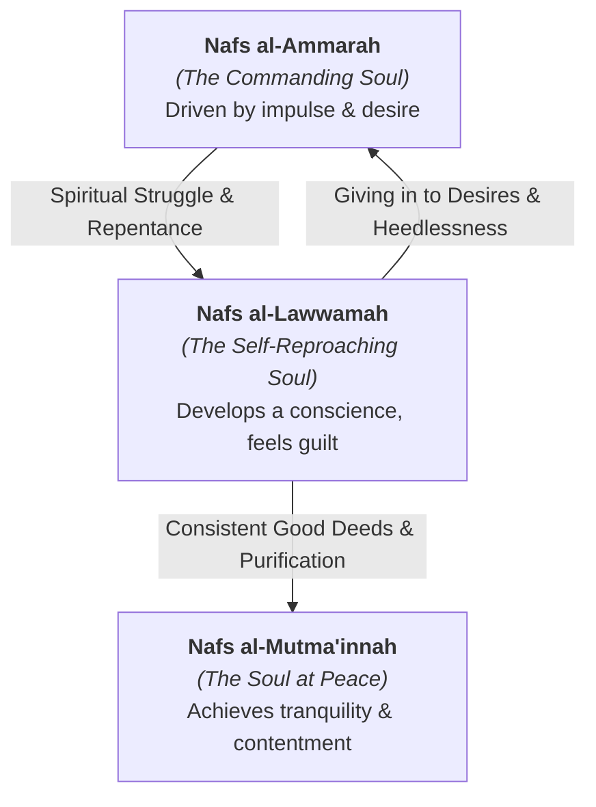
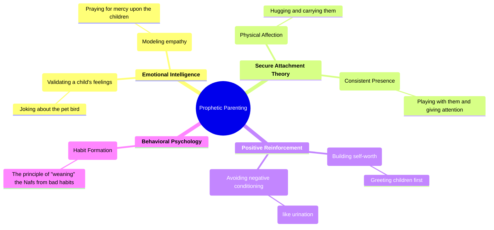
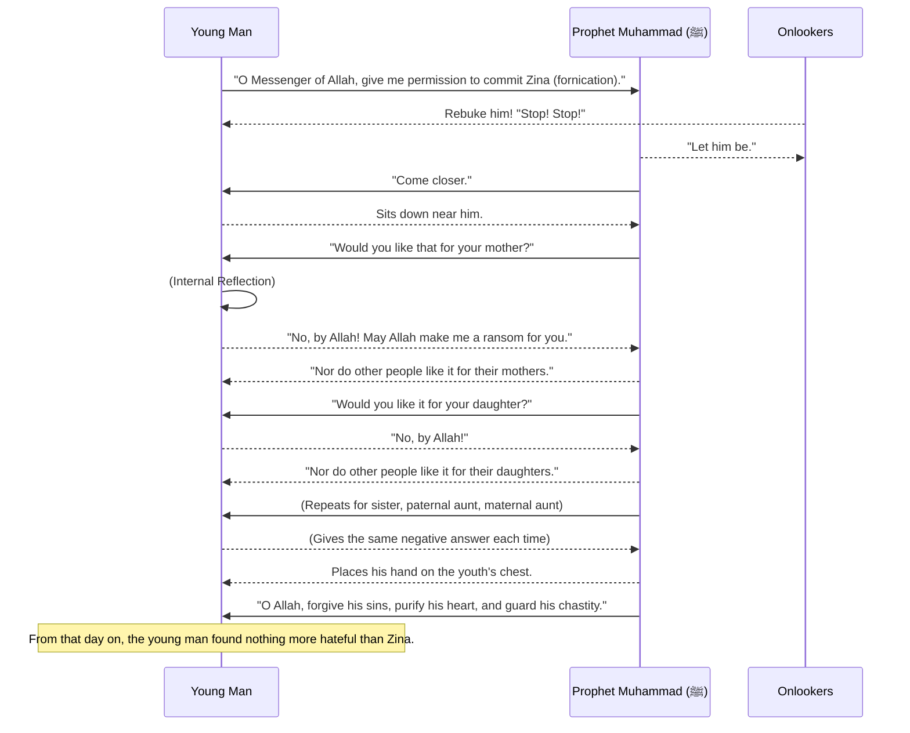
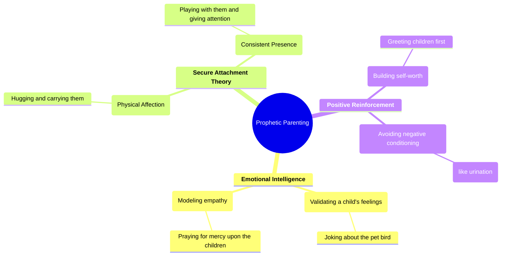
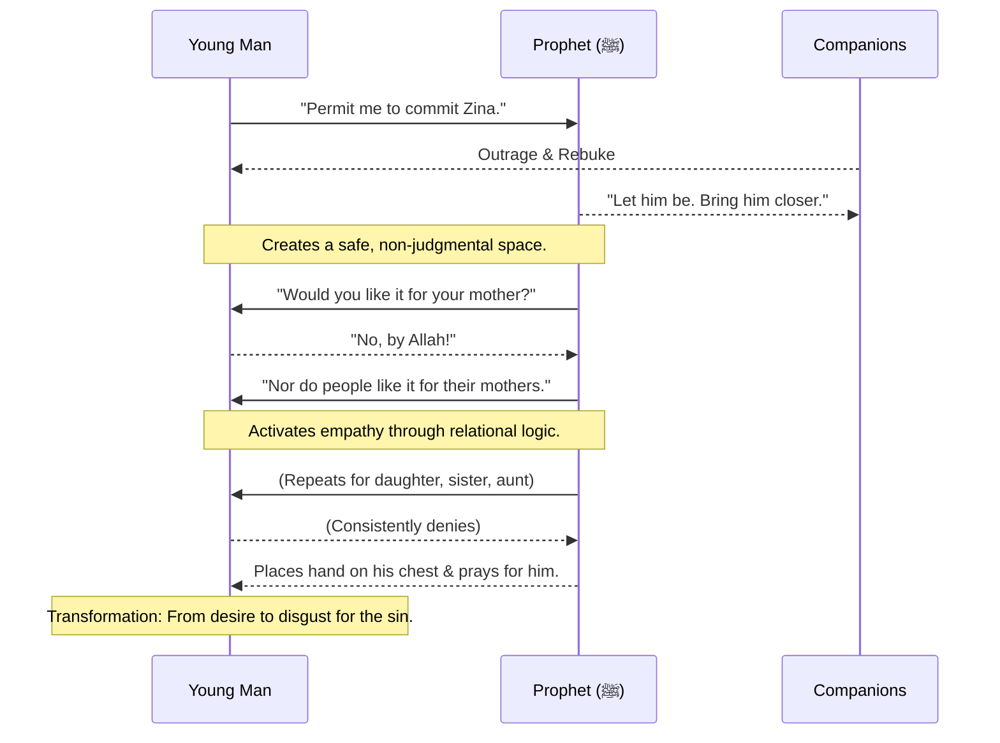
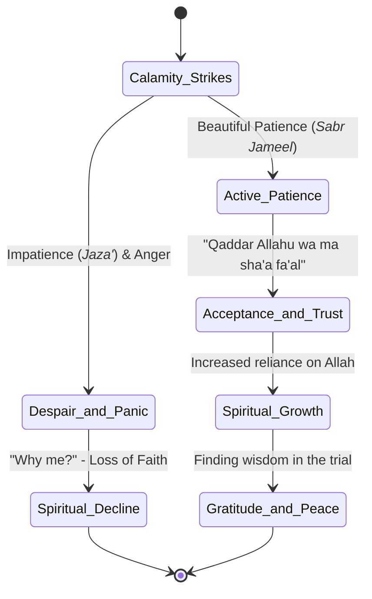

---
tags:
  - psychology
  - islam
  - spirituality
  - self-help
  - mental-health
  - personal-development
  - nafs
  - character-development
aliases:
  - "اسلام اور نفسیات"
  - Islamic Psychology
  - Psychology of the Nafs
creation-date: 2023-10-27
---


# Islam and Psychology: A Modern Guide to the Soul - NOTES

> [!NOTE] About This Guide
> This document is a comprehensive, modern adaptation of the Urdu text "اسلام اور نفسیات" (Islam and Psychology). It aims to bridge timeless Islamic wisdom on the human soul (`Nafs`) with contemporary psychological concepts, making it accessible and actionable for a modern audience. Every core idea from the original has been preserved and enriched with case studies, modern terminology, and visual aids.

---

## Part 1: The Foundation of Islamic Psychology

### 1.1 The Driving Forces: Hope and Fear

At its core, human motivation is a psychological dance between hope and fear. Every step we take, every decision we make, is rooted in the hope of attaining something positive or the fear of encountering something negative. This internal landscape of thoughts, intentions, and desires is the domain of psychology.

In Islam, this field is understood through the concept of the **`Nafs`**—a term that encompasses the self, psyche, ego, and soul.

### 1.2 The Three States of the Self (Nafs)

The Quran outlines a developmental journey for the `Nafs`, which can be understood as stages of spiritual and psychological maturity. It's not a linear path but a dynamic state that can fluctuate based on our choices and environment.

> [!quote] The Commanding Soul: Nafs al-Ammarah
> **إِنَّ النَّفْسَ لَأَمَّارَةٌ بِالسُّوءِ**
>
> *"Indeed, the soul is a persistent enjoiner of evil."*
> — Quran, Surah Yusuf (12:53)

-   **Description:** This is the default, untrained state of the self. It's impulsive, driven by base desires (like the Freudian "Id"), and prone to commanding evil without immediate remorse.
-   **Modern Parallel:** Poor impulse control, addiction cycles, emotional dysregulation, acting on raw emotion without foresight.

> [!quote] The Self-Reproaching Soul: Nafs al-Lawwamah
> **وَلَا أُقْسِمُ بِالنَّفْسِ اللَّوَّامَةِ**
>
> *"And I swear by the self-reproaching soul."*
> — Quran, Surah Al-Qiyamah (75:2)

-   **Description:** This is the awakened conscience. The `Nafs` here recognizes its mistakes, feels guilt, and strives to correct itself. It's in a constant state of struggle between good and evil.
-   **Modern Parallel:** Developing self-awareness, the voice of conscience, cognitive dissonance, and the process of cognitive reframing after a mistake.

> [!quote] The Soul at Peace: Nafs al-Mutma'innah
> **يَا أَيَّتُهَا النَّفْسُ الْمُطْمَئِنَّةُ**
>
> *"O soul, in complete rest and satisfaction!"*
> — Quran, Surah Al-Fajr (89:27)

-   **Description:** This is the state of ultimate psychological and spiritual tranquility. The soul is no longer at war with itself because it finds peace in aligning with divine truth and goodness.
-   **Modern Parallel:** A state of "flow," psychological resilience, emotional regulation, self-actualization, and deep, intrinsic contentment.



### 1.3 The Ultimate Cure: Tawhid and Tawakkul

The core therapeutic principle in Islam for all psychological distress is the combination of **`Tawhid`** (unshakeable belief in the Oneness of God) and **`Tawakkul`** (profound trust in God).

When a person feels overwhelmed and all material solutions fail, they instinctively look for a higher, unseen power. Islam builds its entire framework on this innate need *before* a crisis hits.

> [!quote] The One Who Responds to the Distressed
> **أَمَّن يُجِيبُ الْمُضْطَرَّ إِذَا دَعَاهُ وَيَكْشِفُ السُّوءَ...**
>
> *"Is He [not best] who responds to the desperate one when he calls upon Him and removes the evil...?"*
> — Quran, Surah An-Naml (27:62)

This verse points to a universal psychological reality: in moments of true desperation, the human psyche seeks a singular, powerful savior. Islam channels this into a constant, stable belief system.

This is reinforced by a powerful lesson the Prophet Muhammad (ﷺ) gave to his young cousin, Ibn Abbas (RA).

> [!quote] The Prophetic Advice to Ibn Abbas (RA)
> **...يَا غُلَامُ... احْفَظِ اللَّهَ يَحْفَظْكَ، احْفَظِ اللَّهَ تَجِدْهُ تُجَاهَكَ، وَإِذَا سَأَلْتَ فَاسْأَلِ اللَّهَ، وَإِذَا اسْتَعَنْتَ فَاسْتَعِنْ بِاللَّهِ، وَاعْلَمْ أَنَّ الْأُمَّةَ لَوِ اجْتَمَعَتْ عَلَى أَنْ يَنْفَعُوكَ بِشَيْءٍ لَمْ يَنْفَعُوكَ إِلَّا بِشَيْءٍ قَدْ كَتَبَهُ اللَّهُ لَكَ، وَلَوِ اجْتَمَعُوا عَلَى أَنْ يَضُرُّوكَ بِشَيْءٍ لَمْ يَضُرُّوكَ إِلَّا بِشَيْءٍ قَدْ كَتَبَ اللَّهُ عَلَيْكَ، رُفِعَتِ الْأَقْلَامُ وَجَفَّتِ الصُّحُفُ**
>
> *"O young man... Be mindful of Allah, and Allah will protect you. Be mindful of Allah, and you will find Him in front of you. If you ask, ask of Allah; if you seek help, seek help from Allah. Know that if the nations were to gather together to benefit you with something, they would not benefit you except with what Allah has decreed for you. And if they were to gather together to harm you with something, they would not harm you except with what Allah has decreed for you. The pens have been lifted and the pages have dried."*
> — Tirmidhi, 2516

This Hadith is a powerful tool for cognitive reframing, teaching:
-   **Internal Locus of Control (with a divine anchor):** Your protection comes from your mindfulness of God, not external factors.
-   **Radical Acceptance:** An understanding that outcomes are ultimately decreed, which frees one from crippling anxiety over "what ifs."
-   **Psychological Immunity:** Reduces dependency on people's approval or fear of their disapproval.

> [!summary] Scaffold Summary: The Foundation
> - **Core Principle:** The human psyche (`Nafs`) is on a journey from a state of chaos to a state of peace, driven by hope and fear.
> - **Key Islamic Guidance:** True psychological well-being is anchored in `Tawhid` (Oneness of God) and `Tawakkul` (Trust in God).
> - **Modern Psychological Parallel:** Concepts of self-actualization, emotional regulation, and developing an internal locus of control.
> - **Actionable Takeaway:** When feeling anxious or powerless, consciously remind yourself of the advice to Ibn Abbas: your security lies with God, not with people or circumstances.

---

## Part 2: Psychology Through the Lifespan

### 2.1 The Formative Years: The Psychology of Children

A child's mind is like a blank slate (`tabula rasa`). Their personality, habits, and worldview are profoundly shaped by their upbringing. Early experiences etch themselves deeply and are hard to erase in adulthood.

> [!quote] The Nature of the Nafs
> **النَّفْسُ كَالطِفْلِ إِنْ تُهْمِلْهُ شَبَّ عَلَى حُبِّ الرَّضَاعِ وَإِنْ تَفْطِمْهُ يَنْفَطِمِ**
>
> *"The soul is like an infant; if you let it, it will grow up loving to suckle, but if you wean it, it will be weaned."*
> — Imam al-Busiri, Qasidat al-Burdah

This poetic verse highlights a key psychological principle: **habits, whether good or bad, are formed through reinforcement.**

#### Prophetic Principles for Positive Parenting

The Prophet Muhammad (ﷺ) demonstrated a sophisticated and compassionate approach to child psychology.

1.  **Affection and Playfulness:** He engaged with children on their level.
    -   He affectionately called for Imam Hassan (RA) using a playful nickname, asking, **"أَيْنَ لُكَعُ"** ("Where is the little one?") (Bukhari, 5884).
    -   He would joke with a young boy about his pet bird: **"يَا أَبَا عُمَيْرٍ مَا فَعَلَ النُّغَيْرُ"** ("O Abu `Umair, what did the little nightingale do?") (Bukhari, 6203). This shows validation of a child's world and interests.
    -   He would playfully spray water from his mouth on a five-year-old boy, Mahmud ibn Rabi' (RA), as a form of gentle fun (Bukhari, 77).

2.  **Building Self-Esteem:** He showed respect and gave them importance.
    -   He would greet children first when he passed by them, a practice narrated by Anas ibn Malik (RA) (Bukhari, 6247). This builds a child's sense of worth.
    -   He would allow his grandsons, Hassan and Hussein (RA), to climb on his back while he was praying (Tirmidhi, 3769).
    -   He would affectionately call Anas (RA) **"يَا ذَا الْأُذُنَيْنِ"** ("O one with two ears!"), a gentle, endearing tease (Tirmidhi, 1992).

3.  **Unconditional Mercy:** He modeled compassion.
    -   He would hold Usama ibn Zayd on one thigh and Hassan on the other, hug them, and pray, **"O Allah, be merciful to them, as I am merciful to them"** (Bukhari, 6003). This links human affection with divine mercy.

4.  **Practicality and Lack of Judgment:**
    -   When a baby urinated on his clothes, he simply called for water and poured it over the area without showing anger or disgust (Bukhari, 222). This teaches that mistakes are not catastrophes.
    -   When a young Abdullah ibn Abbas (RA) walked in front of the rows of prayer in Mina, no one stopped him, showing tolerance for children's behavior (Bukhari, 76).

#### Modern Psychological Parallels:



> [!danger] The Impact of Negative Parenting
> The text warns that parental neglect, constant criticism, and excessive physical punishment can be deeply damaging. Conversely, allowing a child complete freedom without boundaries is also harmful, as it creates an adult who cannot handle life's frustrations and challenges. The phrase **"Spare the rod and spoil the child"** is mentioned, which in a modern context is less about physical punishment and more about the necessity of providing **loving, firm boundaries** for healthy development.

> [!summary] Scaffold Summary: Child Psychology
> - **Core Principle:** A child's psyche is highly impressionable. Their future character is built on the foundation of their upbringing.
> - **Key Islamic Guidance:** The Prophet's (ﷺ) interactions with children model affection, respect, mercy, and positive reinforcement.
> - **Modern Psychological Parallel:** Secure Attachment Theory, Emotional Intelligence (EQ), and the importance of boundaries in behavioral psychology.
> - **Actionable Takeaway:** Validate your child's world. Greet them with enthusiasm, show physical affection, and correct their mistakes with gentle guidance, not anger.

### 2.2 The Age of Passion: The Psychology of Youth

Youth is a period of sincerity, passion, and immense potential. However, it is also an age of impressionability. Young people are drawn to new ideas, trends, and movements, making them both powerful agents for change and vulnerable to misguidance.

> [!quote] The Blinding Nature of Passion
> **حُبُّكَ الشَّىْءَ يُعْمِي وَيُصِمُّ**
>
> *"Your love for something can make you blind and deaf."*
> — Abu Dawud, 5130

This Hadith perfectly captures the psychology of youthful passion. When a young person becomes infatuated with an idea, a person, or a cause, it can cloud their judgment and prevent them from seeing its flaws. This is a classic example of **confirmation bias**.

#### Key Psychological Traits of Youth:

-   **High Impressionability (`Talween`):** The text uses the Sufi term `Talween`, which means "coloration." It describes the tendency to quickly "take on the color" of new influences—new friends, new ideologies, new technologies, or new spiritual paths.
-   **Desire for Agency and Leadership:** Young people are eager to make an impact. However, the text warns that entrusting leadership to the inexperienced can be disastrous for organizations and movements.
-   **Vulnerability to Insecurity:** Issues like appearance (acne, weight), social status, or perceived inadequacies can lead to a deep sense of inferiority (`Ehsaas-e-Kamtari`) or, conversely, an overcompensating superiority complex.

> [!casestudy] Case Study: Amir and the "Activist" Influencer
> Amir, a 19-year-old university student, is passionate about social justice. He starts following an online influencer who posts fiery, charismatic videos calling for radical action against a certain injustice. The influencer's message is simple, emotionally charged, and offers a clear "us vs. them" narrative.
>
> -   **The "Blind and Deaf" Effect:** Amir becomes so engrossed that he ignores friends who point out the influencer's lack of credible sources and history of promoting misinformation. His love for the "cause" makes him blind to the flaws of the messenger.
> -   **`Talween` (Coloration):** Amir starts adopting the influencer's aggressive speaking style, rhetoric, and black-and-white worldview.
> -   **The Islamic Guidance:** Islam would advise Amir to seek knowledge from established, wise sources, to verify information, and to channel his passion through productive, not destructive, means. It would caution him against a passion that overrides critical thinking.

The text also highlights the danger of leadership without wisdom, citing a Hadith:

> [!quote] On Youthful Leadership
> **تَعَوَّذُوا بِاللَّهِ مِنْ رَأْسِ السَّبْعِينَ وَمِنْ إِمَارَةِ الصِّبْيَانِ**
>
> *"Seek refuge in Allah from the turn of the seventieth year (i.e., a time of turmoil) and from the leadership of the young."*
> — Musnad Ahmad, 8302

This is not a blanket prohibition but a caution against the impulsivity and lack of experience that can characterize youth, advising that leadership requires seasoned wisdom.

> [!summary] Scaffold Summary: Youth Psychology
> - **Core Principle:** Youth is a time of high energy and impressionability, making young people powerful but vulnerable.
> - **Key Islamic Guidance:** Passion must be tempered with wisdom. "Love for a thing can make you blind and deaf." Leadership requires experience.
> - **Modern Psychological Parallel:** Identity Formation (Erikson), peer pressure, cognitive biases (confirmation bias), and the Dunning-Kruger effect in leadership.
> - **Actionable Takeaway:** If you are a young person, actively seek mentorship from wise, experienced individuals. Question your passions and ensure they are grounded in knowledge and reality, not just emotion.

### 2.3 The Age of Wisdom: The Psychology of the Elderly

Old age is described as a return to a state of vulnerability, similar to childhood. Physical strength wanes, and dependency may increase.

> [!quote] The Reversal in Creation
> **وَمَن نُّعَمِّرْهُ نُنَكِّسْهُ فِي الْخَلْقِ ۖ أَفَلَا يَعْقِلُونَ**
>
> *"And he to whom We grant long life, We reverse him in creation. Will they not then understand?"*
> — Quran, Surah Ya-Sin (36:68)

This "reversal" is a profound psychological and physical reality. However, what the elderly may lose in physical vitality, they gain in life experience, making them a source of immense wisdom. The text describes an experienced old person as a **"precious diamond."**

#### The Dual Nature of Old Age

1.  **The Elder as a Sage:** An elder is like a "seasoned wolf who knows the tricks of the hunt" (`gurg-e-kuhan`). Their experience is invaluable, and their advice should be sought.
2.  **The Vulnerability of the Elder:** Despite their wisdom, the elderly can also be prone to specific psychological challenges.

> [!quote] The Heart of an Old Person
> **قَلْبُ الشَّيْخِ شَابٌّ عَلَى حُبِّ اثْنَتَيْنِ: طُولِ الْحَيَاةِ وَحُبِّ الْمَالِ**
>
> *"The heart of an old person remains young in its love for two things: long life and love of wealth."*
> — Muslim, 1046

This Hadith points to a psychological reality: as one's time on earth shortens, the attachment to life and the security of wealth can paradoxically increase. This isn't a criticism but an observation of the human condition.

#### The Duty Towards Elders

The Quran places immense emphasis on treating the elderly, especially parents, with the utmost respect and compassion (`Ihsan`).

> [!quote] Do Not Say to Them Even "Uff"
> **...فَلَا تَقُل لَّهُمَا أُفٍّ وَلَا تَنْهَرْهُمَا وَقُل لَّهُمَا قَوْلًا كَرِيمًا**
>
> *"...say not to them [so much as], "uff" [an expression of irritation], and do not repel them but speak to them a noble word."*
> — Quran, Surah Al-Isra (17:23)

-   **Psychological Insight:** The prohibition of saying "uff" is profound. It's the smallest, most dismissive sound of annoyance. The Quran is teaching us to manage our own micro-aggressions and emotional reactions when caring for those who are vulnerable. It commands **emotional regulation** in the service of dignity.

> [!summary] Scaffold Summary: Elderly Psychology
> - **Core Principle:** Old age is a period of physical decline but potential spiritual and experiential wisdom.
> - **Key Islamic Guidance:** Treat the elderly with supreme honor and gentle speech (`qawlan karima`), and value their life experience.
> - **Modern Psychological Parallel:** Geriatric psychology, the importance of maintaining dignity in old age, generativity vs. stagnation (Erikson), and legacy building.
> - **Actionable Takeaway:** Actively listen to the stories and advice of your elders. When caring for them, be hyper-aware of your own non-verbal cues and tone of voice.

---

## Part 3: Applied Social Psychology

### 3.1 The Psychology of Women and Marital Dynamics

The document approaches the psychology of women primarily within the context of marriage and family, emphasizing the importance of mutual respect and emotional intelligence.

#### The Foundation: A Husband's Noble Character

The text establishes a high standard for a husband's conduct: the Prophet Muhammad (ﷺ) **never once complained about his wives to their parents.** This is presented as the pinnacle of a noble marital character, protecting his spouse's dignity and keeping marital issues private. A woman's greatest psychological need within her in-laws' home is to feel honored and respected, especially by her husband in front of his family.

> [!casestudy] Conflict Resolution: The Prophet, Aisha, and Abu Bakr (RA)
> The text narrates an incident where Abu Bakr (RA) entered the Prophet's (ﷺ) home and heard his daughter, Aisha (RA), speaking in a loud voice. He moved to strike her for raising her voice to the Prophet (ﷺ), but the Prophet intervened and stood between them. After Abu Bakr left in anger, the Prophet (ﷺ) turned to Aisha and said with a smile, **"See how I saved you from the man?"**
> Later, when Abu Bakr returned and saw them reconciled and happy, he said, "Include me in your peace as you included me in your conflict." The Prophet (ﷺ) replied, "We have, we have." (Abu Dawud, 4999).
>
> **Psychological Breakdown:**
> 1.  **De-escalation:** The Prophet (ﷺ) did not escalate the conflict. He physically and emotionally shielded his wife.
> 2.  **Emotional Repair:** His light-hearted comment ("See how I saved you?") immediately broke the tension and re-established their bond. This is a classic example of a "repair attempt" in modern relationship therapy (Gottman).
> 3.  **Re-inclusion:** Abu Bakr's request to be "included in the peace" shows a mature desire for communal harmony, which the Prophet (ﷺ) affirms.

#### Understanding a Key Hadith

The document cites a famous and often misunderstood Hadith.

> [!quote] Created from a Rib
> **اسْتَوْصُوا بِالنِّسَاءِ، فَإِنَّ الْمَرْأَةَ خُلِقَتْ مِنْ ضِلَعٍ، وَإِنَّ أَعْوَجَ شَىْءٍ فِي الضِّلَعِ أَعْلاَهُ، فَإِنْ ذَهَبْتَ تُقِيمُهُ كَسَرْتَهُ، وَإِنْ تَرَكْتَهُ لَمْ يَزَلْ أَعْوَجَ، فَاسْتَوْصُوا بِالنِّسَاءِ**
>
> *"Treat women kindly, for woman was created from a rib, and the most crooked part of the rib is its upper part. If you try to straighten it, you will break it, and if you leave it, it will remain crooked. So treat women kindly."*
> — Bukhari, 3331

-   **Metaphorical Interpretation:** Rather than a literal biological statement, this is a powerful psychological metaphor. A rib is crooked by design; its curve is its strength, allowing it to protect the heart. Trying to "straighten" it (i.e., force a woman to fit a rigid, masculine mold of thinking or behaving) will "break" the relationship.
-   **The Core Message:** The Hadith doesn't say "women are flawed." It says **"treat them with kindness"** (a command repeated twice!). It's a call for acceptance, flexibility, and understanding, recognizing that men and women may have different emotional and psychological natures that should be honored, not forcibly changed. It's a lesson in **empathy** and **adapting one's approach.**

> [!summary] Scaffold Summary: Gender & Marital Psychology
> - **Core Principle:** Healthy marital dynamics are built on mutual dignity, effective conflict resolution, and emotional intelligence.
> - **Key Islamic Guidance:** The Prophet's (ﷺ) example of never shaming his spouses and the Hadith of the "rib" both command kindness, gentleness, and understanding.
> - **Modern Psychological Parallel:** Gottman Institute's "repair attempts" in relationships, attachment styles, and the importance of emotional validation.
> - **Actionable Takeaway:** In a conflict with a loved one, prioritize de-escalation over "winning" the argument. Look for opportunities for humor and affection to repair the bond.

### 3.2 The Art of Communication: The Psychology of Preaching (`Tabligh`)

Effective communication, especially when conveying a message of truth, is a science and an art. Islam provides a clear psychological framework for it.

> [!quote] The Three Tools of Effective Communication
> **ادْعُ إِلَىٰ سَبِيلِ رَبِّكَ بِالْحِكْمَةِ وَالْمَوْعِظَةِ الْحَسَنَةِ ۖ وَجَادِلْهُم بِالَّتِي هِيَ أَحْسَنُ**
>
> *"Invite to the way of your Lord with wisdom and good instruction, and argue with them in a way that is best."*
> — Quran, Surah An-Nahl (16:125)

1.  **`Hikmah` (Wisdom):** Knowing what to say, when to say it, and to whom. It's strategic, empathetic, and tailored to the audience's psychological state.
2.  **`Maw'idha Hasanah` (Good Instruction):** Gentle, heartfelt reminders that appeal to the heart, not just the intellect.
3.  **`Jadal Billati Hiya Ahsan` (Arguing in the Best Way):** Engaging in debate with respect, logic, and the best possible manners, aiming for clarity, not domination.

The text emphasizes using simple, sincere language (`Qawlan Sadida` - "straightforward speech") and avoiding overly complex, ostentatious rhetoric, which is described as being from Satan.

#### Masterclass in Empathetic Redirection

The most powerful example provided is a young man who approached the Prophet (ﷺ) with a shocking request.


**Psychological Analysis:**
-   **Non-judgmental Stance:** The Prophet (ﷺ) did not shame or condemn the youth. He created a safe space for an honest, albeit shocking, conversation.
-   **Socratic Method:** He didn't lecture. He asked a series of questions that led the young man to his own conclusion.
-   **Cognitive Reframing & Empathy Induction:** He shifted the young man's perspective from an abstract desire to its concrete, relational consequences. He forced him to feel what it would be like if his own family members were the victims. This is a powerful empathy-building exercise.
-   **Spiritual Intervention:** After the logical and emotional work was done, he concluded with a prayer, addressing the spiritual root of the problem.

> [!summary] Scaffold Summary: Communication Psychology
> - **Core Principle:** Effective communication is wise, gentle, and respectful. It engages the heart and mind without aggression.
> - **Key Islamic Guidance:** The Quranic command to use `Hikmah` and the Prophet's (ﷺ) handling of the young man who wanted to commit zina.
> - **Modern Psychological Parallel:** Motivational Interviewing, the Socratic Method, Cognitive Reframing, and the importance of empathy in therapy.
> - **Actionable Takeaway:** When trying to advise someone, don't lecture. Ask questions that lead them to see the consequences of their actions from a different perspective.

### 3.3 The Weight of Power: The Psychology of Rulers

The psychology of those in power (`hukmuran`) is unique. The text suggests that secular rulers often operate on a "government-saving policy," driven by fear of a worldly superpower rather than fear of God. Their actions, even religious ones like attending funerals or performing `Umrah`, can become political performances.

#### The Core Remedy for a Leader:

-   **`Tawakkul` (Trust in God):** The ultimate antidote to fearing other powers.
    > **وَمَن يَتَوَكَّلْ عَلَى اللَّهِ فَهُوَ حَسْبُهُ**
    >
    > *"And whoever relies upon Allah – then He is sufficient for him."* (Quran 65:3)
-   **`Niyyah` (Intention):** The foundation of all actions.
    > **إِنَّمَا الأَعْمَالُ بِالنِّيَّاتِ**
    >
    > *"Actions are but by intentions."* (Bukhari, 1)

#### The Psychology of Bureaucracy and Subordinates:

-   **The Officer's Insecurity:** Some officials suffer from an inferiority complex, manifesting as an obsession with status, protocol (`salutes` instead of `salam`), and a fear of being seen as "backward." This can lead to a hollow, performance-based life.
-   **The Subordinate's Dilemma:** The employee's psychology is often governed by fear: fear of the boss's anger, fear of being fired, fear of a promotion being blocked. This can lead to them carrying out improper orders and developing resentment.
-   **The Cure:** For both, the solution is **`Haqeeqat Pasandi` (Realism/Truthfulness)**. For the officer, this means grounding themselves in reality through practices like visiting graveyards and connecting with genuine spiritual people. For the subordinate, it means performing their duties with integrity and trusting in God for their provision.

> [!summary] Scaffold Summary: The Psychology of Power
> - **Core Principle:** Power corrupts when it is not anchored in divine accountability. It creates a psychology of fear (of losing power) and performance.
> - **Key Islamic Guidance:** True sufficiency comes from trusting God (`Tawakkul`), and the value of all actions is determined by the sincerity of the intention (`Niyyah`).
> - **Modern Psychological Parallel:** The Lucifer Effect (Zimbardo), studies on power dynamics, imposter syndrome in leaders, and workplace psychology.
> - **Actionable Takeaway:** Whether you are in a position of power or subordination, constantly check your intention. Are you acting out of fear of a person or out of a desire to do what is right and trust in God for the outcome?

### 3.4 The Psychology of Social Groups: A Modern Typology

The original text presents a keen sociological and psychological analysis of the different types of people that make up a society. Understanding these profiles is a form of `Hikmah` (wisdom) that allows for more effective and empathetic interaction.

> [!quote] Treat People According to Their Status
> **أَنْزِلُوا النَّاسَ مَنَازِلَهُمْ**
>
> *"Treat people according to their respective ranks."*
> — Abu Dawud, 4842

This doesn't mean to be elitist; it means to understand where people are coming from—their level of knowledge, their concerns, their psychological state—and to engage with them accordingly.

Here is a modernized breakdown of the types described:

1.  **The Pragmatist Majority:**
    -   **Profile:** Their primary focus is on their livelihood (`ma'ash`) and family. They are the fertile ground for new ideas and movements, often providing initial support, but their engagement can be surface-level.
    -   **Psychological Driver:** Security, stability, and a better future for their children.
    -   **How to Engage:** Connect with their core concerns. Show how spiritual principles lead to practical benefits like peace of mind and family well-being.

2.  **The Nominally Religious:**
    -   **Profile:** They practice the basic rituals (daily prayers, Friday prayers, Eid) but may lack deeper engagement or interest beyond that.
    -   **Psychological Driver:** Cultural identity, habit, and a general sense of religious duty.
    -   **How to Engage:** Gentle, non-judgmental reminders (`Maw'idha Hasanah`). Invite them to activities that build community and connection, deepening their experience beyond ritual.

3.  **The Devoted Follower (`Mureed`):**
    -   **Profile:** Deeply attached to a specific religious personality or leader. Their loyalty is their strength, but it can also become a weakness if it turns into blind fanaticism.
    -   **Psychological Driver:** The need for guidance, certainty, and belonging.
    -   **The Danger (`Tanzeemi Islah`):** The text specifically warns against the psychological trap where a follower believes "my leader is the only one who is right." This "leader worship" creates division and is a major source of societal discord.
    -   **How to Engage:** Respect their loyalty while gently encouraging a broader love for all righteous scholars and a focus on the core principles of the Quran and Sunnah, which unite everyone.

4.  **The Academic & The Student:**
    -   **Profile:** Includes university students, professors, doctors, lawyers, and other professionals. They possess high intellectual capacity. The text notes that students can sometimes be drawn into activism at the expense of their studies.
    -   **Psychological Driver:** Logic, reason, evidence, and intellectual stimulation.
    -   **How to Engage:** With robust, logical arguments (`Jadal Billati Hiya Ahsan`). They are best influenced by people of their own intellectual caliber who can bridge the gap between secular knowledge and divine wisdom.

5.  **The Independent Researcher / Modern Thinker:**
    -   **Profile:** A contemporary type who learns about religion on their own, often through the internet. They are "free-thinkers" but can be dangerous if they lack grounding in classical methodology. They often present niche or minority opinions against the consensus (`ijma`) of scholars.
    -   **Psychological Driver:** A desire for authenticity and a rejection of traditional authority.
    -   **The Danger:** Their limited knowledge, combined with charisma, can create "beautiful-sounding" arguments that are fundamentally flawed, leading people astray. They often promote a vague "open-mindedness" to cover for their own lack of scholarly discipline.
    -   **How to Engage:** By highlighting the importance of scholarly tradition and the dangers of taking knowledge from unverified sources. The principle of verifying news from a `fasiq` (unreliable source) is key here.

#### Sheikh Abdul Qadir Jilani's Four-Fold Classification

The text also includes a profound spiritual typology from the great scholar Sheikh Abdul Qadir Jilani (RA):

1.  **The Heedless:** Have neither a tongue (for knowledge) nor a heart (for feeling). They are spiritually inert. *Action: Invite them to awaken.*
2.  **The Hypocritical Orator:** Have a tongue but no heart. They are scholars without action. Their speech is eloquent, but their lives are empty. *Action: Seek refuge in Allah from them.*
3.  **The Hidden Saint:** Have a heart but no tongue. They are reclusive, introspective, and focused on their own faults. *Action: Their companionship is beneficial.*
4.  **The True Inheritor:** Have both a tongue and a heart. They are masters of divine knowledge and spiritual realities, the true successors to the prophets. *Action: Do not oppose them.*

---

## Part 4: A Guide to Spiritual & Mental Ailments

Islam provides a robust framework for identifying and treating common psychological and spiritual diseases that poison the heart and society.

### 4.1 The Corrosive Trio: Envy, Pride, and Anger

These three are deeply interconnected and destructive.

| Spiritual Ailment | Islamic Concept | Modern Psychological Parallel | Quranic/Hadith Guidance | Islamic Remedy |
| :--- | :--- | :--- | :--- | :--- |
| **Envy** | `Hasad` | Social Comparison Theory, Status Anxiety, Resentment | "Beware of envy, for envy consumes good deeds just as fire consumes wood." (Abu Dawud, 4903) | Practicing gratitude, wishing well for others, focusing on one's own blessings. |
| **Pride/Arrogance** | `Kibr` | Narcissism, Superiority Complex, Self-Importance | "No one who has an atom's weight of arrogance in his heart will enter Paradise." (Muslim, 91) | Humility, self-reflection, attributing success to God, and consciously choosing to not look down on others. |
| **Anger** | `Ghadab` | Poor Emotional Regulation, Intermittent Explosive Disorder | "The strong man is not the one who can wrestle, but the strong man is the one who controls himself when he is angry." (Bukhari, 6114) | Physical displacement (sitting down, lying down), performing ablution (`wudu`), seeking refuge in God from Satan. |

The text states that a person cannot be considered a true scholar (`'alim`) until they are free from three things: envying those above them, looking down on those below them, and using their knowledge to seek worldly gain.

### 4.2 The Poison of the Tongue: Suspicion, Gossip, and Slander

The tongue is a primary source of social and psychological harm. The Quran's Surah Al-Hujurat provides a masterclass in social psychology.

> [!quote] A Guideline for Social Harmony
> **يَا أَيُّهَا الَّذِينَ آمَنُوا اجْتَنِبُوا كَثِيرًا مِّنَ الظَّنِّ إِنَّ بَعْضَ الظَّnِّ إِثْمٌ ۖ وَلَا تَجَسَّسُوا وَلَا يَغْتَب بَّعْضُكُم بَعْضًا...**
>
> *"O you who have believed, avoid much [negative] assumption. Indeed, some assumption is sin. And do not spy or backbite each other..."*
> — Quran, Surah Al-Hujurat (49:12)

-   **`Zann` (Suspicion/Assumption):** This is the root of many evils. It's a cognitive bias where we assume the worst of others. Islam commands us to actively avoid this and practice **`Husn al-Zann` (thinking well of others).**
-   **`Tajasuss` (Spying):** Actively seeking out the faults of others. This is forbidden because it violates privacy and fosters a culture of mistrust.
-   **`Ghibah` (Backbiting/Gossip):** Speaking about someone in their absence in a way they would dislike. The Quran uses the powerful, visceral metaphor of **"eating the flesh of your dead brother"** to create psychological revulsion towards this act.

> [!danger] The Self-Fulfilling Prophecy of Suspicion
> The Prophet (ﷺ) warned: *"When you go searching for the faults of people, you corrupt them."* (Abu Dawud, 4888). This is a profound psychological insight. Constantly suspecting and investigating people can push them into the very behavior you suspect them of, or at the very least, destroy any chance of a trusting relationship.

### 4.3 The Psychology of Haste vs. Patience

The human psyche has a natural inclination towards impatience and haste, which the Quran identifies as a core weakness.

> [!quote] Man was Created of Haste
> **خُلِقَ الْإِنسَانُ مِنْ عَجَلٍ...**
>
> *"Man was created of haste..."* (Quran 21:37)

This haste manifests in wanting immediate results, quick fixes, and instant gratification. It is contrasted with **`Anāh` (patience, deliberation)**, which is a divine quality.

> [!quote] Patience is from Allah, Haste is from Satan
> **الْأَنَاةُ مِنَ اللَّهِ وَالْعَجَلَةُ مِنَ الشَّيْطَانِ**
>
> *"Deliberation is from Allah, and haste is from the Satan."*
> — Tirmidhi, 2012

-   **Psychological Implication:** Haste leads to poor decision-making, regret, and accidents. It's a reactive state. Patience allows for foresight, planning, and a proactive approach to life. It is the foundation of wisdom.

### 4.4 Psychoanalysis and the Path to Healing

The text offers profound insights into self-healing, especially from guilt and past mistakes.

#### The Psychology of Rehabilitation vs. Shaming

> [!casestudy] Do Not Help Satan Against Your Brother
> A man was brought to the Prophet (ﷺ) for being drunk. After he was punished, one of the companions cursed him, saying, "May Allah disgrace you!" The Prophet (ﷺ) immediately intervened:
> **لَا تَقُولُوا هَكَذَا، لَا تُعِينُوا عَلَيْهِ الشَّيْطَانَ**
>
> *"Do not say that. Do not help the Satan against him."* (Bukhari, 6777)
>
> **Psychological Insight:** Shaming and cursing a person who has already stumbled pushes them further away and reinforces their negative self-image, making it harder for them to recover. It's like kicking someone when they're down. The Prophet (ﷺ) teaches a model of **restorative justice**, where the goal is to rehabilitate the person, not to destroy their dignity.

#### The Power of Self-Analysis: `Sayyid al-Istighfar`

The text presents the "Master Supplication for Forgiveness" not just as a prayer, but as a powerful tool for **psychoanalysis and healing.**

> [!quote] The Master Supplication for Forgiveness
> **اللَّهُمَّ أَنْتَ رَبِّي لَا إِلَهَ إِلَّا أَنْتَ، خَلَقْتَنِي وَأَنَا عَبْدُكَ، وَأَنَا عَلَى عَهْدِكَ وَوَعْدِكَ مَا اسْتَطَعْتُ، أَعُوذُ بِكَ مِنْ شَرِّ مَا صَنَعْتُ، أَبُوءُ لَكَ بِنِعْمَتِكَ عَلَيَّ، وَأَبُوءُ لَكَ بِذَنْبِي، فَاغْفِرْ لِي، فَإِنَّهُ لَا يَغْفِرُ الذُّنُوبَ إِلَّا أَنْتَ**
>
> *"O Allah, You are my Lord, there is no god but You. You created me and I am Your slave, and I am faithful to my covenant and my promise as much as I can. I seek refuge in You from the evil of what I have done. I acknowledge Your favor upon me, and I acknowledge my sin. So forgive me, for verily none forgives sins except You."* (Bukhari, 6306)

**A Psychoanalytic Breakdown:**
1.  **Establishing the Foundation:** "You are my Lord... You created me." (Acknowledging the fundamental relationship).
2.  **Affirming Aspiration:** "I am faithful to my covenant... as much as I can." (Recognizing one's sincere intention despite human limitation).
3.  **Taking Responsibility:** "I seek refuge from the evil of what I have done... I acknowledge my sin." (This is the crucial step of owning one's actions without making excuses).
4.  **Practicing Gratitude:** "I acknowledge Your favor upon me." (Balancing the negative of the sin with the positive of God's blessings, preventing a spiral into pure self-loathing).
5.  **Seeking Resolution:** "So forgive me..." (The ultimate step of seeking closure and moving forward).

The Prophet (ﷺ) also said: **"الندم توبة"** ("Regret is repentance"). This feeling of regret is the psychological catalyst for change.

---

## Part 5: The Path to True Success

### 5.1 The Art of Winning Hearts (`Taskheer`)

How does one gain the love and respect of others in a genuine way? The text offers a powerful two-step formula based on `Zuhd` (detachment).

> [!quote] The Formula for Being Loved
> **ازْهَدْ فِي الدُّنْيَا يُحِبَّكَ اللَّهُ، وَازْهَدْ فِيمَا عِنْدَ النَّاسِ يُحِبَّكَ النَّاسُ**
>
> *"Be detached from the world, and Allah will love you. Be detached from what is in people's hands, and the people will love you."*
> — Ibn Majah, 4102

-   **Psychological Insight:** People are naturally repelled by neediness and attracted to self-sufficiency. When you don't want anything from people (their money, their praise, their validation), they feel psychologically safe with you and are drawn to your character. Your value is intrinsic, not dependent on them.

### 5.2 The Cure of Contentment (`Rida`) and Overcoming Anxiety

The text contrasts the debilitating state of **Tension** with the liberating state of **`Rida` (Contentment with God's Decree).**

-   **Tension:** Described as a "self-punishment and wastage of time." It keeps you busy doing nothing and changes nothing. It stems from a lack of acceptance.
-   **`Rida`:** The psychological state of being at peace with what God has ordained. It is not passive resignation but a proactive acceptance that frees the mind and heart from the anxiety of "what if."

> [!quote] The Antidote to "What If"
> **...وَإِنْ أَصَابَكَ شَىْءٌ فَلاَ تَقُلْ لَوْ أَنِّي فَعَلْتُ كَانَ كَذَا وَكَذَا ‏.‏ وَلَكِنْ قُلْ قَدَرُ اللَّهِ وَمَا شَاءَ فَعَلَ ‏.‏ فَإِنَّ لَوْ تَفْتَحُ عَمَلَ الشَّيْطَانِ**
>
> *"...If something befalls you, do not say, 'If only I had done such and such,' but rather say, 'Qaddar Allahu wa ma sha'a fa'al' (Allah has decreed, and what He willed, He did). For 'if only' opens the door to the work of Satan."*
> — Muslim, 2664

This is a direct command for **cognitive reframing**. The phrase "if only" (`law`) fuels regret, anxiety, and a sense of powerlessness—the "work of Satan." The alternative phrase, "Allah has decreed," promotes **Radical Acceptance**, a key technique in modern therapies like DBT, which helps individuals break free from cycles of suffering.

### 5.3 The Profile of the Truly Successful Person

The document concludes by synthesizing these ideas into a profile of the psychologically and spiritually healthy individual. This person is not defined by wealth or status, but by their inner state.

#### The Truly Rich Person:
> **لَيْسَ الْغِنَى عَنْ كَثْرَةِ الْعَرَضِ، وَلَكِنَّ الْغِنَى غِنَى النَّفْسِ**
>
> *"Richness is not in having many possessions, but richness is the richness of the soul."*
> — Muslim, 1051
This is someone who has achieved `Nafs al-Mutma'innah` (the soul at peace).

#### The Truly Successful Person:
> **قَدْ أَفْلَحَ مَنْ أَسْلَمَ، وَرُزِقَ كَفَافًا، وَقَنَّعَهُ اللَّهُ بِمَا آتَاهُ**
>
> *"He has succeeded who accepts Islam, is provided with sufficient sustenance, and is made content by Allah with what He has given him."*
> — Muslim, 1054
Success is a formula of: **Guidance + Sufficiency + Contentment (`Qana'ah`)**.

#### The Truly Wise and Prudent Person:
The Prophet (ﷺ) was asked who is the most intelligent (`akhyas`) and most prudent (`ahzam`) of people. He replied:
> **أَكْثَرُهُمْ لِلْمَوْتِ ذِكْرًا وَأَشَدُّهُمُ اسْتِعْدَادًا لَهُ، أُولَئِكَ الأَكْيَاسُ**
>
> *"Those who remember death most often and are best prepared for it. They are the truly intelligent."*
> — Ibn Majah, 4259
-   **Psychological Implication:** Keeping the end in mind (`Mors Certa, Hora Incerta`) is the ultimate life-hack. It forces one to prioritize what truly matters, cutting through the trivialities that cause much of our daily anxiety. It is the ultimate tool for **value-based living.**

Ultimately, the Islamic framework for psychology is a holistic one. It integrates the spiritual, emotional, cognitive, and social aspects of a person, providing a clear and comprehensive roadmap to achieving a state of profound and resilient well-being—a soul at peace with itself, with creation, and with its Creator.


---
---

Excellent. I will now generate the complete, enhanced, and multi-dimensional guide based on our finalized plan.

This definitive version will be a single, comprehensive document that weaves together the original text's wisdom with the new, enriched content. It will be structured for clarity, practicality, and deep engagement, ready for use.

Here is the final, enhanced guide.

***

# Islam and Psychology: A Modern Guide to the Soul

### **Foreword: A Note on This Guide**

This work is an enriched exploration of the timeless wisdom found in the Urdu text "Islam and Psychology." It is not merely a translation but a bridge, designed to connect the profound Islamic understanding of the human soul (*Nafs*) with the language and challenges of the 21st century.

Our methodology is one of **authenticity first, with modernity as a bridge.** Every concept is rooted in the Quran, the Sunnah of the Prophet Muhammad (ﷺ), and the wisdom of classical scholars. Modern psychological terms and practical exercises are used not to "validate" Islam, but to unlock its sophisticated framework for a new generation. This guide seeks to be comprehensive, practical, and, above all, a means of drawing closer to the truth.

---

## **Part 1: The Foundation of Islamic Psychology**

### **1.1 The Driving Forces: Hope and Fear**

At its core, human motivation is a psychological dance between hope and fear. Every step we take, every decision we make, is rooted in the hope of attaining something positive or the fear of encountering something negative. This internal landscape of thoughts, intentions, and desires is the domain of psychology.

In Islam, this field is understood through the concept of the ***Nafs***—a term that encompasses the self, psyche, ego, and soul. It is the locus of our consciousness, our desires, and our spiritual potential.

### **1.2 The Three States of the Self (Nafs): A Journey of Transformation**

The Quran outlines a developmental journey for the *Nafs*, which can be understood as stages of spiritual and psychological maturity. This is not a fixed, linear path but a dynamic state that can fluctuate based on our choices, environment, and spiritual effort (*mujahadah*).

| Feature | **Nafs al-Ammarah** (The Commanding Soul) | **Nafs al-Lawwamah** (The Self-Reproaching Soul) | **Nafs al-Mutma'innah** (The Soul at Peace) |
| :--- | :--- | :--- | :--- |
| **Core Driver** | Base desires, impulse, ego | Conscience, guilt, aspiration | Love of God, tranquility, truth |
| **Psychological State** | Emotional Dysregulation, Impulsive | Internal Conflict, Self-Awareness | Emotional Stability, Resilience |
| **View of Sin** | Justification, Heedlessness | Regret, Repentance, Fluctuation | Aversion, Seeking Forgiveness |
| **Relationship with God** | Distant, Forgetful | Turning towards and away from God | Close, Secure, Trusting |
| **Modern Analogy** | The unchecked "Id" | The developing "Superego" | The integrated, self-actualized person |


### **1.3 The Ultimate Cure: Tawhid and Tawakkul**

The core therapeutic principle in Islam for all psychological distress is the combination of ***Tawhid*** (unshakeable belief in the Oneness of God) and ***Tawakkul*** (profound trust in God).

When a person feels overwhelmed and all material solutions fail, they instinctively look for a higher, unseen power. Islam builds its entire framework on this innate need *before* a crisis hits.

> **أَمَّن يُجِيبُ الْمُضْطَرَّ إِذَا دَعَاهُ وَيَكْشِفُ السُّوءَ...**
>
> *"Is He [not best] who responds to the desperate one when he calls upon Him and removes the evil...?"*
> — Quran, 27:62

This verse points to a universal psychological reality: in moments of true desperation, the human psyche seeks a singular, powerful savior. Islam channels this into a constant, stable belief system, providing an anchor in the storms of life.

This is powerfully illustrated in the lesson the Prophet Muhammad (ﷺ) gave to his young cousin, Ibn Abbas (RA).

> **...يَا غُلَامُ... احْفَظِ اللَّهَ يَحْفَظْكَ، احْفَظِ اللَّهَ تَجِدْهُ تُجَاهَكَ...**
>
> *"O young man... Be mindful of Allah, and Allah will protect you. Be mindful of Allah, and you will find Him in front of you..."*
> — Tirmidhi, 2516

This Hadith is a powerful tool for cognitive reframing, teaching:
-   **An Internal Locus of Control (with a divine anchor):** Your protection comes from your mindfulness of God, not external factors.
-   **Radical Acceptance:** An understanding that outcomes are ultimately decreed, which frees one from crippling anxiety over "what ifs."
-   **Psychological Immunity:** It reduces dependency on people's approval or fear of their disapproval, fostering a secure sense of self.

---

## **Part 2: Psychology Through the Lifespan**

### **2.1 The Formative Years: The Psychology of Children**

A child's mind is like a blank slate (*tabula rasa*). Their personality, habits, and worldview are profoundly shaped by their upbringing. Early experiences etch themselves deeply and are hard to erase in adulthood.

> **النَّفْسُ كَالطِّفْلِ إِنْ تُهْمِلْهُ شَبَّ عَلَى حُبِّ الرَّضَاعِ وَإِنْ تَفْطِمْهُ يَنْفَطِمِ**
>
> *"The soul is like an infant; if you let it, it will grow up loving to suckle, but if you wean it, it will be weaned."*
> — Imam al-Busiri, Qasidat al-Burdah

This verse highlights a key psychological principle: **habits, whether good or bad, are formed through reinforcement.**

#### **The Prophetic Model of Positive Parenting**

The Prophet Muhammad (ﷺ) demonstrated a sophisticated and compassionate approach to child psychology, a model for building a secure and confident personality.



> [!DANGER] The Impact of Negative Parenting
> The text warns that parental neglect, constant criticism, and excessive scolding can be deeply damaging. Conversely, leaving a child completely unchecked without boundaries is also harmful. The phrase **"Spare the rod and spoil the child"** is mentioned, which in a modern context is less about physical punishment and more about the necessity of providing **loving, firm boundaries** for healthy development.

### **2.2 The Age of Passion: The Psychology of Youth**

Youth is a period of sincerity, passion, and immense potential. However, it is also an age of impressionability. Young people are drawn to new ideas, making them both powerful agents for change and vulnerable to misguidance.

> **حُبُّكَ الشَّىْءَ يُعْمِي وَيُصِمُّ**
>
> *"Your love for a thing can make you blind and deaf."*
> — Abu Dawud, 5130

This Hadith perfectly captures the psychology of youthful passion. When a young person becomes infatuated with an idea, a person, or a cause, it can cloud their judgment and lead to **confirmation bias**, where they only see what supports their passion.

#### **Case Study from the Seerah: The Young Man and Zina**

A young man came to the Prophet (ﷺ) and bluntly asked for permission to commit *zina* (fornication). The companions were outraged, but the Prophet (ﷺ) calmly used a brilliant psychological technique.



#### **Modern Scenario: The Passionate Activist**

A young student, passionate about a social cause, begins following a charismatic online influencer. The influencer's message is emotionally charged but lacks nuance and encourages aggression. The student's "love for the cause" makes them blind and deaf to the influencer's flaws. This is the modern manifestation of the Hadith. The Islamic solution is to temper passion with *hikmah* (wisdom) and to seek knowledge from credible, balanced sources, not just charismatic ones.

### **2.3 The Age of Wisdom: The Psychology of the Elderly**

Old age is described as a "reversal in creation" (Quran 36:68), a return to a state of vulnerability. However, what the elderly may lose in physical vitality, they gain in life experience, making them a "precious diamond."

> **قَلْبُ الشَّيْخِ شَابٌّ عَلَى حُبِّ اثْنَتَيْنِ: طُولِ الْحَيَاةِ وَحُبِّ الْمَالِ**
>
> *"The heart of an old person remains young in its love for two things: long life and love of wealth."*
> — Muslim, 1046

This is not a criticism but a compassionate observation of the human condition. The Quran commands the utmost respect and gentle speech (*qawlan karima*) towards parents in their old age, forbidding even a sigh of irritation ("uff") (Quran 17:23). This is a divine command for **emotional regulation** in the service of honoring the dignity of our elders.

---

## **Part 3: The Psychology of Social and Spiritual Life**

### **3.1 The Psychology of Marriage: Harmony and Understanding**

The text establishes a high standard for marital conduct: the Prophet Muhammad (ﷺ) **never once complained about his wives to their parents.** This protected their dignity and kept marital issues private.

#### **Case Study: The Prophet's Conflict Resolution**

When Abu Bakr (RA) saw his daughter Aisha (RA) speaking loudly with the Prophet (ﷺ) and moved to discipline her, the Prophet (ﷺ) physically and emotionally shielded her. He then used a light-hearted comment—"See how I saved you from the man?"—to immediately repair the emotional bond. This is a perfect example of a **"repair attempt,"** a key concept in modern relationship therapy (Gottman).

#### **The Metaphor of the Rib**

The famous Hadith stating that woman was "created from a rib" (Bukhari, 3331) is a profound psychological metaphor. A rib's curve is its strength; it protects the heart. Trying to "straighten" it (i.e., force a woman to fit a rigid, masculine mold) will "break" the relationship. The Hadith commands kindness twice, teaching **acceptance, flexibility, and empathy.**

### **3.2 The Corrosive Trio: Envy, Pride, and Anger**

These are three of the most destructive diseases of the heart.

#### **Envy (*Hasad*)**

> **...إِيَّاكُمْ وَالْحَسَدَ فَإِنَّ الْحَسَدَ يَأْكُلُ الْحَسَنَاتِ كَمَا تَأْكُلُ النَّارُ الْحَطَبَ**
>
> *"...Beware of envy, for envy consumes good deeds just as fire consumes wood."*
> — Abu Dawud, 4903

**Case Study from the Quran:** The story of the sons of Adam (Habil and Qabil) is the archetypal story of how envy leads to the first murder. The story of Prophet Yusuf's (AS) brothers shows how envy can drive family members to betray their own.

##### **Action Plan: Overcoming Envy**
*   [ ] **Phase 1: Immediate Spiritual Defense (The Prophetic Protocol)**
    *   [ ] Recite Surah Al-Falaq, seeking refuge "from the evil of an envier when he envies."
    *   [ ] When you see a blessing upon someone, immediately say *“Barakallahu feek/feeha”* (May Allah bless you in it). This acts as a direct counter-impulse.
*   [ ] **Phase 2: Active Psychological Re-wiring (The Scholar's Insight)**
    *   [ ] Imam al-Ghazali advises doing the *opposite* of what envy commands.
    *   [ ] If envy tempts you to slander them, force yourself to praise them publicly.
    *   [ ] If envy tempts you to wish them harm, force yourself to give them a gift.
*   [ ] **Phase 3: Long-Term Habit Building (The "Du'a and Praise" Journal)**
    *   [ ] For one week, every time you feel envy, open a private journal.
    *   [ ] Write down the person's name and the blessing.
    *   [ ] Write one sincere *du'a* for that blessing to be increased for them.
    *   [ ] Write one thing you genuinely admire about their character.

#### **Pride (*Kibr*)**

> **...لَا يَدْخُلُ الْجَنَّةَ مَنْ كَانَ فِي قَلْبِهِ مِثْقَالُ ذَرَّةٍ مِنْ كِبْرٍ**
>
> *"...He who has in his heart the weight of a mustard seed of arrogance will not enter Paradise."*
> — Muslim, 91

**Case Study from the Quran:** The story of Iblis (Satan) refusing to bow to Adam is the ultimate example of pride. His reasoning—"I am better than him"—is the root of all arrogance.

##### **Action Plan: Cultivating Humility**
*   [ ] **Phase 1: Daily Physical Practice (The Prophetic Protocol)**
    *   [ ] Be the first to offer the *salam* greeting to others, including those "lower" in status.
    *   [ ] Intentionally sit with the poor and needy.
    *   [ ] During your five daily prayers, reflect on the act of *sujood* (prostration)—placing the highest part of your body on the lowest ground.
*   [ ] **Phase 2: Cognitive Restructuring (The Scholar's Insight)**
    *   [ ] Reflect on your origins (from a drop of fluid) and your end (a lifeless body), as advised by scholars like Ibn al-Qayyim.
    *   [ ] Actively look for the good qualities in people you feel superior to.
*   [ ] **Phase 3: Habitual Practice (The "Credit Where It's Due" Exercise)**
    *   [ ] At the end of each day, identify one success you had.
    *   [ ] Write down at least three external factors or people that contributed to it.
    *   [ ] Conclude by writing, "All ultimate success is from Allah."

#### **Anger (*Ghadab*)**

> **...لَيْسَ الشَّدِيدُ بِالصُّرَعَةِ، إِنَّمَا الشَّدِيدُ الَّذِي يَمْلِكُ نَفْسَهُ عِنْدَ الْغَضَبِ**
>
> *"...The strong is not the one who overcomes the people by his strength, but the strong is the one who controls himself while in anger."*
> — Bukhari, 6114

##### **Action Plan: Anger Management**
*   [ ] **Phase 1: Immediate Response (The Prophetic Protocol)**
    *   [ ] Say: *A'udhu billahi minash-shaytanir-rajim*.
    *   [ ] If standing, sit down. If sitting, lie down.
    *   [ ] Perform *wudu* (ablution).
    *   [ ] Remain silent until the initial wave passes.
*   [ ] **Phase 2: Cognitive Reframing (The "STOP" Method)**
    *   [ ] **S**top. Pause all action and speech.
    *   [ ] **T**ake a Breath: Inhale for 4, hold for 4, exhale for 6.
    *   [ ] **O**bserve: What is the *real* trigger? Is my interpretation accurate?
    *   [ ] **P**roceed: Choose a wise and constructive response instead of a reactive one.
*   [ ] **Phase 3: Long-Term Prevention (Trigger Analysis)**
    *   [ ] Journal about the incident: What happened? Who was involved? What need of mine was not met (e.g., respect, security)?
    *   [ ] Identify the pattern.
    *   [ ] Develop a strategy for the next time this trigger appears.

### **3.3 The Poison of the Tongue: Suspicion, Gossip, and Slander**

The Quran's Surah Al-Hujurat provides a masterclass in social psychology.

```argdown-map
# The Quranic Argument Against Backbiting (Ghibah)

[Main Conclusion]: Backbiting is a grave sin that must be avoided.

    - <Quranic Premise 1>: Backbiting is analogous to eating the flesh of one's dead brother. (Quran 49:12)
        -> [Main Conclusion]
    - <Psychological Premise>: Humans have an innate and intense revulsion to cannibalism, especially of a loved one.
        -> <Quranic Premise 1>
    - <Conclusion from Analogy>: Therefore, one should feel the same level of revulsion towards backbiting.
        -> [Main Conclusion]

    - <Supporting Command>: "And fear Allah." (Quran 49:12)
        - Why?: Because Allah is All-Aware of what is said in private.
        -> [Main Conclusion]

    - <Promise of Hope>: "Indeed, Allah is Accepting of repentance and Merciful." (Quran 49:12)
        - Why?: To show that even if one has committed this sin, the door to healing and forgiveness is always open, preventing despair.
        -> [Main Conclusion]
```

#### **The Psychology of Projection**

The text mentions the Arabic proverb: **"A man measures others by himself."** This is the psychological concept of projection. A dishonest person assumes others are dishonest; a kind person assumes others are kind. This is why noble people are sometimes deceived—they cannot imagine the malice that exists in others.

---

## **Part 4: Advanced Topics in Islamic Psychology**

### **4.1 The Digital Soul: Navigating Modern Distractions**

While not in the original text, applying its principles to our digital age is crucial.
-   **The Dopamine Trap:** The endless scroll and instant notifications of social media create a state of constant distraction, weakening our ability to achieve *khushu'* (concentration) in prayer and life. This is a modern form of *ghaflah* (heedlessness).
-   **Online `Fitna`:** The principles of verifying news (Quran 49:6) and avoiding backbiting apply even more strongly online, where discord can spread instantly.
-   **Practical Steps:** Implement a "digital fast." Schedule specific times to check your phone, and turn off all non-essential notifications. Practice being fully present in one activity at a time.

### **4.2 The Quest for a Meaningful Life: Purpose, Work, and Burnout**

-   **Purpose as `Ibadah`:** Islam broadens the concept of purpose beyond a job title. Any permissible act—from working to provide for one's family to smiling at a stranger—can become an act of worship (*ibadah*) if done with the right intention (*niyyah*). This imbues all of life with meaning.
-   **The Principle of Balance (`Mizan`):** Modern burnout often stems from imbalance. The Prophet (ﷺ) taught, "Your body has a right over you, your eyes have a right over you, and your wife has a right over you." Islam is a religion of balance, not extremism.
-   **Reframing Failure:** A business loss or a failed exam is not a sign of worthlessness. In the Islamic worldview, it can be a test (*ibtila'*) designed to build resilience, or an expiation (*kaffarah*) for sins, purifying the believer.

### **4.3 When the Soul is Wounded: Trials, Trauma, and the Path to Healing**

-   **The Wisdom of Trials (`Ibtila'`):** The Prophet (ﷺ) said, "When Allah loves a people, He tests them." Trials are not necessarily punishments; they are opportunities for immense spiritual growth and proximity to God.
-   **The Power of *Sabr Jameel* (Beautiful Patience):** This is not passive, helpless suffering. It is an active, graceful struggle where one does everything in their power to rectify the situation while keeping the heart at peace, content with Allah's decree.




-   **"Tying the Camel":** The famous Hadith about trusting in God *after* tying one's camel is the Islamic basis for seeking help. This includes seeking professional therapy for psychological wounds. Seeking help is not a sign of weak faith; it is a sign of wisdom and a fulfillment of the command to seek cures.

#### **The Psychology of Rehabilitation vs. Shaming**

**Case Study from the Seerah:** A man was punished for drinking. When a companion cursed him, the Prophet (ﷺ) forbade it, saying, **"Do not help Satan against your brother"** (Bukhari, 6777).
This is a profound lesson in **restorative justice**. Shaming someone who has fallen only reinforces their negative self-image. The goal of the community is to be a means of healing and restoration, not condemnation.

---

## **Conclusion: The Profile of the Truly Successful Person**

The ultimate goal of this psychological and spiritual journey is to become a person of true success, defined not by worldly metrics, but by the state of the soul.

-   **The Truly Rich Person:** Is not the one with many possessions, but the one with **"richness of the soul"** (*ghina al-nafs*) (Muslim, 1051).
-   **The Truly Successful Person:** Is one who "accepts Islam, is provided with sufficient sustenance, and is made **content (*qana'ah*)** by Allah with what He has given him" (Muslim, 1054).
-   **The Truly Wise Person:** Is the one who **"remembers death most often and is best prepared for it"** (Ibn Majah, 4259). This mindfulness of death (*mors certa, hora incerta*) is the ultimate life-hack, forcing one to prioritize what truly matters and live a life of purpose.

This is the path Islam lays out: a journey from the agitated, commanding soul to the soul at peace—a soul that is resilient, content, and in harmony with its Creator.

---
---

