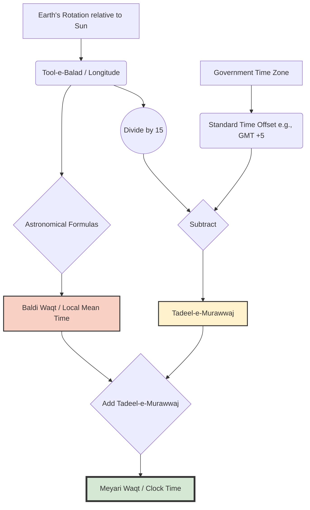
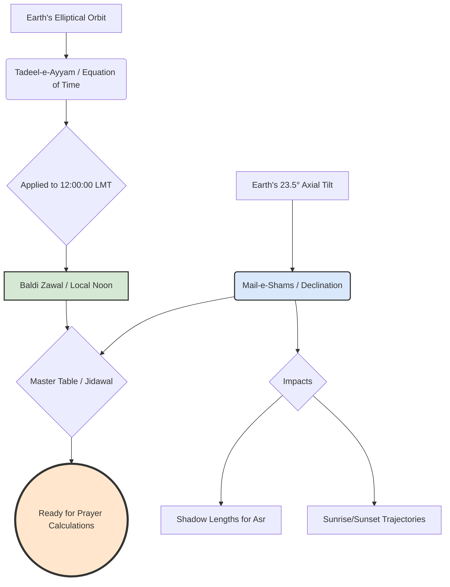
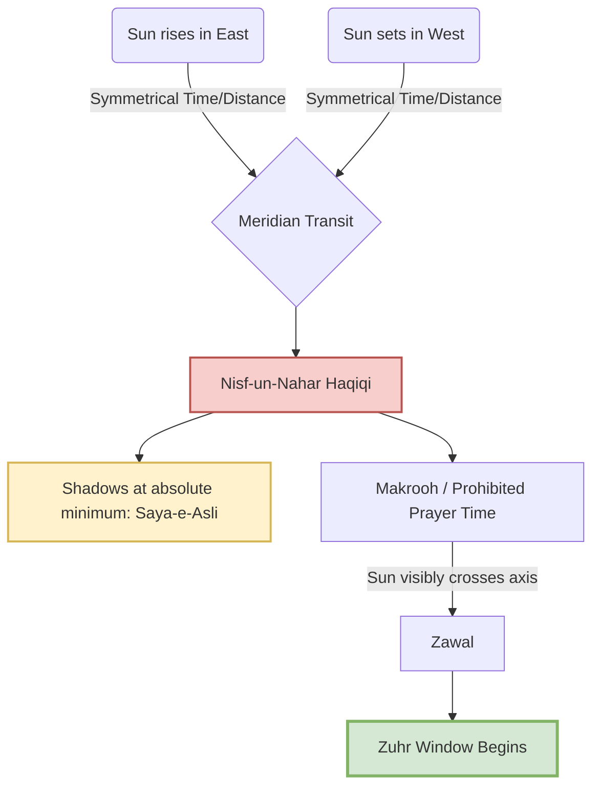
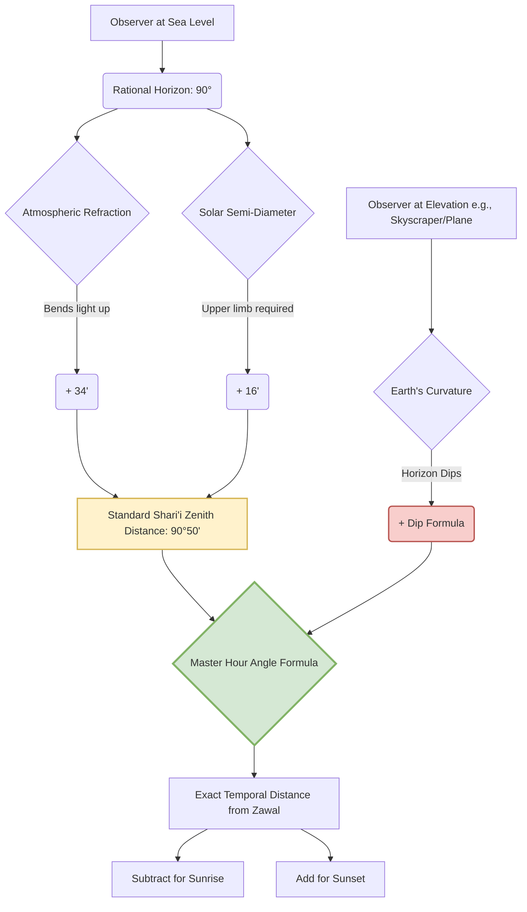
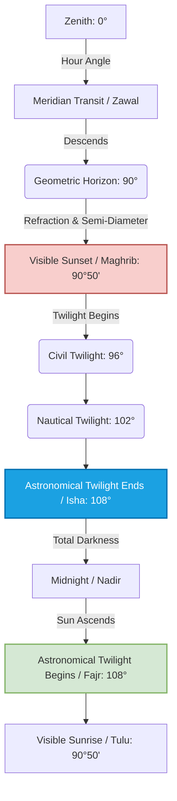
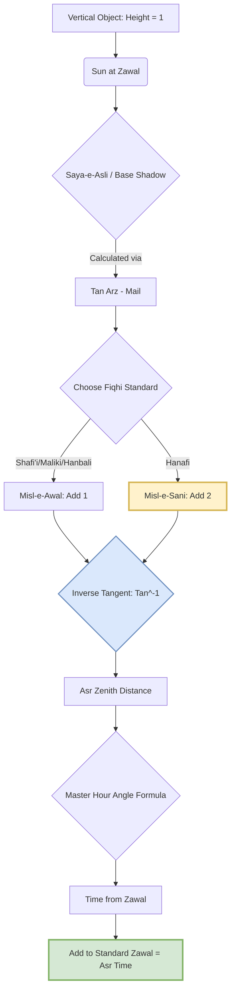
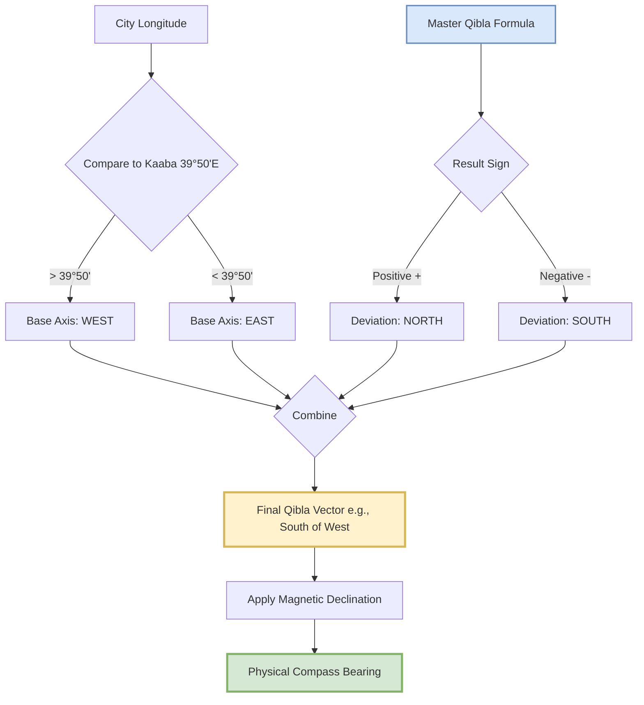

## Book Analysis 

Based on a meticulous and exhaustive analysis of the provided 269-page PDF, here is a detailed breakdown of the book. 

### **I. General Overview & Bibliographic Information**
*   **Title:** نصاب توقیت (حصہ اول) - *Nisab-e-Tauqeet (Part 1)* [Curriculum of Timekeeping].
*   **Subtitle:** "An easy, primary book comprising the terminology of the science of timekeeping, the extraction of prayer times, and the direction of the Qibla using modern mobile phones."
*   **Author:** Ustad-ul-Tauqeet Waseem Ahmad Attari.
*   **Publisher:** Maktaba-tul-Madinah, the publishing and research wing of Dawat-e-Islami (Al-Madina-tul-Ilmiyah / Islamic Research Center).
*   **Publication Dates:** First Edition: Ramadan 1443 AH / April 2022 (1,000 copies). Second Edition: Rajab 1444 AH / January 2023 (2,000 copies).
*   **Language:** Urdu (with English terminology for scientific/geographical terms and Arabic for Islamic texts).
*   **Core Subject:** **Ilm-e-Tauqeet (Islamic Astronomical Timekeeping).** The book bridges classical Islamic jurisprudence (Fiqh) regarding prayer times with modern spherical trigonometry, geography, and the use of scientific calculators.

---

### **II. Pedagogical Structure**
The book is designed as a formal textbook. Its teaching methodology is highly structured:
1.  **Theological Basis:** Begins with Quranic verses or Hadith establishing the religious requirement for a specific time or direction.
2.  **Scientific Definition:** Explains the astronomical phenomenon (e.g., what causes the sun to appear at a certain angle).
3.  **Visual Aid:** Uses high-quality, full-color 3D diagrams of the Earth, sun, and celestial spheres to illustrate the concept.
4.  **Mathematical Formula:** Provides the specific trigonometric formula required to calculate the time or angle.
5.  **Calculator Application:** Shows exact keystrokes for a Casio-style Scientific Calculator to solve the formula.
6.  **Practice Exercises (Mashq):** Provides tables of data for students to practice calculations, with an answer key at the back of the book.

---

### **III. Detailed Chapter-by-Chapter Breakdown**

#### **Front Matter (Pages 1-26)**
*   **Intentions:** Lists 19 spiritual intentions for reading the book, a standard practice in Dawat-e-Islami literature.
*   **Introduction:** Explains the critical importance of *Ilm-e-Tauqeet*. It notes that without this science, Muslims risk praying at forbidden times or facing the wrong direction. It pays homage to Imam Ahmed Raza Khan Barelvi, a master of this science, and explains that this book simplifies his complex manual methods using modern technology.

#### **Chapter 1: Terminology & Fundamentals (Pages 27-44)**
This chapter acts as a glossary of geographical and astronomical terms, providing both Urdu and English names alongside diagrams.
*   **Earth's Grid:** Equator (*Khat-e-Istawa*), Latitude (*Arz-e-Balad*), Longitude (*Tool-e-Balad*), Prime Meridian (Greenwich).
*   **Time Concepts:** AM/PM, International Date Line, Standard Time vs. Local Time, GMT, and Daylight Saving Time (DST).
*   **Angular Measurements:** Degrees, Minutes, Seconds.
*   **Celestial Sphere:** Zenith (*Samt-ur-Raas*), Nadir (*Samt-ul-Qadam*), Horizon (*Ufuq*).
*   **Solar Movements:** Altitude of Sun, Depression of Sun, Sun Declination (*Mail-e-Shams*), Equation of Time (*Tadeel-e-Ayyam*).
*   Includes beautifully rendered 3D globes showing the Tropic of Cancer/Capricorn and polar regions.

#### **Chapter 2: Nisf-un-Nahar (Midday / Zawal) (Pages 45-71)**
*   Defines the exact astronomical midday (when the sun reaches its highest peak) versus the Islamic timeframe.
*   Explains the concept of *Tadeel-e-Murawwaj* (the difference between Local Time and Standard Time based on longitude).
*   Provides the formula to calculate exact Zawal time using Sunrise and Sunset data.
*   Introduces the Degree/Minute/Second (DMS) button on scientific calculators for time arithmetic.

#### **Chapter 3: Sunrise & Sunset (Tulu o Ghuroob) (Pages 72-92)**
*   Differentiates between *Urfi* (astronomical center of the sun) and *Shari'i* (upper limb of the sun) sunrise/sunset.
*   Discusses **Refraction** (how the atmosphere bends light) and **Semi-Diameter** of the sun.
*   **Height Correction:** A crucial section explaining how being on a mountain, a tall building, or an airplane delays sunset and hastens sunrise. This has direct implications for breaking the fast (Iftar).
*   Formulas utilizing `Cos^-1` and `Sin` to calculate exact sunrise/sunset times based on latitude and solar declination.

#### **Chapter 4: Fajr and Isha (Subh o Isha) (Pages 93-115)**
*   Explains the difference between *Subh-e-Kazib* (False Dawn - Zodiacal light) and *Subh-e-Sadiq* (True Dawn - Astronomical Twilight).
*   Establishes the standard of **18 degrees** of solar depression for Fajr and Isha calculations.
*   Discusses high-latitude anomalies (like in Europe) where the sun does not set far enough below the horizon in summer for the twilight to disappear, meaning true Isha time does not technically occur.

#### **Chapter 5: Dahwa Kubra (Pages 116-122)**
*   Defines *Dahwa Kubra* (the exact midpoint between Subh-e-Sadiq and Sunset). This is the absolute deadline for making the intention (Niyyah) for a fast.
*   Outlines the *Makrooh* (forbidden) times for prayer (exactly at sunrise, absolute zenith/zawal, and exactly at sunset).

#### **Chapter 6: Asr Time (Pages 123-131)**
*   Explains shadow mechanics. 
*   Defines *Misl-e-Awal* (when an object's shadow equals its length plus the noon shadow) and *Misl-e-Sani* (when the shadow is twice its length plus the noon shadow).
*   Focuses heavily on the Hanafi school of thought, which generally dictates that Asr begins at *Misl-e-Sani*.
*   Provides complex `Tan^-1` formulas to calculate the exact time these shadow lengths are achieved.

#### **Chapter 7: Direction of Qibla (Simt-e-Qibla) (Pages 132-152)**
*   Provides the exact coordinates of the Kaaba in Makkah (21°25'N, 39°50'E).
*   Teaches how to calculate the precise angle of the Qibla from any city in the world using spherical trigonometry.
*   Explains how to use the sun to find the Qibla (calculating the exact time the sun aligns with the Qibla direction for a specific city).
*   Explains magnetic declination and how to correct compass readings.

#### **Chapter 8: Miscellaneous (Mutafarriqat) (Pages 153-179)**
*   Discusses recommended (*Mustahab*) times for various prayers across different seasons.
*   Explains the mechanics of Leap Years in both Gregorian and Hijri (Lunar) calendars.
*   **Modern Technology:** Guides the user on how to extract accurate coordinates and elevations using Google Earth, Google Maps, and smartphone GPS.
*   Includes a practical case study calculating the delayed sunset for the top of the **Bahria Icon Tower** in Karachi due to its extreme height.

#### **Chapter 9: Interesting Questions & Answers (Pages 180-187)**
*   Answers common geographical questions: Why do days and nights vary in length? Why do seasons change? 
*   Explains the phenomenon of 6-month days and 6-month nights at the North and South Poles.

#### **Chapter 10: Scientific Calculator Usage (Pages 188-193)**
*   A visual, step-by-step manual on how to input the complex trigonometric formulas (`Cos^-1`, `Sin`, `Tan`) into a standard Scientific Calculator to get accurate times and angles without manual mathematical errors.

---

### **IV. Back Matter & Appendices**

*   **Reference Tables (Jidawal) (Pages 194-205):** Contains data tables for the Sun's Declination (*Mail-e-Shams*) and the Equation of Time for every day of the year (using 2020 as a base year).
*   **Coordinates Directory (Pages 206-214):** A highly useful index providing the exact Latitude, Longitude, and GMT offset for dozens of major cities in Pakistan and prominent cities worldwide.
*   **Answer Key (Jawabat) (Pages 215-224):** Provides the correct numerical answers to all the practice exercises (Mashq 2.1 through 7.2) found throughout the chapters.
*   **Endorsements (Taqareez) (Pages 225-247):** Letters of validation from prominent scholars, Muftis, and professors of astronomy. They praise the author for taking an incredibly difficult, dying science and making it accessible to madrasa students using modern calculators rather than outdated astrolabes.
*   **Author's Note (Pages 248-266):** Ustad Waseem Ahmad Attari narrates his personal journey. He describes how difficult it was to learn this science in the 1990s, the lack of modern textbooks, and his subsequent effort to establish the "Prayer Timings Department" within Dawat-e-Islami, culminating in the creation of mobile apps and this specific textbook.

### **Conclusion of Analysis**
"Nisab-e-Tauqeet" is a highly specialized, practical, and mathematically rigorous textbook. It successfully translates medieval Islamic astronomical principles into modern mathematical formulas. By integrating the use of Scientific Calculators, Google Earth, and smartphone apps, the book ensures that the modern Islamic scholar or Imam can calculate prayer times, fasting deadlines, and Qibla directions with absolute pinpoint accuracy, regardless of their location on Earth or their altitude.

---
---
---

### **The Refined, Matured, & Updated Master Outline**

This updated architecture treats *Ilm-e-Tauqeet* as a sequential, algorithmic workflow. Every module builds strictly on the variables calculated in the previous one. 

#### **Prelude: The Epistemology of Timekeeping**
*   **The Synthesis:** How *Fiqh* (Jurisprudence) dictates the conditions, and *Hay'at* (Astronomy) provides the mechanics.
*   **Observation (*Mushahada*) vs. Calculation (*Hisab*):** The Fiqhi hierarchy. Why math serves observation, but does not override the naked eye in cases of doubt.
*   **The Modern Astrolabe:** Establishing the Scientific Calculator as the primary operational tool for this curriculum.

#### **Module 1: The Spatial & Temporal Canvas (Foundations)**
*Objective: Master the grid and the conversion of space into time.*
*   **1.1 The Terrestrial Grid:** Latitude (*Arz-e-Balad*), Longitude (*Tool-e-Balad*), and Equator (*Khat-e-Istawa*). *Includes sign conventions (+/-) critical for calculator syntax.*
*   **1.2 The Celestial Sphere:** Zenith (*Samt-ur-Raas*), Nadir (*Samt-ul-Qadam*), and the Apparent vs. True Horizon (*Ufuq*).
*   **1.3 The Mechanics of Time:** 
    *   Local Mean Time (*Baldi Waqt*) vs. Standard Time (*Meyari Waqt*).
    *   The 15° = 1 Hour conversion rule.
    *   **Core Calculation 1:** Finding *Tadeel-e-Murawwaj* (The longitudinal time offset).
    *   *Proposed Mermaid Diagram:* A flowchart showing the conversion from GMT to Standard Time to Local Time.

#### **Module 2: The Solar Engine (Dynamic Variables)**
*Objective: Understand the two variables that change every single day.*
*   **2.1 Solar Declination (*Mail-e-Shams*):** The sun's annual journey between the Tropics of Cancer and Capricorn.
*   **2.2 Equation of Time (*Tadeel-e-Ayyam*):** 
    *   *Unpacking the Black Box:* Why solar noon is rarely exactly 12:00 PM (briefly explaining orbital eccentricity).
*   **2.3 Data Extraction:** How to read and extract data from the *Jidawal* (Ephemeris tables) provided in the book.

#### **Module 3: The Meridian Axis (Zawal & Nisf-un-Nahar)**
*Objective: Calculate the anchor point of the Islamic day.*
*   **3.1 The Fiqh of the Meridian:** Defining *Zawal* (decline) vs. *Nisf-un-Nahar Haqiqi* (exact solar noon) and the prohibited times for Salah.
*   **3.2 Core Calculation 2:** The Master Zawal Formula.
    *   `Standard Noon = 12:00 ± Tadeel-e-Murawwaj ± Tadeel-e-Ayyam`
    *   *Calculator Scaffolding:* Mastering the Degree/Minute/Second `[° ' "]` key for time arithmetic.

#### **Module 4: The Horizon Mechanics (Sunrise, Sunset & Elevation)**
*Objective: Calculate Tulu (Sunrise) and Ghuroob (Sunset) with high precision.*
*   **4.1 The Physics of the Horizon:** 
    *   *Unpacking the Black Box:* Atmospheric Refraction (*Inkisarat*) and Solar Semi-Diameter (*Nisf Qutr*). Why the Fiqhi sunset (*Shari'i*) requires the sun to be 50' (0.833°) below the geometric horizon.
*   **4.2 Core Calculation 3:** The Hour Angle (*Zawia-e-Zamani*) Formula.
    *   Translating the `Cos^-1` spherical trigonometry formula into exact calculator keystrokes.
*   **4.3 The Elevation Factor (*Tafawut-e-Irtefa*):**
    *   The Fiqh of tall buildings and airplanes (e.g., delaying Iftar).
    *   **Core Calculation 4:** Adjusting the 50' depression angle based on height above sea level.
    *   *Proposed Mermaid Diagram:* Visualizing the line of sight over the curvature of the Earth from an elevated position.

#### **Module 5: The Twilights (Fajr, Isha & Dahwa Kubra)**
*Objective: Calculate the boundaries of the night and the fasting day.*
*   **5.1 The Fiqh of Twilights:** *Subh-e-Kazib* (False Dawn) vs. *Subh-e-Sadiq* (True Dawn); *Shafaq-e-Ahmar* (Red) vs. *Shafaq-e-Abyaz* (White).
*   **5.2 Core Calculation 5:** The 18° Depression Formula for Fajr and Isha.
*   **5.3 Fiqhi Addendum (Global Context):** 
    *   Briefly explaining alternative conventions (15°, 19°) for context.
    *   The "Abnormal Zones" (High Latitudes): What happens when the calculator returns a "Math Error" in summer? (Brief overview of *Aqrab al-Ayyam* / *Nisf al-Lail* solutions).
*   **5.4 Core Calculation 6: Dahwa Kubra:** 
    *   Calculating the exact midpoint between *Subh-e-Sadiq* and *Ghuroob* (The deadline for the fasting intention).

#### **Module 6: The Shadow Mechanics (Asr)**
*Objective: Calculate prayer times based on shadow lengths rather than horizon angles.*
*   **6.1 The Fiqh of Shadows:** *Misl-e-Awal* (1x shadow) vs. *Misl-e-Sani* (2x shadow - Hanafi standard).
*   **6.2 The Mathematics of Shadows:**
    *   Calculating the Base Noon Shadow (*Saya-e-Asli*).
    *   *Unpacking the Black Box:* Using Inverse Tangent (`Tan^-1`) to convert a shadow ratio back into a solar altitude angle.
*   **6.3 Core Calculation 7:** The Asr Formula.

#### **Module 7: The Sacred Vector (Simt-e-Qibla)**
*Objective: Calculate the exact direction of the Kaaba from any point on Earth.*
*   **7.1 Spherical Geometry of the Qibla:** 
    *   Using the Kaaba's coordinates.
    *   *Unpacking the Black Box:* The Great Circle route vs. flat map misconceptions (Rhumb lines).
*   **7.2 Core Calculation 8:** The Qibla Angle Formula.
*   **7.3 Operationalizing the Vector:**
    *   True North vs. Magnetic North (Magnetic Declination).
    *   **Core Calculation 9:** Finding the Qibla using the Sun (Calculating the exact clock time the sun aligns with the Qibla azimuth).
    *   *Proposed Mermaid Diagram:* A top-down compass rose showing True North, Magnetic North, and the Qibla vector.

#### **Module 8: Modern Epistemology & Verification (Conclusion)**
*   **8.1 Digital Verification:** How to use Google Earth and GPS coordinates to feed accurate data into your calculator.
*   **8.2 The Limits of Computation:** Reaffirming that algorithms are models of reality, and human observation remains the ultimate Fiqhi standard in anomalous conditions.
*   **8.3 Final Exam/Practical Project:** A consolidated worksheet requiring the student to calculate a full day's timetable (Fajr to Isha + Qibla) for a specific global city, mimicking the book's exercises.

---
---
---
***

# MASTER STUDY GUIDE: NISAB-E-TAUQEET
## The Science of Islamic Astronomical Timekeeping

---

### **PRELUDE: The Epistemology of Timekeeping**

Before executing a single calculation, the student must understand the philosophical and jurisprudential framework of *Ilm-e-Tauqeet* (The Science of Timekeeping). This is not merely an exercise in applied mathematics; it is the sacred mechanism by which the boundaries of worship (*Ibadah*) are established.

**1. The Synthesis of Two Sciences**
*Ilm-e-Tauqeet* sits at the precise intersection of *Fiqh* (Islamic Jurisprudence) and *Hay'at* (Astronomy/Spherical Geometry). 
*   **Fiqh dictates the condition:** It provides the qualitative parameter. (e.g., "Asr begins when the shadow of an object becomes twice its length, plus the shadow at noon").
*   **Hay'at provides the mechanics:** It provides the quantitative calculation. (e.g., "At what exact clock time does the solar altitude result in a shadow of that specific length at this specific latitude?").
Math does not dictate the law; math serves the law.

**2. Observation (*Mushahada*) vs. Calculation (*Hisab*)**
In Islamic epistemology, physical observation (*Mushahada*) of the cosmos is the ultimate arbiter of truth. Calculation (*Hisab*) is a predictive model of reality. While our algorithms are phenomenally accurate, they are models. If a Fiqhi parameter is physically observed to contradict a calculation (e.g., a mathematical model predicts sunset at 18:00, but atmospheric anomalies cause the sun to still be visibly above the horizon at 18:01), the **observation takes absolute precedence**. The fast cannot be broken. Calculation is a tool for certainty in the absence of visual confirmation, not a replacement for reality.

**3. The Modern Astrolabe**
Historically, Muslim astronomers utilized the *Usturlab* (Astrolabe) and the *Rub' al-Mujayyab* (Sine Quadrant) to solve complex spherical triangles. Today, the **Scientific Calculator** (specifically models featuring trigonometric functions and Degree/Minute/Second `[° ' "]` conversion) is our modern astrolabe. This curriculum relies heavily on the calculator not as a crutch, but as the standard operational instrument for modern *Ulema* and timekeepers. 

**4. The Anatomy of the Islamic Day**  
A critical paradigm shift is required when transitioning from secular timekeeping to Ilm-e-Tauqeet. In the secular, Gregorian model, a new day begins at midnight (00:00). In Islamic Fiqh, the 24-hour cycle begins exactly at **Ghuroob (Sunset)**. The night strictly precedes the daylight hours. Therefore, Thursday night actually occurs after Thursday's sunset (what secularly is called Wednesday evening). This is why Taraweeh prayers for Ramadan begin the night before the first fast.

---

### **MODULE 1: The Spatial & Temporal Canvas (Foundations)**

*Objective: To master the coordinate grid of the Earth and the celestial sphere, and to understand the mathematical conversion of spatial distance into clock time.*

#### **1.1 The Terrestrial Grid (Earth's Coordinates)**
To calculate the angle of the sun relative to an observer, we must first pinpoint the observer's exact location on the Earth's surface. 

*   **Khat-e-Istawa (The Equator):** The primary great circle of the Earth, resting at 0°. It divides the Earth into the Northern and Southern hemispheres.
*   **Arz-e-Balad (Latitude):** The angular distance of a location North or South of the Equator. 
    *   *Critical Syntax Rule:* In our mathematical formulas, Northern latitudes are entered as **Positive (+)** values, and Southern latitudes are entered as **Negative (-)** values.
*   **Tool-e-Balad (Longitude):** The angular distance of a location East or West of the Prime Meridian.
    *   *Critical Syntax Rule:* Eastern longitudes are entered as **Positive (+)** values, and Western longitudes are entered as **Negative (-)** values.
*   **Khat-e-Nisf-un-Nahar (Prime Meridian):** The 0° longitude line passing through Greenwich, London. It is the global baseline for both space and time.

#### **1.2 The Celestial Sphere (The Sky's Coordinates)**
When an observer looks up, they are standing at the center of an imagined dome called the Celestial Sphere.

*   **Samt-ur-Raas (Zenith):** The point in the sky directly, 90 degrees vertically above the observer's head.
*   **Samt-ul-Qadam (Nadir):** The point directly below the observer's feet, on the opposite side of the celestial sphere.
*   **Ufuq (The Horizon):** The line that separates the visible sky from the Earth. In *Ilm-e-Tauqeet*, we must rigorously distinguish between two types of horizons:
    1.  **Ufuq-e-Haqiqi (True/Rational Horizon):** A mathematically perfect plane passing through the center of the Earth, exactly 90° away from the Zenith. 
    2.  **Ufuq-e-Hissi (Apparent/Visible Horizon):** The actual line where the sky appears to meet the land or sea from the observer's specific vantage point. 
    *   *Note:* The higher an observer's elevation, the further the *Ufuq-e-Hissi* dips below the *Ufuq-e-Haqiqi*. This distinction is the bedrock of "Height Correction" (*Tafawut-e-Irtefa*) calculated in later modules.

  
**1.3 The Mechanics of Time (Space-to-Time Conversion)**  
Time, astronomically speaking, is a measurement of the Earth's rotation relative to the Sun. Because the Earth is a 360° sphere and rotates once every 24 hours, space and time are directly proportional:

- **360° = 24 Hours**
- **15° = 1 Hour**
- **1° = 4 Minutes**

To calculate accurate prayer times, we must navigate three distinct layers of time:

**A. Apparent Solar Time (Sundial Time)**  
This is the raw, observable time. Exactly 12:00:00 PM occurs the very second the sun physically crosses your local meridian (Zawal). However, because Earth's orbit is elliptical, the sun's apparent speed changes throughout the year, making sundial days slightly longer or shorter than 24 hours.

**B. Baldi Waqt (Local Mean Time - LMT)**  
Because mechanical clocks cannot speed up or slow down to match the sun, astronomers created "Mean Time"—an artificial average of the sun's movement. Baldi Waqt is the clock time for your exact longitude.

**C. Meyari Waqt (Standard Time)**  
A political and administrative construct. To prevent neighboring towns from having clocks that are 3 minutes apart, governments group vast longitudinal regions into a single time zone, anchored to a specific reference longitude (e.g., GMT +5, GMT -4).

**1.4 CORE CALCULATION 1: Tadeel-e-Murawwaj (The Standard Time Modifier)**  
Our trigonometric formulas will yield results in Baldi Waqt (Local Mean Time). We must mathematically convert those results into Meyari Waqt (Standard Time) so they match the clocks on our walls and smartphones.

The difference between Standard Time and Local Mean Time is called **Tadeel-e-Murawwaj**.

STEM Optimization Note: Traditional texts often provide complex, multi-step logical rules to determine whether to add or subtract this value based on your location relative to the time zone meridian. We bypass this entirely by using a unified algebraic formula. As long as you strictly adhere to the sign conventions (+ for East, - for West), this single formula will automatically output the correct positive or negative modifier.

> **The Master Formula:**  
> Tadeel-e-Murawwaj = Standard Time Offset - (Tool-e-Balad ÷ 15)

- **Standard Time Offset:** Your time zone relative to Greenwich (e.g., Pakistan is +5, New York is -5).
- **Tool-e-Balad:** Your exact longitude. (East is positive +, West is negative -).

**Calculator Syntax Protocol:**  
You must use the **Degree/Minute/Second [° ' "]** button on your scientific calculator. This allows the processor to handle base-60 (sexagesimal) mathematics seamlessly.

**Example 1: Eastern Hemisphere (Karachi, Pakistan)**

- Longitude (Tool-e-Balad): 67° 04' E (+67°04')
- Standard Time Offset: +5
- Formula: 5 - (67°04' ÷ 15)
- Calculator Keystrokes: 5 - ( 67 [° ' "] 4 [° ' "] ÷ 15 ) =
- **Result:** 0° 31' 44" (Which translates to **+0 Hours, 31 Minutes, 44 Seconds**).
- Application: Whatever local time our formulas output for Karachi, we will **add** 31m 44s to it to get Pakistan Standard Time.

**Example 2: Western Hemisphere (Washington D.C., USA)**

- Longitude (Tool-e-Balad): 77° 02' W (-77°02')
- Standard Time Offset: -5
- Formula: -5 - (-77°02' ÷ 15)
- Calculator Keystrokes: -5 - ( -77 [° ' "] 2 [° ' "] ÷ 15 ) =
- **Result:** 0° 8' 8" (Which translates to **+0 Hours, 8 Minutes, 8 Seconds**).

**Example 3: Negative Modifier (Jakarta, Indonesia)**

- Longitude (Tool-e-Balad): 106° 49' E (+106°49')
- Standard Time Offset: +7
- Formula: 7 - (106°49' ÷ 15)
- Calculator Keystrokes: 7 - ( 106 [° ' "] 49 [° ' "] ÷ 15 ) =
- **Result:** -0° 7' 16" (Which translates to **-0 Hours, 7 Minutes, 16 Seconds**).
- Application: Whatever local time our formulas output for Jakarta, we will **subtract** 7m 16s from it to get Indonesia Standard Time.

#### ~~**1.3 The Mechanics of Time (Space-to-Time Conversion)**~~
~~Time, astronomically speaking, is simply a measurement of the Earth's rotation relative to the Sun. Because the Earth is a 360° sphere and rotates once every 24 hours, space and time are directly proportional:~~
*   ~~**360° = 24 Hours**~~
*   ~~**15° = 1 Hour**~~
*   ~~**1° = 4 Minutes**~~

~~This relationship forces us to navigate two distinct time systems:~~

~~**A. Baldi Waqt (Local Mean Time - LMT)**~~
~~This is the true astronomical time of your specific *Tool-e-Balad* (Longitude). If you walk 15 miles East, your *Baldi Waqt* changes. In this system, 12:00 PM occurs exactly when the sun crosses your specific meridian.~~

~~**B. Meyari Waqt (Standard Time)**~~
~~A political and administrative construct. To prevent every town from having a different clock, governments group vast longitudinal regions into a single time zone, anchored to a specific reference longitude (e.g., GMT +5, GMT -4).~~ 

#### ~~**1.4 CORE CALCULATION 1: Tadeel-e-Murawwaj (The Standard Time Modifier)**~~
~~Because our astronomical formulas will yield results in *Baldi Waqt* (Local Time), we must mathematically convert those results into *Meyari Waqt* (Standard Time) so they match the clocks on our walls.~~ 

~~The difference between Standard Time and Local Time is called **Tadeel-e-Murawwaj**.~~ 

> ~~**The Master Formula:**~~
> ~~`Tadeel-e-Murawwaj = Standard Time Offset - (Tool-e-Balad ÷ 15)`~~

*   ~~**Standard Time Offset:** Your time zone relative to Greenwich (e.g., Pakistan is `5`, New York is `-5`).~~
*   ~~**Tool-e-Balad:** Your exact longitude. (Remember the syntax: East is positive, West is negative).~~

~~**Calculator Syntax Protocol:**~~
~~To execute this, you must use the **Degree/Minute/Second `[° ' "]`** button on your scientific calculator. This button allows the calculator to process base-60 mathematics (sexagesimal), which is required for both angular degrees and time (hours/minutes/seconds).~~

~~**Example 1: Eastern Hemisphere (Karachi, Pakistan)**~~
*   ~~Longitude (*Tool-e-Balad*): 67° 04' E (Positive)~~
*   ~~Standard Time Offset: +5~~
*   ~~Formula: `5 - (67°04' ÷ 15)`~~
*   ~~Calculator Keystrokes: `5` `-` `(` `67` `[° ' "]` `4` `[° ' "]` `÷` `15` `)` `=`~~
*   ~~**Result:** `0° 31' 44"` (Which translates to +0 Hours, 31 Minutes, 44 Seconds).~~
*   ~~*Meaning:* Karachi's standard clock is artificially set 31 minutes and 44 seconds *ahead* of its true astronomical local time.~~

~~**Example 2: Western Hemisphere (Washington D.C., USA)**~~
*   ~~Longitude (*Tool-e-Balad*): 77° 02' W (Negative)~~
*   ~~Standard Time Offset: -5~~
*   ~~Formula: `-5 - (-77°02' ÷ 15)`~~
*   ~~Calculator Keystrokes: `-5` `-` `(` `-77` `[° ' "]` `2` `[° ' "]` `÷` `15` `)` `=`~~
*   ~~**Result:** `0° 8' 8"` (Which translates to +0 Hours, 8 Minutes, 8 Seconds).~~

***

#### **System Architecture: The Time Conversion Flow**

*Summary of Module 1: You now possess the mathematical key (`Tadeel-e-Murawwaj`) to translate any localized celestial event into standard clock time. In Module 2, we will introduce the dynamic solar variables that change every single day of the year.*

---
---
***

### **MODULE 2: The Solar Engine (Dynamic Variables)**

*Objective: To master the two daily solar variables—Solar Declination and the Equation of Time—and understand how to extract them from astronomical ephemeris tables (Jidawal).*

To calculate prayer times for any specific day, we must account for the ~~Earth's orbit around the sun~~. Because the Earth is tilted on its axis and ~~its orbit~~ is elliptical, the sun's apparent position and speed in our sky change daily. This creates two dynamic variables that are the "engine" of all *Ilm-e-Tauqeet* calculations.

#### **2.1 Mail-e-Shams (Solar Declination)**
**Definition:** *Mail-e-Shams* is the angular distance of the sun directly North or South of the Celestial Equator (*Khat-e-Istawa*). 

**The Physics & Geography:**
Because the Earth's axis is tilted at approximately 23.5 degrees, the sun appears to migrate North and South throughout the year. 
*   **Northern Maximum (+23° 26'):** Around June 21, the sun reaches its highest northern declination, sitting directly over the **Tropic of Cancer (*Khat-e-Sartan*)**. 
*   **Equinoxes (0° 00'):** Around March 21 and September 23, the sun is exactly over the Equator (*Khat-e-Istawa*).
*   **Southern Maximum (-23° 26'):** Around December 21, the sun reaches its lowest southern declination, sitting directly over the **Tropic of Capricorn (*Khat-e-Jady*)**.

**Why it matters for Fiqh:** 
*Mail-e-Shams* dictates the altitude of the sun at noon, which in turn dictates the length of shadows. In the winter (when *Mail-e-Shams* is negative for the Northern Hemisphere), the sun is low, and noon shadows are long. This directly impacts the calculation of *Asr* (which is based on shadow length). It also dictates the exact trajectory of sunrise and sunset.

*Critical Syntax Rule:* When extracting *Mail-e-Shams* for calculations, Northern declination is always entered as **Positive (+)** and Southern declination is always entered as **Negative (-)**.

**2.2 Tadeel-e-Ayyam (Equation of Time) & Baldi Zawal**  
**Definition:** Tadeel-e-Ayyam is the difference between Apparent Solar Time (the true sun in the sky) and Mean Solar Time (the artificial 24-hour clock).

**Unpacking the Black Box (The Astrophysics):**  
Why isn't the sun exactly at its highest point (Zenith/Meridian) at exactly 12:00:00 PM Local Time every day? Two reasons:

1. **Kepler's Second Law:** Earth's orbit is an ellipse, not a perfect circle. Earth moves faster when it is closest to the sun (Perihelion in January) and slower when it is farthest away (Aphelion in July).
2. **Obliquity of the Ecliptic:** The Earth's 23.5° tilt means the sun's apparent daily motion along the equator varies.

These two factors combine to create the **Equation of Time (EoT)**. The true sun can be up to ~16 minutes "fast" (crossing the meridian before 12:00 PM) or ~14 minutes "slow" (crossing after 12:00 PM).

**The Textbook's Mathematical Shortcut (Baldi Zawal):**  
In standard astronomy, to find the exact Local Mean Time (LMT) of solar noon, you would use the formula: 12:00:00 ± Equation of Time.

To minimize calculation errors, Nisab-e-Tauqeet pre-calculates this. In the tables (Jidawal) at the back of the book (Pages 194-205), the author provides a column titled **Baldi Zawal**.

- The Greenwich Baseline: As noted on page 193 of the text, these tables are calculated for the Prime Meridian (Greenwich, London). Because the Equation of Time shifts by mere fractions of a second over a 24-hour period, timekeepers universally use this Greenwich Baldi Zawal as the baseline Local Mean Time (LMT) for any longitude on Earth for that specific date.
- Example: On January 1st, the table provides a Baldi Zawal of 12:11:09. This means the sun crosses the meridian 11 minutes and 9 seconds after 12:00 PM Local Mean Time, regardless of whether you are in New York, London, or Tokyo.

**2.3 Data Extraction: Using the Jidawal (Ephemeris Tables)**  
Before executing any formula in the upcoming modules, you must extract the two daily variables for your target date from the tables.

**Example Data Extraction (From Page 194 of the text):**  
Let's extract the variables for **January 1st**.
1. Go to the January Table.
2. Find Row 1.
3. **Mail-e-Shams (Declination):** -19° 57' (The sun is in the Southern Hemisphere, hence the negative sign).
    - Why it matters: This variable will be plugged into our formulas to find Sunrise, Sunset, Asr shadow lengths, and the exact direction of the Qibla.
4. **Baldi Zawal (Local Noon):** 12:11:09 (The sun crosses the meridian at 12:11:09 PM Local Time).

**Fiqhi Note on Leap Years (Kasrat):**  
The tables provided in the book are anchored to the year 2020 (a leap year). Because the true solar year is 365.24 days, Mail-e-Shams and Baldi Zawal shift slightly every year in a 4-year cycle.
- Is this a problem? For daily Fiqhi applications (prayers and fasting), the variation across the 4-year cycle is measured in mere seconds and does not invalidate the Fiqhi timings.
- The Modern Solution: While traditional scholars manually interpolated these fractions (as discussed on pages 159-161 of the text), modern professionals requiring absolute sub-second precision can extract live daily data from digital Ephemeris tools (like NOAA or the Google Earth Engine). However, for standardized calculations and mastering the science, the 2020 tables are highly sufficient and structurally sound.

#### ~~**2.2 Tadeel-e-Ayyam (Equation of Time) & Baldi Zawal**~~
~~**Definition:** *Tadeel-e-Ayyam* is the difference between Apparent Solar Time (the true sun in the sky) and Mean Solar Time (the artificial 24-hour clock).~~

~~**Unpacking the Black Box (The Astrophysics):**~~
~~Why isn't the sun exactly at its highest point (Zenith/Meridian) at exactly 12:00:00 PM Local Time every day? Two reasons:~~
1.  ~~**Kepler's Second Law:** Earth's orbit is an ellipse, not a perfect circle. Earth moves faster when it is closer to the sun (Perihelion in January) and slower when it is farther away (Aphelion in July).~~
2.  ~~**Obliquity of the Ecliptic:** The Earth's 23.5° tilt means the sun's apparent daily motion along the equator varies.~~

~~These two factors combine to create the **Equation of Time (EoT)**. The true sun can be up to ~16 minutes "fast" (crossing the meridian before 12:00 PM) or ~14 minutes "slow" (crossing after 12:00 PM).~~

~~**The Textbook's Optimization (Baldi Zawal):**~~
~~In standard astronomy, to find the exact Local Mean Time (LMT) of solar noon, you would use the formula: `12:00:00 - Equation of Time`.~~ 

~~However, to minimize calculation errors for students, *Nisab-e-Tauqeet* pre-calculates this. In the tables (*Jidawal*) at the back of the book (Pages 194-205), the author does not provide the raw *Tadeel-e-Ayyam*. Instead, he provides a column titled **Baldi Zawal** (Local Noon).~~ 
*   ~~*Baldi Zawal* is simply 12:00:00 adjusted for the Equation of Time for that specific day.~~ 
*   ~~*Example:* On January 1st, the true sun is "slow." The table provides a *Baldi Zawal* of `12:11:09`. This means the sun crosses the meridian 11 minutes and 9 seconds *after* 12:00 PM Local Mean Time.~~

#### ~~**2.3 Data Extraction: Using the Jidawal (Ephemeris Tables)**~~
~~Before executing any formula in the upcoming modules, you must look up the two daily variables for your target date.~~

~~**Example Data Extraction (From Page 194 of the text):**~~
~~Let's extract the variables for **January 1st**.~~
1.  ~~Go to the January Table.~~
2.  ~~Find Row 1.~~
3.  ~~**Mail-e-Shams (Declination):** `-23° 01'` (The sun is deep in the Southern Hemisphere, hence the negative sign).~~
4.  ~~**Baldi Zawal (Local Noon):** `12:03:19` (The sun crosses the meridian at 12:03 PM Local Time).~~

~~*Note on Leap Years (Kasrat):* The tables provided in the book are anchored to a specific year (e.g., 2020, a leap year). Because the true solar year is 365.24 days, *Mail-e-Shams* and *Baldi Zawal* shift slightly every year in a 4-year cycle. For extreme precision (to the exact second), modern timekeepers use algorithms or live data (like NOAA or Google Earth engines, as mentioned on page 76). However, for standardized Fiqhi calculations and examinations, the provided tables are highly sufficient.~~

***

#### **System Architecture: The Solar Mechanics**

*Summary of Module 2: You now understand the two dynamic variables that drive the celestial engine. You know how to extract the Sun's Declination (*Mail-e-Shams*) and the Local Noon (*Baldi Zawal*) for any day of the year. We are now fully equipped to calculate the first and most central prayer boundary of the day: Zawal.*

***
***

### **MODULE 3: The Meridian Axis (Zawal & Nisf-un-Nahar)**

*Objective: To calculate the exact clock time of astronomical noon, understand its jurisprudential (Fiqhi) implications, and establish the baseline shadow length used for later prayers.*

The meridian is the invisible line of longitude that runs directly over your head from the North Pole to the South Pole. The moment the sun crosses this line is the absolute anchor point of the Islamic day. Everything is symmetrical around this axis.

**3.1 The Fiqh & Physics of the Meridian**  
To a STEM-educated mind, precision in terminology is non-negotiable. In classical Fiqh, there is a profound distinction between the sun reaching its peak and the sun beginning its descent, though laymen often conflate the two.

- **Nisf-un-Nahar Haqiqi (True Astronomical Noon):** The exact microsecond the sun's center crosses your local meridian. At this moment, the sun's **Hour Angle (Zawia-e-Zamani) is exactly 0°**, its altitude is at its daily maximum, and shadows are at their absolute shortest.
    - Fiqhi Implication: This is a **Makrooh (Prohibited)** time for any Salah (prayer) or Sajdah (prostration). Because the sun's physical disc takes a few minutes to fully cross the meridian, and to prevent any margin of error, scholars mandate a practical safety buffer (typically 5 minutes before and after this calculated exact time) during which prayer is paused.
- **Zawal (The Decline):** Linguistically, Zawal means "to decline" or "to slip." Astronomically and jurisprudentially, Zawal occurs the moment the sun's trailing edge clears the meridian and visibly begins its descent toward the West.
    - Fiqhi Implication: The moment of Zawal marks the end of the prohibited buffer and the immediate beginning of the **Zuhr** prayer window.
- **Saya-e-Asli (The Base Shadow):** The length of an object's shadow at the exact moment of Nisf-un-Nahar Haqiqi. Because the Earth's axis is tilted, the sun is rarely perfectly 90° overhead. Therefore, a small shadow almost always remains at noon. This Saya-e-Asli is the mathematical baseline required later in Module 6 to calculate Asr.

#### ~~**3.1 The Fiqh & Physics of the Meridian**~~
~~To a STEM-educated mind, precision in terminology is non-negotiable. In classical Fiqh, there is a profound distinction between the sun reaching its peak and the sun beginning its descent, though laymen often conflate the two.~~

*   ~~**Nisf-un-Nahar Haqiqi (True Astronomical Noon):** The exact, micro-second the sun's center crosses your local meridian. At this moment, the sun is at its highest daily altitude, and shadows are at their absolute shortest.~~ 
    *   ~~*Fiqhi Implication:* This is a **Makrooh (Prohibited)** time for any Salah (prayer) or Sajdah (prostration).~~ 
*   ~~**Zawal (The Decline):** Linguistically, *Zawal* means "to decline" or "to slip." Astronomically and jurisprudentially, Zawal occurs the moment the sun crosses the meridian and visibly begins its descent toward the West.~~ 
    *   ~~*Fiqhi Implication:* The exact moment of *Zawal* marks the end of the prohibited time and the immediate beginning of the **Zuhr** prayer window.~~
*   ~~**Saya-e-Asli (The Base Shadow):** The length of an object's shadow at the exact moment of *Nisf-un-Nahar Haqiqi*. Because the Earth is tilted (except exactly on the equator during an equinox), the sun is rarely perfectly 90° overhead. Therefore, a small shadow almost always remains at noon. This *Saya-e-Asli* is the mathematical baseline required later in Module 6 to calculate Asr.~~

#### **3.2 CORE CALCULATION 2: The Master Zawal Formula**
To find the exact clock time of *Nisf-un-Nahar Haqiqi* (which we will refer to as Standard Zawal Time), we simply take the Local Noon (*Baldi Zawal*) from the Ephemeris tables and apply our Standard Time Modifier (*Tadeel-e-Murawwaj*).

> **The Master Formula:**
> `Standard Zawal Time = Baldi Zawal + Tadeel-e-Murawwaj`

*   **Baldi Zawal:** Extracted from the *Jidawal* (Module 2).
*   **Tadeel-e-Murawwaj:** Calculated via `Standard Time Offset - (Longitude ÷ 15)` (Module 1).

**Calculator Syntax Protocol:**
We will continue using the **Degree/Minute/Second `[° ' "]`** button to add these time values together effortlessly.

**Example 1: Karachi, Pakistan on January 1st**
1.  *Baldi Zawal* (From Jan 1 Table): `12° 11' 09"`
2.  *Tadeel-e-Murawwaj* (Calculated in Mod 1): `+0° 31' 44"`
3.  Formula: `12°11'09" + 0°31'44"`
4.  Calculator Keystrokes: `12` `[° ' "]` `11` `[° ' "]` `9` `[° ' "]` `+` `0` `[° ' "]` `31` `[° ' "]` `44` `[° ' "]` `=`
5.  **Result:** `12° 42' 53"`
*   *Conclusion:* On January 1st in Karachi, True Astronomical Noon occurs exactly at **12:42:53 PM Pakistan Standard Time**. The prohibited time for prayer is centered on this moment. Zuhr begins immediately after.

**Example 2: Washington D.C., USA on January 1st**
1.  *Baldi Zawal* (From Jan 1 Table): `12° 11' 09"`
2.  *Tadeel-e-Murawwaj* (Calculated in Mod 1): `+0° 08' 08"`
3.  Formula: `12°11'09" + 0°08'08"`
4.  Calculator Keystrokes: `12` `[° ' "]` `11` `[° ' "]` `9` `[° ' "]` `+` `0` `[° ' "]` `8` `[° ' "]` `8` `[° ' "]` `=`
5.  **Result:** `12° 19' 17"`
*   *Conclusion:* On January 1st in Washington D.C., True Astronomical Noon occurs at **12:19:17 PM Eastern Standard Time**.

**3.3 The Symmetry of the Cosmos (The Alternative Method)**  
For the mathematically inclined, Nisab-e-Tauqeet (Page 50) offers a beautiful proof of the Earth's rotational symmetry. Because the Earth rotates at a constant speed, the time from Sunrise to Zawal is exactly equal to the time from Zawal to Sunset (excluding minor atmospheric variances).

Therefore, if you already know the exact times of Sunrise (Tulu) and Sunset (Ghuroob), you do not need the Baldi Zawal or Tadeel-e-Murawwaj to find noon. You simply find the mathematical average of the two times.

> **The Symmetry Formula:**  
> Standard Zawal = (Sunrise + Sunset) ÷ 2

Critical Syntax Warning: You **must** use the 24-hour clock format for Sunset. If you input a 12-hour PM time (e.g., 5:50 instead of 17:50), the mathematical average will collapse and yield a completely incorrect morning time.

- *Example*: If Sunrise is at 06:20:00 and Sunset is at 17:50:00 (5:50 PM).
- Calculator Keystrokes: ( 6 [° ' "] 20 [° ' "] 0 [° ' "] + 17 [° ' "] 50 [° ' "] 0 [° ' "] ) ÷ 2 =
- **Result:** 12° 05' 00" (12:05:00 PM).

*STEM Optimization Note*: This alternative method is an excellent "checksum" algorithm. When programming a prayer time spreadsheet or Python script, you can use this formula to verify that your complex trigonometric calculations for Sunrise and Sunset are perfectly balanced around your calculated Zawal time. If they do not average out to Zawal, there is a syntax or logic error in your code.

#### ~~**3.3 The Symmetry of the Cosmos (The Alternative Method)**~~
~~For the mathematically inclined, *Nisab-e-Tauqeet* (Page 50) offers a beautiful proof of the Earth's rotational symmetry. Because the Earth rotates at a constant speed, the time from Sunrise to Zawal is exactly equal to the time from Zawal to Sunset (excluding minor atmospheric variances).~~

~~Therefore, if you already know the exact times of Sunrise (*Tulu*) and Sunset (*Ghuroob*), you do not need the *Baldi Zawal* or *Tadeel-e-Murawwaj* to find noon. You simply find the mathematical average of the two times.~~

> ~~**The Symmetry Formula (Using 24-Hour Time):**~~
> ~~`Standard Zawal = (Sunrise + Sunset) ÷ 2`~~

*   ~~*Example:* If Sunrise is at `06:20:00` and Sunset is at `17:50:00` (5:50 PM).~~
*   ~~Calculator Keystrokes: `(` `6` `[° ' "]` `20` `[° ' "]` `0` `[° ' "]` `+` `17` `[° ' "]` `50` `[° ' "]` `0` `[° ' "]` `)` `÷` `2` `=`~~
*   ~~**Result:** `12° 05' 00"` (12:05:00 PM).~~

~~*STEM Optimization Note:* This alternative method is an excellent "checksum" algorithm. When programming a prayer time spreadsheet or Python script, you can use this formula to verify that your complex trigonometric calculations for Sunrise and Sunset are perfectly balanced around your calculated Zawal time. If they do not average out to Zawal, there is a syntax error in your code.~~

***

#### **System Architecture: The Meridian Transit**

*Summary of Module 3: You have successfully calculated the absolute center of the Islamic day. You now understand the critical Fiqhi distinction between the prohibited peak (Nisf-un-Nahar Haqiqi) and the decline (Zawal) that initiates Zuhr. Furthermore, you have established the baseline shadow (Saya-e-Asli) which will be required later.*

***
---
---
***

### **MODULE 4: The Horizon Mechanics (Sunrise, Sunset & Elevation)**

*Objective: To calculate exact Tulu (Sunrise) and Ghuroob (Sunset) times by mastering the Hour Angle formula, atmospheric refraction, and the Fiqhi implications of height correction.*

#### **4.1 The Physics of the Horizon (Unpacking the Black Box)**
If the Earth had no atmosphere and the sun was a tiny laser pointer, calculating sunrise would be simple: the moment the sun hits exactly 90° from your Zenith (the *Ufuq-e-Haqiqi* or Rational Horizon). 

However, Fiqh and astrophysics require us to account for two physical realities that alter the visible horizon (*Ufuq-e-Hissi*):

1.  **Atmospheric Refraction (*Inkisarat*):** The Earth's atmosphere acts as a giant lens. As the sun approaches the horizon, the atmosphere bends its light upwards. Astronomically, when you see the sun "touch" the horizon, it is actually already physically below it. This optical illusion lifts the sun by approximately **34 arcminutes (34')**.
2.  **Solar Semi-Diameter (*Nisf Qutr*):** The sun is not a single point; it is a massive disc with an angular width of about 32 arcminutes. Fiqh strictly dictates that the day begins when the *upper limb* (the very top edge) of the sun appears, and ends when the *upper limb* completely disappears. We do not use the center of the sun (*Urfi*). Therefore, we must account for half the sun's width: **16 arcminutes (16')**.

**The Shari'i Standard:** 
To calculate a valid Islamic Sunrise (*Tulu*) or Sunset (*Ghuroob*), we must combine these two values (34' + 16' = 50'). 
*   The sun is not considered "set" until its geometric center is **50 arcminutes (0°50')** below the Rational Horizon.
*   **Zenith Distance (*Boad-e-Samti*):** Because our formulas measure from the Zenith (directly overhead) down to the sun, the baseline angle for Sunrise and Sunset is not 90°, but rather **90° 50'**.

#### **4.2 CORE CALCULATION 3: The Hour Angle (*Zawia-e-Zamani*)**
In Module 3, we established that at exact Zawal, the sun's Hour Angle is 0°. To find Sunrise or Sunset, we must calculate the exact angular distance the sun travels from the meridian to reach that 90°50' Zenith Distance. 

This requires the **Spherical Law of Cosines**, which the textbook has optimized into the following Master Formula:

> **The Hour Angle Formula:**
> `Hour Angle = Cos^-1 ( (Cos 90°50' - Sin Arz * Sin Mail) ÷ (Cos Arz * Cos Mail) )`

*   **90°50':** The Shari'i Zenith Distance (*Boad-e-Samti*).
*   **Arz:** Your Latitude (*Arz-e-Balad*).
*   **Mail:** The Sun's Declination for that day (*Mail-e-Shams*).

*STEM Optimization Note:* The result of this formula will be an angular degree (e.g., 94.5°). Because the Earth rotates 15° every hour, we must **divide the entire result by 15** to convert this spatial angle into a temporal duration (Hours/Minutes/Seconds).

**4.3 Executing Tulu and Ghuroob**  
Once you have calculated the Hour Angle (converted into time), you apply it to your Standard Zawal Time (calculated in Module 3) using the symmetry of the cosmos:

- **Tulu (Sunrise) =** Standard Zawal - Hour Angle Time
- **Ghuroob (Sunset) =** Standard Zawal + Hour Angle Time

**Calculator Syntax Protocol (Example: Karachi on April 1st):**

- Latitude (Arz): 24° 54' N (Positive)
- Declination (Mail): 4° 50' N (Positive, extracted from April table)
- Standard Zawal: 12:35:29 (Calculated previously)

**Step 1: Calculate the Hour Angle Time**

- Formula: [ Cos^-1 ((Cos 90°50' - Sin 24°54' * Sin 4°50') ÷ (Cos 24°54' * Cos 4°50')) ] ÷ 15
- Keystrokes: Shift Cos ( ( Cos 90 [° ' "] 50 [° ' "] - Sin 24 [° ' "] 54 [° ' "] × Sin 4 [° ' "] 50 [° ' "] ) ÷ ( Cos 24 [° ' "] 54 [° ' "] × Cos 4 [° ' "] 50 [° ' "] ) ) ÷ 15 = **[° ' "]** (Crucial: Press this final time to convert the decimal to HH:MM:SS)
- **Result:** 6° 13' 18" (This means the sun takes 6 hours, 13 minutes, and 18 seconds to travel from Zawal to the horizon).

**Step 2: Apply to Zawal (The Raw Astronomical Time)**

- **Sunrise:** 12:35:29 - 6:13:18 = 06:22:11 AM
- **Sunset:** 12:35:29 + 6:13:18 = 18:48:47 (6:48 PM)

**Step 3: The Fiqhi Buffer (Tamkeen / Ehtiyat)**  
The times calculated above are mathematically absolute for a perfectly flat horizon. However, to account for local topographical variations, minor atmospheric pressure changes, and the absolute sanctity of worship and fasting, Islamic scholars universally apply a safety buffer (Tamkeen).

- **For Sunrise (End of Fajr):** Subtract 1 to 2 minutes from the raw time to ensure prayers are finished well before the sun breaches the horizon.
- **For Sunset (Maghrib/Iftar):** Add 2 to 3 minutes to the raw time to ensure the sun has absolutely set before breaking the fast. (This explains why your calculated raw time may be 18:48, but your local mosque timetable says 18:51).

**4.4 The Elevation Factor (Tafawut-e-Irtefa)**  
A critical intersection of physics and Fiqh occurs when an observer is elevated above sea level.

If you are standing on the ground, your line of sight to the horizon is flat. If you are on the 50th floor of a building, or flying in an airplane, you are looking down at the horizon. Because of the Earth's curvature, the horizon "dips" away from you.

- Fiqhi Implication: An elevated observer will see the sun rise earlier and set later than someone on the ground. A person on the ground floor of a skyscraper may break their fast (Iftar), while a person in the penthouse must wait several minutes until the sun actually sets for their specific line of sight.

**CORE CALCULATION 4: The Dip Formula**  
To adjust our master formula for height, we must calculate the "Dip of the Horizon" and add it to our baseline Zenith Distance of 90°50'.

> **The Dip Formula:**  
> Dip = 0° 0' 58.2" × √Height (in feet)  
> (STEM Note: The constant 58.2" is strictly calibrated for Imperial feet. If your building's height is in meters, you must convert it to feet first [Meters × 3.28084] before applying this formula).

Example: The Bahria Icon Tower, Karachi (Height: 900 ft)

1. Calculate Dip: 0° 0' 58.2" × √900 = 0° 29' 06"
2. New Zenith Distance: 90° 50' 00" + 0° 29' 06" = 91° 19' 06"
3. Application: You would replace 90°50' in the Master Hour Angle formula with 91°19'06". This will output a larger Hour Angle, mathematically proving that sunset occurs later at this altitude.

#### ~~**4.3 Executing Tulu and Ghuroob**~~
~~Once you have calculated the Hour Angle (converted into time), you simply apply it to your Standard Zawal Time (calculated in Module 3) using the symmetry of the cosmos:~~

*   ~~**Tulu (Sunrise) =** `Standard Zawal - Hour Angle Time`~~
*   ~~**Ghuroob (Sunset) =** `Standard Zawal + Hour Angle Time`~~

~~**Calculator Syntax Protocol (Example: Karachi on April 1st):**~~
*   ~~Latitude (*Arz*): `24° 54' N` (Positive)~~
*   ~~Declination (*Mail*): `4° 50' N` (Positive, extracted from April table)~~
*   ~~Standard Zawal: `12:35:29` (Calculated previously)~~

~~**Step 1: Calculate the Hour Angle Time**~~
*   ~~Formula: `[ Cos^-1 ((Cos 90°50' - Sin 24°54' * Sin 4°50') ÷ (Cos 24°54' * Cos 4°50')) ] ÷ 15`~~
*   ~~Keystrokes: `Shift` `Cos` `(` `(` `Cos` `90` `[° ' "]` `50` `[° ' "]` `-` `Sin` `24` `[° ' "]` `54` `[° ' "]` `×` `Sin` `4` `[° ' "]` `50` `[° ' "]` `)` `÷` `(` `Cos` `24` `[° ' "]` `54` `[° ' "]` `×` `Cos` `4` `[° ' "]` `50` `[° ' "]` `)` `)` `÷` `15` `=`~~
*   ~~**Result:** `6° 13' 18"` (This means the sun takes 6 hours, 13 minutes, and 18 seconds to travel from Zawal to the horizon).~~

~~**Step 2: Apply to Zawal**~~
*   ~~**Sunrise:** `12:35:29 - 6:13:18 = 06:22:11 AM`~~
*   ~~**Sunset:** `12:35:29 + 6:13:18 = 18:48:47 (6:48 PM)`~~

#### ~~**4.4 The Elevation Factor (*Tafawut-e-Irtefa*)**~~
~~A critical intersection of physics and Fiqh occurs when an observer is elevated above sea level.~~ 

~~If you are standing on the ground, your line of sight to the horizon is flat. If you are on the 50th floor of a building, or flying in an airplane, you are looking *down* at the horizon. Because of the Earth's curvature, the horizon "dips" away from you.~~ 
*   ~~*Fiqhi Implication:* An elevated observer will see the sun rise *earlier* and set *later* than someone on the ground. A person on the ground floor of a skyscraper may break their fast (Iftar), while a person in the penthouse must wait several minutes until the sun actually sets for their specific line of sight.~~

~~**CORE CALCULATION 4: The Dip Formula**~~
~~To adjust our master formula for height, we must calculate the "Dip of the Horizon" and add it to our baseline Zenith Distance of 90°50'.~~

> ~~**The Dip Formula:**~~
> ~~`Dip = 0° 0' 58.2" × √Height (in feet)`~~

~~*Example: The Bahria Icon Tower, Karachi (Height: 900 ft)*~~
1.  ~~Calculate Dip: `0° 0' 58.2" × √900` = `0° 29' 06"`~~
2.  ~~New Zenith Distance: `90° 50' 00" + 0° 29' 06" = 91° 19' 06"`~~
3.  ~~*Application:* You would replace `90°50'` in the Master Hour Angle formula with `91°19'06"`. This will output a larger Hour Angle, mathematically proving that sunset occurs later at this altitude.~~

***

#### **System Architecture: The Physics of the Horizon**

*Summary of Module 4: You have now mastered the most critical trigonometric equation in Ilm-e-Tauqeet. You understand why Fiqh mandates a 90°50' Zenith Distance, and you possess the analytical tools to adjust fasting times based on vertical elevation. In Module 5, we will push the sun even further below the horizon to calculate the Twilights (Fajr and Isha).*

***
---
---
***

### **MODULE 5: The Twilights (Fajr, Isha & Dahwa Kubra)**

*Objective: To calculate the times for Subh-e-Sadiq (Fajr) and Isha using the 18° solar depression standard, understand the "Math Error" anomaly in high latitudes, and calculate Dahwa Kubra (the deadline for fasting intention).*

**5.1 The Physics & Fiqh of Twilights**  
After the sun sets below the horizon, the sky does not instantly turn pitch black. The Earth's atmosphere scatters the sun's residual light. The same phenomenon occurs in reverse before sunrise. Fiqh categorizes these twilight phases with profound precision:

**The Morning Twilights:**

1. **Subh-e-Kazib (False Dawn):** A faint, vertical column of light (known in astrophysics as Zodiacal Light) that appears and then fades. Fiqhi Implication: No legal rulings are attached to this. Night continues.
2. **Subh-e-Sadiq (True Dawn):** A horizontal spread of white light across the eastern horizon (Astronomical Twilight). Fiqhi Implication: This marks the absolute end of night, the beginning of the Fajr prayer window, and the commencement of the fast (Sawm).

**The Evening Twilights & The Degree Debate:**

1. **Shafaq-e-Ahmar (Red Twilight):** The reddish glow remaining after sunset. Astronomically, this disappears when the sun is roughly **15 degrees** below the horizon. (This is the basis for the ISNA calculation method used in parts of North America, and aligns with the Shafi'i, Maliki, and Hanbali schools, as well as the Sahibayn in the Hanafi school).
2. **Shafaq-e-Abyaz (White Twilight):** The white glow that persists after the redness fades, before total darkness sets in. Astronomically, this disappears when the sun is exactly **18 degrees** below the horizon.
    - Fiqhi Implication: The primary, fatwa-acted-upon position of the Hanafi school (and the standard of the Muslim World League) dictates that **Isha** does not begin until this white twilight completely disappears.

Conclusion: Therefore, in Nisab-e-Tauqeet, our baseline parameter for both Fajr and Isha is the 18-degree depression. Since our formulas measure from the Zenith (90° overhead) down to the sun, the baseline angle for Fajr and Isha is 90° + 18° = 108°.

#### ~~**5.1 The Physics & Fiqh of Twilights**~~
~~After the sun sets below the horizon, the sky does not instantly turn pitch black. The Earth's atmosphere scatters the sun's residual light. The same phenomenon occurs in reverse before sunrise. Fiqh categorizes these twilight phases with profound precision:~~

~~**The Morning Twilights:**~~
1.  ~~**Subh-e-Kazib (False Dawn):** A faint, vertical column of light (known in astrophysics as Zodiacal Light) that appears and then fades. *Fiqhi Implication:* No legal rulings are attached to this. Night continues.~~
2.  ~~**Subh-e-Sadiq (True Dawn):** A horizontal spread of white light across the eastern horizon (Astronomical Twilight). *Fiqhi Implication:* This marks the absolute end of night, the beginning of the Fajr prayer window, and the commencement of the fast (*Sawm*).~~

~~**The Evening Twilights:**~~
1.  ~~**Shafaq-e-Ahmar (Red Twilight):** The reddish glow remaining after sunset.~~ 
2.  ~~**Shafaq-e-Abyaz (White Twilight):** The white glow that persists after the redness fades, before total darkness sets in. *Fiqhi Implication:* In the primary Hanafi position, **Isha** begins when this white twilight completely disappears.~~ 

~~**The 18-Degree Standard:**~~
~~Extensive historical observation by Muslim astronomers (from Al-Biruni to modern observatories) confirms that *Subh-e-Sadiq* begins, and *Shafaq-e-Abyaz* ends, when the center of the sun is exactly **18 degrees** below the rational horizon.~~ 
*   ~~**Zenith Distance (*Boad-e-Samti*):** Since our formulas measure from the Zenith (90° overhead) down to the sun, the baseline angle for Fajr and Isha is `90° + 18° = 108°`.~~

#### **5.2 CORE CALCULATION 5: The 18° Depression Formula**
The mathematical architecture is identical to the Sunrise/Sunset formula from Module 4. We simply replace the horizon parameter (90°50') with the twilight parameter (**108°**).

> **The Twilight Hour Angle Formula:**
> `Hour Angle = Cos^-1 ( (Cos 108° - Sin Arz * Sin Mail) ÷ (Cos Arz * Cos Mail) )`

*   **Fajr (Subh-e-Sadiq) =** `Standard Zawal - Twilight Hour Angle`
*   **Isha =** `Standard Zawal + Twilight Hour Angle`

**Calculator Syntax Protocol (Example: Karachi on April 1st):**
*   Latitude (*Arz*): `24° 54' N` 
*   Declination (*Mail*): `4° 50' N` 
*   Standard Zawal: `12:35:29` 

**Step 1: Calculate the Twilight Hour Angle**
*   Keystrokes: `Shift` `Cos` `(` `(` `Cos` `108` `[° ' "]` `-` `Sin` `24` `[° ' "]` `54` `[° ' "]` `×` `Sin` `4` `[° ' "]` `50` `[° ' "]` `)` `÷` `(` `Cos` `24` `[° ' "]` `54` `[° ' "]` `×` `Cos` `4` `[° ' "]` `50` `[° ' "]` `)` `)` `÷` `15` `=` **`[° ' "]`**
*   **Result:** `7° 29' 37"` (The sun takes 7 hours, 29 minutes, and 37 seconds to travel between the meridian and the 18° depression mark).

**Step 2: Apply to Zawal**
*   **Fajr:** `12:35:29 - 7:29:37 = 05:05:52 AM`
*   **Isha:** `12:35:29 + 7:29:37 = 20:05:06 (8:05 PM)`

*(Fiqhi Note: As always, apply the 2-3 minute safety buffer [Tamkeen] to these raw times for practical mosque timetables).*

#### **5.3 The High-Latitude Crisis (The "Math Error" Anomaly)**
If a student attempts to calculate Fajr for London, UK (Latitude 51°30'N) in the middle of June, the scientific calculator will output a **`Math Error`**. 

**Unpacking the Black Box:** 
Why does the math break? The domain of the `Cos^-1` (ArcCosine) function is strictly between `-1` and `1`. In the summer at high latitudes, the Earth's axial tilt keeps the northern hemisphere bathed in sunlight. The sun *never* physically dips 18° below the horizon; it dips to perhaps 14° or 15° and then begins rising again. Because the sun never reaches 108° from the Zenith, the ratio inside the formula exceeds `-1`, breaking the trigonometric function.
*   *Astronomical Reality:* True night never occurs. Astronomical twilight lasts all night.
*   *Fiqhi Solution:* Fiqh dictates that worship must continue. Scholars utilize alternative estimation models for these "Abnormal Zones," such as *Aqrab al-Ayyam* (using the times of the last "normal" day before the anomaly began), or *Nisf al-Lail* (splitting the night in half). 

**5.4 CORE CALCULATION 6: Dahwa Kubra**  
**Definition:** Dahwa Kubra is the exact midpoint of the Islamic fasting day.

- The Fiqhi Imperative: For obligatory fasts (like Ramadan), the intention (Niyyah) must be made before this exact moment. If Dahwa Kubra passes and a person has not made the intention, a fast cannot be initiated for that day.

**The Conceptual Trap:**  
A common layman error is assuming the day is the midpoint between Sunrise and Sunset. In Islamic Fiqh, the fasting day (Shar'i Day) begins at **Subh-e-Sadiq (Fajr)**, not Sunrise.

> **The Dahwa Kubra Formula:**  
> Dahwa Kubra = (Fajr Time + Sunset Time) ÷ 2

Critical Fiqhi/Math Rule: You **must** use the raw, unadjusted astronomical times for this calculation. Do not use the Tamkeen-adjusted times from a mosque timetable (which artificially pad Fajr and Maghrib for safety), as this will skew the exact midpoint.

**Calculator Syntax Protocol (Using our raw Karachi April 1st data):**

- Raw Fajr Time: 05:05:52
- Raw Sunset Time: 18:48:47 (Must use 24-hour clock!)
- Keystrokes: ( 5 [° ' "] 5 [° ' "] 52 [° ' "] + 18 [° ' "] 48 [° ' "] 47 [° ' "] ) ÷ 2 =
- **Result:** 11° 57' 19"
- Conclusion: The absolute deadline to make the intention to fast on this day is **11:57:19 AM**.

#### ~~**5.4 CORE CALCULATION 6: Dahwa Kubra**~~
~~**Definition:** *Dahwa Kubra* is the exact midpoint of the Islamic fasting day.~~ 
*   ~~*The Fiqhi Imperative:* For obligatory fasts (like Ramadan), the intention (*Niyyah*) must be made before this exact moment. If *Dahwa Kubra* passes and a person has not made the intention, a fast cannot be initiated for that day.~~

~~**The Conceptual Trap:**~~ 
~~A common layman error is assuming the day is the midpoint between Sunrise and Sunset. In Islamic Fiqh, the fasting day (*Shar'i* Day) begins at **Subh-e-Sadiq (Fajr)**, not Sunrise.~~ 

> ~~**The Dahwa Kubra Formula:**~~
> ~~`Dahwa Kubra = (Fajr Time + Sunset Time) ÷ 2`~~

~~**Calculator Syntax Protocol (Using our Karachi April 1st data):**~~
*   ~~Fajr Time: `05:05:52`~~
*   ~~Sunset Time: `18:48:47` *(Must use 24-hour clock!)*~~
*   ~~Keystrokes: `(` `5` `[° ' "]` `5` `[° ' "]` `52` `[° ' "]` `+` `18` `[° ' "]` `48` `[° ' "]` `47` `[° ' "]` `)` `÷` `2` `=`~~
*   ~~**Result:** `11° 57' 19"`~~
*   ~~*Conclusion:* The absolute deadline to make the intention to fast on this day is **11:57:19 AM**.~~

***

#### **System Architecture: The Solar Depression Zones**

*Summary of Module 5: You have now mapped the deep boundaries of the night. You understand the 18° standard, the Fiqh of Dahwa Kubra, and the mathematical limits of our formulas in high latitudes. We have calculated every time parameter based on the sun's angle relative to the horizon.*

***
---
---
***

### **MODULE 6: The Shadow Mechanics (Asr)**

*Objective: To calculate the exact time of Asr by converting Fiqhi shadow ratios (Misl-e-Awal and Misl-e-Sani) into Zenith Distances using Inverse Tangent, and feeding them into the Master Hour Angle formula.*

#### **6.1 The Fiqh of Shadows**
To determine the start of Asr, Fiqh requires us to observe the shadow of a vertical object (a gnomon or *Miqyas*). 

As established in Module 3, the sun is rarely perfectly overhead at noon, meaning a small shadow almost always exists at *Zawal*. This is the **Saya-e-Asli** (Base Noon Shadow). The time of Asr is calculated by adding the height of the object to this base shadow. 

There are two distinct jurisprudential standards for this:
1.  **Misl-e-Awal (First Shadow):** Asr begins when the shadow reaches **1x** the height of the object + *Saya-e-Asli*. 
    *   *Context:* This is the standard of the Shafi'i, Maliki, and Hanbali schools, as well as the two primary students of Imam Abu Hanifa (Imam Muhammad and Imam Abu Yusuf). It is widely used in the Arab world and Western mosques following these Fiqhs.
2.  **Misl-e-Sani (Second Shadow):** Asr begins when the shadow reaches **2x** the height of the object + *Saya-e-Asli*.
    *   *Context:* This is the primary, fatwa-acted-upon position of Imam Abu Hanifa, and the absolute standard for the Hanafi school (predominant in South Asia, Turkey, and Hanafi mosques globally). *Nisab-e-Tauqeet* primarily utilizes this standard.

#### **6.2 Unpacking the Black Box (The Trigonometry of Shadows)**  
How do we turn a shadow on the ground into a time on a clock? We use basic Right-Angle Trigonometry: Tangent = Opposite / Adjacent.

1. Imagine a vertical stick of height 1 (The Opposite).
2. The shadow on the ground is its length (The Adjacent).
3. The angle of the sun from the Zenith (Boad-e-Samti) relates directly to the shadow length via the Tangent function.
    - Shadow Length = Tan(Zenith Distance)
    - Therefore, to find the angle from the shadow, we reverse it: Zenith Distance = Tan^-1(Shadow Length).

**Step A: Finding the Noon Shadow (Saya-e-Asli)**  
At exact noon, the sun's distance from the Zenith is the difference between your Latitude (Arz) and the Sun's Declination (Mail).

- The Rule of Signs: If your Latitude and the Sun's Declination are in opposite hemispheres (one North, one South), you **add** them. If they are in the same hemisphere, you **subtract** them.
- The Zenith Crossing Anomaly: If you live between the Tropics (e.g., Makkah at 21°N), there are days in the summer when the sun's declination (e.g., 23°N) is further North than your city. The sun crosses your Zenith, and your noon shadow flips from pointing North to pointing South.
- The Algebraic Solution: Because Asr Fiqh is concerned with the length of the shadow, not its direction, we use the **Absolute Value** | | to strip away any negative signs if the subtraction yields a negative number.
- Therefore, Saya-e-Asli = Tan(|Arz - Mail|)

**Step B: Finding the Asr Zenith Distance**  
To find the sun's angle at Asr, we add 1 (for Misl-e-Awal) or 2 (for Misl-e-Sani) to the Saya-e-Asli, and use Inverse Tangent (Tan^-1 or arctan) to convert that total shadow length back into an angle.

> **The Asr Zenith Distance Formula:**  
> Asr Zenith Distance = Tan^-1 ( Tan(|Arz - Mail|) + M )  
> (Where M = 1 for Misl-e-Awal, and M = 2 for Misl-e-Sani)

#### **6.3 CORE CALCULATION 7: The Asr Formula**  
Once we have the Asr Zenith Distance, the hard work is done. We simply plug this new angle into the **Master Hour Angle Formula** we learned in Module 4, replacing the 90°50' horizon parameter.

> **The Master Asr Formula:**  
> Hour Angle = Cos^-1 ( (Cos(Asr Zenith Distance) - Sin Arz * Sin Mail) ÷ (Cos Arz * Cos Mail) )  
> Asr Time = Standard Zawal + Hour Angle Time

**Calculator Syntax Protocol (Example: Karachi on April 1st - Hanafi Misl-e-Sani):**

- Latitude (Arz): 24° 54' N
- Declination (Mail): 4° 50' N
- Standard Zawal: 12:35:29

**Phase 1: Calculate Asr Zenith Distance (Misl-e-Sani)**

- Math: Both are North, so we subtract: 24°54' - 4°50' = 20°04'. (Because 24 is greater than 4, the result is positive. No absolute value correction is needed).
- Keystrokes: Shift Tan ( Tan 20 [° ' "] 4 [° ' "] ) + 2 ) = **[° ' "]**  
    (STEM Syntax Note: Notice the closed parenthesis ) after the angle. This prevents the calculator from accidentally calculating Tan(20°04' + 2)).
- **Result:** 67° 04' 56" (This is the target angle the sun must reach for Asr to begin).

**Phase 2: Calculate the Hour Angle**

- Keystrokes: Shift Cos ( ( Cos 67 [° ' "] 4 [° ' "] 56 [° ' "] - Sin 24 [° ' "] 54 [° ' "] × Sin 4 [° ' "] 50 [° ' "] ) ÷ ( Cos 24 [° ' "] 54 [° ' "] × Cos 4 [° ' "] 50 [° ' "] ) ) ÷ 15 = **[° ' "]**
- **Result:** 4° 27' 47" (The sun takes 4 hours, 27 minutes, and 47 seconds to drop from Zawal to the Asr angle).

**Phase 3: Apply to Zawal**

- **Asr Time:** 12:35:29 + 4:27:47 = 17:03:16 (5:03 PM)

(Fiqhi Note: No Tamkeen/safety buffer is traditionally added to the start of Asr, as the shadow lengthening is a continuous, observable process rather than a sudden disappearance of light).

#### ~~**6.2 Unpacking the Black Box (The Trigonometry of Shadows)**~~
~~How do we turn a shadow on the ground into a time on a clock? We use basic Right-Angle Trigonometry: `Tangent = Opposite / Adjacent`.~~

1.  ~~Imagine a vertical stick of height `1` (The Opposite).~~
2.  ~~The shadow on the ground is the length (The Adjacent).~~
3.  ~~The angle of the sun from the Zenith (*Boad-e-Samti*) relates directly to the shadow length via the Tangent function.~~ 
    *   ~~`Shadow Length = Tan(Zenith Distance)`~~
    *   ~~Therefore, to find the angle from the shadow, we reverse it: `Zenith Distance = Tan^-1(Shadow Length)`.~~

~~**Step A: Finding the Noon Shadow (*Saya-e-Asli*)**~~
~~At exact noon, the sun's distance from the Zenith is simply the difference between your Latitude (*Arz*) and the Sun's Declination (*Mail*).~~
*   ~~*Rule of Signs:* If your Latitude and the Sun's Declination are in the same hemisphere (both North or both South), you **subtract** them. If they are in opposite hemispheres, you **add** them. We express this algebraically as the absolute difference: `|Arz - Mail|`.~~
*   ~~Therefore, `Saya-e-Asli = Tan(|Arz - Mail|)`~~

~~**Step B: Finding the Asr Zenith Distance**~~
~~To find the sun's angle at Asr, we add `1` (for Misl-e-Awal) or `2` (for Misl-e-Sani) to the *Saya-e-Asli*, and use Inverse Tangent (`Tan^-1` or `arctan`) to convert that total shadow length back into an angle.~~

> ~~**The Asr Zenith Distance Formula:**~~
> ~~`Asr Zenith Distance = Tan^-1 ( Tan(|Arz - Mail|) + M )`~~
> ~~*(Where M = 1 for Misl-e-Awal, and M = 2 for Misl-e-Sani)*~~

#### ~~**6.3 CORE CALCULATION 7: The Asr Formula**~~
~~Once we have the Asr Zenith Distance, the hard work is done. We simply plug this new angle into the **Master Hour Angle Formula** we learned in Module 4, replacing the `90°50'` horizon parameter.~~

> ~~**The Master Asr Formula:**~~
> ~~`Hour Angle = Cos^-1 ( (Cos(Asr Zenith Distance) - Sin Arz * Sin Mail) ÷ (Cos Arz * Cos Mail) )`~~
> ~~`Asr Time = Standard Zawal + Hour Angle Time`~~

~~**Calculator Syntax Protocol (Example: Karachi on April 1st - Hanafi Misl-e-Sani):**~~
*   ~~Latitude (*Arz*): `24° 54' N`~~ 
*   ~~Declination (*Mail*): `4° 50' N`~~ 
*   ~~Standard Zawal: `12:35:29`~~ 

~~**Phase 1: Calculate Asr Zenith Distance (Misl-e-Sani)**~~
*   ~~*Math:* Both are North, so we subtract: `24°54' - 4°50' = 20°04'`.~~
*   ~~Keystrokes: `Shift` `Tan` `(` `Tan` `20` `[° ' "]` `4` `[° ' "]` `+` `2` `)` `=` **`[° ' "]`**~~
*   ~~**Result:** `67° 04' 56"` (This is the target angle the sun must reach for Asr to begin).~~

~~**Phase 2: Calculate the Hour Angle**~~
*   ~~Keystrokes: `Shift` `Cos` `(` `(` `Cos` `67` `[° ' "]` `4` `[° ' "]` `56` `[° ' "]` `-` `Sin` `24` `[° ' "]` `54` `[° ' "]` `×` `Sin` `4` `[° ' "]` `50` `[° ' "]` `)` `÷` `(` `Cos` `24` `[° ' "]` `54` `[° ' "]` `×` `Cos` `4` `[° ' "]` `50` `[° ' "]` `)` `)` `÷` `15` `=` **`[° ' "]`**~~
*   ~~**Result:** `4° 27' 47"` (The sun takes 4 hours, 27 minutes, and 47 seconds to drop from Zawal to the Asr angle).~~

~~**Phase 3: Apply to Zawal**~~
*   ~~**Asr Time:** `12:35:29 + 4:27:47 = 17:03:16 (5:03 PM)`~~

~~*(Fiqhi Note: No Tamkeen/safety buffer is traditionally added to the start of Asr, as the shadow lengthening is a continuous, observable process rather than a sudden disappearance of light).*~~

***

#### **System Architecture: The Trigonometry of Asr**

*Summary of Module 6: You have successfully bridged the gap between physical objects on the ground and the celestial mechanics of the sun. By utilizing Inverse Tangent, you can calculate the exact start of Asr for any Fiqhi school of thought. In Module 7, we will apply spherical geometry to the Earth's surface to calculate the ultimate vector: The Qibla.*

***
---
---
***

### **MODULE 7: The Sacred Vector (Simt-e-Qibla)**

*Objective: To calculate the exact Great Circle direction of the Qibla using the textbook's specific Deviation Formula, and to understand how to translate this true mathematical vector into a physical compass bearing.*

#### **7.1 The Fiqh & Physics of the Sacred Vector**
Islamic Jurisprudence (*Fiqh*) mandates *Istiqbal-e-Qibla* (facing the Kaaba) as an absolute prerequisite for the validity of Salah. 
*   **Ayn vs. Jiha:** If you can see the Kaaba, you must face its exact physical structure (*Ayn*). If you are far away, you face its general direction (*Jiha*). However, for scholars and architects establishing a new mosque, calculating the exact mathematical vector is a communal obligation (*Fard Kifayah*).

**Unpacking the Black Box (The Flat Earth / Mercator Fallacy):**
A common trap for laymen is looking at a standard flat map (the Mercator projection) and drawing a straight line from their city to Makkah. For example, on a flat map, North America is "West and slightly North" of Makkah, leading some to mistakenly pray South-East. 

This is astronomically false. The Earth is a sphere. The shortest distance between two points on a sphere is not a straight line on a flat map (a Rhumb line), but a **Great Circle** route. Because of the Earth's curvature, the Great Circle route from North America to Makkah actually arcs North-East over the Atlantic and Europe. *Ilm-e-Tauqeet* relies strictly on Great Circle spherical trigonometry.

**7.2 The Qibla Deviation Formula & Edge Cases**  
To calculate the Qibla, we need the exact coordinates of the Kaaba:

- **Arz-e-Kaaba (Latitude):** 21° 25' N
- **Tool-e-Kaaba (Longitude):** 39° 50' E

Instead of calculating a standard 360° azimuth from North, Nisab-e-Tauqeet uses a highly optimized formula that calculates the **Inhiraf** (Deviation) from the East-West axis.

**The Algorithmic Logic:**

1. **Calculate Fasl_Tool (Longitude Difference):** |Your Longitude - 39°50'|.
2. **Find the Base Axis:**
    - If your city is East of Makkah, your Base Axis is **West**.
    - If your city is West of Makkah, your Base Axis is **East**.
    - STEM Edge Case (The Pacific Crossover): If Fasl_Tool is greater than 180°, the shortest Great Circle path wraps around the other side of the Earth. You must flip your Base Axis (East becomes West, West becomes East), and your new Fasl_Tool becomes 360° - Fasl_Tool.
3. **Calculate the Deviation (Inhiraf):** The formula will output an angle.
    - If the result is **Positive (+)**, you deviate towards the **North**.
    - If the result is **Negative (-)**, you deviate towards the **South**.

> **The Master Qibla Formula:**  
> Deviation Angle = Tan^-1 ( [ (Cos Arz × Tan Arz_Kaaba) - (Sin Arz × Cos Fasl_Tool) ] ÷ Sin Fasl_Tool )

STEM Edge Case (Division by Zero): If your city shares the exact longitude of the Kaaba (39°50'E), Fasl_Tool is 0. Sin(0) is 0. The formula will crash. In this rare case, bypass the formula entirely: If you are North of Makkah, your Qibla is exactly Due South (180°). If South, exactly Due North (0°).

#### **7.3 CORE CALCULATION 8: Executing the Qibla Vector**

**Calculator Syntax Protocol (Example: Karachi, Pakistan):**

- Karachi Latitude (Arz): 24° 54' N
- Karachi Longitude (Tool): 67° 04' E

**Step 1: Determine Base Axis & Fasl_Tool**

- Karachi (67°E) is East of Makkah (39°E).
- **Base Axis = West.**
- Fasl_Tool = 67°04' - 39°50' = 27°14' (Since this is < 180°, no Pacific crossover adjustment is needed).

**Step 2: Calculate Deviation (Inhiraf)**

- Formula: Tan^-1 ( [ (Cos 24°54' × Tan 21°25') - (Sin 24°54' × Cos 27°14') ] ÷ Sin 27°14' )
- Keystrokes: Shift Tan ( ( Cos 24 [° ' "] 54 [° ' "] × Tan 21 [° ' "] 25 [° ' "] ) - ( Sin 24 [° ' "] 54 [° ' "] × Cos 27 [° ' "] 14 [° ' "] ) ) ÷ Sin 27 [° ' "] 14 [° ' "] ) = **[° ' "]**
- **Result:** -2° 19' 36"

**Step 3: The Final Vector & 360° Azimuth Mapping**

- Because the result is **Negative**, the deviation is towards the **South**.
- Combined with our Base Axis (West), the Qibla for Karachi is exactly **2° 19' 36" South of West**.

STEM Optimization (Automating the 360° Compass Azimuth):  
To translate the text-based "South of West" into a digital 0-360° Azimuth (where North=0°, East=90°, South=180°, West=270°), use the following logic in your spreadsheets/code:

- If Base is **East** & Deviation is **North (+)**: Azimuth = 90° - Deviation
- If Base is **East** & Deviation is **South (-)**: Azimuth = 90° + |Deviation|
- If Base is **West** & Deviation is **North (+)**: Azimuth = 270° + Deviation
- If Base is **West** & Deviation is **South (-)**: Azimuth = 270° - |Deviation|

For Karachi: Base is West (270°), Deviation is South (-2.32°).  
270° - 2°19'36" = 267° 40' 24". This is the exact compass bearing on a digital map.

#### ~~**7.2 The Qibla Deviation Formula**~~
~~To calculate the Qibla, we need the exact coordinates of the Kaaba:~~
*   ~~**Arz-e-Kaaba (Latitude):** `21° 25' N`~~
*   ~~**Tool-e-Kaaba (Longitude):** `39° 50' E`~~

~~Instead of calculating a standard 360° azimuth from North, *Nisab-e-Tauqeet* uses a highly optimized formula that calculates the **Inhiraf** (Deviation) from the East-West axis.~~ 

~~**The Two-Step Logic:**~~
1.  ~~**Find the Base Axis:** Is your city East or West of the Kaaba?~~
    *   ~~If your Longitude is *greater* than 39°50'E, you are East of Makkah. You must face **West**.~~
    *   ~~If your Longitude is *less* than 39°50'E, you are West of Makkah. You must face **East**.~~
2.  ~~**Calculate the Deviation (*Inhiraf*):** The formula will output an angle.~~ 
    *   ~~If the result is **Positive (+)**, you deviate towards the **North**.~~
    *   ~~If the result is **Negative (-)**, you deviate towards the **South**.~~

> ~~**The Master Qibla Formula:**~~
> ~~`Deviation Angle = Tan^-1 ( [ (Cos Arz × Tan Arz_Kaaba) - (Sin Arz × Cos Fasl_Tool) ] ÷ Sin Fasl_Tool )`~~

*   ~~**Arz:** Your City's Latitude.~~
*   ~~**Arz_Kaaba:** `21° 25'`~~
*   ~~**Fasl_Tool (Longitude Difference):** The absolute difference between your city's longitude and the Kaaba's longitude `|Tool - 39°50'|`.~~

#### ~~**7.3 CORE CALCULATION 8: Executing the Qibla Vector**~~

~~**Calculator Syntax Protocol (Example: Karachi, Pakistan):**~~
*   ~~Karachi Latitude (*Arz*): `24° 54' N`~~
*   ~~Karachi Longitude (*Tool*): `67° 04' E`~~

~~**Step 1: Determine Base Axis & Fasl_Tool**~~
*   ~~Karachi (67°E) is greater than Makkah (39°E). Karachi is East of Makkah.~~ 
*   ~~**Base Axis = West.**~~
*   ~~*Fasl_Tool* = `67°04' - 39°50' = 27°14'`~~

~~**Step 2: Calculate Deviation (*Inhiraf*)**~~
*   ~~Formula: `Tan^-1 ( [ (Cos 24°54' × Tan 21°25') - (Sin 24°54' × Cos 27°14') ] ÷ Sin 27°14' )`~~
*   ~~Keystrokes: `Shift` `Tan` `(` `(` `Cos` `24` `[° ' "]` `54` `[° ' "]` `×` `Tan` `21` `[° ' "]` `25` `[° ' "]` `)` `-` `(` `Sin` `24` `[° ' "]` `54` `[° ' "]` `×` `Cos` `27` `[° ' "]` `14` `[° ' "]` `)` `)` `÷` `Sin` `27` `[° ' "]` `14` `[° ' "]` `)` `=` **`[° ' "]`**~~
    ~~*(STEM Syntax Note: Pay strict attention to the nested parentheses. The numerator must be fully calculated before dividing by the Sine of Fasl_Tool).*~~
*   ~~**Result:** `-2° 19' 36"`~~

~~**Step 3: The Final Vector**~~
*   ~~Because the result is **Negative**, the deviation is towards the **South**.~~
*   ~~Combined with our Base Axis (West), the Qibla for Karachi is exactly **2° 19' 36" South of West**.~~ 
*   ~~*(On a standard 360° compass where West is 270°, this equals 267° 40' 24").*~~

#### **7.4 Operationalizing the Vector (True vs. Magnetic North)**
A calculated mathematical angle is anchored to **True North** (the geographic North Pole). However, if you take a physical compass into a field to mark this Qibla, the needle points to **Magnetic North** (a moving magnetic field currently in the Canadian Arctic).

The difference between True North and Magnetic North is called **Magnetic Declination (*Inhiraf-e-Miqnatesi*)**.
*   *Fiqhi/Practical Implication:* If you do not adjust your compass for local magnetic declination, your mosque could be built facing several degrees off the true Qibla. 
*   *The Modern Solution:* As noted on page 150 of *Nisab-e-Tauqeet*, modern timekeepers must consult geological surveys or smartphone GPS APIs (which auto-correct for declination) to translate the True Qibla Angle into a physical magnetic bearing for their specific city.

***

#### **System Architecture: The Qibla Deviation Logic**

*Summary of Module 7: You have conquered the spatial dimension of Ilm-e-Tauqeet. You understand the Great Circle reality, how to calculate the exact Qibla deviation from the East/West axis, and the critical difference between True and Magnetic North. In our final module, we will consolidate this knowledge, address modern technological integration, and provide the framework for your capstone project.*

***
---
---
***

### **MODULE 8: Modern Epistemology & The Capstone Project**

*Objective: To integrate modern technological tools (GPS, Google Earth) for high-precision data extraction, to understand the ultimate physical verification method for the Qibla, and to structure a capstone project for algorithmic automation.*

#### **8.1 The Ultimate Verification: Finding Qibla via the Sun**  
In Module 7, we calculated the exact magnetic compass bearing for the Qibla. However, physical compasses are highly susceptible to local magnetic interference (rebar in concrete buildings, power lines, metallic deposits).

Nisab-e-Tauqeet (Pages 176-179) highlights the most foolproof, Fiqh-approved method for marking the Qibla: **Solar Alignment (Waqt-e-Samt-e-Qibla)**.  
Because we know the sun's trajectory, we can calculate the exact clock time when the sun's azimuth perfectly aligns with the Qibla vector for your specific city. At that exact minute, the shadow of any perfectly vertical object (like a plumb line) will align exactly with the Qibla axis.

**The Algorithmic Logic (Azimuth to Time):**  
To find this time, we must reverse-engineer our standard formulas. Instead of using Time (Hour Angle) to find the Sun's Position (Azimuth), we use the Qibla Azimuth to find the Time (Hour Angle).

1. Set the Sun's Azimuth equal to your calculated Qibla Azimuth.
2. Use the Spherical Law of Sines/Cosines to calculate the Sun's Zenith Distance at that specific Azimuth.
3. Plug that Zenith Distance into the Master Hour Angle formula (from Module 4).
4. Apply the resulting Hour Angle to your Standard Zawal Time.  
    (Note: The sun aligns with the Qibla twice a day for some locations, once for others, and sometimes not at all if the Qibla is further North/South than the sun's daily path. The math will output a Math Error if alignment is impossible on that specific date).

#### ~~**8.1 The Ultimate Verification: Finding Qibla via the Sun**~~
~~In Module 7, we calculated the exact magnetic compass bearing for the Qibla. However, as any engineer knows, physical compasses are highly susceptible to local magnetic interference (rebar in concrete buildings, power lines, metallic deposits).~~ 

~~*Nisab-e-Tauqeet* (Pages 176-179) highlights the most foolproof, Fiqh-approved method for marking the Qibla: **Solar Alignment**.~~
~~Because we can calculate the exact position of the sun at any given second, we can calculate the exact clock time when the sun's azimuth perfectly aligns with the Qibla vector for your specific city.~~ 
*   ~~*The Practical Application:* At that exact calculated minute, you place a vertical stick in the ground. The shadow cast by the stick will align perfectly with the Qibla axis. This method completely bypasses magnetic declination and local compass interference, relying purely on celestial mechanics. It is the gold standard for orienting new mosques.~~

#### **8.2 Modern Data Extraction (Google Earth & APIs)**
The accuracy of your output is strictly bound by the accuracy of your input (`Garbage In, Garbage Out`). Historically, timekeepers relied on broad city-center coordinates from Gazetteers (as noted on page 76). Today, this is insufficient. 

For high-precision *Ilm-e-Tauqeet*, you must utilize modern tools like Google Earth, Google Maps, or Geolocation APIs to extract three critical variables for your exact micro-location:
1.  **Exact Latitude (*Arz*) & Longitude (*Tool*):** Do not use the generic coordinate for "London" or "New York." Pinpoint the exact roof of your house or local mosque. A difference of a few arcminutes alters the time.
2.  **Exact Elevation (*Irtefa*):** As proven in Module 4, height alters sunset and sunrise. Google Earth provides height above sea level. You must add the physical height of your building/floor to this number to get the true elevation for the Dip Formula.
3.  **Live Ephemeris Data:** While the book provides a static 2020 table for *Mail-e-Shams* (Declination) and *Baldi Zawal* (Local Noon), a modern programmed algorithm should pull live, daily astronomical data from reliable APIs (like the US Naval Observatory or NOAA) to account for leap-year micro-shifts automatically.

#### **8.3 The Epistemological Conclusion: Math as a Servant to Fiqh**
As you conclude this study, it is vital to reiterate the Islamic epistemology of timekeeping. 
*   Mathematics is a predictive model of reality. It is flawless in a vacuum.
*   The Earth's atmosphere is not a vacuum. Temperature, humidity, and atmospheric pressure constantly alter the exact degree of light refraction.
*   Therefore, the calculated times are the *baseline*. The Fiqhi safety buffer (**Tamkeen**) is not a mathematical error; it is a jurisprudential necessity. We add minutes to Maghrib and subtract minutes from Fajr because the absolute validity of the fast (*Sawm*) and the prayer (*Salah*) takes precedence over theoretical mathematical bravado. 

The STEM professional must communicate these times to the *Ulema* (Scholars) with humility, understanding that while the engineer provides the calculation (*Hisab*), the scholar provides the ruling (*Hukm*).

---

**8.4 THE CAPSTONE PROJECT: Algorithmic Automation**  
The ultimate proof of mastery for a STEM-literate student is not calculating these times manually on a Casio calculator, but building a dynamic, automated engine (via Excel, Google Sheets, Python, or JavaScript) that generates a perpetual timetable for any coordinate on Earth.

**Your Architecture should follow this strict operational flow:**

**1. The Input Engine (User Variables):**

- Latitude (Decimal degrees, + for N, - for S)
- Longitude (Decimal degrees, + for E, - for W)
- Time Zone Offset (e.g., +5 for PKT, -5 for EST)
- Elevation (Accept input in Meters, but algorithmically convert to Feet [m * 3.28084] for the Dip formula).
- Date (to extract Mail-e-Shams and Baldi Zawal).

**2. The Processing Engine (The Math Core & The Radians Trap):**

- CRITICAL STEM TRAP: Programming languages (Python, C++) and Spreadsheet software (Excel, Google Sheets) evaluate trigonometric functions strictly in **Radians**, not Degrees. You **must** convert every degree input into radians (Degree × π / 180) before passing it to a Sin(), Cos(), or Tan() function, and you must convert the output of inverse functions (acos, asin, atan) back into degrees (Radian × 180 / π). Failure to do this will silently corrupt your entire timetable.
- Calculate Tadeel-e-Murawwaj (Module 1).
- Calculate Standard Zawal (Module 3).
- Calculate the Dip of the Horizon based on Elevation (Module 4).
- Calculate Hour Angles for 90°50'+Dip (Sunrise/Sunset) and 108° (Fajr/Isha) (Modules 4 & 5).
- Calculate Asr Zenith Distance for Misl-e-Sani, then its Hour Angle (Module 6).
- Calculate Qibla Deviation and map to 360° Azimuth (Module 7).

**3. The Output Engine (The Fiqhi Timetable):**

- Convert all Hour Angle decimal results back into standard HH:MM:SS clock formats.
- Apply the Fiqhi Tamkeen (Safety Buffers: e.g., -2 mins for Fajr, +2 mins for Maghrib).
- Output the final Daily Timetable, ensuring the three **Makrooh (Prohibited) Times** are explicitly flagged:
    1. Tulu (Sunrise) + ~20 mins (until the sun is fully elevated).
    2. Nisf-un-Nahar Haqiqi (Exact Zawal) ± 5 mins.
    3. Ghuroob (Sunset) - ~20 mins (when the sun turns pale before setting).
- Output Dahwa Kubra (Deadline for fasting intention).
- Output Qibla Azimuth (True North) and the Time of Solar Alignment.

#### ~~**8.4 THE CAPSTONE PROJECT: Algorithmic Automation**~~
~~The ultimate proof of mastery for a STEM-literate student is not calculating these times manually on a Casio calculator, but building a dynamic, automated engine (via Excel, Google Sheets, Python, or JavaScript) that generates a perpetual timetable for any coordinate on Earth.~~

~~**Your Architecture should follow this strict operational flow:**~~

~~**1. The Input Engine (User Variables):**~~
*   ~~`Latitude` (Decimal degrees, + for N, - for S)~~
*   ~~`Longitude` (Decimal degrees, + for E, - for W)~~
*   ~~`Time Zone Offset` (e.g., +5 for PKT)~~
*   ~~`Elevation` (in feet)~~
*   ~~`Date` (to extract *Mail-e-Shams* and *Baldi Zawal*)~~

~~**2. The Processing Engine (The Math Core):**~~
*   ~~*Convert* Decimal Degrees to Radians (Required for most programming languages' trig functions).~~
*   ~~*Calculate* `Tadeel-e-Murawwaj` (Module 1).~~
*   ~~*Calculate* Standard `Zawal` (Module 3).~~
*   ~~*Calculate* the Dip of the Horizon based on Elevation (Module 4).~~
*   ~~*Calculate* Hour Angles for 90°50'+Dip (Sunrise/Sunset) and 108° (Fajr/Isha) (Modules 4 & 5).~~
*   ~~*Calculate* Asr Zenith Distance for *Misl-e-Sani*, then its Hour Angle (Module 6).~~
*   ~~*Calculate* Qibla Deviation and map to 360° Azimuth (Module 7).~~

~~**3. The Output Engine (The Timetable):**~~
*   ~~Convert all Hour Angle decimal results back into standard `HH:MM:SS` clock formats.~~
*   ~~Apply the Fiqhi *Tamkeen* (Safety Buffers).~~
*   ~~Output the final Daily Timetable: Fajr, Sunrise, Zawal (Prohibited Time), Zuhr, Asr, Sunset, Isha, Dahwa Kubra, and Qibla Azimuth.~~

***

### **Final Review & Conclusion**
*Nisab-e-Tauqeet* is a masterpiece of making complex spherical astronomy accessible. By translating its traditional methodologies into this rigorous, analytically optimized study guide, you now possess the ability to bridge classical Islamic scholarship with modern computational power. You are no longer just a consumer of prayer timetables; you are now equipped to be the architect of them.

*Wa Allahu A'lam* (And Allah knows best).

***
---
---

