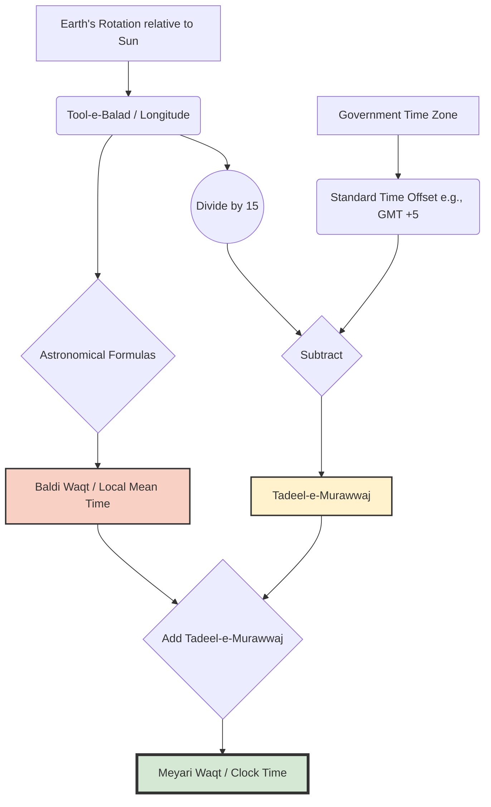
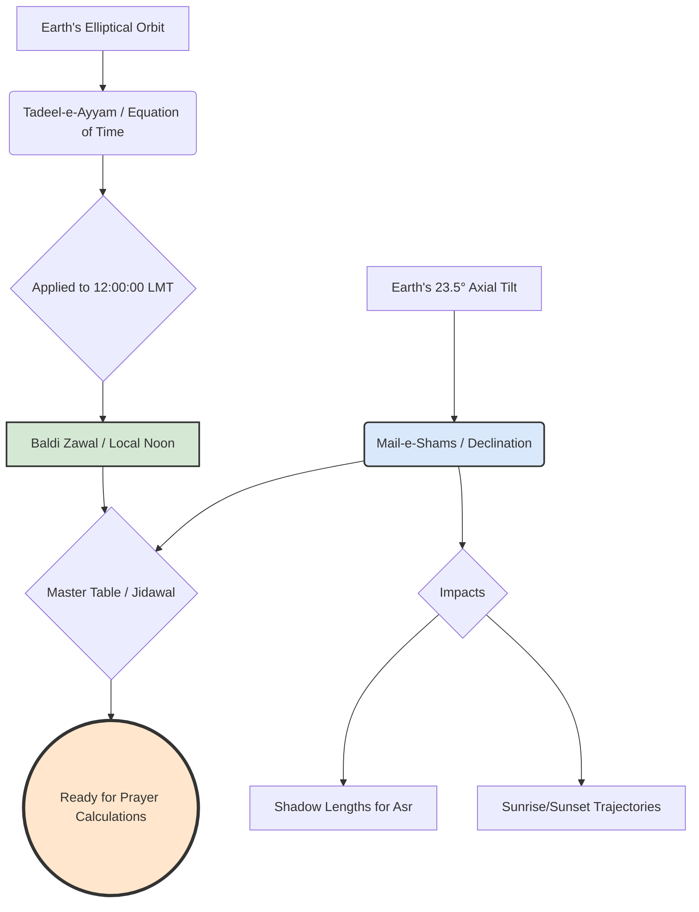

## Book Analysis 

Based on a meticulous and exhaustive analysis of the provided 269-page PDF, here is a detailed breakdown of the book. 

### **I. General Overview & Bibliographic Information**
*   **Title:** نصاب توقیت (حصہ اول) - *Nisab-e-Tauqeet (Part 1)* [Curriculum of Timekeeping].
*   **Subtitle:** "An easy, primary book comprising the terminology of the science of timekeeping, the extraction of prayer times, and the direction of the Qibla using modern mobile phones."
*   **Author:** Ustad-ul-Tauqeet Waseem Ahmad Attari.
*   **Publisher:** Maktaba-tul-Madinah, the publishing and research wing of Dawat-e-Islami (Al-Madina-tul-Ilmiyah / Islamic Research Center).
*   **Publication Dates:** First Edition: Ramadan 1443 AH / April 2022 (1,000 copies). Second Edition: Rajab 1444 AH / January 2023 (2,000 copies).
*   **Language:** Urdu (with English terminology for scientific/geographical terms and Arabic for Islamic texts).
*   **Core Subject:** **Ilm-e-Tauqeet (Islamic Astronomical Timekeeping).** The book bridges classical Islamic jurisprudence (Fiqh) regarding prayer times with modern spherical trigonometry, geography, and the use of scientific calculators.

---

### **II. Pedagogical Structure**
The book is designed as a formal textbook. Its teaching methodology is highly structured:
1.  **Theological Basis:** Begins with Quranic verses or Hadith establishing the religious requirement for a specific time or direction.
2.  **Scientific Definition:** Explains the astronomical phenomenon (e.g., what causes the sun to appear at a certain angle).
3.  **Visual Aid:** Uses high-quality, full-color 3D diagrams of the Earth, sun, and celestial spheres to illustrate the concept.
4.  **Mathematical Formula:** Provides the specific trigonometric formula required to calculate the time or angle.
5.  **Calculator Application:** Shows exact keystrokes for a Casio-style Scientific Calculator to solve the formula.
6.  **Practice Exercises (Mashq):** Provides tables of data for students to practice calculations, with an answer key at the back of the book.

---

### **III. Detailed Chapter-by-Chapter Breakdown**

#### **Front Matter (Pages 1-26)**
*   **Intentions:** Lists 19 spiritual intentions for reading the book, a standard practice in Dawat-e-Islami literature.
*   **Introduction:** Explains the critical importance of *Ilm-e-Tauqeet*. It notes that without this science, Muslims risk praying at forbidden times or facing the wrong direction. It pays homage to Imam Ahmed Raza Khan Barelvi, a master of this science, and explains that this book simplifies his complex manual methods using modern technology.

#### **Chapter 1: Terminology & Fundamentals (Pages 27-44)**
This chapter acts as a glossary of geographical and astronomical terms, providing both Urdu and English names alongside diagrams.
*   **Earth's Grid:** Equator (*Khat-e-Istawa*), Latitude (*Arz-e-Balad*), Longitude (*Tool-e-Balad*), Prime Meridian (Greenwich).
*   **Time Concepts:** AM/PM, International Date Line, Standard Time vs. Local Time, GMT, and Daylight Saving Time (DST).
*   **Angular Measurements:** Degrees, Minutes, Seconds.
*   **Celestial Sphere:** Zenith (*Samt-ur-Raas*), Nadir (*Samt-ul-Qadam*), Horizon (*Ufuq*).
*   **Solar Movements:** Altitude of Sun, Depression of Sun, Sun Declination (*Mail-e-Shams*), Equation of Time (*Tadeel-e-Ayyam*).
*   Includes beautifully rendered 3D globes showing the Tropic of Cancer/Capricorn and polar regions.

#### **Chapter 2: Nisf-un-Nahar (Midday / Zawal) (Pages 45-71)**
*   Defines the exact astronomical midday (when the sun reaches its highest peak) versus the Islamic timeframe.
*   Explains the concept of *Tadeel-e-Murawwaj* (the difference between Local Time and Standard Time based on longitude).
*   Provides the formula to calculate exact Zawal time using Sunrise and Sunset data.
*   Introduces the Degree/Minute/Second (DMS) button on scientific calculators for time arithmetic.

#### **Chapter 3: Sunrise & Sunset (Tulu o Ghuroob) (Pages 72-92)**
*   Differentiates between *Urfi* (astronomical center of the sun) and *Shari'i* (upper limb of the sun) sunrise/sunset.
*   Discusses **Refraction** (how the atmosphere bends light) and **Semi-Diameter** of the sun.
*   **Height Correction:** A crucial section explaining how being on a mountain, a tall building, or an airplane delays sunset and hastens sunrise. This has direct implications for breaking the fast (Iftar).
*   Formulas utilizing `Cos^-1` and `Sin` to calculate exact sunrise/sunset times based on latitude and solar declination.

#### **Chapter 4: Fajr and Isha (Subh o Isha) (Pages 93-115)**
*   Explains the difference between *Subh-e-Kazib* (False Dawn - Zodiacal light) and *Subh-e-Sadiq* (True Dawn - Astronomical Twilight).
*   Establishes the standard of **18 degrees** of solar depression for Fajr and Isha calculations.
*   Discusses high-latitude anomalies (like in Europe) where the sun does not set far enough below the horizon in summer for the twilight to disappear, meaning true Isha time does not technically occur.

#### **Chapter 5: Dahwa Kubra (Pages 116-122)**
*   Defines *Dahwa Kubra* (the exact midpoint between Subh-e-Sadiq and Sunset). This is the absolute deadline for making the intention (Niyyah) for a fast.
*   Outlines the *Makrooh* (forbidden) times for prayer (exactly at sunrise, absolute zenith/zawal, and exactly at sunset).

#### **Chapter 6: Asr Time (Pages 123-131)**
*   Explains shadow mechanics. 
*   Defines *Misl-e-Awal* (when an object's shadow equals its length plus the noon shadow) and *Misl-e-Sani* (when the shadow is twice its length plus the noon shadow).
*   Focuses heavily on the Hanafi school of thought, which generally dictates that Asr begins at *Misl-e-Sani*.
*   Provides complex `Tan^-1` formulas to calculate the exact time these shadow lengths are achieved.

#### **Chapter 7: Direction of Qibla (Simt-e-Qibla) (Pages 132-152)**
*   Provides the exact coordinates of the Kaaba in Makkah (21°25'N, 39°50'E).
*   Teaches how to calculate the precise angle of the Qibla from any city in the world using spherical trigonometry.
*   Explains how to use the sun to find the Qibla (calculating the exact time the sun aligns with the Qibla direction for a specific city).
*   Explains magnetic declination and how to correct compass readings.

#### **Chapter 8: Miscellaneous (Mutafarriqat) (Pages 153-179)**
*   Discusses recommended (*Mustahab*) times for various prayers across different seasons.
*   Explains the mechanics of Leap Years in both Gregorian and Hijri (Lunar) calendars.
*   **Modern Technology:** Guides the user on how to extract accurate coordinates and elevations using Google Earth, Google Maps, and smartphone GPS.
*   Includes a practical case study calculating the delayed sunset for the top of the **Bahria Icon Tower** in Karachi due to its extreme height.

#### **Chapter 9: Interesting Questions & Answers (Pages 180-187)**
*   Answers common geographical questions: Why do days and nights vary in length? Why do seasons change? 
*   Explains the phenomenon of 6-month days and 6-month nights at the North and South Poles.

#### **Chapter 10: Scientific Calculator Usage (Pages 188-193)**
*   A visual, step-by-step manual on how to input the complex trigonometric formulas (`Cos^-1`, `Sin`, `Tan`) into a standard Scientific Calculator to get accurate times and angles without manual mathematical errors.

---

### **IV. Back Matter & Appendices**

*   **Reference Tables (Jidawal) (Pages 194-205):** Contains data tables for the Sun's Declination (*Mail-e-Shams*) and the Equation of Time for every day of the year (using 2020 as a base year).
*   **Coordinates Directory (Pages 206-214):** A highly useful index providing the exact Latitude, Longitude, and GMT offset for dozens of major cities in Pakistan and prominent cities worldwide.
*   **Answer Key (Jawabat) (Pages 215-224):** Provides the correct numerical answers to all the practice exercises (Mashq 2.1 through 7.2) found throughout the chapters.
*   **Endorsements (Taqareez) (Pages 225-247):** Letters of validation from prominent scholars, Muftis, and professors of astronomy. They praise the author for taking an incredibly difficult, dying science and making it accessible to madrasa students using modern calculators rather than outdated astrolabes.
*   **Author's Note (Pages 248-266):** Ustad Waseem Ahmad Attari narrates his personal journey. He describes how difficult it was to learn this science in the 1990s, the lack of modern textbooks, and his subsequent effort to establish the "Prayer Timings Department" within Dawat-e-Islami, culminating in the creation of mobile apps and this specific textbook.

### **Conclusion of Analysis**
"Nisab-e-Tauqeet" is a highly specialized, practical, and mathematically rigorous textbook. It successfully translates medieval Islamic astronomical principles into modern mathematical formulas. By integrating the use of Scientific Calculators, Google Earth, and smartphone apps, the book ensures that the modern Islamic scholar or Imam can calculate prayer times, fasting deadlines, and Qibla directions with absolute pinpoint accuracy, regardless of their location on Earth or their altitude.

---
---
---

### **The Refined, Matured, & Updated Master Outline**

This updated architecture treats *Ilm-e-Tauqeet* as a sequential, algorithmic workflow. Every module builds strictly on the variables calculated in the previous one. 

#### **Prelude: The Epistemology of Timekeeping**
*   **The Synthesis:** How *Fiqh* (Jurisprudence) dictates the conditions, and *Hay'at* (Astronomy) provides the mechanics.
*   **Observation (*Mushahada*) vs. Calculation (*Hisab*):** The Fiqhi hierarchy. Why math serves observation, but does not override the naked eye in cases of doubt.
*   **The Modern Astrolabe:** Establishing the Scientific Calculator as the primary operational tool for this curriculum.

#### **Module 1: The Spatial & Temporal Canvas (Foundations)**
*Objective: Master the grid and the conversion of space into time.*
*   **1.1 The Terrestrial Grid:** Latitude (*Arz-e-Balad*), Longitude (*Tool-e-Balad*), and Equator (*Khat-e-Istawa*). *Includes sign conventions (+/-) critical for calculator syntax.*
*   **1.2 The Celestial Sphere:** Zenith (*Samt-ur-Raas*), Nadir (*Samt-ul-Qadam*), and the Apparent vs. True Horizon (*Ufuq*).
*   **1.3 The Mechanics of Time:** 
    *   Local Mean Time (*Baldi Waqt*) vs. Standard Time (*Meyari Waqt*).
    *   The 15° = 1 Hour conversion rule.
    *   **Core Calculation 1:** Finding *Tadeel-e-Murawwaj* (The longitudinal time offset).
    *   *Proposed Mermaid Diagram:* A flowchart showing the conversion from GMT to Standard Time to Local Time.

#### **Module 2: The Solar Engine (Dynamic Variables)**
*Objective: Understand the two variables that change every single day.*
*   **2.1 Solar Declination (*Mail-e-Shams*):** The sun's annual journey between the Tropics of Cancer and Capricorn.
*   **2.2 Equation of Time (*Tadeel-e-Ayyam*):** 
    *   *Unpacking the Black Box:* Why solar noon is rarely exactly 12:00 PM (briefly explaining orbital eccentricity).
*   **2.3 Data Extraction:** How to read and extract data from the *Jidawal* (Ephemeris tables) provided in the book.

#### **Module 3: The Meridian Axis (Zawal & Nisf-un-Nahar)**
*Objective: Calculate the anchor point of the Islamic day.*
*   **3.1 The Fiqh of the Meridian:** Defining *Zawal* (decline) vs. *Nisf-un-Nahar Haqiqi* (exact solar noon) and the prohibited times for Salah.
*   **3.2 Core Calculation 2:** The Master Zawal Formula.
    *   `Standard Noon = 12:00 ± Tadeel-e-Murawwaj ± Tadeel-e-Ayyam`
    *   *Calculator Scaffolding:* Mastering the Degree/Minute/Second `[° ' "]` key for time arithmetic.

#### **Module 4: The Horizon Mechanics (Sunrise, Sunset & Elevation)**
*Objective: Calculate Tulu (Sunrise) and Ghuroob (Sunset) with high precision.*
*   **4.1 The Physics of the Horizon:** 
    *   *Unpacking the Black Box:* Atmospheric Refraction (*Inkisarat*) and Solar Semi-Diameter (*Nisf Qutr*). Why the Fiqhi sunset (*Shari'i*) requires the sun to be 50' (0.833°) below the geometric horizon.
*   **4.2 Core Calculation 3:** The Hour Angle (*Zawia-e-Zamani*) Formula.
    *   Translating the `Cos^-1` spherical trigonometry formula into exact calculator keystrokes.
*   **4.3 The Elevation Factor (*Tafawut-e-Irtefa*):**
    *   The Fiqh of tall buildings and airplanes (e.g., delaying Iftar).
    *   **Core Calculation 4:** Adjusting the 50' depression angle based on height above sea level.
    *   *Proposed Mermaid Diagram:* Visualizing the line of sight over the curvature of the Earth from an elevated position.

#### **Module 5: The Twilights (Fajr, Isha & Dahwa Kubra)**
*Objective: Calculate the boundaries of the night and the fasting day.*
*   **5.1 The Fiqh of Twilights:** *Subh-e-Kazib* (False Dawn) vs. *Subh-e-Sadiq* (True Dawn); *Shafaq-e-Ahmar* (Red) vs. *Shafaq-e-Abyaz* (White).
*   **5.2 Core Calculation 5:** The 18° Depression Formula for Fajr and Isha.
*   **5.3 Fiqhi Addendum (Global Context):** 
    *   Briefly explaining alternative conventions (15°, 19°) for context.
    *   The "Abnormal Zones" (High Latitudes): What happens when the calculator returns a "Math Error" in summer? (Brief overview of *Aqrab al-Ayyam* / *Nisf al-Lail* solutions).
*   **5.4 Core Calculation 6: Dahwa Kubra:** 
    *   Calculating the exact midpoint between *Subh-e-Sadiq* and *Ghuroob* (The deadline for the fasting intention).

#### **Module 6: The Shadow Mechanics (Asr)**
*Objective: Calculate prayer times based on shadow lengths rather than horizon angles.*
*   **6.1 The Fiqh of Shadows:** *Misl-e-Awal* (1x shadow) vs. *Misl-e-Sani* (2x shadow - Hanafi standard).
*   **6.2 The Mathematics of Shadows:**
    *   Calculating the Base Noon Shadow (*Saya-e-Asli*).
    *   *Unpacking the Black Box:* Using Inverse Tangent (`Tan^-1`) to convert a shadow ratio back into a solar altitude angle.
*   **6.3 Core Calculation 7:** The Asr Formula.

#### **Module 7: The Sacred Vector (Simt-e-Qibla)**
*Objective: Calculate the exact direction of the Kaaba from any point on Earth.*
*   **7.1 Spherical Geometry of the Qibla:** 
    *   Using the Kaaba's coordinates.
    *   *Unpacking the Black Box:* The Great Circle route vs. flat map misconceptions (Rhumb lines).
*   **7.2 Core Calculation 8:** The Qibla Angle Formula.
*   **7.3 Operationalizing the Vector:**
    *   True North vs. Magnetic North (Magnetic Declination).
    *   **Core Calculation 9:** Finding the Qibla using the Sun (Calculating the exact clock time the sun aligns with the Qibla azimuth).
    *   *Proposed Mermaid Diagram:* A top-down compass rose showing True North, Magnetic North, and the Qibla vector.

#### **Module 8: Modern Epistemology & Verification (Conclusion)**
*   **8.1 Digital Verification:** How to use Google Earth and GPS coordinates to feed accurate data into your calculator.
*   **8.2 The Limits of Computation:** Reaffirming that algorithms are models of reality, and human observation remains the ultimate Fiqhi standard in anomalous conditions.
*   **8.3 Final Exam/Practical Project:** A consolidated worksheet requiring the student to calculate a full day's timetable (Fajr to Isha + Qibla) for a specific global city, mimicking the book's exercises.

---
---
---
***

# MASTER STUDY GUIDE: NISAB-E-TAUQEET
## The Science of Islamic Astronomical Timekeeping

---

### **PRELUDE: The Epistemology of Timekeeping**

Before executing a single calculation, the student must understand the philosophical and jurisprudential framework of *Ilm-e-Tauqeet* (The Science of Timekeeping). This is not merely an exercise in applied mathematics; it is the sacred mechanism by which the boundaries of worship (*Ibadah*) are established.

**1. The Synthesis of Two Sciences**
*Ilm-e-Tauqeet* sits at the precise intersection of *Fiqh* (Islamic Jurisprudence) and *Hay'at* (Astronomy/Spherical Geometry). 
*   **Fiqh dictates the condition:** It provides the qualitative parameter. (e.g., "Asr begins when the shadow of an object becomes twice its length, plus the shadow at noon").
*   **Hay'at provides the mechanics:** It provides the quantitative calculation. (e.g., "At what exact clock time does the solar altitude result in a shadow of that specific length at this specific latitude?").
Math does not dictate the law; math serves the law.

**2. Observation (*Mushahada*) vs. Calculation (*Hisab*)**
In Islamic epistemology, physical observation (*Mushahada*) of the cosmos is the ultimate arbiter of truth. Calculation (*Hisab*) is a predictive model of reality. While our algorithms are phenomenally accurate, they are models. If a Fiqhi parameter is physically observed to contradict a calculation (e.g., a mathematical model predicts sunset at 18:00, but atmospheric anomalies cause the sun to still be visibly above the horizon at 18:01), the **observation takes absolute precedence**. The fast cannot be broken. Calculation is a tool for certainty in the absence of visual confirmation, not a replacement for reality.

**3. The Modern Astrolabe**
Historically, Muslim astronomers utilized the *Usturlab* (Astrolabe) and the *Rub' al-Mujayyab* (Sine Quadrant) to solve complex spherical triangles. Today, the **Scientific Calculator** (specifically models featuring trigonometric functions and Degree/Minute/Second `[° ' "]` conversion) is our modern astrolabe. This curriculum relies heavily on the calculator not as a crutch, but as the standard operational instrument for modern *Ulema* and timekeepers. 

**4. The Anatomy of the Islamic Day**  
A critical paradigm shift is required when transitioning from secular timekeeping to Ilm-e-Tauqeet. In the secular, Gregorian model, a new day begins at midnight (00:00). In Islamic Fiqh, the 24-hour cycle begins exactly at **Ghuroob (Sunset)**. The night strictly precedes the daylight hours. Therefore, Thursday night actually occurs after Thursday's sunset (what secularly is called Wednesday evening). This is why Taraweeh prayers for Ramadan begin the night before the first fast.

---

### **MODULE 1: The Spatial & Temporal Canvas (Foundations)**

*Objective: To master the coordinate grid of the Earth and the celestial sphere, and to understand the mathematical conversion of spatial distance into clock time.*

#### **1.1 The Terrestrial Grid (Earth's Coordinates)**
To calculate the angle of the sun relative to an observer, we must first pinpoint the observer's exact location on the Earth's surface. 

*   **Khat-e-Istawa (The Equator):** The primary great circle of the Earth, resting at 0°. It divides the Earth into the Northern and Southern hemispheres.
*   **Arz-e-Balad (Latitude):** The angular distance of a location North or South of the Equator. 
    *   *Critical Syntax Rule:* In our mathematical formulas, Northern latitudes are entered as **Positive (+)** values, and Southern latitudes are entered as **Negative (-)** values.
*   **Tool-e-Balad (Longitude):** The angular distance of a location East or West of the Prime Meridian.
    *   *Critical Syntax Rule:* Eastern longitudes are entered as **Positive (+)** values, and Western longitudes are entered as **Negative (-)** values.
*   **Khat-e-Nisf-un-Nahar (Prime Meridian):** The 0° longitude line passing through Greenwich, London. It is the global baseline for both space and time.

#### **1.2 The Celestial Sphere (The Sky's Coordinates)**
When an observer looks up, they are standing at the center of an imagined dome called the Celestial Sphere.

*   **Samt-ur-Raas (Zenith):** The point in the sky directly, 90 degrees vertically above the observer's head.
*   **Samt-ul-Qadam (Nadir):** The point directly below the observer's feet, on the opposite side of the celestial sphere.
*   **Ufuq (The Horizon):** The line that separates the visible sky from the Earth. In *Ilm-e-Tauqeet*, we must rigorously distinguish between two types of horizons:
    1.  **Ufuq-e-Haqiqi (True/Rational Horizon):** A mathematically perfect plane passing through the center of the Earth, exactly 90° away from the Zenith. 
    2.  **Ufuq-e-Hissi (Apparent/Visible Horizon):** The actual line where the sky appears to meet the land or sea from the observer's specific vantage point. 
    *   *Note:* The higher an observer's elevation, the further the *Ufuq-e-Hissi* dips below the *Ufuq-e-Haqiqi*. This distinction is the bedrock of "Height Correction" (*Tafawut-e-Irtefa*) calculated in later modules.

  
**1.3 The Mechanics of Time (Space-to-Time Conversion)**  
Time, astronomically speaking, is a measurement of the Earth's rotation relative to the Sun. Because the Earth is a 360° sphere and rotates once every 24 hours, space and time are directly proportional:

- **360° = 24 Hours**
    
- **15° = 1 Hour**
    
- **1° = 4 Minutes**
    

To calculate accurate prayer times, we must navigate three distinct layers of time:

**A. Apparent Solar Time (Sundial Time)**  
This is the raw, observable time. Exactly 12:00:00 PM occurs the very second the sun physically crosses your local meridian (Zawal). However, because Earth's orbit is elliptical, the sun's apparent speed changes throughout the year, making sundial days slightly longer or shorter than 24 hours.

**B. Baldi Waqt (Local Mean Time - LMT)**  
Because mechanical clocks cannot speed up or slow down to match the sun, astronomers created "Mean Time"—an artificial average of the sun's movement. Baldi Waqt is the clock time for your exact longitude.

**C. Meyari Waqt (Standard Time)**  
A political and administrative construct. To prevent neighboring towns from having clocks that are 3 minutes apart, governments group vast longitudinal regions into a single time zone, anchored to a specific reference longitude (e.g., GMT +5, GMT -4).

**1.4 CORE CALCULATION 1: Tadeel-e-Murawwaj (The Standard Time Modifier)**  
Our trigonometric formulas will yield results in Baldi Waqt (Local Mean Time). We must mathematically convert those results into Meyari Waqt (Standard Time) so they match the clocks on our walls and smartphones.

The difference between Standard Time and Local Mean Time is called **Tadeel-e-Murawwaj**.

STEM Optimization Note: Traditional texts often provide complex, multi-step logical rules to determine whether to add or subtract this value based on your location relative to the time zone meridian. We bypass this entirely by using a unified algebraic formula. As long as you strictly adhere to the sign conventions (+ for East, - for West), this single formula will automatically output the correct positive or negative modifier.

> **The Master Formula:**  
> Tadeel-e-Murawwaj = Standard Time Offset - (Tool-e-Balad ÷ 15)

- **Standard Time Offset:** Your time zone relative to Greenwich (e.g., Pakistan is +5, New York is -5).
- **Tool-e-Balad:** Your exact longitude. (East is positive +, West is negative -).

**Calculator Syntax Protocol:**  
You must use the **Degree/Minute/Second [° ' "]** button on your scientific calculator. This allows the processor to handle base-60 (sexagesimal) mathematics seamlessly.

**Example 1: Eastern Hemisphere (Karachi, Pakistan)**

- Longitude (Tool-e-Balad): 67° 04' E (+67°04')
- Standard Time Offset: +5
- Formula: 5 - (67°04' ÷ 15)
- Calculator Keystrokes: 5 - ( 67 [° ' "] 4 [° ' "] ÷ 15 ) =
- **Result:** 0° 31' 44" (Which translates to **+0 Hours, 31 Minutes, 44 Seconds**).
- Application: Whatever local time our formulas output for Karachi, we will **add** 31m 44s to it to get Pakistan Standard Time.

**Example 2: Western Hemisphere (Washington D.C., USA)**

- Longitude (Tool-e-Balad): 77° 02' W (-77°02')
- Standard Time Offset: -5
- Formula: -5 - (-77°02' ÷ 15)
- Calculator Keystrokes: -5 - ( -77 [° ' "] 2 [° ' "] ÷ 15 ) =
- **Result:** 0° 8' 8" (Which translates to **+0 Hours, 8 Minutes, 8 Seconds**).

**Example 3: Negative Modifier (Jakarta, Indonesia)**

- Longitude (Tool-e-Balad): 106° 49' E (+106°49')
- Standard Time Offset: +7
- Formula: 7 - (106°49' ÷ 15)
- Calculator Keystrokes: 7 - ( 106 [° ' "] 49 [° ' "] ÷ 15 ) =
- **Result:** -0° 7' 16" (Which translates to **-0 Hours, 7 Minutes, 16 Seconds**).
- Application: Whatever local time our formulas output for Jakarta, we will **subtract** 7m 16s from it to get Indonesia Standard Time.

#### ~~**1.3 The Mechanics of Time (Space-to-Time Conversion)**~~
~~Time, astronomically speaking, is simply a measurement of the Earth's rotation relative to the Sun. Because the Earth is a 360° sphere and rotates once every 24 hours, space and time are directly proportional:~~
*   ~~**360° = 24 Hours**~~
*   ~~**15° = 1 Hour**~~
*   ~~**1° = 4 Minutes**~~

~~This relationship forces us to navigate two distinct time systems:~~

~~**A. Baldi Waqt (Local Mean Time - LMT)**~~
~~This is the true astronomical time of your specific *Tool-e-Balad* (Longitude). If you walk 15 miles East, your *Baldi Waqt* changes. In this system, 12:00 PM occurs exactly when the sun crosses your specific meridian.~~

~~**B. Meyari Waqt (Standard Time)**~~
~~A political and administrative construct. To prevent every town from having a different clock, governments group vast longitudinal regions into a single time zone, anchored to a specific reference longitude (e.g., GMT +5, GMT -4).~~ 

#### ~~**1.4 CORE CALCULATION 1: Tadeel-e-Murawwaj (The Standard Time Modifier)**~~
~~Because our astronomical formulas will yield results in *Baldi Waqt* (Local Time), we must mathematically convert those results into *Meyari Waqt* (Standard Time) so they match the clocks on our walls.~~ 

~~The difference between Standard Time and Local Time is called **Tadeel-e-Murawwaj**.~~ 

> ~~**The Master Formula:**~~
> ~~`Tadeel-e-Murawwaj = Standard Time Offset - (Tool-e-Balad ÷ 15)`~~

*   ~~**Standard Time Offset:** Your time zone relative to Greenwich (e.g., Pakistan is `5`, New York is `-5`).~~
*   ~~**Tool-e-Balad:** Your exact longitude. (Remember the syntax: East is positive, West is negative).~~

~~**Calculator Syntax Protocol:**~~
~~To execute this, you must use the **Degree/Minute/Second `[° ' "]`** button on your scientific calculator. This button allows the calculator to process base-60 mathematics (sexagesimal), which is required for both angular degrees and time (hours/minutes/seconds).~~

~~**Example 1: Eastern Hemisphere (Karachi, Pakistan)**~~
*   ~~Longitude (*Tool-e-Balad*): 67° 04' E (Positive)~~
*   ~~Standard Time Offset: +5~~
*   ~~Formula: `5 - (67°04' ÷ 15)`~~
*   ~~Calculator Keystrokes: `5` `-` `(` `67` `[° ' "]` `4` `[° ' "]` `÷` `15` `)` `=`~~
*   ~~**Result:** `0° 31' 44"` (Which translates to +0 Hours, 31 Minutes, 44 Seconds).~~
*   ~~*Meaning:* Karachi's standard clock is artificially set 31 minutes and 44 seconds *ahead* of its true astronomical local time.~~

~~**Example 2: Western Hemisphere (Washington D.C., USA)**~~
*   ~~Longitude (*Tool-e-Balad*): 77° 02' W (Negative)~~
*   ~~Standard Time Offset: -5~~
*   ~~Formula: `-5 - (-77°02' ÷ 15)`~~
*   ~~Calculator Keystrokes: `-5` `-` `(` `-77` `[° ' "]` `2` `[° ' "]` `÷` `15` `)` `=`~~
*   ~~**Result:** `0° 8' 8"` (Which translates to +0 Hours, 8 Minutes, 8 Seconds).~~

***

#### **System Architecture: The Time Conversion Flow**

*Summary of Module 1: You now possess the mathematical key (`Tadeel-e-Murawwaj`) to translate any localized celestial event into standard clock time. In Module 2, we will introduce the dynamic solar variables that change every single day of the year.*

---
---

Here is the authoritative drafting of **Module 2**. 

In this module, we transition from the static grid of the Earth (which never changes) to the dynamic variables of the solar system (which change every single day). 

***

### **MODULE 2: The Solar Engine (Dynamic Variables)**

*Objective: To master the two daily solar variables—Solar Declination and the Equation of Time—and understand how to extract them from astronomical ephemeris tables (Jidawal).*

To calculate prayer times for any specific day, we must account for the Earth's orbit around the sun. Because the Earth is tilted on its axis and its orbit is elliptical, the sun's apparent position and speed in our sky change daily. This creates two dynamic variables that are the "engine" of all *Ilm-e-Tauqeet* calculations.

#### **2.1 Mail-e-Shams (Solar Declination)**
**Definition:** *Mail-e-Shams* is the angular distance of the sun directly North or South of the Celestial Equator (*Khat-e-Istawa*). 

**The Physics & Geography:**
Because the Earth's axis is tilted at approximately 23.5 degrees, the sun appears to migrate North and South throughout the year. 
*   **Northern Maximum (+23° 26'):** Around June 21, the sun reaches its highest northern declination, sitting directly over the **Tropic of Cancer (*Khat-e-Sartan*)**. 
*   **Equinoxes (0° 00'):** Around March 21 and September 23, the sun is exactly over the Equator (*Khat-e-Istawa*).
*   **Southern Maximum (-23° 26'):** Around December 21, the sun reaches its lowest southern declination, sitting directly over the **Tropic of Capricorn (*Khat-e-Jady*)**.

**Why it matters for Fiqh:** 
*Mail-e-Shams* dictates the altitude of the sun at noon, which in turn dictates the length of shadows. In the winter (when *Mail-e-Shams* is negative for the Northern Hemisphere), the sun is low, and noon shadows are long. This directly impacts the calculation of *Asr* (which is based on shadow length). It also dictates the exact trajectory of sunrise and sunset.

*Critical Syntax Rule:* When extracting *Mail-e-Shams* for calculations, Northern declination is always entered as **Positive (+)** and Southern declination is always entered as **Negative (-)**.

#### **2.2 Tadeel-e-Ayyam (Equation of Time) & Baldi Zawal**
**Definition:** *Tadeel-e-Ayyam* is the difference between Apparent Solar Time (the true sun in the sky) and Mean Solar Time (the artificial 24-hour clock).

**Unpacking the Black Box (The Astrophysics):**
Why isn't the sun exactly at its highest point (Zenith/Meridian) at exactly 12:00:00 PM Local Time every day? Two reasons:
1.  **Kepler's Second Law:** Earth's orbit is an ellipse, not a perfect circle. Earth moves faster when it is closer to the sun (Perihelion in January) and slower when it is farther away (Aphelion in July).
2.  **Obliquity of the Ecliptic:** The Earth's 23.5° tilt means the sun's apparent daily motion along the equator varies.

These two factors combine to create the **Equation of Time (EoT)**. The true sun can be up to ~16 minutes "fast" (crossing the meridian before 12:00 PM) or ~14 minutes "slow" (crossing after 12:00 PM).

**The Textbook's Optimization (Baldi Zawal):**
In standard astronomy, to find the exact Local Mean Time (LMT) of solar noon, you would use the formula: `12:00:00 - Equation of Time`. 

However, to minimize calculation errors for students, *Nisab-e-Tauqeet* pre-calculates this. In the tables (*Jidawal*) at the back of the book (Pages 194-205), the author does not provide the raw *Tadeel-e-Ayyam*. Instead, he provides a column titled **Baldi Zawal** (Local Noon). 
*   *Baldi Zawal* is simply 12:00:00 adjusted for the Equation of Time for that specific day. 
*   *Example:* On January 1st, the true sun is "slow." The table provides a *Baldi Zawal* of `12:11:09`. This means the sun crosses the meridian 11 minutes and 9 seconds *after* 12:00 PM Local Mean Time.

#### **2.3 Data Extraction: Using the Jidawal (Ephemeris Tables)**
Before executing any formula in the upcoming modules, you must look up the two daily variables for your target date.

**Example Data Extraction (From Page 194 of the text):**
Let's extract the variables for **January 1st**.
1.  Go to the January Table.
2.  Find Row 1.
3.  **Mail-e-Shams (Declination):** `-23° 01'` (The sun is deep in the Southern Hemisphere, hence the negative sign).
4.  **Baldi Zawal (Local Noon):** `12:03:19` (The sun crosses the meridian at 12:03 PM Local Time).

*Note on Leap Years (Kasrat):* The tables provided in the book are anchored to a specific year (e.g., 2020, a leap year). Because the true solar year is 365.24 days, *Mail-e-Shams* and *Baldi Zawal* shift slightly every year in a 4-year cycle. For extreme precision (to the exact second), modern timekeepers use algorithms or live data (like NOAA or Google Earth engines, as mentioned on page 76). However, for standardized Fiqhi calculations and examinations, the provided tables are highly sufficient.

***

#### **System Architecture: The Solar Mechanics**

*Summary of Module 2: You now understand the two dynamic variables that drive the celestial engine. You know how to extract the Sun's Declination (*Mail-e-Shams*) and the Local Noon (*Baldi Zawal*) for any day of the year. We are now fully equipped to calculate the first and most central prayer boundary of the day: Zawal.*

***

**Status:** Module 2 is complete. It successfully bridges the astrophysics of Earth's orbit with the specific data architecture of the *Nisab-e-Tauqeet* textbook. 

**Shall we proceed to Module 3: The Meridian Axis (Zawal & Nisf-un-Nahar), where we will execute our first full prayer time calculation?**

---
---

