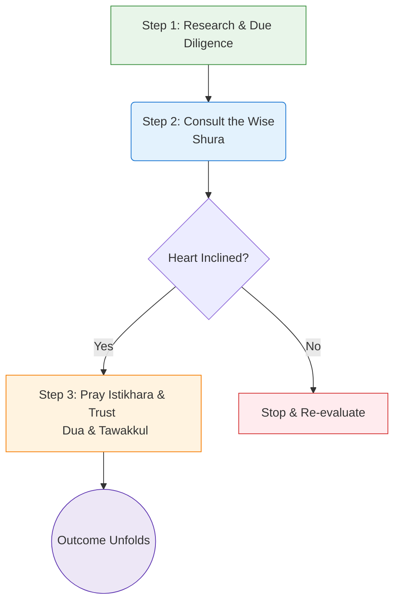
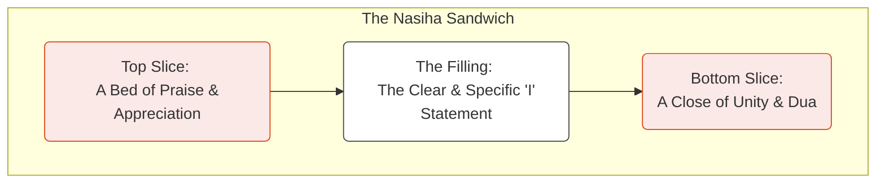
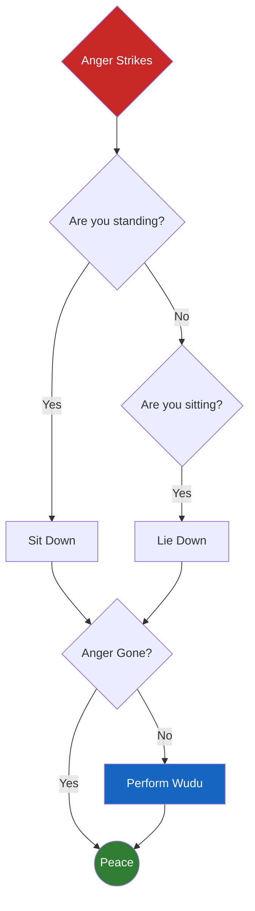
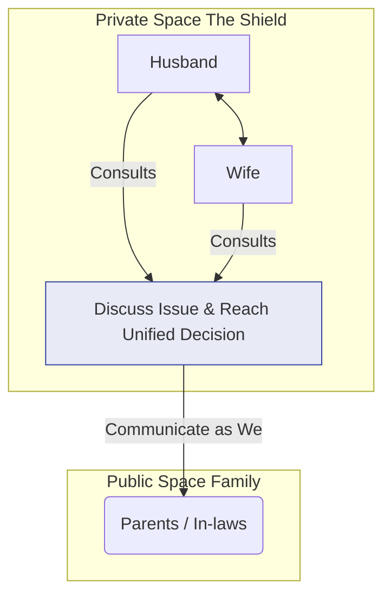
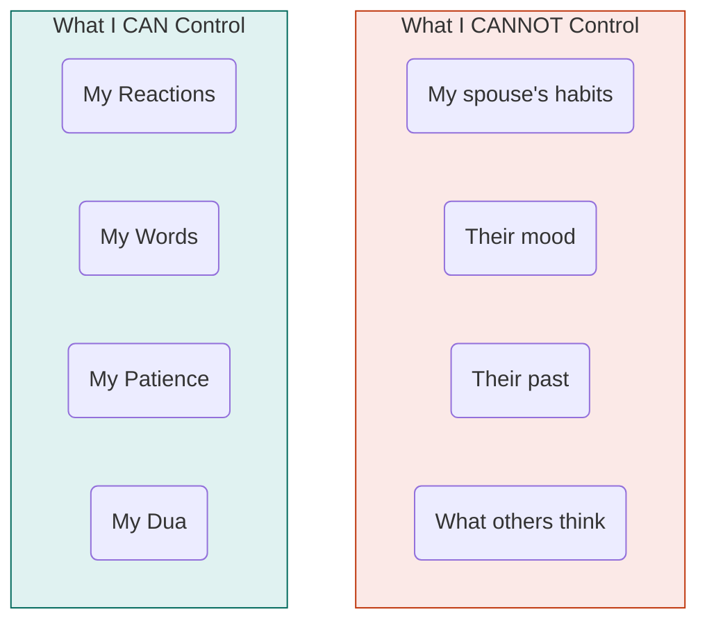

# Main Book Content

---

# Title Verso Page

**Copyright** © 2025 by Imam Azam Research Centre (IARC), Shaikh Ul Islam Trust

All rights reserved. No part of this publication may be reproduced, distributed, or transmitted in any form or by any means, including photocopying, recording, or other electronic or mechanical methods, without the prior written permission of the publisher, except in the case of brief quotations embodied in critical reviews and certain other noncommercial uses permitted by copyright law.

**Publisher** : Imam Azam Research Centre (IARC), Shaikh Ul Islam Trust

**Publishers Address** : First Floor, Besides Quresh Hall, Opposite Paradise Complex, Near Madni Maskan, Mirzapur, Ahmedabad 380001.

**Publishers Contact** : 9898xxx012 Akhlak Sufi 

**Ordering Information** : For details on sales and distribution, please contact the publisher at the contact details above.

**Disclaimer** : The advice and principles in this book are intended for navigating the normal challenges and imperfections of a healthy marriage. They are a guide for building connection and exercising patience with non-sinful character flaws. This book is not a guide for enduring Zulm (oppression, abuse). If you are in a situation involving physical, emotional, spiritual, or financial abuse, your first Islamic and moral duty is to seek safety and help from qualified scholars and professional authorities. Patience with oppression is not a virtue.

ISBN 978-1-xxxABCxxx-01-2 (English)
ISBN 978-1-xxxABCxxx-01-2 (Hindi)
ISBN 978-1-xxxABCxxx-01-2 (Urdu)

**First Edition** : October 2025

Printed in India

Qur'anic verses are translated based on the Ma'ariful Quran translation of Muhaddith al-Azam, with minor modifications by the author for clarity and flow. Hadith references are provided from standard collections.

---

# Dedication Page

1. The Ultimate Guide Concept: To the best of husbands, the most merciful of men, the guide for all of humanity, Prophet Muhammad ﷺ, who taught us that the path to Allah ﷻ runs directly through the heart of our homes.
   And to every soul striving to walk that path, seeking to turn their marriage into a garden of Paradise.
2. The Source & The Seeker Concept: In the name of Al-Wadud, The Most Loving, who placed love between hearts as a sign of His existence.
   And for every husband and wife who seek to be a mirror to each other, reflecting not just their flaws, but the light of Iman that can guide them both back to Him.
3. The Personal & Universal Concept: To my beloved spouse, my first mirror on this journey of Tazkiyah.
   And to all the couples who will pick up this book, praying that you find in these pages a compass that points your hearts towards each other, and both your hearts towards Allah ﷻ.

---

# Takreez HSI 01

بسم اللہ الرحمٰن الرحیم
نحمده و نصلي و نسلم على رسوله الكريم

~~The Muslim family is the bedrock of our Ummah. When our homes are filled with peace (sakinah), mercy (rahmah), and love (mawaddah), the entire community flourishes. Yet in these times of great trial (fitnah), the sacred institution of marriage faces unprecedented challenges from the winds of materialism, individualism, and heedlessness (ghaflah).~~

HSI
Date & place

---

# Takreez ASDI 02

بسم اللہ الرحمٰن الرحیم
نحمده و نصلي و نسلم على رسوله الكريم
~~I pray that this book finds its way into every Muslim home, especially into the hands of our young men and women who are about to embark on this sacred journey. It is a work of sincere scholarship and deep spiritual insight that is desperately needed today.~~

~~May Allah ﷻ ﷻ accept this noble effort from the author and the publisher, make it a source of immense benefit for the Ummah, and grant them the best of rewards in this world and the Hereafter. Aameen.~~

Shakir Ali Noori
Ameer, Sunni Dawate Islami
Mumbai, India

---

# ToC

```table-of-contents
title: 
style: nestedOrderedList # TOC style (nestedList|nestedList|inlineFirstLevel)
minLevel: 0 # Include headings from the specified level
maxLevel: 3 # Include headings up to the specified level
include: 
exclude: 
includeLinks: true # Make headings clickable
hideWhenEmpty: false # Hide TOC if no headings are found
debugInConsole: false # Print debug info in Obsidian console
```


---

# Prologue

> [!QUOTE] La Taqnatu (Do Not Despair)

> [!SUBTITLE] Before You Begin...
> A word on Hope!

#### [!QUOTE] La Taqnatu (Do Not Despair)

#### [!SUBTITLE] Before You Begin...

## A Word on Hope


> ...لَا تَقْنَطُوا مِن رَّحْمَةِ اللَّهِ...
> "...Do not despair of the Mercy of Allah ﷻ..." <sup>(Qur'an 39:53)</sup>

Perhaps you are holding this book with a heavy heart.

Perhaps you hold it with hope on the cusp of a new journey, or in a good place, seeking to make it better. Whatever your state, this first word is for you. 

For some, the title of a chapter like "The Art of Connection" can feel like a distant, impossible dream. You may have tried and failed so many times to bridge the gap between you and your spouse that the walls now feel permanent. You may feel your marriage is broken, and you are simply tired.

This word is for you.

Before you learn a single tool, before you analyze a single problem, you must first be reacquainted with one of the most beautiful names of your Lord:  ﷻ الجبار (al-Jabbar).

We often think of this name as "The Compeller," and it is. But it holds a more intimate meaning, a balm for the wounded heart. al-Jabbar ﷻ is also "The One who Mends and Restores What is Broken."

He is the One who mends broken bones, yes, but more profoundly, He mends broken situations, broken spirits, and broken hearts. Your marriage, no matter how fractured it may feel, is not beyond His power to restore. Your heart, no matter how bruised, is not beyond His ability to heal.

Think of the state of the Prophet's ﷺ companions  رضي الله عنهم after the devastating Battle of Uhud. They were physically wounded, emotionally shattered, grieving the loss of their dearest friends. By any worldly measure, they were defeated. Yet the very next day, the Prophet ﷺ rallied these same broken men to rise and pursue the enemy. Their response was not to despair in their defeat, but to rise again with immediate, hope-filled trust in Allah ﷻ's plan.

This is the Sunnah for a heart that has been through a battle. And what is a difficult marriage if not a series of painful battles? The Sunnah is not to sit amidst the wreckage and mourn what is lost. The Sunnah is to get up the next day, turn to al-Jabbar ﷻ, and try again.

If your heart is heavy, it's likely because of a spiritual fog we call **Despair (*Qunut*)**. This isn't just sadness. It's the quiet, creeping belief that your marriage, your situation, is a special kind of broken, one that is beyond even Allah ﷻ's help. It’s a dangerous whisper from Shaytan, because it tries to put a limit on the power of al-Jabbar ﷻ, The Mender of the Broken.

This fog is often thickened by the ghosts of our past mistakes. Have you ever found yourself replaying your worst moments? Your own harsh words, your moments of anger or neglect? That’s Shaytan and your own ego (*nafs*) working together, acting as a prosecutor in your own mind. They want to chain you to the person you were yesterday so you feel unworthy of becoming the person you could be tomorrow. The truth is, Allah ﷻ's mercy is bigger than your biggest mistake. The power of a sincere *Tawbah* doesn't just patch a hole; it gives you a fresh start. This book is for the person you are choosing to be, right now.

Perhaps you are held back not by hopelessness, but by the weight of your own past mistakes. Your own harsh words, your own anger, your own neglect. Shaytan will whisper that it is too late, that the damage is done, that you are unworthy of a peaceful home.

This, too, is a lie. The Prophet ﷺ gave us a key that unlocks every closed door of the past. He ﷺ said, "The one who repents from a sin is like one who has no sin." <sup>1 Sunan Ibn Majah 4250</sup>

Think on the power of that statement. A sincere Tawbah—a moment of turning back to Allah ﷻ with a heart full of regret and a promise to change—does not just patch over your mistakes. It erases them. It grants you a clean slate. The person you were yesterday does not have to be the person you are today. You have been given divine permission to begin again, right now.

Therefore, as you begin this book, do so with a renewed heart. As you read the stories that follow, you will encounter the perfect character of our Prophet ﷺ. Shaytan will whisper, "This is for saints, not for you." Reject this whisper. The goal is not to achieve perfection overnight. The goal is to take one sincere, imperfect step in the right direction. Allah ﷻ judges us not by our final station, but by the direction in which we were walking.

Read this book not with the anxiety of fixing a shattered machine, but with the quiet hope of watering a thirsty plant. With the help of ﷻ الجبار (al-Jabbar ﷻ), the Mender of the Broken, new life is always possible.

---

# Introduction

> [!QUOTE] Al-Mu'min
>  Mir'at al-Mu'min (The Believer is a Mirror)

> [!SUBTITLE] A New Way
>  to See Your Marriage
#### [!QUOTE] Al-Mu'min Mir'at al-Mu'min (The Believer is a Mirror)

#### [!SUBTITLE] A New Way to See Your Marriage

> الْمُؤْمِنُ مِرْآةُ الْمُؤْمِنِ
> "The believer is a mirror to his believer." **<sup>1 (Sunan Abi Dawud 4918)
</sup>**

In most of our marital struggles, we treat our spouse like a device we should be able to control with a remote—trying to mute their reactions, switch their moods, or fast-forward through hard conversations. But the remote only works in our hands—not theirs.

In most of our marital struggles, we act like someone who sees their reflection and tries to fix it by wiping the mirror, not their face. We focus on adjusting the other person, convinced that if they change, we will finally be happy.

In most of our marital struggles, we act like someone yelling at the GPS when we’re lost—blaming the voice, the directions, or the map—rather than pulling over, recalibrating, and checking if we even entered the right destination in the first place.

In most of our marital struggles, we act like someone using the wrong tool for the job—trying to use a hammer where careful hands and patience are needed. We keep applying pressure in the wrong places, thinking more force will fix what only love and understanding can.

We exhaust ourselves trying to fix the person in front of us, and the result is always the same: a relationship filled with tension, resentment, and two people who feel constantly criticized and misunderstood.

Why is it so tempting to try and "fix" our spouse? It's because of a clever trick our heart plays on us. We come into this world with one primary spiritual project: our own soul's purification (*Tazkiyat al-Nafs*). But in marriage, our ego (*nafs*) subtly shifts the focus. It convinces us that our main project is now our spouse.

This comes from a place of subtle **Arrogance (*Kibr*)**. It's the quiet, unexamined assumption that we are the standard and they are the one who needs to change. We become like a person trying to clean a smudge off a mirror, completely unaware that the smudge is on their own face. We exhaust ourselves trying to control a soul we were never meant to control, while the one soul we *are* responsible for—our own—gathers dust. The metaphor of the mirror is a blessed, humbling course correction. It gently turns our head back towards our own reflection and reminds us where the real work lies.

What if we have been looking through the mirror all wrong?

What if the purpose of marriage is not to fix the person in front of you, but to fix the image you see in the mirror?

This single shift in perspective is the key to unlocking a more peaceful and spiritually fulfilling marriage. It is the wisdom given to us by our Prophet ﷺ when he taught that the believer is a mirror to his believer.

**This is the central metaphor of our book, and it is a profound one. Think about how a mirror truly works.**

- A mirror shows you your own flaws, not the flaws of the mirror itself. When you see a smudge on your face, you do not try to wipe the mirror. You attend to your own face.
- A mirror is honest but silent. It reflects reality without judgment, without shouting, without sarcasm.
- You use a mirror to rectify yourself before you step out into the world.

Your spouse is your mirror. Their actions, their words, their very presence often reflect back to you your own spiritual state. Their anger may reflect your own harshness. Their distance may reflect your own neglect. Their frustration may reflect your own impatience. This does not mean you are to blame for their behavior, but it means the only behavior you have absolute control over is your own. The path to a better marriage is not through changing your spouse, but through the 
 
---

## Why This One Relationship Matters So Much


Before we learn how to build a better marriage, we must first stand in awe of why this one relationship holds such a sacred and monumental place in our faith. This is not just another worldly contract; it is a covenant of cosmic significance, a spiritual arena with stakes so high they reach from this world into the next.

To truly understand, we must grasp three foundational truths that elevate marriage from a social arrangement to a pillar of our spiritual lives.

1. **It is Half Your Faith.** The Prophet ﷺ taught us that "When a servant marries, he has completed half of his faith."¹ This is a staggering statement that should cause us to pause. It means the daily arena of marriage—with all its tests of patience, gratitude, mercy, and forgiveness—is the primary curriculum for half of our spiritual development. The path to Allah ﷻ is not a journey we take in isolation; for most of us, it runs directly through the heart of our homes. 
2. **It is a War Against Shaytan.** The Prophet ﷺ informed us that Iblis dispatches his legions daily, and the demon who achieves the highest rank is not the one who tempts a man to steal or drink, but the one who successfully separates a husband and wife.² The act that brings a demon nearest to the throne of Shaytan is the breaking of a marriage. This reveals a profound reality: your peaceful, loving marriage is not a passive state. It is an active, daily act of spiritual warfare against the greatest enemy of humanity. Every moment of connection you build is a victory. Every conflict you resolve with mercy is a defeat for him. 
3. **It is Your Home in This World and the Next.** Marriage is the only human bond that began in the gardens of Paradise, with Adam and Hawa, عليهم السلام. It is the relationship in which you will likely spend more time than with anyone else on earth. And it is the one relationship we pray continues with us into Jannah, a seamless reality from one paradise to another. It is the alpha and omega of human connection.

Because this covenant is so sacred, Allah ﷻ has not left us to navigate it blindly. He ﷻ has given us, through His Quran and His Prophet ﷺ, a clear map for the journey.

---

## How to Journey Through This Book

This book is designed as a practical guide, a toolkit for the heart. It is a journey through the six essential arts of a blessed marriage. To gain the most benefit, here is how we recommend you travel:

1. **Read with an Open Heart.** Read not to find fault in your spouse, but to find opportunities for your own growth. With every tool, ask yourself first: "How can I apply this?"
2. **Focus on One Chapter at a Time.** Do not try to implement everything at once. Spend a week or two focusing on the tools from a single chapter. Master one small change before moving to the next.
3. **Discuss, Don't Accuse.** If reading this with your spouse, use it as a basis for gentle conversation. Instead of saying, "You need to read the chapter on anger," try saying, "I found the chapter on conflict really helpful for me. Could we perhaps look at it together?"
4. **Use the Visuals.** The diagrams, tables, and checklists in each chapter are designed to be quick, memorable summaries of the core tools. Use them as mental anchors during your day.
5. **Use the Appendix.** The "Believer's Toolkit" at the end of this book is your quick-reference guide. Use it in a moment of crisis to find the right tool for the right situation.
6. **Be Patient with the Process.** The tools in this book are spiritual aids, not magic wands. They are simple to understand but require sincere and consistent effort to master, like developing a new muscle. For challenges that feel deeply rooted, overwhelming, or connected to past trauma, remember that seeking help is a sign of strength. The principles in this book can be powerfully supplemented by the support of wise spiritual mentors and qualified professional counselors.

This is not just a routine simple marriage guide; it is a manual for Tazkiyat al-Nafs—the purification of the soul—through the sacred institution of marriage for entering the Jannah. Let us begin.

#### [!danger] A Critical Disclaimer

The principles in this book are for building healthy relationships and navigating the normal challenges of marriage. They are a guide for patience with imperfection, not oppression. If you are in a situation involving physical, emotional, or spiritual abuse (Zulm), your first duty is to seek safety and help from scholars and qualified professionals. The Prophet ﷺ commanded us to stop oppression, not to be patient with it.

> [!danger] A Critical Disclaimer
> The principles in this book are for building healthy relationships and navigating the normal challenges of marriage. They are a guide for patience with imperfection, not oppression. If you are in a situation involving physical, emotional, or spiritual abuse (Zulm), your first duty is to seek safety and help from scholars and qualified professionals. The Prophet ﷺ commanded us to stop oppression, not to be patient with it.

---

# Chapter 1 -  The Art of Choosing

> [!QUOTE] Al-Kafa'ah fi al-Din 
> (Competence in Faith)

> [!SUBTITLE] How do I choose a partner, not just a person?

#### [!QUOTE] Al-Kafa'ah fi al-Din (Competence in Faith)

#### [!SUBTITLE] How do I choose a partner, not just a person?

## 1.1 The Story: The Marriage of a Man Beloved to Allah ﷻ

His name was Julaybib رضي الله عنه.

In the bustling city of Madinah زادها الله تكريماً وتشريفاً, home to the Prophet Muhammad ﷺ and his noble companions, Julaybib رضي الله عنه was a man often overlooked. He was not known for wealth, for commanding lineage, or for striking good looks. By the world's standards, he was considered unassuming, even "unmarriageable."

One day, the Prophet ﷺ, the man with the most profound insight into the hearts of people, approached Julaybib رضي الله عنه and asked him a simple question: "Julaybib, do you not want to marry?"

Julaybib, perhaps with a heavy heart, replied, "O Messenger of Allah ﷻ, who would marry me?" He felt his worldly station was too low.

The Prophet ﷺ did not see the world's station. He saw Julaybib's رضي الله عنه  station with Allah ﷻ. So he went to the home of a prominent leader from the Ansar and said, "I want to ask for your daughter's hand in marriage."

The Ansari man was overjoyed. To have the Prophet ﷺ as a son-in-law was the greatest honor imaginable. He replied enthusiastically, "Yes, O Messenger of Allah ﷻ! What a delight to my eyes!"

The Prophet ﷺ gently clarified, "I am not asking for her for myself."

The man, confused, asked, "Then for whom?"

"For Julaybib," the Prophet ﷺ replied.

The man was stunned into silence. He looked at his wife and said, "For Julaybib  رضي الله عنه ? Should we give our daughter to Julaybib?" He began to consult with his wife, who shared his hesitation. By every cultural and worldly standard, this was not a suitable match.

But their daughter, who was inside the home and heard the conversation, possessed a wisdom that surpassed her parents' in that moment. She understood a truth they had temporarily forgotten. She came out and addressed them, her voice filled with the clarity of faith:

"Do you refuse the request of the Messenger of Allah ﷻ? By Allah ﷻ, send me to him, for he will not bring ruin upon me."

Her words, full of profound trust, cut through their hesitation. They realized their error. The marriage was arranged.

The Seerah tells us that this union, founded not on worldly status but on pure trust in the wisdom of Allah ﷻ's Messenger, was one of the most blessed in Madinah زادها الله تكريماً وتشريفاً. Not long after, Julaybib رضي الله عنه joined a military expedition. After the battle, the Prophet ﷺ asked his companions to see who was missing. They named the nobles, the famous warriors, the sons of prominent families.

The Prophet ﷺ listened, and then said with love in his voice, "But I am missing my Julaybib رضي الله عنه ."

They found him on the battlefield, having fought valiantly, surrounded by seven enemies he had slain before he was martyred. The Prophet ﷺ went to him, his face filled with sorrow and pride. He took Julaybib's رضي الله عنه  head into his own hands and said, "He is from me, and I am from him." He repeated it twice. He, the leader of all humanity, then dug a grave for this once-overlooked man with his own blessed hands.

The story of Julaybib is the story of our first chapter. It is a story that shatters the flimsy mirrors of this world and asks us to look into the eternal mirror of faith. It asks the most important question: **When you choose a partner, by whose standards are you measuring?**

---

## 1.2 The Problem: The Modern Maze

If you are looking for a spouse today, you might feel lost. It can feel less like a sacred journey and more like navigating a confusing, noisy maze. Your heart is likely pulled in a dozen different directions by anxieties that feel very real:

- "I'm so focused on their looks, their career, their social media... am I being too superficial?"
- "I'm terrified of making a mistake that will ruin my life."
- "My parents are pressuring me to marry someone from our culture or caste, but I don't feel a connection."
- "I'm overwhelmed by marriage apps. It feels like I'm shopping for a person, and I can't make a choice."
- "I want to get married, but I feel like I'm not 'ready' financially. I'm afraid I can't afford it."

These are the whispers of the modern world, and they can drown out the quiet, confident guidance of our faith. This chapter is about turning down that noise and tuning into the clear, simple, and blessed path the Prophet ﷺ laid out for us.

---

## 1.3 The Principle: The Prophetic Formula

When it comes to choosing a life partner, Islam does not leave us guessing. It gives us a clear, divine formula for a successful and blessed union. The Prophet Muhammad ﷺ provided us with the core principle, the one that should be the foundation of every decision in this journey:

> عَنْ أَبِي هُرَيْرَةَ ـ رضى الله عنه ـ عَنِ النَّبِيِّ صلى الله عليه وسلم قَالَ ‏ "‏ **تُنْكَحُ الْمَرْأَةُ لأَرْبَعٍ لِمَالِهَا وَلِحَسَبِهَا وَجَمَالِهَا وَلِدِينِهَا، فَاظْفَرْ بِذَاتِ الدِّينِ تَرِبَتْ يَدَاكَ** ‏"
> "A woman is married for four things: for her wealth, for her lineage, for her beauty, and for her religious commitment (Deen). So, win the one with religious commitment, may your hands be rubbed with dust (i.e., may you prosper)."<sup> 1 (Sahih al-Bukhari 5090)</sup>

This Hadith is the master key. It acknowledges the things the world values—wealth, status, beauty—but it commands us, with the strongest emphasis, to prioritize the one thing that lasts: a person's relationship with Allah ﷻ. This is not to say the other qualities have no place, but they are the supporting cast. Deen and Akhlaq (good character) must be the stars of the show.

### The Heart of the Matter / ~~The Spiritual Root~~

Let's be honest, when we're looking for a spouse, the world screams at us to look at the wrong things. This powerful pull towards wealth, looks, or status is a symptom of a heart condition: **Love of the World (Hubb al-Dunya)**. It’s when our heart gets more excited by what impresses people than by what pleases Allah ﷻ. It asks, "What will my family say?" before it asks, "Will this person pray beside me?" It's a kind of spiritual shortsightedness, where we trade the solid gold of the Hereafter for the glittering plastic of this world.
This makes us poor spiritual investors. You are choosing a partner for the most important journey of your life, and your heart is getting distracted by the packaging. The Prophetic Formula isn't a restriction; it's a loving protection. It's a filter designed to save you from your own blind spots, forcing you to look past the temporary and anchor your entire future on the one thing that truly lasts: a person's relationship with God.

This is reinforced by Allah ﷻ's promise in the Quran, which shifts our focus from finding the perfect person to *becoming* the right person:

> ...وَالطَّيِّبَاتُ لِلطَّيِّبِينَ وَالطَّيِّبُونَ لِلطَّيِّبَاتِ…
"...And good women are for good men, and good men are for good women..."<sup>² (Quran 24:26)</sup>

The journey of choosing a spouse, therefore, begins with choosing to work on ourselves.

---

## 1.4 The Tools: Spiritual Due Diligence

How do we apply these principles in a practical way? Here are three tools to guide your search.

### [!tool] Tool 1: The Niyyah Audit

> [!tool] Tool 1: The Niyyah Audit

Before you even begin looking, you must clarify your intention. Your *Niyyah* is the foundation upon which your entire marriage will be built. A building with a faulty foundation will always be unstable. Ask yourself these questions in the quiet of your own heart:

- **Why do I want to get married?** Is it to complete half my faith and please Allah ﷻ? Or is it because of pressure from family and society?
- **Who am I trying to impress?** Am I seeking a partner who will impress my friends and community, or one who will help me get to Jannah?
- **What is my ultimate goal?** Is it a beautiful wedding, or a blessed marriage? Is it a life of comfort in this world, or a life of purpose that leads to the next?

Be radically honest with yourself. A pure intention is the first step towards receiving Allah ﷻ's guidance.

### [!tool] Tool 2: The Character Checklist

> [!tool] Tool 2: The Character Checklist

The Prophet ﷺ taught us to look beyond superficial appearances. The great companion Umar رضي الله عنه warned, "Do not be deceived by a man's prayers... rather, look at his character in dealings." How do we do that? By investigating three key relationships:

1. **Their Relationship with Allah ﷻ:** Do they pray their five daily prayers? This is the single most important indicator of their commitment to their Deen. It is the foundation upon which all other good character is built.
2. **Their Relationship with their Parents:** How do they speak to their mother and father, especially when they are frustrated or disagree? The Prophet ﷺ said, "The best of you is the best to his family." A person who cannot show kindness and patience to the parents who raised them will not magically learn how to show it to a spouse.
3. **Their Relationship with Money & Trust:** Are they honest in their dealings? Are they known to be trustworthy? The Prophet Musa (AS) was chosen by a wise father for his daughter because he was seen to be "strong and trustworthy" (Qawiyyun Amin). This is a Quranic benchmark for character.

### [!tool] Tool 3: The Istikhara Process

> [!tool] Tool 3: The Istikhara Process

Many people misunderstand Istikhara (seeking guidance from Allah ﷻ) as a prayer you do to see a dream or get a magic sign. The true Sunnah is a more complete and grounded process. It has three essential steps:

1. **Do Your Research:** You must first use the intellect Allah ﷻ has given you. Investigate the person's character using the checklist above. Ask questions. Talk to their friends and family. Do your due diligence.
2. **Consult with the Wise (Shura):** Consult with your parents, a trusted mentor, or a local Imam. The Wali (guardian) is not a dictator, but a protector given by Islam to use their wisdom and experience to protect you from emotional decisions.
3. **Pray and Trust (Dua & Tawakkul):** Once you have done your research and consultation, and your heart feels inclined towards the person, then you perform the two rak'ahs of Istikhara. You entrust the matter to Allah ﷻ and ask Him to make it easy if it is good for you, and to turn it away if it is not.

After this, you trust in Allah ﷻ. If things move forward smoothly, it is a good sign. If obstacles appear and things fall apart, that too is a good sign—it is Allah ﷻ protecting you.



However, like any spiritual practice, our expectations can sometimes lead us astray.

#### From Clumsy to Conscious: A Reality Check

Many of us fall into the "magic sign" trap with Istikhara. We pray, then sit back and wait for a vivid dream, a feeling of absolute certainty, or some other dramatic sign from the heavens. When nothing "magical" happens, we can feel paralyzed, confused, and disconnected. This is a spiritual trap that neglects the intellect and effort Allah ﷻ has commanded us to use.

The reality is, Istikhara is not a substitute for your own research and consultation; it is the final step that consecrates it. It is you, having done all your homework, turning to Allah ﷻ and saying, "O Allah ﷻ, I have used the mind You gave me to the best of my ability. Now I entrust the outcome to Your infinite wisdom." The "answer" to your Istikhara is not usually a dream; it is the reality that unfolds. If things move forward with ease (taysir), that is your sign. If insurmountable obstacles appear and the path closes, that is also your sign—a sign of Allah ﷻ's protection. Trust the process He unfolds, not the magic you expect.

---

## 1.5 Wisdom of the Righteous

"Marry your daughter to a man of *Taqwa* (piety), for if he loves her, he will honor her, and if he dislikes her, he will not oppress her."
— Al-Hasan al-Basri رضي الله عنه 

"Nine-tenths of good character is overlooking the faults of others."
— Imam Ahmad ibn Hanbal رضي الله عنه

---

## 1.6 The Dua of the Chapter

When seeking a partner and hoping for a righteous family, there is no better Dua than the one the servants of the Most Merciful make in the Quran:

> رَبَّنَا هَبْ لَنَا مِنْ أَزْوَاجِنَا وَذُرِّيَّاتِنَا قُرَّةَ أَعْيُنٍ وَاجْعَلْنَا لِلْمُتَّقِينَ إِمَامًا
> "Our Lord, grant us from among our spouses and offspring comfort to our eyes (qurrata ayun \`) and make us an example for the righteous." <sup>3 (Quran 25:74)</sup>

---

## 1.7 Khutbah-Worthy Takeaways / The Heart of the Lesson / For the Seeker's Journal

- The world will ask you, "What do they look like?" Allah ﷻ will ask you, "What is their heart like?"The world will ask, "What is their status?" Allah ﷻ will ask, "What is their station with Me?" Choose the question that matters for eternity.
- You are not choosing a partner for your life. You are choosing the other parent of your children and your neighbor in Paradise. One choice is for sixty years; the other is for sixty million and beyond. Choose with the scales of the Hereafter in your hand.
- Do not seek a perfect person, for you are not perfect. Instead, seek a person whose commitment to Allah ﷻ is firm, for their commitment to you will be born from it. Marry the one whose love for God inspires your own, and you will have married a gateway to Jannah itself.

---

#### Footnotes for Chapter 1

¹ Sahih al-Bukhari 5090
² Quran 24:26
³ Quran 25:74

---
---
---

# Chapter 2 The Art of Connection

#### [!QUOTE] Mawaddah wa Rahmah (Love and Mercy)

#### [!SUBTITLE] "How do we stop feeling like roommates and start feeling like soulmates?"

> [!QUOTE] Mawaddah wa Rahmah (Love and Mercy)

> [!SUBTITLE] "How do we stop feeling like roommates and start feeling like soulmates?"

## 2.1 The Story: The Race of the Prophet

Imagine the scene. The sun of the Arabian peninsula begins its descent, casting long shadows across the desert floor. A group of the Prophet Muhammad's ﷺ companions رضي الله عنه are travelling together, their conversation and the soft tread of their camels filling the air. Among them are the Prophet himself and his young wife, Aisha رضي الله عنها.

In a moment of profound insight into the needs of a marriage, the Prophet ﷺ turns to his companions and asks them to go on ahead, creating a space of privacy and intimacy for him and his wife amidst the public duties of his life.

When they are alone, he does not begin a heavy lecture or a serious discussion. He turns to Aisha رضي الله عنها, his eyes filled with a playful light, and says, "Come, let us have a race."

In that open expanse, the Messenger of Allah ﷻ and his wife raced. Aisha رضي الله عنها, being young and nimble, outran him. She recalled the moment with a joyful memory, noting that he simply smiled and let the moment be.

Years passed. Life brought with it its duties and its joys. Aisha رضي الله عنها matured from a young bride into a wise and learned mother of the believers. As she herself said, she had "put on some weight." Once again, they found themselves on a journey. And once again, in a beautiful echo of the past, the Prophet ﷺ asked his companions to ride on ahead.

He ﷺ turned to his wife, the same playful light in his eyes, and challenged her again: "Come, let us have a race."

They raced again. This time, he was the faster one. He did not boast in his victory. He simply smiled, looked at her with love, and said the words that have echoed through centuries as a lesson in marital connection: "This one is for that one."

This beautiful story is not just a quaint anecdote. It is a masterclass in the art of connection. It teaches us that a blessed marriage is not a dry, formal contract, but a living friendship, filled with shared joy and humour. The Prophet ﷺ is teaching us that even amidst the most serious duties of life, we must intentionally carve out moments of lightness, for it is in these moments that the deepest bonds of the heart are forged.

---

## 2.2 The Problem: "The Spark Has Gone"

For many couples, the story of the Prophet's ﷺ race can feel like a distant dream. The initial spark of marriage slowly, almost imperceptibly, fades under the weight of daily life. The vibrant colours of connection give way to a dull, functional grey. Does any of this feel familiar?

- "We live parallel lives under the same roof. We feel more like roommates than soulmates."
- "I feel invisible and unappreciated for all the things I do every day."
- "My spouse is always on their phone. I feel like I'm no longer a priority."
- "We've lost the playfulness we once had. The marriage feels heavy and serious all the time."

It's the quiet tragedy of a home where two people share a roof but no longer share a heart; where conversations are about logistics, not dreams; where the silence is no longer comfortable, but heavy with unspoken distance.
If these feelings resonate, know that you are not alone, and your situation is not hopeless. These are the common symptoms of a marriage that is starving for connection. Our faith, in its infinite wisdom, does not just diagnose the problem; it gives us the cure.

---

## 2.3 The Principle: Love as an Action

Allah ﷻ, in His infinite wisdom, tells us the very purpose of the marital bond in a single, beautiful verse. This is not just a verse to be recited; it is the mission statement for your relationship.

> وَمِنْ آيَاتِهِ أَنْ خَلَقَ لَكُم مِّنْ أَنفُسِكُمْ أَزْوَاجًا لِّتَسْكُنُوا إِلَيْهَا وَجَعَلَ بَيْنَكُم مَّوَدَّةً وَرَحْمَةً ۚ إِنَّ فِي ذَٰلِكَ لَآيَاتٍ لِّقَوْمٍ يَتَفَكَّرُونَ
> "And of His signs is that He created for you from yourselves mates that you may find tranquility (sakinah) in them; and He placed between you affection (mawaddah) and mercy (rahmah). Indeed in that are signs for a people who give thought." <sup>1 (Quran 30:21)</sup>

The goal is **Sakinah**—a deep, abiding tranquility of the heart and home. It is a state of peace, security, and belonging. Allah ﷻ tells us He has placed two ingredients between spouses to create this Sakinah: **Rahmah (mercy)**, which is the key to navigating conflict, and **Mawaddah**.

Mawaddah is the key to connection. It is often translated as 'love', but it is a far more active and practical concept than the passive, romantic feeling the word 'love' often implies. The root of Mawaddah implies a love that is expressed, shown, and demonstrated through deliberate, consistent action. It is a love you do, not just a love you feel.

### The Heart of the Matter

How does a marriage lose its spark and fade to grey? It happens through two quiet poisons. The first is **Heedlessness (Ghaflah)**. This is the spiritual fog that rolls in when a blessing becomes normal. Remember when your spouse was the answer to your prayers? Ghaflah is what turns that answered prayer into just another part of the furniture. Their kindness becomes an expectation. Their presence becomes a given. We simply stop seeing the gift that is right in front of us.

The second poison is a **Miserliness of the Soul (Bukhl)**. We usually think of this as being stingy with money. But the more dangerous form is being stingy with the heart. It’s when we swallow a compliment. It’s when we withhold a smile because we’re tired. It’s when we see them struggling and think, "That's their problem." The tools in this chapter are a rebellion against this spiritual coldness. They are small, deliberate actions designed to force our hearts to see again, and our souls to be generous again.

Allah ﷻ gives us another profound metaphor for this active, protective love:

> ...هُنَّ لِبَاسٌ لَّكُمْ وَأَنتُمْ لِبَاسٌ لَّهُنَّ...
"...They are clothing for you and you are clothing for them..." <sup>2 (Quran 2:187)</sup>

Clothing provides comfort, protection from the elements, and it conceals our flaws while beautifying our appearance. This is what Mawaddah looks like in practice. We are meant to be a source of comfort, protection, and beauty for each other, actively covering each other's faults and bringing out the best in one another.

## 2.4 The Tools: Watering the Garden of Love Daily

A loving connection is like a garden; it requires daily watering to flourish. The Sunnah of our Prophet ﷺ provides us with the practical tools to water this garden every single day.

### [!tool] Tool 1: The Daily Five - Small Acts of Sadaqah

> [!tool] Tool 1: The Daily Five - 
> Small Acts of Sadaqah

The Prophet ﷺ taught that even the smallest positive acts are a form of charity (sadaqah). <sup>2 Cite Source</sup> A marriage thrives when this charity is directed towards one's spouse, creating a constant flow of positive energy. The Sunnah gives us the means to achieve this. Make it a goal to give your spouse these five forms of *sadaqah* every single day:

1. A Smile: The Prophet ﷺ said, "Your smiling in the face of your brother is a charity."<sup>³ Jamiat-Tirmidhi 1956</sup> Let your spouse be the first to receive this simple, powerful charity. It is a non-verbal signal that says, "I am happy to see you. You are a source of joy for me."
2. **A Specific, Sincere Praise:** Actively hunt for the good in your spouse and voice it. Vague praise is good, but specific praise is powerful.
	1. Instead of "You're religious."
	   Try "I really admire how consistent you’ve been with your salah lately—especially Fajr. It’s inspiring and motivates me to improve too."
	2. Instead of "You're always there for me."
	   Try "Jazak’Allah Khair, the way you listened to me without interrupting last night made me feel really heard. It calmed me down more than you probably realised."
	3. Instead of "You're a good mum," Try "Jazak'Allah Khair, I saw how patiently you handled that tantrum today; I was really impressed."
3. **A Gentle, Non-Demanding Touch:** The Prophet ﷺ would kiss his wife before leaving for prayer.<sup>⁴ 4 Sunan Abi Dawud 179</sup> A simple, non-sexual touch—a hand on the shoulder, holding hands for a moment—reaffirms your bond and physical closeness without any further expectation.
4. **An Explicit "Thank You":** The Prophet ﷺ taught, "He who does not thank people has not thanked Allahﷻ."  <sup>5 Sunan Abi Dawud 4811</sup> Do not let your spouse's daily acts of service become invisible. Explicitly acknowledging their effort is a powerful cure for the poison of feeling unappreciated.
5. **Small, Thoughtful Gesture:** This is not about expensive gifts. It is about demonstrating that your spouse is on your mind. It is bringing them a cup of tea without being asked, or handling a chore you know they dislike. These small actions are deposits into the "emotional bank account" of your marriage.

### [!tool] Tool 2: The Sunnah of Deep Listening

> [!tool] Tool 2: 
> The Sunnah of Deep Listening

In our age of distraction, giving someone your undivided attention has become one of the rarest and most precious gifts. The Prophet ﷺ was the master of this art. He did not just hear people; he listened to them. When  Aisha رضي الله عنها told him the **incredibly long and detailed story of Umm Zar'**, he did not interrupt or look away. He gave her the gift of his full presence.<sup>⁶ Sahih al-Bukhari 5189</sup>

How to practice this lost art:

- **The "Phone Down, Face Up" Rule:** When your spouse wants to speak, make a conscious rule. The phone goes down, face down. The laptop is closed. The TV is muted. You turn your body to face them. This single act of physical reorientation sends a powerful message: "You have my full attention. You matter."
- **Listen to Understand, Not to Solve:** Often, when a spouse expresses a frustration, they are not looking for an immediate solution. They are looking for connection and validation. Your first job is not to be their "fixer," but their "friend." Resist the urge to jump in with solutions. Just listen.
- **Validate Their Feelings:** The goal of listening is to make the other person feel heard. Use simple, powerful phrases like, "That sounds really difficult," or "I can see why you would feel that way," or "Tell me more." These phrases show you have not just heard the words, but felt the emotion behind them.

### [!tool] Tool 3: The Partnership of Service

> [!tool] Tool 3: 
> The Partnership of Service

The Prophet ﷺ was the leader of a nation, yet in his home, he was in the service of his family. He would mend his own shoes, patch his own clothes, and help with the household chores.⁷ This demolishes any cultural notion that housework is exclusively a "woman's job." In Islam, a marriage is a team, and serving each other is an act of humility and love that brings immense *barakah*.

#### For the Husband: The Sunnah of Proactive Help

Following the direct example of the Prophet ﷺ, the husband's role in service is to proactively participate in the physical running of the household. This is not "helping his wife with her chores"; it is taking ownership of his share of their shared life.

How to practice it:
1. **The "How Can I Help?" Check-in:** Do not assume you know what your spouse needs. Make it a regular practice to ask a simple, sincere question: "What is one thing I can do right now to make your load lighter?" This proactive offer can prevent mountains of resentment from building up.
2. **Take Unprompted Initiative:** Do not wait to be asked. If you see a chore that needs doing—dishes in the sink, a bin that needs emptying, a child who needs attention—do it. This proactive service is a powerful expression of true partnership, directly following the Sunnah.

#### For the Wife: The Art of Creating Sanctuary

While service is a shared duty, Islamic tradition has long honored the wife's unique and powerful role as the primary cultivator of the home's atmosphere. Her partnership in service is often focused on transforming the physical house into a spiritual and emotional sanctuary—a place of peace, beauty, and warmth that the family yearns to return to. This is not a lesser role; it is the art of crafting the very sakinah the Qur'an speaks of.

1. **Cultivating a Peaceful Haven:** This is the service of managing the home's emotional temperature. It means striving to greet your husband with a smile, to create an atmosphere free from unnecessary conflict, and to make the home a refuge from the pressures of the outside world. This act of creating peace is a profound form of ongoing charity.
2. **Appreciation as a Service:** A crucial, often overlooked service is the generous appreciation of your husband's efforts outside the home. Acknowledging his hard work and expressing gratitude for his provision is a powerful act of service that fuels his desire to give more. It transforms his work from a mere job into an appreciated act of worship for his family.

This proactive service is a powerful expression of true partnership, directly following the Sunnah.

However, the spirit of service can be quickly poisoned if we fall into a common trap of the nafs.

#### From Clumsy to Conscious: A Reality Check

The fastest way to poison the spirit of service is to start keeping score. Our ego (nafs) is a brilliant accountant of grievances. It will whisper, "I took out the trash and did the dishes... what have you done today?" This turns a beautiful act of worship into a bitter transaction. The home becomes a marketplace of "I did this for you, so you owe me that," and resentment becomes the currency.

The reality is, the moment you start keeping score, you have forgotten who you are truly working for. Your primary act of service is for Allah ﷻ. You are seeking His pleasure and His reward. The peace it brings to your marriage is a beautiful, worldly bonus, but it is not the ultimate goal. The Prophetic model is a race to outdo one another in kindness for the sake of Allah ﷻ, not a competition to see who can get away with doing less. Purify your intention, and you will be freed from the prison of keeping score.

---

## 2.5 Wisdom of the Righteous

"I like to adorn myself for my wife just as I like for her to adorn herself for me."
— Ibn Abbas رضي الله عنه

"The most perfect of believers in faith is the one with the best character. And the best of you are those who are best to their women."
— The Prophet Muhammad ﷺ <sup>9 Jami at-Tirmidhi 1162</sup>

---

## 2.6 The Dua of the Chapter

When seeking to build a stronger connection, to heal rifts, and to bring your hearts together in peace, use this beautiful Dua of the Prophet ﷺ:  

> اللَّهُمَّ أَلِّفْ بَيْنَ قُلُوبِنَا، وَأَصْلِحْ ذَاتَ بَيْنِنَا، وَاهْدِنَا سُبُلَ السَّلاَمِ…
> "O Allah ﷻ, join our hearts (allif bayna qulubina), and set right our matters between us, and guide us to the ways of peace..." <sup>8 (Sunan Abi Dawud 969)</sup>

---

## 2.7 Khutbah-Worthy Takeaways / The Heart of the Lesson / For the Seeker's Journal

- The world teaches you that love is a spark you find. Islam teaches that Mawaddah is a fire you build, log by patient log, day by patient day. Do not wait for the feeling; create the feeling through action.
- Shaytan's greatest goal is to make you see your spouse as a burden. The Sunnah of the Prophet ﷺ is to see your spouse as a blessing to be served. The path to connection is paved with small acts of service done for the sake of Allah ﷻ, not for the sake of keeping score.
- True love in Islam is not found in grand poems, but in the quiet humility of a husband mending his own shoes to lighten his wife's load, and the quiet grace of a wife creating a peaceful sanctuary to lighten her husband's heart. It is a partnership in which each spouse strives to be a garment for the other, covering their faults and beautifying their soul.
- Mawaddah is not a feeling you wait for; it is a garden you water daily. True love in Islam is not found in grand poems, but in the quiet humility of a husband mending his own shoes to lighten his wife's load.

---

#### Footnotes for Chapter 2

¹ Quran 30:21
² Quran 2:187
³ Jami\` at-Tirmidhi 1956
⁴ Sunan Abi Dawud 179
⁵ Sunan Abi Dawud 4811
⁶ Sahih al-Bukhari 5189
⁷ Sahih al-Bukhari 676
⁸ Sunan Abi Dawud 969
⁹ Jami\` at-Tirmidhi 1162

---
---
---

# Chapter 3 - The Art of Communication

#### [!QUOTE] Al-Kalimah Al-Tayyibah (The Good Word)

#### [!SUBTITLE] "Why does it feel like we're speaking different languages?"

> [!QUOTE] 
> Al-Kalimah Al-Tayyibah (The Good Word)

> [!SUBTITLE] 
> "Why does it feel like we're speaking different languages?"

## 3.1 The Story: The Cloak and the Smile

Imagine the scene in the bustling marketplace of Madinah زادها الله تكريماً وتشريفاً. The Prophet Muhammad ﷺ is walking, a heavy cloak with a coarse collar draped over his shoulders. Suddenly, a Bedouin man approaches him from behind, not with the respect befitting a Prophet, but with the rough urgency of the desert. He grabs the Prophet's ﷺ cloak and pulls it so violently that the coarse fabric leaves a red mark on his blessed neck.

The companions who witnessed this must have felt their hearts leap with anger. This was a profound act of disrespect.

The Bedouin, holding the cloak, demands in a harsh voice, "O Muhammad ﷺ! Order that I be given some of Allah ﷻ's wealth that you have!"

The Prophet ﷺ, in this moment of physical discomfort and public disrespect, does not flinch. He does not scold. He does not allow a flicker of anger to cross his face. Instead, he turns to the man, looks at him, and does the last thing anyone would expect.

He ﷺ smiles.

With a calmness that could only come from a heart connected to the Divine, he ﷺ simply says, "Order that he be given something."

This is not just a story about patience. It is a masterclass in the highest form of communication. It teaches us that the space between someone's action and our reaction is a moment of pure choice. We can choose to react with our ego, our anger, and our pride. Or, we can choose to respond with the character of a believer: with forbearance, with mercy, and even with a smile. The Prophet ﷺ is showing us that true strength in communication is not about having the last word or winning the argument. It is about having complete mastery over our own soul, and choosing the response that is most pleasing to Allah ﷻ, even when it is the most difficult.

---

## 3.2 The Problem: A Bridge or a Wall?

For many of us, our words feel less like the Prophet's ﷺ smile and more like the Bedouin's rough pull. Communication, which is meant to be a bridge between two hearts, often becomes a wall that pushes them further apart.

This is the home where a spouse is afraid to bring up a real issue, preferring to walk on eggshells rather than risk a fight. It's where "jokes" and sarcastic comments land like small stones, chipping away at dignity until one is told they are "too sensitive" for feeling the bruises. It's the frustrating dynamic where one partner tries to offer sincere advice, only to be met with a defensive wall of criticism. Soon, it feels like you are speaking two different languages, where no matter how you try to explain yourself, you feel completely and utterly misunderstood.

- "I'm afraid to bring up any real issues. It feels like I'm walking on eggshells, because I know it will just turn into a fight."
- "My spouse's 'jokes' and sarcastic comments really hurt me, but if I say anything, I'm told I'm 'too sensitive'."
- "I feel like my spouse is a mind-reader. They get angry about my intentions without even asking me what I was thinking."
- "I try to give my spouse advice, but they always get defensive and accuse me of criticising them."
- "No matter how I try to explain myself, I feel completely misunderstood. It's like we're speaking two different languages."

These are not just communication problems; they are connection crises. When the bridge of communication is broken, the hearts cannot reach each other. Our faith provides the blueprint and the tools to rebuild that bridge, stone by stone.

## 3.3 The Principle: The Harvest of the Tongue

In Islam, communication is not a "soft skill." It is a core part of our Iman, with profound spiritual consequences. Our words are not empty air; they are seeds that we plant. At the end of our lives, we will face the "harvest of our tongues," and every seed will have borne its fruit, for good or for ill.

The Prophet ﷺ gave us the fundamental rule, the ultimate filter that should govern every word that leaves our lips:

> عَنْ أَبِي هُرَيْرَةَ، عَنْ رَسُولِ اللَّهِ صلى الله عليه وسلم قَالَ ‏ "‏**...وَمَنْ كَانَ يُؤْمِنُ بِاللَّهِ وَالْيَوْمِ الآخِرِ فَلْيَقُلْ خَيْرًا أَوْ لِيَصْمُتْ** ‏"
"…And whoever believes in Allah ﷻ and the Last Day, let him speak good or remain silent." <sup>1 Sahih al-Bukhari 6018</sup>

This is not a gentle suggestion; it is a condition of true faith. The choice is binary: speak that which is good (khayr), or embrace the worship of silence. There is no third option for a believer. The companion Mu'adh ibn Jabal رضي الله عنه  once asked the Prophet ﷺ if we would truly be held to account for what we say. The Prophet's ﷺ reply was stark and terrifying: "Is there anything that throws people into the Hellfire upon their faces except the harvests of their tongues?"<sup>² Jami` at-Tirmidhi 2616</sup>

### The Heart of the Matter

In the heat of an argument, what is that bitter need to be right? That urge to have the last word? It is the sound of a spiritual disease called **Arrogance (Kibr)** taking the wheel. In that moment, our ego (nafs) sits like a spoiled king on the throne of our heart. It doesn't want peace; it wants victory. It doesn't want connection; it wants submission.

And while your spouse’s words may have been the spark, our focus here must be on the fire inside our own chest. Every harsh word we speak is a decree from this inner tyrant. We think we are just "speaking our mind," but we are actually letting our nafs use our tongue to build walls and leave a trail of rubble. The tools in this chapter are not just "tips and tricks." They are acts of spiritual revolution. They are how we lovingly, humbly, and bravely overthrow the tyrant in our own heart for the sake of peace in our home.

---

## 3.4 The Tools: Speaking the Language of the Sunnah

How do we translate this profound principle into our daily conversations? The Sunnah provides a complete communication model. Here are three practical tools to help you speak the language of faith and love.

### [!tool] Tool 1: The Quranic Filter (The Art of Speaking)

> [!tool] Tool 1: 
> The Quranic Filter (The Art of Speaking)

Before you speak, especially on a sensitive topic, your words must pass through the filter of the Quran, particularly Surah Al-Hujurat, the divine "code of conduct." The goal is to speak with the "gentle word" (qawlan layyinan) that Allah ﷻ commanded Musa عليه السلام to use even with a tyrant like Pharaoh.<sup>³ Quran 20:44</sup>

> فَقُولَا لَهُۥ قَوْلًۭا لَّيِّنًۭا لَّعَلَّهُۥ يَتَذَكَّرُ أَوْ يَخْشَىٰ
> Speak to him gently, so perhaps he may be mindful of Me or fearful of My punishment.

If a Pharaoh deserves gentleness, what does your spouse deserve?

The "Surah Hujurat Check" - A Mental Filter

1. **Am I Assuming or Verifying?** "O you who have believed, avoid much [negative] assumption..."<sup> (49:12) </sup>Before you accuse your spouse based on a suspicion, stop. The tool is to ask a clarifying question instead of making a statement. Instead of "You don't care about my feelings," ask, "Can you help me understand your perspective on this?"
2. **Am I Mocking or Joking Hurtfully?** "...Let not a people ridicule [other] people... and do not call each other by [offensive] nicknames."<sup> (49:11)</sup> Sarcasm that belittles your spouse is a form of mockery and is forbidden. Before you make that "joke," ask yourself: "Is this building them up, or tearing them down?"
3. **Is This Sincere Advice (Nasiha) or Just a Complaint?** A complaint focuses on the past and assigns blame. Nasiha focuses on the future and seeks improvement. A complaint says, "You always leave your clothes on the floor." Nasiha says, "Can we work together to find a way to keep the room tidier? It would really help me feel more peaceful."

#### A Common Pitfall

*Justifying harshness under the banner of "I'm just being honest."*
Islam demands honesty, but it must be delivered with wisdom (hikmah) and gentleness (rifq). Brutal honesty is often just brutality in disguise.

---

### [!tool] Tool 2: The Prophetic Mirror (The Art of Listening)

> [!tool] Tool 2: 
> The Prophetic Mirror (The Art of Listening)

The Prophet ﷺ said, "The believer is a mirror to his believer."⁴ This is a profound metaphor for the art of listening. A mirror does not judge, interrupt, or give its own opinion. It simply reflects what is in front of it, cleanly and accurately, allowing the person to see themselves clearly. To be a "mirror" for your spouse is one of the greatest gifts you can give them.

How to become a mirror: 

1. **Offer Your Full Presence:** The Prophet ﷺ would turn his entire body to face the person he was speaking with. This is the first step. Put the phone away. Close the laptop. Turn your body and your heart towards your spouse. This non-verbal act says, "You are my priority. I am here with you."
2. **Listen to Understand, Not to Win:** The goal of listening is not to gather ammunition for your rebuttal. The goal is to leave your own world for a moment and try to understand theirs. Listen for the emotion behind the words. What are they feeling? Sadness? Fear? Disappointment?
3. **Reflect and Validate:** This is the key skill of the mirror. Before you share your own opinion, reflect back what you heard to make sure you understood it correctly. Use simple, powerful phrases:
	1. "So, if I'm understanding you right, you're feeling overwhelmed because..."
	2. "It sounds like you were really hurt when that happened."
	3. "That makes sense. Tell me more..."

When your spouse finally says, "Yes, exactly!"—that is when they feel truly heard. Only then can you move on to solving the problem together.

---

### [!tool] Tool 3: The Nasiha Sandwich (The Art of Giving Advice)

> [!tool] Tool 3:
> The Nasiha Sandwich (The Art of Giving Advice)

There will be times when you need to address a real issue or a fault in your spouse. A complaint, attacks the person and invites defensiveness. A Nasiha (sincere advice) addresses the behaviour with the goal of mutual improvement. The "Nasiha Sandwich" is a simple, three-part structure for giving advice in a way that it can be accepted.

1.  **The Top Slice (A Bed of Praise & Appreciation):** Start with something genuinely positive. Connect with their heart before you try to correct their action. "I really love how dedicated you are as a father/mother..." or "You have been working so hard for our family, and I truly appreciate it."
2. **The Filling (The Clear & Specific "I" Statement):** State the issue clearly, but frame it from your perspective using "I feel" statements. This is not about blame.
	1. Instead of: "You’re always on your phone."
	   Try: "I’ve really been missing our quality time lately—maybe we could have a no-phones-after-dinner rule just for us?"
	2. Instead of: "You’re always late."
	   Try: "I feel anxious when we run late—can we plan in a way that helps us leave with less stress?"
	3. Instead of: "You always leave the house a mess."
	   Try: "I feel a bit overwhelmed trying to keep things in order—could we figure out a rhythm that works for both of us?"
	4. Instead of: "You never help with the children."
	   Try: "I've been feeling very overwhelmed in the evenings, and I would be so grateful if we could be more of a team during bedtime."
3. **The Bottom Slice (A Close of Unity & Dua):** End by reaffirming your unity and seeking a positive future. "I know we can solve this together. May Allah ﷻ make it easy for us and increase the love between us."

This structure wraps a difficult message in layers of love and respect, making it far more likely to be heard and accepted.



However, like any powerful tool, it requires wisdom to wield correctly.*

#### From Clumsy to Conscious: A Reality Check

The "Nasiha Sandwich" is a tool for connection, but our nafs can easily turn it into a weapon of manipulation. This happens when the "praise" is insincere, a flimsy, see-through piece of bread designed only to hide the bitter filling of criticism. Your spouse will feel it instantly. It sounds like, "You're such a hard worker... BUT you never have time for me." The praise feels like a Trojan horse, and the entire conversation feels like a setup, destroying trust rather than building it.

The reality is, if you cannot think of a piece of praise that is 100% genuine and heartfelt, then you are not in the right spiritual state to be giving advice. Your primary goal must be to connect with their heart, not just to correct their action. Postpone the conversation. Pray for your own heart to soften. Wait until you can deliver the top slice of the sandwich with pure sincerity. An insincere nasiha is just a complaint in disguise.

#### From Conscious to Character: The Goal of the Tool

When you first use the "Nasiha Sandwich," it will feel conscious, perhaps even scripted. This is not a sign of failure; it is the sign of a soul in training. Every time you consciously choose this gentle structure over a harsh complaint for the sake of Allah, you are planting a seed of true Prophetic character (akhlaq).

With consistency, the tool transforms. What began as a conscious technique to deliver advice slowly becomes your innate nature. You no longer just use a tool to speak with gentleness (rifq); you become a person who is, by nature, gentle. Your concern shifts from "Am I saying this right?" to "How can I genuinely help their heart?" This is the journey from a conscious action to an ingrained character—the very essence of Tazkiyah

---

## 3.5 Wisdom of the Righteous

"My speech is correct with the possibility of being wrong, and the speech of others is wrong with the possibility of being correct."
— Imam Al-Shafi'i رضي الله عنه

"The tongue is a beast; if you let it loose, it will wound you."
— Ibn al-Qayyim رضي الله عنه

---

## 3.6 The Dua of the Chapter

Character is the wellspring from which our words flow. To purify our speech, we must ask Allah ﷻ to purify our character. The Prophet ﷺ taught us this beautiful Dua:

> اللَّهُمَّ اهْدِنِي لأَحْسَنِ الأَخْلاَقِ لاَ يَهْدِي لأَحْسَنِهَا إِلاَّ أَنْتَ وَاصْرِفْ عَنِّي سَيِّئَهَا لاَ يَصْرِفُ عَنِّي سَيِّئَهَا إِلاَّ أَنْتَ
> "O Allah ﷻ, guide me to the best of characters, for none can guide to it other than You. And turn me away from bad characters, for none can turn me away from it other than You." <sup>5 (Sahih Muslim 771)</sup>

---

## 3.7 Khutbah-Worthy Takeaways / The Heart of the Lesson / For the Seeker's Journal

- Before you speak, ask yourself: Are my words a seed or a stone? A seed will grow into a garden of connection. A stone will only build a wall of resentment. The believer's tongue is for planting, not for throwing.
- The world says, "Speak your mind." Islam says, "Speak good, or be silent." The world says, "Win the argument." Islam says, "Win control of your soul." Your words are not a measure of your cleverness; they are a measure of your Iman.
- Remember that the gentle word (qawlan layyinan) was commanded for a tyrant like Pharaoh. What, then, is the right of your spouse, the person with whom Allah ﷻ has made a sacred covenant? To speak with harshness in your home is to forget the mercy of your Lord and the Sunnah of your Prophet ﷺ.
- Before you speak, ask yourself: Are my words building a bridge or a wall? The Sunnah is to always build bridges, even if it means swallowing your pride and choosing the gentle word when your ego demands a harsh one.

---

#### Footnotes for Chapter 3

¹ Sahih al-Bukhari 6018
² Jami\` at-Tirmidhi 2616
³ Quran 20:44
⁴ Sunan Abi Dawud 4918
⁵ Sahih Muslim 771

---
---
---

# Chapter 4 - The Art of Conflict

#### [!QUOTE] Kazm Al-Ghayz (Restraining Anger)

#### [!SUBTITLE] "How do we stop our arguments from destroying our love?"

> [!QUOTE] Kazm Al-Ghayz
> (Restraining Anger)

> [!SUBTITLE] 
> "How do we stop our arguments from destroying our love?"

## 4.1 The Story: The Wisdom of a Caliph's Patience

A man, his heart heavy with frustration over his wife's sharp tongue, journeyed to the home of the Caliph, Umar ibn al-Khattab رضي الله عنه. He walked with a determined stride, thinking, "I will complain to the Commander of the Faithful about my wife. Surely a man like Umar رضي الله عنه, whose authority makes empires tremble, will give me a solution."

As he reached the Caliph's رضي الله عنه door, he raised his hand to knock but froze. From inside, he could hear the voice of Umar's own wife, speaking to him in a loud and sharp tone.

The man's shoulders slumped. He turned to leave, his hopes dashed, muttering to himself, "If this is the state of the Commander of the Faithful, then what hope is there for me?"

Just then, the door opened and Umar رضي الله عنه saw him turning away. "Did you need something, my brother?" the Caliph asked.

Embarrassed, the man confessed, "O Commander of the Faithful, I came to complain about my own wife's sharp tongue, but I heard your wife doing the same, so I was leaving."

Umar رضي الله عنه, the mighty Caliph whose presence was legendary, did not become defensive or angry. He simply looked at the man with a gentle, understanding expression and said words that should be carved into the heart of every spouse:

"My brother, I bear with her because of her rights over me. She cooks my food, she bakes my bread, she washes my clothes, and she is a fortress for my heart from the unlawful. She does all this, though she is not obliged to. For all that she gives me, shall I not have patience for her words when she is upset?"

This profound story is our entry into the art of conflict. It teaches us a transformative lesson. In a moment of conflict, our natural instinct is to zoom in on the single, frustrating flaw of our spouse. Umar رضي الله عنه teaches us to do the opposite: to zoom out and see the entire picture of their goodness. He is showing us that patience is not a sign of weakness; it is a conscious act of gratitude. It is the price we gladly pay for the immense good our spouse brings into our life.

It is crucial to understand that Umar's رضي الله عنه patience was with his wife's sharp words in a moment of stress, not with injustice, or sin. His response came from a place of strength and gratitude, not from a position of weakness or obligation to endure harm. This is the Prophetic model of forbearance with imperfection, not tolerance of oppression.

## 4.2 The Problem: The Destructive Fire

Conflict is an inevitable part of any marriage. But for many couples, a small spark of disagreement quickly erupts into a raging fire that burns away love, respect, and peace.

- "Our arguments escalate so quickly. We start talking about an unwashed dish and end up questioning our entire marriage."
- "When I get angry, I feel a surge of rage I can't control. I say cruel, hurtful things that I deeply regret later, but the damage is already done."
- "After a fight, my spouse gives me the 'silent treatment' for days. The coldness and tension in the house are unbearable."
- "I feel like I'm the only one who ever tries to make peace. My spouse never apologises or admits they are wrong."

These are not disagreements; they are battles. And in a marriage, even if you win a battle, you are losing the war—the war against Shaytan, whose greatest victory is to see a husband and wife turn away from each other. Islam does not just command us to be patient; it gives us a spiritual "fire drill," a clear protocol to follow when the alarm of anger sounds.

#### A Note on How Anger Manifests

While explosive rage is a common manifestation of anger, it is not the only one. For many, anger may not show up as a loud fire, but as a cold, sharp ice. It can manifest as the use of sharp, cutting words and sarcasm, or as emotional withdrawal and the "silent treatment." It is crucial to understand that while the expression may be different, the spiritual root is the same: Ghadab. The Prophetic tools in this chapter are a universal cure, whether your struggle is with a hot fire or a cold ice.

---

## 4.3 The Principle: True Strength is Self-Control

In the arena of conflict, Islam completely redefines the meaning of victory. The world tells us that the strong one is the one who wins the argument, who has the last word, who forces the other to submit. The Prophet Muhammad ﷺ taught us the opposite. He gave us the true measure of strength:

> عَنْ أَبِي هُرَيْرَةَ ـ رضى الله عنه ـ أَنَّ رَسُولَ اللَّهِ صلى الله عليه وسلم قَالَ "‏ **لَيْسَ الشَّدِيدُ بِالصُّرَعَةِ، إِنَّمَا الشَّدِيدُ الَّذِي يَمْلِكُ نَفْسَهُ عِنْدَ الْغَضَبِ** ‏"
> "The strong one is not the one who overcomes the people by his strength (in wrestling), but the strong one is the one who controls himself while in a state of anger." <sup>1 (Sahih al-Bukhari 6114)</sup>

The goal in a marital conflict is not victory over your spouse, but victory over your own soul (nafs). This is the entire purpose of the test. Allah ﷻ is not watching to see who is "right." He is watching to see who has the strength to control their anger for His sake.

### The Heart of the Matter

That hot flash of rage or that cold, cutting ice of resentment is more than just an emotion. The scholars called **Anger (Ghadab)** a "spark from Hellfire," and it's a terrifyingly accurate description. And while your spouse's actions may indeed be the trigger—and may be unjust in themselves—our focus here is on the one soul we have control over. In that moment of uncontrolled anger, it's as if a door swings open in our heart, and we invite Shaytan to take control of our tongue. He is a master at using our anger to speak his words, words perfectly crafted to inflict the deepest wound.

Our ego (nafs) loves this feeling of power. It mistakes the fire of rage for the strength of conviction. It feels justified. But it's a deception. True strength, the Prophet ﷺ taught us, is the quiet power to control yourself for the sake of Allah ﷻ. The "emergency protocol" in this chapter is a spiritual fire drill. It’s how we slam the door on Shaytan, douse his fire with the water of Wudu, and take back control of our own soul.

This struggle is one of the highest forms of worship, a quality of the people of Paradise whom Allah ﷻ praises for:

> ...وَالْكَاظِمِينَ الْغَيْظَ وَالْعَافِينَ عَنِ النَّاسِ ۗ وَاللَّهُ يُحِبُّ الْمُحْسِنِينَ 
> "...who restrain anger (al-kazimeen al-ghayz) and who pardon the people - and Allah ﷻ loves the doers of good (al-muhsinin)."<sup> 2 (Quran 3:134)</sup>

To restrain your anger is to seek the love of Allah ﷻ and the station of Ihsan (excellence).

---

## 4.4 The Tools: The Prophetic Emergency Protocol

The Sunnah does not only give us a philosophical essay on anger; but it also gives us a fire drill. When the alarm sounds, you do not think, you do not debate—you act. Here is the three-step emergency protocol for when anger strikes.

### [!tool] Tool 1: The Immediate Response - The "أعوذ بالله (A'udhu Billah)" Reset

>[!tool] Tool 1: 
>The Immediate Response - The "أعوذ بالله (A'udhu Billah)" Reset

The very first thing to do when you feel that hot flash of anger is to recognise its source. The Prophet ﷺ said, "Anger comes from Shaytan."³ Your immediate response, therefore, must be to seek refuge from him.

 How to practice it:
 - The moment you feel your voice rising or your heart pounding, you must verbally and consciously break the pattern. Stop talking. Take a breath. And say, out loud if you can, or in your heart if you cannot:
	 - أعوذ بالله من الشيطان الرجيم
	 - "A'udhu billahi minash shaytanir rajeem." (I seek refuge in Allah ﷻ from the accursed Satan).

Why it Works:
- This is not a magic spell; it is a profound psychological and spiritual reset. By saying it, you are consciously identifying the true enemy—Shaytan—and reminding yourself that your spouse is not that enemy. You are shifting the frame of the conflict from "me versus you" to "us versus him."

---

### [!tool] Tool 2: The Physical De-escalation - The "Sunnah Cooldown"

> [!tool] Tool 2: 
> The Physical De-escalation - The "Sunnah Cooldown"

If the "أعوذ بالله (A'udhu Billah)" is not enough and the fire of anger continues to burn, the Prophet ﷺ commanded us to take immediate physical action. He gave us a direct, escalating protocol to change our physiological state, which in turn changes our emotional state.

How to practice it:
1. **Change Your Posture:** The Prophet ﷺ said, "If one of you becomes angry while he is standing, let him sit down. If his anger leaves him, good; otherwise, let him lie down."⁴ Anger makes us want to stand tall and be intimidating. The Sunnah is to do the opposite: make yourself smaller, more grounded, and less confrontational.
2. **Apply Water to the Fire:** The Prophet ﷺ also said, "Anger comes from Shaytan, Shaytan was created from fire, and fire is extinguished only by water. So when one of you becomes angry, he should perform Wudu."⁵ If sitting or lying down is not enough, you must announce a "Wudu Timeout." Excuse yourself from the room and perform a slow, mindful Wudu, feeling the coolness of the water on your face, hands, and feet.



However, this sacred tool can be subtly misused if we are not careful.

#### **From Clumsy to Conscious: A Reality Check**

A common pitfall is using the "Wudu Timeout" as an escape hatch. In the heat of an argument, one person might declare, "I'm going to make Wudu!" and then storm off. They are not using it to cool down and seek Allah ﷻ's help; they are using it as a power move to unilaterally end a conversation they are losing or find uncomfortable. It becomes a righteous-sounding way to abandon the discussion, leaving the other person feeling unheard and dismissed.

The reality is, a "Wudu Timeout" is a pause button, not a stop button. For this tool to work, it must be an agreement you both make during a time of peace. The rule should be: "Either of us can call a timeout to cool down, with the promise that we will come back and finish this conversation respectfully once our hearts are calm." It is an act of mutual de-escalation, not a tool for individual escape.

#### From Conscious to Character: The Goal of the Tool

The first few times you force yourself to sit down or walk away to make Wudu, your nafs will scream in protest. It will feel like a retreat. This is the battle. Every time you perform this physical act for the sake of Allah, you are not just stopping a fight; you are actively building the spiritual muscle of forbearance (hilm).

With consistency, the tool transforms. What began as a conscious emergency protocol to control your anger slowly becomes your default state. You no longer just use a tool to manage your rage; you become a person who possesses the profound strength the Prophet ﷺ described: one who has mastery over their own soul. This is the journey from a conscious action to an ingrained character—the very essence of Tazkiyah.

---

### [!tool] Tool 3: The Post-Conflict Repair  The "Conflict Kaffarah"

> [!tool] Tool 3:
> The Post-Conflict Repair  The "Conflict Kaffarah"

After the fire has been put out, the room is still filled with smoke. The connection has been damaged and must be repaired. The Sunnah teaches us to hasten to repair the bond. It is forbidden to remain estranged from a fellow Muslim for more than three days, so how can we allow it with our spouse?

How to practice it:

1. **Offer a Sincere Apology:** This is not about admitting you were "wrong" in the original issue. It is about taking responsibility for your behaviour during the conflict. A sincere apology sounds like this: "I am sorry for raising my voice. That was not respectful, and you did not deserve that." It does not sound like: "I'm sorry you feel that way."
2. **Formally Close the Event with Dua:** A difficult argument is a "gathering" that may have involved sinful speech. It is a Sunnah to close any gathering with the **Kaffarah al-Majlis (expiation of the gathering)**. After a conflict, sit together and recite this Dua to seek Allah ﷻ's forgiveness and formally "close the file" on that negative event.
	1. **سُبْحَانَكَ اللَّهُمَّ وَبِحَمْدِكَ، أَشْهَدُ أَنْ لَا إِلَٰهَ إِلَّا أَنْتَ، أَسْتَغْفِرُكَ وَأَتُوبُ إِلَيْكَ**
	   "Subhanak-Allahumma wa bihamdik, ash-hadu an la ilaha illa ant, astaghfiruka wa atubu ilayk." (Glory is to You, O Allah ﷻ, and praise. I bear witness that there is no god but You. I seek Your forgiveness and turn to You in repentance).⁶

---

## 4.5 Wisdom of the Righteous

"The first stage of forbearance (hilm) is silence."
— Ali ibn Abi Talib رضي الله عنه (When provoked, your first and most powerful move is to say nothing at all).

"Verily, gentleness (rifq) is not in a thing but that it adorns it, and it is not removed from a thing but that it mars it."
— The Prophet Muhammad ﷺ, as narrated by Muslim 8

---

## 4.6 The Dua of the Chapter

Anger is often fueled by underlying anxiety, sorrow, and a feeling of being overwhelmed. This comprehensive Dua of the Prophet ﷺ is a powerful tool for seeking refuge from these root causes.

> اللَّهُمَّ إِنِّي أَعُوذُ بِكَ مِنَ الْهَمِّ وَالْحَزَنِ، وَالْعَجْزِ وَالْكَسَلِ، وَالْبُخْلِ وَالْجُبْنِ، وَضَلَعِ الدَّيْنِ وَغَلَبَةِ الرِّجَالِ 
> "O Allah ﷻ, I seek refuge in You from anxiety and sorrow, from weakness and laziness, from miserliness and cowardice, from the burden of debts and from being overpowered by men." <sup>7 (Sahih al-Bukhari 2893)</sup>

---

## 4.7 Khutbah-Worthy Takeaways / The Heart of the Lesson / For the Seeker's Journal

- Shaytan wants you to win the argument. Allah ﷻ wants you to win control of your soul. The choice you make in a moment of anger does not define who is 'right'; it defines the strength of your Iman.
- In the heat of an argument, your nafs will scream for victory. It wants the last word, the final point, the admission of defeat. But Allah ﷻ is asking for something far greater: victory over your own soul. The strong one is not the one who wins the fight, but the one who masters themselves for the sake of God.
- Remember that every moment of anger is a crossroad. One path leads to regret, resentment, and a crack in the foundation of your home. The other, the path of restrained anger (kazm al-ghayz), leads directly to the love of Allah ﷻ and the station of the Muhsinin (the doers of good). Choose the path that leads to Paradise, not the path that proves you were right.
- Shaytan's strategy is simple: he wants you to see your spouse as the enemy. The Sunnah is to remember that your spouse is your partner, and Shaytan is the enemy. When you say "A'udhu Billah," you are not just reciting a phrase; you are choosing your side in the real battle.

---

#### Footnotes for Chapter 4

¹ Sahih al-Bukhari 6114
² Quran 3:134
³ Sahih al-Bukhari 3282
⁴ Sunan Abi Dawud 4782
⁵ Sunan Abi Dawud 4784
⁶ Jami\` at-Tirmidhi 3433
⁷ Sahih al-Bukhari 2893
⁸ Sahih Muslim 2594

---
---
---

# Chapter 5 - The Art of Navigating In-laws

#### [!QUOTE] Silat al-Rahim (Maintaining the Ties of Kinship)

#### [!SUBTITLE] "How do I honour my parents without dishonouring my spouse?"

> [!QUOTE] Silat al-Rahim 
> (Maintaining the Ties of Kinship)

> [!SUBTITLE] 
> "How do I honour my parents without dishonouring my spouse?"

## 5.1 The Story: The Love That Extended to Family

Years after the passing of his beloved first wife, Khadijah رضي الله عنها, the Prophet Muhammad ﷺ still carried her love in his heart. His home was now graced by other wives, the Mothers of the Believers, but the memory of his first partner in faith and struggle remained a powerful presence.

This love was not just a private memory. It was an active, public honouring.

Whenever the Prophet ﷺ would have a sheep slaughtered for his household, he would make a special point to set aside portions of the meat. He would then say to his family, "Send this to the friends of Khadijah رضي الله عنها."

He did not just remember his wife; he remembered and honoured the people she loved. He maintained the ties of affection that she had built in her life. This beautiful act of loyalty teaches us a profound lesson about the Islamic vision of family. It shows us that honouring one's spouse is not a transaction confined to the two of them. True love and honour extend outwards, creating a web of kindness that embraces the families and friends connected to the marriage.

The Prophet ﷺ is teaching us that in-laws are not a separate, competing entity. They are an extension of the person you chose to love. To honour them is to honour your spouse. To be kind to them is to deepen the love within your own marriage. This story sets the stage for our entire approach: we are not trying to manage a "problem," but learning how to expand our circle of love and kindness for the sake of Allah ﷻ.

---

## 5.2 The Problem: Caught in the Middle

While the Prophetic ideal is one of extended love, the reality for many couples can feel like a constant, draining tug-of-war. The space between a spouse and parents can feel like a battlefield of competing loyalties. Does any of this sound familiar?

- "I feel like I'm constantly being judged. My mother-in-law criticises my cooking, my cleaning, my parenting... nothing is ever good enough."
- "My husband is a different person when his family is around. He never defends me. It feels like he always takes his mother's side against me."
- "My parents are hurt. They feel like my spouse has 'taken me away' from them, and they lay on the guilt."
- "I feel completely torn. If I please my wife, I feel I am displeasing my mother. If I please my mother, my wife is hurt and angry. I feel trapped in the middle."

This feeling of being "caught in the middle" is one of the most painful and destructive challenges a marriage can face. It pits two of the most sacred relationships against each other: the bond with one's parents and the covenant with one's spouse. Islam does not force us to choose between them. It provides a clear, just, and merciful path to honour both.

---

## 5.3 The Principle: The Two Unbreakable Covenants

To navigate this challenge, we must first understand the two unbreakable covenants that Allah ﷻ has placed upon us. They are not in competition; they are two distinct duties that must be balanced with wisdom.

### 1. The First Covenant: The Right of Parents

The duty to one's parents is second only to the worship of Allah ﷻ Himself. It is absolute, unconditional, and a primary key to Paradise.

> وَقَضَىٰ رَبُّكَ أَلَّا تَعْبُدُوا إِلَّا إِيَّاهُ وَبِالْوَالِدَيْنِ إِحْسَانًا ۚ...
> "And your Lord has decreed that you not worship except Him, and to parents, good treatment (ihsan)..."<sup> 1 (Quran 17:23)</sup>

### 2. The Second Covenant: The Right of the Spouse

The duty to one's spouse is a direct command to build a life founded on fairness and compassion. It is a sacred trust.

> ...وَعَاشِرُوهُنَّ بِالْمَعْرُوفِ...
> "...And live with them (spouses) in kindness (bi'l-ma'ruf)..."<sup> 2 (Quran 4:19)</sup>

The entire art of navigating in-laws is learning to uphold both of these covenants simultaneously. It is not a choice between your mother and your wife, or your father and your husband. It is the challenge of giving both their due right with justice and wisdom. The danger of failing in this is immense, for the Prophet ﷺ warned us in the starkest terms about the consequence of breaking family bonds:

> عَنْ جُبَيْرِ بْنِ مُطْعِمٍ، ...، أَنَّ رَسُولَ اللَّهِ صلى الله عليه وسلم قَالَ ‏ "‏ لاَ يَدْخُلُ الْجَنَّةَ قَاطِعٌ ‏"
> "The one who severs the ties of kinship (qati' al-rahim) will not enter Paradise." <sup>3 (Sahih al-Bukhari 5984)</sup> 

### The Heart of the Matter

That painful feeling of being torn between your parents and your spouse is often fed by a poison called **Envy (Hasad)**. It works by creating a "scarcity mindset" in our hearts. It’s the whisper that tells a mother that her son's love is like a pie with only so many slices, and this new wife is taking a piece that belongs to her. It’s the whisper that tells a wife that her husband's care for his parents is a loss for her. It makes us see love as a competition.

When we feel this way, we are tempted to commit **Injustice (Zulm)**—to violate the rights Allah ﷻ has given to others. This never excuses true injustice from family members, but it forces us to look at our own reactions. Are we responding with grace, or from a place of insecurity? The cure is to fill our hearts with a sense of **Justice (Adl)**. Adl is the deep belief that Allah ﷻ's bounty is endless, and that we can give everyone the honour and kindness they deserve without it being a loss to anyone else. It’s about replacing the fear of scarcity with the trust in Allah ﷻ's abundance.

---

## 5.4 The Tools: Building Bridges, Not Walls
### [!tool] Tool 1: The Obedience Filter - Knowing Your Islamic Limits

> [!tool] Tool 1: The Obedience Filter -
> Knowing Your Islamic Limits

This is the most important principle for the person "caught in the middle." You must understand the difference between honouring your parents and obeying them. Honour is absolute. Obedience is conditional. The Prophet ﷺ gave us the ultimate filter:

> وَعَنِ النَّوَّاسِ بْنِ سِمْعَانَ قَالَ: قَالَ رَسُولُ اللَّهِ صَلَّى اللَّهُ عَلَيْهِ وَسَلَّمَ: «لَا طَاعَةَ لِمَخْلُوقٍ فِي مَعْصِيَةِ الْخَالِقِ» . رَوَاهُ فِي شَرْحِ السّنة 
> "There is no obedience to the creation in disobedience to the Creator."<sup> 4 Mishkat al-Masabih 3696</sup>

How to apply the filter:

1. **Honour Always:** You must always speak to your parents with respect, serve them, care for them, and show them kindness, even when you disagree. This is non-negotiable.
2. **Obey in Goodness:** Obey their requests and wishes in all matters that are permissible and reasonable.
3. **Disobey Gently in Sin or Injustice:** If a parent asks you to do something that is a sin (lying on their behalf) or an act of injustice (like siding with them when they are wrong), then your duty to Allah ﷻ comes first. Here, honouring them means disobeying their command with the utmost gentleness and respect.

The story of Sa'd ibn Abi Waqqas رضي الله عنه is the perfect example. His mother swore to starve herself if he did not leave Islam. He refused her sinful command, but the Quranic verse revealed about his situation commanded him to still "accompany them in [this] world with appropriate kindness."⁵ <sup>5 Quran 31:15</sup> He drew a firm, clear boundary against sin, but he never stopped being a kind and caring son.

---

### [!tool] Tool 2: The Justice Audit - The Husband's Balancing Act

> [!tool] Tool 2: The Justice Audit - 
> The Husband's Balancing Act

In most cultural contexts, the husband is the pillar that connects the two families. He is not a judge presiding over a case, but a loving leader who must proactively balance the rights of both his wife and his mother. This requires a constant, private "Justice Audit."
(Common Pitfall: Becoming a cold judge instead of a loving balancer)

How to conduct the audit: A husband should regularly ask himself these questions in private:

- **Am I being a just listener?** When my mother complains about my wife, or my wife complains about my mother, do I listen fairly to both, or do I immediately take a side?
- **Am I being a protector?** Am I protecting my wife from unfair criticism and unrealistic expectations? Am I ensuring her emotional and physical well-being are honoured in my family's home?
- **Am I being a grateful son?** Am I ensuring my mother feels honoured, loved, and secure? Am I dedicating specific time for her, so she does not feel abandoned?
- **Am I a barrier against fitnah?** The Prophet ﷺ warned against takhbib—the sin of turning a wife against her husband.⁶ Am I preventing this by refusing to carry tales? Do I stop conversations that involve gossip about either my wife or my mother, saying "She is not here to defend herself, so let us speak of other things"?

#### A Note on Proactively Managing Expectations

A key part of the "Justice Audit" is to gently and proactively manage the expectations of both your parents and your spouse. This is not about confrontation, but about loving clarification.

- **With Parents:** From the beginning of the marriage, establish a pattern of love and respect that is sustainable. Communicate your commitments clearly but kindly. For example, instead of waiting for your parents to feel neglected, you can say, "Mom, Dad, we love you so much. We've decided that we will dedicate every Sunday afternoon to be with you. We look forward to it all week." This sets a clear, loving boundary and prevents the hurt that comes from unspoken, unmet expectations.
- **With Your Spouse:** Be realistic about family dynamics. Do not promise your spouse that your parents will change overnight. Instead, promise them your unwavering support. Say, "I know my family can be challenging sometimes. I want you to know that we are a team, and I will always be your primary protector and advocate. We will navigate this together."

---

### [!tool] Tool 3: The United Front - The Couple's Shield

Shaytan's favourite strategy is "divide and conquer." He loves to create a "triangle" where a mother or father can come between the husband and wife. The only defence against this is for the couple to form a solid, united front.

How to build the shield:
1. **Private Consultation, Public Unity:** The husband and wife must agree to discuss all major family decisions and sensitive issues in private first. You must get on the same page before you speak to anyone else.
2. **Use "We" Statements:** Once a decision is made, you must communicate it to your families as a single unit. Do not say, "My wife doesn't want to..." or "My husband thinks we should..." This invites family members to see one of you as the "problem" and to try and change their mind. Instead, say, "We have decided that..." or "We feel it would be best if..." This presents an unbreakable shield. It shows that you are a team, and your primary loyalty is to the covenant you made with each other before Allah ﷻ.



However, in mastering this unity, a couple must be wary of a subtle overcorrection.

#### **From Clumsy to Conscious: A Reality Check**

When a couple first masters the "United Front," it can feel incredibly empowering. The danger is that they can turn their shield into a fortress, viewing their families not as extensions to be loved, but as adversaries to be managed. Every interaction becomes a strategic defense. They use their unity to isolate themselves, building walls where Islam commands them to build bridges of kinship (silat al-rahim).

The reality is, the purpose of the United Front is not to wage war on your families; it is to create a stable and secure foundation from which you can engage with them with justice, mercy, and clear boundaries. It is a shield that protects your marriage from fitnah (strife), not a wall that blocks out barakah (blessing). Your unity should make you more capable of showing collective kindness, not less.

---

### [!tool] Tool 4: The Art of Graciousness - The Wife's Bridge-Building

> [!tool] Tool 4: The Art of Graciousness - 
> The Wife's Bridge-Building


While the husband acts as the "just balancer," the wife has a uniquely powerful role as the "gracious bridge-builder." Her kindness and good character towards her in-laws is not a sign of submission to injustice, but a profound act of Ihsan (excellence) that she performs for the sake of Allah ﷻ, and as a gift to her husband.

This graciousness is not an act of subservience, but an act of strategic wisdom and spiritual excellence (Ihsan). It is a tool of empowerment that a wife wields to build bridges for the sake of Allah ﷻ and the well-being of her own home.

How to practice it:

1. **Practice Proactive Kindness:** Do not wait for kindness to be shown to you. Initiate it. A small, thoughtful gift for your mother-in-law, a phone call to ask about her health, or sincere praise for her cooking are powerful seeds of love. This follows the principle: "Repel evil with that which is better."
2. **Assume the Best (Husn al-Dhan):** When a comment from an in-law feels ambiguous or slightly critical, make a conscious choice to assume the best possible intention. The ego (nafs) will immediately jump to the worst conclusion. A heart striving for Ihsan gives the benefit of the doubt. This starves potential conflicts of oxygen before they can even begin.
3. **Set Boundaries with Beauty, Not Battles:** If a boundary needs to be set, discuss it with your husband first (using the "United Front" tool). Allow him to be the one to communicate the boundary to his family. Your role is to maintain a state of grace and kindness, creating a peaceful environment that makes it easier for your husband to be the just balancer. Your graciousness is his greatest support.

---

## 5.5 Wisdom of the Righteous

"The one who truly maintains the ties of kinship is not the one who is reciprocal. Rather, the one who truly maintains the ties is the one who keeps them even when the other side severs them."
— The Prophet Muhammad ﷺ, as narrated by Bukhari 8 (This encourages proactive kindness to in-laws, even when it is difficult or not returned).

"Your wife left her entire family to be with you. Your mother has you and the rest of her family. Be just, for your wife's only support in this new home is you."
— A Saying of the Wise

---

## 5.6 The Dua of the Chapter

Navigating complex family relationships can feel like a test of your love for everyone involved. The best way to align these loves correctly is to focus on the ultimate love first. This beautiful Dua of the Prophet ﷺ reorients the heart towards what truly matters.

> اللَّهُمَّ إِنِّي أَسْأَلُكَ حُبَّكَ وَحُبَّ مَنْ يُحِبُّكَ وَالْعَمَلَ الَّذِي يُبَلِّغُنِي حُبَّكَ...
> "O Allah ﷻ, I ask You for Your love, the love of those who love You, and the love of every deed that brings me closer to Your love..." <sup>8 (Jami` at-Tirmidhi 3490)</sup>

---

## 5.7 Khutbah-Worthy Takeaways / The Heart of the Lesson / For the Seeker's Journal

- Islam does not ask you to choose between your mother and your wife. It commands you to give your mother her right of honour and your wife her right of justice. Fulfilling both is not a contradiction; it is the definition of a righteous man.
- To your parents, you owe a debt of ihsan (beautiful conduct) that can never be fully repaid. To your spouse, you have given a covenant of ma'ruf (kindness and justice) that cannot be broken. Do not let Shaytan trick you into believing these two sacred duties are at war. They are the two wings that allow a righteous family to fly.
- For the husband: Be a just pillar, not a silent spectator. Protect your wife from injustice, for she is an amanah (trust) in your care. Honour your mother with your time and affection, for Paradise lies at her feet. Your strength is in your justice.
- For the wife: Your graciousness to his family is not a sign of weakness; it is a display of your strength and a gift to your husband's heart. It is the strategic wisdom that transforms a house of tension into a home of peace. Your strength is in your Ihsan.

---

#### Footnotes for Chapter 5

¹ Quran 17:23
² Quran 4:19
³ Sahih al-Bukhari 5984
⁴ Musnad Ahmad 1098
⁵ Quran 31:15
⁶ Sunan Abi Dawud 2175
⁷ Jami\` at-Tirmidhi 3490
⁸ Sahih al-Bukhari 5991

---
---
---

# Chapter 6 - The Art of Acceptance

#### [!QUOTE] Sabr Jameel (Beautiful Patience)

#### [!SUBTITLE] "What do we do with the problems that never seem to go away?"

> [!QUOTE] Sabr Jameel 
> (Beautiful Patience)

> [!SUBTITLE] 
> "What do we do with the problems that never seem to go away?"

## 6.1 The Story: The Prayer of a Queen

Her husband was not merely difficult; he was the greatest tyrant the world has ever known. He was a man who slaughtered infants, enslaved a nation, and declared himself to be the supreme lord, God incarnate. Her home was not just unhappy; it was the very epicentre of disbelief and oppression on Earth. This was the reality of ***Asiyah (AS?)***, the wife of Pharaoh.

She was a queen, surrounded by unimaginable wealth and power, yet she was a spiritual prisoner in her own home. When she embraced the faith of Musa عليه السلام, her husband, the tyrant, subjected her to the most horrific torture.

In her final moments, under the scorching sun, facing a brutal death, she did not scream in despair. She did not curse her fate. She turned her heart away from her terrible reality and towards the ultimate reality. The Quran preserves her final, breathtaking prayer for all of humanity to witness:

> ...رَبِّ ابْنِ لِي عِندَكَ بَيْتًا فِي الْجَنَّةِ وَنَجِّنِي مِن فِرْعَوْنَ وَعَمَلِهِ وَنَجِّنِي مِنَ الْقَوْمِ الظَّالِمِينَ
> "...My Lord, build for me near You a house in Paradise and save me from Pharaoh and his work and save me from the wrongdoing people."<sup> 1 (Quran 66:11)</sup>

This is the ultimate story of acceptance. Asiyah's (AS) story is not about being patient with abuse—she prayed for Allah ﷻ to save her from it. It is about where she placed her focus in her moment of greatest trial. She did not focus on the problem in front of her; she focused on the promise of Allah ﷻ. She accepted her worldly test by detaching her heart from the world entirely and attaching it to her true home: a house near Allah ﷻ in Paradise.

Her story teaches us that the highest form of acceptance is not about changing our situation, but about changing our perspective. It is about raising our gaze from the temporary struggles of this life to the eternal peace of the next.
Her acceptance was not of Pharaoh's actions, but of the test from Allah ﷻ. Her action was not passivity, but turning to Allah ﷻ for active deliverance.

---

## 6.2 The Problem: The Unsolvable Issue

Every long-term marriage has them. They are the "perpetual problems," the recurring arguments, the unchangeable personality quirks that feel like a stone in your shoe. You have talked about it. You have argued about it. You have tried to fix it. But it is still there. Does this sound familiar?

- "My spouse is just not a tidy person. I have tried for years, but the mess always comes back. It drains my energy every single day."
- "My husband is a wonderful man, but he is terrible with money. It is a constant source of anxiety for me."
- "I love my wife, but she is always late for everything. It makes me feel disrespected and anxious."
- "My spouse's family has a way of speaking that I find very blunt and hurtful. They will never change, and it will always be a source of tension."

These are the problems that can lead to the deepest sense of hopelessness in a marriage. It is the feeling of being stuck in a loop, destined to have the same argument for the next thirty years. It is the thought that whispers, "This will never get better."

#### [!danger] A Critical Disclaimer: Patience with Imperfection, Not Oppression

> [!danger] A Critical Disclaimer: 
> Patience with Imperfection, Not Oppression

Before we proceed, we must state a critical Islamic principle. The patience and acceptance described in this chapter apply to differences in personality, annoying habits, and non-sinful character flaws. It does not apply to Zulm (oppression, abuse), physical harm, emotional abuse, major sins, or situations where your faith is being compromised.

The Prophet ﷺ said, "Help your brother, whether he is an oppressor or is oppressed." When asked how to help an oppressor, he replied, "By preventing him from oppressing."² Patience with abuse is not a virtue; it is enabling sin. In such situations, seeking help, setting firm boundaries, and ensuring one's safety is a religious and moral duty. This chapter is about accepting imperfection, not tolerating oppression.

---

## 6.3 The Principle: Beautiful Patience with the Divine Decree

For those perpetual, non-abusive problems, Islam offers a transformative path that moves beyond mere tolerance. It offers the high station of Sabr Jameel—beautiful, complaint-free patience with the decree of Allah ﷻ.

When Prophet Ya'qub عليه السلام lost his beloved son Yusuf عليه السلام, and then his son Binyamin, his grief was immense. But in his moment of deepest sorrow, he turned to Allah ﷻ and said:

> ...فَصَبْرٌ جَمِيلٌ ۖ وَاللَّهُ الْمُسْتَعَانُ عَلَىٰ مَا تَصِفُونَ 
> "...So, beautiful patience (sabrun jameel). And Allah ﷻ is the one sought for help against that which you describe." <sup>3 (Quran 12:18)</sup>

Sabr Jameel is not just gritting your teeth and bearing a trial. It is an acceptance so profound that it is free from complaint and panic. It is the heart's recognition that this trial, this difficulty, this frustrating quality in your spouse, is part of the Qadr (Divine Decree) of Allah ﷻ. It has been permitted by Him for a wisdom you may not understand.

### The Heart of the Matter

That recurring frustration with your spouse's flaw—the one that never seems to change—can feel like a personal trial. But the deep-seated inability to find peace with it often comes from a subtle spiritual place: a quiet **Displeasure with Allah ﷻ's Decree (Qadr)**. It's a hidden argument we have with God. Our ego (nafs) looks at the person He has chosen for us and says, "This isn't quite right. There's a mistake here. I deserve something different."

This feeling is the source of so much resentment. It turns a simple annoyance into a constant source of pain. This does not absolve our spouse of their own need to improve, for they will answer to Allah ﷻ for their habits. But our immediate spiritual task is to find peace with the reality Allah ﷻ has decreed for us. The only path is to cultivate **Contentment (Rida)**—a deep, trusting acceptance of Allah ﷻ's perfect wisdom. The tools in this chapter help us reframe the situation: this flaw is not a mistake in the plan; it is the plan. It is the specific, tailor-made spiritual curriculum Allah ﷻ has designed to teach you patience and reliance on Him. The moment you stop fighting your curriculum and start learning from it, you will find a peace you never thought possible.

The foundation of this acceptance is the Quran's timeless wisdom.

> ...وَعَسَىٰ أَن تَكْرَهُوا شَيْئًا وَهُوَ خَيْرٌ لَّكُمْ ۖ وَعَسَىٰ أَن تُحِبُّوا شَيْئًا وَهُوَ شَرٌّ لَّكُمْ ۗ وَاللَّهُ يَعْلَمُ وَأَنتُمْ لَا تَعْلَمُونَ
> "...But perhaps you hate a thing and it is good for you; and perhaps you love a thing and it is bad for you. And Allah ﷻ Knows, while you know not." 4 (Quran 2:216)

That frustrating quality in your spouse that you hate? Perhaps it is the very thing that is destined to be the source of your greatest good, if only you respond to it with beautiful patience.

---

## 6.4 The Tools: Transforming Trials into Spiritual Growth

How do we move from a state of frustration to one of Sabr Jameel? It requires a conscious shift in perspective, using tools grounded in the deepest truths of our faith.

### [!tool] Tool 1: The Believer's Reframe - From Trial to Purification

> [!tool] Tool 1:
> The Believer's Reframe - From Trial to Purification

The Prophet ﷺ taught us that hardship is not a punishment, but a purification. He said, "No fatigue, nor disease, nor sorrow... befalls a Muslim... but that Allah ﷻ expiates some of his sins for that." 5

How to practice it:
This is a mental reframing exercise. The next time your spouse's recurring habit frustrates you, consciously stop your train of negative thoughts. Instead of thinking, "I can't believe they did it again," force yourself to think:

- **This feeling of frustration is a gift.** With every moment I choose patience over anger, my sins are being washed away. This is not a pointless annoyance; it is a spiritual cleansing designed for me by Allah ﷻ."

Why it Works:
This reframe transforms the experience from meaningless suffering into a rewarded act of worship. The problem does not change, but your relationship with it changes entirely. It is no longer just a marital issue; it is a transaction between you and your Lord.

---

### [!tool] Tool 2: The 90/10 Perspective Shift

> [!tool] Tool 2:
> The 90/10 Perspective Shift

The Prophet ﷺ gave us a direct command for dealing with a spouse's flaws: "A believer should not hate a believing woman. If he dislikes one of her characteristics, he will be pleased with another."⁶ And this timeless wisdom applies equally to a wife regarding her husband's flaws. This is a command to actively shift our focus.

How to practice it:
This is a practical journaling exercise. Take a piece of paper and draw a line down the middle.

- On one side, in a small column, write down the 10% of your spouse's character that is the source of the perpetual problem.
- On the other, larger side, you are now required to list all the things that make up the other 90%—their good qualities, the acts of service they perform, their moments of kindness, their strengths as a parent, their commitment to their faith.

The tool is to then make a conscious decision: "I will spend 90% of my emotional energy focusing on the 90% of good, and only 10% of my energy managing the 10% I cannot change." This exercise starves the problem of the emotional oxygen it needs to dominate your mind.


However, this powerful reframing tool can be misused if we're not honest with ourselves.

#### **From Clumsy to Conscious: A Reality Check**

A common trap is using this tool as a form of "spiritual bypassing"—using a spiritual concept to deny or suppress legitimate emotions. You might tell yourself, "I know I feel deeply anxious about his spending habits, but I should just focus on the 90% of good and pretend I'm not worried." Or worse, you might use it on your spouse: "Stop complaining about my messiness; just focus on my good qualities." This is not acceptance; it is emotional suppression and invalidation.

The reality is, this tool is not about denying your feelings. The 10% is real. Your frustration or anxiety about it is valid. The 90/10 shift is not about what you see, but about where you choose to invest the majority of your emotional and mental energy. It is a conscious, strategic decision to starve the perpetual problem of the constant attention it craves, so that you can have the energy to water the 90% of your marriage that is a beautiful, flourishing garden. It's about managing your focus, not faking your feelings.

---

### [!tool] Tool 3: The Circle of Control

> [!tool] Tool 3: 
> The Circle of Control

The root of our frustration is often the futile attempt to control what is outside of our control. The Quran teaches us where our true power lies: "Indeed, Allah ﷻ will not change the condition of a people until they change what is in themselves." ⁷

How to practice it:
This is a powerful visual exercise. Draw two concentric circles.

- **In the inner circle, write "What I Can Control."** This list is very short: My reactions. My words. My kindness. My Dua. My patience.
- **In the outer circle, write "What I Cannot Control."** This list is very long: My spouse's habits. Their personality. Their past. Their mood. What other people think.

The spiritual practice is to consciously withdraw all of your emotional energy, your worry, and your anxiety from the outer circle and focus it entirely on the inner circle. You cannot change your spouse, but you have absolute power over your own response. And your response is the only thing Allah ﷻ will ask you about on the Day of Judgment.



---

## 6.5 Wisdom of the Righteous

"Had Allah ﷻ lifted the veil for his slave and shown him how He is managing his affairs for him... his heart would melt out of love for Allah ﷻ."
— Ibn al-Qayyim رضي الله عنه (A profound reminder to trust the hidden wisdom in the trials Allah ﷻ sends).

"Whoever is patient, Allah ﷻ will make him patient. Nobody can be given a blessing better and greater than patience."
— The Prophet Muhammad ﷺ, as narrated by Bukhari

---

## 6.6 The Dua of the Chapter

When you feel overwhelmed by a situation you cannot change, and you feel your own strength and plans are failing, this is the moment to turn to Allah ﷻ with the beautiful Dua of the Prophet ﷺ in his moment of distress. It is the ultimate act of acceptance and trust.

> اللَّهُمَّ رَحْمَتَكَ أَرْجُو فَلاَ تَكِلْنِي إِلَى نَفْسِي طَرْفَةَ عَيْنٍ وَأَصْلِحْ لِي شَأْنِي كُلَّهُ لاَ إِلَهَ إِلاَّ أَنْتَ
> "O Allah ﷻ, I hope for Your mercy, so do not leave me to myself for the blink of an eye, and rectify all my affairs for me. There is no god but You." <sup>8 (Sunan Abi Dawud 5090)</sup>

---

## 6.7 Khutbah-Worthy Takeaways / The Heart of the Lesson / For the Seeker's Journal

- Your greatest frustration with your spouse may not be a flaw in Allah ﷻ's plan, but a feature. It may be the very sandpaper He is using to polish your soul, the specific curriculum designed to teach you the Sabr Jameel that leads to His pleasure. Do not resent the tool that is perfecting you.
- You cannot control your spouse's habits, but you have absolute dominion over your own response. On the Day of Judgment, Allah ﷻ will not ask you, "Why didn't they change?" He will ask you, "How did you respond?" Focus your energy on the only question you will have to answer.
- The path to peace is not found in getting what you want, but in finding contentment (Rida) with what Allah ﷻ has given you. The moment you stop seeing your spouse's imperfection as a personal trial and start seeing it as a divine opportunity for your own growth, you have transformed your marriage from a battlefield into a prayer mat.

---

#### Footnotes for Chapter 6

¹ Quran 66:11
² Sahih al-Bukhari 2444
³ Quran 12:18
⁴ Quran 2:216
⁵ Sahih al-Bukhari 5641
⁶ Sahih Muslim 1469
⁷ Quran 13:11
⁸ Sunan Abi Dawud 5090
⁹ Sahih al-Bukhari 1469


---
---
---

# Conclusion - The Journey Continues

#### [!QUOTE] Ila Jannah, Insha'Allah ﷻ (To Paradise, God Willing)

> [!QUOTE] Ila Jannah, Insha'Allah ﷻ 
> (To Paradise, God Willing)

The final page of a book is not an end, but a doorway. You have journeyed through the six arts of a blessed marriage—from the intention-filled art of Choosing, to the daily practice of Connection; from the wisdom of Communication, to the self-control required in Conflict; from the justice needed to navigate Family, to the profound peace found in Acceptance. You now stand at the threshold, equipped with the tools and principles of the Sunnah, ready to step into the rest of your married life with renewed purpose and hope.

Each chapter, each story, and each tool was a signpost on a path—a path that leads not just to a happier home, but to a higher station with Allah ﷻ.

But what is the ultimate purpose of all this effort? Why strive so hard to be patient when you are angry? Why struggle to be kind when you are tired? Why work to build a bridge when it feels easier to build a wall?

The answer lies in a beautiful Hadith that gives us a glimpse into the breathtaking mercy of Allah ﷻ on the Day of Judgment. The Prophet ﷺ told us of a person who will be granted a high rank in Paradise, and they will ask in astonishment, "O my Lord, how did I earn this? My deeds were not sufficient for this station." And it will be said to them, "This is due to your child's supplication for you." <sup>x 01 Ibn Majah 3660</sup> 

Now, imagine, for a moment, a different version of that conversation. Imagine standing before your Lord, seeing a rank far beyond what you thought you deserved, and asking, "How did I earn this?"

And imagine being told:

- "This is for the day you came home exhausted, but you chose to smile at your spouse for the sake of Allah ﷻ."
- "This is for the night you were filled with rage, but you remembered the Sunnah and went to make Wudu, swallowing your anger for the sake of Allah ﷻ."
- "This is for the thousand small acts of service that went unnoticed by the world but were seen by Allah ﷻ."
- "This is for the patience you showed with that one frustrating habit, year after year, seeking only Allah's ﷻ pleasure."
- "This is because you guarded the half of your faith. You tended to this sacred covenant, and so Allah ﷻ has tended to your reward."

This is the true purpose of our journey. Every small, difficult act of kindness and patience in our marriage is an investment in our Hereafter. It is a seed planted in this world that will yield a harvest of unimaginable beauty in the next. Your marriage is not a distraction from your path to Allah ﷻ; it is the path.

#### The Heart of the Matter

As you finish this book, there is one last trick of the nafs to watch out for: **Spiritual Short-Sightedness**. This is the temptation to see everything you've learned as just a self-help project to make your life more comfortable. The ego wants a peaceful home for its own sake, so it can relax. It will make you forget the ultimate "why."

Let this be your final reframe. Every difficult act you perform in your marriage—every time you choose kindness over anger, service over selfishness, patience over frustration—is not just an investment in your marriage. It is an investment in your Akhirah. You are not just building a happier home; you are building your home in Jannah. Your marriage is not a detour from your spiritual path. For most of us, it is the main road. It is the blessed, messy, beautiful, and sacred arena that Allah ﷻ has created for the purification of your soul.

---

## The First Step on the Rest of Your Journey

The knowledge in this book can feel like a great weight. You may be thinking, "How can I possibly do all of this?"

The answer is, you cannot. And you are not expected to.

The journey to Jannah is not a sprint; it is a lifelong marathon, made up of single, simple, small steps. Do not try to implement all the tools in this book at once. That is a recipe for feeling overwhelmed and giving up. Instead, honour the wisdom of the Prophet ﷺ, who said, "The most beloved of deeds to Allah ﷻ are those that are most consistent, even if they are small."

So, here is your call to action. Your first step.

Choose one tool.

Just one. Perhaps it is the "Sadaqah of a Smile" from the chapter on Connection. For the next seven days, make it your single act of worship to greet your spouse with a genuine smile every time you see them. That is all.

Or perhaps it is the "Wudu Timeout" from the chapter on Conflict. Make an agreement with your spouse that for the next month, the moment an argument gets heated, one of you will have the strength to say those words and perform that act of worship.

Master one small, consistent deed. Feel the barakah it brings into your home. Then, when you are ready, add another. This is how real, lasting change is made. It is slow, it is steady, and it is built on a foundation of small successes.

Your marriage is a living thing. It will have seasons of vibrant spring and seasons of quiet winter. There will be days of ease and days of immense trial. But through it all, your guiding principle is to turn to Allah ﷻ together, as partners on the most important journey of all.

We end, as we began, with Dua.

---

### The Final Dua

O Allah ﷻ, al-Jabbar, the Mender of the Broken, we ask You to mend what is broken in our hearts and in our homes.

O Allah ﷻ, al-Wadud, the Most Loving, place true Mawaddah between us and our spouses. Make us a source of comfort and peace for one another.

O Allah ﷻ, ar-Rahman, the Most Merciful, grant us the Rahmah to forgive each other's faults and the wisdom to navigate our disagreements with gentleness.

O Allah ﷻ, al-Hakam, the Judge, make us just in all our dealings with our families, giving everyone their due right.

O Allah ﷻ, as-Sabur, the Most Patient, grant us the gift of Sabr Jameel with the tests You have placed within our marriage, and make these tests a means of our purification and our closeness to You.

O Allah ﷻ, make our spouses and our families a "comfort to our eyes," and make our homes a preview of the peace of Paradise. Make our marriage a partnership that leads us, together, into Your eternal pleasure.

***Aameen!***

---
---
---

# Appendix - The Believer's Toolkit

#### [!NOTE] A Quick Reference Guide

> [!NOTE] A Quick Reference Guide
This section is not meant to be read from start to finish. It is your personal toolkit. Use it as a quick reminder of the key principles and practical actions from the book. Refer to it in moments of need to find the right tool for the right situation.

---

## A1: The Tools At-a-Glance

A summary of the practical tools taught in each chapter.
#### Chapter 1: The Art of Choosing

- The Niyyah Audit: Clarifying your intention before you begin your search.
- The Character Checklist: Evaluating a potential partner based on their relationship with Allah ﷻ, their family, and their trusts.
- The Istikhara Process: The three-step process of Research, Consultation, and Prayer.

#### Chapter 2: The Art of Connection

- The Daily Five: The five small acts of charity for your spouse (Smile, Praise, Touch, Thanks, Gesture).
- The Sunnah of Deep Listening: The three steps of being present (Stop & Turn, Listen to Understand, Validate).
- The Partnership of Service: The practice of the "How Can I Help?" check-in and taking unprompted initiative.

#### Chapter 3: The Art of Communication

- The Quranic Filter (The "Hujurat Check"): Filtering your words by asking: Am I assuming? Am I mocking? Is this sincere advice?
- The Prophetic Mirror: The art of reflective listening to make your spouse feel truly heard.
- The Nasiha Sandwich: The three-part structure for giving advice (Praise, "I" Statement, Positive Close).

#### Chapter 4: The Art of Conflict

- The "A'udhu Billah" Reset: The immediate verbal response to a flash of anger.
- The "Sunnah Cooldown": The physical de-escalation protocol (Sit Down, Lie Down, Make Wudu).
- The "Conflict Kaffarah": The post-conflict repair method involving a sincere apology and the Dua of the gathering.

#### Chapter 5: The Art of Navigating In-laws

- The Obedience Filter: Knowing when to obey parents and when to disobey gently for the sake of Allah ﷻ.
- The Justice Audit: The husband's private self-reflection on balancing the rights of his wife and mother.
- The United Front: The couple's practice of private consultation and public unity ("We" statements).
- The Art of Graciousness: The wife's tool of proactive kindness and assuming the best of her in-laws.

#### Chapter 6: The Art of Acceptance

- The Believer's Reframe: Viewing a trial not as a punishment, but as a purification (kaffarah).
- The 90/10 Perspective Shift: The journaling exercise of focusing on the 90% of good in your spouse over the 10% perpetual flaw.
- The Circle of Control: The visual exercise of focusing your energy only on what you can control (your own actions).

---

## A2: The Emergency Guide

Use this table to quickly find the right tool for (a few common) specific challenge.

| **When you feel...**               | **Use this tool...**                                     | **See Chapter**  |
| :--------------------------------- | :------------------------------------------------------- | :--------------- |
| Angry or overwhelmed in a fight    | The "Sunnah Cooldown" & The "A'udhu Billah" Reset        | 4: Conflict      |
| Disconnected or Like Roommates     | The "Daily Five"                                         | 2: Connection    |
| Hopeless About a Recurring Problem | The "90/10 Perspective Shift" & The "Believer's Reframe" | 6: Acceptance    |
| Caught Between Spouse and Parents  | The "Justice Audit" & The "United Front"                 | 5: In-laws       |
| Unheard or Misunderstood           | The "Prophetic Mirror" (for your spouse to use)          | 3: Communication |
| Needing to Give Difficult Feedback | The "Nasiha Sandwich"                                    | 3: Communication |
| Confused About a Potential Spouse  | The "Character Checklist" & The "Istikhara Process"      | 1: Choosing      |
| An Argument Has Just Ended Badly   | The "Conflict Kaffarah"                                  | 4: Conflict      |
| Resentful or Unappreciated         | The "90/10 Perspective Shift"                            | 6: Acceptance    |
| Completely Overwhelmed by Life     | The "Dua of Helplessness" (from Ch. 6)                   | 6: Acceptance    |

---

## A3: The Duas of the Chapters

A collection of the supplications from the book for your daily use. 

Memorize these Duas, understand their meaning, and make them a part of your daily conversation with your Lord, especially in times of need related to each chapter's theme.

#### Chapter 1: For a Righteous Family

> رَبَّنَا هَبْ لَنَا مِنْ أَزْوَاجِنَا وَذُرِّيَّاتِنَا قُرَّةَ أَعْيُنٍ وَاجْعَلْنَا لِلْمُتَّقِينَ إِمَامًا 
> "Our Lord, grant us from among our spouses and offspring comfort to our eyes (qurrata ayun\`) and make us an example for the righteous." (Quran 25:74)

#### Chapter 2: For Unity of Hearts

> اللَّهُمَّ أَلِّفْ بَيْنَ قُلُوبِنَا، وَأَصْلِحْ ذَاتَ بَيْنِنَا، وَاهْدِنَا سُبُلَ السَّلاَمِ... 
> "O Allah ﷻ, join our hearts (allif bayna qulubina), and set right our matters between us, and guide us to the ways of peace..." (Sunan Abi Dawud 969)

#### Chapter 3: For the Best of Characters

> اللَّهُمَّ اهْدِنِي لأَحْسَنِ الأَخْلاَقِ لاَ يَهْدِي لأَحْسَنِهَا إِلاَّ أَنْتَ وَاصْرِفْ عَنِّي سَيِّئَهَا لاَ يَصْرِفُ عَنِّي سَيِّئَهَا إِلاَّ أَنْتَ 
> "O Allah ﷻ, guide me to the best of characters, for none can guide to it other than You. And turn me away from bad characters, for none can turn me away from it other than You." (Sahih Muslim 771)

#### Chapter 4: For Refuge from Anxiety and Sorrow

> اللَّهُمَّ إِنِّي أَعُوذُ بِكَ مِنَ الْهَمِّ وَالْحَزَنِ، وَالْعَجْزِ وَالْكَسَلِ، وَالْبُخْلِ وَالْجُبْنِ، وَضَلَعِ الدَّيْنِ وَغَلَبَةِ الرِّجَالِ 
> "O Allah ﷻ, I seek refuge in You from anxiety and sorrow, from weakness and laziness, from miserliness and cowardice, from the burden of debts and from being overpowered by men." (Sahih al-Bukhari 2893)

#### Chapter 5: For the Love of Allah ﷻ

> اللَّهُمَّ إِنِّي أَسْأَلُكَ حُبَّكَ وَحُبَّ مَنْ يُحِبُّكَ وَالْعَمَلَ الَّذِي يُبَلِّغُنِي حُبَّكَ... 
> "O Allah ﷻ, I ask You for Your love, the love of those who love You, and the love of every deed that brings me closer to Your love..." (Jami\` at-Tirmidhi 3490)

#### Chapter 6: The Dua of Helplessness

> اللَّهُمَّ رَحْمَتَكَ أَرْجُو فَلاَ تَكِلْنِي إِلَى نَفْسِي طَرْفَةَ عَيْنٍ وَأَصْلِحْ لِي شَأْنِي كُلَّهُ لاَ إِلَهَ إِلاَّ أَنْتَ 
> "O Allah ﷻ, I hope for Your mercy, so do not leave me to myself for the blink of an eye, and rectify all my affairs for me. There is no god but You." (Sunan Abi Dawud 5090)

---

# About the Author

## Syed Hamza Ashraf

**Syed Hamza Ashraf Kichauchawi** stands at a vital crossroads—where the deep-rooted wisdom of Islamic tradition meets the urgent questions of a new century.

He was shaped by the direct spiritual care and intellectual tutelage of one of the great luminaries of our time, **Shaikh Ul Islam Syed Madni Miya Ashrafi Jilani دامت بركاتهم العالية**, who designated him as his spiritual successor (Janashin). This rare union of classical training at the renowned Darul Uloom Aleemiya and intimate spiritual inheritance gives his voice a unique blend of scholarly authority and heartfelt insight.

His work is animated by a core principle: faith is not a private solace but a public trust, meant to be lived through service. This belief is the engine behind the **Shaikh Ul Islam Trust**, a global movement he founded to put faith into action. Through its work to **illuminate minds, uplift communities, and nurture souls**, the Trust embodies his commitment to reviving the Prophetic Sunnah as a living force for compassion in the world.

His writings trace a clear spiritual path for the modern seeker. He first guided readers to the Divine Source in his work on the name of **Allah ﷻ**, then to the human exemplar of that light in his translation of the names of the **Prophet Muhammad ﷺ**.

This book is the culmination of that journey, bringing those lofty truths into the heart of our daily lives. It is born from his conviction that the family is the seminary of the soul, the place where we first learn to practice the mercy and love we seek from God. The Tazkiyah of Marriage is his invitation to build our homes into havens of tranquility and the true foundation of a faithful, thriving world.

---

# A Note from the Publisher

### A Light for the Seeker's Heart

A book, at its best, is more than paper and ink—it is a light passed from one heart to another. This belief is the soul of IARC (Imam Azam Research Centre), a publication department of Shaikh Ul Islam Trust, founded by **Syed Hamza Ashraf** to serve as a trusted companion for the soul & intellect.

We are inspired by the spiritual wellspring of the **Silsila Ashrafia** and guided by the luminous legacy of our Shaykh, the great scholar and saint of our age, **Shaikh Ul Islam Syed Madni Miya Ashrafi Jilani**.

Our mission is to translate this profound inheritance into a living resource for our time. We believe this wisdom is not a monument to be admired from afar, but a map for the journey ahead. This is why our inaugural publication, The Tazkiyah of Marriage, speaks directly to the challenges of modern life while being deeply rooted in timeless truth.

It is the first step in a much larger vision. We are building a library for every seeker, with upcoming works including:

- ***~~XXX~~***
- ***~~Guides to Spiritual Growth (Tazkiyah)~~***
- ***~~Faith & Identity for the Next Generation~~***

We invite you to join us on this journey. May these works be a source of quiet strength and gentle light in your life, and may they be a means of connection to the Divine.

**[XYZ] Ashrafi**  
Director, IARC Publications  
On behalf of the Founder & the IARC Team

---
---

# END

---
---


**Introduction**

 