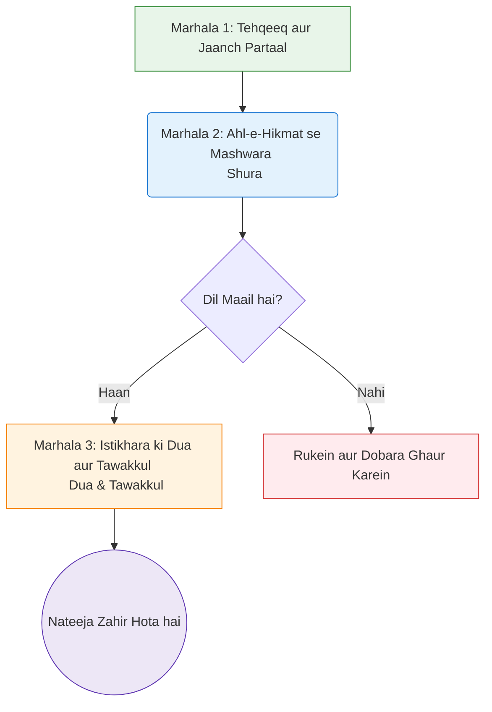
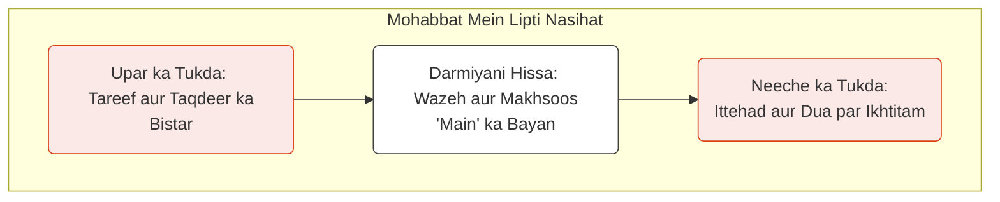
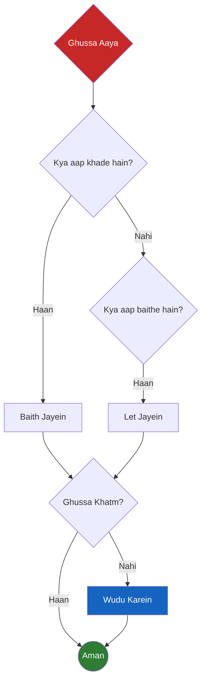
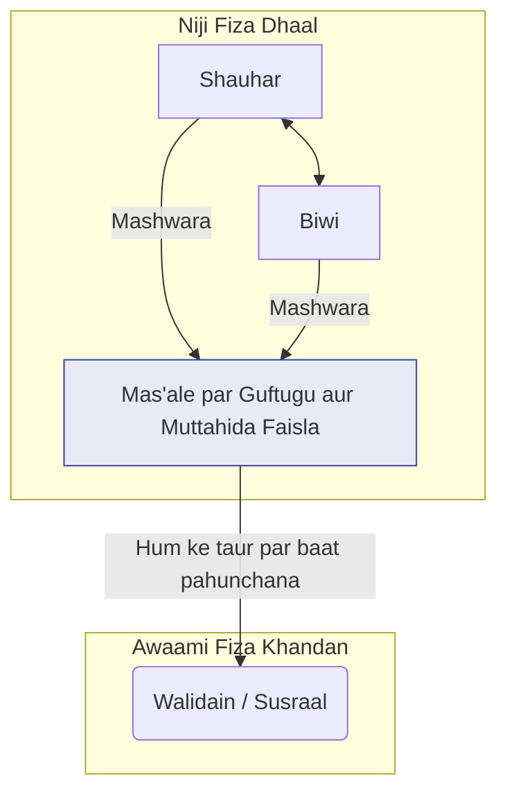
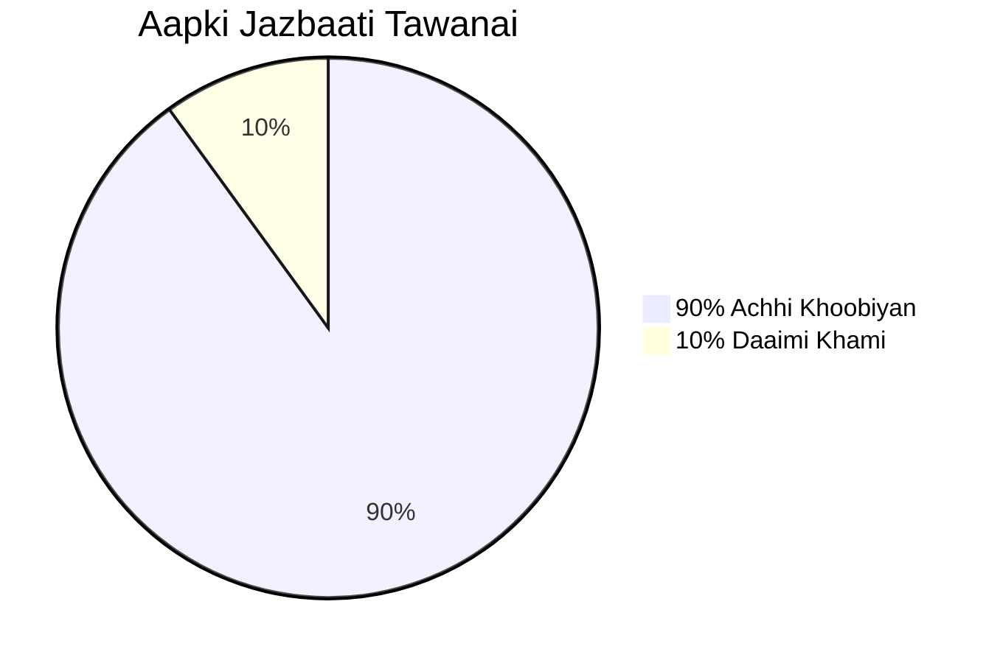

Aapki tasdeeq ka shukriya.

Alhamdulillah, iske saath hi **Marhala 3 (Hatmi Proofreading)** apne ikhtitam ko pahunchta hai. Maine poore nuskhe ko shuru se aakhir tak parkh liya hai aur hamare tay-shuda me'yaar ke mutabiq uski islah aur tarteeb mukammal kar di hai.

Ab hum is project ke aakhri marhale, **Marhala 4: Aapka Hatmi Jaiza**, mein daakhil ho rahe hain.

Pesh-e-khidmat hai **"The Tazkiyah of Marriage"** ka mukammal, nazar-e-saani shuda, aur proofread kiya hua Urdu draft. Yeh nuskha ab aapke aakhri jaize aur hatmi manzoori ke liye tayyar hai.

Main aap se darkhwast karta hoon ke aap ise shuru se aakhir tak ek qaari ki haisiyat se padhein aur is baat ka itminaan kar lein ke yeh aapke 'ilmi vision aur adabi me'yaar par poora utarta hai.

Is muqaddas kaam mein aapki rahnumai aur tanqeedi nigah ne is nuskhe ko is maqaam tak pahunchane mein buniyadi kirdar ada kiya hai. Main aapke hatmi faisle ka muntazir hoon.

---
---
--- START OF FILE Marriage Ur Final.md ---


---
---

# Title Verso Page

**Huqooq-e-Tab'a (Copyright)** © 2025 by Imam Azam Research Centre (IARC), Shaikh Ul Islam Trust

**Jumla Huqooq Mehfooz Hain.** Is isha'at ka koi bhi hissa naashir (publisher) ki peshgi tehreeri ijazat ke baghair, kisi bhi shakal ya zariye se, bashamool photo-copying, recording, ya deegar electronic ya mechanical tareeqon se, dobara shaye, taqseem, ya muntaqil nahi kiya ja sakta, siwaye tanqeedi jaizon (critical reviews) mein mukhtasar ikhtibasaat (brief quotations) aur deegar aise ghair-tijarati istemalaat ke jinki huqooq-e-tab'a ke qanoon mein ijazat hai.

**Naashir (Publisher)** : Imam Azam Research Centre (IARC), Shaikh Ul Islam Trust

**Naashir ka Pata** : First Floor, Besides Quresh Hall, Opposite Paradise Complex, Near Madni Maskan, Mirzapur, Ahmedabad 380001.

**Naashir se Rabta** : 9898xxx012 Akhlak Sufi

**Husoole Kitab ke liye Ma'loomat** : Frokht aur taqseem ki tafseelat ke liye, barah-e-karam upar di gayi tafseelat par naashir se rabta karein.

**Wazahat (Disclaimer)** : Is kitab mein di gayi naseehatein aur usool ek sehat-mand shaadi ke mamooli challenges aur na-mukammaliyon se nimatne ke liye hain. Yeh talluq banane aur ghair-gunahgaar kirdaar ki khamiyon par sabr karne ke liye ek rahnuma hain. Yeh kitab Zulm (jab'r, tashaddud) bardasht karne ke liye rahnuma nahi hai. Agar aap jismani, jazbaati, roohani, ya maali tashaddud ki soorat-e-haal mein hain, to aapka pehla Islami aur akhlaqi farz hifazat talaash karna aur mustanad 'ulama aur peshawar hukkaam se madad lena hai. Zulm par sabr karna koi neki nahi hai.

ISBN 978-1-xxxABCxxx-01-2 (Angrezi)
ISBN 978-1-xxxABCxxx-01-2 (Hindi)
ISBN 978-1-xxxABCxxx-01-2 (Urdu)

**Isha'at-e-Awwal** : October 2025

Bharat mein Tab'a shuda

Qur'ani aayaat ka tarjuma Muhaddith al-Azam ke tarjume Ma'ariful Quran par mabni hai, jismein musannif ne wazahat aur rawani ke liye mamooli tabdeeliyan ki hain. Ahadees ke hawalejaat matlooba majmuon se faraham kiye gaye hain.

---

# Intisaab (Dedication Page)

1.  Behtareen shauharon mein sab se behtar, insano mein sab se zyada reham-dil, tamam insaniyat ke rahnuma, **Huzoor Nabi Kareem ﷺ** ke naam, jinhone humein sikhaya ke Allah ﷻ tak ka raasta seedha hamare gharon ke dil se guzarta hai.
    Aur har us rooh ke naam jo us raaste par chalne ki koshish kar rahi hai, apni shaadi ko Jannat ke ek baagh mein tabdeel karne ki justuju mein hai.
2.  **Al-Wadud**, Sab se Zyada Mohabbat Karne Wale, ke naam se, Jisne dilon ke darmiyan mohabbat ko Apne wujood ki ek nishani banaya.
    Aur har shauhar aur biwi ke liye jo ek doosre ke liye aaina banne ki koshish karte hain, jo na sirf apni khamiyan, balke Imaan ki us roshni ko bhi mun'akis (reflect) karte hain jo un dono ko Usi ki taraf wapas le ja sakti hai.
3.  Meri mehboob shareek-e-hayat ke naam, jo Tazkiyah ke is safar mein mera pehla aaina hain.
    Aur un tamam jodon ke naam jo is kitab ko uthayenge, is dua ke saath ke aap in safhaat mein ek aisa qutub-numa (compass) paayein jo aapke dilon ko ek doosre ki taraf, aur aap dono ke dilon ko Allah ﷻ ki taraf mod de.

---
---

# Taqreez HSI 01

بسم اللہ الرحمٰن الرحیم
نحمده و نصلي و نسلم على رسوله الكريم

Ummat-e-Muslima ka sang-e-buniyaad khandan ka idaara hai. Jab hamare ghar sukoon (sakinah), rehmat (rahmah), aur mohabbat (mawaddah) se ma'moor hote hain, to poori millat parwaan chadhti hai. Magar is pur-fitan daur mein, nikah ke muqaddas idaare ko maaddiyat-parasti, infiradiyat-pasandi, aur ghaflat ki hawadis se aise la-zawaal khatraat lahaq hain jinki misaal nahi milti.

**[Shaikh Ul Islam Syed Madni Miya Ashrafi Jilani]**
[Tareekh aur Maqaam]

---

# Taqreez ASDI 02

بسم اللہ الرحمٰن الرحیم
نحمده و نصلي و نسلم على رسوله الكريم

Meri dua hai ke yeh kitab har Musalman ghar tak pahuche, khaas taur par hamare un naujawan ladkon aur ladkiyon ke haathon mein jo is muqaddas safar ka aaghaz karne wale hain. Yeh ikhlaas par mabni ek 'ilmi kawish aur gehri roohani baseerat ka haamil kaam hai jiski aaj sakht zaroorat hai.

Dua hai ke Allah ﷻ musannif aur naashir ki is nek koshish ko qubool farmaye, ise Ummat ke liye be-panah nafa' ka zariya banaye, aur unhein iska behtareen ajr duniya aur aakhirat mein 'ata farmaye. Aameen.

**Shakir Ali Noori**
Ameer, Sunni Dawate Islami
Mumbai, India


---
---

# ToC

```table-of-contents
title: 
style: nestedList 
minLevel: 0 
maxLevel: 3 
includeLinks: true 
```

---
---

# Tamheed (Prologue)

> [!QUOTE] La Taqnatu (Maayoos na ho)

> [!SUBTITLE] Is se Pehle ke Aap Shuru Karein...
> Ummid par mabni ek Guftugu!

#### [!QUOTE] لَا تَقْنَطُوا (Maayoos na ho)

#### [!SUBTITLE] Is se Pehle ke Aap Shuru Karein...

## Ummid par mabni ek Guftugu

> ...لَا تَقْنَطُوا مِن رَّحْمَةِ اللَّهِ...
> "...Allah ki rehmat se ummid na todo..." <sup>(Qur'an 39:53, Kanz-ul-Iman)</sup>

Mumkin hai aap ne yeh kitab ek bojhal dil ke saath uthaayi ho.

Ya shayad aap ise ek naye safar ke aaghaz par ummid ke saath thame hue hon, ya ek achhi jagah par hote hue, use behtar banane ki koshish mein hon. Aapki haalat jo bhi ho, yeh pehla lafz aap ke liye hai.

Kuch logon ke liye, "Talluq Jorne ka Fun" jaise bab ka unwaan ek door-daraaz, na-mumkin khwab jaisa mehsoos ho sakta hai. Ho sakta hai aap ne apne shareek-e-hayat ke saath is faasle ko kam karne ki itni baar koshish ki ho aur nakaam rahe hon ke ab yeh deewarein mustaqil mehsoos hoti hain. Ho sakta hai aap mehsoos karte hon ke aapki shaadi toot chuki hai, aur ab aap thak gaye hain.

Yeh lafz aap ke liye hai.

Is se pehle ke aap koi ek bhi fun seekhein, is se pehle ke aap kisi ek mas'ale ka tajziya karein, aap ko apne Rabb ke sab se khubsurat naamo mein se ek se dobara muta'arif hona hoga: **الجبار (al-Jabbar)** ﷻ.

Hum aksar is naam ka matlab "Zabardast" ya "Qaabu mein lane wala" sochte hain, aur yeh hai. Lekin iska ek gehra ma'na bhi hai, jo zakhmi dil ke liye marham hai. al-Jabbar ﷻ woh bhi hai "Jo Toote hue ko Jorta aur Bahal karta hai."

Wohi hai jo tooti hui haddiyon ko jorta hai, haan, lekin is se bhi gehra, Woh toote hue halaat, tooti hui ruhon, aur toote hue dilon ko jorta hai. Aapki shaadi, chahe kitni hi shikasta mehsoos kyun na ho, Uski qudrat se bahar nahi hai ke Woh use bahal kar de. Aapka dil, chahe kitna hi zakhmi kyun na ho, Uski is salahiyat se bahar nahi hai ke Woh use shifa de.

Jang-e-Uhud ke tabah-kun ma'rake ke baad Huzoor ﷺ ke sahaba رضي الله عنهم ki haalat ke baare mein sochiye. Woh jismani taur par zakhmi the, jazbaati taur par toot chuke the, apne azeez tareen doston ke gham mein doobe hue the. Kisi bhi duniyawi paimane se, woh shikast-khurda the. Phir bhi agle hi din, Huzoor ﷺ ne unhi shikasta aadmiyon ko uthaya aur dushman ka ta'aqub karne ke liye jama kiya. Unka radde-amal yeh nahi tha ke apni shikast par maayoos ho jayein, balke Allah ﷻ ke mansube par fauri, ummid-bhari tawakkul ke saath dobara uth khade hona tha.

Yeh us dil ke liye Sunnat hai jo ek ma'rake se guzra ho. Aur ek mushkil shaadi dard-naak ma'rakon ke silsile ke siwa kya hai? Sunnat yeh nahi hai ke malbe ke dher par baith kar jo kho gaya hai us par maatam kiya jaye. Sunnat yeh hai ke agle din uthein, al-Jabbar ﷻ ki taraf ruju karein, aur dobara koshish karein.

Agar aapka dil bojhal hai, to iski wajah ek roohani dhund ho sakti hai jise hum **Maayoosi (*Qunut*)** kehte hain. Yeh sirf udaasi nahi hai. Yeh woh khamosh, reengta hua aqeeda hai ke aapki shaadi, aapki soorat-e-haal, ek khaas qism ki tooti hui cheez hai, aisi jo Allah ﷻ ki madad se bhi pare hai. Yeh Shaytan ki taraf se ek khatarnaak sargoshi hai, kyunki yeh al-Jabbar ﷻ, Tooti cheezon ke Jorne Wale ki qudrat par ek hadd lagane ki koshish karti hai.

Yeh dhund aksar hamari maazi ki ghaltiyon ke saayon se aur ghani ho jaati hai. Kya aap ne kabhi khud ko apne bad-tareen lamhaat ko dohrate hue paaya hai? Aap ke apne sakht alfaaz, aap ke ghusse ya ghaflat ke lamhaat? Yeh Shaytan aur aapka apna نفس (nafs) mil kar kaam kar rahe hain, aapke apne zehan mein ek mudda'i (prosecutor) ka kirdar ada kar rahe hain. Woh aapko us shakhs se baandh dena chahte hain jo aap kal the taake aap us shakhs banne ke laiq mehsoos na karein jo aap kal ban sakte hain. Haqeeqat yeh hai ke Allah ﷻ ki rehmat aapki sab se badi ghalti se bhi badi hai. Ek khalis *Taubah* ki taaqat sirf ek surakh mein paiwand nahi lagati; yeh aapko ek nayi shuruaat deti hai. Yeh kitab us shakhs ke liye hai jise aap abhi, is lamhe mein, banne ka intekhab kar rahe hain.

Ho sakta hai ke aap maayoosi se nahi, balke apni maazi ki ghaltiyon ke bojh se peeche reh gaye hon. Aap ke apne sakht alfaaz, aapka apna ghussa, aapki apni ghaflat. Shaytan sargoshi karega ke ab bahut der ho chuki hai, ke nuqsan ho chuka hai, ke aap ek pur-sukoon ghar ke laiq nahi hain.

Yeh bhi ek jhoot hai. Huzoor ﷺ ne humein ek aisi kunji (key) di hai jo maazi ke har band darwaze ko khol deti hai. Aap ﷺ ne farmaya, "Gunaah se tauba karne wala aisa hai jaise us ne koi gunaah kiya hi na ho." <sup>1 Sunan Ibn Majah 4250</sup>

Is farmaan ki taaqat par ghaur karein. Ek sacchi Taubah—nadamat se bhare dil aur badalne ke waade ke saath Allah ﷻ ki taraf lautne ka ek lamha—sirf aapki ghaltiyon par paiwand nahi lagata. Yeh unhein mita deta hai. Yeh aapko ek saaf slate faraham karta hai. Jo shakhs aap kal the, zaroori nahi ke wahi shakhs aap aaj bhi hon. Aap ko abhi, isī waqt, dobara shuru karne ki ilahi ijazat di gayi hai.

Lihaza, jab aap yeh kitab shuru karein, to ek naye dil ke saath karein. Jab aap aage aane wali kahaniyan padhenge, to aap hamare Huzoor ﷺ ke kamil kirdaar se rubaru honge. Shaytan sargoshi karega, "Yeh to auliyah ke liye hai, tumhare liye nahi." Is sargoshi ko radd kar dein. Maqsad raaton-raat takmeeliyat haasil karna nahi hai. Maqsad sahi simt mein ek khalis, na-mukammal qadam uthana hai. Allah ﷻ hamara faisla hamari aakhri manzil se nahi, balke us simt se karte hain jis mein hum chal rahe the.

Is kitab ko ek tooti hui machine ko theek karne ki bechaini se na padhein, balke ek pyaase paudhe ko paani dene ki khamosh ummid ke saath padhein. **الجبار (al-Jabbar ﷻ)**, Tooti cheezon ke Jorne Wale, ki madad se, nayi zindagi hamesha mumkin hai.

---
---

# Ta'aruf (Introduction)

> [!QUOTE] Al-Mu'min Mir'at al-Mu'min (Momin Momin ka Aaina hai)

> [!SUBTITLE] Apni Shadi ko dekhne ka
> ek Naya Zaawiya

#### [!QUOTE] Al-Mu'min Mir'at al-Mu'min (Momin Momin ka Aaina hai)

#### [!SUBTITLE] Apni Shadi ko dekhne ka ek Naya Zaawiya

> الْمُؤْمِنُ مِرْآةُ الْمُؤْمِنِ
> "Momin momin ka aaina hai." **<sup>1 (Sunan Abi Dawud 4918)
</sup>**

Apni ازدواجی kashmakash mein, hum aksar apne shareek-e-hayat se ek aise aalay ki tarah sulook karte hain jise hum remote se control kar sakte hain—hum unke radde-amal ko band karna chahte hain, unke mizaaj ko badalna chahte hain, ya mushkil guftugu ko tezi se aage badhana chahte hain. Lekin remote sirf hamare haath mein kaam karta hai—unke haath mein nahi.

Kitni hi baar hum us shakhs ki manind 'amal karte hain jo aaine mein apna aks dekh kar, apna chehra saaf karne ke bajaye, aaina saaf karne ki koshish karta hai. Hum apni poori tawajjuh doosre shakhs ko durust karne par markooz kar dete hain, is yaqeen ke saath ke agar woh badal gaye, to humein bil-aakhir khushi mil jayegi.

Hamara rawaiyya kabhi kabhi us musafir jaisa hota hai jo raasta bhatakne par GPS par chilla raha ho—awaaz ko, hidayaton ko, ya naqshe ko ilzaam de raha ho—bajaye iske ke gaadi rok kar, dobara aayyar kare, aur yeh dekhe ke kya usne aakhir sahi manzil darj bhi ki thi ya nahi.

Yeh bilkul waisi hi koshish hai jaise koi kaam ke liye ghalat auzaar istemal kar raha ho—jahan ehtiyat-bhare haathon aur sabr ki zaroorat hai, wahan hathoda istemal karne ki koshish kar raha ho. Hum ghalat jagahon par dabao daalte rehte hain, yeh sochte hue ke zyada taaqat us cheez ko theek kar degi jise sirf mohabbat aur samajhdaari theek kar sakti hai.

Hum apne saamne wale shakhs ko "theek" karne ki koshish mein khud ko thaka dete hain, aur nateeja hamesha ek hi hota hai: tanav, ranjish se bhara ek rishta, aur do aise log jo musalsal tanqeed aur ghalat-fehmi ka shikaar mehsoos karte hain.

Aakhir apne shareek-e-hayat ko "theek" karne ka khayal itna lubhavna kyun hota hai? Yeh hamare dil ki kheli hui ek chalaak chaal ki wajah se hai. Hum is duniya mein ek buniyadi roohani mansoobe ke saath aate hain: apni rooh ki paakizgi (*Tazkiyat al-Nafs*). Lekin shaadi mein, hamara نفس (*nafs*) badi chalaki se tawajjuh ka markaz badal deta hai. Yeh humein yaqeen dilata hai ke hamara asal mansooba ab hamara shareek-e-hayat hai.

Yeh ek posheeda **Takabbur (*Kibr*)** se paida hota hai. Yeh woh khamosh, be-socha samjha مفروضہ (assumption) hai ke hum me'yaar hain aur wohi hain jinhein badalne ki zaroorat hai. Hum us shakhs ki tarah ban jaate hain jo aaine se dhabba saaf karne ki koshish kar raha ho, is baat se bilkul bekhabar ke dhabba uske apne chehre par hai. Hum ek aisi rooh ko qaabu karne ki koshish mein khud ko thaka dete hain jise qaabu karna hamare zimme tha hi nahi, jabke woh ek rooh jiski zimmedari hum par hai—hamari apni—gard-aalood hoti rehti hai. Aaine ki yeh tamseel (metaphor) ek ba-barkat, 'aajizi sikhane wali islaah hai. Yeh narmi se hamara rukh hamare apne aks ki taraf modti hai aur humein yaad dilati hai ke asal kaam kahan hai.

Kya ho agar hum ab tak aaine ko ghalat andaaz se dekhte rahe hon?

Kya ho agar shaadi ka maqsad aapke saamne wale shakhs ko theek karna na ho, balke us tasveer ko theek karna ho jo aapko aaine mein nazar aati hai?

Nazar ka yeh ek inqilab, is ek tabdeeli mein hi ek zyada pur-sukoon aur roohani taur par taskeen-bakhsh shaadi ka raaz posheeda hai. Yeh wohi hikmat hai jo hamare Huzoor ﷺ ne humein sikhayi jab unhone farmaya ke momin momin ka aaina hai.

**Yeh hamari kitab ki markazi tamseel hai, aur yeh badi gehri hai. Zara sochiye ke ek aaina haqeeqat mein kaam kaise karta hai.**

*   Ek aaina aapko aapki apni khamiyan dikhata hai, na ke khud aaine ki khamiyan. Jab aap apne chehre par koi dhabba dekhte hain, to aap aaina saaf karne ki koshish nahi karte. Aap apne chehre par tawajjuh dete hain.
*   Ek aaina saccha hota hai magar khamosh. Yeh haqeeqat ko baghair tanqeed, baghair chillaye, baghair tanz ke mun'akis (reflect) karta hai.
*   Aap aaina is liye istemal karte hain taake duniya mein qadam rakhne se pehle apni islaah kar lein.

Aapka shareek-e-hayat aapka aaina hai. Unke af'aal, unke alfaaz, unka wujood aksar aapki apni roohani haalat ko aap par mun'akis karta hai. Unka ghussa shayad aapki apni sakhti ka aks ho. Unki doori shayad aapki apni ghaflat ka aks ho. Unki bechaini shayad aapki apni be-sabri ka aks ho. Iska yeh matlab nahi ke aap unke rawaiyye ke zimmedar hain, lekin iska matlab yeh hai ke woh wahid rawaiyya jis par aapko mukammal ikhtiyar hai, woh aapka apna hai. Ek behtar shaadi ka raasta apne shareek-e-hayat ko badalne se nahi, balke us aks ki islaah se guzarta hai jo aap aaine mein dekhte hain.

---

## Yeh Ek Rishta Itna Ahem Kyun Hai

Is se pehle ke hum yeh seekhein ke ek behtar shaadi *kaise* banayi jaye, humein pehle is baat par ghaur karna chahiye ke yeh ek rishta hamare deen mein itna muqaddas aur azeem-ush-shan maqaam *kyun* rakhta hai. Yeh sirf ek aur duniyawi muaahida (contract) nahi hai; yeh ek kainati ahmiyat ka 'ahd-o-paighaam (covenant) hai, ek aisa roohani maidan jiski ahmiyat is duniya se aakhirat tak ja pahunchti hai.

Ise sahi ma'no mein samajhne ke liye, humein un teen buniyadi haqaiq ko samajhna hoga jo shaadi ko ek samaji intizam se hamari roohani zindagi ke sutoon (pillar) tak buland karte hain.

1.  **Yeh Aapka Aadha Deen Hai.** Huzoor ﷺ ne humein sikhaya ke "Jab koi banda nikah karta hai, to usne apna aadha deen mukammal kar liya."¹ Yeh ek hairaan-kun farmaan hai jo humein ghaur-o-fikr par majboor kar dena chahiye. Iska matlab hai ke shaadi ka rozmarra ka maidan—sabr, shukr, rehmat, aur darguzar ki tamaam aazmaishon ke saath—hamari aadhi roohani nashonuma ke liye buniyadi nisaab (curriculum) hai. Allah ﷻ tak ka raasta koi aisa safar nahi hai jo hum tanhayi mein tay karte hain; hum mein se aksar ke liye, yeh raasta seedha hamare gharon ke dil se guzarta hai.
2.  **Yeh Shaytan ke Khilaf ek Jang Hai.** Huzoor ﷺ ne humein bataya ke Iblees rozana apne lashkar bhejta hai, aur woh shaytan jo sab se ooncha darja haasil karta hai, woh nahi jo kisi ko chori ya sharab par uksata hai, balke woh hai jo ek shauhar aur biwi ko judaa karne mein kamyab ho jata hai.² Woh 'amal jo ek shaytan ko Iblees ke takht ke sab se qareeb le jaata hai, woh ek shaadi ka tootna hai. Yeh ek gehri haqeeqat ko zahir karta hai: aapki pur-sukoon, mohabbat bhari shaadi koi be-jaan haalat nahi hai. Yeh insaniyat ke sab se bade dushman ke khilaf ek fa'aal (active), rozana ki roohani jang hai. Talluq ka har lamha jo aap banate hain, ek fatah hai. Har jhagda jise aap rehmat se hal karte hain, uske liye ek shikast hai.
3.  **Yeh is Duniya aur Aakhirat mein Aapka Ghar Hai.** Shaadi wahid insani bandhan hai jo Jannat ke baghaat mein, Adam aur Hawa عليهم السلام ke saath shuru hua. Yeh woh rishta hai jis mein aap shayad zameen par kisi bhi doosre shakhs se zyada waqt guzarenge. Aur yeh woh wahid rishta hai jiske liye hum dua karte hain ke Jannat mein bhi hamare saath jaari rahe, ek jannat se doosri jannat tak ek musalsal haqeeqat. Yeh insani talluq ka aaghaz bhi hai aur anjaam bhi.

Kyunki yeh 'ahd itna muqaddas hai, Allah ﷻ ne humein ise anjaane mein tay karne ke liye nahi choda hai. Us ﷻ ne humein, Apne Quran aur Apne Rasool ﷺ ke zariye, is safar ke liye ek wazeh naqsha 'ata kiya hai.

---

## Is Kitab ke Safar par Kaise Niklein

Yeh kitab ek amali rahnuma (practical guide), dil ke liye **Amali Hikmaton** ka ek sandooq ke taur par design ki gayi hai. Yeh ek ba-barkat shaadi ke chhay (six) zaroori funoon (arts) ka safar hai. Is se behtareen faida uthane ke liye, hum aapko is tarah safar karne ki sifarish karte hain:

1.  **Ek Khule Dil se Padhein.** Apne shareek-e-hayat mein ghaltiyan talaash karne ke liye na padhein, balke apni nashonuma ke mawaqe' talaash karne ke liye padhein. Har **hikmat** ke saath, pehle khud se poochein: "Main ise kaise istemal kar sakta/sakti hoon?"
2.  **Ek Waqt mein Ek Bab par Tawajjuh Dein.** Sab kuch ek saath लागू (implement) karne ki koshish na karein. Ek ya do hafte ek hi bab ki **hikmaton** par tawajjuh markooz karne mein guzarein. Agle par jaane se pehle ek choti si tabdeeli mein maharat haasil karein.
3.  **Guftugu Karein, Ilzaam na Lagayein.** Agar yeh apne shareek-e-hayat ke saath padh rahe hain, to ise narmi bhari guftugu ki buniyad ke taur par istemal karein. Yeh kehne ke bajaye, "Tumhein ghusse par mabni bab padhne ki zaroorat hai," yeh kehne ki koshish karein, "Mujhe tanaza' (conflict) par mabni bab apne liye bahut madadgaar laga. Kya hum shayad ise ek saath dekh sakte hain?"
4.  **Tasweeri Khakon (Visuals) ka Istemal Karein.** Har bab mein diye gaye diagrams, tables, aur checklists ko buniyadi **hikmaton** ke jald, yaad rehne wale khulason ke taur par design kiya gaya hai. Unhein din ke dauran zehni langar (mental anchors) ke taur par istemal karein.
5.  **Zameeme (Appendix) ka Istemal Karein.** Is kitab ke aakhir mein "Momin ka Toolkit" aapka jald-hawala rahnuma (quick-reference guide) hai. Ise kisi bohran (crisis) ke lamhe mein sahi soorat-e-haal ke liye sahi **hikmat** talaash karne ke liye istemal karein.

Yeh sirf ek mamooli shaadi ki rahnuma kitab nahi hai; yeh *Tazkiyat al-Nafs*—rooh ki paakizgi—ka ek manual hai, jo Jannat mein daakhile ke liye shaadi ke muqaddas idaaray ke zariye haasil hota hai. Aaiye, aaghaz karte hain.

#### [!danger] Ek Ahem Tambeeh (A Critical Disclaimer)

Is kitab mein diye gaye usool sehat-mand rishton ko banane aur shaadi ki mamooli mushkilat se nimatne ke liye hain. Yeh na-mukammal hone par sabr ke liye ek rahnuma hain, zulm par nahi. Agar aap jismani, jazbaati, ya roohani aziyyat (Zulm) ki soorat-e-haal mein hain, to aapka pehla farz hifazat talaash karna aur 'ulama aur mustanad peshawar hukkaam se madad lena hai. Huzoor ﷺ ne humein zulm ko rokne ka hukum diya hai, us par sabr karne ka nahi.

> [!danger] Ek Ahem Tambeeh
> Is kitab mein diye gaye usool sehat-mand rishton ko banane aur shaadi ki mamooli mushkilat se nimatne ke liye hain. Yeh na-mukammal hone par sabr ke liye ek rahnuma hain, zulm par nahi. Agar aap jismani, jazbaati, ya roohani aziyyat (Zulm) ki soorat-e-haal mein hain, to aapka pehla farz hifazat talaash karna aur 'ulama aur mustanad peshawar hukkaam se madad lena hai. Huzoor ﷺ ne humein zulm ko rokne ka hukum diya hai, us par sabr karne ka nahi.

---
---
---

# Bab 1 - Intekhab ka Fun

> [!QUOTE] Al-Kafa'ah fi al-Din
> (Deen mein Barabari aur Liyakat)

> [!SUBTITLE] Main sirf ek fard nahi, ek shareek-e-hayat ka intekhab kaise karun?

#### [!QUOTE] Al-Kafa'ah fi al-Din (Deen mein Barabari aur Liyakat)

#### [!SUBTITLE] Main sirf ek fard nahi, ek shareek-e-hayat ka intekhab kaise karun?

## 1.1 Qissa: Allah ﷻ ke ek Mehboob Bande ki Shaadi

Unka naam Julaybib رضي الله عنه tha.

Madinah زادها الله تكريماً وتشريفاً ke is pur-raunaq sheher mein, jo Huzoor Akram ﷺ aur unke as'hab-e-kiraam ka maskan tha, Julaybib رضي الله عنه ek aise shakhs the jinhein aksar nazar-andaaz kar diya jaata tha. Woh na to apni daulat ke liye mash'hoor the, na hi buland nasab ke liye, aur na hi jaazib-e-nazar shakl-o-soorat ke liye. Duniyawi me'yaron ke mutabiq, unhein ek mamooli, hatta ke "na-qabil-e-izdiwaj" (unmarriageable) samjha jaata tha.

Ek din, Huzoor ﷺ, woh zaat jo logon ke dilon mein sab se gehrai tak jhankne ka fun jaanti thi, Julaybib رضي الله عنه ke paas tashreef laaye aur unse ek saada sa sawaal poocha: "Julaybib, kya tum shaadi nahi karna chahte?"

Julaybib رضي الله عنه ne, shayad ek bojhal dil ke saath, jawab diya, "Ya Rasool Allah ﷺ, mujh se kaun shaadi karega?" Unhein mehsoos hota tha ke unka duniyawi martaba bahut kam hai.

Huzoor ﷺ ne duniyawi martaba nahi dekha. Unhone Julaybib رضي الله عنه ka Allah ﷻ ke yahan martaba dekha. Lihaza, woh Ansar ke ek mumtaz sardar ke ghar tashreef le gaye aur farmaya, "Main tumhari beti ka haath maangne aaya hoon."

Ansari shakhs khushi se phoolay na samaye. Huzoor ﷺ ka damad banna to sab se bada aizaz tha. Unhone josh se jawab diya, "Haan, Ya Rasool Allah ﷺ! Meri aankhon ki kya hi thandak hogi!"

Huzoor ﷺ ne narmi se wazahat farmayi, "Main apne liye nahi maang raha."

Us shakhs ne, uljhan mein, poocha, "To phir kiske liye?"

"Julaybib ke liye," Huzoor ﷺ ne jawab diya.

Woh shakhs saktay mein aa gaya. Usne apni biwi ki taraf dekha aur kaha, "Julaybib رضي الله عنه ke liye? Kya hum apni beti Julaybib ko de dein?" Usne apni biwi se mashwara shuru kiya, jo uski hichkichahat mein shareek thi. Har saqafati aur duniyawi me'yar ke mutabiq, yeh ek munasib rishta nahi tha.

Lekin unki beti, jo ghar ke andar thi aur yeh guftugu sun rahi thi, ek aisi hikmat ki maalik thi jo us lamhe mein apne walidain se badh kar thi. Usne ek aisi haqeeqat ko samajh liya jise woh waqti taur par bhool gaye the. Woh bahar aayin aur unhein mukhatib kiya, unki awaaz imaan ki wazahat se labrez thi:

"Kya aap Rasool Allah ﷺ ki darkhwast ko radd karte hain? Allah ﷻ ki qasam, mujhe unke paas bhej dijiye, kyunki woh mujhe kabhi tabahi mein nahi dalenge."

Unke alfaaz, jo gehre tawakkul se bhare hue the, unki hichkichahat ko cheer gaye. Unhein apni ghalti ka ehsaas hua. Shaadi tay kar di gayi.

Seerat humein batati hai ke yeh rishta, jo duniyawi hasiyat par nahi balke Allah ﷻ ke Rasool ki hikmat par khalis tawakkul ki buniyad par qayam hua, Madinah زادها الله تكريماً وتشريفاً ke sab se ba-barkat rishton mein se ek tha. Kuch hi arse baad, Julaybib رضي الله عنه ek fauji muhim mein shaamil hue. Jang ke baad, Huzoor ﷺ ne apne as'hab se poocha ke dekho kaun laapata hai. Unhone bade logon, mash'hoor jangjuon, aur mumtaz khandan ke beton ke naam liye.

Huzoor ﷺ ne suna, aur phir apni awaaz mein mohabbat bhar kar farmaya, "Lekin main apne Julaybib رضي الله عنه ko laapata pa raha hoon."

Unhone unhein maidan-e-jang mein paaya, unhone bahaduri se ladte hue, apne gird saat dushmanon ko qatl karne ke baad shahadat paayi thi. Huzoor ﷺ unke paas tashreef le gaye, aapka chehra-e-mubarak gham aur fakhr se labrez tha. Unhone Julaybib رضي الله عنه ka sar apne dast-e-mubarak mein liya aur farmaya, "Yeh mujh se hai, aur main is se hoon." Aapne yeh do martaba farmaya. Phir, tamam insaniyat ke sardar ne, is kabhi nazar-andaaz kiye gaye shakhs ke liye qabr apne dast-e-mubarak se khodi.

Julaybib رضي الله عنه ka qissa hamare pehle bab ka qissa hai. Yeh ek aisi kahani hai jo is duniya ke kamzor aainon ko tod deti hai aur humein imaan ke abadi (eternal) aaine mein dekhne ko kehti hai. Yeh sab se ahem sawaal poochti hai: **Jab aap ek shareek-e-hayat ka intekhab karte hain, to aap kiske me'yaron se naap tol kar rahe hain?**

---

## 1.2 Mas'ala: Jadeed Daur ki Bhool Bhulaiyan

Agar aap aaj ek shareek-e-hayat ki talaash mein hain, to ho sakta hai aap khud ko gumshuda mehsoos karein. Yeh ek muqaddas safar se zyada ek uljhi hui, shor-bhari bhool bhulaiyon mein bhatakne jaisa lag sakta hai. Aapka dil shayad darjanon mukhtalif simton mein un pareshaniyon se khincha ja raha ho jo bahut haqeeqi mehsoos hoti hain:

*   "Meri poori tawajjuh unki shakl-o-soorat, unke career, unke social media par hai... kya main bahut satah-been (superficial) ho raha/rahi hoon?"
*   "Main ek aisi ghalti karne se khaufzada hoon jo meri zindagi barbad kar degi."
*   "Mere walidain mujh par hamari saqafat ya biradari mein se kisi se shaadi karne ke liye dabao daal rahe hain, lekin mujhe koi rabt mehsoos nahi hota."
*   "Main shaadi ki apps se pareshan ho gaya/gayi hoon. Aisa lagta hai jaise main ek insaan ki khareedari kar raha/rahi hoon, aur main koi faisla nahi kar pa raha/rahi."
*   "Main shaadi karna chahta/chahti hoon, lekin mujhe lagta hai ke main maali taur par 'tayyar' nahi hoon. Mujhe darr hai ke main iska kharch nahi utha sakta/sakti."

Yeh jadeed duniya ki sargoshiyan hain, aur yeh hamare deen ki wazeh, pur-etimad rahnumai ko daba sakti hain. Yeh bab us shor ko kam karne aur us saaf, saada, aur ba-barkat raaste par tawajjuh markooz karne ke baare mein hai jo Huzoor ﷺ ne hamare liye banaya hai.

---

## 1.3 Usool: Nabawi Formula

Jab ek shareek-e-hayat chunne ki baat aati hai, to Islam humein andhere mein nahi chodta. Yeh humein ek kamyab aur ba-barkat rishte ke liye ek wazeh, ilahi formula faraham karta hai. Huzoor Akram ﷺ ne humein buniyadi usool 'ata farmaya, woh usool jo is safar ke har faisle ki buniyad hona chahiye:

> عَنْ أَبِي هُرَيْرَةَ ـ رضى الله عنه ـ عَنِ النَّبِيِّ صلى الله عليه وسلم قَالَ ‏ "‏ **تُنْكَحُ الْمَرْأَةُ لأَرْبَعٍ لِمَالِهَا وَلِحَسَبِهَا وَجَمَالِهَا وَلِدِينِهَا، فَاظْفَرْ بِذَاتِ الدِّينِ تَرِبَتْ يَدَاكَ** ‏"
> "Aurat se chaar cheezon ki wajah se nikah kiya jaata hai: uske maal ki wajah se, uske khandan (nasab) ki wajah se, uske husn ki wajah se, aur uski deen-daari ki wajah se. Pas, tum deen-daari wali ko chuno, tum kamyab ho."<sup> 1 (Sahih al-Bukhari 5090)</sup>

Yeh Hadees master key hai. Yeh un cheezon ko tasleem karti hai jinhein duniya ahmiyat deti hai—daulat, hasb-o-nasab, husn—lekin yeh humein, sab se zyada zor dekar, us ek cheez ko tarjeeh dene ka hukum deti hai jo hamesha rehti hai: ek shakhs ka Allah ﷻ ke saath talluq. Iska yeh matlab nahi ke doosri khoobiyon ki koi jagah nahi, lekin woh sirf madadgaar kirdar hain. Deen aur Akhlaq (achha kirdaar) ko markazi kirdar hona chahiye.

### Roohani Tashkhees

Aaiye, imaandari se baat karein. Jab hum ek shareek-e-hayat ki talaash mein hote hain, to duniya hum par ghalat cheezon ko dekhne ke liye cheekhti hai. Maal, husn, ya hasiyat ki taraf yeh zabardast kashish ek dil ki bimari ki alamat hai: **Hubb al-Dunya (Duniya ki Mohabbat)**. Yeh tab hota hai jab hamara dil un cheezon se zyada pur-josh hota hai jo logon ko mutasir karti hain, bajaye un cheezon ke jo Allah ﷻ ko khush karti hain. Yeh poochta hai, "Mera khandan kya kahega?" is se pehle ke yeh pooche, "Kya yeh shakhs mere saath namaz padhega?" Yeh ek qism ki roohani kam-nazri hai, jahan hum Aakhirat ke thos sone ka sauda is duniya ke chamakte hue plastic se kar lete hain.
Yeh humein kamzor roohani sarmayakar (investors) bana deta hai. Aap apni zindagi ke sab se ahem safar ke liye ek saathi chun rahe hain, aur aapka dil packaging se bhatak raha hai. Nabawi Formula koi pabandi nahi hai; yeh ek mohabbat bhari hifazat hai. Yeh ek filter hai jo aapko aapki apni kamzoriyon se bachane ke liye design kiya gaya hai, jo aapko majboor karta hai ke aap aarzi (temporary) cheezon se aage dekhein aur apne poore mustaqbil ko us ek cheez par qayam karein jo waqai hamesha rehti hai: ek shakhs ka Allah ke saath talluq.

Is baat ko Allah ﷻ ke Quran mein diye gaye waade se mazeed taqwiyat milti hai, jo hamari tawajjuh ek kamil shakhs talaash karne se hata kar, khud ek sahi shakhs *banne* par markooz kar deta hai:

> ...وَالطَّيِّبَاتُ لِلطَّيِّبِينَ وَالطَّيِّبُونَ لِلطَّيِّبَاتِ…
"...Aur suthri aurtein suthre mardon ke liye aur suthre mard suthri aurton ke liye..."<sup>² (Quran 24:26, Kanz-ul-Iman)</sup>

Lihaza, ek shareek-e-hayat chunne ka safar, khud par kaam karne ka intekhab karne se shuru hota hai.

---

## 1.4 Amali Hikmatein: Roohani Jaanch Partaal

Hum in usoolon ko amali taur par kaise istemal kar sakte hain? Yahan aapki talaash mein rahnumai ke liye teen amali hikmatein hain.

### [!tool] Hikmat 1: Niyyat ka Muhasaba

> [!tool] Hikmat 1: Niyyat ka Muhasaba

Talaash shuru karne se pehle hi, aapko apni niyyat ko saaf karna hoga. Aapki *Niyyat* woh buniyad hai jis par aapki poori shaadi ta'meer hogi. Ek kamzor buniyad wali imarat hamesha ghair-mustahkam rahegi. Apne dil ki khamoshi mein khud se yeh sawalat poochein:

*   **Main shaadi kyun karna chahta/chahti hoon?** Kya is liye ke main apna aadha deen mukammal karun aur Allah ﷻ ko raazi karun? Ya is liye ke khandan aur muashre ka dabao hai?
*   **Main kise mutasir karne ki koshish kar raha/rahi hoon?** Kya main ek aisa saathi talaash kar raha/rahi hoon jo mere doston aur biradari ko mutasir kare, ya woh jo mujhe Jannat tak pahunchne mein madad de?
*   **Mera aakhri maqsad kya hai?** Kya ek khubsurat shaadi, ya ek ba-barkat ازدواجی zindagi? Kya is duniya mein aaram ki zindagi, ya ek ba-maqsad zindagi jo agli duniya tak le jaye?

Apne aap se bilkul imaandar rahein. Ek khalis niyyat Allah ﷻ ki rahnumai haasil karne ka pehla qadam hai.

### [!tool] Hikmat 2: Kirdaar ki Kasauti

> [!tool] Hikmat 2: Kirdaar ki Kasauti

Huzoor ﷺ ne humein sikhaya ke satah-been (superficial) zahiri cheezon se aage dekhein. Azeem sahabi Umar رضي الله عنه ne tambeeh farmayi, "Kisi shakhs ki namazon se dhoka na khao... balke, muaamlaat mein uske kirdaar ko dekho." Hum yeh kaise karein? Teen ahem rishton ki tehqeeq karke:

1.  **Unka Allah ﷻ ke Saath Rishta:** Kya woh apni paanch waqt ki namazein padhte hain? Yeh unki deen-daari ka sab se ahem ishara hai. Yeh woh buniyad hai jis par baaqi tamam achha kirdaar ta'meer hota hai.
2.  **Unka Apne Walidain ke Saath Rishta:** Woh apni maa aur baap se kaise baat karte hain, khaas taur par jab woh pareshan hon ya ikhtilaf karein? Huzoor ﷺ ne farmaya, "Tum mein se behtareen woh hai jo apne ghar walon ke liye behtareen hai." Ek shakhs jo apne parwarish karne wale walidain ke saath meharbani aur sabr ka muzahira nahi kar sakta, woh jadooi taur par ek shareek-e-hayat ke saath yeh karna nahi seekh lega.
3.  **Unka Maal aur Amanat ke Saath Rishta:** Kya woh apne muaamlaat mein imaandar hain? Kya woh qabil-e-aitimad (trustworthy) maane jaate hain? Huzoor Musa علیہ السلام ko ek daana baap ne apni beti ke liye is liye chuna tha kyunki unhein "taaqatwar aur ameen" (Qawiyyun Amin) dekha gaya tha. Yeh kirdaar ke liye ek Qurani me'yar hai.

### [!tool] Hikmat 3: Istikhara ka Amal

> [!tool] Hikmat 3: Istikhara ka Amal

Bahut se log Istikhara (Allah ﷻ se rahnumai talab karna) ko ghalat samajhte hain, ke yeh ek aisi dua hai jo aap ek khwab dekhne ya koi jadooi ishara paane ke liye karte hain. Asal Sunnat ek zyada mukammal aur haqeeqat-pasandana amal hai. Iske teen zaroori marhale hain:

1.  **Apni Tehqeeq Karein:** Aapko pehle us 'aql ko istemal karna chahiye jo Allah ﷻ ne aapko di hai. Upar di gayi kasauti ka istemal karke us shakhs ke kirdaar ki tehqeeq karein. Sawalat poochein. Unke doston aur khandan se baat karein. Apni poori jaanch partaal (due diligence) karein.
2.  **Ahl-e-Hikmat se Mashwara Karein (Shura):** Apne walidain, kisi qabil-e-aitimad ustaad, ya kisi muqami Imam se mashwara karein. Wali (sarparast) koi dictator nahi, balke ek muhafiz hai jise Islam ne is liye muqarrar kiya hai ke woh apni hikmat aur tajurbe ka istemal karke aapko jazbaati faislon se bachaye.
3.  **Dua Karein aur Tawakkul Karein (Dua & Tawakkul):** Jab aap apni tehqeeq aur mashwara mukammal kar lein, aur aapka dil us shakhs ki taraf mail ho, tab aap Istikhara ki do rak'at namaz ada karein. Aap maamle ko Allah ﷻ ke supurd kar dein aur Us se dua karein ke agar yeh aapke liye behtar hai to ise aasan kar de, aur agar nahi hai to ise pher de.

Iske baad, aap Allah ﷻ par tawakkul karein. Agar maamlaat aasani se aage badhte hain, to yeh ek achha ishara hai. Agar rukawatein paida hoti hain aur maamlaat bigad jaate hain, to woh bhi ek achha ishara hai—yeh Allah ﷻ ki taraf se aapki hifazat hai.



Lekin, kisi bhi roohani 'amal ki tarah, hamari tawaqquat kabhi kabhi humein gumrah kar sakti hain.

#### Anari-pan se Sh'oor tak: Ek Haqeeqat-pasandana Jaiza

Hum mein se bahut se log Istikhara ke saath "jadooi ishare" ke jaal mein phans jaate hain. Hum dua karte hain, phir peeche baith kar ek wazeh khwab, ek mutlaq yaqeen ke ehsaas, ya aasman se kisi aur zabardast ishare ka intezar karte hain. Jab kuch "jadooi" nahi hota, to hum maflooj, uljhan-zada, aur be-ta'alluq mehsoos kar sakte hain. Yeh ek roohani jaal hai jo us 'aql aur koshish ko nazar-andaaz karta hai jise istemal karne ka Allah ﷻ ne humein hukum diya hai.

Haqeeqat yeh hai ke Istikhara aapki apni tehqeeq aur mashware ka mutabadil (substitute) nahi hai; yeh aakhri qadam hai jo use muqaddas banata hai. Yeh aap hain, apna saara homework karne ke baad, Allah ﷻ ki taraf ruju karte hue aur kehte hue, "Ya Allah ﷻ, Aapne jo 'aql mujhe di hai, maine use apni behtareen salahiyat ke mutabiq istemal kiya hai. Ab main nateeje ko Aapki la-mehdood hikmat ke supurd karta/karti hoon." Aapke Istikhara ka "jawab" aam taur par koi khwab nahi hota; yeh woh haqeeqat hoti hai jo saamne aati hai. Agar maamlaat aasani (taysir) se aage badhte hain, to yahi aapka ishara hai. Agar na-qabil-e-tasawwur rukawatein paida hoti hain aur raasta band ho jaata hai, to woh bhi aapka ishara hai—Allah ﷻ ki hifazat ka ishara. Us amal par bharosa karein jo Woh saamne laata hai, na ke us jadoo par jiski aap tawaqqo karte hain.

---

## 1.5 Buzurgan-e-Deen ki Hikmat

"Apni beti ka nikah ek *Taqwa* (parhezgari) wale shakhs se karo, kyunki agar woh us se mohabbat karega, to uski izzat karega, aur agar woh use napasand karega, to us par zulm nahi karega."
— Al-Hasan al-Basri رضي الله عنه

"Achhe kirdaar ke das hisson mein se nau hisse doosron ki ghaltiyon ko nazar-andaaz karna hai."
— Imam Ahmad ibn Hanbal رضي الله عنه

---

## 1.6 Is Bab ki Dua

Ek shareek-e-hayat ki talaash karte hue aur ek neik khandan ki ummid rakhte hue, is se behtar koi Dua nahi hai jo Rehmaan ke bande Quran mein karte hain:

> رَبَّنَا هَبْ لَنَا مِنْ أَزْوَاجِنَا وَذُرِّيَّاتِنَا قُرَّةَ أَعيُنٍ وَاجْعَلْنَا لِلْمُتَّقِينَ إِمَامًا
> "Aye hamare Rabb, humein hamari biwiyon aur hamari aulad se aankhon ki thandak de aur humein parhezgaron ka peshwa bana." <sup>3 (Quran 25:74, Kanz-ul-Iman)</sup>

---

## 1.7 Khutbe ke Laaiq Nikaat / Sabaq ka Markazi Khayal / Taalib-e-Ilm ki Diary ke liye

*   Duniya aapse poochegi, "Woh dikhte kaise hain?" Allah ﷻ aapse poochenge, "Unka dil kaisa hai?" Duniya poochegi, "Unki hasiyat kya hai?" Allah ﷻ poochenge, "Mere yahan unka maqaam kya hai?" Us sawaal ko chuniye jo abadiyat (eternity) ke liye maayne rakhta hai.
*   Aap apni zindagi ke liye ek saathi nahi chun rahe hain. Aap apne bachon ke doosre walid/walida aur Jannat mein apne padosi ko chun rahe hain. Ek intekhab saath (60) saal ke liye hai; doosra saath (60) million aur us se aage ke liye hai. Aakhirat ka tarazu apne haath mein lekar chuniye.
*   Ek kamil shakhs ki talaash na karein, kyunki aap kamil nahi hain. Balke, ek aise shakhs ki talaash karein jiska Allah ﷻ se 'ahd mazboot ho, kyunki aapse unka 'ahd usi se paida hoga. Us se shaadi karein jiski Allah se mohabbat aapki apni mohabbat ko josh dilaye, aur aapne goya Jannat ke ek darwaze se hi shaadi kar li.

---

#### Bab 1 ke Hawashi (Footnotes)

¹ Sahih al-Bukhari 5090
² Quran 24:26
³ Quran 25:74

---
---
---

# Bab 2 - Talluq Jorne ka Fun

#### [!QUOTE] Mawaddah wa Rahmah (Mohabbat aur Meharbani)

#### [!SUBTITLE] "Hum ek hi kamre mein rehne walon jaisa mehsoos karne ke bajaye, rooh ke saathi jaisa mehsoos karna kaise shuru karein?"

> [!QUOTE] Mawaddah wa Rahmah (Mohabbat aur Meharbani)

> [!SUBTITLE] "Hum ek hi kamre mein rehne walon jaisa mehsoos karne ke bajaye, rooh ke saathi jaisa mehsoos karna kaise shuru karein?"

## 2.1 Qissa: Rasool-e-Akram ﷺ ki Daud

Manzar ka tasawwur kijiye. Arab ke sehra ka suraj dhalna shuru hota hai, zameen par lambe saaye daalta hua. Huzoor Akram ﷺ ke as'hab رضي الله عنهم ka ek giroh ek saath safar kar raha hai, unki guftugu aur unke oonton ke narm qadmon ki awaaz fiza mein goonj rahi hai. Unke darmiyan khud Huzoor ﷺ aur unki nau-umr zauja, Aisha رضي الله عنها, bhi hain.

Ek shaadi ki zarooraton ko samajhne ki gehri baseerat ke ek lamhe mein, Huzoor ﷺ apne as'hab ki taraf murte hain aur unhein aage jaane ko kehte hain, apni zindagi ki awaami zimmedariyon ke darmiyan apne aur apni zauja ke liye ek niji (private) aur qurbat (intimacy) ki fiza banate hue.

Jab woh tanha ho jaate hain, to woh koi bhaari-bharkam lecture ya sanjeeda guftugu shuru nahi karte. Woh Aisha رضي الله عنها ki taraf murte hain, unki aankhein ek shokh roshni se labrez, aur kehte hain, "Aao, daud lagate hain."

Us khuli wus'at mein, Rasool Allah ﷺ aur unki zauja ne daud lagayi. Aisha رضي الله عنها, nau-umr aur phurteeli hone ki wajah se, unse aage nikal gayin. Unhone is lamhe ko ek khushgawar yaad ke taur par yaad kiya, yeh batate hue ke woh bas muskura diye aur us lamhe ko waise hi rehne diya.

Saal guzar gaye. Zindagi apne saath apni zimmedariyan aur khushiyan le aayi. Aisha رضي الله عنها ek nau-umr dulhan se ek daana aur 'aalima umm-ul-momineen ban chuki theen. Jaisa ke unhone khud farmaya, unka "kuch wazan badh gaya tha." Ek baar phir, unhone khud ko ek safar par paaya. Aur ek baar phir, maazi ki ek khubsurat goonj mein, Huzoor ﷺ ne apne as'hab se aage badhne ko kaha.

Aap ﷺ apni zauja ki taraf mude, wahi shokh roshni unki aankhon mein, aur unhein dobara muqable ke liye lalkara: "Aao, daud lagate hain."

Unhone dobara daud lagayi. Is baar, woh zyada tez the. Unhone apni fatah par shekhi nahi baghari. Woh bas muskuraye, unhein mohabbat se dekha, aur woh alfaaz kahe jo sadiyon se ازدواجی talluq ke sabaq ke taur par goonjte rahe hain: "Yeh us (daud) ke badle mein hai."

Yeh khubsurat qissa sirf ek dilchasp waqia nahi hai. Yeh talluq jorne ke fun mein ek masterclass hai. Yeh humein sikhata hai ke ek ba-barkat shaadi koi khushk, rasmi muaahida nahi, balke ek zinda dosti hai, jo mushtareka khushi aur mazaah se bhari ho. Huzoor ﷺ humein sikha rahe hain ke zindagi ki sab se sanjeeda zimmedariyon ke darmiyan bhi, humein jaan boojh kar halkay-phulkay lamhaat nikalne chahiye, kyunki inhi lamhaat mein dil ke sab se gehre bandhan bante hain.

---

## 2.2 Mas'ala: "Woh Pehli si Kashish Nahi Rahi"

Bahut se jodon ke liye, Huzoor ﷺ ki daud ka qissa ek door-daraaz khwab jaisa lag sakta hai. Shaadi ki ibtidai kashish (spark) dheere-dheere, lagbhag na-mehsoos tareeqe se, rozmarra ki zindagi ke bojh tale madham pad jaati hai. Talluq ke shokh rang ek pheeke, be-jaan surmayi (grey) rang mein badal jaate hain. Kya in mein se kuch bhi jaana pehchana lagta hai?

*   "Hum ek hi chhat ke neeche do ajnabi zindagiyan guzar rahe hain. Hum rooh ke saathi se zyada roommates mehsoos karte hain."
*   "Main har din jo kuch karti/karta hoon, uske liye khud ko nazar-andaaz kiya hua aur be-qadr mehsoos karti/karta hoon."
*   "Mera shareek-e-hayat hamesha apne phone par laga rehta hai. Mujhe lagta hai ke main ab unki tarjeeh (priority) nahi raha/rahi."
*   "Humne woh shokhi kho di hai jo kabhi hum mein thi. Shaadi bahut bojhal aur sanjeeda mehsoos hoti hai."

Yeh us ghar ka khamosh almiya (tragedy) hai jahan do log ek chhat to baant'te hain lekin ab ek dil nahi baant'te; jahan guftugu mansooba-bandi (logistics) ke baare mein hoti hai, khwabon ke baare mein nahi; jahan khamoshi ab pur-sukoon nahi, balke na-kahi doori se bojhal hoti hai.
Agar yeh ehsaasat aapke dil mein goonjte hain, to jaan lein ke aap akele nahi hain, aur aapki soorat-e-haal na-ummid nahi hai. Yeh us shaadi ki aam alamatein hain jo talluq ki bhooki hai. Hamara deen, apni la-mehdood hikmat mein, sirf mas'ale ki tashkhees nahi karta; woh humein ilaaj bhi 'ata karta hai.

---

## 2.3 Usool: Mohabbat ek Amal ke Taur par

Allah ﷻ, apni la-mehdood hikmat mein, humein ازدواجی bandhan ka asal maqsad ek hi, khubsurat aayat mein bata dete hain. Yeh sirf tilawat ki jaane wali aayat nahi hai; yeh aapke rishte ka mission statement hai.

> وَمِنْ آيَاتِهِ أَنْ خَلَقَ لَكُم مِّنْ أَنفُسِكُمْ أَزْوَاجًا لِّتَسْكُنُوا إِلَيْهَا وَجَعَلَ بَيْنَكُم مَّوَدَّةً وَرَحْمَةً ۚ إِنَّ فِي ذَٰلِكَ لَآيَاتٍ لِّقَوْمٍ يَتَفَكَّرُونَ
> "Aur uski nishaniyon se hai ke tumhare liye tumhi mein se jode banaye ke unse aaraam pao aur tumhare darmiyan mohabbat aur meharbani rakhi, beshak is mein nishaniyan hain dhiyan karne walon ke liye." <sup>1 (Quran 30:21, Kanz-ul-Iman)</sup>

Maqsad **Sakinah** hai—dil aur ghar ka ek gehra, paayedaar sukoon. Yeh aman, tahaffuz, aur apnaiyat ki haalat hai. Allah ﷻ humein batata hai ke Usne is Sakinah ko paida karne ke liye miyan-biwi ke darmiyan do ajza rakhe hain: **Rahmah (meharbani)**, jo tanaza' (conflict) se nimatne ki kunji hai, aur **Mawaddah**.

Mawaddah talluq ki kunji hai. Iska tarjuma aksar 'mohabbat' kiya jaata hai, lekin yeh us ghair-fa'aal (passive), rumani ehsaas se kahin zyada fa'aal (active) aur amali tasawwur hai jo lafz 'mohabbat' se aksar muraad liya jaata hai. Mawaddah ki asal (root) ek aisi mohabbat ki taraf ishara karti hai jiska izhaar kiya jaye, jise dikhaya jaye, aur jise jaan boojh kar, musalsal 'amal ke zariye zahir kiya jaye. Yeh ek aisi mohabbat hai jo aap karte hain, na ke sirf mehsoos karte hain.

### Roohani Tashkhees

Ek shaadi apni kashish kaise kho deti hai aur surmayi rang mein kaise dhal jaati hai? Yeh do khamosh zehron ke zariye hota hai. Pehla hai **Ghaflah (Heedlessness)**. Yeh woh roohani dhund hai jo tab chaa jaati hai jab ek ne'mat mamooli ban jaati hai. Yaad hai jab aapka shareek-e-hayat aapki duaon ka jawab tha? Ghaflah usi qubool hui dua ko sirf furniture ka ek hissa bana deti hai. Unki meharbani ek tawaqqo ban jaati hai. Unka wujood ek mamooli baat ban jaata hai. Hum bas us tohfe ko dekhna band kar dete hain jo hamare saamne hai.

Doosra zehar hai **Bukhl (Rooh ka Kanjus-pan)**. Hum aam taur par ise paise ke maamle mein kanjusi sochte hain. Lekin iski zyada khatarnaak shakal dil ki kanjusi hai. Yeh tab hota hai jab hum ek tareef ka lafz nigal jaate hain. Yeh tab hota hai jab hum ek muskurahat rok lete hain kyunki hum thake hue hain. Yeh tab hota hai jab hum unhein mushkil mein dekhte hain aur sochte hain, "Yeh unka mas'ala hai." Is bab ki amali hikmatein is roohani sardi ke khilaf ek baghawat hain. Yeh chote, sooche samjhe af'aal hain jo hamare dilon ko dobara dekhne par, aur hamari ruhon ko dobara fiyazi (generosity) par majboor karne ke liye design kiye gaye hain.

Allah ﷻ humein is fa'aal, hifazati mohabbat ke liye ek aur gehri tamseel 'ata karta hai:

> ...هُنَّ لِبَاسٌ لَّكُمْ وَأَنتُمْ لِبَاسٌ لَّهُنَّ...
"...Woh tumhari poshaak hain aur tum unki poshaak..." <sup>2 (Quran 2:187, Kanz-ul-Iman)</sup>

Libaas aaraam faraham karta hai, mausam ki sakhti se bachata hai, aur yeh hamari khamiyon ko chupata hai jabke hamari zahiri shakl ko khubsurat banata hai. Mawaddah 'amal mein aisi hi dikhti hai. Humse tawaqqo ki jaati hai ke hum ek doosre ke liye aaraam, hifazat, aur khubsurti ka zariya banein, ek doosre ki ghaltiyon par parda daalte hue aur ek doosre ki behtareen khoobiyon ko ubharte hue.

## 2.4 Amali Hikmatein: Mohabbat ke Baagh ko Rozana Paani Dena

Ek mohabbat bhara talluq ek baagh ki tarah hai; use phalne phoolne ke liye rozana paani dene ki zaroorat hoti hai. Hamare Huzoor ﷺ ki Sunnat humein is baagh ko har roz paani dene ki amali hikmatein faraham karti hai.

### [!tool] Hikmat 1: Mohabbat ke Paanch Sadqay

> [!tool] Hikmat 1:
> Mohabbat ke Paanch Sadqay

Huzoor ﷺ ne sikhaya ke chote se chote musbat (positive) a'maal bhi sadaqah ki ek shakal hain. Ek shaadi tab parwan chadhti hai jab yeh sadaqah apne shareek-e-hayat ki taraf kiya jaye, jis se musbat tawanai ka ek musalsal bahao paida hota hai. Sunnat humein isko haasil karne ke zaraye faraham karti hai. Yeh maqsad banayein ke aap apne shareek-e-hayat ko har roz **mohabbat ke yeh paanch sadqay** dein:

1.  **Ek Muskurahat:** Huzoor ﷺ ne farmaya, "Apne bhai ke chehre par muskurana ek sadaqah hai."³ <sup>Jamiat-Tirmidhi 1956</sup> Apne shareek-e-hayat ko is saada, taaqatwar sadaqah ko paane wala pehla shakhs banayein. Yeh ek ghair-lafzi ishara hai jo kehta hai, "Main aapko dekh kar khush hoon. Aap mere liye khushi ka zariya hain."
2.  **Ek Makhsoos, Khalis Tareef:** Apne shareek-e-hayat mein achhai ko fa'aal taur par talaash karein aur use awaaz dein. Ghair-wazeh tareef achhi hai, lekin makhsoos tareef taaqatwar hai.
    *   "Aap deen-daar hain" ke bajaye,
        Yeh kehne ki koshish karein: "Main waqai mutasir hoon ke aap haal hi mein apni namazon, khaas taur par Fajr, mein kitne paband rahe hain. Yeh mujhe bhi behtar hone ki targheeb deta hai."
    *   "Aap hamesha mere liye maujood rehte hain" ke bajaye,
        Yeh kehne ki koshish karein: "Jazak'Allah Khair, jis tarah aap ne kal raat meri baat baghair toke suni, us se mujhe waqai mehsoos hua ke meri baat suni gayi. Is ne mujhe itna pur-sukoon kiya jitna shayad aapko andaza bhi nahi."
    *   "Aap ek achhi maa hain" ke bajaye,
        Yeh kehne ki koshish karein: "Jazak'Allah Khair, maine dekha ke aap ne aaj us bachay ke ghusse ke dauray (tantrum) ko kitne sabr se sambhala; main waqai mutasir hua."
3.  **Ek Narm, Ghair-mutalabaati Lams (Touch):** Huzoor ﷺ namaz ke liye jaane se pehle apni zauja ko bosa dete the.⁴ <sup>Sunan Abi Dawud 179</sup> Ek saada, ghair-jinsi lams—kandhe par haath rakhna, kuch lamho ke liye haath thaamna—aapke bandhan aur jismani qurbat ko baghair kisi mazeed tawaqqo ke mazboot karta hai.
4.  **Ek Wazeh "Shukriya":** Huzoor ﷺ ne sikhaya, "Jo logon ka shukriya ada nahi karta, usne Allah ﷻ ka shukriya ada nahi kiya."⁵ <sup>Sunan Abi Dawud 4811</sup> Apne shareek-e-hayat ke rozana ke khidmat ke kaamon ko nazar-andaaz na hone dein. Unki koshish ko wazeh taur par tasleem karna na-qadri ke zehar ka ek taaqatwar ilaaj hai.
5.  **Chota, Socha Samjha Ishara:** Yeh mehnge tohfon ke baare mein nahi hai. Yeh is baat ka izhaar karne ke baare mein hai ke aapka shareek-e-hayat aapke zehan mein hai. Yeh unke liye baghair kahe chai ka cup lana hai, ya ek aisa kaam karna hai jise aap jaante hain ke woh napasand karte hain. Yeh chote a'maal aapki shaadi ke "jazbaati bank account" mein jama hote hain.

### [!tool] Hikmat 2: Sunnat-e-Tawajjuh

> [!tool] Hikmat 2:
> Sunnat-e-Tawajjuh

Tawajjuh bhatakne ke hamare is daur mein, kisi ko apni ghair-munqasim (undivided) tawajjuh dena sab se nayaab aur qeemti tohfon mein se ek ban gaya hai. Huzoor ﷺ is fun ke maahir the. Woh sirf logon ko sunte nahi the; woh unki baat ghaur se sunte the. Jab Aisha رضي الله عنها ne unhein **Umm Zar' ki intehai lambi aur tafseeli kahani** sunayi, to unhone na to baat kaati aur na hi nazar pheri. Unhone unhein apni poori maujoodgi ka tohfa diya.⁶ <sup>Sahih al-Bukhari 5189</sup>

Is gumshuda fun ki mashq kaise karein:

*   **"Phone Neeche, Chehra Upar" ka Usool:** Jab aapka shareek-e-hayat baat karna chahe, to ek shaoori (conscious) usool banayein. Phone neeche jaata hai, ulta karke. Laptop band ho jaata hai. TV ki awaaz band ho jaati hai. Aap apna jism unki taraf modte hain. Yeh ek jismani simt ki tabdeeli ek taaqatwar paigham bhejti hai: "Meri poori tawajjuh aap par hai. Aap ahem hain."
*   **Samajhne ke liye Sunein, Hal karne ke liye nahi:** Aksar, jab ek shareek-e-hayat apni pareshani ka izhaar karta hai, to woh fauri hal nahi dhoond raha hota. Woh talluq aur tasdeeq (validation) dhoond raha hota hai. Aapka pehla kaam unka "mas'ala hal karne wala" banna nahi, balke unka "dost" banna hai. Hal pesh karne ki khwahish ko rokein. Bas sunein.
*   **Unke Ehsaasat ki Tasdeeq Karein:** Sunne ka maqsad doosre shakhs ko yeh mehsoos karana hai ke uski baat suni gayi hai. Saada, taaqatwar jumle istemal karein jaise, "Yeh waqai mushkil lag raha hai," ya "Main samajh sakta/sakti hoon ke aap aisa kyun mehsoos kar rahe honge," ya "Mujhe aur batayein." Yeh jumle dikhate hain ke aapne sirf alfaaz nahi sune, balke unke peeche ke jazbe ko bhi mehsoos kiya hai.

### [!tool] Hikmat 3: Khidmat ki Sharakat

> [!tool] Hikmat 3:
> Khidmat ki Sharakat

Huzoor ﷺ ek qaum ke rehbar the, phir bhi apne ghar mein, woh apne khandan ki khidmat mein rehte the. Woh apne joote khud taankte, apne kapdon mein paiwand lagate, aur ghar ke kaamon mein madad karte the.⁷ Yeh har us saqafati tasawwur ko tod deta hai ke ghar ka kaam sirf "aurat ka kaam" hai. Islam mein, shaadi ek team hai, aur ek doosre ki khidmat karna 'aajizi aur mohabbat ka ek 'amal hai jo be-panah *barakah* laata hai.

#### Shauhar ke liye: Pesh-qadami ki Sunnat

Huzoor ﷺ ki seedhi misaal par chalte hue, khidmat mein shauhar ka kirdar ghar ke jismani intizam mein pesh-qadami ke saath hissa lena hai. Yeh "apni biwi ki uske kaamon mein madad karna" nahi hai; yeh unki mushtareka zindagi mein apne hisse ki zimmedari lena hai.

Ise kaise amal mein layein:
1.  **"Main Kaise Madad Kar Sakta Hoon?" ki Jaanch:** Yeh farz na karein ke aap jaante hain ke aapki biwi ko kya zaroorat hai. Ise ek mamool banayein ke aap ek saada, khalis sawaal poochein: "Abhi main aisa kaunsa ek kaam kar sakta hoon jis se tumhara bojh halka ho jaye?" Yeh pesh-qadami wali peshkash shikayaton ke pahad banne se rok sakti hai.
2.  **Baghair Kahe Pehal Karein:** Poochne ka intezar na karein. Agar aap dekhein ke koi kaam karne ki zaroorat hai—sink mein bartan, kachre ka dabba jo khali karna hai, ek bacha jise tawajjuh ki zaroorat hai—use karein. Yeh pesh-qadami wali khidmat sacchi sharakat ka ek taaqatwar izhaar hai, jo seedhe Sunnat ki pairvi hai.

#### Biwi ke liye: Sukoon-gah Banane ka Fun

Jabke khidmat ek mushtareka farz hai, Islami riwayat ne muddaton se biwi ke is munfarid aur taaqatwar kirdar ko izzat di hai ke woh ghar ke mahaul ki buniyadi parwarish karne wali hai. Khidmat mein uski sharakat aksar jismani ghar ko ek roohani aur jazbaati sukoon-gah (sanctuary) mein tabdeel karne par markooz hoti hai—aman, khubsurti, aur garmi ki ek aisi jagah jahan khandan lautne ki aarzoo kare. Yeh koi kam-tar kirdar nahi hai; yeh usi sakinah ko banane ka fun hai jiska zikr Quran karta hai.

1.  **Ek Pur-Aman Panaah-gah ki Parwarish:** Yeh ghar ke jazbaati darja-e-hararat ko sambhalne ki khidmat hai. Iska matlab hai apne shauhar ka muskurahat se istaqbal karne ki koshish karna, ghair-zaroori tanaza' se paak mahaul banana, aur ghar ko bahar ki duniya ke dabao se ek panaah-gah banana. Aman paida karne ka yeh 'amal musalsal sadqah ki ek gehri shakal hai.
2.  **Taqdeer (Appreciation) ek Khidmat ke Taur par:** Ek ahem, aksar nazar-andaaz ki jaane wali khidmat, apne shauhar ki ghar se bahar ki koshishon ki fiyazi se taqdeer karna hai. Uski mehnat ko tasleem karna aur uske diye hue rizq par shukr ka izhaar karna khidmat ka ek taaqatwar 'amal hai jo uski mazeed dene ki khwahish ko hawa deta hai. Yeh uske kaam ko sirf ek naukri se badal kar apne khandan ke liye ek qabil-e-qadr 'ibadat bana deta hai.

Yeh pesh-qadami wali khidmat sacchi sharakat ka ek taaqatwar izhaar hai, jo seedhe Sunnat ki pairvi hai.

Lekin, khidmat ki rooh jald hi zehar-aalood ho sakti hai agar hum nafs ke ek aam jaal mein phans jayein.

#### Anari-pan se Sh'oor tak: Ek Haqeeqat-pasandana Jaiza

Khidmat ki rooh ko zehar-aalood karne ka sab se tez tareeqa hisaab-kitab rakhna shuru karna hai. Hamara نفس (nafs) shikayaton ka ek maahir accountant hai. Yeh sargoshi karega, "Maine kachra bahar phenka aur bartan dhoye... tumne aaj kya kiya hai?" Yeh ek khubsurat 'ibadat ko ek talkh len-den mein badal deta hai. Ghar ek aisi mandi ban jaata hai jahan "maine tumhare liye yeh kiya, is liye tum par mera yeh qarz hai," aur ranjish currency ban jaati hai.

Haqeeqat yeh hai ke, jis lamhe aap hisaab rakhna shuru karte hain, aap bhool jaate hain ke aap waqai kiske liye kaam kar rahe hain. Aapka buniyadi khidmat ka 'amal Allah ﷻ ke liye hai. Aap Uski khushi aur Uska inaam talaash kar rahe hain. Is se aapki shaadi mein jo sukoon aata hai, woh ek khubsurat, duniyawi bonus hai, lekin yeh aakhri maqsad nahi hai. Nabawi model ek doosre se Allah ﷻ ki khaatir neki mein aage badhne ki daud hai, na ke yeh dekhne ka muqabla ke kaun kam kaam karke bach sakta hai. Apni niyyat ko khalis karein, aur aap hisaab rakhne ki qaid se azaad ho jayeinge.

---

## 2.5 Buzurgan-e-Deen ki Hikmat

"Main apni biwi ke liye khud ko sanwarna pasand karta hoon jaise main pasand karta hoon ke woh mere liye khud ko sanware."
— Ibn Abbas رضي الله عنه

"Iman mein sab se kamil momin woh hai jiska kirdaar sab se achha ho. Aur tum mein se behtareen woh hain jo apni aurton ke liye behtareen hain."
— Huzoor Akram ﷺ ⁹ <sup>Jami at-Tirmidhi 1162</sup>

---

## 2.6 Is Bab ki Dua

Jab ek mazboot talluq banane, dararon ko bharne, aur apne dilon ko aman mein ek saath laane ki koshish kar rahe hon, to Huzoor ﷺ ki is khubsurat Dua ka istemal karein:

> اللَّهُمَّ أَلِّفْ بَيْنَ قُلُوبِنَا، وَأَصْلِحْ ذَاتَ بَيْنِنَا، وَاهْدِنَا سُبُلَ السَّلاَمِ…
> "Aye Allah ﷻ, hamare dilon ko jod de (allif bayna qulubina), aur hamare darmiyani muaamlaat durust farma, aur humein salamati ki raahon par chala..." ⁸ <sup>(Sunan Abi Dawud 969)</sup>

---

## 2.7 Khutbe ke Laaiq Nikaat / Sabaq ka Markazi Khayal / Taalib-e-Ilm ki Diary ke liye

*   Duniya aapko sikhati hai ke mohabbat ek kashish hai jo aap dhoondte hain. Islam aapko sikhata hai ke Mawaddah ek aag hai jo aap banate hain, sabr ki ek ek lakdi se, din ba din. Ehsaas ka intezar na karein; 'amal ke zariye ehsaas paida karein.
*   Shaytan ka sab se bada maqsad aapko apne shareek-e-hayat ko ek bojh ke taur par dikhana hai. Huzoor ﷺ ki Sunnat apne shareek-e-hayat ko ek aisi ne'mat ke taur par dekhna hai jiski khidmat ki jaye. Talluq ka raasta Allah ﷻ ki khaatir kiye gaye khidmat ke chote a'maal se banta hai, na ke hisaab-kitab rakhne ki khaatir.
*   Islam mein sacchi mohabbat badi nazmon mein nahi, balke ek shauhar ki us khamosh 'aajizi mein paayi jaati hai jab woh apni biwi ka bojh halka karne ke liye apne joote khud taankta hai, aur ek biwi ki us khamosh nazakat mein jab woh apne shauhar ka dil halka karne ke liye ek pur-sukoon panaah-gah banati hai. Yeh ek aisi sharakat hai jis mein har fard doosre ke liye ek libaas banne ki koshish karta hai, uski khamiyon ko dhankta hai aur uski rooh ko khubsurat banata hai.
*   Mawaddah koi ehsaas nahi hai jiska aap intezar karein; yeh ek baagh hai jise aap rozana paani dete hain. Islam mein sacchi mohabbat badi nazmon mein nahi, balke ek shauhar ki us khamosh 'aajizi mein paayi jaati hai jab woh apni biwi ka bojh halka karne ke liye apne joote khud taankta hai.

---

#### Bab 2 ke Hawashi (Footnotes)

¹ Quran 30:21
² Quran 2:187
³ Jami\` at-Tirmidhi 1956
⁴ Sunan Abi Dawud 179
⁵ Sunan Abi Dawud 4811
⁶ Sahih al-Bukhari 5189
⁷ Sahih al-Bukhari 676
⁸ Sunan Abi Dawud 969
⁹ Jami\` at-Tirmidhi 1162

---
---
---

# Bab 3 - Guftugu ka Fun

#### [!QUOTE] Al-Kalimah Al-Tayyibah (Paakizah Guftugu)

#### [!SUBTITLE] "Aisa kyun lagta hai ke hum mukhtalif zubanein bol rahe hain?"

> [!QUOTE]
> Al-Kalimah Al-Tayyibah (Paakizah Guftugu)

> [!SUBTITLE]
> "Aisa kyun lagta hai ke hum mukhtalif zubanein bol rahe hain?"

## 3.1 Qissa: Choga aur Muskurahat

Madinah زادها الله تكريماً وتشريفاً ke pur-raunaq bazaar mein manzar ka tasawwur kijiye. Huzoor Akram ﷺ chal rahe hain, ek bhaari choga (cloak) jiska girebaan khurdura hai, unke shaanon (shoulders) par pada hai. Achanak, ek dehati (Bedouin) aadmi unke paas peeche se aata hai, us ehtaram ke saath nahi jo ek Nabi ke laiq hai, balke sehra ki sakht tawaazeh ke saath. Woh Huzoor ﷺ ka choga pakadta hai aur use itni shiddat se kheenchte hai ke khurdura kapda unki gardan-e-mubarak par surkh nishaan chhod jaata hai.

Is manzar ke gawah sahaba ke dil yaqeenan ghusse se uchal pade honge. Yeh ek intehai be-adabi ka 'amal tha.

Dehati, choge ko pakde hue, ek sakht awaaz mein mutalaba karta hai, "Aye Muhammad ﷺ! Hukum do ke mujhe Allah ﷻ ke us maal mein se kuch diya jaye jo tumhare paas hai!"

Huzoor ﷺ, is jismani takleef aur awaami be-izzati ke lamhe mein, na to hilte hain, na daant'te hain, na hi apne chehre par ghusse ka koi ta'assur aane dete hain. Iske bajaye, woh us aadmi ki taraf murte hain, use dekhte hain, aur woh kaam karte hain jiski kisi ko tawaqqo nahi thi.

Aap ﷺ muskura dete hain.

Ek aise itminaan ke saath jo sirf ek Ilahi zaat se juray dil se hi aa sakta hai, aap ﷺ bas farmate hain, "Hukum do ke ise kuch de diya jaye."

Yeh sirf sabr ka qissa nahi hai. Yeh guftugu ke a'ala tareen fun mein ek masterclass hai. Yeh humein sikhata hai ke kisi ke 'amal aur hamare radde-amal ke darmiyan ka waqfa ek khalis intekhab ka lamha hai. Hum apne نفس, apne ghusse, aur apni anaa ke saath radde-amal ka intekhab kar sakte hain. Ya, hum ek momin ke kirdaar ke saath jawab dene ka intekhab kar sakte hain: burdbaari (forbearance), rehmat, aur hatta ke ek muskurahat ke saath. Huzoor ﷺ humein dikha rahe hain ke guftugu mein asal taaqat aakhri lafz kehne ya behas jeetne mein nahi hai. Yeh apni rooh par mukammal qaabu paane, aur us jawab ko chunne mein hai jo Allah ﷻ ko sab se zyada pasand ho, chahe woh sab se mushkil hi kyun na ho.

---

## 3.2 Mas'ala: Ek Pul ya ek Deewar?

Hum mein se bahuton ke liye, hamare alfaaz Huzoor ﷺ ki muskurahat se kam aur us dehati ke sakht khinchao se zyada mehsoos hote hain. Guftugu, jiska maqsad do dilon ke darmiyan ek pul banna hai, aksar ek aisi deewar ban jaati hai jo unhein aur door dhakel deti hai.

Yeh woh ghar hai jahan ek fard ek haqeeqi mas'ale ko uthane se darta hai, aur ek jhagde ke khatre se bachne ke liye ehtiyat se chalne ko tarjeeh deta hai. Yeh woh ghar hai jahan "mazaaq" aur tanz-aamez jumle chote pattharon ki tarah lagte hain, jo izzat-e-nafs ko us waqt tak cheelte rehte hain jab tak yeh na keh diya jaye ke tum zakhm mehsoos karne ke liye "bahut zyada hassas (sensitive)" ho. Yeh woh مایوس-kun (frustrating) maahol hai jahan ek saathi khalis salah dene ki koshish karta hai, lekin use tanqeed ki ek difa'ee (defensive) deewar ka saamna karna padta hai. Jald hi, aisa lagne lagta hai ke aap do mukhtalif zubanein bol rahe hain, jahan aap khud ko kitna hi samjhane ki koshish karein, aap khud ko bilkul aur poori tarah ghalat samjha hua mehsoos karte hain.

*   "Main koi bhi haqeeqi mas'ala uthane se darta/darti hoon. Aisa lagta hai jaise main andon ke chhilkon par chal raha/rahi hoon, kyunki main jaanta/jaanti hoon ke yeh sirf ek jhagde mein badal jayega."
*   "Mere shareek-e-hayat ke 'mazaaq' aur tanz-aamez jumle mujhe waqai takleef dete hain, lekin agar main kuch kahun, to mujhe kaha jaata hai ke main 'bahut zyada hassas' hoon."
*   "Mujhe lagta hai jaise mera shareek-e-hayat zehan padh sakta hai. Woh meri niyyaton ke baare mein mujhse pooche baghair hi ghussa ho jaate hain."
*   "Main apne shareek-e-hayat ko salah dene ki koshish karta/karti hoon, lekin woh hamesha difa'ee ho jaate hain aur mujh par tanqeed karne ka ilzaam lagate hain."
*   "Main khud ko kitna hi samjhane ki koshish karun, main khud ko bilkul ghalat samjha hua mehsoos karta/karti hoon. Aisa lagta hai jaise hum do mukhtalif zubanein bol rahe hain."

Yeh sirf guftugu ke masail nahi hain; yeh talluq ke bohran (crises) hain. Jab guftugu ka pul toot jaata hai, to dil ek doosre tak nahi pahunch sakte. Hamara deen us pul ko, patthar-dar-patthar, dobara ta'meer karne ka naqsha aur amali hikmatein faraham karta hai.

## 3.3 Usool: Zubaan ki Fasal

Islam mein, guftugu koi "narm hunar (soft skill)" nahi hai. Yeh hamare Imaan ka ek markazi hissa hai, jiske gehre roohani nataij hain. Hamare alfaaz khali hawa nahi hain; yeh beej hain jo hum bote hain. Apni zindagi ke ikhtitam par, humein apni "zubaanon ki fasal" ka saamna karna hoga, aur har beej apna phal dega, achha ya bura.

Huzoor ﷺ ne humein buniyadi usool diya, woh aakhri filter jo hamare labon se nikalne wale har lafz par haakim hona chahiye:

> عَنْ أَبِي هُرَيْرَةَ، عَنْ رَسُولِ اللَّهِ صلى الله عليه وسلم قَالَ ‏ "‏**...وَمَنْ كَانَ يُؤْمِنُ بِاللَّهِ وَالْيَوْمِ الآخِرِ فَلْيَقُلْ خَيْرًا أَوْ لِيَصْمُتْ** ‏"
"...Aur jo koi Allah ﷻ aur Aakhirat ke din par imaan rakhta hai, use chahiye ke achhi baat kahe ya khamosh rahe." <sup>1 Sahih al-Bukhari 6018</sup>

Yeh koi narm mashwara nahi hai; yeh sacche imaan ki ek shart hai. Intekhab do-rukha hai: woh bolo jo achha (khayr) hai, ya khamoshi ki 'ibadat ko apnalo. Ek momin ke liye koi teesra raasta nahi hai. Sahabi Mu'adh ibn Jabal رضي الله عنه ne ek baar Huzoor ﷺ se poocha ke kya hum waqai uske liye jawabdeh honge jo hum kehte hain. Huzoor ﷺ ka jawab sakht aur khaufnaak tha: "Kya koi cheez logon ko unke chehron ke bal Jahannum mein phenkti hai siwaye unki zubaanon ki faslon ke?"² <sup>Jami` at-Tirmidhi 2616</sup>

### Roohani Tashkhees

Behas ki garmi mein, sahi saabit hone ki woh talkh zaroorat kya hai? Aakhri lafz kehne ki woh khwahish? Yeh ek roohani bimari ki awaaz hai jise **Takabbur (Kibr)** kehte hain, jo maamle ko apne haath mein le leti hai. Us lamhe mein, hamara نفس (nafs) hamare dil ke takht par ek bigde hue badshah ki tarah baith jaata hai. Use aman nahi chahiye; use fatah chahiye. Use talluq nahi chahiye; use ita'at (submission) chahiye.

Aur jabke aapke shareek-e-hayat ke alfaaz chingari ho sakte hain, hamari tawajjuh yahan apni chhaati ke andar ki aag par honi chahiye. Har sakht lafz jo hum bolte hain, is andarooni zaalim ka ek farmaan hai. Hum sochte hain ke hum sirf "apne dil ki baat" keh rahe hain, lekin dar-haqeeqat hum apne nafs ko apni zubaan istemal karke deewarein khadi karne aur malbe ka raasta chhodne de rahe hain. Is bab ki amali hikmatein sirf "tips aur tricks" nahi hain. Yeh roohani inqilab ke a'maal hain. Yeh woh tareeqa hai jis se hum apne ghar mein aman ki khaatir, apne hi dil ke zaalim ko mohabbat se, 'aajizi se, aur bahaduri se takht se utaar phenkte hain.

---

## 3.4 Amali Hikmatein: Sunnat ki Zubaan Bolna

Hum is gehre usool ko apni rozana ki guftugu mein kaise tabdeel karein? Sunnat ek mukammal guftugu ka model faraham karti hai. Yahan teen amali hikmatein hain jo aapko imaan aur mohabbat ki zubaan bolne mein madad denge.

### [!tool] Hikmat 1: Qurani Kasauti (Bolne ka Fun)

> [!tool] Hikmat 1:
> Qurani Kasauti (Bolne ka Fun)

Bolne se pehle, khaas taur par ek hassas mauzoo par, aapke alfaaz ko Quran ki kasauti se guzarna chahiye, khaas taur par Surah Al-Hujurat, jo ilahi "zaabta-e-akhlaq (code of conduct)" hai. Maqsad us "narm baat" (qawlan layyinan) ke saath bolna hai jiska Allah ﷻ ne Musa عليه السلام ko Firaun jaise zaalim ke saath bhi istemal karne ka hukum diya tha.³ <sup>Quran 20:44</sup>

> فَقُولَا لَهُۥ قَوْلًۭا لَّيِّنًۭا لَّعَلَّهُۥ يَتَذَكَّرُ أَوْ يَخْشَىٰ
> Us se narm baat kehna, shayad woh naseehat maane ya (Allah se) dare.

Agar ek Firaun narmi ka haqdar hai, to aapka shareek-e-hayat kis cheez ka haqdar hai?

**"Surah Hujurat ki Jaanch" - Ek Zehni Kasauti**

1.  **Kya Main Gumaan kar raha/rahi hoon ya Tasdeeq?** "Aye imaan walo, bahut se gumaano se bacho..."<sup> (49:12) </sup>Apne shareek-e-hayat par kisi shubhe ki buniyad par ilzaam lagane se pehle, ruk jayein. Hikmat yeh hai ke ek bayan dene ke bajaye ek wazahat talab sawaal poochein. "Tumhein mere ehsaasat ki parwah nahi hai" kehne ke bajaye, poochein, "Kya aap is maamle par apne nuqta-e-nazar ko samajhne mein meri madad kar sakte hain?"
2.  **Kya Main Mazaq uda raha/rahi hoon ya Takleef-deh Mazaq kar raha/rahi hoon?** "...Na mard mardon par hansein... aur na ek doosre ko bure laqabon se pukaro."<sup> (49:11)</sup> Tanz jo aapke shareek-e-hayat ko neecha dikhaye, woh mazaq udane ki ek shakal hai aur mana hai. Woh "mazaaq" karne se pehle, khud se poochein: "Kya yeh unki izzat badha raha hai, ya gira raha hai?"
3.  **Kya Yeh Khalis Naseehat (Nasiha) hai ya sirf ek Shikayat?** Ek shikayat maazi par tawajjuh deti hai aur ilzaam lagati hai. Naseehat mustaqbil par tawajjuh deti hai aur behtari chahti hai. Ek shikayat kehti hai, "Tum hamesha apne kapde farsh par chhod dete ho." Naseehat kehti hai, "Kya hum mil kar kamre ko zyada saaf suthra rakhne ka koi tareeqa nikaal sakte hain? Is se mujhe waqai zyada pur-sukoon mehsoos hoga."

#### Ek Aam Ghalati

*"Main to bas imaandar ho raha/rahi hoon" ke jhande tale sakhti ko jaiz thehrana.*
Islam imaandari ka mutalaba karta hai, lekin use hikmat aur narmi (rifq) ke saath pesh kiya jaana chahiye. Zalimana imaandari aksar sirf bhes badla hua zulm hoti hai.

---

### [!tool] Hikmat 2: Nabawi Aaina (Sunne ka Fun)

> [!tool] Hikmat 2:
> Nabawi Aaina (Sunne ka Fun)

Huzoor ﷺ ne farmaya, "Momin momin ka aaina hai."⁴ Yeh sunne ke fun ke liye ek gehri tamseel hai. Ek aaina tanqeed nahi karta, baat nahi kaatta, ya apni raye nahi deta. Yeh bas apne saamne jo hai, use saaf aur durust tareeqe se mun'akis (reflect) karta hai, jis se shakhs ko khud ko saaf saaf dekhne ka mauqa milta hai. Apne shareek-e-hayat ke liye ek "aaina" banna un sab se bade tohfon mein se ek hai jo aap unhein de sakte hain.

Ek aaina kaise banein:

1.  **Apni Poori Tawajjuh Pesh Karein:** Huzoor ﷺ jis shakhs se baat karte the, uski taraf apna poora jism pher lete the. Yeh pehla qadam hai. Phone ko door rakh dein. Laptop band kar dein. Apna jism aur apna dil apne shareek-e-hayat ki taraf mod lein. Yeh ghair-lafzi 'amal kehta hai, "Aap meri tarjeeh hain. Main aapke saath yahan hoon."
2.  **Samajhne ke liye Sunein, Jeetne ke liye nahi:** Sunne ka maqsad apne jawab ke liye gola barood ikattha karna nahi hai. Maqsad yeh hai ke aap ek lamhe ke liye apni duniya se bahar niklein aur unki duniya ko samajhne ki koshish karein. Alfaaz ke peeche ke jazbe ko sunein. Woh kya mehsoos kar rahe hain? Udaasi? Khauf? Mayoosi?
3.  **Aks Paishi Karein aur Tasdeeq Karein:** Yeh aaine ki buniyadi maharat hai. Apni raye pesh karne se pehle, jo aapne suna hai use dobara dohrayein taake yaqeen ho jaye ke aapne sahi samjha hai. Saada, taaqatwar jumle istemal karein:
    *   "To, agar main sahi samajh raha/rahi hoon, to aap is liye pareshan mehsoos kar rahe/rahi hain kyunki..."
    *   "Aisa lagta hai ke jab woh hua to aapko bahut dukh pahuncha."
    *   "Yeh baat samajh mein aati hai. Mujhe aur batayein..."

Jab aapka shareek-e-hayat bil-aakhir kahe, "Haan, bilkul!"—tabhi woh waqai mehsoos karte hain ke unki baat suni gayi hai. Sirf tab hi aap mil kar mas'ale ko hal karne ki taraf badh sakte hain.

---

### [!tool] Hikmat 3: Mohabbat Mein Lipti Nasihat (Salah Dene ka Fun)

> [!tool] Hikmat 3:
> Mohabbat Mein Lipti Nasihat (Salah Dene ka Fun)

Aise auqaat honge jab aapko apne shareek-e-hayat mein kisi haqeeqi mas'ale ya khami ko durust karne ki zaroorat hogi. Ek shikayat, shakhs par hamla karti hai aur difa'ee rawaiyye ko dawat deti hai. Ek Naseehat (khalis salah) rawaiyye ko is maqsad se durust karti hai ke bahami (mutual) behtari ho. **"Mohabbat Mein Lipti Nasihat"** ka yeh tareeqa salah dene ke liye ek saada, teen-hisson ka dhancha hai, is tarah ke use qubool kiya ja sake.

1.  **Upar ka Tukda (Tareef aur Taqdeer ka Bistar):** Kisi haqeeqi musbat cheez se shuruaat karein. Unke 'amal ko durust karne ki koshish karne se pehle unke dil se judiye. "Mujhe waqai pasand hai ke aap ek walid/walida ke taur par kitne pur-azm hain..." ya "Aap hamare khandan ke liye itni mehnat kar rahe hain, aur main waqai iski qadr karta/karti hoon."
2.  **Darmiyani Hissa (Wazeh aur Makhsoos "Main" ka Bayan):** Mas'ale ko wazahat se bayan karein, lekin use apne nuqta-e-nazar se "Main mehsoos karta/karti hoon" wale jumlon ka istemal karke pesh karein. Yeh ilzaam lagane ke baare mein nahi hai.
    *   "Tum hamesha apne phone par lage rehte ho" ke bajaye,
        Yeh kehne ki koshish karein: "Mujhe haal hi mein hamare qeemti waqt ki bahut kami mehsoos ho rahi hai—shayad hum sirf apne liye raat ke khane ke baad 'no-phones' ka usool bana sakte hain?"
    *   "Tum hamesha der se aate ho" ke bajaye,
        Yeh kehne ki koshish karein: "Jab hum der se hote hain to mujhe pareshani mehsoos hoti hai—kya hum is tarah se plan kar sakte hain jo humein kam tanav ke saath nikalne mein madad de?"
    *   "Tum hamesha ghar ko ganda chhod dete ho" ke bajaye,
        Yeh kehne ki koshish karein: "Mujhe cheezon ko tarteeb mein rakhne ki koshish mein thodi pareshani mehsoos hoti hai—kya hum ek aisa tareeqa nikaal sakte hain jo hum dono ke liye kaam kare?"
    *   "Tum bachon ke saath kabhi madad nahi karte" ke bajaye,
        Yeh kehne ki koshish karein: "Main shaam ko bahut thaka hua mehsoos kar rahi hoon, aur main bahut shukr-guzaar hungi agar hum sone ke waqt ek team ke taur par zyada kaam kar sakein."
3.  **Neeche ka Tukda (Ittehad aur Dua par Ikhtitam):** Apne ittehad ko dobara yaqeen dilate hue aur ek musbat mustaqbil ki talaash mein baat khatm karein. "Main jaanta/jaanti hoon ke hum mil kar is mas'ale ko hal kar sakte hain. Allah ﷻ hamare liye aasaani farmaye aur hamare darmiyan mohabbat badhaye."

Yeh dhancha ek mushkil paigham ko mohabbat aur ehtaram ki teh mein lapet deta hai, jis se uske sune aur qubool kiye jaane ka imkaan kahin zyada ho jaata hai.



Lekin, kisi bhi taaqatwar hikmat ki tarah, ise sahi tareeqe se istemal karne ke liye danishmandi ki zaroorat hoti hai.

#### Anari-pan se Sh'oor tak: Ek Haqeeqat-pasandana Jaiza

**"Mohabbat Mein Lipti Nasihat"** talluq jodne ke liye hai, lekin hamara nafs ise aasani se heera-pheri (manipulation) ke hathiyar mein badal sakta hai. Yeh tab hota hai jab "tareef" ghair-khalis ho, ek kamzor, shaffaf roti ka tukda jo sirf tanqeed ki talkh bharaee ko chupane ke liye design kiya gaya ho. Aapka shareek-e-hayat ise fauran mehsoos kar lega. Yeh aisa sunai deta hai, "Tum bahut mehanti ho... LEKIN tumhare paas mere liye kabhi waqt nahi hota." Tareef ek Trojan horse jaisi lagti hai, aur poori guftugu ek jaal jaisi mehsoos hoti hai, jo aitimad banane ke bajaye use tabah kar deti hai.

Haqeeqat yeh hai ke, agar aap ek aisi tareef nahi soch sakte jo 100% haqeeqi aur dil se ho, to aap salah dene ki sahi roohani haalat mein nahi hain. Aapka buniyadi maqsad unke dil se judna hona chahiye, na ke sirf unke 'amal ko durust karna. Guftugu ko multawi kar dein. Apne dil ke narm hone ke liye dua karein. Us waqt tak intezar karein jab tak aap is "mohabbat mein lipti nasihat" ka upar ka hissa poori khuloos ke saath pesh na kar sakein. Ek ghair-khalis naseehat sirf bhes badli hui ek shikayat hai.

---

## 3.5 Buzurgan-e-Deen ki Hikmat

"Meri baat durust hai, is imkaan ke saath ke woh ghalat ho, aur doosron ki baat ghalat hai, is imkaan ke saath ke woh durust ho."
— Imam Al-Shafi'i رضي الله عنه

"Zubaan ek darinda hai; agar tum use khula chhod do, to woh tumhein zakhmi kar degi."
— Ibn al-Qayyim رضي الله عنه

---

## 3.6 Is Bab ki Dua

Kirdaar woh chashma hai jahan se hamare alfaaz behte hain. Apni guftugu ko paak karne ke liye, humein Allah ﷻ se apne kirdaar ko paak karne ke liye dua karni chahiye. Huzoor ﷺ ne humein yeh khubsurat Dua sikhayi:

> اللَّهُمَّ اهْدِنِي لأَحْسَنِ الأَخْلاَقِ لاَ يَهْدِي لأَحْسَنِهَا إِلاَّ أَنْتَ وَاصْرِفْ عَنِّي سَيِّئَهَا لاَ يَصْرِفُ عَنِّي سَيِّئَهَا إِلاَّ أَنْتَ
> "Aye Allah ﷻ, mujhe behtareen akhlaq ki hidayat de, kyunki tere siwa koi uski hidayat nahi de sakta. Aur mujhse bure akhlaq ko pher de, kyunki tere siwa koi use mujhse pher nahi sakta." <sup>5 (Sahih Muslim 771)</sup>

---

## 3.7 Khutbe ke Laaiq Nikaat / Sabaq ka Markazi Khayal / Taalib-e-Ilm ki Diary ke liye

*   Bolne se pehle, khud se poochein: Mere alfaaz ek beej hain ya ek patthar? Ek beej talluq ke baagh mein ugega. Ek patthar sirf ranjish ki deewar banayega. Momin ki zubaan bone ke liye hai, phenkne ke liye nahi.
*   Duniya kehti hai, "Apne dil ki baat kaho." Islam kehta hai, "Achhi baat kaho, ya khamosh raho." Duniya kehti hai, "Behas jeeto." Islam kehta hai, "Apni rooh par qaabu pao." Aapke alfaaz aapki chalaaki ka paimana nahi hain; woh aapke Imaan ka paimana hain.
*   Yaad rakhein ke narm baat (qawlan layyinan) ka hukum Firaun jaise zaalim ke liye tha. To phir, aapke shareek-e-hayat ka kya haq hai, woh shakhs jiske saath Allah ﷻ ne ek muqaddas 'ahd kiya hai? Apne ghar mein sakhti se baat karna apne Rabb ki rehmat aur apne Nabi ﷺ ki Sunnat ko bhool jaana hai.
*   Bolne se pehle, khud se poochein: Mere alfaaz ek pul bana rahe hain ya ek deewar? Sunnat hamesha pul banana hai, chahe iska matlab apni anaa ko nigalna aur us narm lafz ko chunna ho jab aapka nafs ek sakht lafz ka mutalaba kar raha ho.

---

#### Bab 3 ke Hawashi (Footnotes)

¹ Sahih al-Bukhari 6018
² Jami\` at-Tirmidhi 2616
³ Quran 20:44
⁴ Sunan Abi Dawud 4918
⁵ Sahih Muslim 771

---
---
---

# Bab 4 - Tanaza' se Nimatne ka Fun

#### [!QUOTE] Kazm Al-Ghayz (Ghusse ko Pee Jaana)

#### [!SUBTITLE] "Hum apne jhagdon ko apni mohabbat tabah karne se kaise rokein?"

> [!QUOTE] Kazm Al-Ghayz
> (Ghusse ko Pee Jaana)

> [!SUBTITLE]
> "Hum apne jhagdon ko apni mohabbat tabah karne se kaise rokein?"

## 4.1 Qissa: Ek Khaleefa ke Sabr ki Hikmat

Ek aadmi, jiska dil apni biwi ki tez-zubani se pareshan tha, Khaleefa, Umar ibn al-Khattab رضي الله عنه ke ghar ki taraf safar par nikla. Woh ek pur-azm qadam ke saath chala, sochte hue, "Main Ameer-ul-Momineen se apni biwi ki shikayat karunga. Yaqeenan Umar رضي الله عنه jaisa shakhs, jinke iqtidar se saltanatein larazti hain, mujhe koi hal denge."

Jab woh Khaleefa رضي الله عنه ke darwaze par pahuncha, usne dastak dene ke liye haath uthaya lekin thehar gaya. Andar se, woh Umar رضي الله عنه ki apni zauja ki awaaz sun sakta tha, jo unse oonchi aur tez lehje mein baat kar rahi theen.

Us aadmi ke kandhe jhuk gaye. Woh lautne ke liye muda, uski ummidein toot chuki theen, apne aap se badbadate hue, "Agar yeh haal Ameer-ul-Momineen ka hai, to mere liye kya ummid hai?"

Tabhi, darwaza khula aur Umar رضي الله عنه ne use mudte hue dekha. "Kya aapko kuch chahiye tha, mere bhai?" Khaleefa ne poocha.

Sharminda hokar, us aadmi ne iqraar kiya, "Aye Ameer-ul-Momineen, main apni biwi ki tez-zubani ki shikayat karne aaya tha, lekin maine aapki zauja ko bhi waisa hi karte suna, is liye main ja raha tha."

Umar رضي الله عنه, woh azeem Khaleefa jinki haibat ki dastaan mash'hoor thi, na to difa'ee (defensive) hue aur na hi ghussa hue. Unhone bas us aadmi ko ek narm, samajhdar ta'assur ke saath dekha aur woh alfaaz kahe jo har shareek-e-hayat ke dil par naqsh ho jaane chahiye:

"Mere bhai, main uske huqooq ki wajah se use bardasht karta hoon. Woh mera khana pakati hai, meri roti banati hai, mere kapde dhoti hai, aur woh mere dil ke liye haram se ek qila hai. Woh yeh sab karti hai, halanke woh iski paband nahi hai. Un sab cheezon ke badle jo woh mujhe deti hai, to kya main uske alfaaz par sabr na karun jab woh pareshan ho?"

Yeh gehra qissa tanaza' (conflict) se nimatne ke fun mein hamara dakhila hai. Yeh humein ek inqilabi sabaq sikhata hai. Ek tanaza' ke lamhe mein, hamari fitri khwahish yeh hoti hai ke hum apne shareek-e-hayat ki ek, pareshan-kun khami par tawajjuh markooz karein. Umar رضي الله عنه humein iske bar-aks karne ka sabaq dete hain: door hat kar unki neki ki poori tasveer ko dekhna. Woh humein dikha rahe hain ke sabr kamzori ki alamat nahi hai; yeh shukrguzari ka ek shaoori (conscious) 'amal hai. Yeh woh qeemat hai jo hum khushi se us be-panah bhalai ke liye ada karte hain jo hamara shareek-e-hayat hamari zindagi mein laata hai.

Yeh samajhna intehai zaroori hai ke Umar رضي الله عنه ka sabr unki biwi ke tanav ke lamhe mein kahe gaye tez alfaaz par tha, na ke na-insafi, ya gunaah par. Unka jawab taaqat aur shukrguzari ki jagah se aaya tha, na ke kamzori ya nuqsan bardasht karne ki majboori se. Yeh na-mukammal hone par burdbaari ka Nabawi model hai, na ke zulm ko bardasht karna.

## 4.2 Mas'ala: Tabah-kun Aag

Tanaza' kisi bhi shaadi ka ek laazmi hissa hai. Lekin bahut se jodon ke liye, ikhtilaf ki ek choti si chingari jald hi ek bhadakti hui aag mein badal jaati hai jo mohabbat, ehtaram, aur sukoon ko jala deti hai.

*   "Hamare jhagde itni tezi se badh jaate hain. Hum ek na-dhule bartan par baat shuru karte hain aur apni poori shaadi par sawaal uthane par khatm karte hain."
*   "Jab mujhe ghussa aata hai, to main ghazab ki ek aisi lehar mehsoos karta/karti hoon jise main qaabu nahi kar sakta/sakti. Main zalimana, takleef-deh baatein kehta/kehti hoon jin par baad mein gehra afsos hota hai, lekin nuqsan ho chuka hota hai."
*   "Ek jhagde ke baad, mera shareek-e-hayat mujhe dinon tak 'khamosh sulook' (silent treatment) deta hai. Ghar mein sardi aur tanav na-qabil-e-bardasht hota hai."
*   "Mujhe lagta hai ke main hi hamesha sulah karne ki koshish karta/karti hoon. Mera shareek-e-hayat kabhi ma'fi nahi maangta ya apni ghalti tasleem nahi karta."

Yeh ikhtilafat nahi hain; yeh ma'rake (battles) hain. Aur ek shaadi mein, agar aap ek ma'raka jeet bhi jayein, to aap jang haar rahe hain—Shaytan ke khilaf jang, jiski sab se badi fatah ek shauhar aur biwi ko ek doosre se munh pherte dekhna hai. Islam humein sirf sabr karne ka hukum nahi deta; yeh humein ek roohani "fire drill" deta hai, ek wazeh protocol jis par 'amal karna hai jab ghusse ka alarm bajay.

#### Ghusse ke Izhaar par ek Note

Jabke phat padne wala ghazab ghusse ka ek aam izhaar hai, yeh wahid nahi hai. Bahut se logon ke liye, ghussa ek buland aag ke taur par nahi, balke ek thandi, tez barf ke taur par zahir ho sakta hai. Yeh tez, chubhne wale alfaaz aur tanz ke istemal, ya jazbaati doori aur "khamosh sulook" ki shakal mein zahir ho sakta hai. Yeh samajhna zaroori hai ke jabke izhaar mukhtalif ho sakta hai, roohani jad ek hi hai: Ghadab. Is bab mein Nabawi hikmatein ek aafaqi (universal) ilaaj hain, chahe aapki kashmakash ek garam aag se ho ya thandi barf se.

---

## 4.3 Usool: Asal Taaqat Apne Nafs par Qaabu Paana hai

Tanaza' ke maidan mein, Islam fatah ke ma'ne ko poori tarah badal deta hai. Duniya humein batati hai ke taaqatwar woh hai jo behas jeet'ta hai, jiske paas aakhri lafz hota hai, jo doosre ko jhukne par majboor karta hai. Huzoor Akram ﷺ ne humein iske bar-aks sikhaya. Unhone humein taaqat ka asal paimana diya:

> عَنْ أَبِي هُرَيْرَةَ ـ رضى الله عنه ـ أَنَّ رَسُولَ اللَّهِ صلى الله عليه وسلم قَالَ "‏ **لَيْسَ الشَّدِيدُ بِالصُّرَعَةِ، إِنَّمَا الشَّدِيدُ الَّذِي يَمْلِكُ نَفْسَهُ عِنْدَ الْغَضَبِ** ‏"
> "Taaqatwar woh nahi jo (kushti mein) logon ko pachhad de, balke taaqatwar woh hai jo ghusse ki haalat mein apne nafs par qaabu rakhe." <sup>1 (Sahih al-Bukhari 6114)</sup>

Ek ازدواجی tanaza' mein maqsad apne shareek-e-hayat par fatah paana nahi, balke apni rooh (nafs) par fatah paana hai. Is aazmaish ka poora maqsad yahi hai. Allah ﷻ yeh dekhne ke liye nahi dekh raha ke kaun "sahi" hai. Woh yeh dekh raha hai ke kiske paas Uski khaatir apne ghusse par qaabu paane ki taaqat hai.

### Roohani Tashkhees

Ghazab ki woh garam lehar ya ranjish ki woh thandi, chubhne wali barf sirf ek jazbe se kahin badh kar hai. 'Ulama ne **Ghusse (Ghadab)** ko "Jahannum ki aag se ek chingari" kaha hai, aur yeh ek khaufnaak had tak durust tashreeh hai. Aur jabke aapke shareek-e-hayat ke a'maal waqai iska sabab ho sakte hain—aur khud na-munasib ho sakte hain—hamari tawajjuh yahan us ek rooh par hai jis par hamara qaabu hai. Be-qaabu ghusse ke us lamhe mein, aisa lagta hai jaise hamare dil mein ek darwaza khul jaata hai, aur hum Shaytan ko apni zubaan par qaabu paane ki dawat dete hain. Woh hamare ghusse ko istemal karke apne alfaaz bolne ka maahir hai, aise alfaaz jo sab se gehra zakhm dene ke liye banaye gaye hon.

Hamara نفس (nafs) is taaqat ke ehsaas ko pasand karta hai. Yeh ghazab ki aag ko yaqeen ki taaqat samajhne ki ghalti karta hai. Yeh khud ko haq-bajanib mehsoos karta hai. Lekin yeh ek dhoka hai. Asal taaqat, jaisa ke Huzoor ﷺ ne sikhaya, Allah ﷻ ki khaatir khud par qaabu paane ki khamosh quwwat hai. Is bab mein "hungami protocol" ek roohani fire drill hai. Yeh woh tareeqa hai jis se hum Shaytan par darwaza band karte hain, uski aag ko Wudu ke paani se bujhate hain, aur apni rooh ka qaabu wapas lete hain.

Yeh kashmakash 'ibadat ki a'ala tareen shaklon mein se ek hai, un Jannati logon ki khoobi jin ki Allah ﷻ tareef farmata hai:

> ...وَالْكَاظِمِينَ الْغَيْظَ وَالْعَافِينَ عَنِ النَّاسِ ۗ وَاللَّهُ يُحِبُّ الْمُحْسِنِينَ
> "...aur ghussa peene wale aur logon se darguzar karne wale, aur neik log Allah ke mehboob hain."<sup> 2 (Quran 3:134, Kanz-ul-Iman)</sup>

Apne ghusse ko rokna Allah ﷻ ki mohabbat aur Ihsan (khoobi) ke maqaam ko talaash karna hai.

---

## 4.4 Amali Hikmatein: Nabawi Hungami Protocol

Sunnat humein sirf ghusse par ek falsafiyana mazmoon nahi deti; yeh humein ek fire drill bhi deti hai. Jab alarm bajta hai, to aap sochte nahi, behas nahi karte—aap 'amal karte hain. Yahan ghussa aane par 'amal karne ke liye teen-marhalon ka hungami protocol hai.

### [!tool] Hikmat 1: Ta'awwuz se Islaah

>[!tool] Hikmat 1:
>Ta'awwuz se Islaah

Ghusse ki us garam lehar ko mehsoos karte hi sab se pehla kaam uske sar-chashme (source) ko pehchanna hai. Huzoor ﷺ ne farmaya, "Ghussa Shaytan ki taraf se hai."³ Lihaza, aapka fauri radde-amal us se panah maangna hona chahiye.

Ise kaise amal mein layein:
*   Jis lamhe aap apni awaaz ko buland hota ya apne dil ko dhadakta mehsoos karein, aapko lafzi aur shaoori taur par is silsile ko todna hoga. Bolna band kar dein. Ek saans lein. Aur kahein, agar ho sake to buland awaaz se, ya agar na ho sake to apne dil mein:
    *   أعوذ بالله من الشيطان الرجيم
    *   "A'udhu billahi minash shaytanir rajeem." (Main panah maangta/maangti hoon Allah ki, mardood Shaytan se).

Yeh kyun kaam karta hai:
*   Yeh koi jadooi mantar nahi hai; yeh ek gehra nafsiyati aur roohani aghaaz-e-nau (reset) hai. Ise keh kar, aap shaoori taur par asal dushman—Shaytan—ki shanakht kar rahe hain, aur khud ko yaad dila rahe hain ke aapka shareek-e-hayat woh dushman nahi hai. Aap tanaza' ke frame ko "main-banaam-tum" se "hum-banaam-woh" mein tabdeel kar rahe hain.

---

### [!tool] Hikmat 2: Ghusse ka Nabawi Ilaaj

> [!tool] Hikmat 2:
> Ghusse ka Nabawi Ilaaj

Agar Ta'awwuz kafi na ho aur ghusse ki aag jalti rahe, to Huzoor ﷺ ne humein fauri jismani 'amal karne ka hukum diya hai. Unhone humein apni jismani haalat ko badalne ke liye ek seedha, badhta hua protocol diya, jo badle mein hamari jazbaati haalat ko badal deta hai.

Ise kaise amal mein layein:
1.  **Apni Haalat (Posture) Badlein:** Huzoor ﷺ ne farmaya, "Agar tum mein se kisi ko ghussa aaye jabke woh khada ho, to use baith jaana chahiye. Agar uska ghussa chala jaye, to theek; warna, use let jaana chahiye."⁴ Ghussa humein lamba khada hona aur rob-daar banna chahta hai. Sunnat iske bar-aks karna hai: khud ko chota, zameen se juda, aur kam jhagdaalu banana.
2.  **Aag par Paani Daalein:** Huzoor ﷺ ne yeh bhi farmaya, "Ghussa Shaytan se hai, Shaytan aag se paida hua tha, aur aag sirf paani se bujhti hai. To jab tum mein se kisi ko ghussa aaye, to use Wudu karna chahiye."⁵ Agar baithna ya letna kafi na ho, to aapko ek "Wudu ka Waqfa" elaan karna chahiye. Kamre se bahar chale jayein aur ek aahista, ghaur-o-fikr wala Wudu karein, paani ki thandak ko apne chehre, haathon, aur pairon par mehsoos karte hue.



Lekin, is muqaddas hikmat ka ghalat istemal bhi ho sakta hai agar hum ehtiyat na karein.

#### **Anari-pan se Sh'oor tak: Ek Haqeeqat-pasandana Jaiza**

Ek aam ghalati "Wudu ke Waqfe" ko ek faraar ke raaste ke taur par istemal karna hai. Ek behas ki garmi mein, ek shakhs elaan kar sakta hai, "Main Wudu karne ja raha/rahi hoon!" aur phir ghusse mein chala jaata hai. Woh ise thanda hone aur Allah ﷻ ki madad talab karne ke liye istemal nahi kar raha; woh ise ek power move ke taur par istemal kar raha hai taake ek aisi guftugu ko yak-tarfa taur par khatm kar de jise woh haar raha hai ya na-gawar pa raha hai. Yeh guftugu ko tark karne ka ek neik-numa tareeqa ban jaata hai, jo doosre shakhs ko be-sunwayi aur mustarad mehsoos karata hai.

Haqeeqat yeh hai ke, ek "Wudu ka Waqfa" ek pause button hai, stop button nahi. Is hikmat ke kaam karne ke liye, yeh ek aisa samjhauta hona chahiye jo aap dono aman ke waqt mein karein. Usool yeh hona chahiye: "Hum mein se koi bhi thanda hone ke liye waqfa le sakta hai, is waade ke saath ke hum wapas aakar is guftugu ko ehtaram se mukammal karenge jab hamare dil pur-sukoon ho jayein." Yeh bahami (mutual) tanav kam karne ka ek 'amal hai, na ke infiradi faraar ka ek zariya.

---

### [!tool] Hikmat 3: Tanaza' ka Kaffarah

> [!tool] Hikmat 3:
> Tanaza' ka Kaffarah

Aag bujhne ke baad, kamra abhi bhi dhuen se bhara hota hai. Talluq ko nuqsan pahuncha hai aur uski murammat zaroori hai. Sunnat humein is bandhan ki murammat mein jaldi karne ka sabaq deti hai. Ek Musalman bhai se teen din se zyada qata-talluq rehna mana hai, to hum apne shareek-e-hayat ke saath iski ijazat kaise de sakte hain?

Ise kaise amal mein layein:

1.  **Ek Khalis Ma'fi Maangein:** Yeh is baat ko tasleem karne ke baare mein nahi hai ke aap asal mas'ale mein "ghalat" the. Yeh tanaza' ke dauran apne rawaiyye ki zimmedari lene ke baare mein hai. Ek khalis ma'fi aisi sunai deti hai: "Main apni awaaz buland karne ke liye ma'fi chahta/chahti hoon. Yeh ehtaram ke khilaf tha, aur aap iske mustahiq nahi the." Yeh aisi sunai nahi deti: "Mujhe afsos hai ke tumhein aisa mehsoos hua."
2.  **Dua ke Saath Waqiye ko Rasmi Taur par Khatm Karein:** Ek mushkil behas ek aisi "majlis" hai jis mein shayad gunah-bhari guftugu shaamil hui ho. Kisi bhi majlis ko **Kaffarah al-Majlis (majlis ka kaffarah)** ke saath khatm karna Sunnat hai. Ek tanaza' ke baad, ek saath baithein aur is Dua ko padhein taake Allah ﷻ ki maghfirat talab karein aur us manfi waqiye ki "file" को rasmi taur par "band" karein.
    *   **سُبْحَانَكَ اللَّهُمَّ وَبِحَمْدِكَ، أَشْهَدُ أَنْ لَا إِلَٰهَ إِلَّا أَنْتَ، أَسْتَغْفِرُكَ وَأَتُوبُ إِلَيْكَ**
       "Subhanak-Allahumma wa bihamdik, ash-hadu an la ilaha illa ant, astaghfiruka wa atubu ilayk." (Paaki hai Tujhe, Aye Allah ﷻ, aur tareef. Main gawahi deta/deti hoon ke Tere siwa koi ma'bood nahi. Main Tujhse maghfirat talab karta/karti hoon aur Teri taraf tauba karta/karti hoon).⁶

---

## 4.5 Buzurgan-e-Deen ki Hikmat

"Burdbaari (hilm) ka pehla marhala khamoshi hai."
— Ali ibn Abi Talib رضي الله عنه (Jab uksaya jaye, to aapka pehla aur sab se taaqatwar qadam kuch na kehna hai).

"Beshak, narmi (rifq) jis cheez mein bhi hoti hai, use zeenat deti hai, aur jis cheez se bhi nikaal li jaati hai, use daag-daar kar deti hai."
— Huzoor Akram ﷺ, jaisa ke Muslim ne riwayat kiya ⁸

---

## 4.6 Is Bab ki Dua

Ghussa aksar posheeda pareshani, gham, aur maghloob (overwhelmed) hone ke ehsaas se badhta hai. Huzoor ﷺ ki yeh jaame' Dua in buniyadi wajuhaat se panah maangne ka ek taaqatwar zariya hai.

> اللَّهُمَّ إِنِّي أَعُوذُ بِكَ مِنَ الْهَمِّ وَالْحَزَنِ، وَالْعَجْزِ وَالْكَسَلِ، وَالْبُخْلِ وَالْجُبْنِ، وَضَلَعِ الدَّيْنِ وَغَلَبَةِ الرِّجَالِ
> "Aye Allah ﷻ, main Teri panah maangta hoon fikr aur gham se, be-basi aur susti se, bukhl aur buzdili se, qarz ke bojh aur logon ke ghalbe se." <sup>7 (Sahih al-Bukhari 2893)</sup>

---

## 4.7 Khutbe ke Laaiq Nikaat / Sabaq ka Markazi Khayal / Taalib-e-Ilm ki Diary ke liye

*   Shaytan chahta hai ke aap behas jeetein. Allah ﷻ chahta hai ke aap apni rooh par qaabu payein. Ghusse ke lamhe mein aap jo intekhab karte hain, woh yeh nahi tay karta ke kaun 'sahi' hai; yeh aapke Imaan ki taaqat ko tay karta hai.
*   Ek behas ki garmi mein, aapka nafs fatah ke liye chillayega. Use aakhri lafz, aakhri nuqta, haar ka iqraar chahiye. Lekin Allah ﷻ kuch is se kahin bada maang raha hai: apni rooh par fatah. Taaqatwar woh nahi jo ladai jeet'ta hai, balke woh hai jo Allah ki khaatir apne nafs par qaabu paata hai.
*   Yaad rakhein ke ghusse ka har lamha ek chauraha hai. Ek raasta afsos, ranjish, aur aapke ghar ki buniyad mein ek darar ki taraf jaata hai. Doosra, ghusse ko pee jaane (kazm al-ghayz) ka raasta, seedha Allah ﷻ ki mohabbat aur Muhsinin (neik logon) ke maqaam ki taraf jaata hai. Us raaste ko chuniye jo Jannat ki taraf le jaata hai, na ke us raaste ko jo aapko sahi saabit karta hai.
*   Shaytan ki hikmat-e-amli saada hai: woh chahta hai ke aap apne shareek-e-hayat ko dushman samjhein. Sunnat yeh hai ke yaad rakhein ke aapka shareek-e-hayat aapka saathi hai, aur Shaytan dushman hai. Jab aap "A'udhu Billah" kehte hain, to aap sirf ek jumla nahi dohra rahe; aap asal ma'rake mein apna palra chun rahe hain.

---

#### Bab 4 ke Hawashi (Footnotes)

¹ Sahih al-Bukhari 6114
² Quran 3:134
³ Sahih al-Bukhari 3282
⁴ Sunan Abi Dawud 4782
⁵ Sunan Abi Dawud 4784
⁶ Jami\` at-Tirmidhi 3433
⁷ Sahih al-Bukhari 2893
⁸ Sahih Muslim 2594

---
---
---

# Bab 5 - Susraali Rishton se Nimatne ka Fun

#### [!QUOTE] Silat al-Rahim (Rishtedari ke Ta'alluq ko Jode Rakhna)

#### [!SUBTITLE] "Main apne walidain ki izzat apne shareek-e-hayat ki be-izzati kiye baghair kaise karun?"

> [!QUOTE] Silat al-Rahim
> (Rishtedari ke Ta'alluq ko Jode Rakhna)

> [!SUBTITLE]
> "Main apne walidain ki izzat apne shareek-e-hayat ki be-izzati kiye baghair kaise karun?"

## 5.1 Qissa: Woh Mohabbat jo Khandan tak Phail Gayi

Apni mehboob pehli zauja, Sayyidah Khadijah رضي الله عنها, ki wafaat ke saalon baad bhi, Huzoor Akram ﷺ unki mohabbat ko apne qalb-e-athar mein basaye hue the. Unka ghar ab deegar azwaaj, Ummahaat-ul-Momineen, se aabaad tha, lekin imaan aur jaddojehad mein unki pehli shareek-e-hayat ki yaad ek taaqatwar ehsaas ke taur par hamesha maujood rahi.

Yeh mohabbat sirf ek niji (private) yaad nahi thi, balke ek fa'aal (active) aur awaami aizaz ka izhaar tha.

Jab bhi Huzoor ﷺ ke ghar ke liye koi bhed zibah ki jaati, to woh gosht ke kuch hisse alag se rakhwane ka khaas ehtamam farmate. Phir woh apne ahl-e-khana se farmate, "Yeh Khadijah رضي الله عنها ki saheliyon ko bhej do."

Aap ne sirf apni zauja ko yaad nahi rakha; aap ne un logon ko bhi yaad rakha aur unki izzat ki jinse woh mohabbat karti theen. Aap ne mohabbat ke un rishton ko qayam rakha jo unhone apni zindagi mein banaye the. Wafadari ka yeh khubsurat 'amal humein khandan ke Islami tasawwur ke baare mein ek gehra sabaq sikhata hai. Yeh humein dikhata hai ke apne shareek-e-hayat ki izzat karna sirf un dono tak mehdood ek len-den nahi hai. Sacchi mohabbat aur izzat bahar ki taraf phailti hai, meharbani ka ek aisa jaal bunti hai jo shaadi se juday khandan aur doston ko bhi apni aaghosh mein le leta hai.

Huzoor ﷺ humein sikha rahe hain ke susraali rishtedar koi alag, muqabil (competing) giroh nahi hain. Woh us shakhs ka ek hissa hain jise aap ne mohabbat ke liye chuna hai. Unki izzat karna apne shareek-e-hayat ki izzat karna hai. Unke saath meharbani karna apni hi shaadi ke andar mohabbat ko gehra karna hai. Yeh qissa hamare poore nuqta-e-nazar ki buniyad rakhta hai: hum kisi "mas'ale" ko suljhane ki koshish nahi kar rahe, balke Allah ﷻ ki khaatir apni mohabbat aur meharbani ke daire ko wasee' karna seekh rahe hain.

---

## 5.2 Mas'ala: Darmiyan mein Phans Jana

Jabke Nabawi misaal ek phailti hui mohabbat ki hai, bahut se jodon ke liye haqeeqat ek musalsal, thaka dene wali kashmakash jaisi ho sakti hai. Shareek-e-hayat aur walidain ke darmiyan ki jagah muqabil wafadariyon ka maidan-e-jang mehsoos ho sakti hai. Kya in mein se kuch bhi jaana pehchana lagta hai?

*   "Mujhe lagta hai ke mujhe musalsal jaancha ja raha hai. Meri saas mere khana pakane, meri safai, meri parwarish par tanqeed karti hain... kuch bhi kabhi kaafi nahi hota."
*   "Mera shauhar apne khandan ke aas-paas ek alag insaan hota hai. Woh kabhi mera difa'a nahi karta. Aisa lagta hai ke woh hamesha mere khilaf apni maa ka saath deta hai."
*   "Mere walidain dukhi hain. Unhein lagta hai ke mere shareek-e-hayat ne mujhe unse 'cheen' liya hai, aur woh mujh par ehsaas-e-jurm ka bojh daalte hain."
*   "Main bilkul do-rahe par phansa hua mehsoos karta hoon. Agar main apni biwi ko khush karta hoon, to mujhe lagta hai ke main apni maa ko naraz kar raha hoon. Agar main apni maa ko khush karta hoon, to meri biwi dukhi aur ghussa hoti hai. Main darmiyan mein phansa hua mehsoos karta hoon."

Yeh "darmiyan mein phans jaane" ka ehsaas un sab se dardnaak aur tabah-kun imtihanat mein se ek hai jinka ek shaadi ko saamna karna pad sakta hai. Yeh do sab se muqaddas rishton ko ek doosre ke khilaf khada kar deta hai: apne walidain ke saath bandhan aur apne shareek-e-hayat ke saath 'ahd-o-paimaan. Islam humein unke darmiyan intekhab karne par majboor nahi karta. Yeh dono ki izzat karne ke liye ek wazeh, 'aadilana (just), aur reham-dil raasta faraham karta hai.

---

## 5.3 Usool: Do na-qabil-e-shikast 'Ahd

Is imtihan se nimatne ke liye, humein pehle un do na-qabil-e-shikast 'ahdon (covenants) ko samajhna hoga jo Allah ﷻ ne hum par laazim kiye hain. Woh muqabale mein nahi hain; woh do alag-alag faraiz hain jinhein hikmat ke saath mutawazin (balanced) karna zaroori hai.

### 1. Pehla 'Ahd: Walidain ka Haq

Apne walidain ke liye farz sirf Allah ﷻ ki 'ibadat ke baad doosre darje par hai. Yeh mutlaq (absolute), ghair-mashroot (unconditional), aur Jannat ki ek buniyadi kunji hai.

> وَقَضَىٰ رَبُّكَ أَلَّا تَعْبُدُوا إِلَّا إِيَّاهُ وَبِالْوَالِدَيْنِ إِحْسَانًا ۚ...
> "Aur tumhare Rabb ne hukum farmaya ke uske siwa kisi ko na poojo aur maa baap ke saath achha sulook karo..."<sup> 1 (Quran 17:23, Kanz-ul-Iman)</sup>

### 2. Doosra 'Ahd: Shareek-e-Hayat ka Haq

Apne shareek-e-hayat ke liye farz ek seedha hukum hai ke insaaf aur hamdardi par mabni ek zindagi banayi jaye. Yeh ek muqaddas amanat hai.

> ...وَعَاشِرُوهُنَّ بِالْمَعْرُوفِ...
> "...Aur unse (aurton se) achha bartao karo..."<sup> 2 (Quran 4:19, Kanz-ul-Iman)</sup>

Susraali rishton se nimatne ka poora fun in dono 'ahdon ko ek saath barqarar rakhna seekhna hai. Yeh aapki maa aur aapki biwi, ya aapke walid aur aapke shauhar ke darmiyan intekhab nahi hai. Yeh dono ko unka laiq haq insaaf aur hikmat ke saath dene ka imtihan hai. Is mein nakaami ka khatra bahut bada hai, kyunki Huzoor ﷺ ne humein sakht tareen alfaaz mein khabardar kiya hai ke khandaani rishte todne ka anjaam kya hota hai:

> عَنْ جُبَيْرِ بْنِ مُطْعِمٍ، ...، أَنَّ رَسُولَ اللَّهِ صلى الله عليه وسلم قَالَ ‏ "‏ لاَ يَدْخُلُ الْجَنَّةَ قَاطِعٌ ‏"
> "Rishta todne wala (qati' al-rahim) Jannat mein dakhil nahi hoga." <sup>3 (Sahih al-Bukhari 5984)</sup>

### Roohani Tashkhees

Apne walidain aur shareek-e-hayat ke darmiyan phanse hone ka woh dardnaak ehsaas aksar ek zehar se parwan chadhta hai jise **Hasad (Envy)** kehte hain. Yeh hamare dilon mein ek "kami ki zehniyat" (scarcity mindset) paida karke kaam karta hai. Yeh woh sargoshi hai jo ek maa ko batati hai ke uske bete ki mohabbat ek cake ki tarah hai jiske sirf chand tukde hain, aur yeh nayi biwi woh tukda le rahi hai jo uska tha. Yeh woh sargoshi hai jo ek biwi ko batati hai ke uske shauhar ki apne walidain ke liye fikr uske liye ek nuqsan hai. Yeh humein mohabbat ko ek muqabla samajhne par majboor karta hai.

Jab hum aisa mehsoos karte hain, to hum **Zulm (Injustice)** karne par aamada hote hain—doosron ko Allah ﷻ ke diye hue huqooq se mahroom karne par. Yeh khandan ke afraad ki taraf se hone wali haqeeqi na-insafi ko jaiz nahi thehrata, lekin yeh humein apne radde-amal ko dekhne par majboor karta hai. Kya hum husn-e-sulook se jawab de rahe hain, ya adam-tahaffuz (insecurity) ki jagah se? Ilaaj apne dilon ko **'Adl (Justice)** ke ehsaas se bharna hai. 'Adl woh gehra yaqeen hai ke Allah ﷻ ki ne'mat la-mehdood hai, aur hum har kisi ko woh izzat aur meharbani de sakte hain jiske woh mustahiq hain, baghair iske ke yeh kisi aur ke liye nuqsan ho. Yeh kami ke khauf ko Allah ﷻ ki farakhi (abundance) par tawakkul se tabdeel karne ke baare mein hai.

---

## 5.4 Amali Hikmatein: Deewarein nahi, Pul Banayein
### [!tool] Hikmat 1: Ita'at ka Me'yar - Apni Islami Hudood ko Jaan'na

> [!tool] Hikmat 1: Ita'at ka Me'yar -
> Apni Islami Hudood ko Jaan'na

Yeh us shakhs ke liye sab se ahem usool hai jo "darmiyan mein phansa" hua hai. Aapko apne walidain ki izzat karne aur unki ita'at karne ke darmiyan farq ko samajhna hoga. Izzat mutlaq (absolute) hai. Ita'at mashroot (conditional) hai. Huzoor ﷺ ne humein aakhri me'yar diya:

> وَعَنِ النَّوَّاسِ بْنِ سِمْعَانَ قَالَ: قَالَ رَسُولُ اللَّهِ صَلَّى اللَّهُ عَلَيْهِ وَسَلَّمَ: «لَا طَاعَةَ لِمَخْلُوقٍ فِي مَعْصِيَةِ الْخَالِقِ» . رَوَاهُ فِي شَرْحِ السّنة
> "Khaliq ki na-farmani mein makhlooq ki koi ita'at nahi hai."<sup> 4 Mishkat al-Masabih 3696</sup>

Is me'yar ko kaise istemal karein:

1.  **Izzat Hamesha:** Aapko hamesha apne walidain se ehtaram se baat karni chahiye, unki khidmat karni chahiye, unka khayal rakhna chahiye, aur unke saath meharbani ka sulook karna chahiye, chahe aap unse ikhtilaf hi kyun na karein. Is par koi samjhauta nahi ho sakta.
2.  **Neki mein Ita'at Karein:** Unki darkhwaston aur khwahishon ki ita'at un tamam muaamlaat mein karein jo jaiz aur munasib hon.
3.  **Gunah ya Na-insafi mein Narmi se Na-farmani Karein:** Agar koi walid aapko koi aisa kaam karne ko kahe jo gunah ho (unke liye jhoot bolna) ya na-insafi ka 'amal ho (jaise ghalat hone par unka saath dena), to Allah ﷻ ke liye aapka farz pehle aata hai. Yahan, unki izzat karne ka matlab unke hukum ki intehai narmi aur ehtaram ke saath na-farmani karna hai.

Sa'd ibn Abi Waqqas رضي الله عنه ka qissa iski behtareen misaal hai. Unki maa ne qasam khayi ke woh khud ko bhooka maar lengi agar woh Islam na chhodenge. Unhone unke gunah-bhare hukum ko manne se inkar kar diya, lekin unki is soorat-e-haal ke baare mein nazil hone wali Qurani aayat ne unhein hukum diya ke phir bhi "duniya mein unke saath achha bartao karein."⁵ <sup>Quran 31:15</sup> Unhone gunah ke khilaf ek mazboot, wazeh hadd qayam ki, lekin unhone kabhi ek meharban aur fikr-mand beta banna nahi chhoda.

---

### [!tool] Hikmat 2: 'Adl ka Muhasaba - Shauhar ka Tawazun Qayam karna

> [!tool] Hikmat 2: 'Adl ka Muhasaba -
> Shauhar ka Tawazun Qayam karna

Aksar saqafati (cultural) tanazur mein, shauhar woh sutoon (pillar) hota hai jo dono khandan ko jodta hai. Woh kisi muqadme ki sama'at karne wala judge nahi, balke ek mohabbat karne wala rehbar hai jise pesh-qadami ke saath apni biwi aur apni maa dono ke huqooq ko mutawazin (balance) karna chahiye. Iske liye ek musalsal, niji "'Adl ka Muhasaba" zaroori hai.
(Aam Ghalati: Ek mohabbat karne wale tawazun-saaz ke bajaye ek sard judge ban jaana)

Yeh muhasaba kaise karein: Ek shauhar ko baqaidgi se khud se niji taur par yeh sawalat poochne chahiye:

*   **Kya main ek 'aadil sunne wala hoon?** Jab meri maa meri biwi ke baare mein shikayat karti hai, ya meri biwi meri maa ke baare mein shikayat karti hai, to kya main dono ko insaaf se sunta hoon, ya main fauran ek taraf ho jaata hoon?
*   **Kya main ek muhafiz hoon?** Kya main apni biwi ko ghair-munasib tanqeed aur ghair-haqeeqi tawaqquat se bacha raha hoon? Kya main yaqeeni bana raha hoon ke mere khandan ke ghar mein uski jazbaati aur jismani behtari ki izzat ki jaye?
*   **Kya main ek shukr-guzaar beta hoon?** Kya main yaqeeni bana raha hoon ke meri maa izzat-mand, mehboob, aur mehfooz mehsoos kare? Kya main uske liye makhsoos waqt nikaal raha hoon, taake woh khud ko tark-shuda mehsoos na kare?
*   **Kya main fitne ke khilaf ek rukawat hoon?** Huzoor ﷺ ne takhbib—ek biwi ko uske shauhar ke khilaf karne ke gunah—se khabardar kiya.⁶ Kya main idhar ki baat udhar karne se inkar karke isko rok raha hoon? Kya main aisi guftugu ko rokta hoon jin mein meri biwi ya meri maa ke baare mein gheebat ho, yeh keh kar ke "Woh yahan apna difa'a karne ke liye maujood nahi hain, is liye aaiye doosri baatein karein"?

#### Pesh-qadami se Tawaqquat ko Sambhalne par ek Note

"'Adl ke Muhasabe" ka ek ahem hissa apne walidain aur apne shareek-e-hayat dono ki tawaqquat ko narmi aur pesh-qadami se sambhalna hai. Yeh takrao ke baare mein nahi, balke mohabbat bhari wazahat ke baare mein hai.

*   **Walidain ke Saath:** Shaadi ke aaghaz se hi, mohabbat aur ehtaram ka ek aisa tarz qayam karein jo paayedaar ho. Apni zimmedariyon ko wazahat se lekin meharbani se batayein. Misal ke taur par, apne walidain ke nazar-andaaz mehsoos karne ka intezar karne ke bajaye, aap keh sakte hain, "Ammi, Abbu, hum aapse bahut mohabbat karte hain. Hum ne faisla kiya hai ke hum har itwar ki dopehar aapke saath guzarenge. Hum poora hafta iska intezar karte hain." Yeh ek wazeh, mohabbat bhari hadd qayam karta hai aur us dukh se bachata hai jo na-kahi, na-poori hone wali tawaqquat se aata hai.
*   **Apne Shareek-e-Hayat ke Saath:** Khandani muaamlaat ke baare mein haqeeqat-pasand rahein. Apne shareek-e-hayat se yeh waada na karein ke aapke walidain raaton-raat badal jayeinge. Iske bajaye, unhein apni ghair-mutazalzal (unwavering) himayat ka waada karein. Kahein, "Main jaanta hoon ke mera khandan kabhi kabhi mushkil ho sakta hai. Main chahta hoon ke tum jaano ke hum ek team hain, aur main hamesha tumhara buniyadi muhafiz aur wakeel rahunga. Hum isse mil kar nimtenge."

---

### [!tool] Hikmat 3: Yekjehti ki Dhaal - Jode ka Ittehad

> [!tool] Hikmat 3: Yekjehti ki Dhaal - Jode ka Ittehad

Shaytan ki pasandeeda hikmat-e-amli "taqseem karo aur fatah karo" hai. Use ek "tikon" (triangle) banana pasand hai jahan ek maa ya baap shauhar aur biwi ke darmiyan aa sake. Iske khilaf wahid difa'a yeh hai ke joda ek thos, **Yekjehti ki Dhaal** banaye.

Yeh dhaal kaise banayein:
1.  **Niji Mashwara, Awaami Ittehad:** Shauhar aur biwi ko tamam bade khandaani faislon aur hassas masail par pehle niji taur par guftugu karne par ittefaq karna chahiye. Kisi aur se baat karne se pehle aapko ek hi safhe par aana hoga.
2.  **"Hum" ke Bayanat Istemal Karein:** Jab ek faisla ho jaye, to aapko use apne khandan tak ek wahid इकाई (unit) ke taur par pahunchana chahiye. Yeh na kahein, "Meri biwi nahi chahti ke..." ya "Mera shauhar sochta hai ke humein..." Yeh khandan ke afraad ko aap mein se ek ko "mas'ala" samajhne aur unka zehan badalne ki koshish karne ki dawat deta hai. Iske bajaye, kahein, "Hum ne faisla kiya hai ke..." ya "Hum mehsoos karte hain ke behtar hoga agar..." Yeh ek na-qabil-e-shikast dhaal pesh karta hai. Yeh dikhata hai ke aap ek team hain, aur aapki buniyadi wafadari us 'ahd ke saath hai jo aapne ek doosre se Allah ﷻ ke saamne kiya tha.



Lekin, is ittehad mein maharat haasil karte hue, ek jode ko ek posheeda ghalati se khabardar rehna chahiye.

#### **Anari-pan se Sh'oor tak: Ek Haqeeqat-pasandana Jaiza**

Jab ek joda pehli baar **"Yekjehti ki Dhaal"** ko istemal karna seekhta hai, to yeh intehai taaqatwar mehsoos ho sakta hai. Khatra yeh hai ke woh apni dhaal ko ek qile mein badal sakte hain, apne khandan ko mohabbat kiye jaane wale rishton ke bajaye, sambhale jaane wale dushman samajhne lagte hain. Har ta'amul (interaction) ek strategic difa'a ban jaata hai. Woh apne ittehad ko khud ko alag-thalag karne ke liye istemal karte hain, wahan deewarein banate hain jahan Islam unhein rishtedari (silat al-rahim) ke pul banane ka hukum deta hai.

Haqeeqat yeh hai ke, **Yekjehti ki Dhaal** ka maqsad apne khandan par jang karna nahi hai; iska maqsad ek mustahkam aur mehfooz buniyad qayam karna hai jahan se aap unke saath insaaf, rehmat, aur wazeh hudood ke saath pesh aa sakein. Yeh ek aisi dhaal hai jo aapki shaadi ko fitne se bachati hai, na ke ek aisi deewar jo barakat ko rokti hai. Aapka ittehad aapko majmooi meharbani dikhane ke liye zyada qabil banana chahiye, kam nahi.

---

### [!tool] Hikmat 4: Husn-e-Sulook ka Fun - Biwi ka Pul Banana

> [!tool] Hikmat 4: Husn-e-Sulook ka Fun -
> Biwi ka Pul Banana

Jabke shauhar "'aadil tawazun-saaz" ke taur par kaam karta hai, biwi ka ek munfarid taur par taaqatwar kirdar "husn-e-sulook se pul banane wali" ka hai. Uska apne susraal ke saath meharbani aur achha kirdaar na-insafi ke aage jhukne ki alamat nahi, balke Ihsan (khoobi) ka ek gehra 'amal hai jo woh Allah ﷻ ki khaatir, aur apne shauhar ke liye ek tohfe ke taur par anjaam deti hai.

Yeh husn-e-sulook ita'at ka 'amal nahi, balke strategic hikmat aur roohani kamaal (Ihsan) ka 'amal hai. Yeh taaqat ki ek hikmat hai jise ek biwi Allah ﷻ ki khaatir aur apne ghar ki behtari ke liye pul banane ke liye istemal karti hai.

Ise kaise amal mein layein:

1.  **Pesh-qadami wali Meharbani ki Mashq Karein:** Meharbani dikhaye jaane ka intezar na karein. Iski ibtida karein. Apni saas ke liye ek chota, socha samjha tohfa, unki sehat ke baare mein poochne ke liye ek phone call, ya unke khana pakane ki khalis tareef mohabbat ke taaqatwar beej hain. Yeh is usool ki pairvi karta hai: "Burai ko us cheez se dafa'a karo jo behtar hai."
2.  **Behtareen Gumaan Rakhein (Husn al-Dhan):** Jab susraal se koi baat ghair-wazeh ya halki si tanqeedi lage, to shaoori taur par behtareen mumkin niyyat farz karne ka intekhab karein. Nafs fauran bad-tareen natije par koodega. Ek dil jo Ihsan ke liye koshish kar raha hai, woh shubhe ka faida deta hai. Yeh mumkina tanazaat ko shuru hone se pehle hi unka gala ghont deta hai.
3.  **Hudood Khubsurti se Qayam Karein, Jang se nahi:** Agar koi hadd qayam karne ki zaroorat hai, to pehle apne shauhar se is par guftugu karein ("Yekjehti ki Dhaal" ka istemal karte hue). Use apne khandan tak hadd pahunchane wala banne dein. Aapka kirdar husn-e-sulook aur meharbani ki haalat ko barqarar rakhna hai, ek pur-aman mahaul banana hai jo aapke shauhar ke liye 'aadil tawazun-saaz banna aasan banaye. Aapka husn-e-sulook uski sab se badi himayat hai.

---

## 5.5 Buzurgan-e-Deen ki Hikmat

"Rishtedari ko sahi ma'no mein jodne wala woh nahi jo badla de. Balke, rishtedari ko sahi ma'no mein jodne wala woh hai jo use tab bhi jode rakhe jab doosri taraf se use toda jaye."
— Huzoor Akram ﷺ, jaisa ke Bukhari ne riwayat kiya ⁸ (Yeh susraal ke saath pesh-qadami wali meharbani ki targheeb deta hai, chahe woh mushkil ho ya uska jawab na mile).

"Tumhari biwi apna poora khandan chhod kar tumhare saath aayi hai. Tumhari maa ke paas tum aur unka baqi khandan hai. 'Aadil bano, kyunki is naye ghar mein tumhari biwi ka wahid sahara tum ho."
— Buzurgon ka ek Qaul

---

## 5.6 Is Bab ki Dua

Pechida khandaani rishton se nimatna har kisi ke liye aapki mohabbat ki aazmaish jaisa lag sakta hai. In mohabbaton ko sahi tareeqe se tarteeb dene ka behtareen tareeqa pehle aakhri mohabbat par tawajjuh markooz karna hai. Huzoor ﷺ ki yeh khubsurat Dua dil ko us cheez ki taraf dobara modti hai jo waqai ahem hai.

> اللَّهُمَّ إِنِّي أَسْأَلُكَ حُبَّكَ وَحُبَّ مَنْ يُحِبُّكَ وَالْعَمَلَ الَّذِي يُبَلِّغُنِي حُبَّكَ...
> "Aye Allah ﷻ, main Tujhse Teri mohabbat ka, unki mohabbat ka jo Tujhse mohabbat karte hain, aur har us 'amal ki mohabbat ka sawaal karta hoon jo mujhe Teri mohabbat ke qareeb kar de..." <sup>8 (Jami` at-Tirmidhi 3490)</sup>

---

## 5.7 Khutbe ke Laaiq Nikaat / Sabaq ka Markazi Khayal / Taalib-e-Ilm ki Diary ke liye

*   Islam aapse apni maa aur apni biwi ke darmiyan intekhab karne ko nahi kehta. Yeh aapko hukum deta hai ke aap apni maa ko unka izzat ka haq dein aur apni biwi ko unka insaaf ka haq dein. Dono ko poora karna koi tazaad (contradiction) nahi hai; yeh ek neik aadmi ki tareef hai.
*   Apne walidain par, aap par ihsan (khubsurat sulook) ka ek aisa qarz hai jo kabhi poori tarah ada nahi kiya ja sakta. Apne shareek-e-hayat ko, aapne ma'ruf (meharbani aur insaaf) ka ek aisa 'ahd diya hai jise toda nahi ja sakta. Shaytan ko aapko yeh yaqeen dilane na dein ke yeh do muqaddas faraiz jang mein hain. Yeh woh do par hain jo ek neik khandan ko udne ki ijazat dete hain.
*   Shauhar ke liye: Ek 'aadil sutoon bano, na ke ek khamosh tamashai. Apni biwi ko na-insafi se bachao, kyunki woh tumhari dekh-bhaal mein ek amanat hai. Apni maa ki izzat apne waqt aur mohabbat se karo, kyunki Jannat unke qadmon tale hai. Tumhari taaqat tumhare 'adl mein hai.
*   Biwi ke liye: Uske khandan ke liye tumhara husn-e-sulook kamzori ki alamat nahi hai; yeh tumhari taaqat ka izhaar aur tumhare shauhar ke dil ke liye ek tohfa hai. Yeh woh strategic hikmat hai jo tanav ke ghar ko aman ke ghar mein badal deti hai. Tumhari taaqat tumhare Ihsan mein hai.

---

#### Bab 5 ke Hawashi (Footnotes)

¹ Quran 17:23
² Quran 4:19
³ Sahih al-Bukhari 5984
⁴ Musnad Ahmad 1098
⁵ Quran 31:15
⁶ Sunan Abi Dawud 2175
⁷ Jami\` at-Tirmidhi 3490
⁸ Sahih al-Bukhari 5991

---
---
---

# Bab 6 - Qubool karne ka Fun

#### [!QUOTE] Sabr Jameel (Khubsurat Sabr)

#### [!SUBTITLE] "Hum un masail ka kya karein jo kabhi khatm hote nazar nahi aate?"

> [!QUOTE] Sabr Jameel
> (Khubsurat Sabr)

> [!SUBTITLE]
> "Hum un masail ka kya karein jo kabhi khatm hote nazar nahi aate?"

## 6.1 Qissa: Ek Malika ki Dua

Uska shauhar sirf mushkil-mizaaj nahi tha; woh duniya ka sab se bada zaalim tha jise duniya ne kabhi jaana. Woh ek aisa aadmi tha jo sheer-khwaar (infants) bachon ko zibah karta tha, ek qaum ko ghulam banata tha, aur khud ko sab se a'ala parwardigar, mujassam khuda, qarar deta tha. Uska ghar sirf na-khush nahi tha; woh zameen par kufr aur zulm ka markaz tha. Yeh haqeeqat thi ***Asiyah (AS?)*** ki, jo Firaun ki biwi theen.

Woh ek malika theen, be-shumar daulat aur taaqat se ghiri hui, phir bhi woh apne hi ghar mein ek roohani qaidi theen. Jab unhone Musa عليه السلام ke deen ko qubool kiya, to unke shauhar, us zaalim ne, unhein sab se khaufnaak azeeyat ka nishana banaya.

Apne aakhri lamhaat mein, jhulsa dene wali dhoop mein, ek wehshiyana maut ka saamna karte hue, woh maayoosi se nahi cheekhin. Unhone apni qismat ko nahi kosa. Unhone apne dil ko apni khaufnaak haqeeqat se pher kar us aakhri haqeeqat ki taraf mod liya. Quran unki aakhri, hairaan-kun dua ko tamam insaniyat ke liye gawah ke taur par mehfooz rakhta hai:

> ...رَبِّ ابْنِ لِي عِندَكَ بَيْتًا فِي الْجَنَّةِ وَنَجِّنِي مِن فِرْعَوْنَ وَعَمَلِهِ وَنَجِّنِي مِنَ الْقَوْمِ الظَّالِمِينَ
> "...Aye mere Rabb! Mere liye apne paas Jannat mein ek ghar bana, aur mujhe Firaun aur uske kaam se nijaat de, aur mujhe zaalim qaum se nijaat de."<sup> 1 (Quran 66:11)</sup>

Yeh qubooliyat ka aakhri qissa hai. Asiyah (AS) ka qissa zulm par sabr karne ke baare mein nahi hai—unhone Allah ﷻ se is se nijaat paane ki dua ki. Yeh is baare mein hai ke unhone apni sab se badi aazmaish ke lamhe mein apni tawajjuh kahan markooz ki. Unhone apne saamne ke mas'ale par tawajjuh nahi di; unhone Allah ﷻ ke waade par tawajjuh di. Unhone apni duniyawi aazmaish ko is tarah qubool kiya ke apne dil ko duniya se poori tarah alag kar liya aur use apne asal ghar se jod liya: Jannat mein Allah ﷻ ke qareeb ek ghar.

Unka qissa humein sikhata hai ke qubooliyat ki a'ala tareen shakal hamari soorat-e-haal ko badalne ke baare mein nahi, balke hamare nuqta-e-nazar ko badalne ke baare mein hai. Yeh hamari nigaahon ko is zindagi ki aarzi (temporary) mushkilaat se utha kar agli zindagi ke abadi (eternal) sukoon ki taraf le jaane ke baare mein hai.
Unki qubooliyat Firaun ke a'maal ki nahi, balke Allah ﷻ ki taraf se aayi aazmaish ki thi. Unka 'amal pasifiyat (passivity) nahi, balke fa'aal (active) nijaat ke liye Allah ﷻ ki taraf ruju karna tha.

---

## 6.2 Mas'ala: La-yanhal (Unsolvable) Mas'ala

Har lambi muddat ki shaadi mein yeh hote hain. Yeh "daaimi masail" (perpetual problems) hain, baar-baar hone wale jhagde, na-qabil-e-tabdeeli shakhsiyat ki ajeeb aadatein jo aapke joote mein kankar ki tarah mehsoos hoti hain. Aap ne is par baat ki hai. Aap ne is par behas ki hai. Aap ne ise theek karne ki koshish ki hai. Lekin yeh abhi bhi wahin hai. Kya yeh jaana pehchana lagta hai?

*   "Mera shareek-e-hayat bas ek safai-pasand insaan nahi hai. Maine saalon koshish ki hai, lekin gandagi hamesha wapas aa jaati hai. Yeh har din meri tawanai khatm kar deti hai."
*   "Mera shauhar ek shaandar aadmi hai, lekin woh paise ke maamle mein bahut kharab hai. Yeh mere liye musalsal pareshani ka baais hai."
*   "Main apni biwi se mohabbat karta hoon, lekin woh har cheez ke liye hamesha der se aati hai. Is se mujhe be-izzati aur pareshani mehsoos hoti hai."
*   "Mere shareek-e-hayat ke khandan ka baat karne ka ek andaaz hai jise main bahut muh-phat aur takleef-deh paata hoon. Woh kabhi nahi badlenge, aur yeh hamesha tanav ka sabab bana rahega."

Yeh woh masail hain jo ek shaadi mein na-ummidi ke sab se gehre ehsaas ka baais ban sakte hain. Yeh ek hi chakkar mein phanse rehne ka ehsaas hai, agle tees saal tak ek hi behas karne ki qismat. Yeh woh khayal hai jo sargoshi karta hai, "Yeh kabhi behtar nahi hoga."

#### [!danger] Ek Ahem Tambeeh: Na-mukammal hone par Sabr, Zulm par nahi

> [!danger] Ek Ahem Tambeeh:
> Na-mukammal hone par Sabr, Zulm par nahi

Aage badhne se pehle, humein ek ahem Islami usool bayan karna hoga. Is bab mein bayan karda sabr aur qubooliyat shakhsiyat ke ikhtilafat, pareshan-kun aadaton, aur ghair-gunahgaar kirdaar ki khamiyon par laagu hoti hai. Yeh Zulm, jismani nuqsan, jazbaati aziyyat, bade gunahon, ya aisi soorat-e-haal par laagu nahi hoti jahan aapke imaan se samjhauta ho raha ho.

Huzoor ﷺ ne farmaya, "Apne bhai ki madad karo, chahe woh zaalim ho ya mazloom." Jab poocha gaya ke zaalim ki madad kaise karein, to unhone jawab diya, "Use zulm karne se rok kar."² Zulm par sabr karna koi neki nahi hai; yeh gunah ko farogh dena hai. Aisi soorat-e-haal mein, madad talab karna, mazboot hudood qayam karna, aur apni hifazat yaqeeni banana ek deeni aur akhlaqi farz hai. Yeh bab na-mukammal hone ko qubool karne ke baare mein hai, zulm ko bardasht karne ke baare mein nahi.

---

## 6.3 Usool: Ilahi Faisle par Khubsurat Sabr

Un daaimi, ghair-zalimana masail ke liye, Islam ek inqilabi raasta pesh karta hai jo sirf bardasht se aage jaata hai. Yeh Sabr Jameel—Allah ﷻ ke faisle par khubsurat, shikayat se paak sabr—ka a'ala maqaam pesh karta hai.

Jab Prophet Ya'qub عليه السلام ne apne mehboob bete Yusuf عليه السلام ko, aur phir apne bete Binyamin ko kho diya, to unka gham be-panah tha. Lekin apne sab se gehre gham ke lamhe mein, unhone Allah ﷻ ki taraf ruju kiya aur farmaya:

> ...فَصَبْرٌ جَمِيلٌ ۖ وَاللَّهُ الْمُسْتَعَانُ عَلَىٰ مَا تَصِفُونَ
> "...To khubsurat sabr (sabrun jameel). Aur Allah hi se madad maangi jaati hai us par jo tum bayan karte ho." <sup>3 (Quran 12:18)</sup>

Sabr Jameel sirf daant pees kar ek aazmaish ko bardasht karna nahi hai. Yeh ek aisi qubooliyat hai jo itni gehri hai ke woh shikayat aur ghabrahat se paak hai. Yeh dil ka is baat ko tasleem karna hai ke yeh aazmaish, yeh mushkil, aapke shareek-e-hayat mein yeh pareshan-kun khoobi, Allah ﷻ ki Qadr (Ilahi Faisle) ka hissa hai. Iski ijazat Usne ek aisi hikmat ke liye di hai jise shayad aap na samajh sakein.

### Roohani Tashkhees

Aapke shareek-e-hayat ki us khami ke saath woh baar-baar hone wali pareshani—woh jo kabhi badalti nazar nahi aati—ek zaati aazmaish jaisi lag sakti hai. Lekin iske saath aman paane mein gehri na-kamiyabi aksar ek posheeda roohani jagah se aati hai: **Allah ﷻ ke Faisle (Qadr) se ek khamosh Na-khushi**. Yeh ek posheeda behas hai jo hum Khuda ke saath karte hain. Hamara نفس (nafs) us shakhs ko dekhta hai jise Usne hamare liye chuna hai aur kehta hai, "Yeh bilkul theek nahi hai. Yahan ek ghalti hai. Main kuch mukhtalif ka mustahiq hoon."

Yeh ehsaas itni zyada ranjish ka sar-chashma hai. Yeh ek mamooli pareshani ko ek musalsal dard ka sabab bana deta hai. Yeh hamare shareek-e-hayat ko unki apni behtari ki zaroorat se bari nahi karta, kyunki woh apni aadaton ke liye Allah ﷻ ko jawabdeh honge. Lekin hamara fauri roohani kaam us haqeeqat ke saath aman paana hai jiska Allah ﷻ ne hamare liye faisla kiya hai. Wahid raasta **Rida (Contentment)**—Allah ﷻ ki kamil hikmat ki ek gehri, tawakkul bhari qubooliyat—paida karna hai. Is bab ki amali hikmatein humein soorat-e-haal ko dobara frame karne mein madad dete hain: yeh khami mansoobe mein koi ghalti nahi hai; yeh mansooba hai. Yeh woh makhsoos, darzi-saaz (tailor-made) roohani nisaab hai jise Allah ﷻ ne aapko sabr aur Us par tawakkul sikhane ke liye design kiya hai. Jis lamhe aap apne nisaab se ladna band kar denge aur us se seekhna shuru kar denge, aapko ek aisa aman milega jiska aapne kabhi socha bhi nahi tha.

Is qubooliyat ki buniyad Quran ki daaimi hikmat hai.

> ...وَعَسَىٰ أَن تَكْرَهُوا شَيْئًا وَهُوَ خَيْرٌ لَّكُمْ ۖ وَعَسَىٰ أَن تُحِبُّوا شَيْئًا وَهُوَ شَرٌّ لَّكُمْ ۗ وَاللَّهُ يَعْلَمُ وَأَنتُمْ لَا تَعْلَمُونَ
> "...Aur qareeb hai ke koi baat tumhein buri lage aur woh tumhare haq mein behtar ho, aur qareeb hai ke koi baat tumhein pasand aaye aur woh tumhare haq mein buri ho. Aur Allah jaanta hai, jabke tum nahi jaante." 4 (Quran 2:216)

Aapke shareek-e-hayat mein woh pareshan-kun khoobi jisse aap nafrat karte hain? Shayad wohi cheez aapki sab se badi bhalai ka zariya banne wali hai, agar aap sirf us par khubsurat sabr ke saath jawab dein.

---

## 6.4 Amali Hikmatein: Aazmaishon ko Roohani Nashonuma mein Tabdeel Karna

Hum pareshani ki haalat se Sabr Jameel ki haalat mein kaise ja sakte hain? Iske liye ek shaoori (conscious) nuqta-e-nazar ki tabdeeli ki zaroorat hai, un amali hikmaton ka istemal karte hue jo hamare deen ki sab se gehri sachaiyon par mabni hain.

### [!tool] Hikmat 1: Nuqta-e-Nazar ki Tashkeel-e-Nau - Aazmaish se Paakizgi tak

> [!tool] Hikmat 1:
> Nuqta-e-Nazar ki Tashkeel-e-Nau - Aazmaish se Paakizgi tak

Huzoor ﷺ ne humein sikhaya ke mushkil ek saza nahi, balke ek paakizgi hai. Unhone farmaya, "Kisi Musalman ko koi thakan, na bimari, na gham... pahunchta hai... magar Allah ﷻ uske badle uske kuch gunah mita deta hai." 5

Ise kaise amal mein layein:
Yeh ek zehni nuqta-e-nazar badalne ki mashq hai. Agli baar jab aapke shareek-e-hayat ki baar-baar hone wali aadat aapko pareshan kare, to shaoori taur par apne manfi khayalat ke silsile ko rokein. Yeh sochne ke bajaye, "Main yaqeen nahi kar sakta/sakti ke unhone yeh phir kiya," khud ko yeh sochne par majboor karein:

*   **"Pareshani ka yeh ehsaas ek tohfa hai.** Har lamhe jab main ghusse ke bajaye sabr ka intekhab karta/karti hoon, mere gunah dhul rahe hain. Yeh ek be-ma'ne pareshani nahi hai; yeh ek roohani safai hai jo Allah ﷻ ne mere liye design ki hai."

Yeh kyun kaam karta hai:
Yeh nuqta-e-nazar badalna tajurbe ko be-ma'ne takleef se ek ajr-yafta 'ibadat mein tabdeel kar deta hai. Mas'ala nahi badalta, lekin uske saath aapka rishta poori tarah badal jaata hai. Yeh ab sirf ek ازدواجی mas'ala nahi rehta; yeh aapke aur aapke Rabb ke darmiyan ek muamla ban jaata hai.

---

### [!tool] Hikmat 2: Nawway Feesad Husn par Nigah

> [!tool] Hikmat 2:
> Nawway Feesad Husn par Nigah

Huzoor ﷺ ne humein ek shareek-e-hayat ki khamiyon se nimatne ke liye ek seedha hukum diya: "Koi momin mard kisi momina aurat se nafrat na kare. Agar woh uski ek khaslat ko napasand karta hai, to woh doosri se khush hoga."⁶ Aur yeh daaimi hikmat ek biwi ke liye uske shauhar ki khamiyon ke maamle mein barabar laagu hoti hai. Yeh hamari tawajjuh ko fa'aal taur par badalne ka ek hukum hai.

Ise kaise amal mein layein:
Yeh ek amali diary likhne ki mashq hai. Ek kaghaz lein aur darmiyan mein ek lakeer kheinchein.

*   Ek taraf, ek chote column mein, apne shareek-e-hayat ke kirdaar ka woh 10% likhein jo daaimi mas'ale ka sabab hai.
*   Doosri, badi taraf, ab aapko un tamam cheezon ki fehrist banani hai jo baqi 90% banati hain—unki achhi khoobiyan, khidmat ke woh a'maal jo woh anjaam dete hain, unke meharbani ke lamhaat, ek walid/walida ke taur par unki taaqatein, unki deen se wabastagi.

Amal yeh hai ke phir ek shaoori faisla karein: "Main apni jazbaati tawanai ka 90% us 90% achhai par tawajjuh markooz karne mein kharch karunga/karungi, aur sirf 10% tawanai us 10% ko sambhalne mein jise main badal nahi sakta/sakti." Yeh mashq mas'ale ko us jazbaati oxygen se mahroom kar deti hai jiski use apne zehan par haavi hone ke liye zaroorat hoti hai.



Lekin, yeh taaqatwar hikmat ghalat istemal ho sakti hai agar hum apne saath imaandar na hon.

#### **Anari-pan se Sh'oor tak: Ek Haqeeqat-pasandana Jaiza**

Ek aam jaal is hikmat ko "roohani faraar" (spiritual bypassing)—ek roohani tasawwur ko jaiz jazbaat ko inkar karne ya dabane ke liye istemal karna—ke taur par istemal karna hai. Aap khud se keh sakte hain, "Main jaanta/jaanti hoon ke main uske kharch karne ki aadaton ke baare mein gehra pareshan mehsoos karta/karti hoon, lekin mujhe bas 90% achhai par tawajjuh deni chahiye aur yeh zahir karna chahiye ke main pareshan nahi hoon." Ya is se bhi badtar, aap ise apne shareek-e-hayat par istemal kar sakte hain: "Meri gandagi ke baare mein shikayat karna band karo; bas meri achhi khoobiyon par tawajjuh do." Yeh qubooliyat nahi hai; yeh jazbaati dabao aur be-qadri hai.

Haqeeqat yeh hai ke, yeh hikmat aapke jazbaat ko inkar karne ke baare mein nahi hai. 10% haqeeqi hai. Iske baare mein aapki pareshani ya bechaini jaiz hai. 90/10 ki tabdeeli is baare mein nahi hai ke aap kya dekhte hain, balke is baare mein hai ke aap apni jazbaati aur zehni tawanai ki aksariyat kahan sarmayakari (invest) karne ka intekhab karte hain. Yeh ek shaoori, strategic faisla hai ke daaimi mas'ale ko us musalsal tawajjuh se mahroom kar diya jaye jiski woh talab karta hai, taake aapke paas apni shaadi ke 90% hisse ko paani dene ki tawanai ho jo ek khubsurat, phalta-phoolta baagh hai. Yeh apni tawajjuh ko sambhalne ke baare mein hai, apne jazbaat ko jhutlane ke baare mein nahi.

---

### [!tool] Hikmat 3: Ikhtiyar ka Daira

> [!tool] Hikmat 3:
> Ikhtiyar ka Daira

Hamari pareshani ki jad aksar us cheez ko qaabu karne ki be-faida koshish hoti hai jo hamare ikhtiyar se bahar hai. Quran humein sikhata hai ke hamari asal taaqat kahan hai: "Beshak, Allah ﷻ kisi qaum ki haalat nahi badalta jab tak woh khud apne aap ko na badlein." ⁷

Ise kaise amal mein layein:
Yeh ek taaqatwar tasweeri mashq hai. Do hum-markaz (concentric) daire banayein.

*   **Andarooni daire mein, likhein "Jis par Main Qaabu Pa Sakta/Sakti Hoon."** Yeh fehrist bahut choti hai: Mere radde-amal. Mere alfaaz. Meri meharbani. Meri Dua. Mera sabr.
*   **Bairooni daire mein, likhein "Jis par Main Qaabu Nahi Pa Sakta/Sakti."** Yeh fehrist bahut lambi hai: Mere shareek-e-hayat ki aadatein. Unka mizaaj. Unka maazi. Unka mood. Doosre log kya sochte hain.

Roohani mashq yeh hai ke shaoori taur par apni tamam jazbaati tawanai, apni fikr, aur apni pareshani ko bairooni daire se nikaal lein aur use poori tarah andarooni daire par markooz karein. Aap apne shareek-e-hayat ko nahi badal sakte, lekin aap apne jawab par mutlaq ikhtiyar rakhte hain. Aur aapka jawab hi woh wahid cheez hai jiske baare mein Allah ﷻ aapse Qayamat ke din poochenge.

```mermaid

graph TD
    subgraph Bairooni Daira [Jis par Main Qaabu NAHI Pa Sakta/Sakti]
        B1(Mere shareek-e-hayat ki aadatein);
        B2(Unka mood);
        B3(Unka maazi);
        B4(Doosre kya sochte hain);
    end

    subgraph Andarooni Daira [Jis par Main Qaabu Pa Sakta/Sakti Hoon]
        A1(Mere Radde-amal);
        A2(Mere Alfaaz);
        A3(Mera Sabr);
        A4(Meri Dua);
    end

    style "Andarooni Daira" fill:#e0f2f1,stroke:#00695c
    style "Bairooni Daira" fill:#fbe9e7,stroke:#bf360c

```

---

## 6.5 Buzurgan-e-Deen ki Hikmat

"Agar Allah ﷻ apne bande ke liye parda utha de aur use dikha de ke Woh uske muaamlaat ko uske liye kaise chala raha hai... to uska dil Allah ﷻ ki mohabbat se pighal jayega."
— Ibn al-Qayyim رضي الله عنه (Ek gehra yaad-dehani ke Allah ﷻ jo aazmaishein bhejta hai, un mein posheeda hikmat par bharosa karein).

"Jo koi sabr karta hai, Allah ﷻ use sabr karne wala bana dega. Kisi ko bhi sabr se behtar aur badi ne'mat nahi di ja sakti."
— Huzoor Akram ﷺ, jaisa ke Bukhari ne riwayat kiya

---

## 6.6 Is Bab ki Dua

Jab aap ek aisi soorat-e-haal se maghloob mehsoos karein jise aap badal nahi sakte, aur aap mehsoos karein ke aapki apni taaqat aur mansoobe nakaam ho rahe hain, to yeh lamha hai Allah ﷻ ki taraf us khubsurat Dua ke saath ruju karne ka jo Huzoor ﷺ ne apni pareshani ke lamhe mein ki thi. Yeh qubooliyat aur tawakkul ka aakhri 'amal hai.

> اللَّهُمَّ رَحْمَتَكَ أَرْجُو فَلاَ تَكِلْنِي إِلَى نَفْسِي طَرْفَةَ عَيْنٍ وَأَصْلِحْ لِي شَأْنِي كُلَّهُ لاَ إِلَهَ إِلاَّ أَنْتَ
> "Aye Allah ﷻ, main Teri rehmat ki ummid rakhta hoon, to mujhe ek palak jhapakne ke liye bhi mere nafs ke supurd na kar, aur mere tamam muaamlaat mere liye durust farma. Tere siwa koi ma'bood nahi." <sup>8 (Sunan Abi Dawud 5090)</sup>

---

## 6.7 Khutbe ke Laaiq Nikaat / Sabaq ka Markazi Khayal / Taalib-e-Ilm ki Diary ke liye

*   Aapki apne shareek-e-hayat ke saath sab se badi pareshani shayad Allah ﷻ ke mansoobe mein koi khami na ho, balke ek khoobi ho. Yeh shayad wohi regmaal (sandpaper) ho jise Woh aapki rooh ko chamkane ke liye istemal kar raha hai, woh makhsoos nisaab jo aapko woh Sabr Jameel sikhane ke liye design kiya gaya hai jo Uski khushi tak le jaata hai. Us hikmat se nafrat na karein jo aapko kamil bana rahi hai.
*   Aap apne shareek-e-hayat ki aadaton ko qaabu nahi kar sakte, lekin aap apne jawab par mutlaq hukoomat rakhte hain. Qayamat ke din, Allah ﷻ aapse yeh nahi poochenge, "Woh kyun nahi badle?" Woh aapse poochenge, "Tumne kaise jawab diya?" Apni tawanai us wahid sawaal par markooz karein jiska aapko jawab dena hoga.
*   Aman ka raasta us cheez ko paane mein nahi hai jo aap chahte hain, balke us cheez par Rida (razamandi) paane mein hai jo Allah ﷻ ne aapko di hai. Jis lamhe aap apne shareek-e-hayat ki na-mukammali ko ek zaati aazmaish ke taur par dekhna band kar denge aur use apni nashonuma ke liye ek ilahi mauqa ke taur par dekhna shuru kar denge, aapne apni shaadi ko ek maidan-e-jang se ek musalle (prayer mat) mein tabdeel kar diya hai.

---

#### Bab 6 ke Hawashi (Footnotes)

¹ Quran 66:11
² Sahih al-Bukhari 2444
³ Quran 12:18
⁴ Quran 2:216
⁵ Sahih al-Bukhari 5641
⁶ Sahih Muslim 1469
⁷ Quran 13:11
⁸ Sunan Abi Dawud 5090
⁹ Sahih al-Bukhari 1469

---
---
---

# Ikhtitam - Safar Jaari Hai

#### [!QUOTE] Ila Jannah, Insha'Allah ﷻ (Jannat ki Taraf, Agar Allah ne Chaha)

> [!QUOTE] Ila Jannah, Insha'Allah ﷻ
> (Jannat ki Taraf, Agar Allah ne Chaha)

Ek kitab ka aakhri safha ek anjaam nahi, balke ek darwaza hota hai. Aap ne ek ba-barkat shaadi ke chhay funoon ka safar tay kiya hai—Intekhab ke niyyat-bhare fun se lekar, Talluq ki rozana ki mashq tak; Guftugu ki hikmat se lekar, Tanaza' mein darkaar zabt-e-nafs tak; Khandan ke muaamlaat se nimatne ke liye zaroori 'adl se lekar, Qubooliyat mein paaye jaane wale gehre sukoon tak. Aap ab is dehleez par khade hain, Sunnat ki amali hikmaton aur usoolon se lais, apni baqiya ازدواجی zindagi mein ek naye maqsad aur ummid ke saath qadam rakhne ke liye tayyar.

Har bab, har qissa, aur har hikmat is raaste par ek nishaan-e-raah tha—ek aisa raasta jo sirf ek khush-haal ghar tak hi nahi, balke Allah ﷻ ke yahan ek buland martabe tak le jaata hai.

Lekin is tamam koshish ka aakhri maqsad kya hai? Jab aap ghusse mein hon to sabr karne ki itni koshish kyun karein? Jab aap thake hue hon to meharban hone ki jaddojehad kyun karein? Jab ek deewar banana aasan lage to ek pul banane ke liye mehnat kyun karein?

Jawab ek khubsurat Hadees mein posheeda hai jo humein Qayamat ke din Allah ﷻ ki hairaan-kun rehmat ki ek jhalak dikhati hai. Huzoor ﷺ ne humein ek aise shakhs ke baare mein bataya jise Jannat mein ek buland darja 'ata kiya jayega, aur woh hairat se poochega, "Aye mere Rabb, maine yeh kaise haasil kiya? Mere a'maal is maqaam ke liye kaafi nahi the." Aur us se kaha jayega, "Yeh tumhari aulad ki tumhare liye ki gayi dua ki wajah se hai." <sup>x 01 Ibn Majah 3660</sup>

Ab, ek lamhe ke liye, us guftugu ka ek mukhtalif version tasawwur karein. Tasawwur karein ke aap apne Rabb ke saamne khade hain, ek aisa darja dekh rahe hain jo aapki soch se kahin buland hai, aur pooch rahe hain, "Maine yeh kaise haasil kiya?"

Aur tasawwur karein ke aapko bataya jaye:

*   "Yeh us din ke liye hai jab tum thake haare ghar aaye, lekin tumne Allah ﷻ ki khaatir apne shareek-e-hayat par muskurane ka intekhab kiya."
*   "Yeh us raat ke liye hai jab tum ghazab se bhare hue the, lekin tumne Sunnat ko yaad kiya aur Wudu karne chale gaye, Allah ﷻ ki khaatir apne ghusse ko pee gaye."
*   "Yeh un hazaron chote khidmat ke kaamon ke liye hai jinhein duniya ne nazar-andaaz kar diya lekin Allah ﷻ ne dekha."
*   "Yeh us sabr ke liye hai jo tumne us ek pareshan-kun aadat par saal-ha-saal dikhaya, sirf Allah ﷻ ki khushi talaash karte hue."
*   "Yeh is liye hai ke tumne apne aadhe deen ki hifazat ki. Tumne is muqaddas 'ahd ka khayal rakha, aur is liye Allah ﷻ ne tumhare ajr ka khayal rakha hai."

Yeh hamare safar ka asal maqsad hai. Hamari shaadi mein meharbani aur sabr ka har chota, mushkil 'amal hamari Aakhirat mein ek sarmayakari (investment) hai. Yeh is duniya mein boya gaya ek beej hai jo agli duniya mein na-qabil-e-tasawwur khubsurti ki fasal dega. Aapki shaadi Allah ﷻ tak aapke raaste se ek bhatkao nahi hai; yeh wahi raasta hai.

### Roohani Tashkhees

Jab aap yeh kitab khatm karein, to nafs ki ek aakhri chaal hai jis se khabardar rehna hai: **Roohani Kam-nazri (Spiritual Short-Sightedness)**. Yeh is baat ka lalach hai ke aapne jo kuch bhi seekha hai, use sirf apni zindagi ko zyada aaram-deh banane ke liye ek self-help project ke taur par dekhein. Nafs apne liye ek pur-sukoon ghar chahta hai, taake woh aaram kar sake. Yeh aapko aakhri "kyun" bhula dega.

Ise apna aakhri nuqta-e-nazar banayein. Har mushkil 'amal jo aap apni shaadi mein anjaam dete hain—har baar jab aap ghusse ke bajaye meharbani, khud-gharzi ke bajaye khidmat, pareshani ke bajaye sabr ka intekhab karte hain—yeh sirf aapki shaadi mein ek sarmayakari nahi hai. Yeh aapki Aakhirat mein ek sarmayakari hai. Aap sirf ek khush-haal ghar nahi bana rahe; aap Jannat mein apna ghar bana rahe hain. Aapki shaadi aapke roohani raaste se ek chakkar nahi hai. Hum mein se aksar ke liye, yeh asal shahrah (main road) hai. Yeh woh ba-barkat, pechida, khubsurat, aur muqaddas maidan hai jise Allah ﷻ ne aapki rooh ki paakizgi ke liye paida kiya hai.

---

## Aapke Baqiya Safar ka Pehla Qadam

Is kitab ka 'ilm ek bada bojh mehsoos ho sakta hai. Aap shayad soch rahe hon, "Main yeh sab kuch kaise kar sakta/sakti hoon?"

Jawab hai, aap nahi kar sakte. Aur aapse iski tawaqqo bhi nahi ki jaati.

Jannat ka safar ek tez daud (sprint) nahi hai; yeh ek umar bhar ki marathon hai, jo ek ek, saada, chote qadmon se banti hai. Is kitab ki tamam amali hikmaton ko ek saath लागू (implement) karne ki koshish na karein. Yeh pareshan hokar haar maan lene ka nuskha hai. Iske bajaye, Huzoor ﷺ ki hikmat ka ehtaram karein, jinhone farmaya, "Allah ﷻ ko sab se zyada mehboob a'maal woh hain jo sab se zyada mustaqil (consistent) hon, chahe woh chote hi kyun na hon."

To, yeh aapke liye 'amal ki dawat hai. Aapka pehla qadam.

**Ek hikmat chuniye.**

Sirf ek. Shayad yeh Talluq ke bab se "Muskurahat ka Sadaqah" ho. Agle saat dinon ke liye, ise apni wahid 'ibadat banayein ke jab bhi aap apne shareek-e-hayat ko dekhein to ek sacchi muskurahat ke saath unka istaqbal karein. Bas itna hi.

Ya shayad yeh Tanaza' ke bab se "Wudu ka Waqfa" ho. Apne shareek-e-hayat se samjhauta karein ke agle ek mahine tak, jis lamhe koi behas garam ho, aap mein se ek ke paas yeh alfaaz kehne aur us 'ibadat ko anjaam dene ki taaqat hogi.

Ek chote, mustaqil 'amal mein maharat haasil karein. Us barakat ko mehsoos karein jo woh aapke ghar mein laata hai. Phir, jab aap tayyar hon, to ek aur shamil karein. Asal, paayedaar tabdeeli isi tarah aati hai. Yeh aahista hoti hai, yeh mustaqil hoti hai, aur yeh choti kamyabiyon ki buniyad par ta'meer hoti hai.

Aapki shaadi ek zinda cheez hai. Is mein josh-bhari bahaar ke mausam bhi honge aur khamosh sardiyon ke mausam bhi. Aasani ke din bhi honge aur badi aazmaish ke din bhi. Lekin in sab ke darmiyan, aapka rahnuma usool yeh hai ke ek saath Allah ﷻ ki taraf ruju karein, sab se ahem safar par saathi ke taur par.

Hum ikhtitam karte hain, jaisa ke humne shuru kiya tha, Dua ke saath.

---

### Aakhri Dua

Aye Allah ﷻ, al-Jabbar, Tooti cheezon ke Jorne Wale, hum Tujhse dua karte hain ke jo kuch hamare dilon mein aur hamare gharon mein toota hai, use jod de.

Aye Allah ﷻ, al-Wadud, Sab se Zyada Mohabbat Karne Wale, hamare aur hamare shareek-e-hayat ke darmiyan sacchi Mawaddah paida farma. Humein ek doosre ke liye sukoon aur aman ka zariya bana de.

Aye Allah ﷻ, ar-Rahman, Sab se zyada Meharban, humein ek doosre ki ghaltiyon ko maaf karne ki Rahmah aur apne ikhtilafat ko narmi se hal karne ki hikmat 'ata farma.

Aye Allah ﷻ, al-Hakam, Faisla Karne Wale, humein apne khandan ke saath tamam muaamlaat mein 'aadil bana, har kisi ko uska laiq haq dene wala bana.

Aye Allah ﷻ, as-Sabur, Sab se zyada Sabr Karne Wale, humein un aazmaishon par Sabr Jameel ka tohfa 'ata farma jo Tune hamari shaadi mein rakhi hain, aur in aazmaishon ko hamari paakizgi aur Tujhse hamare qurb ka zariya bana de.

Aye Allah ﷻ, hamare shareek-e-hayat aur hamare khandan ko hamari "aankhon ki thandak" bana, aur hamare gharon ko Jannat ke sukoon ka ek pesh-khema (preview) bana de. Hamari shaadi ko ek aisi sharakat bana de jo humein, ek saath, Teri abadi (eternal) khushi ki taraf le jaye.

***Aameen!***

---
---
---

# Zameema (Appendix) - Momin ka Toolkit

#### [!NOTE] Ek Jald Hawale ki Guide

> [!NOTE] Ek Jald Hawale ki Guide
Is hisse ko shuru se aakhir tak padhne ke liye nahi banaya gaya hai. Yeh aapka zaati toolkit hai. Ise kitab ke buniyadi usoolon aur amali hikmaton ki jald yaad-dehani ke taur par istemal karein. Zaroorat ke lamhaat mein is se rujoo karein taake sahi soorat-e-haal ke liye sahi hikmat talaash kar sakein.

---

## A1: Amali Hikmatein ek Nazar mein

Har bab mein sikhayi gayi amali hikmaton ka ek khulasa.
#### Bab 1: Intekhab ka Fun

*   **Niyyat ka Muhasaba:** Apni talaash shuru karne se pehle apni niyyat ko saaf karna.
*   **Kirdaar ki Kasauti:** Ek mumkina saathi ka jaiza unke Allah ﷻ, unke khandan, aur unki amanaton ke saath talluq ki buniyad par lena.
*   **Istikhara ka Amal:** Tehqeeq, Mashwara, aur Dua ka teen-marhalon wala amal.

#### Bab 2: Talluq Jorne ka Fun

*   **Mohabbat ke Paanch Sadqay:** Apne shareek-e-hayat ke liye paanch chote sadaqah ke a'maal (Muskurahat, Tareef, Lams, Shukriya, Ishara).
*   **Sunnat-e-Tawajjuh:** Maujood rehne ke teen marhale (Rukein aur Mudein, Samajhne ke liye Sunein, Tasdeeq Karein).
*   **Khidmat ki Sharakat:** "Main Kaise Madad Kar Sakta Hoon?" ki jaanch ki mashq aur baghair kahe pehal karna.

#### Bab 3: Guftugu ka Fun

*   **Qurani Kasauti ("Surah Hujurat ki Jaanch"):** Apne alfaaz ko is sawaal se parkhna: Kya main gumaan kar raha hoon? Kya main mazaq uda raha hoon? Kya yeh khalis salah hai?
*   **Nabawi Aaina:** Apne shareek-e-hayat ko waqai sunwayi mehsoos karane ke liye mun'akis (reflective) sama'at ka fun.
*   **Mohabbat Mein Lipti Nasihat:** Salah dene ka teen-hisson wala dhancha (Tareef, "Main" ka Bayan, Musbat Ikhtitam).

#### Bab 4: Tanaza' se Nimatne ka Fun

*   **Ta'awwuz se Islaah:** Ghusse ki lehar par fauri lafzi radde-amal.
*   **Ghusse ka Nabawi Ilaaj:** Jismani thandak ka protocol (Baith Jayein, Let Jayein, Wudu Karein).
*   **Tanaza' ka Kaffarah:** Tanaza' ke baad murammat ka tareeqa jis mein khalis ma'fi aur majlis ki Dua shaamil hai.

#### Bab 5: Susraali Rishton se Nimatne ka Fun

*   **Ita'at ka Me'yar:** Yeh jaan'na ke kab walidain ki ita'at karein aur kab Allah ﷻ ki khaatir narmi se na-farmani karein.
*   **'Adl ka Muhasaba:** Shauhar ka apni biwi aur maa ke huqooq ko mutawazin karne par niji ghaur-o-fikr.
*   **Yekjehti ki Dhaal:** Jode ki niji mashware aur awaami ittehad ("Hum" ke bayanat) ki mashq.
*   **Husn-e-Sulook ka Fun:** Biwi ka pesh-qadami wali meharbani aur apne susraal ke baare mein behtareen gumaan rakhne ki hikmat.

#### Bab 6: Qubool karne ka Fun

*   **Nuqta-e-Nazar ki Tashkeel-e-Nau:** Ek aazmaish ko saza ke bajaye, ek paakizgi (kaffarah) ke taur par dekhna.
*   **Nawway Feesad Husn par Nigah:** Apne shareek-e-hayat ki 10% daaimi khami ke bajaye 90% achhai par tawajjuh markooz karne ki diary likhne ki mashq.
*   **Ikhtiyar ka Daira:** Apni tawanai ko sirf us cheez par markooz karne ki tasweeri mashq jis par aap qaabu pa sakte hain (apne a'maal).

---

## A2: Hungami Guide

Is table ka istemal karein taake (chand aam) makhsoos challenges ke liye jald hi sahi hikmat talaash kar sakein.

| **Jab aap mehsoos karein...** | **Yeh hikmat istemal karein...** | **Dekhein Bab** |
| :--- | :--- | :--- |
| Jhagde mein ghussa ya pareshani | "Ghusse ka Nabawi Ilaaj" & "Ta'awwuz se Islaah" | 4: Tanaza' |
| Be-ta'alluqi ya Roommates jaisa | "Mohabbat ke Paanch Sadqay" | 2: Talluq |
| Ek baar-baar hone wale mas'ale par na-ummidi | "Nawway Feesad Husn par Nigah" & "Nuqta-e-Nazar ki Tashkeel-e-Nau" | 6: Qubooliyat |
| Shareek-e-hayat aur walidain ke darmiyan phansa hua | "'Adl ka Muhasaba" & "Yekjehti ki Dhaal" | 5: Susraal |
| Be-sunwayi ya ghalat samjha hua | "Nabawi Aaina" (doosre ko is par 'amal ki targheeb dein) | 3: Guftugu |
| Mushkil feedback dene ki zaroorat | "Mohabbat Mein Lipti Nasihat" | 3: Guftugu |
| Ek mumkina saathi ke baare mein uljhan | "Kirdaar ki Kasauti" & "Istikhara ka Amal" | 1: Intekhab |
| Ek tanaza' abhi bura khatm hua hai | "Tanaza' ka Kaffarah" | 4: Tanaza' |
| Ranjish ya na-qadri | "Nawway Feesad Husn par Nigah" | 6: Qubooliyat |
| Zindagi se bilkul maghloob | "Be-basi ki Dua" (Bab 6 se) | 6: Qubooliyat |

---

## A3: Abwaab ki Duayein

Aapke rozana istemal ke liye kitab se duaon ka ek majmua.

In duaon ko yaad karein, unke ma'ne samjhein, aur unhein apne Rabb ke saath apni rozana ki guftugu ka hissa banayein, khaas taur par har bab ke mauzoo se mutalliq zaroorat ke auqaat mein.

#### Bab 1: Ek Neik Khandan ke liye

> رَبَّنَا هَبْ لَنَا مِنْ أَزْوَاجِنَا وَذُرِّيَّاتِنَا قُرَّةَ أَعيُنٍ وَاجْعَلْنَا لِلْمُتَّقِينَ إِمَامًا
> "Aye hamare Rabb, humein hamari biwiyon aur hamari aulad se aankhon ki thandak de aur humein parhezgaron ka peshwa bana." (Quran 25:74)

#### Bab 2: Dilon ke Ittehad ke liye

> اللَّهُمَّ أَلِّفْ بَيْنَ قُلُوبِنَا، وَأَصْلِحْ ذَاتَ بَيْنِنَا، وَاهْدِنَا سُبُلَ السَّلاَمِ...
> "Aye Allah ﷻ, hamare dilon ko jod de, aur hamare darmiyani muaamlaat durust farma, aur humein salamati ki raahon par chala..." (Sunan Abi Dawud 969)

#### Bab 3: Behtareen Akhlaq ke liye

> اللَّهُمَّ اهْدِنِي لأَحْسَنِ الأَخْلاَقِ لاَ يَهْدِي لأَحْسَنِهَا إِلاَّ أَنْتَ وَاصْرِفْ عَنِّي سَيِّئَهَا لاَ يَصْرِفُ عَنِّي سَيِّئَهَا إِلاَّ أَنْتَ
> "Aye Allah ﷻ, mujhe behtareen akhlaq ki hidayat de, kyunki tere siwa koi uski hidayat nahi de sakta. Aur mujhse bure akhlaq ko pher de, kyunki tere siwa koi use mujhse pher nahi sakta." (Sahih Muslim 771)

#### Bab 4: Fikr aur Gham se Panah ke liye

> اللَّهُمَّ إِنِّي أَعُوذُ بِكَ مِنَ الْهَمِّ وَالْحَزَنِ، وَالْعَجْزِ وَالْكَسَلِ، وَالْبُخْلِ وَالْجُبْنِ، وَضَلَعِ الدَّيْنِ وَغَلَبَةِ الرِّجَالِ
> "Aye Allah ﷻ, main Teri panah maangta hoon fikr aur gham se, be-basi aur susti se, bukhl aur buzdili se, qarz ke bojh aur logon ke ghalbe se." (Sahih al-Bukhari 2893)

#### Bab 5: Allah ﷻ ki Mohabbat ke liye

> اللَّهُمَّ إِنِّي أَسْأَلُكَ حُبَّكَ وَحُبَّ مَنْ يُحِبُّكَ وَالْعَمَلَ الَّذِي يُبَلِّغُنِي حُبَّكَ...
> "Aye Allah ﷻ, main Tujhse Teri mohabbat ka, unki mohabbat ka jo Tujhse mohabbat karte hain, aur har us 'amal ki mohabbat ka sawaal karta hoon jo mujhe Teri mohabbat ke qareeb kar de..." (Jami` at-Tirmidhi 3490)

#### Bab 6: Be-basi ki Dua

> اللَّهُمَّ رَحْمَتَكَ أَرْجُو فَلاَ تَكِلْنِي إِلَى نَفْسِي طَرْفَةَ عَيْنٍ وَأَصْلِحْ لِي شَأْنِي كُلَّهُ لاَ إِلَهَ إِلاَّ أَنْتَ
> "Aye Allah ﷻ, main Teri rehmat ki ummid rakhta hoon, to mujhe ek palak jhapakne ke liye bhi mere nafs ke supurd na kar, aur mere tamam muaamlaat mere liye durust farma. Tere siwa koi ma'bood nahi." (Sunan Abi Dawud 5090)

---

# Musannif ke baare mein

## Syed Hamza Ashraf

**Syed Hamza Ashraf Kichauchawi** ek ahem chaurahe par khade hain—jahan Islami riwayat ki gehri hikmat ek nayi sadi ke fauri sawalat se milti hai.

Unki shakhsiyat hamare daur ki azeem roshniyon mein se ek, **Shaikh Ul Islam Syed Madni Miya Ashrafi Jilani دامت بركاتهم العالية**, ki barah-e-raast roohani nigrani aur fikri tarbiyat se tashkeel paayi, jinhone unhein apna roohani janasheen (Janashin) muqarrar kiya. Mash'hoor Darul Uloom Aleemiya mein classic taleem aur qareebi roohani wirasat ka yeh nayaab ittehad unki awaaz ko 'alimana wazan aur dil se nikli baseerat ka ek munfarid imtizaj (blend) 'ata karta hai.

Unka kaam ek markazi usool se mutaharrik hai: imaan koi niji taskeen nahi balke ek awaami amanat hai, jise khidmat ke zariye jeena hai. Yahi aqeeda **Shaikh Ul Islam Trust** ke peeche ki quwwat hai, ek aalimi tehreek jise unhone imaan ko 'amal mein laane ke liye qayam kiya. Apne kaam ke zariye **zehnon ko roshan karne, biradariyon ko buland karne, aur ruhon ki parwarish karne** ke liye, yeh Trust duniya mein hamdardi ki ek zinda quwwat ke taur par Nabawi Sunnah ko zinda karne ke unke 'azm ka mazhar hai.

Unki tehreerein jadeed taalib-e-haq ke liye ek wazeh roohani raasta banati hain. Unhone pehle apni **Allah ﷻ** ke naam par ki gayi tehreer mein qaar'een (readers) ko Ilahi sar-chashme ki taraf rahnumai ki, phir us noor ke insani misaal ki taraf apni **Huzoor Muhammad ﷺ** ke naamon ke tarjume mein.

Yeh kitab us safar ka urooj hai, jo un buland sachaiyon ko hamari rozmarra ki zindagi ke dil mein laati hai. Yeh unke is yaqeen se paida hui hai ke khandan rooh ki darsgah hai, woh jagah jahan hum pehli baar us rehmat aur mohabbat ki mashq karna seekhte hain jise hum Khuda se talab karte hain. *The Tazkiyah of Marriage* unki dawat hai ke hum apne gharon ko sukoon ki panaah-gahein banayein aur ek ba-imaan, phalti-phoolti duniya ki sacchi buniyad rakhein.

---

# Naashir (Publisher) ki Taraf se ek Note

### Taalib-e-Haq ke Dil ke liye ek Roshni

Ek kitab, apni behtareen shakal mein, kaghaz aur siyahi se kahin badh kar hai—yeh ek roshni hai jo ek dil se doosre dil tak pahunchti hai. Yahi aqeeda IARC (Imam Azam Research Centre) ki rooh hai, jo Shaikh Ul Islam Trust ka ek isha'ati shoba (publication department) hai, jise **Syed Hamza Ashraf** ne rooh aur 'aql ke liye ek qabil-e-aitimad saathi ke taur par qayam kiya hai.

Hum **Silsila Ashrafia** ke roohani sar-chashme se mutasir hain aur hamare Shaykh, hamare 'ahd ke azeem 'aalim aur wali, **Shaikh Ul Islam Syed Madni Miya Ashrafi Jilani**, ki roshan wirasat se rahnumai haasil karte hain.

Hamara mission is gehri wirasat ko hamare daur ke liye ek zinda waseele (resource) mein tabdeel karna hai. Hum yaqeen rakhte hain ke yeh hikmat door se ta'areef ki jaane wali koi yaadgaar nahi, balke aage ke safar ke liye ek naqsha hai. Yahi wajah hai ke hamari ibtidai isha'at, *The Tazkiyah of Marriage*, jadeed zindagi ke challenges se barah-e-raast guftugu karti hai jabke daaimi haqeeqat mein gehri jaden rakhti hai.

Yeh ek bahut bade vision mein pehla qadam hai. Hum har taalib-e-haq ke liye ek library bana rahe hain, jis mein aane wali tehreerein shaamil hain:

*   ***~~XXX~~***
*   ***~~Roohani Nashonuma ke liye Rahnuma (Tazkiyah)~~***
*   ***~~Agli Nasl ke liye Imaan aur Shanakht~~***

Hum aapko is safar mein shaamil hone ki dawat dete hain. Dua hai ke yeh tehreerein aapki zindagi mein khamosh taaqat aur narm roshni ka zariya banein, aur yeh Ilahi zaat se talluq ka zariya banein.

**[XYZ] Ashrafi**
Director, IARC Publications
Bani (Founder) aur IARC Team ki Taraf se

---
---

# IKHTITAM

---
---