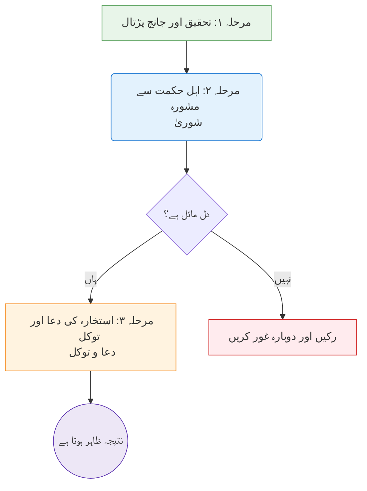
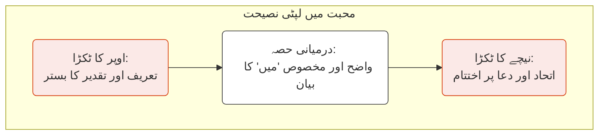
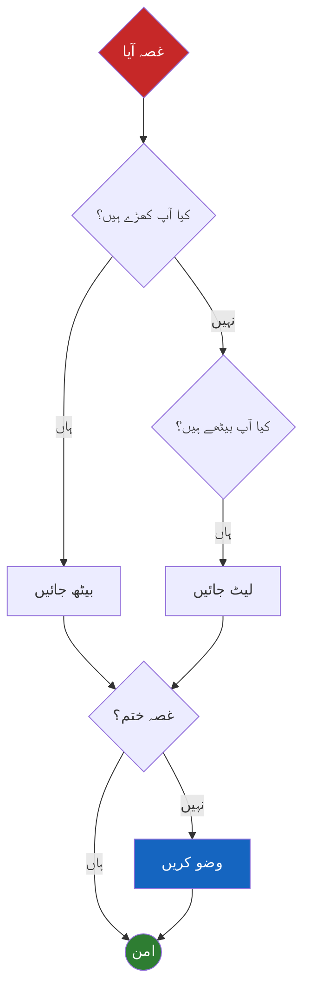
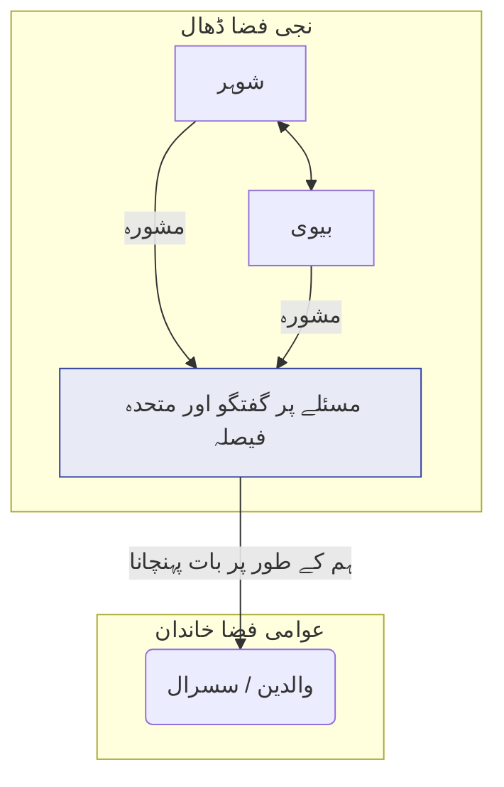
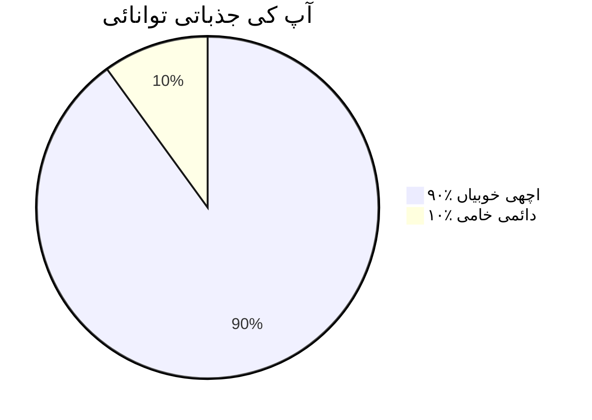
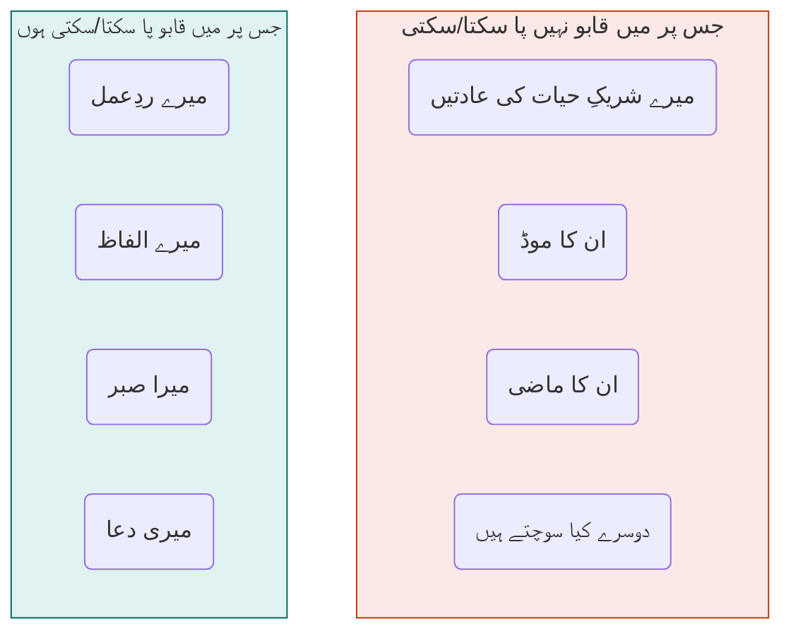

---
---
--- START OF FILE Marriage Ur Script Final.md ---

---
---

# Title Verso Page

**حقوقِ طبع (Copyright)** © ۲۰۲۵ by امام اعظم ریسرچ سینٹر (IARC)، شیخ الاسلام ٹرسٹ

**جملہ حقوق محفوظ ہیں۔** اس اشاعت کا کوئی بھی حصہ ناشر (publisher) کی پیشگی تحریری اجازت کے بغیر، کسی بھی شکل یا ذریعے سے، بشمول فوٹو کاپی (photo-copying)، ریکارڈنگ (recording)، یا دیگر الیکٹرانک یا مکینیکل طریقوں سے، دوبارہ شائع، تقسیم، یا منتقل نہیں کیا جا سکتا، سوائے تنقیدی جائزوں (critical reviews) میں مختصر اقتباسات (brief quotations) اور دیگر ایسے غیر تجارتی استعمالات کے جن کی حقوقِ طبع کے قانون میں اجازت ہے۔

**ناشر (Publisher)** : امام اعظم ریسرچ سینٹر (IARC)، شیخ الاسلام ٹرسٹ

**ناشر کا پتا** : فرسٹ فلور، بیسائڈز قریش ہال، اپوزٹ پیراڈائز کمپلیکس، نیئر مدنی مسکن، مرزا پور، احمد آباد ۳۸۰۰۰۱۔

**ناشر سے رابطہ** : 9898xxx012 اخلاق صوفی

**حصولِ کتاب کے لیے معلومات** : فروخت اور تقسیم کی تفصیلات کے لیے، براہِ کرم اوپر دی گئی تفصیلات پر ناشر سے رابطہ کریں۔

**وضاحت (Disclaimer)** : اس کتاب میں دی گئی نصیحتیں اور اصول ایک صحت مند شادی کے معمولی چیلنجز (challenges) اور نامکملیتوں سے نمٹنے کے لیے ہیں۔ یہ تعلق بنانے اور غیر گناہ گار کردار کی خامیوں پر صبر کرنے کے لیے ایک رہنما ہیں۔ یہ کتاب ظلم (جبر، تشدد) برداشت کرنے کے لیے رہنما نہیں ہے۔ اگر آپ جسمانی، جذباتی، روحانی، یا مالی تشدد کی صورتِ حال میں ہیں، تو آپ کا پہلا اسلامی اور اخلاقی فرض حفاظت تلاش کرنا اور مستند علماء اور پیشہ ور حکام سے مدد لینا ہے۔ ظلم پر صبر کرنا کوئی نیکی نہیں ہے۔

ISBN 978-1-xxxABCxxx-01-2 (انگریزی)
ISBN 978-1-xxxABCxxx-01-2 (ہندی)
ISBN 978-1-xxxABCxxx-01-2 (اردو)

**اشاعتِ اول** : اکتوبر ۲۰۲۵

بھارت میں طبع شدہ

قرآنی آیات کا ترجمہ محدثِ اعظم کے ترجمے معارف القرآن پر مبنی ہے، جس میں مصنف نے وضاحت اور روانی کے لیے معمولی تبدیلیاں کی ہیں۔ احادیث کے حوالہ جات مطلوبہ مجموعوں سے فراہم کیے گئے ہیں۔

---

# انتساب (Dedication Page)

۱۔ بہترین شوہروں میں سب سے بہتر، انسانوں میں سب سے زیادہ رحم دل، تمام انسانیت کے رہنما، **حضور نبی کریم ﷺ** کے نام، جنہوں نے ہمیں سکھایا کہ اللہ ﷻ تک کا راستہ سیدھا ہمارے گھروں کے دل سے گزرتا ہے۔
اور ہر اس روح کے نام جو اس راستے پر چلنے کی کوشش کر رہی ہے، اپنی شادی کو جنت کے ایک باغ میں تبدیل کرنے کی جستجو میں ہے۔

۲۔ **الودود**، سب سے زیادہ محبت کرنے والے، کے نام سے، جس نے دلوں کے درمیان محبت کو اپنے وجود کی ایک نشانی بنایا۔
اور ہر شوہر اور بیوی کے لیے جو ایک دوسرے کے لیے آئینہ بننے کی کوشش کرتے ہیں، جو نہ صرف اپنی خامیاں، بلکہ ایمان کی اس روشنی کو بھی منعکس (reflect) کرتے ہیں جو ان دونوں کو اسی کی طرف واپس لے جا سکتی ہے۔

۳۔ میری محبوب شریکِ حیات کے نام، جو تزکیہ کے اس سفر میں میرا پہلا آئینہ ہیں۔
اور ان تمام جوڑوں کے نام جو اس کتاب کو اٹھائیں گے، اس دعا کے ساتھ کہ آپ ان صفحات میں ایک ایسا قطب نما (compass) پائیں جو آپ کے دلوں کو ایک دوسرے کی طرف، اور آپ دونوں کے دلوں کو اللہ ﷻ کی طرف موڑ دے۔

---
---

# تقریظ HSI 01

بسم اللہ الرحمٰن الرحیم
نحمدہ و نصلی و نسلم على رسوله الكريم

امتِ مسلمہ کا سنگِ بنیاد خاندان کا ادارہ ہے۔ جب ہمارے گھر سکون (sakinah)، رحمت (rahmah)، اور محبت (mawaddah) سے معمور ہوتے ہیں، تو پوری ملت پروان چڑھتی ہے۔ مگر اس پرفتن دور میں، نکاح کے مقدس ادارے کو مادیت پرستی، انفرادیت پسندی، اور غفلت کی حوادث سے ایسے لازوال خطرات لاحق ہیں جن کی مثال نہیں ملتی۔

**[شیخ الاسلام سید مدنی میاں اشرفی جیلانی]**
[تاریخ اور مقام]

---

# تقریظ ASDI 02

بسم اللہ الرحمٰن الرحیم
نحمدہ و نصلی و نسلم على رسوله الكريم

میری دعا ہے کہ یہ کتاب ہر مسلمان گھر تک پہنچے، خاص طور پر ہمارے ان نوجوان لڑکوں اور لڑکیوں کے ہاتھوں میں جو اس مقدس سفر کا آغاز کرنے والے ہیں۔ یہ اخلاص پر مبنی ایک علمی کاوش اور گہری روحانی بصیرت کا حامل کام ہے جس کی آج سخت ضرورت ہے۔

دعا ہے کہ اللہ ﷻ مصنف اور ناشر کی اس نیک کوشش کو قبول فرمائے، اسے امت کے لیے بے پناہ نفع کا ذریعہ بنائے، اور انہیں اس کا بہترین اجر دنیا اور آخرت میں عطا فرمائے۔ آمین۔

**شاکر علی نوری**
امیر، سنی دعوتِ اسلامی
ممبئی، انڈیا


---
---

# ToC

```table-of-contents
title: 
style: nestedList 
minLevel: 0 
maxLevel: 3 
includeLinks: true 
```

---
---

# تمہید (Prologue)

> [!QUOTE] لا تقنطوا (مایوس نہ ہو)

> [!SUBTITLE] اس سے پہلے کہ آپ شروع کریں...
> امید پر مبنی ایک گفتگو!

#### [!QUOTE] لَا تَقْنَطُوا (مایوس نہ ہو)

#### [!SUBTITLE] اس سے پہلے کہ آپ شروع کریں...

## امید پر مبنی ایک گفتگو

> ...لَا تَقْنَطُوا مِن رَّحْمَةِ اللَّهِ...
> "...اللہ کی رحمت سے امید نہ توڑو..." <sup>(القرآن ۳۹:۵۳، کنز الایمان)</sup>

ممکن ہے آپ نے یہ کتاب ایک بوجھل دل کے ساتھ اٹھائی ہو۔

یا شاید آپ اسے ایک نئے سفر کے آغاز پر امید کے ساتھ تھامے ہوئے ہوں، یا ایک اچھی جگہ پر ہوتے ہوئے، اسے بہتر بنانے کی کوشش میں ہوں۔ آپ کی حالت جو بھی ہو، یہ پہلا لفظ آپ کے لیے ہے۔

کچھ لوگوں کے لیے، "تعلق جوڑنے کا فن" جیسے باب کا عنوان ایک دور دراز، ناممکن خواب جیسا محسوس ہو سکتا ہے۔ ہو سکتا ہے آپ نے اپنے شریکِ حیات کے ساتھ اس فاصلے کو کم کرنے کی اتنی بار کوشش کی ہو اور ناکام رہے ہوں کہ اب یہ دیواریں مستقل محسوس ہوتی ہیں۔ ہو سکتا ہے آپ محسوس کرتے ہوں کہ آپ کی شادی ٹوٹ چکی ہے، اور اب آپ تھک گئے ہیں۔

یہ لفظ آپ کے لیے ہے۔

اس سے پہلے کہ آپ کوئی ایک بھی فن سیکھیں، اس سے پہلے کہ آپ کسی ایک مسئلے کا تجزیہ کریں، آپ کو اپنے رب کے سب سے خوبصورت ناموں میں سے ایک سے دوبارہ متعارف ہونا ہوگا: **الجبار (al-Jabbar)** ﷻ۔

ہم اکثر اس نام کا مطلب "زبردست" یا "قابو میں لانے والا" سوچتے ہیں، اور یہ ہے۔ لیکن اس کا ایک گہرا معنیٰ بھی ہے، جو زخمی دل کے لیے مرہم ہے۔ الجبار ﷻ وہ بھی ہے "جو ٹوٹے ہوئے کو جوڑتا اور بحال کرتا ہے۔"

وہی ہے جو ٹوٹی ہوئی ہڈیوں کو جوڑتا ہے، ہاں، لیکن اس سے بھی گہرا، وہ ٹوٹے ہوئے حالات، ٹوٹی ہوئی روحوں، اور ٹوٹے ہوئے دلوں کو جوڑتا ہے۔ آپ کی شادی، چاہے کتنی ہی شکستہ محسوس کیوں نہ ہو، اس کی قدرت سے باہر نہیں ہے کہ وہ اسے بحال کر دے۔ آپ کا دل، چاہے کتنا ہی زخمی کیوں نہ ہو، اس کی اس صلاحیت سے باہر نہیں ہے کہ وہ اسے شفا دے۔

جنگِ احد کے تباہ کن معرکے کے بعد حضور ﷺ کے صحابہ رضی اللہ عنہم کی حالت کے بارے میں سوچیے۔ وہ جسمانی طور پر زخمی تھے، جذباتی طور پر ٹوٹ چکے تھے، اپنے عزیز ترین دوستوں کے غم میں ڈوبے ہوئے تھے۔ کسی بھی دنیاوی پیمانے سے، وہ شکست خوردہ تھے۔ پھر بھی اگلے ہی دن، حضور ﷺ نے انہی شکستہ آدمیوں کو اٹھایا اور دشمن کا تعاقب کرنے کے لیے جمع کیا۔ ان کا ردِعمل یہ نہیں تھا کہ اپنی شکست پر مایوس ہو جائیں، بلکہ اللہ ﷻ کے منصوبے پر فوری، امید بھری توکل کے ساتھ دوبارہ اٹھ کھڑے ہونا تھا۔

یہ اس دل کے لیے سنت ہے جو ایک معرکے سے گزرا ہو۔ اور ایک مشکل شادی دردناک معرکوں کے سلسلے کے سوا کیا ہے؟ سنت یہ نہیں ہے کہ ملبے کے ڈھیر پر بیٹھ کر جو کھو گیا ہے اس پر ماتم کیا جائے۔ سنت یہ ہے کہ اگلے دن اٹھیں، الجبار ﷻ کی طرف رجوع کریں، اور دوبارہ کوشش کریں۔

اگر آپ کا دل بوجھل ہے، تو اس کی وجہ ایک روحانی دھند ہو سکتی ہے جسے ہم **مایوسی (قنوط)** کہتے ہیں۔ یہ صرف اداسی نہیں ہے۔ یہ وہ خاموش، رینگتا ہوا عقیدہ ہے کہ آپ کی شادی، آپ کی صورتِ حال، ایک خاص قسم کی ٹوٹی ہوئی چیز ہے، ایسی جو اللہ ﷻ کی مدد سے بھی پرے ہے۔ یہ شیطان کی طرف سے ایک خطرناک سرگوشی ہے، کیونکہ یہ الجبار ﷻ، ٹوٹی چیزوں کے جوڑنے والے کی قدرت پر ایک حد لگانے کی کوشش کرتی ہے۔

یہ دھند اکثر ہماری ماضی کی غلطیوں کے سایوں سے اور گھنی ہو جاتی ہے۔ کیا آپ نے کبھی خود کو اپنے بدترین لمحات کو دہراتے ہوئے پایا ہے؟ آپ کے اپنے سخت الفاظ، آپ کے غصے یا غفلت کے لمحات؟ یہ شیطان اور آپ کا اپنا نفس مل کر کام کر رہے ہیں، آپ کے اپنے ذہن میں ایک مدعی (prosecutor) کا کردار ادا کر رہے ہیں۔ وہ آپ کو اس شخص سے باندھ دینا چاہتے ہیں جو آپ کل تھے تاکہ آپ اس شخص بننے کے لائق محسوس نہ کریں جو آپ کل بن سکتے ہیں۔ حقیقت یہ ہے کہ اللہ ﷻ کی رحمت آپ کی سب سے بڑی غلطی سے بھی بڑی ہے۔ ایک خالص توبہ کی طاقت صرف ایک سوراخ میں پیوند نہیں لگاتی؛ یہ آپ کو ایک نئی شروعات دیتی ہے۔ یہ کتاب اس شخص کے لیے ہے جسے آپ ابھی، اس لمحے میں، بننے کا انتخاب کر رہے ہیں۔

ہو سکتا ہے کہ آپ مایوسی سے نہیں، بلکہ اپنی ماضی کی غلطیوں کے بوجھ سے پیچھے رہ گئے ہوں۔ آپ کے اپنے سخت الفاظ، آپ کا اپنا غصہ، آپ کی اپنی غفلت۔ شیطان سرگوشی کرے گا کہ اب بہت دیر ہو چکی ہے، کہ نقصان ہو چکا ہے، کہ آپ ایک پرسکون گھر کے لائق نہیں ہیں۔

یہ بھی ایک جھوٹ ہے۔ حضور ﷺ نے ہمیں ایک ایسی کنجی (key) دی ہے جو ماضی کے ہر بند دروازے کو کھول دیتی ہے۔ آپ ﷺ نے فرمایا، "گناہ سے توبہ کرنے والا ایسا ہے جیسے اس نے کوئی گناہ کیا ہی نہ ہو۔" <sup>۱ سنن ابن ماجہ ۴۲۵۰</sup>

اس فرمان کی طاقت پر غور کریں۔ ایک سچی توبہ—ندامت سے بھرے دل اور بدلنے کے وعدے کے ساتھ اللہ ﷻ کی طرف لوٹنے کا ایک لمحہ—صرف آپ کی غلطیوں پر پیوند نہیں لگاتا۔ یہ انہیں مٹا دیتا ہے۔ یہ آپ کو ایک صاف سلیٹ فراہم کرتا ہے۔ جو شخص آپ کل تھے، ضروری نہیں کہ وہی شخص آپ آج بھی ہوں۔ آپ کو ابھی، اسی وقت، دوبارہ شروع کرنے کی الٰہی اجازت دی گئی ہے۔

لہٰذا، جب آپ یہ کتاب شروع کریں، تو ایک نئے دل کے ساتھ کریں۔ جب آپ آگے آنے والی کہانیاں پڑھیں گے، تو آپ ہمارے حضور ﷺ کے کامل کردار سے روبرو ہوں گے۔ شیطان سرگوشی کرے گا، "یہ تو اولیاء کے لیے ہے، تمہارے لیے نہیں۔" اس سرگوشی کو رد کر دیں۔ مقصد راتوں رات تکمیلیت حاصل کرنا نہیں ہے۔ مقصد صحیح سمت میں ایک خالص، نامکمل قدم اٹھانا ہے۔ اللہ ﷻ ہمارا فیصلہ ہماری آخری منزل سے نہیں، بلکہ اس سمت سے کرتے ہیں جس میں ہم چل رہے تھے۔

اس کتاب کو ایک ٹوٹی ہوئی مشین کو ٹھیک کرنے کی بے چینی سے نہ پڑھیں، بلکہ ایک پیاسے پودے کو پانی دینے کی خاموش امید کے ساتھ پڑھیں۔ **الجبار (al-Jabbar ﷻ)**، ٹوٹی چیزوں کے جوڑنے والے، کی مدد سے، نئی زندگی ہمیشہ ممکن ہے۔

---
---

# تعارف (Introduction)

> [!QUOTE] المؤمن مرآة المؤمن (مومن مومن کا آئینہ ہے)

> [!SUBTITLE] اپنی شادی کو دیکھنے کا
> ایک نیا زاویہ

#### [!QUOTE] المؤمن مرآة المؤمن (مومن مومن کا آئینہ ہے)

#### [!SUBTITLE] اپنی شادی کو دیکھنے کا ایک نیا زاویہ

> الْمُؤْمِنُ مِرْآةُ الْمُؤْمِنِ
> "مومن مومن کا آئینہ ہے۔" **<sup>۱ (سنن ابی داؤد ۴۹۱۸)
</sup>**

اپنی ازدواجی کشمکش میں، ہم اکثر اپنے شریکِ حیات سے ایک ایسے آلے (device) کی طرح سلوک کرتے ہیں جسے ہم ریموٹ (remote) سے کنٹرول کر سکتے ہیں—ہم ان کے ردِعمل کو بند (mute) کرنا چاہتے ہیں، ان کے مزاج کو بدلنا (switch) چاہتے ہیں، یا مشکل گفتگو کو تیزی سے آگے بڑھانا (fast-forward) چاہتے ہیں۔ لیکن ریموٹ صرف ہمارے ہاتھ میں کام کرتا ہے—ان کے ہاتھ میں نہیں۔

کتنی ہی بار ہم اس شخص کی مانند عمل کرتے ہیں جو آئینے میں اپنا عکس دیکھ کر، اپنا چہرہ صاف کرنے کے بجائے، آئینہ صاف کرنے کی کوشش کرتا ہے۔ ہم اپنی پوری توجہ دوسرے شخص کو درست کرنے پر مرکوز کر دیتے ہیں، اس یقین کے ساتھ کہ اگر وہ بدل گئے، تو ہمیں بالآخر خوشی مل جائے گی۔

ہمارا رویہ کبھی کبھی اس مسافر جیسا ہوتا ہے جو راستہ بھٹکنے پر جی پی ایس (GPS) پر چلا رہا ہو—آواز کو، ہدایتوں کو، یا نقشے کو الزام دے رہا ہو—بجائے اس کے کہ گاڑی روک کر، دوبارہ ترتیب دے (recalibrate)، اور یہ دیکھے کہ کیا اس نے آخر صحیح منزل درج بھی کی تھی یا نہیں۔

یہ بالکل ویسی ہی کوشش ہے جیسے کوئی کام کے لیے غلط اوزار استعمال کر رہا ہو—جہاں احتیاط بھرے ہاتھوں اور صبر کی ضرورت ہے، وہاں ہتھوڑا استعمال کرنے کی کوشش کر رہا ہو۔ ہم غلط جگہوں پر دباؤ ڈالتے رہتے ہیں، یہ سوچتے ہوئے کہ زیادہ طاقت اس چیز کو ٹھیک کر دے گی جسے صرف محبت اور سمجھداری ٹھیک کر سکتی ہے۔

ہم اپنے سامنے والے شخص کو "ٹھیک" کرنے کی کوشش میں خود کو تھکا دیتے ہیں، اور نتیجہ ہمیشہ ایک ہی ہوتا ہے: تناؤ، رنجش سے بھرا ایک رشتہ، اور دو ایسے لوگ جو مسلسل تنقید اور غلط فہمی کا شکار محسوس کرتے ہیں۔

آخر اپنے شریکِ حیات کو "ٹھیک" کرنے کا خیال اتنا لبھاونا کیوں ہوتا ہے؟ یہ ہمارے دل کی کھیلی ہوئی ایک چالاک چال کی وجہ سے ہے۔ ہم اس دنیا میں ایک بنیادی روحانی منصوبے کے ساتھ آتے ہیں: اپنی روح کی پاکیزگی (تزکیة النفس)۔ لیکن شادی میں، ہمارا نفس بڑی چالاکی سے توجہ کا مرکز بدل دیتا ہے۔ یہ ہمیں یقین دلاتا ہے کہ ہمارا اصل منصوبہ اب ہمارا شریکِ حیات ہے۔

یہ ایک پوشیدہ **تکبر (کبر)** سے پیدا ہوتا ہے۔ یہ وہ خاموش، بے سوچا سمجھا مفروضہ (assumption) ہے کہ ہم معیار ہیں اور وہی ہیں جنہیں بدلنے کی ضرورت ہے۔ ہم اس شخص کی طرح بن جاتے ہیں جو آئینے سے دھبہ صاف کرنے کی کوشش کر رہا ہو، اس بات سے بالکل بے خبر کہ دھبہ اس کے اپنے چہرے پر ہے۔ ہم ایک ایسی روح کو قابو کرنے کی کوشش میں خود کو تھکا دیتے ہیں جسے قابو کرنا ہمارے ذمے تھا ہی نہیں، جبکہ وہ ایک روح جس کی ذمہ داری ہم پر ہے—ہماری اپنی—گرد آلود ہوتی رہتی ہے۔ آئینے کی یہ تمثیل (metaphor) ایک بابرکت، عاجزی سکھانے والی اصلاح ہے۔ یہ نرمی سے ہمارا رخ ہمارے اپنے عکس کی طرف موڑتی ہے اور ہمیں یاد دلاتی ہے کہ اصل کام کہاں ہے۔

کیا ہو اگر ہم اب تک آئینے کو غلط انداز سے دیکھتے رہے ہوں؟

کیا ہو اگر شادی کا مقصد آپ کے سامنے والے شخص کو ٹھیک کرنا نہ ہو، بلکہ اس تصویر کو ٹھیک کرنا ہو جو آپ کو آئینے میں نظر آتی ہے؟

نظر کا یہ ایک انقلاب، اس ایک تبدیلی میں ہی ایک زیادہ پرسکون اور روحانی طور پر تسکین بخش شادی کا راز پوشیدہ ہے۔ یہ وہی حکمت ہے جو ہمارے حضور ﷺ نے ہمیں سکھائی جب انہوں نے فرمایا کہ مومن مومن کا آئینہ ہے۔

**یہ ہماری کتاب کی مرکزی تمثیل ہے، اور یہ بڑی گہری ہے۔ ذرا سوچیے کہ ایک آئینہ حقیقت میں کام کیسے کرتا ہے۔**

*   ایک آئینہ آپ کو آپ کی اپنی خامیاں دکھاتا ہے، نہ کہ خود آئینے کی خامیاں۔ جب آپ اپنے چہرے پر کوئی دھبہ دیکھتے ہیں، تو آپ آئینہ صاف کرنے کی کوشش نہیں کرتے۔ آپ اپنے چہرے پر توجہ دیتے ہیں۔
*   ایک آئینہ سچا ہوتا ہے مگر خاموش۔ یہ حقیقت کو بغیر تنقید، بغیر چلائے، بغیر طنز کے منعکس (reflect) کرتا ہے۔
*   آپ آئینہ اس لیے استعمال کرتے ہیں تاکہ دنیا میں قدم رکھنے سے پہلے اپنی اصلاح کر لیں۔

آپ کا شریکِ حیات آپ کا آئینہ ہے۔ ان کے افعال، ان کے الفاظ، ان کا وجود اکثر آپ کی اپنی روحانی حالت کو آپ پر منعکس کرتا ہے۔ ان کا غصہ شاید آپ کی اپنی سختی کا عکس ہو۔ ان کی دوری شاید آپ کی اپنی غفلت کا عکس ہو۔ ان کی بے چینی شاید آپ کی اپنی بے صبری کا عکس ہو۔ اس کا یہ مطلب نہیں کہ آپ ان کے رویے کے ذمہ دار ہیں، لیکن اس کا مطلب یہ ہے کہ وہ واحد رویہ جس پر آپ کو مکمل اختیار ہے، وہ آپ کا اپنا ہے۔ ایک بہتر شادی کا راستہ اپنے شریکِ حیات کو بدلنے سے نہیں، بلکہ اس عکس کی اصلاح سے گزرتا ہے جو آپ آئینے میں دیکھتے ہیں۔

---

## یہ ایک رشتہ اتنا اہم کیوں ہے

اس سے پہلے کہ ہم یہ سیکھیں کہ ایک بہتر شادی *کیسے* بنائی جائے، ہمیں پہلے اس بات پر غور کرنا چاہیے کہ یہ ایک رشتہ ہمارے دین میں اتنا مقدس اور عظیم الشان مقام *کیوں* رکھتا ہے۔ یہ صرف ایک اور دنیاوی معاہدہ (contract) نہیں ہے؛ یہ ایک کائناتی اہمیت کا عہد و پیغام (covenant) ہے، ایک ایسا روحانی میدان جس کی اہمیت اس دنیا سے آخرت تک جا پہنچتی ہے۔

اسے صحیح معنوں میں سمجھنے کے لیے، ہمیں ان تین بنیادی حقائق کو سمجھنا ہوگا جو شادی کو ایک سماجی انتظام سے ہماری روحانی زندگی کے ستون (pillar) تک بلند کرتے ہیں۔

۱۔ **یہ آپ کا آدھا دین ہے۔** حضور ﷺ نے ہمیں سکھایا کہ "جب کوئی بندہ نکاح کرتا ہے، تو اس نے اپنا آدھا دین مکمل کر لیا۔"¹ یہ ایک حیران کن فرمان ہے جو ہمیں غور و فکر پر مجبور کر دینا چاہیے۔ اس کا مطلب ہے کہ شادی کا روزمرہ کا میدان—صبر، شکر، رحمت، اور درگزر کی تمام آزمائشوں کے ساتھ—ہماری آدھی روحانی نشوونما کے لیے بنیادی نصاب (curriculum) ہے۔ اللہ ﷻ تک کا راستہ کوئی ایسا سفر نہیں ہے جو ہم تنہائی میں طے کرتے ہیں؛ ہم میں سے اکثر کے لیے، یہ راستہ سیدھا ہمارے گھروں کے دل سے گزرتا ہے۔

۲۔ **یہ شیطان کے خلاف ایک جنگ ہے۔** حضور ﷺ نے ہمیں بتایا کہ ابلیس روزانہ اپنے لشکر بھیجتا ہے، اور وہ شیطان جو سب سے اونچا درجہ حاصل کرتا ہے، وہ نہیں جو کسی کو چوری یا شراب پر اکساتا ہے، بلکہ وہ ہے جو ایک شوہر اور بیوی کو جدا کرنے میں کامیاب ہو جاتا ہے۔² وہ عمل جو ایک شیطان کو ابلیس کے تخت کے سب سے قریب لے جاتا ہے، وہ ایک شادی کا ٹوٹنا ہے۔ یہ ایک گہری حقیقت کو ظاہر کرتا ہے: آپ کی پرسکون، محبت بھری شادی کوئی بے جان حالت نہیں ہے۔ یہ انسانیت کے سب سے بڑے دشمن کے خلاف ایک فعال (active)، روزانہ کی روحانی جنگ ہے۔ تعلق کا ہر لمحہ جو آپ بناتے ہیں، ایک فتح ہے۔ ہر جھگڑا جسے آپ رحمت سے حل کرتے ہیں، اس کے لیے ایک شکست ہے۔

۳۔ **یہ اس دنیا اور آخرت میں آپ کا گھر ہے۔** شادی واحد انسانی بندھن ہے جو جنت کے باغات میں، آدم اور حوا علیہم السلام کے ساتھ شروع ہوا۔ یہ وہ رشتہ ہے جس میں آپ شاید زمین پر کسی بھی دوسرے شخص سے زیادہ وقت گزاریں گے۔ اور یہ وہ واحد رشتہ ہے جس کے لیے ہم دعا کرتے ہیں کہ جنت میں بھی ہمارے ساتھ جاری رہے، ایک جنت سے دوسری جنت تک ایک مسلسل حقیقت۔ یہ انسانی تعلق کا آغاز بھی ہے اور انجام بھی۔

کیونکہ یہ عہد اتنا مقدس ہے، اللہ ﷻ نے ہمیں اسے انجانے میں طے کرنے کے لیے نہیں چھوڑا ہے۔ اس ﷻ نے ہمیں، اپنے قرآن اور اپنے رسول ﷺ کے ذریعے، اس سفر کے لیے ایک واضح نقشہ عطا کیا ہے۔

---

## اس کتاب کے سفر پر کیسے نکلیں

یہ کتاب ایک عملی رہنما (practical guide)، دل کے لیے **عملی حکمتوں** کا ایک صندوق کے طور پر ڈیزائن کی گئی ہے۔ یہ ایک بابرکت شادی کے چھ ضروری فنون (arts) کا سفر ہے۔ اس سے بہترین فائدہ اٹھانے کے لیے، ہم آپ کو اس طرح سفر کرنے کی سفارش کرتے ہیں:

۱۔ **ایک کھلے دل سے پڑھیں۔** اپنے شریکِ حیات میں غلطیاں تلاش کرنے کے لیے نہ پڑھیں، بلکہ اپنی نشوونما کے مواقع تلاش کرنے کے لیے پڑھیں۔ ہر **حکمت** کے ساتھ، پہلے خود سے پوچھیں: "میں اسے کیسے استعمال کر سکتا/سکتی ہوں؟"

۲۔ **ایک وقت میں ایک باب پر توجہ دیں۔** سب کچھ ایک ساتھ لاگو (implement) کرنے کی کوشش نہ کریں۔ ایک یا دو ہفتے ایک ہی باب کی **حکمتوں** پر توجہ مرکوز کرنے میں گزاریں۔ اگلے پر جانے سے پہلے ایک چھوٹی سی تبدیلی میں مہارت حاصل کریں۔

۳۔ **گفتگو کریں، الزام نہ لگائیں۔** اگر یہ اپنے شریکِ حیات کے ساتھ پڑھ رہے ہیں، تو اسے نرمی بھری گفتگو کی بنیاد کے طور پر استعمال کریں۔ یہ کہنے کے بجائے، "تمہیں غصے پر مبنی باب پڑھنے کی ضرورت ہے،" یہ کہنے کی کوشش کریں، "مجھے تنازع (conflict) پر مبنی باب اپنے لیے بہت مددگار لگا۔ کیا ہم شاید اسے ایک ساتھ دیکھ سکتے ہیں؟"

۴۔ **تصویری خاکوں (Visuals) کا استعمال کریں۔** ہر باب میں دیے گئے ڈایاگرام (diagrams)، ٹیبل (tables)، اور چیک لسٹ (checklists) کو بنیادی **حکمتوں** کے جلد، یاد رہنے والے خلاصوں کے طور پر ڈیزائن کیا گیا ہے۔ انہیں دن کے دوران ذہنی لنگر (mental anchors) کے طور پر استعمال کریں۔

۵۔ **ضمیمے (Appendix) کا استعمال کریں۔** اس کتاب کے آخر میں "مومن کا ٹول کٹ" آپ کا جلد حوالہ رہنما (quick-reference guide) ہے۔ اسے کسی بحران (crisis) کے لمحے میں صحیح صورتِ حال کے لیے صحیح **حکمت** تلاش کرنے کے لیے استعمال کریں۔

۶۔ **عمل کے ساتھ صبر کریں۔**  اس کتاب میں دیے گئے اوزار روحانی معاونات ہیں، کوئی جادوی چھڑی نہیں۔ یہ سمجھنے میں آسان ہیں، لیکن ان پر عبور حاصل کرنے کے لیے مخلصانہ اور مسلسل محنت درکار ہوتی ہے، جیسے کوئی نیا پٹھا بنانا۔ اگر آپ کو کوئی چیلنج بہت گہرا، شدید یا ماضی کے صدموں سے جڑا ہوا محسوس ہو، تو یاد رکھیں کہ مدد طلب کرنا کمزوری نہیں بلکہ طاقت کی علامت ہے۔ اس کتاب میں بیان کردہ اصولوں کو روحانی طور پر بالغ رہنماؤں اور مستند پیشہ ور مشیروں کی مدد سے مؤثر طریقے سے مکمل کیا جا سکتا ہے۔

یہ صرف ایک معمولی شادی کی رہنما کتاب نہیں ہے؛ یہ *تزکیة النفس*—روح کی پاکیزگی—کا ایک مینول (manual) ہے، جو جنت میں داخلے کے لیے شادی کے مقدس ادارے کے ذریعے حاصل ہوتا ہے۔ آئیے، آغاز کرتے ہیں۔

#### [!danger] ایک اہم تنبیہ (A Critical Disclaimer)

اس کتاب میں دیے گئے اصول صحت مند رشتوں کو بنانے اور شادی کی معمولی مشکلات سے نمٹنے کے لیے ہیں۔ یہ نامکمل ہونے پر صبر کے لیے ایک رہنما ہیں، ظلم پر نہیں۔ اگر آپ جسمانی، جذباتی، یا روحانی اذیت (ظلم) کی صورتِ حال میں ہیں، то آپ کا پہلا فرض حفاظت تلاش کرنا اور علماء اور مستند پیشہ ور حکام سے مدد لینا ہے۔ حضور ﷺ نے ہمیں ظلم کو روکنے کا حکم دیا ہے، اس پر صبر کرنے کا نہیں۔

> [!danger] ایک اہم تنبیہ
> اس کتاب میں دیے گئے اصول صحت مند رشتوں کو بنانے اور شادی کی معمولی مشکلات سے نمٹنے کے لیے ہیں۔ یہ نامکمل ہونے پر صبر کے لیے ایک رہنما ہیں، ظلم پر نہیں۔ اگر آپ جسمانی، جذباتی، یا روحانی اذیت (ظلم) کی صورتِ حال میں ہیں، то آپ کا پہلا فرض حفاظت تلاش کرنا اور علماء اور مستند پیشہ ور حکام سے مدد لینا ہے۔ حضور ﷺ نے ہمیں ظلم کو روکنے کا حکم دیا ہے، اس پر صبر کرنے کا نہیں۔

---
---
---

# باب ۱ - انتخاب کا فن

> [!QUOTE] الکفاءة فی الدین
> (دین میں برابری اور لیاقت)

> [!SUBTITLE] میں صرف ایک فرد نہیں، ایک شریکِ حیات کا انتخاب کیسے کروں؟

#### [!QUOTE] الکفاءة فی الدین (دین میں برابری اور لیاقت)

#### [!SUBTITLE] میں صرف ایک فرد نہیں، ایک شریکِ حیات کا انتخاب کیسے کروں؟

## ۱.۱ قصہ: اللہ ﷻ کے ایک محبوب بندے کی شادی

ان کا نام جلیبیب رضی اللہ عنہ تھا۔

مدینہ زادها الله تكريماً وتشريفاً کے اس پررونق شہر میں، جو حضور اکرم ﷺ اور ان کے اصحابِ کرام کا مسکن تھا، جلیبیب رضی اللہ عنہ ایک ایسے شخص تھے جنہیں اکثر نظرانداز کر دیا جاتا تھا۔ وہ نہ تو اپنی دولت کے لیے مشہور تھے، نہ ہی بلند نسب کے لیے، اور نہ ہی جاذبِ نظر شکل و صورت کے لیے۔ دنیاوی معیاروں کے مطابق، انہیں ایک معمولی، حتیٰ کہ "ناقابلِ ازدواج" (unmarriageable) سمجھا جاتا تھا۔

ایک دن، حضور ﷺ، وہ ذات جو لوگوں کے دلوں میں سب سے گہرائی تک جھانکنے کا فن جانتی تھی، جلیبیب رضی اللہ عنہ کے پاس تشریف لائے اور ان سے ایک سادہ سا سوال پوچھا: "جلیبیب، کیا تم شادی نہیں کرنا چاہتے؟"

جلیبیب رضی اللہ عنہ نے، شاید ایک بوجھل دل کے ساتھ، جواب دیا، "یا رسول اللہ ﷺ، مجھ سے کون شادی کرے گا؟" انہیں محسوس ہوتا تھا کہ ان کا دنیاوی مرتبہ بہت کم ہے۔

حضور ﷺ نے دنیاوی مرتبہ نہیں دیکھا۔ انہوں نے جلیبیب رضی اللہ عنہ کا اللہ ﷻ کے یہاں مرتبہ دیکھا۔ لہٰذا، وہ انصار کے ایک ممتاز سردار کے گھر تشریف لے گئے اور فرمایا، "میں تمہاری بیٹی کا ہاتھ مانگنے آیا ہوں۔"

انصاری شخص خوشی سے پھولے نہ سمائے۔ حضور ﷺ کا داماد بننا تو سب سے بڑا اعزاز تھا۔ انہوں نے جوش سے جواب دیا، "ہاں، یا رسول اللہ ﷺ! میری آنکھوں کی کیا ہی ٹھنڈک ہوگی!"

حضور ﷺ نے نرمی سے وضاحت فرمائی، "میں اپنے لیے نہیں مانگ رہا۔"

اس شخص نے، الجھن میں، پوچھا، "تو پھر کس کے لیے؟"

"جلیبیب کے لیے،" حضور ﷺ نے جواب دیا۔

وہ شخص سکتے میں آ گیا۔ اس نے اپنی بیوی کی طرف دیکھا اور کہا، "جلیبیب رضی اللہ عنہ کے لیے؟ کیا ہم اپنی بیٹی جلیبیب کو دے دیں؟" اس نے اپنی بیوی سے مشورہ شروع کیا، جو اس کی ہچکچاہٹ میں شریک تھی۔ ہر ثقافتی اور دنیاوی معیار کے مطابق، یہ ایک مناسب رشتہ نہیں تھا۔

لیکن ان کی بیٹی، جو گھر کے اندر تھی اور یہ گفتگو سن رہی تھی، ایک ایسی حکمت کی مالک تھی جو اس لمحے میں اپنے والدین سے بڑھ کر تھی۔ اس نے ایک ایسی حقیقت کو سمجھ لیا جسے وہ وقتی طور پر بھول گئے تھے۔ وہ باہر آئیں اور انہیں مخاطب کیا، ان کی آواز ایمان کی وضاحت سے لبریز تھی:

"کیا آپ رسول اللہ ﷺ کی درخواست کو رد کرتے ہیں؟ اللہ ﷻ کی قسم، مجھے ان کے پاس بھیج دیجیے، کیونکہ وہ مجھے کبھی تباہی میں نہیں ڈالیں گے۔"

ان کے الفاظ، جو گہرے توکل سے بھرے ہوئے تھے، ان کی ہچکچاہٹ کو چیر گئے۔ انہیں اپنی غلطی کا احساس ہوا۔ شادی طے کر دی گئی۔

سیرت ہمیں بتاتی ہے کہ یہ رشتہ، جو دنیاوی حیثیت پر نہیں بلکہ اللہ ﷻ کے رسول کی حکمت پر خالص توکل کی بنیاد پر قائم ہوا، مدینہ زادها الله تكريماً وتشريفاً کے سب سے بابرکت رشتوں میں سے ایک تھا۔ کچھ ہی عرصے بعد، جلیبیب رضی اللہ عنہ ایک فوجی مہم میں شامل ہوئے۔ جنگ کے بعد، حضور ﷺ نے اپنے اصحاب سے پوچھا کہ دیکھو کون لاپتہ ہے۔ انہوں نے بڑے لوگوں، مشہور جنگجوؤں، اور ممتاز خاندان کے بیٹوں کے نام لیے۔

حضور ﷺ نے سنا، اور پھر اپنی آواز میں محبت بھر کر فرمایا، "لیکن میں اپنے جلیبیب رضی اللہ عنہ کو لاپتہ پا رہا ہوں۔"

انہوں نے انہیں میدانِ جنگ میں پایا، انہوں نے بہادری سے لڑتے ہوئے، اپنے گرد سات دشمنوں کو قتل کرنے کے بعد شہادت پائی تھی۔ حضور ﷺ ان کے پاس تشریف لے گئے، آپ کا چہرہ مبارک غم اور فخر سے لبریز تھا۔ انہوں نے جلیبیب رضی اللہ عنہ کا سر اپنے دستِ مبارک میں لیا اور فرمایا، "یہ مجھ سے ہے، اور میں اس سے ہوں۔" آپ نے یہ دو مرتبہ فرمایا۔ پھر، تمام انسانیت کے سردار نے، اس کبھی نظرانداز کیے گئے شخص کے لیے قبر اپنے دستِ مبارک سے کھودی۔

جلیبیب رضی اللہ عنہ کا قصہ ہمارے پہلے باب کا قصہ ہے۔ یہ ایک ایسی کہانی ہے جو اس دنیا کے کمزور آئینوں کو توڑ دیتی ہے اور ہمیں ایمان کے ابدی (eternal) آئینے میں دیکھنے کو کہتی ہے۔ یہ سب سے اہم سوال پوچھتی ہے: **جب آپ ایک شریکِ حیات کا انتخاب کرتے ہیں، تو آپ کس کے معیاروں سے ناپ تول کر رہے ہیں؟**

---

## ۱.۲ مسئلہ: جدید دور کی بھول بھلیاں

اگر آپ آج ایک شریکِ حیات کی تلاش میں ہیں، تو ہو سکتا ہے آپ خود کو گمشدہ محسوس کریں۔ یہ ایک مقدس سفر سے زیادہ ایک الجھی ہوئی، شور بھری بھول بھلیوں میں بھٹکنے جیسا لگ سکتا ہے۔ آپ کا دل شاید درجنوں مختلف سمتوں میں ان پریشانیوں سے کھنچا جا رہا ہو جو بہت حقیقی محسوس ہوتی ہیں:

*   "میری پوری توجہ ان کی شکل و صورت، ان کے کیریئر (career)، ان کے سوشل میڈیا (social media) پر ہے... کیا میں بہت سطح بین (superficial) ہو رہا/رہی ہوں؟"
*   "میں ایک ایسی غلطی کرنے سے خوفزدہ ہوں جو میری زندگی برباد کر دے گی۔"
*   "میرے والدین مجھ پر ہماری ثقافت یا برادری میں سے کسی سے شادی کرنے کے لیے دباؤ ڈال رہے ہیں، لیکن مجھے کوئی ربط محسوس نہیں ہوتا۔"
*   "میں شادی کی ایپس (apps) سے پریشان ہو گیا/گئی ہوں۔ ایسا لگتا ہے جیسے میں ایک انسان کی خریداری کر رہا/رہی ہوں، اور میں کوئی فیصلہ نہیں کر پا رہا/رہی۔"
*   "میں شادی کرنا چاہتا/چاہتی ہوں، لیکن مجھے لگتا ہے کہ میں مالی طور پر 'تیار' نہیں ہوں۔ مجھے ڈر ہے کہ میں اس کا خرچ نہیں اٹھا سکتا/سکتی۔"

یہ جدید دنیا کی سرگوشیاں ہیں، اور یہ ہمارے دین کی واضح، پراعتماد رہنمائی کو دبا سکتی ہیں۔ یہ باب اس شور کو کم کرنے اور اس صاف، سادہ، اور بابرکت راستے پر توجہ مرکوز کرنے کے بارے میں ہے جو حضور ﷺ نے ہمارے لیے بنایا ہے۔

---

## ۱.۳ اصول: نبوی فارمولا

جب ایک شریکِ حیات چننے کی بات آتی ہے، تو اسلام ہمیں اندھیرے میں نہیں چھوڑتا۔ یہ ہمیں ایک کامیاب اور بابرکت رشتے کے لیے ایک واضح، الٰہی فارمولا فراہم کرتا ہے۔ حضور اکرم ﷺ نے ہمیں بنیادی اصول عطا فرمایا، وہ اصول جو اس سفر کے ہر فیصلے کی بنیاد ہونا چاہیے:

> عَنْ أَبِي هُرَيْرَةَ ـ رضى الله عنه ـ عَنِ النَّبِيِّ صلى الله عليه وسلم قَالَ ‏ "‏ **تُنْكَحُ الْمَرْأَةُ لأَرْبَعٍ لِمَالِهَا وَلِحَسَبِهَا وَجَمَالِهَا وَلِدِينِهَا، فَاظْفَرْ بِذَاتِ الدِّينِ تَرِبَتْ يَدَاكَ** ‏"
> "عورت سے چار چیزوں کی وجہ سے نکاح کیا جاتا ہے: اس کے مال کی وجہ سے، اس کے خاندان (نسب) کی وجہ سے، اس کے حسن کی وجہ سے، اور اس کی دینداری کی وجہ سے۔ پس، تم دینداری والی کو چنو، تم کامیاب ہو۔"<sup> ۱ (صحیح البخاری ۵۰۹۰)</sup>

یہ حدیث ماسٹر کی (master key) ہے۔ یہ ان چیزوں کو تسلیم کرتی ہے جنہیں دنیا اہمیت دیتی ہے—دولت، حسب و نسب، حسن—لیکن یہ ہمیں، سب سے زیادہ زور دے کر، اس ایک چیز کو ترجیح دینے کا حکم دیتی ہے جو ہمیشہ رہتی ہے: ایک شخص کا اللہ ﷻ کے ساتھ تعلق۔ اس کا یہ مطلب نہیں کہ دوسری خوبیوں کی کوئی جگہ نہیں، لیکن وہ صرف مددگار کردار ہیں۔ دین اور اخلاق (اچھا کردار) کو مرکزی کردار ہونا چاہیے۔

### روحانی تشخیص

آئیے، ایمانداری سے بات کریں۔ جب ہم ایک شریکِ حیات کی تلاش میں ہوتے ہیں، تو دنیا ہم پر غلط چیزوں کو دیکھنے کے لیے چیختی ہے۔ مال، حسن، یا حیثیت کی طرف یہ زبردست کشش ایک دل کی بیماری کی علامت ہے: **حب الدنیا (دنیا کی محبت)**۔ یہ تب ہوتا ہے جب ہمارا دل ان چیزوں سے زیادہ پرجوش ہوتا ہے جو لوگوں کو متاثر کرتی ہیں، بجائے ان چیزوں کے جو اللہ ﷻ کو خوش کرتی ہیں۔ یہ پوچھتا ہے، "میرا خاندان کیا کہے گا؟" اس سے پہلے کہ یہ پوچھے، "کیا یہ شخص میرے ساتھ نماز پڑھے گا؟" یہ ایک قسم کی روحانی کم نظری ہے، جہاں ہم آخرت کے ٹھوس سونے کا سودا اس دنیا کے چمکتے ہوئے پلاسٹک سے کر لیتے ہیں۔
یہ ہمیں کمزور روحانی سرمایہ کار (investors) بنا دیتا ہے۔ آپ اپنی زندگی کے سب سے اہم سفر کے لیے ایک ساتھی چن رہے ہیں، اور آپ کا دل پیکیجنگ (packaging) سے بھٹک رہا ہے۔ نبوی فارمولا کوئی پابندی نہیں ہے؛ یہ ایک محبت بھری حفاظت ہے۔ یہ ایک فلٹر (filter) ہے جو آپ کو آپ کی اپنی کمزوریوں سے بچانے کے لیے ڈیزائن کیا گیا ہے، جو آپ کو مجبور کرتا ہے کہ آپ عارضی (temporary) چیزوں سے آگے دیکھیں اور اپنے پورے مستقبل کو اس ایک چیز پر قائم کریں جو واقعی ہمیشہ رہتی ہے: ایک شخص کا اللہ کے ساتھ تعلق۔

اس بات کو اللہ ﷻ کے قرآن میں دیے گئے وعدے سے مزید تقویت ملتی ہے، جو ہماری توجہ ایک کامل شخص تلاش کرنے سے ہٹا کر، خود ایک صحیح شخص *بننے* پر مرکوز کر دیتا ہے:

> ...وَالطَّيِّبَاتُ لِلطَّيِّبِينَ وَالطَّيِّبُونَ لِلطَّيِّبَاتِ…
"...اور ستھری عورتیں ستھرے مردوں کے لیے اور ستھرے مرد ستھری عورتوں کے لیے..."<sup>۲ (القرآن ۲۴:۲۶، کنز الایمان)</sup>

لہٰذا، ایک شریکِ حیات چننے کا سفر، خود پر کام کرنے کا انتخاب کرنے سے شروع ہوتا ہے۔

---

## ۱.۴ عملی حکمتیں: روحانی جانچ پڑتال

ہم ان اصولوں کو عملی طور پر کیسے استعمال کر سکتے ہیں؟ یہاں آپ کی تلاش میں رہنمائی کے لیے تین عملی حکمتیں ہیں۔

### [!tool] حکمت ۱: نیت کا محاسبہ

> [!tool] حکمت ۱: نیت کا محاسبہ

تلاش شروع کرنے سے پہلے ہی، آپ کو اپنی نیت کو صاف کرنا ہوگا۔ آپ کی *نیت* وہ بنیاد ہے جس پر آپ کی پوری شادی تعمیر ہوگی۔ ایک کمزور بنیاد والی عمارت ہمیشہ غیر مستحکم رہے گی۔ اپنے دل کی خاموشی میں خود سے یہ سوالات پوچھیں:

*   **میں شادی کیوں کرنا چاہتا/چاہتی ہوں؟** کیا اس لیے کہ میں اپنا آدھا دین مکمل کروں اور اللہ ﷻ کو راضی کروں؟ یا اس لیے کہ خاندان اور معاشرے کا دباؤ ہے؟
*   **میں کسے متاثر کرنے کی کوشش کر رہا/رہی ہوں؟** کیا میں ایک ایسا ساتھی تلاش کر رہا/رہی ہوں جو میرے دوستوں اور برادری کو متاثر کرے، یا وہ جو مجھے جنت تک پہنچنے میں مدد دے؟
*   **میرا آخری مقصد کیا ہے؟** کیا ایک خوبصورت شادی، یا ایک بابرکت ازدواجی زندگی؟ کیا اس دنیا میں آرام کی زندگی، یا ایک بامقصد زندگی جو اگلی دنیا تک لے جائے؟

اپنے آپ سے بالکل ایماندار رہیں۔ ایک خالص نیت اللہ ﷻ کی رہنمائی حاصل کرنے کا پہلا قدم ہے۔

### [!tool] حکمت ۲: کردار کی کسوٹی

> [!tool] حکمت ۲: کردار کی کسوٹی

حضور ﷺ نے ہمیں سکھایا کہ سطح بین (superficial) ظاہری چیزوں سے آگے دیکھیں۔ عظیم صحابی عمر رضی اللہ عنہ نے تنبیہ فرمائی، "کسی شخص کی نمازوں سے دھوکا نہ کھاؤ... بلکہ، معاملات میں اس کے کردار کو دیکھو۔" ہم یہ کیسے کریں؟ تین اہم رشتوں کی تحقیق کرکے:

۱۔ **ان کا اللہ ﷻ کے ساتھ رشتہ:** کیا وہ اپنی پانچ وقت کی نمازیں پڑھتے ہیں؟ یہ ان کی دینداری کا سب سے اہم اشارہ ہے۔ یہ وہ بنیاد ہے جس پر باقی تمام اچھا کردار تعمیر ہوتا ہے۔

۲۔ **ان کا اپنے والدین کے ساتھ رشتہ:** وہ اپنی ماں اور باپ سے کیسے بات کرتے ہیں، خاص طور پر جب وہ پریشان ہوں یا اختلاف کریں؟ حضور ﷺ نے فرمایا، "تم میں سے بہترین وہ ہے جو اپنے گھر والوں کے لیے بہترین ہے۔" ایک شخص جو اپنے پرورش کرنے والے والدین کے ساتھ مہربانی اور صبر کا مظاہرہ نہیں کر سکتا، وہ جادوئی طور پر ایک شریکِ حیات کے ساتھ یہ کرنا نہیں سیکھ لے گا۔

۳۔ **ان کا مال اور امانت کے ساتھ رشتہ:** کیا وہ اپنے معاملات میں ایماندار ہیں؟ کیا وہ قابلِ اعتماد (trustworthy) مانے جاتے ہیں؟ حضور موسیٰ علیہ السلام کو ایک دانا باپ نے اپنی بیٹی کے لیے اس لیے چنا تھا کیونکہ انہیں "طاقتور اور امین" (قوی امین) دیکھا گیا تھا۔ یہ کردار کے لیے ایک قرآنی معیار ہے۔

### [!tool] حکمت ۳: استخارہ کا عمل

> [!tool] حکمت ۳: استخارہ کا عمل

بہت سے لوگ استخارہ (اللہ ﷻ سے رہنمائی طلب کرنا) کو غلط سمجھتے ہیں، کہ یہ ایک ایسی دعا ہے جو آپ ایک خواب دیکھنے یا کوئی جادوئی اشارہ پانے کے لیے کرتے ہیں۔ اصل سنت ایک زیادہ مکمل اور حقیقت پسندانہ عمل ہے۔ اس کے تین ضروری مراحل ہیں:

۱۔ **اپنی تحقیق کریں:** آپ کو پہلے اس عقل کو استعمال کرنا چاہیے جو اللہ ﷻ نے آپ کو دی ہے۔ اوپر دی گئی کسوٹی کا استعمال کرکے اس شخص کے کردار کی تحقیق کریں۔ سوالات پوچھیں۔ ان کے دوستوں اور خاندان سے بات کریں۔ اپنی پوری جانچ پڑتال (due diligence) کریں۔

۲۔ **اہلِ حکمت سے مشورہ کریں (شوریٰ):** اپنے والدین، کسی قابلِ اعتماد استاد، یا کسی مقامی امام سے مشورہ کریں۔ ولی (سرپرست) کوئی ڈکٹیٹر (dictator) نہیں، بلکہ ایک محافظ ہے جسے اسلام نے اس لیے مقرر کیا ہے کہ وہ اپنی حکمت اور تجربے کا استعمال کرکے آپ کو جذباتی فیصلوں سے بچائے۔

۳۔ **دعا کریں اور توکل کریں (دعا و توکل):** جب آپ اپنی تحقیق اور مشورہ مکمل کر لیں، اور آپ کا دل اس شخص کی طرف مائل ہو، تب آپ استخارہ کی دو رکعت نماز ادا کریں۔ آپ معاملے کو اللہ ﷻ کے سپرد کر دیں اور اس سے دعا کریں کہ اگر یہ آپ کے لیے بہتر ہے تو اسے آسان کر دے، اور اگر نہیں ہے تو اسے پھیر دے۔

اس کے بعد، آپ اللہ ﷻ پر توکل کریں۔ اگر معاملات آسانی سے آگے بڑھتے ہیں، تو یہ ایک اچھا اشارہ ہے۔ اگر رکاوٹیں پیدا ہوتی ہیں اور معاملات بگڑ جاتے ہیں، تو وہ بھی ایک اچھا اشارہ ہے—یہ اللہ ﷻ کی طرف سے آپ کی حفاظت ہے۔



لیکن، کسی بھی روحانی عمل کی طرح، ہماری توقعات کبھی کبھی ہمیں گمراہ کر سکتی ہیں۔

#### اناڑی پن سے شعور تک: ایک حقیقت پسندانہ جائزہ

ہم میں سے بہت سے لوگ استخارہ کے ساتھ "جادوئی اشارے" کے جال میں پھنس جاتے ہیں۔ ہم دعا کرتے ہیں، پھر پیچھے بیٹھ کر ایک واضح خواب، ایک مطلق یقین کے احساس، یا آسمان سے کسی اور زبردست اشارے کا انتظار کرتے ہیں۔ جب کچھ "جادوئی" نہیں ہوتا، تو ہم مفلوج، الجھن زدہ، اور بے تعلق محسوس کر سکتے ہیں۔ یہ ایک روحانی جال ہے جو اس عقل اور کوشش کو نظرانداز کرتا ہے جسے استعمال کرنے کا اللہ ﷻ نے ہمیں حکم دیا ہے۔

حقیقت یہ ہے کہ استخارہ آپ کی اپنی تحقیق اور مشورے کا متبادل (substitute) نہیں ہے؛ یہ آخری قدم ہے جو اسے مقدس بناتا ہے۔ یہ آپ ہیں، اپنا سارا ہوم ورک (homework) کرنے کے بعد، اللہ ﷻ کی طرف رجوع کرتے ہوئے اور کہتے ہوئے، "یا اللہ ﷻ، آپ نے جو عقل مجھے دی ہے، میں نے اسے اپنی بہترین صلاحیت کے مطابق استعمال کیا ہے۔ اب میں نتیجے کو آپ کی لامحدود حکمت کے سپرد کرتا/کرتی ہوں۔" آپ کے استخارہ کا "جواب" عام طور پر کوئی خواب نہیں ہوتا؛ یہ وہ حقیقت ہوتی ہے جو سامنے آتی ہے۔ اگر معاملات آسانی (تیسیر) سے آگے بڑھتے ہیں، تو یہی آپ کا اشارہ ہے۔ اگر ناقابلِ تصور رکاوٹیں پیدا ہوتی ہیں اور راستہ بند ہو جاتا ہے، تو وہ بھی آپ کا اشارہ ہے—اللہ ﷻ کی حفاظت کا اشارہ۔ اس عمل پر بھروسہ کریں جو وہ سامنے لاتا ہے، نہ کہ اس جادو پر جس کی آپ توقع کرتے ہیں۔

---

## ۱.۵ بزرگانِ دین کی حکمت

"اپنی بیٹی کا نکاح ایک *تقویٰ* (پرہیزگاری) والے شخص سے کرو، کیونکہ اگر وہ اس سے محبت کرے گا، تو اس کی عزت کرے گا، اور اگر وہ اسے ناپسند کرے گا، تو اس پر ظلم نہیں کرے گا۔"
— الحسن البصری رضی اللہ عنہ

"اچھے کردار کے دس حصوں میں سے نو حصے دوسروں کی غلطیوں کو نظرانداز کرنا ہے۔"
— امام احمد بن حنبل رضی اللہ عنہ

---

## ۱.۶ اس باب کی دعا

ایک شریکِ حیات کی تلاش کرتے ہوئے اور ایک نیک خاندان کی امید رکھتے ہوئے، اس سے بہتر کوئی دعا نہیں ہے جو رحمان کے بندے قرآن میں کرتے ہیں:

> رَبَّنَا هَبْ لَنَا مِنْ أَزْوَاجِنَا وَذُرِّيَّاتِنَا قُرَّةَ أَعْيُنٍ وَاجْعَلْنَا لِلْمُتَّقِينَ إِمَامًا
> "اے ہمارے رب، ہمیں ہماری بیویوں اور ہماری اولاد سے آنکھوں کی ٹھنڈک دے اور ہمیں پرہیزگاروں کا پیشوا بنا۔" <sup>۳ (القرآن ۲۵:۷۴، کنز الایمان)</sup>

---

## ۱.۷ خطبے کے لائق نکات / سبق کا مرکزی خیال / طالبِ علم کی ڈائری کے لیے

*   دنیا آپ سے پوچھے گی، "وہ دکھتے کیسے ہیں؟" اللہ ﷻ آپ سے پوچھیں گے، "ان کا دل کیسا ہے؟" دنیا پوچھے گی، "ان کی حیثیت کیا ہے؟" اللہ ﷻ پوچھیں گے، "میرے یہاں ان کا مقام کیا ہے؟" اس سوال کو چنیے جو ابدیت (eternity) کے لیے معنی رکھتا ہے۔
*   آپ اپنی زندگی کے لیے ایک ساتھی نہیں چن رہے ہیں۔ آپ اپنے بچوں کے دوسرے والد/والدہ اور جنت میں اپنے پڑوسی کو چن رہے ہیں۔ ایک انتخاب ساٹھ (60) سال کے لیے ہے؛ دوسرا ساٹھ (60) ملین اور اس سے آگے کے لیے ہے۔ آخرت کا ترازو اپنے ہاتھ میں لے کر چنیے۔
*   ایک کامل شخص کی تلاش نہ کریں، کیونکہ آپ کامل نہیں ہیں۔ بلکہ، ایک ایسے شخص کی تلاش کریں جس کا اللہ ﷻ سے عہد مضبوط ہو، کیونکہ آپ سے ان کا عہد اسی سے پیدا ہوگا۔ اس سے شادی کریں جس کی اللہ سے محبت آپ کی اپنی محبت کو جوش دلائے، اور آپ نے گویا جنت کے ایک دروازے سے ہی شادی کر لی۔

---

#### باب ۱ کے حواشی (Footnotes)

¹ صحیح البخاری ۵۰۹۰
² القرآن ۲۴:۲۶
³ القرآن ۲۵:۷۴

---
---
---

# باب ۲ - تعلق جوڑنے کا فن

#### [!QUOTE] مودة ورحمة (محبت اور مہربانی)

#### [!SUBTITLE] "ہم ایک ہی کمرے میں رہنے والوں جیسا محسوس کرنے کے بجائے، روح کے ساتھی جیسا محسوس کرنا کیسے شروع کریں؟"

> [!QUOTE] مودة ورحمة (محبت اور مہربانی)

> [!SUBTITLE] "ہم ایک ہی کمرے میں رہنے والوں جیسا محسوس کرنے کے بجائے، روح کے ساتھی جیسا محسوس کرنا کیسے شروع کریں؟"

## ۲.۱ قصہ: رسولِ اکرم ﷺ کی دوڑ

منظر کا تصور کیجیے۔ عرب کے صحرا کا سورج ڈھلنا شروع ہوتا ہے، زمین پر لمبے سائے ڈالتا ہوا۔ حضور اکرم ﷺ کے اصحاب رضی اللہ عنہم کا ایک گروہ ایک ساتھ سفر کر رہا ہے، ان کی گفتگو اور ان کے اونٹوں کے نرم قدموں کی آواز فضا میں گونج رہی ہے۔ ان کے درمیان خود حضور ﷺ اور ان کی نوعمر زوجہ، عائشہ رضی اللہ عنہا، بھی ہیں۔

ایک شادی کی ضرورتوں کو سمجھنے کی گہری بصیرت کے ایک لمحے میں، حضور ﷺ اپنے اصحاب کی طرف مڑتے ہیں اور انہیں آگے جانے کو کہتے ہیں، اپنی زندگی کی عوامی ذمہ داریوں کے درمیان اپنے اور اپنی زوجہ کے لیے ایک نجی (private) اور قربت (intimacy) کی فضا بناتے ہوئے۔

جب وہ تنہا ہو جاتے ہیں، تو وہ کوئی بھاری بھرکم لیکچر (lecture) یا سنجیدہ گفتگو شروع نہیں کرتے۔ وہ عائشہ رضی اللہ عنہا کی طرف مڑتے ہیں، ان کی آنکھیں ایک شوخ روشنی سے لبریز، اور کہتے ہیں، "آؤ، دوڑ لگاتے ہیں۔"

اس کھلی وسعت میں، رسول اللہ ﷺ اور ان کی زوجہ نے دوڑ لگائی۔ عائشہ رضی اللہ عنہا، نوعمر اور پھرتیلی ہونے کی وجہ سے، ان سے آگے نکل گئیں۔ انہوں نے اس لمحے کو ایک خوشگوار یاد کے طور پر یاد کیا، یہ بتاتے ہوئے کہ وہ بس مسکرا دیے اور اس لمحے کو ویسے ہی رہنے دیا۔

سال گزر گئے۔ زندگی اپنے ساتھ اپنی ذمہ داریاں اور خوشیاں لے آئی۔ عائشہ رضی اللہ عنہا ایک نوعمر دلہن سے ایک دانا اور عالمہ ام المومنین بن چکی تھیں۔ جیسا کہ انہوں نے خود فرمایا، ان کا "کچھ وزن بڑھ گیا تھا۔" ایک بار پھر، انہوں نے خود کو ایک سفر پر پایا۔ اور ایک بار پھر، ماضی کی ایک خوبصورت گونج میں، حضور ﷺ نے اپنے اصحاب سے آگے بڑھنے کو کہا۔

آپ ﷺ اپنی زوجہ کی طرف مڑے، وہی شوخ روشنی ان کی آنکھوں میں، اور انہیں دوبارہ مقابلے کے لیے للکارا: "آؤ، دوڑ لگاتے ہیں۔"

انہوں نے دوبارہ دوڑ لگائی۔ اس بار، وہ زیادہ تیز تھے۔ انہوں نے اپنی فتح پر شیخی نہیں بگھاری۔ وہ بس مسکرائے، انہیں محبت سے دیکھا، اور وہ الفاظ کہے جو صدیوں سے ازدواجی تعلق کے سبق کے طور پر گونجتے رہے ہیں: "یہ اس (دوڑ) کے بدلے میں ہے۔"

یہ خوبصورت قصہ صرف ایک دلچسپ واقعہ نہیں ہے۔ یہ تعلق جوڑنے کے فن میں ایک ماسٹر کلاس (masterclass) ہے۔ یہ ہمیں سکھاتا ہے کہ ایک بابرکت شادی کوئی خشک، رسمی معاہدہ نہیں، بلکہ ایک زندہ دوستی ہے، جو مشترکہ خوشی اور مزاح سے بھری ہو۔ حضور ﷺ ہمیں سکھا رہے ہیں کہ زندگی کی سب سے سنجیدہ ذمہ داریوں کے درمیان بھی، ہمیں جان بوجھ کر ہلکے پھلکے لمحات نکالنے چاہئیں، کیونکہ انہی لمحات میں دل کے سب سے گہرے بندھن بنتے ہیں۔

---

## ۲.۲ مسئلہ: "وہ پہلی سی کشش نہیں رہی"

بہت سے جوڑوں کے لیے، حضور ﷺ کی دوڑ کا قصہ ایک دور دراز خواب جیسا لگ سکتا ہے۔ شادی کی ابتدائی کشش (spark) دھیرے دھیرے، لگ بھگ نامحسوس طریقے سے، روزمرہ کی زندگی کے بوجھ تلے مدھم پڑ جاتی ہے۔ تعلق کے شوخ رنگ ایک پھیکے، بے جان سرمئی (grey) رنگ میں بدل جاتے ہیں۔ کیا ان میں سے کچھ بھی جانا پہچانا لگتا ہے؟

*   "ہم ایک ہی چھت کے نیچے دو اجنبی زندگیاں گزار رہے ہیں۔ ہم روح کے ساتھی سے زیادہ روم میٹ (roommates) محسوس کرتے ہیں۔"
*   "میں ہر دن جو کچھ کرتی/کرتا ہوں، اس کے لیے خود کو نظرانداز کیا ہوا اور بے قدر محسوس کرتی/کرتا ہوں۔"
*   "میرا شریکِ حیات ہمیشہ اپنے فون پر لگا رہتا ہے۔ مجھے لگتا ہے کہ میں اب ان کی ترجیح (priority) نہیں رہا/رہی۔"
*   "ہم نے وہ شوخی کھو دی ہے جو کبھی ہم میں تھی۔ شادی بہت بوجھل اور سنجیدہ محسوس ہوتی ہے۔"

یہ اس گھر کا خاموش المیہ (tragedy) ہے جہاں دو لوگ ایک چھت تو بانٹتے ہیں لیکن اب ایک دل نہیں بانٹتے؛ جہاں گفتگو منصوبہ بندی (logistics) کے بارے میں ہوتی ہے، خوابوں کے بارے میں نہیں؛ جہاں خاموشی اب پرسکون نہیں، بلکہ نہ کہی دوری سے بوجھل ہوتی ہے۔
اگر یہ احساسات آپ کے دل میں گونجتے ہیں، تو جان لیں کہ آپ اکیلے نہیں ہیں، اور آپ کی صورتِ حال ناامید نہیں ہے۔ یہ اس شادی کی عام علامتیں ہیں جو تعلق کی بھوکی ہے۔ ہمارا دین، اپنی لامحدود حکمت میں، صرف مسئلے کی تشخیص نہیں کرتا؛ وہ ہمیں علاج بھی عطا کرتا ہے۔

---

## ۲.۳ اصول: محبت ایک عمل کے طور پر

اللہ ﷻ، اپنی لامحدود حکمت میں، ہمیں ازدواجی بندھن کا اصل مقصد ایک ہی، خوبصورت آیت میں بتا دیتے ہیں۔ یہ صرف تلاوت کی جانے والی آیت نہیں ہے؛ یہ آپ کے رشتے کا مشن اسٹیٹمنٹ (mission statement) ہے۔

> وَمِنْ آيَاتِهِ أَنْ خَلَقَ لَكُم مِّنْ أَنفُسِكُمْ أَزْوَاجًا لِّتَسْكُنُوا إِلَيْهَا وَجَعَلَ بَيْنَكُم مَّوَدَّةً وَرَحْمَةً ۚ إِنَّ فِي ذَٰلِكَ لَآيَاتٍ لِّقَوْمٍ يَتَفَكَّرُونَ
> "اور اس کی نشانیوں سے ہے کہ تمہارے لیے تمہی میں سے جوڑے بنائے کہ ان سے آرام پاؤ اور تمہارے درمیان محبت اور مہربانی رکھی، بے شک اس میں نشانیاں ہیں دھیان کرنے والوں کے لیے۔" <sup>۱ (القرآن ۳۰:۲۱، کنز الایمان)</sup>

مقصد **سکینہ** ہے—دل اور گھر کا ایک گہرا، پائیدار سکون۔ یہ امن، تحفظ، اور اپنائیت کی حالت ہے۔ اللہ ﷻ ہمیں بتاتا ہے کہ اس نے اس سکینہ کو پیدا کرنے کے لیے میاں بیوی کے درمیان دو اجزاء رکھے ہیں: **رحمہ (مہربانی)**، جو تنازع (conflict) سے نمٹنے کی کنجی ہے، اور **مودة**۔

مودة تعلق کی کنجی ہے۔ اس کا ترجمہ اکثر 'محبت' کیا جاتا ہے، لیکن یہ اس غیر فعال (passive)، رومانی احساس سے کہیں زیادہ فعال (active) اور عملی تصور ہے جو لفظ 'محبت' سے اکثر مراد لیا جاتا ہے۔ مودة کی اصل (root) ایک ایسی محبت کی طرف اشارہ کرتی ہے جس کا اظہار کیا جائے، جسے دکھایا جائے، اور جسے جان بوجھ کر، مسلسل عمل کے ذریعے ظاہر کیا جائے۔ یہ ایک ایسی محبت ہے جو آپ کرتے ہیں، نہ کہ صرف محسوس کرتے ہیں۔

### روحانی تشخیص

ایک شادی اپنی کشش کیسے کھو دیتی ہے اور سرمئی رنگ میں کیسے ڈھل جاتی ہے؟ یہ دو خاموش زہروں کے ذریعے ہوتا ہے۔ پہلا ہے **غفلت (Heedlessness)**۔ یہ وہ روحانی دھند ہے جو تب چھا جاتی ہے جب ایک نعمت معمولی بن جاتی ہے۔ یاد ہے جب آپ کا شریکِ حیات آپ کی دعاؤں کا جواب تھا؟ غفلت اسی قبول ہوئی دعا کو صرف فرنیچر کا ایک حصہ بنا دیتی ہے۔ ان کی مہربانی ایک توقع بن جاتی ہے۔ ان کا وجود ایک معمولی بات بن جاتا ہے۔ ہم بس اس تحفے کو دیکھنا بند کر دیتے ہیں جو ہمارے سامنے ہے۔

دوسرا زہر ہے **بخل (روح کا کنجوس پن)**۔ ہم عام طور پر اسے پیسے کے معاملے میں کنجوسی سوچتے ہیں۔ لیکن اس کی زیادہ خطرناک شکل دل کی کنجوسی ہے۔ یہ تب ہوتا ہے جب ہم ایک تعریف کا لفظ نگل جاتے ہیں۔ یہ تب ہوتا ہے جب ہم ایک مسکراہٹ روک لیتے ہیں کیونکہ ہم تھکے ہوئے ہیں۔ یہ تب ہوتا ہے جب ہم انہیں مشکل میں دیکھتے ہیں اور سوچتے ہیں، "یہ ان کا مسئلہ ہے۔" اس باب کی عملی حکمتیں اس روحانی سردی کے خلاف ایک بغاوت ہیں۔ یہ چھوٹے، سوچے سمجھے افعال ہیں جو ہمارے دلوں کو دوبارہ دیکھنے پر، اور ہماری روحوں کو دوبارہ فیاضی (generosity) پر مجبور کرنے کے لیے ڈیزائن کیے گئے ہیں۔

اللہ ﷻ ہمیں اس فعال، حفاظتی محبت کے لیے ایک اور گہری تمثیل عطا کرتا ہے:

> ...هُنَّ لِبَاسٌ لَّكُمْ وَأَنتُمْ لِبَاسٌ لَّهُنَّ...
"...وہ تمہاری پوشاک ہیں اور تم ان کی پوشاک..." <sup>۲ (القرآن ۲:۱۸۷، کنز الایمان)</sup>

لباس آرام فراہم کرتا ہے، موسم کی سختی سے بچاتا ہے، اور یہ ہماری خامیوں کو چھپاتا ہے جبکہ ہماری ظاہری شکل کو خوبصورت بناتا ہے۔ مودة عمل میں ایسی ہی دکھتی ہے۔ ہم سے توقع کی جاتی ہے کہ ہم ایک دوسرے کے لیے آرام، حفاظت، اور خوبصورتی کا ذریعہ بنیں، ایک دوسرے کی غلطیوں پر پردہ ڈالتے ہوئے اور ایک دوسرے کی بہترین خوبیوں کو ابھارتے ہوئے۔

## ۲.۴ عملی حکمتیں: محبت کے باغ کو روزانہ پانی دینا

ایک محبت بھرا تعلق ایک باغ کی طرح ہے؛ اسے پھلنے پھولنے کے لیے روزانہ پانی دینے کی ضرورت ہوتی ہے۔ ہمارے حضور ﷺ کی سنت ہمیں اس باغ کو ہر روز پانی دینے کی عملی حکمتیں فراہم کرتی ہے۔

### [!tool] حکمت ۱: محبت کے پانچ صدقے

> [!tool] حکمت ۱:
> محبت کے پانچ صدقے

حضور ﷺ نے سکھایا کہ چھوٹے سے چھوٹے مثبت (positive) اعمال بھی صدقہ کی ایک شکل ہیں۔ ایک شادی تب پروان چڑھتی ہے جب یہ صدقہ اپنے شریکِ حیات کی طرف کیا جائے، جس سے مثبت توانائی کا ایک مسلسل بہاؤ پیدا ہوتا ہے۔ سنت ہمیں اس کو حاصل کرنے کے ذرائع فراہم کرتی ہے۔ یہ مقصد بنائیں کہ آپ اپنے شریکِ حیات کو ہر روز **محبت کے یہ پانچ صدقے** دیں:

۱۔ **ایک مسکراہٹ:** حضور ﷺ نے فرمایا، "اپنے بھائی کے چہرے پر مسکرانا ایک صدقہ ہے۔"³ <sup>جامع الترمذی ۱۹۵۶</sup> اپنے شریکِ حیات کو اس سادہ، طاقتور صدقہ کو پانے والا پہلا شخص بنائیں۔ یہ ایک غیر لفظی اشارہ ہے جو کہتا ہے، "میں آپ کو دیکھ کر خوش ہوں۔ آپ میرے لیے خوشی کا ذریعہ ہیں۔"

۲۔ **ایک مخصوص، خالص تعریف:** اپنے شریکِ حیات میں اچھائی کو فعال طور پر تلاش کریں اور اسے آواز دیں۔ غیر واضح تعریف اچھی ہے، لیکن مخصوص تعریف طاقتور ہے۔
    *   "آپ دیندار ہیں" کے بجائے،
        یہ کہنے کی کوشش کریں: "میں واقعی متاثر ہوں کہ آپ حال ہی میں اپنی نمازوں، خاص طور پر فجر، میں کتنے پابند رہے ہیں۔ یہ مجھے بھی بہتر ہونے کی ترغیب دیتا ہے۔"
    *   "آپ ہمیشہ میرے لیے موجود رہتے ہیں" کے بجائے،
        یہ کہنے کی کوشش کریں: "جزاک اللہ خیر، جس طرح آپ نے کل رات میری بات بغیر ٹوکے سنی، اس سے مجھے واقعی محسوس ہوا کہ میری بات سنی گئی۔ اس نے مجھے اتنا پرسکون کیا جتنا شاید آپ کو اندازہ بھی نہیں۔"
    *   "آپ ایک اچھی ماں ہیں" کے بجائے،
        یہ کہنے کی کوشش کریں: "جزاک اللہ خیر، میں نے دیکھا کہ آپ نے آج اس بچے کے غصے کے دورے (tantrum) کو کتنے صبر سے سنبھالا؛ میں واقعی متاثر ہوا۔"

۳۔ **ایک نرم، غیر مطالباتی لمس (Touch):** حضور ﷺ نماز کے لیے جانے سے پہلے اپنی زوجہ کو بوسہ دیتے تھے۔⁴ <sup>سنن ابی داؤد ۱۷۹</sup> ایک سادہ، غیر جنسی لمس—کندھے پر ہاتھ رکھنا، کچھ لمحوں کے لیے ہاتھ تھامنا—آپ کے بندھن اور جسمانی قربت کو بغیر کسی مزید توقع کے مضبوط کرتا ہے۔

۴۔ **ایک واضح "شکریہ":** حضور ﷺ نے سکھایا، "جو لوگوں کا شکریہ ادا نہیں کرتا، اس نے اللہ ﷻ کا شکریہ ادا نہیں کیا۔"⁵ <sup>سنن ابی داؤد ۴۸۱۱</sup> اپنے شریکِ حیات کے روزانہ کے خدمت کے کاموں کو نظرانداز نہ ہونے دیں۔ ان کی کوشش کو واضح طور پر تسلیم کرنا ناقدری کے زہر کا ایک طاقتور علاج ہے۔

۵۔ **چھوٹا، سوچا سمجھا اشارہ:** یہ مہنگے تحفوں کے بارے میں نہیں ہے۔ یہ اس بات کا اظہار کرنے کے بارے میں ہے کہ آپ کا شریکِ حیات آپ کے ذہن میں ہے۔ یہ ان کے لیے بغیر کہے چائے کا کپ لانا ہے، یا ایک ایسا کام کرنا ہے جسے آپ جانتے ہیں کہ وہ ناپسند کرتے ہیں۔ یہ چھوٹے اعمال آپ کی شادی کے "جذباتی بینک اکاؤنٹ" (emotional bank account) میں جمع ہوتے ہیں۔

### [!tool] حکمت ۲: سنتِ توجہ

> [!tool] حکمت ۲:
> سنتِ توجہ

توجہ بھٹکنے کے ہمارے اس دور میں، کسی کو اپنی غیر منقسم (undivided) توجہ دینا سب سے نایاب اور قیمتی تحفوں میں سے ایک بن گیا ہے۔ حضور ﷺ اس فن کے ماہر تھے۔ وہ صرف لوگوں کو سنتے نہیں تھے؛ وہ ان کی بات غور سے سنتے تھے۔ جب عائشہ رضی اللہ عنہا نے انہیں **ام زرع کی انتہائی لمبی اور تفصیلی کہانی** سنائی، تو انہوں نے نہ تو بات کاٹی اور نہ ہی نظر پھیری۔ انہوں نے انہیں اپنی پوری موجودگی کا تحفہ دیا۔⁶ <sup>صحیح البخاری ۵۱۸۹</sup>

اس گمشدہ فن کی مشق کیسے کریں:

*   **"فون نیچے، چہرہ اوپر" کا اصول:** جب آپ کا شریکِ حیات بات کرنا چاہے، تو ایک شعوری (conscious) اصول بنائیں۔ فون نیچے جاتا ہے، الٹا کرکے۔ لیپ ٹاپ (laptop) بند ہو جاتا ہے۔ ٹی وی (TV) کی آواز بند ہو جاتی ہے۔ آپ اپنا جسم ان کی طرف موڑتے ہیں۔ یہ ایک جسمانی سمت کی تبدیلی ایک طاقتور پیغام بھیجتی ہے: "میری پوری توجہ آپ پر ہے۔ آپ اہم ہیں۔"
*   **سمجھنے کے لیے سنیں، حل کرنے کے لیے نہیں:** اکثر، جب ایک شریکِ حیات اپنی پریشانی کا اظہار کرتا ہے، تو وہ فوری حل نہیں ڈھونڈ رہا ہوتا۔ وہ تعلق اور تصدیق (validation) ڈھونڈ رہا ہوتا ہے۔ آپ کا پہلا کام ان کا "مسئلہ حل کرنے والا" بننا نہیں، بلکہ ان کا "دوست" بننا ہے۔ حل پیش کرنے کی خواہش کو روکیں۔ بس سنیں۔
*   **ان کے احساسات کی تصدیق کریں:** سننے کا مقصد دوسرے شخص کو یہ محسوس کرانا ہے کہ اس کی بات سنی گئی ہے۔ سادہ، طاقتور جملے استعمال کریں جیسے، "یہ واقعی مشکل لگ رہا ہے،" یا "میں سمجھ سکتا/سکتی ہوں کہ آپ ایسا کیوں محسوس کر رہے ہوں گے،" یا "مجھے اور بتائیں۔" یہ جملے دکھاتے ہیں کہ آپ نے صرف الفاظ نہیں سنے، بلکہ ان کے پیچھے کے جذبے کو بھی محسوس کیا ہے۔

### [!tool] حکمت ۳: خدمت کی شراکت

> [!tool] حکمت ۳:
> خدمت کی شراکت

حضور ﷺ ایک قوم کے رہبر تھے، پھر بھی اپنے گھر میں، وہ اپنے خاندان کی خدمت میں رہتے تھے۔ وہ اپنے جوتے خود ٹانکتے، اپنے کپڑوں میں پیوند لگاتے، اور گھر کے کاموں میں مدد کرتے تھے۔⁷ یہ ہر اس ثقافتی تصور کو توڑ دیتا ہے کہ گھر کا کام صرف "عورت کا کام" ہے۔ اسلام میں، شادی ایک ٹیم (team) ہے، اور ایک دوسرے کی خدمت کرنا عاجزی اور محبت کا ایک عمل ہے جو بے پناہ *برکت* لاتا ہے۔

#### شوہر کے لیے: پیش قدمی کی سنت

حضور ﷺ کی سیدھی مثال پر چلتے ہوئے، خدمت میں شوہر کا کردار گھر کے جسمانی انتظام میں پیش قدمی کے ساتھ حصہ لینا ہے۔ یہ "اپنی بیوی کی اس کے کاموں میں مدد کرنا" نہیں ہے؛ یہ ان کی مشترکہ زندگی میں اپنے حصے کی ذمہ داری لینا ہے۔

اسے کیسے عمل میں لائیں:
۱۔ **"میں کیسے مدد کر سکتا ہوں؟" کی جانچ:** یہ فرض نہ کریں کہ آپ جانتے ہیں کہ آپ کی بیوی کو کیا ضرورت ہے۔ اسے ایک معمول بنائیں کہ آپ ایک سادہ، خالص سوال پوچھیں: "ابھی میں ایسا کون سا ایک کام کر سکتا ہوں جس سے تمہارا بوجھ ہلکا ہو جائے؟" یہ پیش قدمی والی پیشکش شکایتوں کے پہاڑ بننے سے روک سکتی ہے۔

۲۔ **بغیر کہے پہل کریں:** پوچھنے کا انتظار نہ کریں۔ اگر آپ دیکھیں کہ کوئی کام کرنے کی ضرورت ہے—سنک میں برتن، کچرے کا ڈبہ جو خالی کرنا ہے، ایک بچہ جسے توجہ کی ضرورت ہے—اسے کریں۔ یہ پیش قدمی والی خدمت سچی شراکت کا ایک طاقتور اظہار ہے، جو سیدھے سنت کی پیروی ہے۔

#### بیوی کے لیے: سکون گاہ بنانے کا فن

جبکہ خدمت ایک مشترکہ فرض ہے، اسلامی روایت نے مدتوں سے بیوی کے اس منفرد اور طاقتور کردار کو عزت دی ہے کہ وہ گھر کے ماحول کی بنیادی پرورش کرنے والی ہے۔ خدمت میں اس کی شراکت اکثر جسمانی گھر کو ایک روحانی اور جذباتی سکون گاہ (sanctuary) میں تبدیل کرنے پر مرکوز ہوتی ہے—امن، خوبصورتی، اور گرمی کی ایک ایسی جگہ جہاں خاندان لوٹنے کی آرزو کرے۔ یہ کوئی کمتر کردار نہیں ہے؛ یہ اسی سکینہ کو بنانے کا فن ہے جس کا ذکر قرآن کرتا ہے۔

۱۔ **ایک پرامن پناہ گاہ کی پرورش:** یہ گھر کے جذباتی درجہ حرارت کو سنبھالنے کی خدمت ہے۔ اس کا مطلب ہے اپنے شوہر کا مسکراہٹ سے استقبال کرنے کی کوشش کرنا، غیر ضروری تنازع سے پاک ماحول بنانا، اور گھر کو باہر کی دنیا کے دباؤ سے ایک پناہ گاہ بنانا۔ امن پیدا کرنے کا یہ عمل مسلسل صدقہ کی ایک گہری شکل ہے۔

۲۔ **تقدیر (Appreciation) ایک خدمت کے طور پر:** ایک اہم، اکثر نظرانداز کی جانے والی خدمت، اپنے شوہر کی گھر سے باہر کی کوششوں کی فیاضی سے تقدیر کرنا ہے۔ اس کی محنت کو تسلیم کرنا اور اس کے دیے ہوئے رزق پر شکر کا اظہار کرنا خدمت کا ایک طاقتور عمل ہے جو اس کی مزید دینے کی خواہش کو ہوا دیتا ہے۔ یہ اس کے کام کو صرف ایک نوکری سے بدل کر اپنے خاندان کے لیے ایک قابلِ قدر عبادت بنا دیتا ہے۔

یہ پیش قدمی والی خدمت سچی شراکت کا ایک طاقتور اظہار ہے، جو سیدھے سنت کی پیروی ہے۔

لیکن، خدمت کی روح جلد ہی زہر آلود ہو سکتی ہے اگر ہم نفس کے ایک عام جال میں پھنس جائیں۔

#### اناڑی پن سے شعور تک: ایک حقیقت پسندانہ جائزہ

خدمت کی روح کو زہر آلود کرنے کا سب سے تیز طریقہ حساب کتاب رکھنا شروع کرنا ہے۔ ہمارا نفس شکایتوں کا ایک ماہر اکاؤنٹنٹ (accountant) ہے۔ یہ سرگوشی کرے گا، "میں نے کچرا باہر پھینکا اور برتن دھوئے... تم نے آج کیا کیا ہے؟" یہ ایک خوبصورت عبادت کو ایک تلخ لین دین میں بدل دیتا ہے۔ گھر ایک ایسی منڈی بن جاتا ہے جہاں "میں نے تمہارے لیے یہ کیا، اس لیے تم پر میرا یہ قرض ہے،" اور رنجش کرنسی (currency) بن جاتی ہے۔

حقیقت یہ ہے کہ، جس لمحے آپ حساب رکھنا شروع کرتے ہیں، آپ بھول جاتے ہیں کہ آپ واقعی کس کے لیے کام کر رہے ہیں۔ آپ کا بنیادی خدمت کا عمل اللہ ﷻ کے لیے ہے۔ آپ اس کی خوشی اور اس کا انعام تلاش کر رہے ہیں۔ اس سے آپ کی شادی میں جو سکون آتا ہے، وہ ایک خوبصورت، دنیاوی بونس (bonus) ہے، لیکن یہ آخری مقصد نہیں ہے۔ نبوی ماڈل ایک دوسرے سے اللہ ﷻ کی خاطر نیکی میں آگے بڑھنے کی دوڑ ہے، نہ کہ یہ دیکھنے کا مقابلہ کہ کون کم کام کرکے بچ سکتا ہے۔ اپنی نیت کو خالص کریں، اور آپ حساب رکھنے کی قید سے آزاد ہو جائیں گے۔

---

## ۲.۵ بزرگانِ دین کی حکمت

"میں اپنی بیوی کے لیے خود کو سنوارنا پسند کرتا ہوں جیسے میں پسند کرتا ہوں کہ وہ میرے لیے خود کو سنوارے۔"
— ابن عباس رضی اللہ عنہ

"ایمان میں سب سے کامل مومن وہ ہے جس کا کردار سب سے اچھا ہو۔ اور تم میں سے بہترین وہ ہیں جو اپنی عورتوں کے لیے بہترین ہیں۔"
— حضور اکرم ﷺ ⁹ <sup>جامع الترمذی ۱۱۶۲</sup>

---

## ۲.۶ اس باب کی دعا

جب ایک مضبوط تعلق بنانے، دراڑوں کو بھرنے، اور اپنے دلوں کو امن میں ایک ساتھ لانے کی کوشش کر رہے ہوں، تو حضور ﷺ کی اس خوبصورت دعا کا استعمال کریں:

> اللَّهُمَّ أَلِّفْ بَيْنَ قُلُوبِنَا، وَأَصْلِحْ ذَاتَ بَيْنِنَا، وَاهْدِنَا سُبُلَ السَّلاَمِ…
> "اے اللہ ﷻ، ہمارے دلوں کو جوڑ دے (ألف بين قلوبنا)، اور ہمارے درمیانی معاملات درست فرما، اور ہمیں سلامتی کی راہوں پر چلا..." ⁸ <sup>(سنن ابی داؤد ۹۶۹)</sup>

---

## ۲.۷ خطبے کے لائق نکات / سبق کا مرکزی خیال / طالبِ علم کی ڈائری کے لیے

*   دنیا آپ کو سکھاتی ہے کہ محبت ایک کشش ہے جو آپ ڈھونڈتے ہیں۔ اسلام آپ کو سکھاتا ہے کہ مودة ایک آگ ہے جو آپ بناتے ہیں، صبر کی ایک ایک لکڑی سے، دن بہ دن۔ احساس کا انتظار نہ کریں؛ عمل کے ذریعے احساس پیدا کریں۔
*   شیطان کا سب سے بڑا مقصد آپ کو اپنے شریکِ حیات کو ایک بوجھ کے طور پر دکھانا ہے۔ حضور ﷺ کی سنت اپنے شریکِ حیات کو ایک ایسی نعمت کے طور پر دیکھنا ہے جس کی خدمت کی جائے۔ تعلق کا راستہ اللہ ﷻ کی خاطر کیے گئے خدمت کے چھوٹے اعمال سے بنتا ہے، نہ کہ حساب کتاب رکھنے کی خاطر۔
*   اسلام میں سچی محبت بڑی نظموں میں نہیں، بلکہ ایک شوہر کی اس خاموش عاجزی میں پائی جاتی ہے جب وہ اپنی بیوی کا بوجھ ہلکا کرنے کے لیے اپنے جوتے خود ٹانکتا ہے، اور ایک بیوی کی اس خاموش نزاکت میں جب وہ اپنے شوہر کا دل ہلکا کرنے کے لیے ایک پرسکون پناہ گاہ بناتی ہے۔ یہ ایک ایسی شراکت ہے جس میں ہر فرد دوسرے کے لیے ایک لباس بننے کی کوشش کرتا ہے، اس کی خامیوں کو ڈھانکتا ہے اور اس کی روح کو خوبصورت بناتا ہے۔
*   مودة کوئی احساس نہیں ہے جس کا آپ انتظار کریں؛ یہ ایک باغ ہے جسے آپ روزانہ پانی دیتے ہیں۔ اسلام میں سچی محبت بڑی نظموں میں نہیں، بلکہ ایک شوہر کی اس خاموش عاجزی میں پائی جاتی ہے جب وہ اپنی بیوی کا بوجھ ہلکا کرنے کے لیے اپنے جوتے خود ٹانکتا ہے۔

---

#### باب ۲ کے حواشی (Footnotes)

¹ القرآن ۳۰:۲۱
² القرآن ۲:۱۸۷
³ جامع الترمذی ۱۹۵۶
⁴ سنن ابی داؤد ۱۷۹
⁵ سنن ابی داؤد ۴۸۱۱
⁶ صحیح البخاری ۵۱۸۹
⁷ صحیح البخاری ۶۷۶
⁸ سنن ابی داؤد ۹۶۹
⁹ جامع الترمذی ۱۱۶۲

---
---

# باب ۳ - گفتگو کا فن

#### [!QUOTE] الکلمة الطیبة (پاکیزہ گفتگو)

#### [!SUBTITLE] "ایسا کیوں لگتا ہے کہ ہم مختلف زبانیں بول رہے ہیں؟"

> [!QUOTE]
> الکلمة الطیبة (پاکیزہ گفتگو)

> [!SUBTITLE]
> "ایسا کیوں لگتا ہے کہ ہم مختلف زبانیں بول رہے ہیں؟"

## ۳.۱ قصہ: چوغہ اور مسکراہٹ

مدینہ زادها الله تكريماً وتشريفاً کے پررونق بازار میں منظر کا تصور کیجیے۔ حضور اکرم ﷺ چل رہے ہیں، ایک بھاری چوغہ (cloak) جس کا گریبان کھردرا ہے، ان کے شانوں (shoulders) پر پڑا ہے۔ اچانک، ایک دیہاتی (Bedouin) آدمی ان کے پاس پیچھے سے آتا ہے، اس احترام کے ساتھ نہیں جو ایک نبی کے لائق ہے، بلکہ صحرا کی سخت تواضع کے ساتھ۔ وہ حضور ﷺ کا چوغہ پکڑتا ہے اور اسے اتنی شدت سے کھینچتا ہے کہ کھردرا کپڑا ان کی گردنِ مبارک پر سرخ نشان چھوڑ جاتا ہے۔

اس منظر کے گواہ صحابہ کے دل یقیناً غصے سے اچھل پڑے ہوں گے۔ یہ ایک انتہائی بے ادبی کا عمل تھا۔

دیہاتی، چوغے کو پکڑے ہوئے، ایک سخت آواز میں مطالبہ کرتا ہے، "اے محمد ﷺ! حکم دو کہ مجھے اللہ ﷻ کے اس مال میں سے کچھ دیا جائے جو تمہارے پاس ہے!"

حضور ﷺ، اس جسمانی تکلیف اور عوامی بے عزتی کے لمحے میں، نہ تو ہلتے ہیں، نہ ڈانٹتے ہیں، نہ ہی اپنے چہرے پر غصے کا کوئی تاثر آنے دیتے ہیں۔ اس کے بجائے، وہ اس آدمی کی طرف مڑتے ہیں، اسے دیکھتے ہیں، اور وہ کام کرتے ہیں جس کی کسی کو توقع نہیں تھی۔

آپ ﷺ مسکرا دیتے ہیں۔

ایک ایسے اطمینان کے ساتھ جو صرف ایک الٰہی ذات سے جڑے دل سے ہی آ سکتا ہے، آپ ﷺ بس فرماتے ہیں، "حکم دو کہ اسے کچھ دے دیا جائے۔"

یہ صرف صبر کا قصہ نہیں ہے۔ یہ گفتگو کے اعلیٰ ترین فن میں ایک ماسٹر کلاس (masterclass) ہے۔ یہ ہمیں سکھاتا ہے کہ کسی کے عمل اور ہمارے ردِعمل کے درمیان کا وقفہ ایک خالص انتخاب کا لمحہ ہے۔ ہم اپنے نفس، اپنے غصے، اور اپنی انا کے ساتھ ردِعمل کا انتخاب کر سکتے ہیں۔ یا، ہم ایک مومن کے کردار کے ساتھ جواب دینے کا انتخاب کر سکتے ہیں: بردباری (forbearance)، رحمت، اور حتیٰ کہ ایک مسکراہٹ کے ساتھ۔ حضور ﷺ ہمیں دکھا رہے ہیں کہ گفتگو میں اصل طاقت آخری لفظ کہنے یا بحث جیتنے میں نہیں ہے۔ یہ اپنی روح پر مکمل قابو پانے، اور اس جواب کو چننے میں ہے جو اللہ ﷻ کو سب سے زیادہ پسند ہو، چاہے وہ سب سے مشکل ہی کیوں نہ ہو۔

---

## ۳.۲ مسئلہ: ایک پل یا ایک دیوار؟

ہم میں سے بہتوں کے لیے، ہمارے الفاظ حضور ﷺ کی مسکراہٹ سے کم اور اس دیہاتی کے سخت کھنچاؤ سے زیادہ محسوس ہوتے ہیں۔ گفتگو، جس کا مقصد دو دلوں کے درمیان ایک پل بننا ہے، اکثر ایک ایسی دیوار بن جاتی ہے جو انہیں اور دور دھکیل دیتی ہے۔

یہ وہ گھر ہے جہاں ایک فرد ایک حقیقی مسئلے کو اٹھانے سے ڈرتا ہے، اور ایک جھگڑے کے خطرے سے بچنے کے لیے احتیاط سے چلنے کو ترجیح دیتا ہے۔ یہ وہ گھر ہے جہاں "مذاق" اور طنز آمیز جملے چھوٹے پتھروں کی طرح لگتے ہیں، جو عزتِ نفس کو اس وقت تک چھیلتے رہتے ہیں جب تک یہ نہ کہہ دیا جائے کہ تم زخم محسوس کرنے کے لیے "بہت زیادہ حساس (sensitive)" ہو۔ یہ وہ مایوس کن (frustrating) ماحول ہے جہاں ایک ساتھی خالص صلاح دینے کی کوشش کرتا ہے، لیکن اسے تنقید کی ایک دفاعی (defensive) دیوار کا سامنا کرنا پڑتا ہے۔ جلد ہی، ایسا لگنے لگتا ہے کہ آپ دو مختلف زبانیں بول رہے ہیں، جہاں آپ خود کو کتنا ہی سمجھانے کی کوشش کریں، آپ خود کو بالکل اور پوری طرح غلط سمجھا ہوا محسوس کرتے ہیں۔

*   "میں کوئی بھی حقیقی مسئلہ اٹھانے سے ڈرتا/ڈرتی ہوں۔ ایسا لگتا ہے جیسے میں انڈوں کے چھلکوں پر چل رہا/رہی ہوں، کیونکہ میں جانتا/جانتی ہوں کہ یہ صرف ایک جھگڑے میں بدل جائے گا۔"
*   "میرے شریکِ حیات کے 'مذاق' اور طنز آمیز جملے مجھے واقعی تکلیف دیتے ہیں، لیکن اگر میں کچھ کہوں، تو مجھے کہا جاتا ہے کہ میں 'بہت زیادہ حساس' ہوں۔"
*   "مجھے لگتا ہے جیسے میرا شریکِ حیات ذہن پڑھ سکتا ہے۔ وہ میری نیتوں کے بارے میں مجھ سے پوچھے بغیر ہی غصہ ہو جاتے ہیں۔"
*   "میں اپنے شریکِ حیات کو صلاح دینے کی کوشش کرتا/کرتی ہوں، لیکن وہ ہمیشہ دفاعی ہو جاتے ہیں اور مجھ پر تنقید کرنے کا الزام لگاتے ہیں۔"
*   "میں خود کو کتنا ہی سمجھانے کی کوشش کروں، میں خود کو بالکل غلط سمجھا ہوا محسوس کرتا/کرتی ہوں۔ ایسا لگتا ہے جیسے ہم دو مختلف زبانیں بول رہے ہیں۔"

یہ صرف گفتگو کے مسائل نہیں ہیں؛ یہ تعلق کے بحران (crises) ہیں۔ جب گفتگو کا پل ٹوٹ جاتا ہے، تو دل ایک دوسرے تک نہیں پہنچ سکتے۔ ہمارا دین اس پل کو، پتھر بہ پتھر، دوبارہ تعمیر کرنے کا نقشہ اور عملی حکمتیں فراہم کرتا ہے۔

## ۳.۳ اصول: زبان کی فصل

اسلام میں، گفتگو کوئی "نرم ہنر (soft skill)" نہیں ہے۔ یہ ہمارے ایمان کا ایک مرکزی حصہ ہے، جس کے گہرے روحانی نتائج ہیں۔ ہمارے الفاظ خالی ہوا نہیں ہیں؛ یہ بیج ہیں جو ہم بوتے ہیں۔ اپنی زندگی کے اختتام پر، ہمیں اپنی "زبانوں کی فصل" کا سامنا کرنا ہوگا، اور ہر بیج اپنا پھل دے گا، اچھا یا برا۔

حضور ﷺ نے ہمیں بنیادی اصول دیا، وہ آخری فلٹر (filter) جو ہمارے لبوں سے نکلنے والے ہر لفظ پر حاکم ہونا چاہیے:

> عَنْ أَبِي هُرَيْرَةَ، عَنْ رَسُولِ اللَّهِ صلى الله عليه وسلم قَالَ ‏ "‏**...وَمَنْ كَانَ يُؤْمِنُ بِاللَّهِ وَالْيَوْمِ الآخِرِ فَلْيَقُلْ خَيْرًا أَوْ لِيَصْمُتْ** ‏"
"...اور جو کوئی اللہ ﷻ اور آخرت کے دن پر ایمان رکھتا ہے، اسے چاہیے کہ اچھی بات کہے یا خاموش رہے۔" <sup>۱ صحیح البخاری ۶۰۱۸</sup>

یہ کوئی نرم مشورہ نہیں ہے؛ یہ سچے ایمان کی ایک شرط ہے۔ انتخاب دو رخا ہے: وہ بولو جو اچھا (خیر) ہے، یا خاموشی کی عبادت کو اپنا لو۔ ایک مومن کے لیے کوئی تیسرا راستہ نہیں ہے۔ صحابی معاذ بن جبل رضی اللہ عنہ نے ایک بار حضور ﷺ سے پوچھا کہ کیا ہم واقعی اس کے لیے جوابدہ ہوں گے جو ہم کہتے ہیں۔ حضور ﷺ کا جواب سخت اور خوفناک تھا: "کیا کوئی چیز لوگوں کو ان کے چہروں کے بل جہنم میں پھینکتی ہے سوائے ان کی زبانوں کی فصلوں کے؟"² <sup>جامع الترمذی ۲۶۱۶</sup>

### روحانی تشخیص

بحث کی گرمی میں، صحیح ثابت ہونے کی وہ تلخ ضرورت کیا ہے؟ آخری لفظ کہنے کی وہ خواہش؟ یہ ایک روحانی بیماری کی آواز ہے جسے **تکبر (کبر)** کہتے ہیں، جو معاملے کو اپنے ہاتھ میں لے لیتی ہے۔ اس لمحے میں، ہمارا نفس ہمارے دل کے تخت پر ایک بگڑے ہوئے بادشاہ کی طرح بیٹھ جاتا ہے۔ اسے امن نہیں چاہیے؛ اسے فتح چاہیے۔ اسے تعلق نہیں چاہیے؛ اسے اطاعت (submission) چاہیے۔

اور جبکہ آپ کے شریکِ حیات کے الفاظ چنگاری ہو سکتے ہیں، ہماری توجہ یہاں اپنی چھاتی کے اندر کی آگ پر ہونی چاہیے۔ ہر سخت لفظ جو ہم بولتے ہیں، اس اندرونی ظالم کا ایک فرمان ہے۔ ہم سوچتے ہیں کہ ہم صرف "اپنے دل کی بات" کہہ رہے ہیں، لیکن درحقیقت ہم اپنے نفس کو اپنی زبان استعمال کرکے دیواریں کھڑی کرنے اور ملبے کا راستہ چھوڑنے دے رہے ہیں۔ اس باب کی عملی حکمتیں صرف "ٹپس اور ٹرکس" (tips and tricks) نہیں ہیں۔ یہ روحانی انقلاب کے اعمال ہیں۔ یہ وہ طریقہ ہے جس سے ہم اپنے گھر میں امن کی خاطر، اپنے ہی دل کے ظالم کو محبت سے، عاجزی سے، اور بہادری سے تخت سے اتار پھینکتے ہیں۔

---

## ۳.۴ عملی حکمتیں: سنت کی زبان بولنا

ہم اس گہرے اصول کو اپنی روزانہ کی گفتگو میں کیسے تبدیل کریں؟ سنت ایک مکمل گفتگو کا ماڈل (model) فراہم کرتی ہے۔ یہاں تین عملی حکمتیں ہیں جو آپ کو ایمان اور محبت کی زبان بولنے میں مدد دیں گی۔

### [!tool] حکمت ۱: قرآنی کسوٹی (بولنے کا فن)

> [!tool] حکمت ۱:
> قرآنی کسوٹی (بولنے کا فن)

بولنے سے پہلے، خاص طور پر ایک حساس موضوع پر، آپ کے الفاظ کو قرآن کی کسوٹی سے گزرنا چاہیے، خاص طور پر سورۃ الحجرات، جو الٰہی "ضابطہ اخلاق (code of conduct)" ہے۔ مقصد اس "نرم بات" (قولاً لینا) کے ساتھ بولنا ہے جس کا اللہ ﷻ نے موسیٰ علیہ السلام کو فرعون جیسے ظالم کے ساتھ بھی استعمال کرنے کا حکم دیا تھا۔³ <sup>القرآن ۲۰:۴۴</sup>

> فَقُولَا لَهُۥ قَوْلًۭا لَّيِّنًۭا لَّعَلَّهُۥ يَتَذَكَّرُ أَوْ يَخْشَىٰ
> اس سے نرم بات کہنا، شاید وہ نصیحت مانے یا (اللہ سے) ڈرے۔

اگر ایک فرعون نرمی کا حقدار ہے، تو آپ کا شریکِ حیات کس چیز کا حقدار ہے؟

**"سورۃ الحجرات کی جانچ" - ایک ذہنی کسوٹی**

۱۔ **کیا میں گمان کر رہا/رہی ہوں یا تصدیق؟** "اے ایمان والو، بہت سے گمانوں سے بچو..."<sup> (۴۹:۱۲) </sup>اپنے شریکِ حیات پر کسی شبہے کی بنیاد پر الزام لگانے سے پہلے، رک جائیں۔ حکمت یہ ہے کہ ایک بیان دینے کے بجائے ایک وضاحت طلب سوال پوچھیں۔ "تمہیں میرے احساسات کی پرواہ نہیں ہے" کہنے کے بجائے، پوچھیں، "کیا آپ اس معاملے پر اپنے نقطہ نظر کو سمجھنے میں میری مدد کر سکتے ہیں؟"

۲۔ **کیا میں مذاق اڑا رہا/رہی ہوں یا تکلیف دہ مذاق کر رہا/رہی ہوں؟** "...نہ مرد مردوں پر ہنسیں... اور نہ ایک دوسرے کو برے لقبوں سے پکارو۔"<sup> (۴۹:۱۱)</sup> طنز جو آپ کے شریکِ حیات کو نیچا دکھائے، وہ مذاق اڑانے کی ایک شکل ہے اور منع ہے۔ وہ "مذاق" کرنے سے پہلے، خود سے پوچھیں: "کیا یہ ان کی عزت بڑھا رہا ہے، یا گرا رہا ہے؟"

۳۔ **کیا یہ خالص نصیحت (نصیحہ) ہے یا صرف ایک شکایت؟** ایک شکایت ماضی پر توجہ دیتی ہے اور الزام لگاتی ہے۔ نصیحت مستقبل پر توجہ دیتی ہے اور بہتری چاہتی ہے۔ ایک شکایت کہتی ہے، "تم ہمیشہ اپنے کپڑے فرش پر چھوڑ دیتے ہو۔" نصیحت کہتی ہے، "کیا ہم مل کر کمرے کو زیادہ صاف ستھرا رکھنے کا کوئی طریقہ نکال سکتے ہیں؟ اس سے مجھے واقعی زیادہ پرسکون محسوس ہوگا۔"

#### ایک عام غلطی

*"میں تو بس ایماندار ہو رہا/رہی ہوں" کے جھنڈے تلے سختی کو جائز ٹھہرانا۔*
اسلام ایمانداری کا مطالبہ کرتا ہے، لیکن اسے حکمت اور نرمی (رفق) کے ساتھ پیش کیا جانا چاہیے۔ ظالمانہ ایمانداری اکثر صرف بھیس بدلا ہوا ظلم ہوتی ہے۔

---

### [!tool] حکمت ۲: نبوی آئینہ (سننے کا فن)

> [!tool] حکمت ۲:
> نبوی آئینہ (سننے کا فن)

حضور ﷺ نے فرمایا، "مومن مومن کا آئینہ ہے۔"⁴ یہ سننے کے فن کے لیے ایک گہری تمثیل ہے۔ ایک آئینہ تنقید نہیں کرتا، بات نہیں کاٹتا، یا اپنی رائے نہیں دیتا۔ یہ بس اپنے سامنے جو ہے، اسے صاف اور درست طریقے سے منعکس (reflect) کرتا ہے، جس سے شخص کو خود کو صاف صاف دیکھنے کا موقع ملتا ہے۔ اپنے شریکِ حیات کے لیے ایک "آئینہ" بننا ان سب سے بڑے تحفوں میں سے ایک ہے جو آپ انہیں دے سکتے ہیں۔

ایک آئینہ کیسے بنیں:

۱۔ **اپنی پوری توجہ پیش کریں:** حضور ﷺ جس شخص سے بات کرتے تھے، اس کی طرف اپنا پورا جسم پھیر لیتے تھے۔ یہ پہلا قدم ہے۔ فون کو دور رکھ دیں۔ لیپ ٹاپ (laptop) بند کر دیں۔ اپنا جسم اور اپنا دل اپنے شریکِ حیات کی طرف موڑ لیں۔ یہ غیر لفظی عمل کہتا ہے، "آپ میری ترجیح ہیں۔ میں آپ کے ساتھ یہاں ہوں۔"

۲۔ **سمجھنے کے لیے سنیں، جیتنے کے لیے نہیں:** سننے کا مقصد اپنے جواب کے لیے گولہ بارود اکٹھا کرنا نہیں ہے۔ مقصد یہ ہے کہ آپ ایک لمحے کے لیے اپنی دنیا سے باہر نکلیں اور ان کی دنیا کو سمجھنے کی کوشش کریں۔ الفاظ کے پیچھے کے جذبے کو سنیں۔ وہ کیا محسوس کر رہے ہیں؟ اداسی؟ خوف؟ مایوسی؟

۳۔ **عکس پیشی کریں اور تصدیق کریں:** یہ آئینے کی بنیادی مہارت ہے۔ اپنی رائے پیش کرنے سے پہلے، جو آپ نے سنا ہے اسے دوبارہ دہرائیں تاکہ یقین ہو جائے کہ آپ نے صحیح سمجھا ہے۔ سادہ، طاقتور جملے استعمال کریں:
    *   "تو، اگر میں صحیح سمجھ رہا/رہی ہوں، تو آپ اس لیے پریشان محسوس کر رہے/رہی ہیں کیونکہ..."
    *   "ایسا لگتا ہے کہ جب وہ ہوا تو آپ کو بہت دکھ پہنچا۔"
    *   "یہ بات سمجھ میں آتی ہے۔ مجھے اور بتائیں۔"

جب آپ کا شریکِ حیات بالآخر کہے، "ہاں، بالکل!"—تبھی وہ واقعی محسوس کرتے ہیں کہ ان کی بات سنی گئی ہے۔ صرف تب ہی آپ مل کر مسئلے کو حل کرنے کی طرف بڑھ سکتے ہیں۔

---

### [!tool] حکمت ۳: محبت میں لپٹی نصیحت (صلاح دینے کا فن)

> [!tool] حکمت ۳:
> محبت میں لپٹی نصیحت (صلاح دینے کا فن)

ایسے اوقات ہوں گے جب آپ کو اپنے شریکِ حیات میں کسی حقیقی مسئلے یا خامی کو درست کرنے کی ضرورت ہوگی۔ ایک شکایت، شخص پر حملہ کرتی ہے اور دفاعی رویے کو دعوت دیتی ہے۔ ایک نصیحت (خالص صلاح) رویے کو اس مقصد سے درست کرتی ہے کہ باہمی (mutual) بہتری ہو۔ **"محبت میں لپٹی نصیحت"** کا یہ طریقہ صلاح دینے کے لیے ایک سادہ، تین حصوں کا ڈھانچہ ہے، اس طرح کہ اسے قبول کیا جا سکے۔

۱۔ **اوپر کا ٹکڑا (تعریف اور تقدیر کا بستر):** کسی حقیقی مثبت چیز سے شروعات کریں۔ ان کے عمل کو درست کرنے کی کوشش کرنے سے پہلے ان کے دل سے جڑیے۔ "مجھے واقعی پسند ہے کہ آپ ایک والد/والدہ کے طور پر کتنے پرعزم ہیں..." یا "آپ ہمارے خاندان کے لیے اتنی محنت کر رہے ہیں، اور میں واقعی اس کی قدر کرتا/کرتی ہوں۔"

۲۔ **درمیانی حصہ (واضح اور مخصوص "میں" کا بیان):** مسئلے کو وضاحت سے بیان کریں، لیکن اسے اپنے نقطہ نظر سے "میں محسوس کرتا/کرتی ہوں" والے جملوں کا استعمال کرکے پیش کریں۔ یہ الزام لگانے کے بارے میں نہیں ہے۔
    *   "تم ہمیشہ اپنے فون پر لگے رہتے ہو" کے بجائے،
        یہ کہنے کی کوشش کریں: "مجھے حال ہی میں ہمارے قیمتی وقت کی بہت کمی محسوس ہو رہی ہے—شاید ہم صرف اپنے لیے رات کے کھانے کے بعد 'نو فونز' (no-phones) کا اصول بنا سکتے ہیں؟"
    *   "تم ہمیشہ دیر سے آتے ہو" کے بجائے،
        یہ کہنے کی کوشش کریں: "جب ہم دیر سے ہوتے ہیں تو مجھے پریشانی محسوس ہوتی ہے—کیا ہم اس طرح سے پلان (plan) کر سکتے ہیں جو ہمیں کم تناؤ کے ساتھ نکلنے میں مدد دے؟"
    *   "تم ہمیشہ گھر کو گندا چھوڑ دیتے ہو" کے بجائے،
        یہ کہنے کی کوشش کریں: "مجھے چیزوں کو ترتیب میں رکھنے کی کوشش میں تھوڑی پریشانی محسوس ہوتی ہے—کیا ہم ایک ایسا طریقہ نکال سکتے ہیں جو ہم دونوں کے لیے کام کرے؟"
    *   "تم بچوں کے ساتھ کبھی مدد نہیں کرتے" کے بجائے،
        یہ کہنے کی کوشش کریں: "میں شام کو بہت تھکا ہوا محسوس کر رہی ہوں، اور میں بہت شکر گزار ہوں گی اگر ہم سونے کے وقت ایک ٹیم (team) کے طور پر زیادہ کام کر سکیں۔"

۳۔ **نیچے کا ٹکڑا (اتحاد اور دعا پر اختتام):** اپنے اتحاد کو دوبارہ یقین دلاتے ہوئے اور ایک مثبت مستقبل کی تلاش میں بات ختم کریں۔ "میں جانتا/جانتی ہوں کہ ہم مل کر اس مسئلے کو حل کر سکتے ہیں۔ اللہ ﷻ ہمارے لیے آسانی فرمائے اور ہمارے درمیان محبت بڑھائے۔"

یہ ڈھانچہ ایک مشکل پیغام کو محبت اور احترام کی تہوں میں لپیٹ دیتا ہے، جس سے اس کے سنے اور قبول کیے جانے کا امکان کہیں زیادہ ہو جاتا ہے۔



لیکن، کسی بھی طاقتور حکمت کی طرح، اسے صحیح طریقے سے استعمال کرنے کے لیے دانشمندی کی ضرورت ہوتی ہے۔

#### اناڑی پن سے شعور تک: ایک حقیقت پسندانہ جائزہ

**"محبت میں لپٹی نصیحت"** تعلق جوڑنے کے لیے ہے، لیکن ہمارا نفس اسے آسانی سے ہیرا پھیری (manipulation) کے ہتھیار میں بدل سکتا ہے۔ یہ تب ہوتا ہے جب "تعریف" غیر خالص ہو، ایک کمزور، شفاف روٹی کا ٹکڑا جو صرف تنقید کی تلخ بھرائی کو چھپانے کے لیے ڈیزائن کیا گیا ہو۔ آپ کا شریکِ حیات اسے فوراً محسوس کر لے گا۔ یہ ایسا سنائی دیتا ہے، "تم بہت محنتی ہو... لیکن تمہارے پاس میرے لیے کبھی وقت نہیں ہوتا۔" تعریف ایک ٹروجن ہارس (Trojan horse) جیسی لگتی ہے، اور پوری گفتگو ایک جال جیسی محسوس ہوتی ہے، جو اعتماد بنانے کے بجائے اسے تباہ کر دیتی ہے۔

حقیقت یہ ہے کہ، اگر آپ ایک ایسی تعریف نہیں سوچ سکتے جو ۱۰۰٪ حقیقی اور دل سے ہو، تو آپ صلاح دینے کی صحیح روحانی حالت میں نہیں ہیں۔ آپ کا بنیادی مقصد ان کے دل سے جڑنا ہونا چاہیے، نہ کہ صرف ان کے عمل کو درست کرنا۔ گفتگو کو ملتوی کر دیں۔ اپنے دل کے نرم ہونے کے لیے دعا کریں۔ اس وقت تک انتظار کریں جب تک آپ اس "محبت میں لپٹی نصیحت" کا اوپر کا حصہ پوری خلوص کے ساتھ پیش نہ کر سکیں۔ ایک غیر خالص نصیحت صرف بھیس بدلی ہوئی ایک شکایت ہے۔

---

## ۳.۵ بزرگانِ دین کی حکمت

"میری بات درست ہے، اس امکان کے ساتھ کہ وہ غلط ہو، اور دوسروں کی بات غلط ہے، اس امکان کے ساتھ کہ وہ درست ہو۔"
— امام الشافعی رضی اللہ عنہ

"زبان ایک درندہ ہے؛ اگر تم اسے کھلا چھوڑ دو، تو وہ تمہیں زخمی کر دے گی۔"
— ابن القیم رضی اللہ عنہ

---

## ۳.۶ اس باب کی دعا

کردار وہ چشمہ ہے جہاں سے ہمارے الفاظ بہتے ہیں۔ اپنی گفتگو کو پاک کرنے کے لیے، ہمیں اللہ ﷻ سے اپنے کردار کو پاک کرنے کے لیے دعا کرنی چاہیے۔ حضور ﷺ نے ہمیں یہ خوبصورت دعا سکھائی:

> اللَّهُمَّ اهْدِنِي لأَحْسَنِ الأَخْلاَقِ لاَ يَهْدِي لأَحْسَنِهَا إِلاَّ أَنْتَ وَاصْرِفْ عَنِّي سَيِّئَهَا لاَ يَصْرِفُ عَنِّي سَيِّئَهَا إِلاَّ أَنْتَ
> "اے اللہ ﷻ، مجھے بہترین اخلاق کی ہدایت دے، کیونکہ تیرے سوا کوئی اس کی ہدایت نہیں دے سکتا۔ اور مجھ سے برے اخلاق کو پھیر دے، کیونکہ تیرے سوا کوئی اسے مجھ سے پھیر نہیں سکتا۔" <sup>۵ (صحیح مسلم ۷۷۱)</sup>

---

## ۳.۷ خطبے کے لائق نکات / سبق کا مرکزی خیال / طالبِ علم کی ڈائری کے لیے

*   بولنے سے پہلے، خود سے پوچھیں: میرے الفاظ ایک بیج ہیں یا ایک پتھر؟ ایک بیج تعلق کے باغ میں اگے گا۔ ایک پتھر صرف رنجش کی دیوار بنائے گا۔ مومن کی زبان بونے کے لیے ہے، پھینکنے کے لیے نہیں۔
*   دنیا کہتی ہے، "اپنے دل کی بات کہو۔" اسلام کہتا ہے، "اچھی بات کہو، یا خاموش رہو۔" دنیا کہتی ہے، "بحث جیتو۔" اسلام کہتا ہے، "اپنی روح پر قابو پاؤ۔" آپ کے الفاظ آپ کی چالاکی کا پیمانہ نہیں ہیں؛ وہ آپ کے ایمان کا پیمانہ ہیں۔
*   یاد رکھیں کہ نرم بات (قولاً لینا) کا حکم فرعون جیسے ظالم کے لیے تھا۔ تو پھر، آپ کے شریکِ حیات کا کیا حق ہے، وہ شخص جس کے ساتھ اللہ ﷻ نے ایک مقدس عہد کیا ہے؟ اپنے گھر میں سختی سے بات کرنا اپنے رب کی رحمت اور اپنے نبی ﷺ کی سنت کو بھول جانا ہے۔
*   بولنے سے پہلے، خود سے پوچھیں: میرے الفاظ ایک پل بنا رہے ہیں یا ایک دیوار؟ سنت ہمیشہ پل بنانا ہے، چاہے اس کا مطلب اپنی انا کو نگلنا اور اس نرم لفظ کو چننا ہو جب آپ کا نفس ایک سخت لفظ کا مطالبہ کر رہا ہو۔

---

#### باب ۳ کے حواشی (Footnotes)

¹ صحیح البخاری ۶۰۱۸
² جامع الترمذی ۲۶۱۶
³ القرآن ۲۰:۴۴
⁴ سنن ابی داؤد ۴۹۱۸
⁵ صحیح مسلم ۷۷۱

---
---

# باب ۴ - تنازع سے نمٹنے کا فن

#### [!QUOTE] کظم الغیظ (غصے کو پی جانا)

#### [!SUBTITLE] "ہم اپنے جھگڑوں کو اپنی محبت تباہ کرنے سے کیسے روکیں؟"

> [!QUOTE] کظم الغیظ
> (غصے کو پی جانا)

> [!SUBTITLE]
> "ہم اپنے جھگڑوں کو اپنی محبت تباہ کرنے سے کیسے روکیں؟"

## ۴.۱ قصہ: ایک خلیفہ کے صبر کی حکمت

ایک آدمی، جس کا دل اپنی بیوی کی تیز زبانی سے پریشان تھا، خلیفہ، عمر بن الخطاب رضی اللہ عنہ کے گھر کی طرف سفر پر نکلا۔ وہ ایک پرعزم قدم کے ساتھ چلا، سوچتے ہوئے، "میں امیر المومنین سے اپنی بیوی کی شکایت کروں گا۔ یقیناً عمر رضی اللہ عنہ جیسا شخص، جن کے اقتدار سے سلطنتیں لرزتی ہیں، مجھے کوئی حل دیں گے۔"

جب وہ خلیفہ رضی اللہ عنہ کے دروازے پر پہنچا، اس نے دستک دینے کے لیے ہاتھ اٹھایا لیکن ٹھہر گیا۔ اندر سے، وہ عمر رضی اللہ عنہ کی اپنی زوجہ کی آواز سن سکتا تھا، جو ان سے اونچی اور تیز لہجے میں بات کر رہی تھیں۔

اس آدمی کے کندھے جھک گئے۔ وہ لوٹنے کے لیے مڑا، اس کی امیدیں ٹوٹ چکی تھیں، اپنے آپ سے بڑبڑاتے ہوئے، "اگر یہ حال امیر المومنین کا ہے، تو میرے لیے کیا امید ہے؟"

تبھی، دروازہ کھلا اور عمر رضی اللہ عنہ نے اسے مڑتے ہوئے دیکھا۔ "کیا آپ کو کچھ چاہیے تھا، میرے بھائی؟" خلیفہ نے پوچھا۔

شرمندہ ہوکر، اس آدمی نے اقرار کیا، "اے امیر المومنین، میں اپنی بیوی کی تیز زبانی کی شکایت کرنے آیا تھا، لیکن میں نے آپ کی زوجہ کو بھی ویسا ہی کرتے سنا، اس لیے میں جا رہا تھا۔"

عمر رضی اللہ عنہ، وہ عظیم خلیفہ جن کی ہیبت کی داستان مشہور تھی، نہ تو دفاعی (defensive) ہوئے اور نہ ہی غصہ ہوئے۔ انہوں نے بس اس آدمی کو ایک نرم، سمجھدار تاثر کے ساتھ دیکھا اور وہ الفاظ کہے جو ہر شریکِ حیات کے دل پر نقش ہو جانے چاہئیں:

"میرے بھائی، میں اس کے حقوق کی وجہ سے اسے برداشت کرتا ہوں۔ وہ میرا کھانا پکاتی ہے، میری روٹی بناتی ہے، میرے کپڑے دھوتی ہے، اور وہ میرے دل کے لیے حرام سے ایک قلعہ ہے۔ وہ یہ سب کرتی ہے، حالانکہ وہ اس کی پابند نہیں ہے۔ ان سب چیزوں کے بدلے جو وہ مجھے دیتی ہے، تو کیا میں اس کے الفاظ پر صبر نہ کروں جب وہ پریشان ہو؟"

یہ گہرا قصہ تنازع (conflict) سے نمٹنے کے فن میں ہمارا داخلہ ہے۔ یہ ہمیں ایک انقلابی سبق سکھاتا ہے۔ ایک تنازع کے لمحے میں، ہماری فطری خواہش یہ ہوتی ہے کہ ہم اپنے شریکِ حیات کی ایک، پریشان کن خامی پر توجہ مرکوز کریں۔ عمر رضی اللہ عنہ ہمیں اس کے برعکس کرنے کا سبق دیتے ہیں: دور ہٹ کر ان کی نیکی کی پوری تصویر کو دیکھنا۔ وہ ہمیں دکھا رہے ہیں کہ صبر کمزوری کی علامت نہیں ہے؛ یہ شکرگزاری کا ایک شعوری (conscious) عمل ہے۔ یہ وہ قیمت ہے جو ہم خوشی سے اس بے پناہ بھلائی کے لیے ادا کرتے ہیں جو ہمارا شریکِ حیات ہماری زندگی میں لاتا ہے۔

یہ سمجھنا انتہائی ضروری ہے کہ عمر رضی اللہ عنہ کا صبر ان کی بیوی کے تناؤ کے لمحے میں کہے گئے تیز الفاظ پر تھا، نہ کہ ناانصافی، یا گناہ پر۔ ان کا جواب طاقت اور شکرگزاری کی جگہ سے آیا تھا، نہ کہ کمزوری یا نقصان برداشت کرنے کی مجبوری سے۔ یہ نامکمل ہونے پر بردباری کا نبوی ماڈل ہے، نہ کہ ظلم کو برداشت کرنا۔

## ۴.۲ مسئلہ: تباہ کن آگ

تنازع کسی بھی شادی کا ایک لازمی حصہ ہے۔ لیکن بہت سے جوڑوں کے لیے، اختلاف کی ایک چھوٹی سی چنگاری جلد ہی ایک بھڑکتی ہوئی آگ میں بدل جاتی ہے جو محبت، احترام، اور سکون کو جلا دیتی ہے۔

*   "ہمارے جھگڑے اتنی تیزی سے بڑھ جاتے ہیں۔ ہم ایک نہ دھلے برتن پر بات شروع کرتے ہیں اور اپنی پوری شادی پر سوال اٹھانے پر ختم کرتے ہیں۔"
*   "جب مجھے غصہ آتا ہے، تو میں غضب کی ایک ایسی لہر محسوس کرتا/کرتی ہوں جسے میں قابو نہیں کر سکتا/سکتی۔ میں ظالمانہ، تکلیف دہ باتیں کہتا/کہتی ہوں جن پر بعد میں گہرا افسوس ہوتا ہے، لیکن نقصان ہو چکا ہوتا ہے۔"
*   "ایک جھگڑے کے بعد، میرا شریکِ حیات مجھے دنوں تک 'خاموش سلوک' (silent treatment) دیتا ہے۔ گھر میں سردی اور تناؤ ناقابلِ برداشت ہوتا ہے۔"
*   "مجھے لگتا ہے کہ میں ہی ہمیشہ صلح کرنے کی کوشش کرتا/کرتی ہوں۔ میرا شریکِ حیات کبھی معافی نہیں مانگتا یا اپنی غلطی تسلیم نہیں کرتا۔"

یہ اختلافات نہیں ہیں؛ یہ معرکے (battles) ہیں۔ اور ایک شادی میں، اگر آپ ایک معرکہ جیت بھی جائیں، تو آپ جنگ ہار رہے ہیں—شیطان کے خلاف جنگ، جس کی سب سے بڑی فتح ایک شوہر اور بیوی کو ایک دوسرے سے منہ پھیرتے دیکھنا ہے۔ اسلام ہمیں صرف صبر کرنے کا حکم نہیں دیتا؛ یہ ہمیں ایک روحانی "فائر ڈرل" (fire drill) دیتا ہے، ایک واضح پروٹوکول (protocol) جس پر عمل کرنا ہے جب غصے کا الارم (alarm) بجے۔

#### غصے کے اظہار پر ایک نوٹ

جبکہ پھٹ پڑنے والا غضب غصے کا ایک عام اظہار ہے، یہ واحد نہیں ہے۔ بہت سے لوگوں کے لیے، غصہ ایک بلند آگ کے طور پر نہیں، بلکہ ایک ٹھنڈی، تیز برف کے طور پر ظاہر ہو سکتا ہے۔ یہ تیز، چبھنے والے الفاظ اور طنز کے استعمال، یا جذباتی دوری اور "خاموش سلوک" کی شکل میں ظاہر ہو سکتا ہے۔ یہ سمجھنا ضروری ہے کہ جبکہ اظہار مختلف ہو سکتا ہے، روحانی جڑ ایک ہی ہے: غضب۔ اس باب میں نبوی حکمتیں ایک آفاقی (universal) علاج ہیں، چاہے آپ کی کشمکش ایک گرم آگ سے ہو یا ٹھنڈی برف سے۔

---

## ۴.۳ اصول: اصل طاقت اپنے نفس پر قابو پانا ہے

تنازع کے میدان میں، اسلام فتح کے معنی کو پوری طرح بدل دیتا ہے۔ دنیا ہمیں بتاتی ہے کہ طاقتور وہ ہے جو بحث جیتتا ہے، جس کے پاس آخری لفظ ہوتا ہے، جو دوسرے کو جھکنے پر مجبور کرتا ہے۔ حضور اکرم ﷺ نے ہمیں اس کے برعکس سکھایا۔ انہوں نے ہمیں طاقت کا اصل پیمانہ دیا:

> عَنْ أَبِي هُرَيْرَةَ ـ رضى الله عنه ـ أَنَّ رَسُولَ اللَّهِ صلى الله عليه وسلم قَالَ "‏ **لَيْسَ الشَّدِيدُ بِالصُّرَعَةِ، إِنَّمَا الشَّدِيدُ الَّذِي يَمْلِكُ نَفْسَهُ عِنْدَ الْغَضَبِ** ‏"
> "طاقتور وہ نہیں جو (کشتی میں) لوگوں کو پچھاڑ دے، بلکہ طاقتور وہ ہے جو غصے کی حالت میں اپنے نفس پر قابو رکھے۔" <sup>۱ (صحیح البخاری ۶۱۱۴)</sup>

ایک ازدواجی تنازع میں مقصد اپنے شریکِ حیات پر فتح پانا نہیں، بلکہ اپنی روح (نفس) پر فتح پانا ہے۔ اس آزمائش کا پورا مقصد یہی ہے۔ اللہ ﷻ یہ دیکھنے کے لیے نہیں دیکھ رہا کہ کون "صحیح" ہے۔ وہ یہ دیکھ رہا ہے کہ کس کے پاس اس کی خاطر اپنے غصے پر قابو پانے کی طاقت ہے۔

### روحانی تشخیص

غضب کی وہ گرم لہر یا رنجش کی وہ ٹھنڈی، چبھنے والی برف صرف ایک جذبے سے کہیں بڑھ کر ہے۔ علماء نے **غصے (غضب)** کو "جہنم کی آگ سے ایک چنگاری" کہا ہے، اور یہ ایک خوفناک حد تک درست تشریح ہے۔ اور جبکہ آپ کے شریکِ حیات کے اعمال واقعی اس کا سبب ہو سکتے ہیں—اور خود نامناسب ہو سکتے ہیں—ہماری توجہ یہاں اس ایک روح پر ہے جس پر ہمارا قابو ہے۔ بے قابو غصے کے اس لمحے میں، ایسا لگتا ہے جیسے ہمارے دل میں ایک دروازہ کھل جاتا ہے، اور ہم شیطان کو اپنی زبان پر قابو پانے کی دعوت دیتے ہیں۔ وہ ہمارے غصے کو استعمال کرکے اپنے الفاظ بولنے کا ماہر ہے، ایسے الفاظ جو سب سے گہرا زخم دینے کے لیے بنائے گئے ہوں۔

ہمارا نفس اس طاقت کے احساس کو پسند کرتا ہے۔ یہ غضب کی آگ کو یقین کی طاقت سمجھنے کی غلطی کرتا ہے۔ یہ خود کو حق بجانب محسوس کرتا ہے۔ لیکن یہ ایک دھوکا ہے۔ اصل طاقت، جیسا کہ حضور ﷺ نے سکھایا، اللہ ﷻ کی خاطر خود پر قابو پانے کی خاموش قوت ہے۔ اس باب میں "ہنگامی پروٹوکول" ایک روحانی فائر ڈرل ہے۔ یہ وہ طریقہ ہے جس سے ہم شیطان پر دروازہ بند کرتے ہیں، اس کی آگ کو وضو کے پانی سے بجھاتے ہیں، اور اپنی روح کا قابو واپس لیتے ہیں۔

یہ کشمکش عبادت کی اعلیٰ ترین شکلوں میں سے ایک ہے، ان جنتی لوگوں کی خوبی جن کی اللہ ﷻ تعریف فرماتا ہے:

> ...وَالْكَاظِمِينَ الْغَيْظَ وَالْعَافِينَ عَنِ النَّاسِ ۗ وَاللَّهُ يُحِبُّ الْمُحْسِنِينَ
> "...اور غصہ پینے والے اور لوگوں سے درگزر کرنے والے، اور نیک لوگ اللہ کے محبوب ہیں۔"<sup> ۲ (القرآن ۳:۱۳۴، کنز الایمان)</sup>

اپنے غصے کو روکنا اللہ ﷻ کی محبت اور احسان (خوبی) کے مقام کو تلاش کرنا ہے۔

---

## ۴.۴ عملی حکمتیں: نبوی ہنگامی پروٹوکول

سنت ہمیں صرف غصے پر ایک فلسفیانہ مضمون نہیں دیتی؛ یہ ہمیں ایک فائر ڈرل بھی دیتی ہے۔ جب الارم بجتا ہے، تو آپ سوچتے نہیں، بحث نہیں کرتے—آپ عمل کرتے ہیں۔ یہاں غصہ آنے پر عمل کرنے کے لیے تین مرحلوں کا ہنگامی پروٹوکول ہے۔

### [!tool] حکمت ۱: تعوذ سے اصلاح

>[!tool] حکمت ۱:
>تعوذ سے اصلاح

غصے کی اس گرم لہر کو محسوس کرتے ہی سب سے پہلا کام اس کے سرچشمے (source) کو پہچاننا ہے۔ حضور ﷺ نے فرمایا، "غصہ شیطان کی طرف سے ہے۔"³ لہٰذا، آپ کا فوری ردِعمل اس سے پناہ مانگنا ہونا چاہیے۔

اسے کیسے عمل میں لائیں:
*   جس لمحے آپ اپنی آواز کو بلند ہوتا یا اپنے دل کو دھڑکتا محسوس کریں، آپ کو لفظی اور شعوری طور پر اس سلسلے کو توڑنا ہوگا۔ بولنا بند کر دیں۔ ایک سانس لیں۔ اور کہیں، اگر ہو سکے تو بلند آواز سے، یا اگر نہ ہو سکے تو اپنے دل میں:
    *   أعوذ بالله من الشيطان الرجيم
    *   "اعوذ باللہ من الشیطان الرجیم۔" (میں پناہ مانگتا/مانگتی ہوں اللہ کی، مردود شیطان سے)۔

یہ کیوں کام کرتا ہے:
*   یہ کوئی جادوئی منتر نہیں ہے؛ یہ ایک گہرا نفسیاتی اور روحانی آغازِ نو (reset) ہے۔ اسے کہہ کر، آپ شعوری طور پر اصل دشمن—شیطان—کی شناخت کر رہے ہیں، اور خود کو یاد دلا رہے ہیں کہ آپ کا شریکِ حیات وہ دشمن نہیں ہے۔ آپ تنازع کے فریم (frame) کو "میں بمقابلہ تم" سے "ہم بمقابلہ وہ" میں تبدیل کر رہے ہیں۔

---

### [!tool] حکمت ۲: غصے کا نبوی علاج

> [!tool] حکمت ۲:
> غصے کا نبوی علاج

اگر تعوذ کافی نہ ہو اور غصے کی آگ جلتی رہے، تو حضور ﷺ نے ہمیں فوری جسمانی عمل کرنے کا حکم دیا ہے۔ انہوں نے ہمیں اپنی جسمانی حالت کو بدلنے کے لیے ایک سیدھا، بڑھتا ہوا پروٹوکول دیا، جو بدلے میں ہماری جذباتی حالت کو بدل دیتا ہے۔

اسے کیسے عمل میں لائیں:
۱۔ **اپنی حالت (Posture) بدلیں:** حضور ﷺ نے فرمایا، "اگر تم میں سے کسی کو غصہ آئے جبکہ وہ کھڑا ہو، تو اسے بیٹھ جانا چاہیے۔ اگر اس کا غصہ چلا جائے، تو ٹھیک؛ ورنہ، اسے لیٹ جانا چاہیے۔"⁴ غصہ ہمیں لمبا کھڑا ہونا اور رعب دار بننا چاہتا ہے۔ سنت اس کے برعکس کرنا ہے: خود کو چھوٹا، زمین سے جڑا، اور کم جھگڑالو بنانا۔

۲۔ **آگ پر پانی ڈالیں:** حضور ﷺ نے یہ بھی فرمایا، "غصہ شیطان سے ہے، شیطان آگ سے پیدا ہوا تھا، اور آگ صرف پانی سے بجھتی ہے۔ تو جب تم میں سے کسی کو غصہ آئے، تو اسے وضو کرنا چاہیے۔"⁵ اگر بیٹھنا یا لیٹنا کافی نہ ہو، تو آپ کو ایک "وضو کا وقفہ" اعلان کرنا چاہیے۔ کمرے سے باہر چلے جائیں اور ایک آہستہ، غور و فکر والا وضو کریں، پانی کی ٹھنڈک کو اپنے چہرے، ہاتھوں، اور پیروں پر محسوس کرتے ہوئے۔



لیکن، اس مقدس حکمت کا غلط استعمال بھی ہو سکتا ہے اگر ہم احتیاط نہ کریں۔

#### **اناڑی پن سے شعور تک: ایک حقیقت پسندانہ جائزہ**

ایک عام غلطی "وضو کے وقفے" کو ایک فرار کے راستے کے طور پر استعمال کرنا ہے۔ ایک بحث کی گرمی میں، ایک شخص اعلان کر سکتا ہے، "میں وضو کرنے جا رہا/رہی ہوں!" اور پھر غصے میں چلا جاتا ہے۔ وہ اسے ٹھنڈا ہونے اور اللہ ﷻ کی مدد طلب کرنے کے لیے استعمال نہیں کر رہا؛ وہ اسے ایک پاور موو (power move) کے طور پر استعمال کر رہا ہے تاکہ ایک ایسی گفتگو کو یک طرفہ طور پر ختم کر دے جسے وہ ہار رہا ہے یا ناگوار پا رہا ہے۔ یہ گفتگو کو ترک کرنے کا ایک نیک نما طریقہ بن جاتا ہے، جو دوسرے شخص کو بے شنوائی اور مسترد محسوس کراتا ہے۔

حقیقت یہ ہے کہ، ایک "وضو کا وقفہ" ایک پاز بٹن (pause button) ہے، اسٹاپ بٹن (stop button) نہیں۔ اس حکمت کے کام کرنے کے لیے، یہ ایک ایسا سمجھوتہ ہونا چاہیے جو آپ دونوں امن کے وقت میں کریں۔ اصول یہ ہونا چاہیے: "ہم میں سے کوئی بھی ٹھنڈا ہونے کے لیے وقفہ لے سکتا ہے، اس وعدے کے ساتھ کہ ہم واپس آکر اس گفتگو کو احترام سے مکمل کریں گے جب ہمارے دل پرسکون ہو جائیں۔" یہ باہمی (mutual) تناؤ کم کرنے کا ایک عمل ہے، نہ کہ انفرادی فرار کا ایک ذریعہ۔

---

### [!tool] حکمت ۳: تنازع کا کفارہ

> [!tool] حکمت ۳:
> تنازع کا کفارہ

آگ بجھنے کے بعد، کمرہ ابھی بھی دھوئیں سے بھرا ہوتا ہے۔ تعلق کو نقصان پہنچا ہے اور اس کی مرمت ضروری ہے۔ سنت ہمیں اس بندھن کی مرمت میں جلدی کرنے کا سبق دیتی ہے۔ ایک مسلمان بھائی سے تین دن سے زیادہ قطع تعلق رہنا منع ہے، تو ہم اپنے شریکِ حیات کے ساتھ اس کی اجازت کیسے دے سکتے ہیں؟

اسے کیسے عمل میں لائیں:

۱۔ **ایک خالص معافی مانگیں:** یہ اس بات کو تسلیم کرنے کے بارے میں نہیں ہے کہ آپ اصل مسئلے میں "غلط" تھے۔ یہ تنازع کے دوران اپنے رویے کی ذمہ داری لینے کے بارے میں ہے۔ ایک خالص معافی ایسی سنائی دیتی ہے: "میں اپنی آواز بلند کرنے کے لیے معافی چاہتا/چاہتی ہوں۔ یہ احترام کے خلاف تھا، اور آپ اس کے مستحق نہیں تھے۔" یہ ایسی سنائی نہیں دیتی: "مجھے افسوس ہے کہ تمہیں ایسا محسوس ہوا۔"

۲۔ **دعا کے ساتھ واقعے کو رسمی طور پر ختم کریں:** ایک مشکل بحث ایک ایسی "مجلس" ہے جس میں شاید گناہ بھری گفتگو شامل ہوئی ہو۔ کسی بھی مجلس کو **کفارہ المجلس (مجلس کا کفارہ)** کے ساتھ ختم کرنا سنت ہے۔ ایک تنازع کے بعد، ایک ساتھ بیٹھیں اور اس دعا کو پڑھیں تاکہ اللہ ﷻ کی مغفرت طلب کریں اور اس منفی واقعے کی "فائل" کو رسمی طور پر "بند" کریں۔
    *   **سُبْحَانَكَ اللَّهُمَّ وَبِحَمْدِكَ، أَشْهَدُ أَنْ لَا إِلَٰهَ إِلَّا أَنْتَ، أَسْتَغْفِرُكَ وَأَتُوبُ إِلَيْكَ**
       "سبحانک اللہم و بحمدک، اشھد ان لا الہ الا انت، استغفرک و اتوب الیک۔" (پاکی ہے تجھے، اے اللہ ﷻ، اور تعریف۔ میں گواہی دیتا/دیتی ہوں کہ تیرے سوا کوئی معبود نہیں۔ میں تجھ سے مغفرت طلب کرتا/کرتی ہوں اور تیری طرف توبہ کرتا/کرتی ہوں)۔⁶

---

## ۴.۵ بزرگانِ دین کی حکمت

"بردباری (حلم) کا پہلا مرحلہ خاموشی ہے۔"
— علی ابن ابی طالب رضی اللہ عنہ (جب اکسایا جائے، تو آپ کا پہلا اور سب سے طاقتور قدم کچھ نہ کہنا ہے)۔

"بے شک، نرمی (رفق) جس چیز میں بھی ہوتی ہے، اسے زینت دیتی ہے، اور جس چیز سے بھی نکال لی جاتی ہے، اسے داغدار کر دیتی ہے۔"
— حضور اکرم ﷺ، جیسا کہ مسلم نے روایت کیا ⁸

---

## ۴.۶ اس باب کی دعا

غصہ اکثر پوشیدہ پریشانی، غم، اور مغلوب (overwhelmed) ہونے کے احساس سے بڑھتا ہے۔ حضور ﷺ کی یہ جامع دعا ان بنیادی وجوہات سے پناہ مانگنے کا ایک طاقتور ذریعہ ہے۔

> اللَّهُمَّ إِنِّي أَعُوذُ بِكَ مِنَ الْهَمِّ وَالْحَزَنِ، وَالْعَجْزِ وَالْكَسَلِ، وَالْبُخْلِ وَالْجُبْنِ، وَضَلَعِ الدَّيْنِ وَغَلَبَةِ الرِّجَالِ
> "اے اللہ ﷻ، میں تیری پناہ مانگتا ہوں فکر اور غم سے، بے بسی اور سستی سے، بخل اور بزدلی سے، قرض کے بوجھ اور لوگوں کے غلبے سے۔" <sup>۷ (صحیح البخاری ۲۸۹۳)</sup>

---

## ۴.۷ خطبے کے لائق نکات / سبق کا مرکزی خیال / طالبِ علم کی ڈائری کے لیے

*   شیطان چاہتا ہے کہ آپ بحث جیتیں۔ اللہ ﷻ چاہتا ہے کہ آپ اپنی روح پر قابو پائیں۔ غصے کے لمحے میں آپ جو انتخاب کرتے ہیں، وہ یہ نہیں طے کرتا کہ کون 'صحیح' ہے؛ یہ آپ کے ایمان کی طاقت کو طے کرتا ہے۔
*   ایک بحث کی گرمی میں، آپ کا نفس فتح کے لیے چلائے گا۔ اسے آخری لفظ، آخری نکتہ، ہار کا اقرار چاہیے۔ لیکن اللہ ﷻ کچھ اس سے کہیں بڑا مانگ رہا ہے: اپنی روح پر فتح۔ طاقتور وہ نہیں جو لڑائی جیتتا ہے، بلکہ وہ ہے جو اللہ کی خاطر اپنے نفس پر قابو پاتا ہے۔
*   یاد رکھیں کہ غصے کا ہر لمحہ ایک چوراہا ہے۔ ایک راستہ افسوس، رنجش، اور آپ کے گھر کی بنیاد میں ایک دراڑ کی طرف جاتا ہے۔ دوسرا، غصے کو پی جانے (کظم الغیظ) کا راستہ، سیدھا اللہ ﷻ کی محبت اور محسنین (نیک لوگوں) کے مقام کی طرف جاتا ہے۔ اس راستے کو چنیے جو جنت کی طرف لے جاتا ہے، نہ کہ اس راستے کو جو آپ کو صحیح ثابت کرتا ہے۔
*   شیطان کی حکمتِ عملی سادہ ہے: وہ چاہتا ہے کہ آپ اپنے شریکِ حیات کو دشمن سمجھیں۔ سنت یہ ہے کہ یاد رکھیں کہ آپ کا شریکِ حیات آپ کا ساتھی ہے، اور شیطان دشمن ہے۔ جب آپ "اعوذ باللہ" کہتے ہیں، تو آپ صرف ایک جملہ نہیں دہرا رہے؛ آپ اصل معرکے میں اپنا پلڑا چن رہے ہیں۔

---

#### باب ۴ کے حواشی (Footnotes)

¹ صحیح البخاری ۶۱۱۴
² القرآن ۳:۱۳۴
³ صحیح البخاری ۳۲۸۲
⁴ سنن ابی داؤد ۴۷۸۲
⁵ سنن ابی داؤد ۴۷۸۴
⁶ جامع الترمذی ۳۴۳۳
⁷ صحیح البخاری ۲۸۹۳
⁸ صحیح مسلم ۲۵۹۴

---
---

# باب ۵ - سسرالی رشتوں سے نمٹنے کا فن

#### [!QUOTE] صلة الرحم (رشتہ داری کے تعلق کو جوڑے رکھنا)

#### [!SUBTITLE] "میں اپنے والدین کی عزت اپنے شریکِ حیات کی بے عزتی کیے بغیر کیسے کروں؟"

> [!QUOTE] صلة الرحم
> (رشتہ داری کے تعلق کو جوڑے رکھنا)

> [!SUBTITLE]
> "میں اپنے والدین کی عزت اپنے شریکِ حیات کی بے عزتی کیے بغیر کیسے کروں؟"

## ۵.۱ قصہ: وہ محبت جو خاندان تک پھیل گئی

اپنی محبوب پہلی زوجہ، سیدہ خدیجہ رضی اللہ عنہا، کی وفات کے سالوں بعد بھی، حضور اکرم ﷺ ان کی محبت کو اپنے قلبِ اطہر میں بسائے ہوئے تھے۔ ان کا گھر اب دیگر ازواج، امہات المومنین، سے آباد تھا، لیکن ایمان اور جدوجہد میں ان کی پہلی شریکِ حیات کی یاد ایک طاقتور احساس کے طور پر ہمیشہ موجود رہی۔

یہ محبت صرف ایک نجی (private) یاد نہیں تھی، بلکہ ایک فعال (active) اور عوامی اعزاز کا اظہار تھا۔

جب بھی حضور ﷺ کے گھر کے لیے کوئی بھیڑ ذبح کی جاتی، تو وہ گوشت کے کچھ حصے الگ سے رکھوانے کا خاص اہتمام فرماتے۔ پھر وہ اپنے اہل خانہ سے فرماتے، "یہ خدیجہ رضی اللہ عنہا کی سہیلیوں کو بھیج دو۔"

آپ نے صرف اپنی زوجہ کو یاد نہیں رکھا؛ آپ نے ان لوگوں کو بھی یاد رکھا اور ان کی عزت کی جن سے وہ محبت کرتی تھیں۔ آپ نے محبت کے ان رشتوں کو قائم رکھا جو انہوں نے اپنی زندگی میں بنائے تھے۔ وفاداری کا یہ خوبصورت عمل ہمیں خاندان کے اسلامی تصور کے بارے میں ایک گہرا سبق سکھاتا ہے۔ یہ ہمیں دکھاتا ہے کہ اپنے شریکِ حیات کی عزت کرنا صرف ان دونوں تک محدود ایک لین دین نہیں ہے۔ سچی محبت اور عزت باہر کی طرف پھیلتی ہے، مہربانی کا ایک ایسا جال بنتی ہے جو شادی سے جڑے خاندان اور دوستوں کو بھی اپنی آغوش میں لے لیتا ہے۔

حضور ﷺ ہمیں سکھا رہے ہیں کہ سسرالی رشتہ دار کوئی الگ، مقابل (competing) گروہ نہیں ہیں۔ وہ اس شخص کا ایک حصہ ہیں جسے آپ نے محبت کے لیے چنا ہے۔ ان کی عزت کرنا اپنے شریکِ حیات کی عزت کرنا ہے۔ ان کے ساتھ مہربانی کرنا اپنی ہی شادی کے اندر محبت کو گہرا کرنا ہے۔ یہ قصہ ہمارے پورے نقطہ نظر کی بنیاد رکھتا ہے: ہم کسی "مسئلے" کو سلجھانے کی کوشش نہیں کر رہے، بلکہ اللہ ﷻ کی خاطر اپنی محبت اور مہربانی کے دائرے کو وسیع کرنا سیکھ رہے ہیں۔

---

## ۵.۲ مسئلہ: درمیان میں پھنس جانا

جبکہ نبوی مثال ایک پھیلتی ہوئی محبت کی ہے، بہت سے جوڑوں کے لیے حقیقت ایک مسلسل، تھکا دینے والی کشمکش جیسی ہو سکتی ہے۔ شریکِ حیات اور والدین کے درمیان کی جگہ مقابل وفاداریوں کا میدانِ جنگ محسوس ہو سکتی ہے۔ کیا ان میں سے کچھ بھی جانا پہچانا لگتا ہے؟

*   "مجھے لگتا ہے کہ مجھے مسلسل جانچا جا رہا ہے۔ میری ساس میرے کھانا پکانے، میری صفائی، میری پرورش پر تنقید کرتی ہیں... کچھ بھی کبھی کافی نہیں ہوتا۔"
*   "میرا شوہر اپنے خاندان کے آس پاس ایک الگ انسان ہوتا ہے۔ وہ کبھی میرا دفاع نہیں کرتا۔ ایسا لگتا ہے کہ وہ ہمیشہ میرے خلاف اپنی ماں کا ساتھ دیتا ہے۔"
*   "میرے والدین دکھی ہیں۔ انہیں لگتا ہے کہ میرے شریکِ حیات نے مجھے ان سے 'چھین' لیا ہے، اور وہ مجھ پر احساسِ جرم کا بوجھ ڈالتے ہیں۔"
*   "میں بالکل دوراہے پر پھنسا ہوا محسوس کرتا ہوں۔ اگر میں اپنی بیوی کو خوش کرتا ہوں، تو مجھے لگتا ہے کہ میں اپنی ماں کو ناراض کر رہا ہوں۔ اگر میں اپنی ماں کو خوش کرتا ہوں، تو میری بیوی دکھی اور غصہ ہوتی ہے۔ میں درمیان میں پھنسا ہوا محسوس کرتا ہوں۔"

یہ "درمیان میں پھنس جانے" کا احساس ان سب سے دردناک اور تباہ کن امتحانات میں سے ایک ہے جن کا ایک شادی کو سامنا کرنا پڑ سکتا ہے۔ یہ دو سب سے مقدس رشتوں کو ایک دوسرے کے خلاف کھڑا کر دیتا ہے: اپنے والدین کے ساتھ بندھن اور اپنے شریکِ حیات کے ساتھ عہد و پیمان۔ اسلام ہمیں ان کے درمیان انتخاب کرنے پر مجبور نہیں کرتا۔ یہ دونوں کی عزت کرنے کے لیے ایک واضح، عادلانہ (just)، اور رحم دل راستہ فراہم کرتا ہے۔

---

## ۵.۳ اصول: دو ناقابلِ شکست عہد

اس امتحان سے نمٹنے کے لیے، ہمیں پہلے ان دو ناقابلِ شکست عہدوں (covenants) کو سمجھنا ہوگا جو اللہ ﷻ نے ہم پر لازم کیے ہیں۔ وہ مقابلے میں نہیں ہیں؛ وہ دو الگ الگ فرائض ہیں جنہیں حکمت کے ساتھ متوازن (balanced) کرنا ضروری ہے۔

### ۱۔ پہلا عہد: والدین کا حق

اپنے والدین کے لیے فرض صرف اللہ ﷻ کی عبادت کے بعد دوسرے درجے پر ہے۔ یہ مطلق (absolute)، غیر مشروط (unconditional)، اور جنت کی ایک بنیادی کنجی ہے۔

> وَقَضَىٰ رَبُّكَ أَلَّا تَعْبُدُوا إِلَّا إِيَّاهُ وَبِالْوَالِدَيْنِ إِحْسَانًا ۚ...
> "اور تمہارے رب نے حکم فرمایا کہ اس کے سوا کسی کو نہ پوجو اور ماں باپ کے ساتھ اچھا سلوک کرو..."<sup> ۱ (القرآن ۱۷:۲۳، کنز الایمان)</sup>

### ۲۔ دوسرا عہد: شریکِ حیات کا حق

اپنے شریکِ حیات کے لیے فرض ایک سیدھا حکم ہے کہ انصاف اور ہمدردی پر مبنی ایک زندگی بنائی جائے۔ یہ ایک مقدس امانت ہے۔

> ...وَعَاشِرُوهُنَّ بِالْمَعْرُوفِ...
> "...اور ان سے (عورتوں سے) اچھا برتاؤ کرو..."<sup> ۲ (القرآن ۴:۱۹، کنز الایمان)</sup>

سسرالی رشتوں سے نمٹنے کا پورا فن ان دونوں عہدوں کو ایک ساتھ برقرار رکھنا سیکھنا ہے۔ یہ آپ کی ماں اور آپ کی بیوی، یا آپ کے والد اور آپ کے شوہر کے درمیان انتخاب نہیں ہے۔ یہ دونوں کو ان کا لائق حق انصاف اور حکمت کے ساتھ دینے کا امتحان ہے۔ اس میں ناکامی کا خطرہ بہت بڑا ہے، کیونکہ حضور ﷺ نے ہمیں سخت ترین الفاظ میں خبردار کیا ہے کہ خاندانی رشتے توڑنے کا انجام کیا ہوتا ہے:

> عَنْ جُبَيْرِ بْنِ مُطْعِمٍ، ...، أَنَّ رَسُولَ اللَّهِ صلى الله عليه وسلم قَالَ ‏ "‏ لاَ يَدْخُلُ الْجَنَّةَ قَاطِعٌ ‏"
> "رشتہ توڑنے والا (قاطع رحم) جنت میں داخل نہیں ہوگا۔" <sup>۳ (صحیح البخاری ۵۹۸۴)</sup>

### روحانی تشخیص

اپنے والدین اور شریکِ حیات کے درمیان پھنسے ہونے کا وہ دردناک احساس اکثر ایک زہر سے پروان چڑھتا ہے جسے **حسد (envy)** کہتے ہیں۔ یہ ہمارے دلوں میں ایک "کمی کی ذہنیت" (scarcity mindset) پیدا کرکے کام کرتا ہے۔ یہ وہ سرگوشی ہے جو ایک ماں کو بتاتی ہے کہ اس کے بیٹے کی محبت ایک کیک کی طرح ہے جس کے صرف چند ٹکڑے ہیں، اور یہ نئی بیوی وہ ٹکڑا لے رہی ہے جو اس کا تھا۔ یہ وہ سرگوشی ہے جو ایک بیوی کو بتاتی ہے کہ اس کے شوہر کی اپنے والدین کے لیے فکر اس کے لیے ایک نقصان ہے۔ یہ ہمیں محبت کو ایک مقابلہ سمجھنے پر مجبور کرتا ہے۔

جب ہم ایسا محسوس کرتے ہیں، تو ہم **ظلم (injustice)** کرنے پر آمادہ ہوتے ہیں—دوسروں کو اللہ ﷻ کے دیے ہوئے حقوق سے محروم کرنے پر۔ یہ خاندان کے افراد کی طرف سے ہونے والی حقیقی ناانصافی کو جائز نہیں ٹھہراتا، لیکن یہ ہمیں اپنے ردِعمل کو دیکھنے پر مجبور کرتا ہے۔ کیا ہم حسنِ سلوک سے جواب دے رہے ہیں، یا عدم تحفظ (insecurity) کی جگہ سے؟ علاج اپنے دلوں کو **عدل (justice)** کے احساس سے بھرنا ہے۔ عدل وہ گہرا یقین ہے کہ اللہ ﷻ کی نعمت لامحدود ہے، اور ہم ہر کسی کو وہ عزت اور مہربانی دے سکتے ہیں جس کے وہ مستحق ہیں، بغیر اس کے کہ یہ کسی اور کے لیے نقصان ہو۔ یہ کمی کے خوف کو اللہ ﷻ کی فراخی (abundance) پر توکل سے تبدیل کرنے کے بارے میں ہے۔

---

## ۵.۴ عملی حکمتیں: دیواریں نہیں، پل بنائیں
### [!tool] حکمت ۱: اطاعت کا معیار - اپنی اسلامی حدود کو جاننا

> [!tool] حکمت ۱: اطاعت کا معیار -
> اپنی اسلامی حدود کو جاننا

یہ اس شخص کے لیے سب سے اہم اصول ہے جو "درمیان میں پھنسا" ہوا ہے۔ آپ کو اپنے والدین کی عزت کرنے اور ان کی اطاعت کرنے کے درمیان فرق کو سمجھنا ہوگا۔ عزت مطلق (absolute) ہے۔ اطاعت مشروط (conditional) ہے۔ حضور ﷺ نے ہمیں آخری معیار دیا:

> وَعَنِ النَّوَّاسِ بْنِ سِمْعَانَ قَالَ: قَالَ رَسُولُ اللَّهِ صَلَّى اللَّهُ عَلَيْهِ وَسَلَّمَ: «لَا طَاعَةَ لِمَخْلُوقٍ فِي مَعْصِيَةِ الْخَالِقِ» . رَوَاهُ فِي شَرْحِ السّنة
> "خالق کی نافرمانی میں مخلوق کی کوئی اطاعت نہیں ہے۔"<sup> ۴ مشکاة المصابیح ۳۶۹۶</sup>

اس معیار کو کیسے استعمال کریں:

۱۔ **عزت ہمیشہ:** آپ کو ہمیشہ اپنے والدین سے احترام سے بات کرنی چاہیے، ان کی خدمت کرنی چاہیے، ان کا خیال رکھنا چاہیے، اور ان کے ساتھ مہربانی کا سلوک کرنا چاہیے، چاہے آپ ان سے اختلاف ہی کیوں نہ کریں۔ اس پر کوئی سمجھوتہ نہیں ہو سکتا۔

۲۔ **نیکی میں اطاعت کریں:** ان کی درخواستوں اور خواہشوں کی اطاعت ان تمام معاملات میں کریں جو جائز اور مناسب ہوں۔

۳۔ **گناہ یا ناانصافی میں نرمی سے نافرمانی کریں:** اگر کوئی والد آپ کو کوئی ایسا کام کرنے کو کہے جو گناہ ہو (ان کے لیے جھوٹ بولنا) یا ناانصافی کا عمل ہو (جیسے غلط ہونے پر ان کا ساتھ دینا)، تو اللہ ﷻ کے لیے آپ کا فرض پہلے آتا ہے۔ یہاں، ان کی عزت کرنے کا مطلب ان کے حکم کی انتہائی نرمی اور احترام کے ساتھ نافرمانی کرنا ہے۔

سعد بن ابی وقاص رضی اللہ عنہ کا قصہ اس کی بہترین مثال ہے۔ ان کی ماں نے قسم کھائی کہ وہ خود کو بھوکا مار لیں گی اگر وہ اسلام نہ چھوڑیں گے۔ انہوں نے ان کے گناہ بھرے حکم کو ماننے سے انکار کر دیا، لیکن ان کی اس صورتِ حال کے بارے میں نازل ہونے والی قرآنی آیت نے انہیں حکم دیا کہ پھر بھی "دنیا میں ان کے ساتھ اچھا برتاؤ کریں۔"⁵ <sup>القرآن ۳۱:۱۵</sup> انہوں نے گناہ کے خلاف ایک مضبوط، واضح حد قائم کی، لیکن انہوں نے کبھی ایک مہربان اور فکرمند بیٹا بننا نہیں چھوڑا۔

---

### [!tool] حکمت ۲: عدل کا محاسبہ - شوہر کا توازن قائم کرنا

> [!tool] حکمت ۲: عدل کا محاسبہ -
> شوہر کا توازن قائم کرنا

اکثر ثقافتی تناظر میں، شوہر وہ ستون (pillar) ہوتا ہے جو دونوں خاندان کو جوڑتا ہے۔ وہ کسی مقدمے کی سماعت کرنے والا جج (judge) نہیں، بلکہ ایک محبت کرنے والا رہبر ہے جسے پیش قدمی کے ساتھ اپنی بیوی اور اپنی ماں دونوں کے حقوق کو متوازن (balance) کرنا چاہیے۔ اس کے لیے ایک مسلسل، نجی "عدل کا محاسبہ" ضروری ہے۔
(عام غلطی: ایک محبت کرنے والے توازن ساز کے بجائے ایک سرد جج بن جانا)

یہ محاسبہ کیسے کریں: ایک شوہر کو باقاعدگی سے خود سے نجی طور پر یہ سوالات پوچھنے چاہئیں:

*   **کیا میں ایک عادل سننے والا ہوں؟** جب میری ماں میری بیوی کے بارے میں شکایت کرتی ہے، یا میری بیوی میری ماں کے بارے میں شکایت کرتی ہے، تو کیا میں دونوں کو انصاف سے سنتا ہوں، یا میں فوراً ایک طرف ہو جاتا ہوں؟
*   **کیا میں ایک محافظ ہوں؟** کیا میں اپنی بیوی کو غیر مناسب تنقید اور غیر حقیقی توقعات سے بچا رہا ہوں؟ کیا میں یقینی بنا رہا ہوں کہ میرے خاندان کے گھر میں اس کی جذباتی اور جسمانی بہتری کی عزت کی جائے؟
*   **کیا میں ایک شکر گزار بیٹا ہوں؟** کیا میں یقینی بنا رہا ہوں کہ میری ماں عزت مند، محبوب، اور محفوظ محسوس کرے؟ کیا میں اس کے لیے مخصوص وقت نکال رہا ہوں، تاکہ وہ خود کو ترک شدہ محسوس نہ کرے؟
*   **کیا میں فتنے کے خلاف ایک رکاوٹ ہوں؟** حضور ﷺ نے تخبیب—ایک بیوی کو اس کے شوہر کے خلاف کرنے کے گناہ—سے خبردار کیا۔⁶ کیا میں ادھر کی بات ادھر کرنے سے انکار کرکے اس کو روک رہا ہوں؟ کیا میں ایسی گفتگو کو روکتا ہوں جن میں میری بیوی یا میری ماں کے بارے میں غیبت ہو، یہ کہہ کر کہ "وہ یہاں اپنا دفاع کرنے کے لیے موجود نہیں ہیں، اس لیے آئیے دوسری باتیں کریں"؟

#### پیش قدمی سے توقعات کو سنبھالنے پر ایک نوٹ

"عدل کے محاسبے" کا ایک اہم حصہ اپنے والدین اور اپنے شریکِ حیات دونوں کی توقعات کو نرمی اور پیش قدمی سے سنبھالنا ہے۔ یہ ٹکراؤ کے بارے میں نہیں، بلکہ محبت بھری وضاحت کے بارے میں ہے۔

*   **والدین کے ساتھ:** شادی کے آغاز سے ہی، محبت اور احترام کا ایک ایسا طرز قائم کریں جو پائیدار ہو۔ اپنی ذمہ داریوں کو وضاحت سے لیکن مہربانی سے بتائیں۔ مثال کے طور پر، اپنے والدین کے نظرانداز محسوس کرنے کا انتظار کرنے کے بجائے، آپ کہہ سکتے ہیں، "امی، ابو، ہم آپ سے بہت محبت کرتے ہیں۔ ہم نے فیصلہ کیا ہے کہ ہم ہر اتوار کی دوپہر آپ کے ساتھ گزاریں گے۔ ہم پورا ہفتہ اس کا انتظار کرتے ہیں۔" یہ ایک واضح، محبت بھری حد قائم کرتا ہے اور اس دکھ سے بچاتا ہے جو نہ کہی، نہ پوری ہونے والی توقعات سے آتا ہے۔
*   **اپنے شریکِ حیات کے ساتھ:** خاندانی معاملات کے بارے میں حقیقت پسند رہیں۔ اپنے شریکِ حیات سے یہ وعدہ نہ کریں کہ آپ کے والدین راتوں رات بدل جائیں گے۔ اس کے بجائے، انہیں اپنی غیر متزلزل (unwavering) حمایت کا وعدہ کریں۔ کہیں، "میں جانتا ہوں کہ میرا خاندان کبھی کبھی مشکل ہو سکتا ہے۔ میں چاہتا ہوں کہ تم جانو کہ ہم ایک ٹیم (team) ہیں، اور میں ہمیشہ تمہارا بنیادی محافظ اور وکیل رہوں گا۔ ہم اس سے مل کر نمٹیں گے۔"

---

### [!tool] حکمت ۳: یکجہتی کی ڈھال - جوڑے کا اتحاد

> [!tool] حکمت ۳: یکجہتی کی ڈھال - جوڑے کا اتحاد

شیطان کی پسندیدہ حکمتِ عملی "تقسیم کرو اور فتح کرو" ہے۔ اسے ایک "تکون" (triangle) بنانا پسند ہے جہاں ایک ماں یا باپ شوہر اور بیوی کے درمیان آ سکے۔ اس کے خلاف واحد دفاع یہ ہے کہ جوڑا ایک ٹھوس، **یکجہتی کی ڈھال** بنائے۔

یہ ڈھال کیسے بنائیں:
۱۔ **نجی مشورہ، عوامی اتحاد:** شوہر اور بیوی کو تمام بڑے خاندانی فیصلوں اور حساس مسائل پر پہلے نجی طور پر گفتگو کرنے پر اتفاق کرنا چاہیے۔ کسی اور سے بات کرنے سے پہلے آپ کو ایک ہی صفحے پر آنا ہوگا۔

۲۔ **"ہم" کے بیانات استعمال کریں:** جب ایک فیصلہ ہو جائے، تو آپ کو اسے اپنے خاندان تک ایک واحد اکائی (unit) کے طور پر پہنچانا چاہیے۔ یہ نہ کہیں، "میری بیوی نہیں چاہتی کہ..." یا "میرا شوہر سوچتا ہے کہ ہمیں..." یہ خاندان کے افراد کو آپ میں سے ایک کو "مسئلہ" سمجھنے اور ان کا ذہن بدلنے کی کوشش کرنے کی دعوت دیتا ہے۔ اس کے بجائے، کہیں، "ہم نے فیصلہ کیا ہے کہ..." یا "ہم محسوس کرتے ہیں کہ بہتر ہوگا اگر..." یہ ایک ناقابلِ شکست ڈھال پیش کرتا ہے۔ یہ دکھاتا ہے کہ آپ ایک ٹیم ہیں، اور آپ کی بنیادی وفاداری اس عہد کے ساتھ ہے جو آپ نے ایک دوسرے سے اللہ ﷻ کے سامنے کیا تھا۔



لیکن، اس اتحاد میں مہارت حاصل کرتے ہوئے، ایک جوڑے کو ایک پوشیدہ غلطی سے خبردار رہنا چاہیے۔

#### **اناڑی پن سے شعور تک: ایک حقیقت پسندانہ جائزہ**

جب ایک جوڑا پہلی بار **"یکجہتی کی ڈھال"** کو استعمال کرنا سیکھتا ہے، تو یہ انتہائی طاقتور محسوس ہو سکتا ہے۔ خطرہ یہ ہے کہ وہ اپنی ڈھال کو ایک قلعے میں بدل سکتے ہیں، اپنے خاندان کو محبت کیے جانے والے رشتوں کے بجائے، سنبھالے جانے والے دشمن سمجھنے لگتے ہیں۔ ہر تعامل (interaction) ایک اسٹریٹجک (strategic) دفاع بن جاتا ہے۔ وہ اپنے اتحاد کو خود کو الگ تھلگ کرنے کے لیے استعمال کرتے ہیں، وہاں دیواریں بناتے ہیں جہاں اسلام انہیں رشتہ داری (صلة الرحم) کے پل بنانے کا حکم دیتا ہے۔

حقیقت یہ ہے کہ، **یکجہتی کی ڈھال** کا مقصد اپنے خاندان پر جنگ کرنا نہیں ہے؛ اس کا مقصد ایک مستحکم اور محفوظ بنیاد قائم کرنا ہے جہاں سے آپ ان کے ساتھ انصاف، رحمت، اور واضح حدود کے ساتھ پیش آ سکیں۔ یہ ایک ایسی ڈھال ہے جو آپ کی شادی کو فتنے سے بچاتی ہے، نہ کہ ایک ایسی دیوار جو برکت کو روکتی ہے۔ آپ کا اتحاد آپ کو مجموعی مہربانی دکھانے کے لیے زیادہ قابل بنانا چاہیے، کم نہیں۔

---

### [!tool] حکمت ۴: حسنِ سلوک کا فن - بیوی کا پل بنانا

> [!tool] حکمت ۴: حسنِ سلوک کا فن -
> بیوی کا پل بنانا

جبکہ شوہر "عادل توازن ساز" کے طور پر کام کرتا ہے، بیوی کا ایک منفرد طور پر طاقتور کردار "حسنِ سلوک سے پل بنانے والی" کا ہے۔ اس کا اپنے سسرال کے ساتھ مہربانی اور اچھا کردار ناانصافی کے آگے جھکنے کی علامت نہیں، بلکہ احسان (خوبی) کا ایک گہرا عمل ہے جو وہ اللہ ﷻ کی خاطر، اور اپنے شوہر کے لیے ایک تحفے کے طور پر انجام دیتی ہے۔

یہ حسنِ سلوک اطاعت کا عمل نہیں، بلکہ اسٹریٹجک حکمت اور روحانی کمال (احسان) کا عمل ہے۔ یہ طاقت کی ایک حکمت ہے جسے ایک بیوی اللہ ﷻ کی خاطر اور اپنے گھر کی بہتری کے لیے پل بنانے کے لیے استعمال کرتی ہے۔

اسے کیسے عمل میں لائیں:

۱۔ **پیش قدمی والی مہربانی کی مشق کریں:** مہربانی دکھائے جانے کا انتظار نہ کریں۔ اس کی ابتدا کریں۔ اپنی ساس کے لیے ایک چھوٹا، سوچا سمجھا تحفہ، ان کی صحت کے بارے میں پوچھنے کے لیے ایک فون کال (phone call)، یا ان کے کھانا پکانے کی خالص تعریف محبت کے طاقتور بیج ہیں۔ یہ اس اصول کی پیروی کرتا ہے: "برائی کو اس چیز سے دفع کرو جو بہتر ہے۔"

۲۔ **بہترین گمان رکھیں (حسن الظن):** جب سسرال سے کوئی بات غیر واضح یا ہلکی سی تنقیدی لگے، تو شعوری طور پر بہترین ممکن نیت فرض کرنے کا انتخاب کریں۔ نفس فوراً بدترین نتیجے پر کودے گا۔ ایک دل جو احسان کے لیے کوشش کر رہا ہے، وہ شبہے کا فائدہ دیتا ہے۔ یہ ممکنہ تنازعات کو شروع ہونے سے پہلے ہی ان کا گلا گھونٹ دیتا ہے۔

۳۔ **حدود خوبصورتی سے قائم کریں، جنگ سے نہیں:** اگر کوئی حد قائم کرنے کی ضرورت ہے، تو پہلے اپنے شوہر سے اس پر گفتگو کریں ("یکجہتی کی ڈھال" کا استعمال کرتے ہوئے)۔ اسے اپنے خاندان تک حد پہنچانے والا بننے دیں۔ آپ کا کردار حسنِ سلوک اور مہربانی کی حالت کو برقرار رکھنا ہے، ایک پرامن ماحول بنانا ہے جو آپ کے شوہر کے لیے عادل توازن ساز بننا آسان بنائے۔ آپ کا حسنِ سلوک اس کی سب سے بڑی حمایت ہے۔

---

## ۵.۵ بزرگانِ دین کی حکمت

"رشتہ داری کو صحیح معنوں میں جوڑنے والا وہ نہیں جو بدلہ دے۔ بلکہ، رشتہ داری کو صحیح معنوں میں جوڑنے والا وہ ہے جو اسے تب بھی جوڑے رکھے جب دوسری طرف سے اسے توڑا جائے۔"
— حضور اکرم ﷺ، جیسا کہ بخاری نے روایت کیا ⁸ (یہ سسرال کے ساتھ پیش قدمی والی مہربانی کی ترغیب دیتا ہے، چاہے وہ مشکل ہو یا اس کا جواب نہ ملے)۔

"تمہاری بیوی اپنا پورا خاندان چھوڑ کر تمہارے ساتھ آئی ہے۔ تمہاری ماں کے پاس تم اور ان کا باقی خاندان ہے۔ عادل بنو، کیونکہ اس نئے گھر میں تمہاری بیوی کا واحد سہارا تم ہو۔"
— بزرگوں کا ایک قول

---

## ۵.۶ اس باب کی دعا

پیچیدہ خاندانی رشتوں سے نمٹنا ہر کسی کے لیے آپ کی محبت کی آزمائش جیسا لگ سکتا ہے۔ ان محبتوں کو صحیح طریقے سے ترتیب دینے کا بہترین طریقہ پہلے آخری محبت پر توجہ مرکوز کرنا ہے۔ حضور ﷺ کی یہ خوبصورت دعا دل کو اس چیز کی طرف دوبارہ موڑتی ہے جو واقعی اہم ہے۔

> اللَّهُمَّ إِنِّي أَسْأَلُكَ حُبَّكَ وَحُبَّ مَنْ يُحِبُّكَ وَالْعَمَلَ الَّذِي يُبَلِّغُنِي حُبَّكَ...
> "اے اللہ ﷻ، میں تجھ سے تیری محبت کا، ان کی محبت کا جو تجھ سے محبت کرتے ہیں، اور ہر اس عمل کی محبت کا سوال کرتا ہوں جو مجھے تیری محبت کے قریب کر دے..." <sup>۸ (جامع الترمذی ۳۴۹۰)</sup>

---

## ۵.۷ خطبے کے لائق نکات / سبق کا مرکزی خیال / طالبِ علم کی ڈائری کے لیے

*   اسلام آپ سے اپنی ماں اور اپنی بیوی کے درمیان انتخاب کرنے کو نہیں کہتا۔ یہ آپ کو حکم دیتا ہے کہ آپ اپنی ماں کو ان کا عزت کا حق دیں اور اپنی بیوی کو ان کا انصاف کا حق دیں۔ دونوں کو پورا کرنا کوئی تضاد (contradiction) نہیں ہے؛ یہ ایک نیک آدمی کی تعریف ہے۔
*   اپنے والدین پر، آپ پر احسان (خوبصورت سلوک) کا ایک ایسا قرض ہے جو کبھی پوری طرح ادا نہیں کیا جا سکتا۔ اپنے شریکِ حیات کو، آپ نے معروف (مہربانی اور انصاف) کا ایک ایسا عہد دیا ہے جسے توڑا نہیں جا سکتا۔ شیطان کو آپ کو یہ یقین دلانے نہ دیں کہ یہ دو مقدس فرائض جنگ میں ہیں۔ یہ وہ دو پر ہیں جو ایک نیک خاندان کو اڑنے کی اجازت دیتے ہیں۔
*   شوہر کے لیے: ایک عادل ستون بنو، نہ کہ ایک خاموش تماشائی۔ اپنی بیوی کو ناانصافی سے بچاؤ، کیونکہ وہ تمہاری دیکھ بھال میں ایک امانت ہے۔ اپنی ماں کی عزت اپنے وقت اور محبت سے کرو، کیونکہ جنت ان کے قدموں تلے ہے۔ تمہاری طاقت تمہارے عدل میں ہے۔
*   بیوی کے لیے: اس کے خاندان کے لیے تمہارا حسنِ سلوک کمزوری کی علامت نہیں ہے؛ یہ تمہاری طاقت کا اظہار اور تمہارے شوہر کے دل کے لیے ایک تحفہ ہے۔ یہ وہ اسٹریٹجک حکمت ہے جو تناؤ کے گھر کو امن کے گھر میں بدل دیتی ہے۔ تمہاری طاقت تمہارے احسان میں ہے۔

---

#### باب ۵ کے حواشی (Footnotes)

¹ القرآن ۱۷:۲۳
² القرآن ۴:۱۹
³ صحیح البخاری ۵۹۸۴
⁴ مسند احمد ۱۰۹۸
⁵ القرآن ۳۱:۱۵
⁶ سنن ابی داؤد ۲۱۷۵
⁷ جامع الترمذی ۳۴۹۰
⁸ صحیح البخاری ۵۹۹۱

---
---

# باب ۶ - قبول کرنے کا فن

#### [!QUOTE] صبر جمیل (خوبصورت صبر)

#### [!SUBTITLE] "ہم ان مسائل کا کیا کریں جو کبھی ختم ہوتے نظر نہیں آتے؟"

> [!QUOTE] صبر جمیل
> (خوبصورت صبر)

> [!SUBTITLE]
> "ہم ان مسائل کا کیا کریں جو کبھی ختم ہوتے نظر نہیں آتے؟"

## ۶.۱ قصہ: ایک ملکہ کی دعا

اس کا شوہر صرف مشکل مزاج نہیں تھا؛ وہ دنیا کا سب سے بڑا ظالم تھا جسے دنیا نے کبھی جانا۔ وہ ایک ایسا آدمی تھا جو شیر خوار (infants) بچوں کو ذبح کرتا تھا، ایک قوم کو غلام بناتا تھا، اور خود کو سب سے اعلیٰ پروردگار، مجسم خدا، قرار دیتا تھا۔ اس کا گھر صرف ناخوش نہیں تھا؛ وہ زمین پر کفر اور ظلم کا مرکز تھا۔ یہ حقیقت تھی ***آسیہ (علیہا السلام)*** کی، جو فرعون کی بیوی تھیں۔

وہ ایک ملکہ تھیں، بے شمار دولت اور طاقت سے گھری ہوئی، پھر بھی وہ اپنے ہی گھر میں ایک روحانی قیدی تھیں۔ جب انہوں نے موسیٰ علیہ السلام کے دین کو قبول کیا، تو ان کے شوہر، اس ظالم نے، انہیں سب سے خوفناک اذیت کا نشانہ بنایا۔

اپنے آخری لمحات میں، جھلسا دینے والی دھوپ میں، ایک وحشیانہ موت کا سامنا کرتے ہوئے، وہ مایوسی سے نہیں چیخیں۔ انہوں نے اپنی قسمت کو نہیں کوسا۔ انہوں نے اپنے دل کو اپنی خوفناک حقیقت سے پھیر کر اس آخری حقیقت کی طرف موڑ لیا۔ قرآن ان کی آخری، حیران کن دعا کو تمام انسانیت کے لیے گواہ کے طور پر محفوظ رکھتا ہے:

> ...رَبِّ ابْنِ لِي عِندَكَ بَيْتًا فِي الْجَنَّةِ وَنَجِّنِي مِن فِرْعَوْنَ وَعَمَلِهِ وَنَجِّنِي مِنَ الْقَوْمِ الظَّالِمِينَ
> "...اے میرے رب! میرے لیے اپنے پاس جنت میں ایک گھر بنا، اور مجھے فرعون اور اس کے کام سے نجات دے، اور مجھے ظالم قوم سے نجات دے۔"<sup> ۱ (القرآن ۶۶:۱۱)</sup>

یہ قبولیت کا آخری قصہ ہے۔ آسیہ (علیہا السلام) کا قصہ ظلم پر صبر کرنے کے بارے میں نہیں ہے—انہوں نے اللہ ﷻ سے اس سے نجات پانے کی دعا کی۔ یہ اس بارے میں ہے کہ انہوں نے اپنی سب سے بڑی آزمائش کے لمحے میں اپنی توجہ کہاں مرکوز کی۔ انہوں نے اپنے سامنے کے مسئلے پر توجہ نہیں دی؛ انہوں نے اللہ ﷻ کے وعدے پر توجہ دی۔ انہوں نے اپنی دنیاوی آزمائش کو اس طرح قبول کیا کہ اپنے دل کو دنیا سے پوری طرح الگ کر لیا اور اسے اپنے اصل گھر سے جوڑ لیا: جنت میں اللہ ﷻ کے قریب ایک گھر۔

ان کا قصہ ہمیں سکھاتا ہے کہ قبولیت کی اعلیٰ ترین شکل ہماری صورتِ حال کو بدلنے کے بارے میں نہیں، بلکہ ہمارے نقطہ نظر کو بدلنے کے بارے میں ہے۔ یہ ہماری نگاہوں کو اس زندگی کی عارضی (temporary) مشکلات سے اٹھا کر اگلی زندگی کے ابدی (eternal) سکون کی طرف لے جانے کے بارے میں ہے۔
ان کی قبولیت فرعون کے اعمال کی نہیں، بلکہ اللہ ﷻ کی طرف سے آئی آزمائش کی تھی۔ ان کا عمل пассивность (passivity) نہیں، بلکہ فعال (active) نجات کے لیے اللہ ﷻ کی طرف رجوع کرنا تھا۔

---

## ۶.۲ مسئلہ: لایحل (Unsolvable) مسئلہ

ہر لمبی مدت کی شادی میں یہ ہوتے ہیں۔ یہ "دائمی مسائل" (perpetual problems) ہیں، بار بار ہونے والے جھگڑے، ناقابلِ تبدیلی شخصیت کی عجیب عادتیں جو آپ کے جوتے میں کنکر کی طرح محسوس ہوتی ہیں۔ آپ نے اس پر بات کی ہے۔ آپ نے اس پر بحث کی ہے۔ آپ نے اسے ٹھیک کرنے کی کوشش کی ہے۔ لیکن یہ ابھی بھی وہیں ہے۔ کیا یہ جانا پہچانا لگتا ہے؟

*   "میرا شریکِ حیات بس ایک صفائی پسند انسان نہیں ہے۔ میں نے سالوں کوشش کی ہے، لیکن گندگی ہمیشہ واپس آ جاتی ہے۔ یہ ہر دن میری توانائی ختم کر دیتی ہے۔"
*   "میرا شوہر ایک شاندار آدمی ہے، لیکن وہ پیسے کے معاملے میں بہت خراب ہے۔ یہ میرے لیے مسلسل پریشانی کا باعث ہے۔"
*   "میں اپنی بیوی سے محبت کرتا ہوں، لیکن وہ ہر چیز کے لیے ہمیشہ دیر سے آتی ہے۔ اس سے مجھے بے عزتی اور پریشانی محسوس ہوتی ہے۔"
*   "میرے شریکِ حیات کے خاندان کا بات کرنے کا ایک انداز ہے جسے میں بہت منہ پھٹ اور تکلیف دہ پاتا ہوں۔ وہ کبھی نہیں بدلیں گے، اور یہ ہمیشہ تناؤ کا سبب بنا رہے گا۔"

یہ وہ مسائل ہیں جو ایک شادی میں ناامیدی کے سب سے گہرے احساس کا باعث بن سکتے ہیں۔ یہ ایک ہی چکر میں پھنسے رہنے کا احساس ہے، اگلے تیس سال تک ایک ہی بحث کرنے کی قسمت۔ یہ وہ خیال ہے جو سرگوشی کرتا ہے، "یہ کبھی بہتر نہیں ہوگا۔"

#### [!danger] ایک اہم تنبیہ: نامکمل ہونے پر صبر، ظلم پر نہیں

> [!danger] ایک اہم تنبیہ:
> نامکمل ہونے پر صبر، ظلم پر نہیں

آگے بڑھنے سے پہلے، ہمیں ایک اہم اسلامی اصول بیان کرنا ہوگا۔ اس باب میں بیان کردہ صبر اور قبولیت شخصیت کے اختلافات، پریشان کن عادتوں، اور غیر گناہ گار کردار کی خامیوں پر لاگو ہوتی ہے۔ یہ ظلم، جسمانی نقصان، جذباتی اذیت، بڑے گناہوں، یا ایسی صورتِ حال پر لاگو نہیں ہوتی جہاں آپ کے ایمان سے سمجھوتہ ہو رہا ہو۔

حضور ﷺ نے فرمایا، "اپنے بھائی کی مدد کرو، چاہے وہ ظالم ہو یا مظلوم۔" جب پوچھا گیا کہ ظالم کی مدد کیسے کریں، تو انہوں نے جواب دیا، "اسے ظلم کرنے سے روک کر۔"² ظلم پر صبر کرنا کوئی نیکی نہیں ہے؛ یہ گناہ کو فروغ دینا ہے۔ ایسی صورتِ حال میں، مدد طلب کرنا، مضبوط حدود قائم کرنا، اور اپنی حفاظت یقینی بنانا ایک دینی اور اخلاقی فرض ہے۔ یہ باب نامکمل ہونے کو قبول کرنے کے بارے میں ہے، ظلم کو برداشت کرنے کے بارے میں نہیں۔

---

## ۶.۳ اصول: الٰہی فیصلے پر خوبصورت صبر

ان دائمی، غیر ظالمانہ مسائل کے لیے، اسلام ایک انقلابی راستہ پیش کرتا ہے جو صرف برداشت سے آگے جاتا ہے۔ یہ صبر جمیل—اللہ ﷻ کے فیصلے پر خوبصورت، شکایت سے پاک صبر—کا اعلیٰ مقام پیش کرتا ہے۔

جب حضرت یعقوب علیہ السلام نے اپنے محبوب بیٹے یوسف علیہ السلام کو، اور پھر اپنے بیٹے بنیامین کو کھو دیا، تو ان کا غم بے پناہ تھا۔ لیکن اپنے سب سے گہرے غم کے لمحے میں، انہوں نے اللہ ﷻ کی طرف رجوع کیا اور فرمایا:

> ...فَصَبْرٌ جَمِيلٌ ۖ وَاللَّهُ الْمُسْتَعَانُ عَلَىٰ مَا تَصِفُونَ
> "...تو خوبصورت صبر (صبر جمیل)۔ اور اللہ ہی سے مدد مانگی جاتی ہے اس پر جو تم بیان کرتے ہو۔" <sup>۳ (القرآن ۱۲:۱۸)</sup>

صبر جمیل صرف دانت پیس کر ایک آزمائش کو برداشت کرنا نہیں ہے۔ یہ ایک ایسی قبولیت ہے جو اتنی گہری ہے کہ وہ شکایت اور گھبراہٹ سے پاک ہے۔ یہ دل کا اس بات کو تسلیم کرنا ہے کہ یہ آزمائش، یہ مشکل، آپ کے شریکِ حیات میں یہ پریشان کن خوبی، اللہ ﷻ کی قدر (الٰہی فیصلے) کا حصہ ہے۔ اس کی اجازت اس نے ایک ایسی حکمت کے لیے دی ہے جسے شاید آپ نہ سمجھ سکیں۔

### روحانی تشخیص

آپ کے شریکِ حیات کی اس خامی کے ساتھ وہ بار بار ہونے والی پریشانی—وہ جو کبھی بدلتی نظر نہیں آتی—ایک ذاتی آزمائش جیسی لگ سکتی ہے۔ لیکن اس کے ساتھ امن پانے میں گہری ناکامیابی اکثر ایک پوشیدہ روحانی جگہ سے آتی ہے: **اللہ ﷻ کے فیصلے (قدر) سے ایک خاموش ناخوشی**۔ یہ ایک پوشیدہ بحث ہے جو ہم خدا کے ساتھ کرتے ہیں۔ ہمارا نفس اس شخص کو دیکھتا ہے جسے اس نے ہمارے لیے چنا ہے اور کہتا ہے، "یہ بالکل ٹھیک نہیں ہے۔ یہاں ایک غلطی ہے۔ میں کچھ مختلف کا مستحق ہوں۔"

یہ احساس اتنی زیادہ رنجش کا سرچشمہ ہے۔ یہ ایک معمولی پریشانی کو ایک مسلسل درد کا سبب بنا دیتا ہے۔ یہ ہمارے شریکِ حیات کو ان کی اپنی بہتری کی ضرورت سے بری نہیں کرتا، کیونکہ وہ اپنی عادتوں کے لیے اللہ ﷻ کو جوابدہ ہوں گے۔ لیکن ہمارا فوری روحانی کام اس حقیقت کے ساتھ امن پانا ہے جس کا اللہ ﷻ نے ہمارے لیے فیصلہ کیا ہے۔ واحد راستہ **رضا (contentment)**—اللہ ﷻ کی کامل حکمت کی ایک گہری، توکل بھری قبولیت—پیدا کرنا ہے۔ اس باب کی عملی حکمتیں ہمیں صورتِ حال کو دوبارہ فریم (reframe) کرنے میں مدد دیتے ہیں: یہ خامی منصوبے میں کوئی غلطی نہیں ہے؛ یہ منصوبہ ہے۔ یہ وہ مخصوص، درزی ساختہ (tailor-made) روحانی نصاب ہے جسے اللہ ﷻ نے آپ کو صبر اور اس پر توکل سکھانے کے لیے ڈیزائن کیا ہے۔ جس لمحے آپ اپنے نصاب سے لڑنا بند کر دیں گے اور اس سے سیکھنا شروع کر دیں گے، آپ کو ایک ایسا امن ملے گا جس کا آپ نے کبھی سوچا بھی نہیں تھا۔

اس قبولیت کی بنیاد قرآن کی دائمی حکمت ہے۔

> ...وَعَسَىٰ أَن تَكْرَهُوا شَيْئًا وَهُوَ خَيْرٌ لَّكُمْ ۖ وَعَسَىٰ أَن تُحِبُّوا شَيْئًا وَهُوَ شَرٌّ لَّكُمْ ۗ وَاللَّهُ يَعْلَمُ وَأَنتُمْ لَا تَعْلَمُونَ
> "...اور قریب ہے کہ کوئی بات تمہیں بری لگے اور وہ تمہارے حق میں بہتر ہو، اور قریب ہے کہ کوئی بات تمہیں پسند آئے اور وہ تمہارے حق میں بری ہو۔ اور اللہ جانتا ہے، جبکہ تم نہیں جانتے۔" <sup>۴ (القرآن ۲:۲۱۶)</sup>

آپ کے شریکِ حیات میں وہ پریشان کن خوبی جس سے آپ نفرت کرتے ہیں؟ شاید وہی چیز آپ کی سب سے بڑی بھلائی کا ذریعہ بننے والی ہے، اگر آپ صرف اس پر خوبصورت صبر کے ساتھ جواب دیں۔

---

## ۶.۴ عملی حکمتیں: آزمائشوں کو روحانی نشوونما میں تبدیل کرنا

ہم پریشانی کی حالت سے صبر جمیل کی حالت میں کیسے جا سکتے ہیں؟ اس کے لیے ایک شعوری (conscious) نقطہ نظر کی تبدیلی کی ضرورت ہے، ان عملی حکمتوں کا استعمال کرتے ہوئے جو ہمارے دین کی سب سے گہری سچائیوں پر مبنی ہیں۔

### [!tool] حکمت ۱: نقطہ نظر کی تشکیلِ نو - آزمائش سے پاکیزگی تک

> [!tool] حکمت ۱:
> نقطہ نظر کی تشکیلِ نو - آزمائش سے پاکیزگی تک

حضور ﷺ نے ہمیں سکھایا کہ مشکل ایک سزا نہیں، بلکہ ایک پاکیزگی ہے۔ انہوں نے فرمایا، "کسی مسلمان کو کوئی تھکن، نہ بیماری، نہ غم... پہنچتا ہے... مگر اللہ ﷻ اس کے بدلے اس کے کچھ گناہ مٹا دیتا ہے۔" <sup>۵</sup>

اسے کیسے عمل میں لائیں:
یہ ایک ذہنی نقطہ نظر بدلنے کی مشق ہے۔ اگلی بار جب آپ کے شریکِ حیات کی بار بار ہونے والی عادت آپ کو پریشان کرے، تو شعوری طور پر اپنے منفی خیالات کے سلسلے کو روکیں۔ یہ سوچنے کے بجائے، "میں یقین نہیں کر سکتا/سکتی کہ انہوں نے یہ پھر کیا،" خود کو یہ سوچنے پر مجبور کریں:

*   **"پریشانی کا یہ احساس ایک تحفہ ہے۔** ہر لمحے جب میں غصے کے بجائے صبر کا انتخاب کرتا/کرتی ہوں، میرے گناہ دھل رہے ہیں۔ یہ ایک بے معنی پریشانی نہیں ہے؛ یہ ایک روحانی صفائی ہے جو اللہ ﷻ نے میرے لیے ڈیزائن کی ہے۔"

یہ کیوں کام کرتا ہے:
یہ نقطہ نظر بدلنا تجربے کو بے معنی تکلیف سے ایک اجر یافتہ عبادت میں تبدیل کر دیتا ہے۔ مسئلہ نہیں بدلتا، لیکن اس کے ساتھ آپ کا رشتہ پوری طرح بدل جاتا ہے۔ یہ اب صرف ایک ازدواجی مسئلہ نہیں رہتا؛ یہ آپ کے اور آپ کے رب کے درمیان ایک معاملہ بن جاتا ہے۔

---

### [!tool] حکمت ۲: نوے فیصد حسن پر نگاہ

> [!tool] حکمت ۲:
> نوے فیصد حسن پر نگاہ

حضور ﷺ نے ہمیں ایک شریکِ حیات کی خامیوں سے نمٹنے کے لیے ایک سیدھا حکم دیا: "کوئی مومن مرد کسی مومنہ عورت سے نفرت نہ کرے۔ اگر وہ اس کی ایک خصلت کو ناپسند کرتا ہے، تو وہ دوسری سے خوش ہوگا۔"⁶ اور یہ دائمی حکمت ایک بیوی کے لیے اس کے شوہر کی خامیوں کے معاملے میں برابر لاگو ہوتی ہے۔ یہ ہماری توجہ کو فعال طور پر بدلنے کا ایک حکم ہے۔

اسے کیسے عمل میں لائیں:
یہ ایک عملی ڈائری لکھنے کی مشق ہے۔ ایک کاغذ لیں اور درمیان میں ایک لکیر کھینچیں۔

*   ایک طرف، ایک چھوٹے کالم میں، اپنے شریکِ حیات کے کردار کا وہ ۱۰٪ لکھیں جو دائمی مسئلے کا سبب ہے۔
*   دوسری، بڑی طرف، اب آپ کو ان تمام چیزوں کی فہرست بنانی ہے جو باقی ۹۰٪ بناتی ہیں—ان کی اچھی خوبیاں، خدمت کے وہ اعمال جو وہ انجام دیتے ہیں، ان کے مہربانی کے لمحات، ایک والد/والدہ کے طور پر ان کی طاقتیں، ان کی دین سے وابستگی۔

عمل یہ ہے کہ پھر ایک شعوری فیصلہ کریں: "میں اپنی جذباتی توانائی کا ۹۰٪ اس ۹۰٪ اچھائی پر توجہ مرکوز کرنے میں خرچ کروں گا/کروں گی، اور صرف ۱۰٪ توانائی اس ۱۰٪ کو سنبھالنے میں جسے میں بدل نہیں سکتا/سکتی۔" یہ مشق مسئلے کو اس جذباتی آکسیجن (oxygen) سے محروم کر دیتی ہے جس کی اسے اپنے ذہن پر حاوی ہونے کے لیے ضرورت ہوتی ہے۔



لیکن، یہ طاقتور حکمت غلط استعمال ہو سکتی ہے اگر ہم اپنے ساتھ ایماندار نہ ہوں۔

#### **اناڑی پن سے شعور تک: ایک حقیقت پسندانہ جائزہ**

ایک عام جال اس حکمت کو "روحانی فرار" (spiritual bypassing)—ایک روحانی تصور کو جائز جذبات کو انکار کرنے یا دبانے کے لیے استعمال کرنا—کے طور پر استعمال کرنا ہے۔ آپ خود سے کہہ سکتے ہیں، "میں جانتا/جانتی ہوں کہ میں اس کے خرچ کرنے کی عادتوں کے بارے میں گہرا پریشان محسوس کرتا/کرتی ہوں، لیکن مجھے بس ۹۰٪ اچھائی پر توجہ دینی چاہیے اور یہ ظاہر کرنا چاہیے کہ میں پریشان نہیں ہوں۔" یا اس سے بھی بدتر، آپ اسے اپنے شریکِ حیات پر استعمال کر سکتے ہیں: "میری گندگی کے بارے میں شکایت کرنا بند کرو؛ بس میری اچھی خوبیوں پر توجہ دو۔" یہ قبولیت نہیں ہے؛ یہ جذباتی دباؤ اور بے قدری ہے۔

حقیقت یہ ہے کہ، یہ حکمت آپ کے جذبات کو انکار کرنے کے بارے میں نہیں ہے۔ ۱۰٪ حقیقی ہے۔ اس کے بارے میں آپ کی پریشانی یا بے چینی جائز ہے۔ ۹۰/۱۰ کی تبدیلی اس بارے میں نہیں ہے کہ آپ کیا دیکھتے ہیں، بلکہ اس بارے میں ہے کہ آپ اپنی جذباتی اور ذہنی توانائی کی اکثریت کہاں سرمایہ کاری (invest) کرنے کا انتخاب کرتے ہیں۔ یہ ایک شعوری، اسٹریٹجک (strategic) فیصلہ ہے کہ دائمی مسئلے کو اس مسلسل توجہ سے محروم کر دیا جائے جس کی وہ طلب کرتا ہے، تاکہ آپ کے پاس اپنی شادی کے ۹۰٪ حصے کو پانی دینے کی توانائی ہو جو ایک خوبصورت، پھلتا پھولتا باغ ہے۔ یہ اپنی توجہ کو سنبھالنے کے بارے میں ہے، اپنے جذبات کو جھٹلانے کے بارے میں نہیں۔

---

### [!tool] حکمت ۳: اختیار کا دائرہ

> [!tool] حکمت ۳:
> اختیار کا دائرہ

ہماری پریشانی کی جڑ اکثر اس چیز کو قابو کرنے کی بے فائدہ کوشش ہوتی ہے جو ہمارے اختیار سے باہر ہے۔ قرآن ہمیں سکھاتا ہے کہ ہماری اصل طاقت کہاں ہے: "بے شک، اللہ ﷻ کسی قوم کی حالت نہیں بدلتا جب تک وہ خود اپنے آپ کو نہ بدلیں۔" ⁷

اسے کیسے عمل میں لائیں:
یہ ایک طاقتور تصویری مشق ہے۔ دو ہم مرکز (concentric) دائرے بنائیں۔

*   **اندرونی دائرے میں، لکھیں "جس پر میں قابو پا سکتا/سکتی ہوں۔"** یہ فہرست بہت چھوٹی ہے: میرے ردِعمل۔ میرے الفاظ۔ میری مہربانی۔ میری دعا۔ میرا صبر۔
*   **بیرونی دائرے میں، لکھیں "جس پر میں قابو نہیں پا سکتا/سکتی۔"** یہ فہرست بہت لمبی ہے: میرے شریکِ حیات کی عادتیں۔ ان کا مزاج۔ ان کا ماضی۔ ان کا موڈ (mood)۔ دوسرے لوگ کیا سوچتے ہیں۔

روحانی مشق یہ ہے کہ شعوری طور پر اپنی تمام جذباتی توانائی، اپنی فکر، اور اپنی پریشانی کو بیرونی دائرے سے نکال لیں اور اسے پوری طرح اندرونی دائرے پر مرکوز کریں۔ آپ اپنے شریکِ حیات کو نہیں بدل سکتے، لیکن آپ اپنے جواب پر مطلق اختیار رکھتے ہیں۔ اور آپ کا جواب ہی وہ واحد چیز ہے جس کے بارے میں اللہ ﷻ آپ سے قیامت کے دن پوچھیں گے۔



---

## ۶.۵ بزرگانِ دین کی حکمت

"اگر اللہ ﷻ اپنے بندے کے لیے پردہ اٹھا دے اور اسے دکھا دے کہ وہ اس کے معاملات کو اس کے لیے کیسے چلا رہا ہے... تو اس کا دل اللہ ﷻ کی محبت سے پگھل جائے گا۔"
— ابن القیم رضی اللہ عنہ (ایک گہری یاد دہانی کہ اللہ ﷻ جو آزمائشیں بھیجتا ہے، ان میں پوشیدہ حکمت پر بھروسہ کریں)۔

"جو کوئی صبر کرتا ہے، اللہ ﷻ اسے صبر کرنے والا بنا دے گا۔ کسی کو بھی صبر سے بہتر اور بڑی نعمت نہیں دی جا سکتی۔"
— حضور اکرم ﷺ، جیسا کہ بخاری نے روایت کیا

---

## ۶.۶ اس باب کی دعا

جب آپ ایک ایسی صورتِ حال سے مغلوب محسوس کریں جسے آپ بدل نہیں سکتے، اور آپ محسوس کریں کہ آپ کی اپنی طاقت اور منصوبے ناکام ہو رہے ہیں، تو یہ لمحہ ہے اللہ ﷻ کی طرف اس خوبصورت دعا کے ساتھ رجوع کرنے کا جو حضور ﷺ نے اپنی پریشانی کے لمحے میں کی تھی۔ یہ قبولیت اور توکل کا آخری عمل ہے۔

> اللَّهُمَّ رَحْمَتَكَ أَرْجُو فَلاَ تَكِلْنِي إِلَى نَفْسِي طَرْفَةَ عَيْنٍ وَأَصْلِحْ لِي شَأْنِي كُلَّهُ لاَ إِلَهَ إِلاَّ أَنْتَ
> "اے اللہ ﷻ، میں تیری رحمت کی امید رکھتا ہوں، تو مجھے ایک پلک جھپکنے کے لیے بھی میرے نفس کے سپرد نہ کر، اور میرے تمام معاملات میرے لیے درست فرما۔ تیرے سوا کوئی معبود نہیں۔" <sup>۸ (سنن ابی داؤد ۵۰۹۰)</sup>

---

## ۶.۷ خطبے کے لائق نکات / سبق کا مرکزی خیال / طالبِ علم کی ڈائری کے لیے

*   آپ کی اپنے شریکِ حیات کے ساتھ سب سے بڑی پریشانی شاید اللہ ﷻ کے منصوبے میں کوئی خامی نہ ہو، بلکہ ایک خوبی ہو۔ یہ شاید وہی ریگ مال (sandpaper) ہو جسے وہ آپ کی روح کو چمکانے کے لیے استعمال کر رہا ہے، وہ مخصوص نصاب جو آپ کو وہ صبر جمیل سکھانے کے لیے ڈیزائن کیا گیا ہے جو اس کی خوشی تک لے جاتا ہے۔ اس حکمت سے نفرت نہ کریں جو آپ کو کامل بنا رہی ہے۔
*   آپ اپنے شریکِ حیات کی عادتوں کو قابو نہیں کر سکتے، لیکن آپ اپنے جواب پر مطلق حکومت رکھتے ہیں۔ قیامت کے دن، اللہ ﷻ آپ سے یہ نہیں پوچھیں گے، "وہ کیوں نہیں بدلے؟" وہ آپ سے پوچھیں گے، "تم نے کیسے جواب دیا؟" اپنی توانائی اس واحد سوال پر مرکوز کریں جس کا آپ کو جواب دینا ہوگا۔
*   امن کا راستہ اس چیز کو پانے میں نہیں ہے جو آپ چاہتے ہیں، بلکہ اس چیز پر رضا (razamandi) پانے میں ہے جو اللہ ﷻ نے آپ کو دی ہے۔ جس لمحے آپ اپنے شریکِ حیات کی نامکملیت کو ایک ذاتی آزمائش کے طور پر دیکھنا بند کر دیں گے اور اسے اپنی نشوونما کے لیے ایک الٰہی موقع کے طور پر دیکھنا شروع کر دیں گے، آپ نے اپنی شادی کو ایک میدانِ جنگ سے ایک مصلے (prayer mat) میں تبدیل کر دیا ہے۔

---

#### باب ۶ کے حواشی (Footnotes)

¹ القرآن ۶۶:۱۱
² صحیح البخاری ۲۴۴۴
³ القرآن ۱۲:۱۸
⁴ القرآن ۲:۲۱۶
⁵ صحیح البخاری ۵۶۴۱
⁶ صحیح مسلم ۱۴۶۹
⁷ القرآن ۱۳:۱۱
⁸ سنن ابی داؤد ۵۰۹۰
⁹ صحیح البخاری ۱۴۶۹

---
---

# اختتام - سفر جاری ہے

#### [!QUOTE] الی الجنة، ان شاء اللہ ﷻ (جنت کی طرف، اگر اللہ نے چاہا)

> [!QUOTE] الی الجنة، ان شاء اللہ ﷻ
> (جنت کی طرف، اگر اللہ نے چاہا)

ایک کتاب کا آخری صفحہ ایک انجام نہیں، بلکہ ایک دروازہ ہوتا ہے۔ آپ نے ایک بابرکت شادی کے چھ فنون کا سفر طے کیا ہے—انتخاب کے نیت بھرے فن سے لے کر، تعلق کی روزانہ کی مشق تک؛ گفتگو کی حکمت سے لے کر، تنازع میں درکار ضبطِ نفس تک؛ خاندان کے معاملات سے نمٹنے کے لیے ضروری عدل سے لے کر، قبولیت میں پائے جانے والے گہرے سکون تک۔ آپ اب اس دہلیز پر کھڑے ہیں، سنت کی عملی حکمتوں اور اصولوں سے لیس، اپنی بقیہ ازدواجی زندگی میں ایک نئے مقصد اور امید کے ساتھ قدم رکھنے کے لیے تیار۔

ہر باب، ہر قصہ، اور ہر حکمت اس راستے پر ایک نشانِ راہ تھا—ایک ایسا راستہ جو صرف ایک خوشحال گھر تک ہی نہیں، بلکہ اللہ ﷻ کے یہاں ایک بلند مرتبے تک لے جاتا ہے۔

لیکن اس تمام کوشش کا آخری مقصد کیا ہے؟ جب آپ غصے میں ہوں تو صبر کرنے کی اتنی کوشش کیوں کریں؟ جب آپ تھکے ہوئے ہوں تو مہربان ہونے کی جدوجہد کیوں کریں؟ جب ایک دیوار بنانا آسان لگے تو ایک پل بنانے کے لیے محنت کیوں کریں؟

جواب ایک خوبصورت حدیث میں پوشیدہ ہے جو ہمیں قیامت کے دن اللہ ﷻ کی حیران کن رحمت کی ایک جھلک دکھاتی ہے۔ حضور ﷺ نے ہمیں ایک ایسے شخص کے بارے میں بتایا جسے جنت میں ایک بلند درجہ عطا کیا جائے گا، اور وہ حیرت سے پوچھے گا، "اے میرے رب، میں نے یہ کیسے حاصل کیا؟ میرے اعمال اس مقام کے لیے کافی نہیں تھے۔" اور اس سے کہا جائے گا، "یہ تمہاری اولاد کی تمہارے لیے کی گئی دعا کی وجہ سے ہے۔" <sup>x 01 ابن ماجہ ۳۶۶۰</sup>

اب، ایک لمحے کے لیے، اس گفتگو کا ایک مختلف ورژن تصور کریں۔ تصور کریں کہ آپ اپنے رب کے سامنے کھڑے ہیں، ایک ایسا درجہ دیکھ رہے ہیں جو آپ کی سوچ سے کہیں بلند ہے، اور پوچھ رہے ہیں، "میں نے یہ کیسے حاصل کیا؟"

اور تصور کریں کہ آپ کو بتایا جائے:

*   "یہ اس دن کے لیے ہے جب تم تھکے ہارے گھر آئے، لیکن تم نے اللہ ﷻ کی خاطر اپنے شریکِ حیات پر مسکرانے کا انتخاب کیا۔"
*   "یہ اس رات کے لیے ہے جب تم غضب سے بھرے ہوئے تھے، لیکن تم نے سنت کو یاد کیا اور وضو کرنے چلے گئے، اللہ ﷻ کی خاطر اپنے غصے کو پی گئے۔"
*   "یہ ان ہزاروں چھوٹے خدمت کے کاموں کے لیے ہے جنہیں دنیا نے نظرانداز کر دیا لیکن اللہ ﷻ نے دیکھا۔"
*   "یہ اس صبر کے لیے ہے جو تم نے اس ایک پریشان کن عادت پر سالہا سال دکھایا، صرف اللہ ﷻ کی خوشی تلاش کرتے ہوئے۔"
*   "یہ اس لیے ہے کہ تم نے اپنے آدھے دین کی حفاظت کی۔ تم نے اس مقدس عہد کا خیال رکھا، اور اس لیے اللہ ﷻ نے تمہارے اجر کا خیال رکھا ہے۔"

یہ ہمارے سفر کا اصل مقصد ہے۔ ہماری شادی میں مہربانی اور صبر کا ہر چھوٹا، مشکل عمل ہماری آخرت میں ایک سرمایہ کاری (investment) ہے۔ یہ اس دنیا میں بویا گیا ایک بیج ہے جو اگلی دنیا میں ناقابلِ تصور خوبصورتی کی فصل دے گا۔ آپ کی شادی اللہ ﷻ تک آپ کے راستے سے ایک بھٹکاؤ نہیں ہے؛ یہ وہی راستہ ہے۔

### روحانی تشخیص

جب آپ یہ کتاب ختم کریں، تو نفس کی ایک آخری چال ہے جس سے خبردار رہنا ہے: **روحانی کم نظری (Spiritual Short-Sightedness)**۔ یہ اس بات کا لالچ ہے کہ آپ نے جو کچھ بھی سیکھا ہے، اسے صرف اپنی زندگی کو زیادہ آرام دہ بنانے کے لیے ایک سیلف ہیلپ (self-help) پروجیکٹ (project) کے طور پر دیکھیں۔ نفس اپنے لیے ایک پرسکون گھر چاہتا ہے، تاکہ وہ آرام کر سکے۔ یہ آپ کو آخری "کیوں" بھلا دے گا۔

اسے اپنا آخری نقطہ نظر بنائیں۔ ہر مشکل عمل جو آپ اپنی شادی میں انجام دیتے ہیں—ہر بار جب آپ غصے کے بجائے مہربانی، خود غرضی کے بجائے خدمت، پریشانی کے بجائے صبر کا انتخاب کرتے ہیں—یہ صرف آپ کی شادی میں ایک سرمایہ کاری نہیں ہے۔ یہ آپ کی آخرت میں ایک سرمایہ کاری ہے۔ آپ صرف ایک خوشحال گھر نہیں بنا رہے؛ آپ جنت میں اپنا گھر بنا رہے ہیں۔ آپ کی شادی آپ کے روحانی راستے سے ایک چکر نہیں ہے۔ ہم میں سے اکثر کے لیے، یہ اصل شاہراہ (main road) ہے۔ یہ وہ بابرکت، پیچیدہ، خوبصورت، اور مقدس میدان ہے جسے اللہ ﷻ نے آپ کی روح کی پاکیزگی کے لیے پیدا کیا ہے۔

---

## آپ کے بقیہ سفر کا پہلا قدم

اس کتاب کا علم ایک بڑا بوجھ محسوس ہو سکتا ہے۔ آپ شاید سوچ رہے ہوں، "میں یہ سب کچھ کیسے کر سکتا/سکتی ہوں؟"

جواب ہے، آپ نہیں کر سکتے۔ اور آپ سے اس کی توقع بھی نہیں کی جاتی۔

جنت کا سفر ایک تیز دوڑ (sprint) نہیں ہے؛ یہ ایک عمر بھر کی میراتھن (marathon) ہے، جو ایک ایک، سادہ، چھوٹے قدموں سے بنتی ہے۔ اس کتاب کی تمام عملی حکمتوں کو ایک ساتھ لاگو (implement) کرنے کی کوشش نہ کریں۔ یہ پریشان ہوکر ہار مان لینے کا نسخہ ہے۔ اس کے بجائے، حضور ﷺ کی حکمت کا احترام کریں، جنہوں نے فرمایا، "اللہ ﷻ کو سب سے زیادہ محبوب اعمال وہ ہیں جو سب سے زیادہ مستقل (consistent) ہوں، چاہے وہ چھوٹے ہی کیوں نہ ہوں۔"

تو، یہ آپ کے لیے عمل کی دعوت ہے۔ آپ کا پہلا قدم۔

**ایک حکمت چنیے۔**

صرف ایک۔ شاید یہ تعلق کے باب سے "مسکراہٹ کا صدقہ" ہو۔ اگلے سات دنوں کے لیے، اسے اپنی واحد عبادت بنائیں کہ جب بھی آپ اپنے شریکِ حیات کو دیکھیں تو ایک سچی مسکراہٹ کے ساتھ ان کا استقبال کریں۔ بس اتنا ہی۔

یا شاید یہ تنازع کے باب سے "وضو کا وقفہ" ہو۔ اپنے شریکِ حیات سے سمجھوتہ کریں کہ اگلے ایک مہینے تک، جس لمحے کوئی بحث گرم ہو، آپ میں سے ایک کے پاس یہ الفاظ کہنے اور اس عبادت کو انجام دینے کی طاقت ہوگی۔

ایک چھوٹے، مستقل عمل میں مہارت حاصل کریں۔ اس برکت کو محسوس کریں جو وہ آپ کے گھر میں لاتا ہے۔ پھر، جب آپ تیار ہوں، تو ایک اور شامل کریں۔ اصل، پائیدار تبدیلی اسی طرح آتی ہے۔ یہ آہستہ ہوتی ہے، یہ مستقل ہوتی ہے، اور یہ چھوٹی کامیابیوں کی بنیاد پر تعمیر ہوتی ہے۔

آپ کی شادی ایک زندہ چیز ہے۔ اس میں جوش بھری بہار کے موسم بھی ہوں گے اور خاموش سردیوں کے موسم بھی۔ آسانی کے دن بھی ہوں گے اور بڑی آزمائش کے دن بھی۔ لیکن ان سب کے درمیان، آپ کا رہنما اصول یہ ہے کہ ایک ساتھ اللہ ﷻ کی طرف رجوع کریں، سب سے اہم سفر پر ساتھی کے طور پر۔

ہم اختتام کرتے ہیں، جیسا کہ ہم نے شروع کیا تھا، دعا کے ساتھ۔

---

### آخری دعا

اے اللہ ﷻ، الجبار، ٹوٹی چیزوں کے جوڑنے والے، ہم تجھ سے دعا کرتے ہیں کہ جو کچھ ہمارے دلوں میں اور ہمارے گھروں میں ٹوٹا ہے، اسے جوڑ دے۔

اے اللہ ﷻ، الودود، سب سے زیادہ محبت کرنے والے، ہمارے اور ہمارے شریکِ حیات کے درمیان سچی مودة پیدا فرما۔ ہمیں ایک دوسرے کے لیے سکون اور امن کا ذریعہ بنا دے۔

اے اللہ ﷻ، الرحمٰن، سب سے زیادہ مہربان، ہمیں ایک دوسرے کی غلطیوں کو معاف کرنے کی رحمت اور اپنے اختلافات کو نرمی سے حل کرنے کی حکمت عطا فرما۔

اے اللہ ﷻ، الحکم، فیصلہ کرنے والے، ہمیں اپنے خاندان کے ساتھ تمام معاملات میں عادل بنا، ہر کسی کو اس کا لائق حق دینے والا بنا۔

اے اللہ ﷻ، الصبور، سب سے زیادہ صبر کرنے والے، ہمیں ان آزمائشوں پر صبر جمیل کا تحفہ عطا فرما جو تو نے ہماری شادی میں رکھی ہیں، اور ان آزمائشوں کو ہماری پاکیزگی اور تجھ سے ہمارے قرب کا ذریعہ بنا دے۔

اے اللہ ﷻ، ہمارے شریکِ حیات اور ہمارے خاندان کو ہماری "آنکھوں کی ٹھنڈک" بنا، اور ہمارے گھروں کو جنت کے سکون کا ایک پیش خیمہ (preview) بنا دے۔ ہماری شادی کو ایک ایسی شراکت بنا دے جو ہمیں، ایک ساتھ، تیری ابدی (eternal) خوشی کی طرف لے جائے۔

***آمین!***

---
---
---

# ضمیمہ (Appendix) - مومن کا ٹول کٹ

#### [!NOTE] ایک جلد حوالے کی گائیڈ

> [!NOTE] ایک جلد حوالے کی گائیڈ
اس حصے کو شروع سے آخر تک پڑھنے کے لیے نہیں بنایا گیا ہے۔ یہ آپ کا ذاتی ٹول کٹ (toolkit) ہے۔ اسے کتاب کے بنیادی اصولوں اور عملی حکمتوں کی جلد یاد دہانی کے طور پر استعمال کریں۔ ضرورت کے لمحات میں اس سے رجوع کریں تاکہ صحیح صورتِ حال کے لیے صحیح حکمت تلاش کر سکیں۔

---

## A1: عملی حکمتیں ایک نظر میں

ہر باب میں سکھائی گئی عملی حکمتوں کا ایک خلاصہ۔
#### باب ۱: انتخاب کا فن

*   **نیت کا محاسبہ:** اپنی تلاش شروع کرنے سے پہلے اپنی نیت کو صاف کرنا۔
*   **کردار کی کسوٹی:** ایک ممکنہ ساتھی کا جائزہ ان کے اللہ ﷻ، ان کے خاندان، اور ان کی امانتوں کے ساتھ تعلق کی بنیاد پر لینا۔
*   **استخارہ کا عمل:** تحقیق، مشورہ، اور دعا کا تین مرحلوں والا عمل۔

#### باب ۲: تعلق جوڑنے کا فن

*   **محبت کے پانچ صدقے:** اپنے شریکِ حیات کے لیے پانچ چھوٹے صدقہ کے اعمال (مسکراہٹ، تعریف، لمس، شکریہ، اشارہ)۔
*   **سنتِ توجہ:** موجود رہنے کے تین مراحل (رکیں اور مڑیں، سمجھنے کے لیے سنیں، تصدیق کریں)۔
*   **خدمت کی شراکت:** "میں کیسے مدد کر سکتا ہوں؟" کی جانچ کی مشق اور بغیر کہے پہل کرنا۔

#### باب ۳: گفتگو کا فن

*   **قرآنی کسوٹی ("سورۃ الحجرات کی جانچ"):** اپنے الفاظ کو اس سوال سے پرکھنا: کیا میں گمان کر رہا ہوں؟ کیا میں مذاق اڑا رہا ہوں؟ کیا یہ خالص صلاح ہے؟
*   **نبوی آئینہ:** اپنے شریکِ حیات کو واقعی شنوائی محسوس کرانے کے لیے منعکس (reflective) سماعت کا فن۔
*   **محبت میں لپٹی نصیحت:** صلاح دینے کا تین حصوں والا ڈھانچہ (تعریف، "میں" کا بیان، مثبت اختتام)۔

#### باب ۴: تنازع سے نمٹنے کا فن

*   **تعوذ سے اصلاح:** غصے کی لہر پر فوری لفظی ردِعمل۔
*   **غصے کا نبوی علاج:** جسمانی ٹھنڈک کا پروٹوکول (protocol) (بیٹھ جائیں، لیٹ جائیں، وضو کریں)۔
*   **تنازع کا کفارہ:** تنازع کے بعد مرمت کا طریقہ جس میں خالص معافی اور مجلس کی دعا شامل ہے۔

#### باب ۵: سسرالی رشتوں سے نمٹنے کا فن

*   **اطاعت کا معیار:** یہ جاننا کہ کب والدین کی اطاعت کریں اور کب اللہ ﷻ کی خاطر نرمی سے نافرمانی کریں۔
*   **عدل کا محاسبہ:** شوہر کا اپنی بیوی اور ماں کے حقوق کو متوازن کرنے پر نجی غور و فکر۔
*   **یکجہتی کی ڈھال:** جوڑے کی نجی مشورے اور عوامی اتحاد ("ہم" کے بیانات) کی مشق۔
*   **حسنِ سلوک کا فن:** بیوی کا پیش قدمی والی مہربانی اور اپنے سسرال کے بارے میں بہترین گمان رکھنے کی حکمت۔

#### باب ۶: قبول کرنے کا فن

*   **نقطہ نظر کی تشکیلِ نو:** ایک آزمائش کو سزا کے بجائے، ایک پاکیزگی (کفارہ) کے طور پر دیکھنا۔
*   **نوے فیصد حسن پر نگاہ:** اپنے شریکِ حیات کی ۱۰٪ دائمی خامی کے بجائے ۹۰٪ اچھائی پر توجہ مرکوز کرنے کی ڈائری لکھنے کی مشق۔
*   **اختیار کا دائرہ:** اپنی توانائی کو صرف اس چیز پر مرکوز کرنے کی تصویری مشق جس پر آپ قابو پا سکتے ہیں (اپنے اعمال)۔

---

## A2: ہنگامی گائیڈ

اس ٹیبل (table) کا استعمال کریں تاکہ (چند عام) مخصوص چیلنجز کے لیے جلد ہی صحیح حکمت تلاش کر سکیں۔

| **جب آپ محسوس کریں...** | **یہ حکمت استعمال کریں...** | **دیکھیں باب** |
| :--- | :--- | :--- |
| جھگڑے میں غصہ یا پریشانی | "غصے کا نبوی علاج" اور "تعوذ سے اصلاح" | ۴: تنازع |
| بے تعلقی یا روم میٹ (roommates) جیسا | "محبت کے پانچ صدقے" | ۲: تعلق |
| ایک بار بار ہونے والے مسئلے پر ناامیدی | "نوے فیصد حسن پر نگاہ" اور "نقطہ نظر کی تشکیلِ نو" | ۶: قبولیت |
| شریکِ حیات اور والدین کے درمیان پھنسا ہوا | "عدل کا محاسبہ" اور "یکجہتی کی ڈھال" | ۵: سسرال |
| بے شنوائی یا غلط سمجھا ہوا | "نبوی آئینہ" (دوسرے کو اس پر عمل کی ترغیب دیں) | ۳: گفتگو |
| مشکل فیڈ بیک (feedback) دینے کی ضرورت | "محبت میں لپٹی نصیحت" | ۳: گفتگو |
| ایک ممکنہ ساتھی کے بارے میں الجھن | "کردار کی کسوٹی" اور "استخارہ کا عمل" | ۱: انتخاب |
| ایک تنازع ابھی برا ختم ہوا ہے | "تنازع کا کفارہ" | ۴: تنازع |
| رنجش یا ناقدری | "نوے فیصد حسن پر نگاہ" | ۶: قبولیت |
| زندگی سے بالکل مغلوب | "بے بسی کی دعا" (باب ۶ سے) | ۶: قبولیت |

---

## A3: ابواب کی دعائیں

آپ کے روزانہ استعمال کے لیے کتاب سے دعاؤں کا ایک مجموعہ۔

ان دعاؤں کو یاد کریں، ان کے معنی سمجھیں، اور انہیں اپنے رب کے ساتھ اپنی روزانہ کی گفتگو کا حصہ بنائیں، خاص طور پر ہر باب کے موضوع سے متعلق ضرورت کے اوقات میں۔

#### باب ۱: ایک نیک خاندان کے لیے

> رَبَّنَا هَبْ لَنَا مِنْ أَزْوَاجِنَا وَذُرِّيَّاتِنَا قُرَّةَ أَعْيُنٍ وَاجْعَلْنَا لِلْمُتَّقِينَ إِمَامًا
> "اے ہمارے رب، ہمیں ہماری بیویوں اور ہماری اولاد سے آنکھوں کی ٹھنڈک دے اور ہمیں پرہیزگاروں کا پیشوا بنا۔" (القرآن ۲۵:۷۴)

#### باب ۲: دلوں کے اتحاد کے لیے

> اللَّهُمَّ أَلِّفْ بَيْنَ قُلُوبِنَا، وَأَصْلِحْ ذَاتَ بَيْنِنَا، وَاهْدِنَا سُبُلَ السَّلاَمِ...
> "اے اللہ ﷻ، ہمارے دلوں کو جوڑ دے، اور ہمارے درمیانی معاملات درست فرما، اور ہمیں سلامتی کی راہوں پر چلا..." (سنن ابی داؤد ۹۶۹)

#### باب ۳: بہترین اخلاق کے لیے

> اللَّهُمَّ اهْدِنِي لأَحْسَنِ الأَخْلاَقِ لاَ يَهْدِي لأَحْسَنِهَا إِلاَّ أَنْتَ وَاصْرِفْ عَنِّي سَيِّئَهَا لاَ يَصْرِفُ عَنِّي سَيِّئَهَا إِلاَّ أَنْتَ
> "اے اللہ ﷻ، مجھے بہترین اخلاق کی ہدایت دے، کیونکہ تیرے سوا کوئی اس کی ہدایت نہیں دے سکتا۔ اور مجھ سے برے اخلاق کو پھیر دے، کیونکہ تیرے سوا کوئی اسے مجھ سے پھیر نہیں سکتا۔" (صحیح مسلم ۷۷۱)

#### باب ۴: فکر اور غم سے پناہ کے لیے

> اللَّهُمَّ إِنِّي أَعُوذُ بِكَ مِنَ الْهَمِّ وَالْحَزَنِ، وَالْعَجْزِ وَالْكَسَلِ، وَالْبُخْلِ وَالْجُبْنِ، وَضَلَعِ الدَّيْنِ وَغَلَبَةِ الرِّجَالِ
> "اے اللہ ﷻ، میں تیری پناہ مانگتا ہوں فکر اور غم سے، بے بسی اور سستی سے، بخل اور بزدلی سے، قرض کے بوجھ اور لوگوں کے غلبے سے۔" (صحیح البخاری ۲۸۹۳)

#### باب ۵: اللہ ﷻ کی محبت کے لیے

> اللَّهُمَّ إِنِّي أَسْأَلُكَ حُبَّكَ وَحُبَّ مَنْ يُحِبُّكَ وَالْعَمَلَ الَّذِي يُبَلِّغُنِي حُبَّكَ...
> "اے اللہ ﷻ، میں تجھ سے تیری محبت کا، ان کی محبت کا جو تجھ سے محبت کرتے ہیں، اور ہر اس عمل کی محبت کا سوال کرتا ہوں جو مجھے تیری محبت کے قریب کر دے..." (جامع الترمذی ۳۴۹۰)

#### باب ۶: بے بسی کی دعا

> اللَّهُمَّ رَحْمَتَكَ أَرْجُو فَلاَ تَكِلْنِي إِلَى نَفْسِي طَرْفَةَ عَيْنٍ وَأَصْلِحْ لِي شَأْنِي كُلَّهُ لاَ إِلَهَ إِلاَّ أَنْتَ
> "اے اللہ ﷻ، میں تیری رحمت کی امید رکھتا ہوں، تو مجھے ایک پلک جھپکنے کے لیے بھی میرے نفس کے سپرد نہ کر، اور میرے تمام معاملات میرے لیے درست فرما۔ تیرے سوا کوئی معبود نہیں۔" (سنن ابی داؤد ۵۰۹۰)

---

# مصنف کے بارے میں

## سید حمزہ اشرف

**سید حمزہ اشرف کچھوچھوی** ایک اہم چوراہے پر کھڑے ہیں—جہاں اسلامی روایت کی گہری حکمت ایک نئی صدی کے فوری سوالات سے ملتی ہے۔

ان کی شخصیت ہمارے دور کی عظیم روشنیوں میں سے ایک، **شیخ الاسلام سید مدنی میاں اشرفی جیلانی دامت برکاتہم العالیہ**، کی براہِ راست روحانی نگرانی اور فکری تربیت سے تشکیل پائی، جنہوں نے انہیں اپنا روحانی جانشین (جانشین) مقرر کیا۔ مشہور دارالعلوم علیمیہ میں کلاسک (classic) تعلیم اور قریبی روحانی وراثت کا یہ نایاب اتحاد ان کی آواز کو عالمانہ وزن اور دل سے نکلی بصیرت کا ایک منفرد امتزاج (blend) عطا کرتا ہے۔

ان کا کام ایک مرکزی اصول سے متحرک ہے: ایمان کوئی نجی تسکین نہیں بلکہ ایک عوامی امانت ہے، جسے خدمت کے ذریعے جینا ہے۔ یہی عقیدہ **شیخ الاسلام ٹرسٹ** کے پیچھے کی قوت ہے، ایک عالمی تحریک جسے انہوں نے ایمان کو عمل میں لانے کے لیے قائم کیا۔ اپنے کام کے ذریعے **ذہنوں کو روشن کرنے، برادریوں کو بلند کرنے، اور روحوں کی پرورش کرنے** کے لیے، یہ ٹرسٹ دنیا میں ہمدردی کی ایک زندہ قوت کے طور پر نبوی سنت کو زندہ کرنے کے ان کے عزم کا مظہر ہے۔

ان کی تحریریں جدید طالبِ حق کے لیے ایک واضح روحانی راستہ بناتی ہیں۔ انہوں نے پہلے اپنی **اللہ ﷻ** کے نام پر کی گئی تحریر میں قارئین کو الٰہی سرچشمے کی طرف رہنمائی کی، پھر اس نور کی انسانی مثال کی طرف اپنی **حضور محمد ﷺ** کے ناموں کے ترجمے میں۔

یہ کتاب اس سفر کا عروج ہے، جو ان بلند سچائیوں کو ہماری روزمرہ کی زندگی کے دل میں لاتی ہے۔ یہ ان کے اس یقین سے پیدا ہوئی ہے کہ خاندان روح کی درسگاہ ہے، وہ جگہ جہاں ہم پہلی بار اس رحمت اور محبت کی مشق کرنا سیکھتے ہیں جسے ہم خدا سے طلب کرتے ہیں۔ *The Tazkiyah of Marriage* ان کی دعوت ہے کہ ہم اپنے گھروں کو سکون کی پناہ گاہیں بنائیں اور ایک باایمان، پھلتی پھولتی دنیا کی سچی بنیاد رکھیں۔

---

# ناشر کی طرف سے ایک نوٹ

### طالبِ حق کے دل کے لیے ایک روشنی

ایک کتاب، اپنی بہترین شکل میں، کاغذ اور سیاہی سے کہیں بڑھ کر ہے—یہ ایک روشنی ہے جو ایک دل سے دوسرے دل تک پہنچتی ہے۔ یہی عقیدہ IARC (امام اعظم ریسرچ سینٹر) کی روح ہے، جو شیخ الاسلام ٹرسٹ کا ایک اشاعتی شعبہ (publication department) ہے، جسے **سید حمزہ اشرف** نے روح اور عقل کے لیے ایک قابلِ اعتماد ساتھی کے طور پر قائم کیا ہے۔

ہم **سلسلہ اشرفیہ** کے روحانی سرچشمے سے متاثر ہیں اور ہمارے شیخ، ہمارے عہد کے عظیم عالم اور ولی، **شیخ الاسلام سید مدنی میاں اشرفی جیلانی**، کی روشن وراثت سے رہنمائی حاصل کرتے ہیں۔

ہمارا مشن اس گہری وراثت کو ہمارے دور کے لیے ایک زندہ وسیلے (resource) میں تبدیل کرنا ہے۔ ہم یقین رکھتے ہیں کہ یہ حکمت دور سے تعریف کی جانے والی کوئی یادگار نہیں، بلکہ آگے کے سفر کے لیے ایک نقشہ ہے۔ یہی وجہ ہے کہ ہماری ابتدائی اشاعت، *The Tazkiyah of Marriage*، جدید زندگی کے چیلنجز سے براہِ راست گفتگو کرتی ہے جبکہ دائمی حقیقت میں گہری جڑیں رکھتی ہے۔

یہ ایک بہت بڑے وژن (vision) میں پہلا قدم ہے۔ ہم ہر طالبِ حق کے لیے ایک لائبریری (library) بنا رہے ہیں، جس میں آنے والی تحریریں شامل ہیں:

*   ***~~XXX~~***
*   ***~~روحانی نشوونما کے لیے رہنما (تزکیہ)~~***
*   ***~~اگلی نسل کے لیے ایمان اور شناخت~~***

ہم آپ کو اس سفر میں شامل ہونے کی دعوت دیتے ہیں۔ دعا ہے کہ یہ تحریریں آپ کی زندگی میں خاموش طاقت اور نرم روشنی کا ذریعہ بنیں، اور یہ الٰہی ذات سے تعلق کا ذریعہ بنیں۔

 اشرفی **[XYZ]**
ڈائریکٹر، IARC پبلیکیشنز
بانی اور IARC ٹیم کی طرف سے

---
---

# اختتام

---
---


