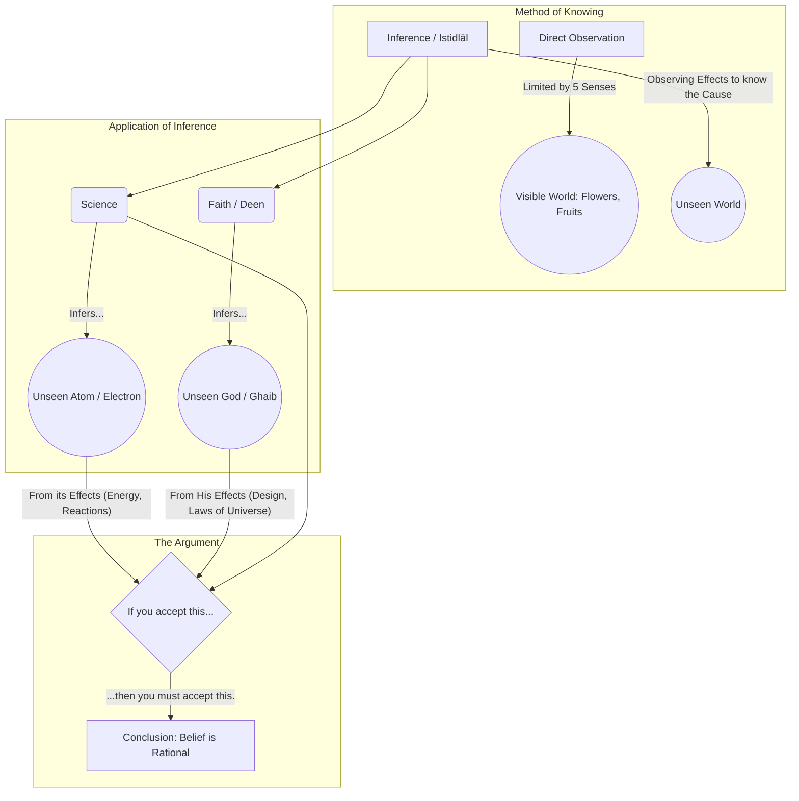

# Study Notes: Lecture 1 (Version 3.0)**

# Lecture 1: The Rational Foundation of Faith - Believing in the Unseen (`Ghaib`)

## A. Core Thesis & Narrative Arc**

*   **Core Thesis:** Belief in the unseen (`Ghaib`) is not an act of blind faith but a deeply rational and scientific process of inference, identical to the method modern science uses to accept fundamental realities (like the atom) that it cannot directly see.
*   **Narrative Arc:** Dr. Qadri begins by addressing the modern skeptic's primary challenge: "I can't believe in what I can't see." He immediately redefines the Islamic concept of `Ghaib` from "non-existent" to "unobservable due to our human limitations." He then builds a powerful parallel, arguing that science itself is fundamentally an act of `Imaan bil Ghaib` (faith in the unseen). He uses the atom as his irrefutable central example. The lecture transitions from this logical, scientific foundation to a spiritual one, anchoring the argument in the wisdom of Sayyidna Ali (RA), thus presenting a complete intellectual and spiritual case for belief.

## B. Primary Arguments [KILLER ARGUMENTS]**

1.  **The Scientific Basis of `Imaan bil Ghaib` (Faith in the Unseen):**
    *   The lecture's main thrust is to demonstrate that the methodology of religious faith and the methodology of advanced science are the same when it comes to unseen realities.
    *   **The Method:** Both rely on **Inference (`Istidlāl`)**. We observe the *effects* of a thing to prove the existence of the unseen *cause*.
    *   **The Killer Example: The Atom.**
        *   **Fact:** No one has ever *seen* an atom with their eyes or an optical microscope.
        *   **Proof:** Its existence is proven by its effects—energy, chemical bonds, particle trails.
        *   **The Logical Bridge:** "If you, as a rational person, accept the existence of the unseen atom based on its effects, then you must, by the same logic, accept the existence of the unseen God based on His effects—the design, laws, and perfect order of the universe." This argument is designed to be a logical checkmate.

2.  **Our Perception is Limited, Not Reality:**
    *   The inability to perceive something is a statement about the **limitation of the tool of perception** (our five senses), not a statement about the non-existence of the reality itself.
    *   The brain is a powerful processor, but it's "data-dependent." If the senses can't detect something (like God), the brain gets no data to process. This isn't a failure of logic; it's a biological fact.

### C. Supporting Arguments & Analogies**

*   **The Flower's Fragrance:** An analogy to explain different modes of perception. You use your eyes for the petals (a visible reality) and your nose for the scent (an invisible reality). You don't deny the scent's existence just because your eyes can't see it. Similarly, God is a reality perceived not by the five senses, but by the `‘aql` (intellect) and `qalb` (heart) through observing His signs.
*   **The Fruit's Taste:** Reinforces the same point. The taste is a real but unseen quality.
*   **The Soul (`Ruh`):** We infer the existence of the unseen soul from its most profound effect: life.

### D. Key Citations: Qur'an & Hadith**

*   **Surah Al-Baqarah (2:2-3):**
    *   **Citation:** "ذَٰلِكَ الْكِتَابُ لَا رَيْبَ ۛ فِيهِ ۛ هُدًى لِّلْمُتَّقِينَ الَّذِينَ يُؤْمِنُونَ بِالْغَيْبِ"
    *   **Paraphrased Content:** "This is the Book in which there is no doubt, a guidance for those who are mindful of God - **Those who believe in the Unseen (`Ghaib`)**."
    *   **Significance:** Dr. Qadri presents this as the very first condition for receiving guidance from the Qur'an. It is the entry point to faith, and he spends the entire lecture arguing that this entry point is rational.

### E. Key Citations: Personalities & Books**

*   **Sayyidna Ali ibn Abi Talib (RA):**
    *   **Paraphrased Quote:** "The people who are truly and firmly grounded in knowledge (`Ar-Rāsikhūn fil-‘Ilm`) are those who affirm the realities that are hidden behind the veils of the unseen. They do this by acknowledging their own inability (`‘ajz`) to grasp these realities directly. This confession of their limitation is what makes their knowledge firm."
    *   **Significance:** This quote provides a powerful spiritual and historical endorsement for the lecture's main argument. It frames intellectual humility as the key to true knowledge.

### F. Visual Learning Aid (Diagram/Table)**

Here is a diagram visualizing the core argument:

### G. Cross-Lecture Connections**

*   **Foundation for All Future Lectures:** This lecture is the philosophical key that unlocks all subsequent lectures. The idea that science can be used to prove faith is established here.
*   **Link to Lecture 5 (The Cell):** The discussion of microscopic realities (atoms, electrons) that are part of `Ghaib` (from a naked-eye perspective) directly sets the stage for the deep dive into the unseen universe of the human cell.
*   **Link to Lecture 6 (Science vs. Religion):** The argument that science and faith use the same logical method directly counters the theme of Lecture 6, which discusses the *false* perception of conflict between them.

### H. Potential Exam Questions**

1.  **[Definition]** Based on Lecture 1, define the Islamic concept of `Ghaib` and explain how it differs from simply "non-existent."
2.  **[Core Argument]** Explain the central analogy Dr. Qadri uses involving the atom to argue that belief in God is a scientific and rational act.
3.  **[Citation]** What is the significance of the quote by Sayyidna Ali (RA) regarding `Ar-Rāsikhūn fil-‘Ilm` in the context of this lecture?
4.  **[Application]** How does Dr. Qadri use the example of a flower's fragrance to explain the limits of human perception?
5.  **[Synthesis]** How does this lecture serve as a foundation for the entire series "Why Believe in God and Why Adopt Religion?"

### I. Memorization Hotspots**

*   **Qur'anic Verse:** Al-Baqarah 2:3 - "alladhīna yu’minūna bil-ghayb."
*   **Critical Definition:** `Ghaib` = Existent but unobservable due to our sensory limits.
*   **Killer Analogy:** **Atom** (known by its effects) **::** **God** (known by His effects/signs).
*   **Key Scientific Terms:** Atom, Electron, Proton, Neutron.
*   **Key Islamic Term:** `Ar-Rāsikhūn fil-‘Ilm` (The firmly grounded in knowledge).
*   **Key Personality:** Sayyidna Ali (RA).
*   **The One-Liner:** Science itself is an act of `Imaan bil Ghaib`.

---

# Comprehensive Study Notes: Lecture 2

## Lecture 2: Empirical Proofs from History and Biology

## A.Core Thesis & Narrative Arc**

*   **Core Thesis:** The Qur'an contains specific, verifiable facts about history, zoology, and botany that were scientifically confirmed only centuries later, serving as empirical proof of its divine origin.
*   **Narrative Arc:** This lecture provides the first concrete evidence to support the framework built in Lecture 1. It presents three powerful case studies. It starts with a historical-archaeological proof (the Pharaoh's mummy), then moves to zoology (the female worker bee), and concludes with botany (pairs in plants). Each case study follows the same pattern: present the Qur'anic claim, present the modern scientific confirmation, and highlight the impossible time gap between the two.

## B.Primary Arguments [KILLER ARGUMENTS]**

1.  **The Impossibility Argument:**
    *   The core of each example is that the knowledge presented in the Qur'an was **humanly impossible** to possess in the 7th century.
    *   There were no tools (microscopes, advanced archaeology), no established scientific knowledge, and no historical records available that could have provided this information to any person, let alone an unlettered one in the Arabian desert.
    *   Therefore, the only possible source for this information is divine revelation.

2.  **The Rebuttal to the "Post-Hoc" Criticism (Finding meaning after the fact):**
    *   Dr. Qadri directly addresses the argument that Muslims are just fitting modern science into ancient verses after the discoveries are made.
    *   **His Counter-Argument:** If this were a valid method, why don't followers of other major religions do the same with their scriptures?
    *   **His Conclusion:** They cannot, because the specific, detailed scientific facts are **uniquely present in the Qur'an** and absent in other texts. For example, the Bible states the Pharaoh's army was completely destroyed, leaving no room to "find" the fact of the body's preservation.

## C.Supporting Arguments & Analogies**

*   **The Need for Dual Expertise:** To fully understand these verses, one needs knowledge of both classical Arabic and modern science. The scientific meaning was locked within the verse until science advanced enough to provide the key. This explains why earlier commentators may not have interpreted these verses in a scientific light.

## D.Key Citations: Qur'an & Hadith**

*   **On the Pharaoh's Body (History/Archaeology):**
    *   **Surah Yunus (10:92):** "فَالْيَوْمَ نُنَجِّيكَ بِبَدَنِكَ لِتَكُونَ لِمَنْ خَلْفَكَ آيَةً"
    *   **Content:** "So today, We will save you **in your body** so that you may be a **sign** (`āyah`) to those who come after you."
    *   **Significance:** This verse makes a unique and specific claim: not just that the Pharaoh would die, but that his physical body would be preserved as a future sign.

*   **On the Worker Bee (Zoology):**
    *   **Surah An-Nahl (16:68-69):** "...أَنِ اتَّخِذِي... وَكُلِي... فَاسْلُكِي..."
    *   **Content:** The verse uses feminine verb forms when addressing the bee: `ittakhidhī` (make your home), `kulī` (eat), `faslukī` (follow the paths).
    *   **Significance:** This correctly identifies the worker bee, responsible for building the hive and making honey, as female.

*   **On Pairs in Plants (Botany):**
    *   **Surah Ya-Sin (36:36):** "سُبْحَانَ الَّذِي خَلَقَ الْأَزْوَاجَ كُلَّهَا مِمَّا تُنبِتُ الْأَرْضُ"
    *   **Content:** "Glory is to Him Who created in **pairs** (`azwāj`) all of that which the earth grows."
    *   **Significance:** It states a universal principle of sexual pairing in the plant kingdom.
    *   **Supporting Verse:** **Surah Ta-Ha (20:53)** reinforces this concept.

## E.Key Citations: Personalities & Books**

*   **Dr. Maurice Bucaille (French Surgeon):**
    *   **The Narrative:** In **1975**, Dr. Bucaille led a team in France to study the mummy of the Pharaoh of the Exodus.
    *   **Scientific Finding:** His forensic analysis confirmed the cause of death was drowning, with evidence of violent shock.
    *   **The Puzzle:** He was baffled how the body could have been recovered from the sea and then meticulously mummified.
    *   **The Biblical Account (Exodus 14:28):** States that of the Pharaoh's pursuing army, "**not so much as one of them remained.**" This account contradicts the existence of the mummy.
    *   **The Qur'anic Revelation:** When shown Surah Yunus 10:92, he was stunned. The Qur'an, revealed over 1200 years after the event and over 1000 years before the mummy's discovery (**1898**), contained the one piece of information missing from all other records: the specific promise of the body's preservation.
    *   **The Result:** This led to his acceptance of Islam and the writing of his famous book, "The Bible, The Qur'an and Science."

*   **Dr. Gary Miller (Canadian Mathematician):**
    *   **His Mission:** He set out to study the Qur'an with the specific goal of finding historical and scientific errors to challenge Muslims in debates.
    *   **His Discovery:** He was struck by the use of feminine verbs for the worker bee in Surah An-Nahl. As a logical person, he knew this was a specific, testable claim.
    *   **The Result:** Upon discovering that science only confirmed this fact in the modern era, it became one of the key proofs that led him to accept Islam in **1978**.

## F.Visual Learning Aid (Table)**

**Table 2.1: Qur'anic Claims vs. Scientific Discovery**

| Case Study | Qur'anic Claim (Revealed ~610-632 CE) | Scientific Confirmation | The Knowledge Gap |
| :--- | :--- | :--- | :--- |
| **Pharaoh's Body** | The body will be saved as a sign. (Surah Yunus 10:92) | Mummy discovered in **1898**. Cause of death confirmed by Dr. Bucaille in **1975**. | ~1250-1350 Years |
| **Worker Bee** | The worker bee is female (indicated by feminine verbs). (Surah An-Nahl 16:68-69) | Confirmed by scientific observation in the **17th Century**. | ~1000 Years |
| **Pairs in Plants** | All vegetation is created in pairs/sexes (`azwāj`). (Surah Ya-Sin 36:36) | Systematically understood by science in the **17th-18th Centuries** (work of Carl Linnaeus). | ~1100 Years |

## G.Cross-Lecture Connections**

*   **Link to Lecture 1:** The examples in this lecture are presented as empirical evidence for the principle of **Inference** established in Lecture 1. We cannot "see" God, but we can see His "signs" (`āyāt`)—and the Pharaoh's body is explicitly called an `āyah`.
*   **Link to Lecture 4 (Embryology):** The method of comparing a Qur'anic statement to a modern scientific fact is the exact same method that will be used in the detailed discussion of embryology. This lecture establishes the pattern.

## H.Potential Exam Questions**

1.  **[Narrative]** Describe the key events that led Dr. Maurice Bucaille to accept the divine origin of the Qur'an, focusing on the difference between the Biblical and Qur'anic accounts of the Pharaoh's fate.
2.  **[Specifics]** What is the linguistic evidence in Surah An-Nahl that the Qur'an identifies the worker bee as female, and why is this significant?
3.  **[Concept]** How does Dr. Qadri counter the argument that Muslims are simply "reading science into" the Qur'an after discoveries are made?
4.  **[Fill-in-the-Blanks]** The mummy of the Pharaoh was discovered in the year ______, but its cause of death was forensically confirmed in the year ______.
5.  **[Definition]** What does the Arabic term `azwāj` refer to in the context of botany as explained in the lecture?

## I.Memorization Hotspots**

*   **Personalities:** Dr. Maurice Bucaille, Dr. Gary Miller.
*   **Dates:** **1898** (Mummy discovered), **1975** (Bucaille's research), **1978** (Miller's conversion).
*   **Qur'anic Verses:**
    *   **Yunus 10:92** (Pharaoh's body saved as a sign).
    *   **An-Nahl 16:68-69** (Feminine verbs for the bee).
    *   **Ya-Sin 36:36** (Pairs/`azwāj` in plants).
*   **Key Comparison:** The Bible says "not one survived," while the Qur'an says the body would be saved. This contrast is a critical point.
*   **The Time Gaps:** Know the approximate 1000+ year gap between revelation and scientific confirmation for the biological examples.

This set of notes is direct, detailed, and structured for high performance. Please review it, and we will proceed to Lecture 3 when you are ready.

---

Excellent. Let's proceed with the same rigorous, exam-focused approach for Lecture 3.

---

### **Comprehensive Study Notes: Lecture 3**

### Lecture 3: The Cosmos - Proofs from Geology and Cosmology

## A.Core Thesis & Narrative Arc**

*   **Core Thesis:** The Qur'an's descriptions of complex geological and cosmological phenomena—such as the function of mountains, the origin of the universe, its ongoing expansion, and its eventual end—are perfectly aligned with 20th and 21st-century scientific discoveries, proving its source must be divine.
*   **Narrative Arc:** Dr. Qadri expands the scope of his argument from the biological to the cosmic. He begins with a geological proof from "within" the Earth (mountains as stabilizers) and then launches into the grand narrative of the universe from its very beginning to its ultimate fate. He systematically presents four key cosmological concepts—the Big Bang, the Expanding Universe, the eventual Big Crunch, and the mathematical precision of the cosmos—and demonstrates how each was described in the Qur'an over 1400 years before being theorized or confirmed by modern science.

## B.Primary Arguments [KILLER ARGUMENTS]**

1.  **The Qur'an's Complete Cosmological Model:**
    *   The lecture's most powerful argument is that the Qur'an doesn't just contain one isolated cosmic fact; it presents a **complete, coherent, and chronologically correct model of the universe's lifecycle.**
    *   This model includes:
        1.  **A Singular Origin:** The universe began from a single, unified point (`ratqan`).
        2.  **A Violent Separation:** This point was "torn apart" (`fataqnāhumā`).
        3.  **Continuous Expansion:** The universe has been expanding ever since (`la-mūsi‘ūn`).
        4.  **An Eventual Contraction/End:** The expansion will cease, and the universe will "return" (`dhātil-raj‘`) towards its origin, leading to its end.
    *   This complete narrative, matching the modern scientific timeline, is presented as statistically impossible to have been a lucky guess.

2.  **The Argument from Scientific Progression:**
    *   Dr. Qadri highlights the slow, step-by-step progression of scientific understanding to emphasize the Qur'an's miraculous nature.
    *   **Timeline:**
        *   **Until ~1915:** All of science, including **Isaac Newton**, believed in a **static, unchanging universe.**
        *   **~1915:** **Albert Einstein** theorized a dynamic universe but couldn't prove expansion.
        *   **1929:** **Edwin Hubble** provided the first proof of the **expanding universe.**
        *   **~1965:** The **Big Bang** theory was solidified with the discovery of cosmic microwave background radiation.
    *   **The Killer Point:** The Qur'an was not just slightly ahead of its time; it was ahead of the greatest scientific minds (Newton, Einstein) by over a millennium. It described a reality that was the complete opposite of what all of humanity believed for most of history.

## C.Supporting Arguments & Analogies**

*   **The Earth's Motion:** The Qur'anic verses about mountains stabilizing the Earth "lest it shake with you" (`an tamīda bikum`) are presented as an implicit proof that the Qur'an acknowledges the Earth is in constant, high-speed motion—a fact not accepted in Europe until centuries later.

## D.Key Citations: Qur'an & Hadith**

*   **On Mountains (Geology):**
    *   **Surah An-Naba (78:7):** "وَالْجِبَالَ أَوْتَادًا"
    *   **Content:** "And the mountains as **pegs/stakes** (`awtād`)."
    *   **Significance:** Describes the deep roots of mountains that stabilize the Earth's crust.
    *   **Supporting Verse:** **Surah An-Nahl (16:15):** "And He has placed firm mountains on the earth lest it should shake with you (`an tamīda bikum`)."

*   **On the Big Bang (Cosmology):**
    *   **Surah Al-Anbiya (21:30):** "أَنَّ السَّمَاوَاتِ وَالْأَرْضَ كَانَتَا رَتْقًا فَفَتَقْنَاهُمَا"
    *   **Content:** "...that the heavens and the earth were a **joined entity** (`ratqan`), then We **tore them apart** (`fa-fataqnāhumā`)."
    *   **Significance:** A precise description of the universe originating from a single point (singularity) and then exploding outwards.

*   **On the Expanding Universe (Cosmology):**
    *   **Surah Adh-Dhariyat (51:47):** "وَالسَّمَاءَ بَنَيْنَاهَا بِأَيْدٍ وَإِنَّا لَمُوسِعُونَ"
    *   **Content:** "And the heaven We built with strength, and indeed, We are **[its] expander** (`la-mūsi‘ūn`)."
    *   **Significance:** An explicit statement of the ongoing expansion of the universe.

*   **On the Big Crunch / End of the Universe (Cosmology):**
    *   **Surah At-Tariq (86:11):** "وَالسَّمَاءِ ذَاتِ الرَّجْعِ"
    *   **Content:** "By the heaven that **returns** (`dhātil-raj‘`)."
    *   **Significance:** Dr. Qadri interprets this as the universe contracting and returning to its origin after the expansion phase ends.

*   **On the Mathematical Precision of the Universe:**
    *   **Surah Ar-Rahman (55:5):** "الشَّمْسُ وَالْقَمَرُ بِحُسْبَانٍ"
    *   **Content:** "The sun and the moon [move] by **precise calculation** (`bi-ḥusbān`)."
    *   **Significance:** This verse is used to show that the Qur'an acknowledges the universe runs on a flawless, mathematically predictable system, which science now calls a "zero-defect" or "intelligent" universe.

## E.Key Citations: Personalities & Books**

*   **Richard Warley (British Police Chief):**
    *   **The Narrative:** A geology graduate, he was reading the Qur'an in **1988** to understand Muslim protestors. He was shocked by the verse describing mountains as "pegs" (`awtād`), a modern geological concept. This specific verse was the primary catalyst for his journey to Islam.
*   **Sir James Jeans (British Scientist):**
    *   **Paraphrased Quote:** "The universe appears to have been designed by a **pure mathematician**."
    *   **Significance:** A leading scientist admitting that the universe's laws are so precise and orderly that they seem to be the product of a supreme intelligence, not random chance.
*   **Stephen Hawking:**
    *   **His Contribution:** His work solidified the idea that the universe had a definite beginning (the Big Bang) and runs on a single, unified set of laws (the "single string theory" or "theory of everything").
    *   **Paraphrased Quote:** He admitted that the precise conditions required for the universe to begin and expand as it did are so finely tuned that it is difficult to explain without invoking an "act of God."

## F.Visual Learning Aid (Diagram)**

**Diagram 3.1: The Qur'an's Cosmological Timeline vs. Science**

```mermaid
graph TD
    subgraph "Qur'anic Model (Revealed ~610-632 CE)"
        A["Origin Point (`ratqan`)<br>Al-Anbiya 21:30"] --> B["Separation (`fataqnāhumā`)<br>Al-Anbiya 21:30"]
        B --> C["Expansion (`mūsi‘ūn`)<br>Adh-Dhariyat 51:47"]
        C --> D["Contraction/Return (`raj‘`)<br>At-Tariq 86:11"]
    end

    subgraph "Scientific Discovery Timeline"
        W["Static Universe Model<br>(Newton, ~1687)"] --> X["Expanding Universe Proof<br>(Hubble, 1929)"]
        X --> Y["Big Bang Theory Solidified<br>(Penzias & Wilson, 1965)"]
        Y --> Z["Big Crunch Theory<br>(Modern Physics)"]
    end

    style A fill:#cce5ff,stroke:#333,stroke-width:2px
    style B fill:#cce5ff,stroke:#333,stroke-width:2px
    style C fill:#cce5ff,stroke:#333,stroke-width:2px
    style D fill:#cce5ff,stroke:#333,stroke-width:2px
```

## G.Cross-Lecture Connections**

*   **Link to Lecture 1:** The argument that God is known by His "effects" is powerfully demonstrated here. The perfectly ordered cosmos is presented as the ultimate "effect" pointing to the Creator.
*   **Link to Lecture 5 (The Cell):** The theme of a "zero-defect," mathematically precise system will be shown to exist not only at the cosmic (macro) level but also at the cellular (micro) level, creating a powerful symmetry in the argument.

## H.Potential Exam Questions**

1.  **[Sequence]** List the four stages of the universe's lifecycle as described in the Qur'an and provide the key Arabic term for each.
2.  **[Comparison]** Contrast the Qur'an's view of the universe with the scientific view held by Isaac Newton and, initially, Albert Einstein.
3.  **[Specifics]** What is the geological significance of the Qur'anic term `awtād` (pegs) when describing mountains?
4.  **[Fill-in-the-Blanks]** The scientific proof for the expanding universe was provided by ________ in the year ______.
5.  **[Concept]** How does the Qur'anic term `bi-ḥusbān` (by precise calculation) relate to modern scientific descriptions of the universe as "intelligent" or "zero-defect"?

## I.Memorization Hotspots**

*   **Arabic Terms:**
    *   `awtād` (pegs/stakes for mountains)
    *   `ratqan` (a single joined entity)
    *   `fataqnāhumā` (We tore them apart)
    *   `mūsi‘ūn` (We are expanding it)
    *   `raj‘` (the return/contraction)
    *   `ḥusbān` (precise calculation)
*   **Key Verses:**
    *   **An-Naba 78:7** (mountains)
    *   **Al-Anbiya 21:30** (Big Bang)
    *   **Adh-Dhariyat 51:47** (Expansion)
    *   **At-Tariq 86:11** (Big Crunch)
*   **Personalities:** Isaac Newton (static universe), Edwin Hubble (expanding universe), Stephen Hawking (fine-tuning).
*   **Key Date:** **1929** (Hubble's discovery of the expanding universe).
*   **The Core Model:** Know the Qur'an's four-stage model of the universe's lifecycle (Origin -> Separation -> Expansion -> Contraction).

These notes provide a comprehensive and structured breakdown of Lecture 3. Please review them, and we will proceed to the highly detailed Lecture 4 when you are ready.

---
---

Excellent. Lecture 4 is arguably the most evidence-dense and impactful lecture in the series, focusing on human embryology. Mastering this section is critical for the exam. Let's proceed with the same level of detail.

---

### **Comprehensive Study Notes: Lecture 4**

#### **Lecture 4: The Miracle Within - The Qur'an on Human Embryology**

## A.Core Thesis & Narrative Arc**

*   **Core Thesis:** The Qur'an's description of the stages of human embryonic development is so detailed, sequential, and scientifically accurate that it constitutes the most powerful and undeniable proof of its divine origin, as this knowledge was entirely inaccessible to humanity until the 20th century.
*   **Narrative Arc:** Dr. Qadri presents this lecture as the climax of his empirical evidence. He first establishes the historical context: for most of human history, knowledge of embryology was based on ancient Greek speculation and was completely wrong. He then establishes a crucial date—**1941**—as the year modern science began to correctly stage embryonic development. With this timeline established, he walks the audience step-by-step through the Qur'an's description of creation, from the initial drop (`nutfah`) to the fully formed fetus, demonstrating at each stage how the Qur'anic terminology is a perfect scientific fit. The narrative is framed around the work and testimony of Dr. Keith L. Moore, a world-leading, non-Muslim authority on the subject.

## B.Primary Arguments [KILLER ARGUMENTS]**

1.  **The Argument from Inaccessible Knowledge:**
    *   This is the central pillar. The processes described occur inside the womb and are **microscopic**.
    *   Without microscopes and modern imaging technology, it was **impossible** for any human in the 7th century to observe these stages.
    *   He directly refutes the skeptical argument that someone could have dissected a pregnant woman, pointing out that the early stages (`nutfah`, `alaqah`) are invisible to the naked eye. The information could not have been obtained empirically by any human at that time.

2.  **The Argument from Correct Terminology and Sequence:**
    *   The Qur'an doesn't just mention development; it provides a **specific sequence of stages** using highly precise Arabic terms.
    *   Dr. Qadri, citing Dr. Keith Moore, shows that not only is the **sequence correct** (Nutfah -> Alaqah -> Mudghah -> Bones -> Flesh), but the **descriptive terms themselves** are scientifically perfect metaphors for the embryo's appearance at each stage. This dual accuracy—in both sequence and description—is presented as statistically impossible to be a coincidence.

## C.Supporting Arguments & Analogies**

*   **The Historical Ignorance:** Dr. Qadri emphasizes that until the 16th-17th centuries, all scientific thought (including in Europe) was dominated by Aristotle's incorrect ideas about embryology (e.g., that a fetus forms from menstrual blood). The Qur'an stood alone with the correct information for over a thousand years.

## D.Key Citations: Qur'an & Hadith**

*   **The Main Embryology Verse:**
    *   **Surah Al-Mu'minun (23:12-14):** This is the single most important citation in this lecture.
    *   **Content:** "وَلَقَدْ خَلَقْنَا الْإِنسَانَ مِن سُلَالَةٍ مِّن طِينٍ ثُمَّ جَعَلْنَاهُ **نُطْفَةً** فِي قَرَارٍ مَّكِينٍ ثُمَّ خَلَقْنَا النُّطْفَةَ **عَلَقَةً** فَخَلَقْنَا الْعَلَقَةَ **مُضْغَةً** فَخَلَقْنَا الْمُضْغَةَ **عِظَامًا** فَكَسَوْنَا الْعِظَامَ **لَحْمًا** ثُمَّ أَنشَأْنَاهُ خَلْقًا آخَرَ فَتَبَارَكَ اللَّهُ أَحْسَنُ الْخَالِقِينَ"
    *   **Translation of Key Stages:** "...Then We made him a **drop of fluid (`nutfah`)**... then We made the `nutfah` into a **clinging substance (`alaqah`)**, then We made the `alaqah` into a **chewed-like lump (`mudghah`)**, then We made the `mudghah` into **bones (`idhāman`)**, then We clothed the bones with **flesh (`lahman`)**..."

*   **On the `Nutfah` (The Zygote):**
    *   **Surah Al-Insan (76:2):** Describes it as `nutfatin amshājin` (a drop of **mingled** fluids). This points to the combination of male and female gametes.
    *   **Surah An-Najm (53:45-46):** States that from this `nutfah`, the two sexes, male and female, are created. This points to sex determination occurring at the very first stage.

*   **On the Three Veils of Darkness:**
    *   **Surah Az-Zumar (39:6):** "يَخْلُقُكُمْ فِي بُطُونِ أُمَّهَاتِكُمْ خَلْقًا مِّن بَعْدِ خَلْقٍ فِي **ظُلُمَاتٍ ثَلَاثٍ**"
    *   **Content:** "He creates you in the wombs of your mothers, creation after creation, within **three veils of darkness**."

## E.Key Citations: Personalities & Books**

*   **Dr. Keith L. Moore (University of Toronto):**
    *   **His Stature:** Presented as a world-leading authority in anatomy and embryology, a non-Muslim scientist whose textbook, "The Developing Human," is used in medical schools globally. His testimony is therefore objective and highly credible.
    *   **His Testimony (Paraphrased):** "I was amazed by the scientific accuracy of the Qur'an's statements on embryology... These descriptions could not have been based on the scientific knowledge of the 7th century... It is clear to me that these statements must have come to Muhammad from God, because most of this knowledge was not discovered until many centuries later."
    *   **His Contribution:** He incorporated the Qur'anic descriptions into later editions of his textbook and publicly presented these findings at scientific conferences.

*   **Streeter (Scientist):**
    *   **Significance:** Developed the first modern, systematic method for staging human embryos in **1941**. This date is used as the benchmark to create the ~1300-year "knowledge gap."

## F.Visual Learning Aid (Table)**

**Table 4.1: The Qur'anic Stages of Embryology vs. Modern Science**

| Qur'anic Term | Literal Meaning | Scientific Description & Significance |
| :--- | :--- | :--- |
| **`Nutfah`** | A drop of mingled fluid | The **Zygote**, formed by the mingling of male sperm and female ovum. Sex is determined at this stage. |
| **`Alaqah`** | Leech, Clinging Thing, Blood Clot | The **Implanting Blastocyst**. It visually **resembles a leech**, **clings** to the uterine wall, and derives nourishment from the mother's blood (like a leech). |
| **`Mudghah`** | Chewed-like Lump | The **Somite Stage Embryo**. The somites (blocks of tissue) on the embryo's back look exactly like **teeth marks** on a piece of chewed substance. |
| **`Idhāman`** | Bones | The **Skeletal System Formation**. The skeleton forms as a cartilage model before the muscles. |
| **`Lahman`** | Flesh / Muscle | **Muscular System Formation**. The muscles develop *after* the bone framework and then "clothe" the skeleton. The sequence is perfect. |
| **`Dhulumātin Thalāth`** | Three Veils of Darkness | The **Three Protective Layers** around the fetus: 1) Abdominal Wall, 2) Uterine Wall, 3) Amnio-chorionic Membrane. |

## G.Cross-Lecture Connections**

*   **Link to Lecture 1:** This entire lecture is a case study of knowing the unseen (`Ghaib`) through its signs (`āyāt`). The development in the womb was `Ghaib` for 1300 years.
*   **Link to Lecture 2:** The narrative of a prominent Western scientist (Dr. Keith Moore) being convinced by the Qur'an directly parallels the story of Dr. Maurice Bucaille. This reinforces the theme that objective, non-Muslim experts are affirming the Qur'an's divinity.
*   **Link to Lecture 5 (The Cell):** The starting point of this lecture, the `nutfah` (zygote), is the `nafs wahidah` (single cell/soul) that will be the focus of the next lecture. This provides a perfect transition.

## H.Potential Exam Questions**

1.  **[Sequence]** List the five primary stages of embryonic development mentioned in Surah Al-Mu'minun in the correct order, providing both the Arabic term and its scientific meaning.
2.  **[Analysis]** Explain the triple meaning of the term `Alaqah` and how each meaning is scientifically accurate for that stage of the embryo.
3.  **[Historical Context]** Why is the year **1941** so significant in Dr. Qadri's argument about the Qur'an and embryology?
4.  **[Citation]** Who is Dr. Keith L. Moore, and what was his conclusion regarding the embryological statements in the Qur'an?
5.  **[Short Answer]** What are the "three veils of darkness" mentioned in Surah Az-Zumar, according to modern anatomy?

## I.Memorization Hotspots**

*   **The Key Verse:** **Surah Al-Mu'minun (23:12-14).** You should be able to list the stages from this verse from memory.
*   **The Five Stages (Arabic & English):**
    1.  **`Nutfah`** (Zygote)
    2.  **`Alaqah`** (Leech-like, clinging thing)
    3.  **`Mudghah`** (Chewed-like lump)
    4.  **`Idhāman`** (Bones)
    5.  **`Lahman`** (Flesh)
*   **The Key Personality:** **Dr. Keith L. Moore.** His name is synonymous with this proof.
*   **The Key Date:** **1941** (Streeter's system; the start of modern embryology).
*   **The Three Veils:** Abdominal wall, Uterine wall, Amnio-chorionic membrane.
*   **The Killer Argument:** The knowledge is **microscopic** and therefore was **impossible** for any human to have observed in the 7th century.

This lecture is packed with testable facts. Focus on memorizing the specific terms, their meanings, and the sequence. The narrative of Dr. Keith Moore is the story that ties it all together. When you're ready, we'll move to Lecture 5.

---
---

Excellent. We now move from the creation of a single human to the universe that exists within every human—the cell. This lecture connects the grand scale of the cosmos (Lecture 3) to the microscopic scale, arguing for a unified, intelligent design.

---

### **Comprehensive Study Notes: Lecture 5**

#### **Lecture 5: The Universe Within - The Miraculous Human Cell**

## A.Core Thesis & Narrative Arc**

*   **Core Thesis:** The single human cell is not a simple biological blob but a hyper-complex, intelligently designed "city" operating with zero-defect precision. Its intricate systems—from energy production and communication to defense and genetic programming—serve as a powerful sign (`āyah`) of a conscious, omniscient Creator, making the theory of accidental, unguided evolution untenable.
*   **Narrative Arc:** Dr. Qadri shifts the audience's perspective from the macroscopic (cosmos, embryology) to the microscopic. He begins by establishing the staggering scale of the cellular world (100 trillion cells per person). He then uses the powerful analogy of a "cell as a city" to explain its complex internal functions in a simple, relatable way. He details the roles of DNA, mitochondria, and the immune system, constantly posing the rhetorical question: "Could this intricate, flawless system be the result of a random accident?" He concludes that the cell's purposeful design and perfect order is a direct reflection of God's attributes as the ultimate Planner (`Al-Musawwir`), Programmer (`Al-Qādir`), and Sustainer (`Ar-Rabb`).

## B.Primary Arguments [KILLER ARGUMENTS]**

1.  **The Argument from Staggering, Ordered Complexity:**
    *   The sheer numbers involved in the human body defy chance. A system of **100 trillion** individual units (cells) working in perfect harmony cannot be accidental.
    *   Each cell is itself a universe, containing trillions of atoms and millions of molecules, all performing specific functions.
    *   **The Killer Point:** This is not chaotic complexity; it is **ordered complexity**. Every component has a purpose, a function, and works in concert with the whole. Random processes produce chaos; intelligence produces order. The cell is the ultimate proof of order.

2.  **The Argument from Intelligent Design & Programming (DNA):**
    *   The DNA within each cell's nucleus is presented as the ultimate proof of a "Programmer."
    *   It is not just a chemical; it is a **code**, an information storage system of unimaginable density. It contains the complete blueprint for building and operating the entire human body.
    *   **The Killer Analogy:** DNA is like a vast digital library or a complex computer program. A library or a program requires an author or a programmer. Therefore, DNA requires a "Programmer"—God. The idea that a code of such complexity could write itself through random mutations is presented as logically absurd.

3.  **The Argument from "Zero-Defect" Management:**
    *   The systems within the body (cellular regeneration, immune response, energy regulation) operate with a level of perfection that human management systems can only dream of.
    *   **Example:** Every minute, ~300 million cells die and are replaced by exactly ~300 million new cells. This perfect balance maintains the body's integrity. There is no "overproduction" or "shortfall."
    *   This flawless, self-regulating system points to an omniscient Manager who oversees the entire process.

## C.Supporting Arguments & Analogies**

*   **The Cell as a Fortified City:** This is the central analogy of the lecture.
    *   **City Walls/Security:** The cell membrane, which intelligently allows nutrients in and keeps threats out.
    *   **Power Plants:** The **Mitochondria**, which generate energy (ATP) for the cell to function.
    *   **Central Government/Library:** The **Nucleus**, containing the **DNA** blueprint.
    *   **Factories:** Ribosomes, which build proteins based on instructions from the DNA.
    *   **Army/Police Force:** The **Immune System** (White Blood Cells, Antibodies) which patrols the body and destroys invaders.
    *   **Transportation/Logistics:** The bloodstream, delivering oxygen and nutrients.

## D.Key Citations: Qur'an & Hadith**

*   **On the Origin from a Single Cell:**
    *   **Surah An-Nisa (4:1):** "يَا أَيُّهَا النَّاسُ اتَّقُوا رَبَّكُمُ الَّذِي خَلَقَكُم مِّن **نَّفْسٍ وَاحِدَةٍ**"
    *   **Content:** "O mankind, fear your Lord, who created you from a **single soul/entity (`nafsin wāhidah`)**."
    *   **Significance:** Dr. Qadri interprets `nafs wahidah` here not just as Adam, but also in a biological sense as the first zygote (the single cell) from which every individual is created.

*   **On God as the Ultimate Programmer and Designer:**
    *   **Surah Al-Furqan (25:2):** "وَخَلَقَ كُلَّ شَيْءٍ فَقَدَّرَهُ تَقْدِيرًا"
    *   **Content:** "He created all things and **determined them with precise determination** (`qaddarahū taqdīrā`)."
    *   **Significance:** This is presented as the Qur'anic description of the genetic programming found in DNA. `Taqdīr` (determination/programming) is the divine act of embedding the blueprint for life into the cell.
    *   **Surah Al-Infitar (82:7-8):** "الَّذِي خَلَقَكَ فَسَوَّاكَ فَعَدَلَكَ فِي أَيِّ صُورَةٍ مَّا شَاءَ رَكَّبَكَ"
    *   **Content:** "Who created you, fashioned you perfectly, and proportioned you? In whatever form He willed has He assembled you."
    *   **Significance:** This verse is broken down to show the stages of divine action: `Khalaqa` (Creation), `Sawwāka` (Perfecting/Fashioning), `‘Adalaka` (Proportioning/Balancing), `Rakkabaka` (Assembling). This sequence mirrors the process of building a complex organism from a single cell's blueprint.

## E.Key Citations: Personalities & Books**

*   While this lecture is less reliant on specific non-Muslim personalities than others, it builds upon the biological framework established by **Dr. Keith L. Moore** in the previous lecture. The implicit argument is that the complexity described here is what astounded scientists like him.

## F.Visual Learning Aid (Table)**

**Table 5.1: The Cell as an Intelligently Designed City**

| City Component | Cellular Equivalent | Function & "Miraculous" Aspect | Qur'anic Concept |
| :--- | :--- | :--- | :--- |
| **Central Government / Blueprint Library** | **Nucleus / DNA** | Contains the complete, error-free code for the entire organism. Proof of a "Programmer." | `Taqdīr` (Precise Determination) |
| **Power Plants** | **Mitochondria** | Generates energy 24/7 with no "load shedding." Self-regulating. | `Rabb` (Sustainer) |
| **Security Force / Army** | **Immune System (White Blood Cells)** | Identifies and destroys millions of specific enemies without harming "citizens" (body cells). | `Al-Hāfidh` (The Guardian) |
| **City Walls / Border Control** | **Cell Membrane** | Intelligently filters what comes in and out, maintaining perfect internal balance. | `‘Adl` (Balance/Proportion) |
| **Logistics & Transportation** | **Bloodstream** | Delivers trillions of oxygen molecules and nutrients to the correct "addresses" without fail. | `Rizq` (Provision) |
| **Waste Management** | **Lymphatic System / Excretory System** | Efficiently removes trillions of dead cells and toxic waste products. | `Tathīr` (Purification) |

## G.Cross-Lecture Connections**

*   **Link to Lecture 3 (Cosmology):** This lecture creates a powerful symmetry. The "zero-defect," mathematically precise design found in the vastness of the cosmos is mirrored here in the microscopic world of the cell. The same divine signature of order and intelligence is shown to be present at all scales.
*   **Link to Lecture 4 (Embryology):** This lecture is a deep dive into the `nafs wahidah` (single cell/zygote) that was the starting point of the embryology discussion. It explains *what* is inside that first cell that allows the entire developmental process to unfold perfectly.
*   **Refutation of Darwinism:** Although not the main focus, this entire lecture serves as an implicit refutation of unguided, random evolution (Darwinism). The argument is that the "irreducible complexity" of the cell could not have arisen from a series of random accidents; it must have been designed as a whole from the beginning.

## H.Potential Exam Questions**

1.  **[Analogy]** Using the "cell as a city" analogy, describe the functions of the Nucleus/DNA and the Mitochondria.
2.  **[Data]** According to the lecture, approximately how many cells make up the human body, and how many of these cells die and are replaced every minute?
3.  **[Concept]** How does Dr. Qadri use the concept of DNA to argue for the existence of an intelligent "Programmer"?
4.  **[Citation]** Which Qur'anic term does the lecture connect to the concept of genetic programming in DNA, and which verse is it from? (Answer: `taqdīrā` from Surah Al-Furqan 25:2).
5.  **[Synthesis]** Explain how the "zero-defect" management observed in the cellular world argues against the idea of accidental or random creation.

## I.Memorization Hotspots**

*   **Key Numbers:** **100 trillion** cells in the body; **300 million** cells replaced per minute.
*   **The Killer Analogy:** **The Cell is a City.** Know the key components (DNA = Blueprint, Mitochondria = Power Plant, Immune System = Army).
*   **The Central Proof:** **DNA** is a complex **code** that requires a **Programmer**.
*   **Key Qur'anic Terms:**
    *   **`Nafsin wāhidah`** (The single cell/soul of origin).
    *   **`Taqdīr`** (Precise determination/programming).
*   **Key Verses:**
    *   **An-Nisa 4:1** (origin from a single entity).
    *   **Al-Furqan 25:2** (God's precise programming).
*   **The Core Idea:** The cell displays **ordered, purposeful, irreducible complexity**, which is the hallmark of intelligent design, not random chance.

This lecture provides some of the most compelling and memorable arguments in the series. Mastering the "cell as a city" analogy and the argument from DNA is crucial. When you are ready, we will conclude with the final lecture.

---
---

Excellent. We have reached the final lecture. This session ties everything together, moving from the scientific evidence to the historical and philosophical context, and finally culminating in a spiritual call to action.

---

### **Comprehensive Study Notes: Lecture 6**

#### **Lecture 6: The Historical Truth and the Final Call**

## A.Core Thesis & Narrative Arc**

*   **Core Thesis:** Modern atheism and the perceived conflict between science and religion are not universal truths but are the specific historical products of the West's long and bitter war between the Church and scientific inquiry. Islam has no such conflict; in fact, it was the champion of science during Europe's "Dark Ages." Therefore, applying Western anti-religious arguments to Islam is a fundamental historical and philosophical mistake.
*   **Narrative Arc:** Dr. Qadri zooms out from specific scientific proofs to the grand sweep of intellectual history. He constructs a powerful dichotomy: the European "Dark Ages," where the Church suppressed science, versus the Islamic "Golden Age," where the Qur'an inspired a scientific revolution. He uses the testimony of Western historians to validate this claim, proving that Islam is not the enemy of science but its historical ally. He then explains the limits of science ("How," not "Why") and concludes the entire six-part series by transitioning from intellectual conviction (`‘ilm`) to a heartfelt call for spiritual connection and love (`‘ishq`) for the Creator, illustrated with stories of great Islamic mystics.

## B.Primary Arguments [KILLER ARGUMENTS]**

1.  **The Historical Argument: Islam is Pro-Science, The Church was Anti-Science.**
    *   This is the lecture's central historical claim, designed to decouple Islam from the "religion vs. science" debate.
    *   **The European "Dark Ages" (A ~1000-year period):**
        *   Characterized by the Church's monopoly on knowledge.
        *   Scientific inquiry was seen as a threat to religious authority.
        *   Scientists like **Galileo** were persecuted, and knowledge stagnated.
    *   **The Islamic "Golden Age" (Roughly 8th to 14th centuries):**
        *   Simultaneously, the Muslim world was experiencing a scientific renaissance.
        *   This was directly inspired by the Qur'an's first command, **`Iqra` (Read!)**, and its repeated calls for observation and reflection.
        *   Muslims led the world in medicine, mathematics (algebra), optics, astronomy, and chemistry.
    *   **The Killer Point:** Modern atheism is a **reactionary movement** against the Church's historical suppression of science. It is a local European phenomenon, not a universal truth. Applying its conclusions to Islam—a religion with the opposite history—is illogical.

2.  **The Philosophical Argument: Science Answers "How," Religion Answers "Why."**
    *   This argument defines the proper domains of science and religion to show they are not in conflict but are complementary.
    *   **The Domain of Science:** To describe the **mechanisms** of the universe. It can tell you *how* gravity works, *how* a cell divides, *how* the universe expands. It describes the **Laws of Nature**.
    *   **The Domain of Religion:** To explain the **purpose and origin** of those mechanisms. It answers *why* the universe exists, *who* authored the Laws of Nature, and *what the ultimate purpose* of our existence is.
    *   **Conclusion:** Science can describe the "grammar" of the universe, but it cannot explain who the "author" is. To know the author, you need revelation.

## C.Supporting Arguments & Analogies**

*   **The Islamic Roots of the European Renaissance:** Dr. Qadri argues that the European Renaissance was not a self-generated event. It was sparked by the translation of Arabic scientific and philosophical texts into Latin, which re-introduced classical knowledge and the scientific method to Europe via Muslim Spain (Al-Andalus) and Sicily.
*   **The Flaw of Darwinism:** Presented as a key part of the anti-religious project. By reducing humans to evolved animals, it aims to strip them of their special status, soul, morality, and accountability before God. Dr. Qadri notes that it remains a "theory," not a proven "law," because it has significant scientific gaps (e.g., missing links).

## D.Key Citations: Qur'an & Hadith**

*   **The First Revelation:**
    *   **Surah Al-Alaq (96:1-5):** "اقْرَأْ بِاسْمِ رَبِّكَ الَّذِي خَلَقَ..."
    *   **Content:** "**Read!** In the name of your Lord who created..."
    *   **Significance:** The very first command of the Qur'an was not about prayer or ritual, but about reading, knowledge, and creation. This is presented as the foundational charter for Islam's pro-science stance.

## E.Key Citations: Personalities & Books**

*   **Key Muslim Scientists (Examples of the Golden Age):**
    *   **Ibn Sina (Avicenna):** Medicine (His "Canon of Medicine" was a standard European medical text for 500+ years).
    *   **Al-Khwarizmi:** Mathematics (Father of Algebra).
    *   **Ibn al-Haytham (Alhazen):** Optics (Father of the modern scientific method).
    *   **Jabir ibn Hayyan (Geber):** Chemistry.
*   **Key Western Historians (Providing "Objective" Proof):**
    *   **Philip K. Hitti:** Author of "History of the Arabs." Quoted as confirming that scientific knowledge flowed *from* the Islamic world *to* Europe.
    *   **W. Montgomery Watt:** Author of "The Influence of Islam on Medieval Europe." Quoted as stating that for centuries, European science was little more than an extension of Arab science.
*   **Key Spiritual Figures (The Final Call to `‘Ishq`):**
    *   **Rabia Basri, Bayazid Bastami, Bishr Hafi:** Stories of these mystics are used to transition the audience from the intellectual (`‘ilm`) to the spiritual (`‘ishq`). Their lives exemplify a state where belief in God is not just a mental assent but an all-consuming love and a lived reality.

## F.Visual Learning Aid (Table)**

**Table 6.1: The Historical Dichotomy**

| Feature | Islamic Civilization (Golden Age) | European Civilization (Dark Ages) |
| :--- | :--- | :--- |
| **Source of Authority** | Qur'an & Sunnah | The Church |
| **Stance on Science** | **Promotion:** Inspired by `Iqra`. | **Suppression:** Seen as a threat to authority. |
| **Key Activity** | Discovery, Innovation, Translation (Greek -> Arabic) | Stagnation, Persecution (e.g., Galileo) |
| **Flow of Knowledge** | **Exporting** Science to the World (including Europe) | **Importing** Science from the Muslim World |
| **Outcome** | Scientific Renaissance | "The Dark Ages" |

## G.Cross-Lecture Connections**

*   **The Grand Conclusion:** This lecture is the capstone of the entire series. It takes all the scientific proofs from Lectures 2-5 and places them in a historical context, arguing that this scientific-friendly nature of Islam is not an accident but a core part of its identity from the very beginning.
*   **Answering the "Why":** After five lectures focused on "How" we know God exists (through His signs), this lecture addresses "Why" we should connect with Him, moving from proof to purpose.

## H.Potential Exam Questions**

1.  **[Historical Comparison]** According to Dr. Qadri, what was the fundamental difference in the relationship between religion and science in the Islamic Golden Age versus the European Dark Ages?
2.  **[Cause & Effect]** Explain the historical reasons Dr. Qadri gives for the rise of modern atheism in the West. Why does he argue these reasons do not apply to Islam?
3.  **[Concept]** What is the difference between the questions science can answer ("How?") and the questions religion can answer ("Why?")?
4.  **[Citation]** Name two major Muslim scientists from the Golden Age and the fields they pioneered.
5.  **[Synthesis]** How do the stories of mystics like Rabia Basri serve as a conclusion to a series that was heavily focused on science and logic?

## I.Memorization Hotspots**

*   **The Key Command:** **`Iqra`** (Read!) - The foundation of Islam's pro-science history.
*   **The Two Eras:** **Islamic Golden Age** (pro-science) vs. **European Dark Ages** (anti-science).
*   **The Flow of Knowledge:** Knowledge flowed from the **Muslim World TO Europe** via Spain (Al-Andalus).
*   **Key Muslim Scientists:** Ibn Sina (Medicine), Al-Khwarizmi (Algebra), Ibn al-Haytham (Optics).
*   **Key Western Historians:** Hitti, Watt.
*   **The Philosophical Distinction:** Science = **How?** (Mechanism) vs. Religion = **Why?** (Purpose & Author).
*   **The Final Goal:** The journey from `‘Ilm` (knowledge) -> `Yaqīn` (certainty) -> `‘Ishq` (love).

---
This concludes the comprehensive notes for the entire six-part series. You now have a detailed, structured, and exam-focused guide. The next step is yours: active study, memorization, and self-testing. Good luck

---
---

